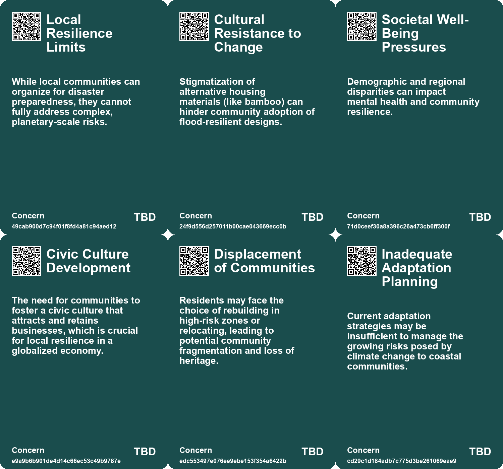
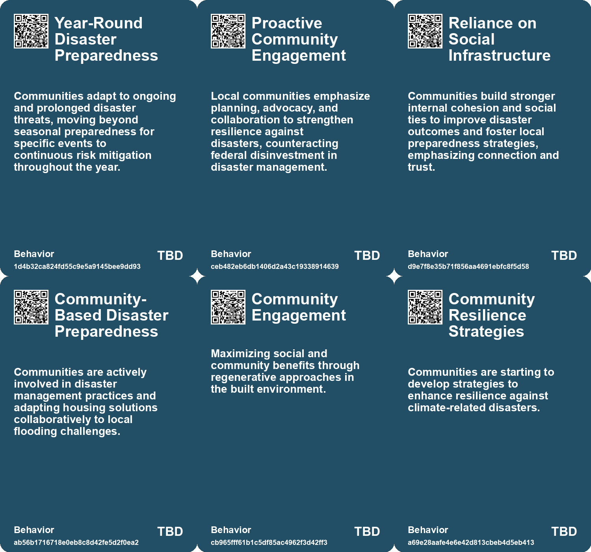
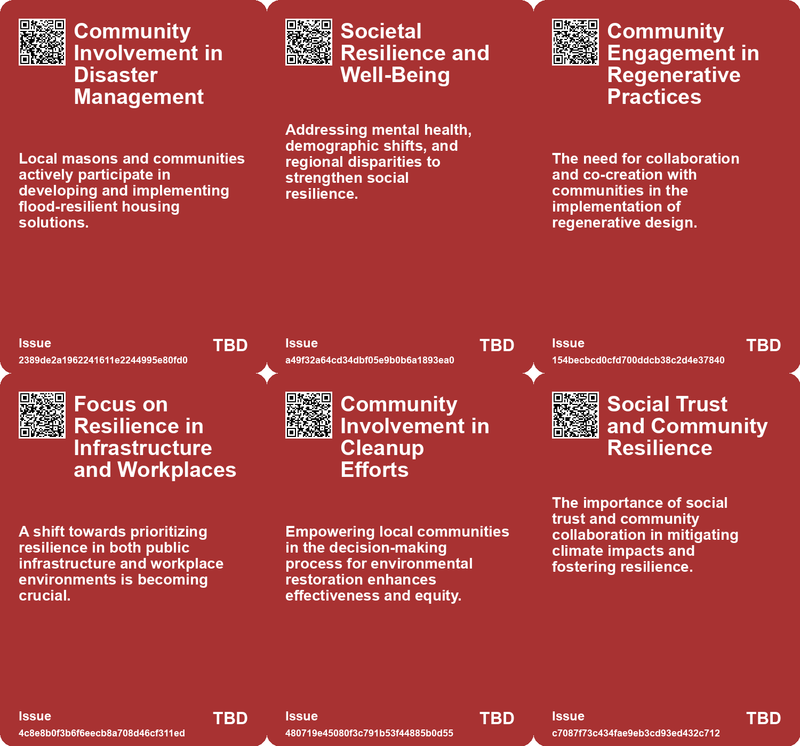
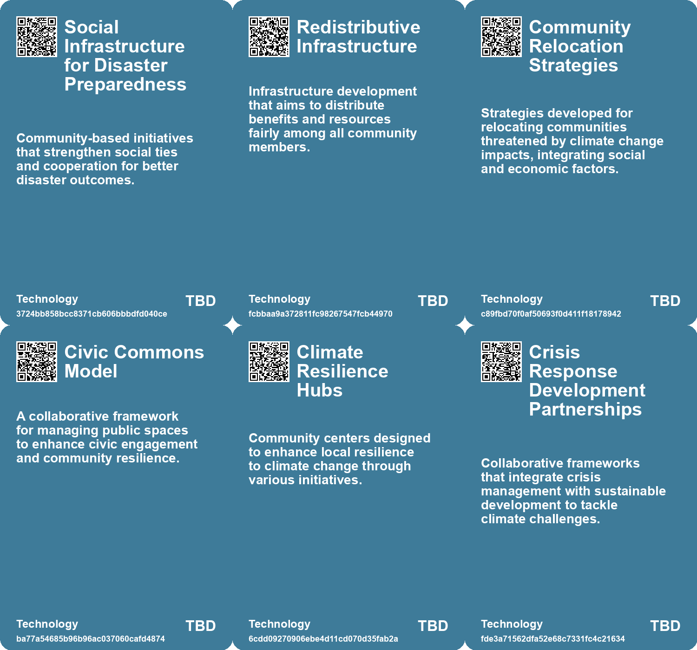

# *Topic*: Community Resilience Development

# Summary

The evolving nature of risk in disaster management highlights the interconnectedness of major events like wildfires and hurricanes. Traditional models that treat these disasters as isolated incidents are becoming obsolete. A modernized risk framework is necessary, emphasizing local resilience and systemic support to effectively address complex risks.

Urban transformation is a key focus in cities across the U.S., where innovative initiatives aim to enhance public spaces through the Reimagining the Civic Commons model. These projects foster collaboration, civic engagement, and socioeconomic mixing, creating vibrant environments that counteract trends of loneliness and economic segregation.

In Assam, India, traditional bamboo houses are being adapted to withstand severe flooding. Local masons are collaborating with organizations to redesign these homes for improved durability and flood resilience. This initiative not only addresses immediate challenges but also sets a precedent for disaster preparedness in flood-prone regions.

Airports are increasingly vulnerable to climate change, necessitating resilience strategies that include retrofitting existing structures and designing new ones to withstand extreme weather. A holistic approach is essential, as airports play a critical role in connectivity and trade. Proactive planning is needed to address future challenges and build resilient infrastructures.

The concept of regenerative design emphasizes the ethical responsibility of humans in relation to nature. It advocates for thoughtful urban planning that restores planetary health and promotes social benefits. Guiding principles for regenerative design include being nature-led, systemic, and equitable, fostering a harmonious coexistence between human and natural systems.

Community resilience is crucial in navigating ongoing crises, as illustrated by grassroots efforts during Hurricane Sandy. Mutual care and solidarity are essential for addressing challenges like climate change and social inequality. Individuals are encouraged to organize and support one another, highlighting the importance of collective action.

The significance of public spaces in urban environments is underscored by research showing a decline in social interactions over the past 30 years. Factors such as technology use and demographic shifts have contributed to this trend. Creating pedestrian-friendly environments can encourage socialization, but urban design must also consider the potential for increased economic segregation.

The challenges of urban forestry management reveal structural problems in meeting tree-planting targets. Municipalities face obstacles related to budget allocations and societal perceptions of trees. Recognizing the interconnectedness of trees and humans is vital for developing resilient urban forest management practices.

Nature-based Solutions (NbS) are essential for addressing climate change and protecting natural capital. In Scotland, scaling up NbS can help achieve net-zero emissions and improve urban air quality. Collaborative efforts are needed to stimulate investments in natural assets and promote sustainable practices.

The historical reshuffling of land ownership raises questions about equity and societal structures. Innovative land reform is necessary to address the challenges posed by climate change and population dynamics. Rethinking property rights can promote social equity and ensure positive outcomes in a rapidly changing world.

Designing urban spaces with children in mind is crucial for creating healthier and more inclusive cities. A child-friendly approach to urban planning can enhance overall city performance and ensure that environments are suitable for future generations. Prioritizing children's needs in policies can lead to better outcomes for all residents.

# Seeds

|    | name                                           | description                                                                                                          | change                                                                                                      | 10-year                                                                                                             | driving-force                                                                                                 |
|---:|:-----------------------------------------------|:---------------------------------------------------------------------------------------------------------------------|:------------------------------------------------------------------------------------------------------------|:--------------------------------------------------------------------------------------------------------------------|:--------------------------------------------------------------------------------------------------------------|
|  0 | Local Resilience Over Federal Authorities      | Communities are shifting responsibility for disaster preparedness and response to local levels.                      | From a federally centralized approach to localized risk management and community action.                    | Local communities will develop tailored response systems while advocating for rooted federal support.               | Community trust in local governance encourages collective action towards risk management.                     |
|  1 | Benefits of Social Infrastructure              | Strong social ties within communities lead to improved disaster outcomes and resilience.                             | Shift from individualistic approaches to recognizing community strengths in disaster response.              | Communities with robust social networks will thrive better in disasters, influencing policy development.            | Community solidarity and connections enhance resource mobilization and shared responsibility.                 |
|  2 | Community-driven Design Innovations            | Local architects collaborate with residents to create flood-resistant housing solutions tailored to community needs. | Shift from solely traditional building methods to community-influenced architectural designs.               | Community collaboration could lead to diverse, resilient designs adapted to various environmental challenges.       | The need for sustainable and innovative solutions in response to changing environmental conditions.           |
|  3 | Local Material Utilization                     | Emphasis on using local and sustainable materials in housing construction can promote resilience.                    | Shift from concrete and modern materials to locally sourced and sustainable options in construction.        | In a decade, eco-friendly building practices might dominate housing solutions in flood-affected areas.              | Environmental sustainability and the need for cost-effective construction methods drive this change.          |
|  4 | Adaptation Planning Imperatives                | Communities are being urged to focus on adaptation planning in light of climate risks.                               | The focus is shifting from reactionary measures to proactive adaptation strategies for coastal communities. | In the next ten years, we may see comprehensive adaptation plans implemented in vulnerable areas to mitigate risks. | The need for sustainable and resilient community planning in the face of climate change is becoming critical. |
|  5 | Community empowerment in environmental cleanup | Training local communities to manage their own environmental restoration projects.                                   | Transition from external remediation efforts to community-led cleanups.                                     | Communities actively involved in local environmental restoration, leading to improved health outcomes.              | Desire for equitable environmental practices and local agency in pollution management.                        |
|  6 | Localized Climate Action                       | Communities mobilizing to address climate impacts through local initiatives and mutual aid.                          | From reliance on governmental support to grassroots efforts and local solutions.                            | In a decade, local initiatives may become the primary means of climate adaptation and resilience.                   | Increased recognition of the limits of government response to climate crises, prompting local action.         |
|  7 | Crisis response and development partnerships   | Emerging strategies combining crisis management with sustainable development in climate risk areas.                  | Shift from reactive crisis management to proactive development partnerships.                                | Sustainable development integrated into climate crisis response frameworks across regions.                          | Recognition that development and climate resilience are interconnected for long-term stability.               |
|  8 | Increased Community Engagement                 | Communities are coming together to address local climate issues more proactively.                                    | From individualistic responses to climate crises to collective community-led initiatives.                   | Local governance and community engagement in climate action may become the norm globally.                           | The necessity for collaborative solutions to increasingly complex climate challenges.                         |
|  9 | Local Empowerment through Design               | Nonprofits focusing on community design initiatives to empower residents in vulnerable areas.                        | Shift from top-down solutions to bottom-up community-driven design and empowerment.                         | Widespread community-led design initiatives enhancing local resilience against climate change.                      | Recognition of the need for localized, culturally relevant solutions to urban challenges.                     |

# Concerns

|    | name                                     | description                                                                                                                                             |
|---:|:-----------------------------------------|:--------------------------------------------------------------------------------------------------------------------------------------------------------|
|  0 | Local Resilience Limits                  | While local communities can organize for disaster preparedness, they cannot fully address complex, planetary-scale risks.                               |
|  1 | Cultural Resistance to Change            | Stigmatization of alternative housing materials (like bamboo) can hinder community adoption of flood-resilient designs.                                 |
|  2 | Societal Well-Being Pressures            | Demographic and regional disparities can impact mental health and community resilience.                                                                 |
|  3 | Civic Culture Development                | The need for communities to foster a civic culture that attracts and retains businesses, which is crucial for local resilience in a globalized economy. |
|  4 | Displacement of Communities              | Residents may face the choice of rebuilding in high-risk zones or relocating, leading to potential community fragmentation and loss of heritage.        |
|  5 | Inadequate Adaptation Planning           | Current adaptation strategies may be insufficient to manage the growing risks posed by climate change to coastal communities.                           |
|  6 | Community Empowerment in Cleanup Efforts | Communities need to be actively involved in cleanup processes to ensure their specific needs and knowledge are acknowledged and used.                   |
|  7 | Indigenous Rights and Climate Refugees   | Indigenous communities facing displacement from traditional lands due to climate change impacts, threatening cultural heritage.                         |
|  8 | Crisis Response Integration              | The need for integrating crisis response strategies with development initiatives to effectively tackle climate-related challenges.                      |
|  9 | Deteriorating Social Trust               | Declining social trust may hinder community resilience and cooperation needed to deal with climate crises.                                              |

# Cards

## Concerns

## Behaviors

## Issue

## Technology

# Links

* [Exploring the Historical and Future Transformations of Land Ownership Worldwide](https://futures.kghosh.me/68a769f0b8d15a4efd8f8136482b9660)
* [2023 Roadshow Highlights: Addressing Cascading Climate Risks and Policy Responses in Europe and Beyond](https://futures.kghosh.me/589c2c554219a6d4ae1ad0c9d1d75a21)
* [Innovative Fungal Solutions for Restoring Contaminated Brownfields in the U.S.](https://futures.kghosh.me/666f5297ceb142394ebf30d39f1d9bc3)
* [Innovative Adaptations of Assam's Chang Ghars for Flood Resilience and Climate Change Challenges](https://futures.kghosh.me/141479bb35e9f52f4fa3fdccd0d2b13a)
* [Navigating Climate Change: The Need for Community Resilience and Social Trust](https://futures.kghosh.me/efa36dc9bd5ddc890866d4ab1e68e71f)
* [Insurance Companies Retreat as Climate Risks Increase in New Zealand Coastal Communities](https://futures.kghosh.me/7c4551fb2f96cce7c0264d6b1f50b669)
* [Evolving Perspectives on Risk Management in the Context of Modern Disasters](https://futures.kghosh.me/cd4f6f65b2486d56699138cd2270044d)
* [Future of Work: Embracing Opportunities and Adapting to Change Over the Next 50 Years](https://futures.kghosh.me/56ddb45deabcdc8b707c7647270e101d)
* [Creating Child-Friendly Urban Spaces: A Path to Better Cities for All](https://futures.kghosh.me/f4247162dcc5eb2eb0d87f1843f993d8)
* [The Impact of Urban Design on Public Space Usage and Social Interaction](https://futures.kghosh.me/2f31d87f3801765f9645d092cadf513a)
* [Building Resilience: Community Care in a 'Long Emergency'](https://futures.kghosh.me/391e3b596ce057606cb79d30d430bf50)
* [Resilience 2.0: A Strategic Foresight Report for the EU's Future Security and Growth](https://futures.kghosh.me/a4b221bd40d351c2ed13fa1bbbc74056)
* [Innovative Approaches to Public Space Transformation in U.S. Cities](https://futures.kghosh.me/465b809f2a993c634a1a239ca0cab476)
* [Enhancing Airport Resilience to Climate Change: Strategies and Solutions for the Future](https://futures.kghosh.me/a6add16457f9bca667941b2ec045b485)
* [Addressing Urban Forestry Challenges: The Case for Trees as Vital Infrastructure](https://futures.kghosh.me/34fb411b34c997f52f550d855c864865)
* [The Conflict Between Optimization and Resilience in Organizational Systems](https://futures.kghosh.me/0362ad6b5f22e9f1a7f14a4b08987bc0)
* [The Urgent Need for Adaptive Reuse in Architecture Today](https://futures.kghosh.me/cf7cc3361b8139c51e3e97835a2da4e4)
* [Connecting Local Economies to Global Markets: Insights from Rosabeth Moss Kanter's Analysis](https://futures.kghosh.me/b0f9303688b3f36feafd21625c5d3461)
* [Scaling Nature-based Solutions in Scotland: A Pathway to Climate Resilience](https://futures.kghosh.me/c7d3021c1b6298e7c47bc455cd7d8391)
* [Exploring the WHO Course on Developing and Sustaining Healthy Cities in 20 Steps](https://futures.kghosh.me/913d0269ceb45988ccb27e8f60b4f3c7)
* [Exploring Regenerative Design for Harmonious Coexistence with Nature](https://futures.kghosh.me/a1acb04c0f65f709ad6c8ce2f0946a51)
* [Reimagining Infrastructure: Towards a Redistributive and Ecologically Sound Future](https://futures.kghosh.me/177a0857ffe0d07d48cd99a269f28a02)
* [Navigating the Climate Crisis: The Importance of Community and Social Trust in Adapting to Change](https://futures.kghosh.me/d1e5dc8cd0f7c34dede43f5429dded3d)
* [Creating a Minimum Viable Community of Practice Through Co-Design Workshops](https://futures.kghosh.me/62917f945a037530e2691fe05a2600ea)