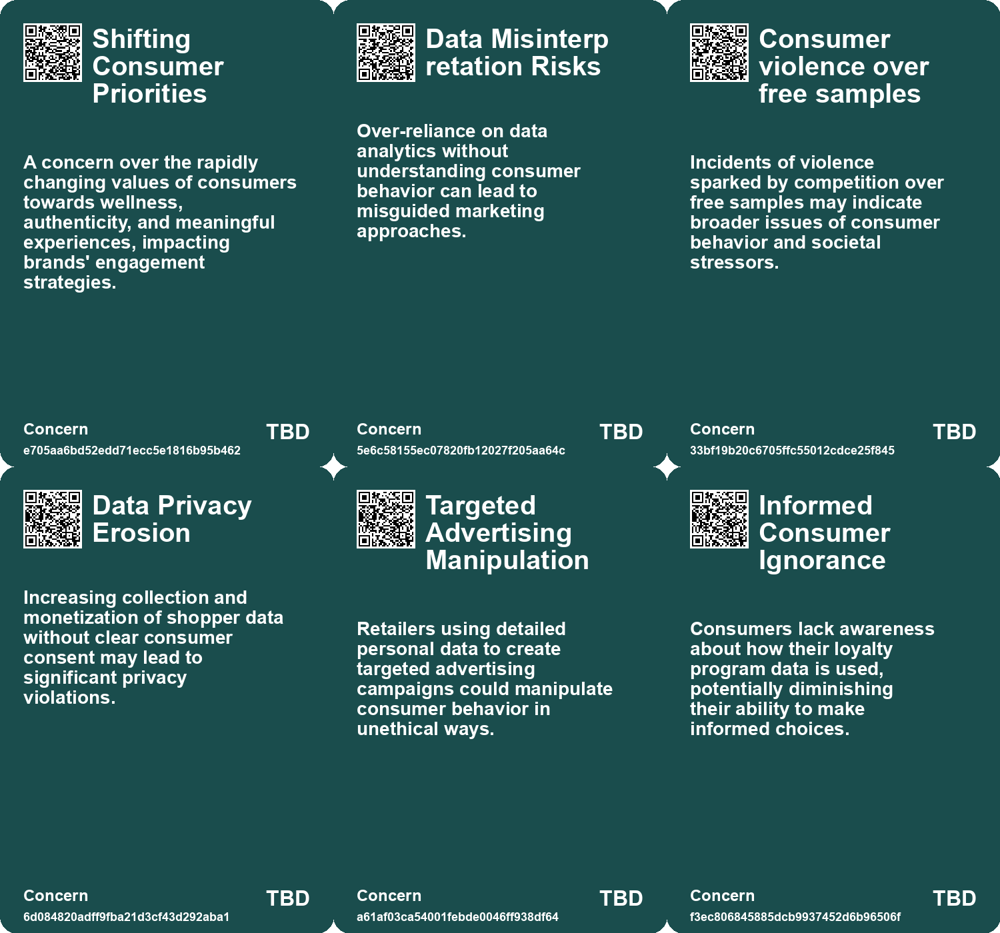
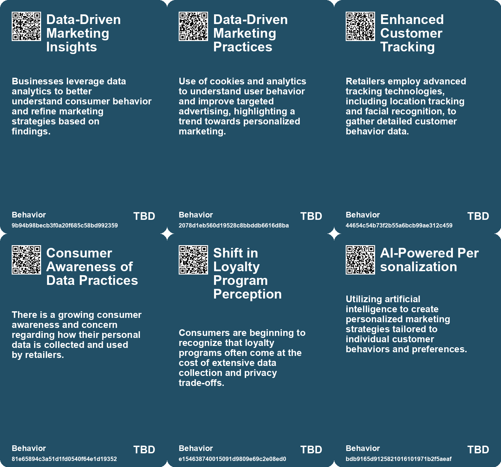
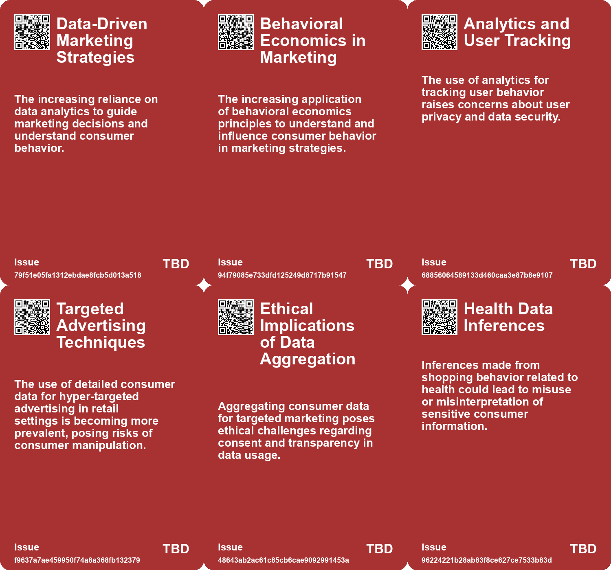
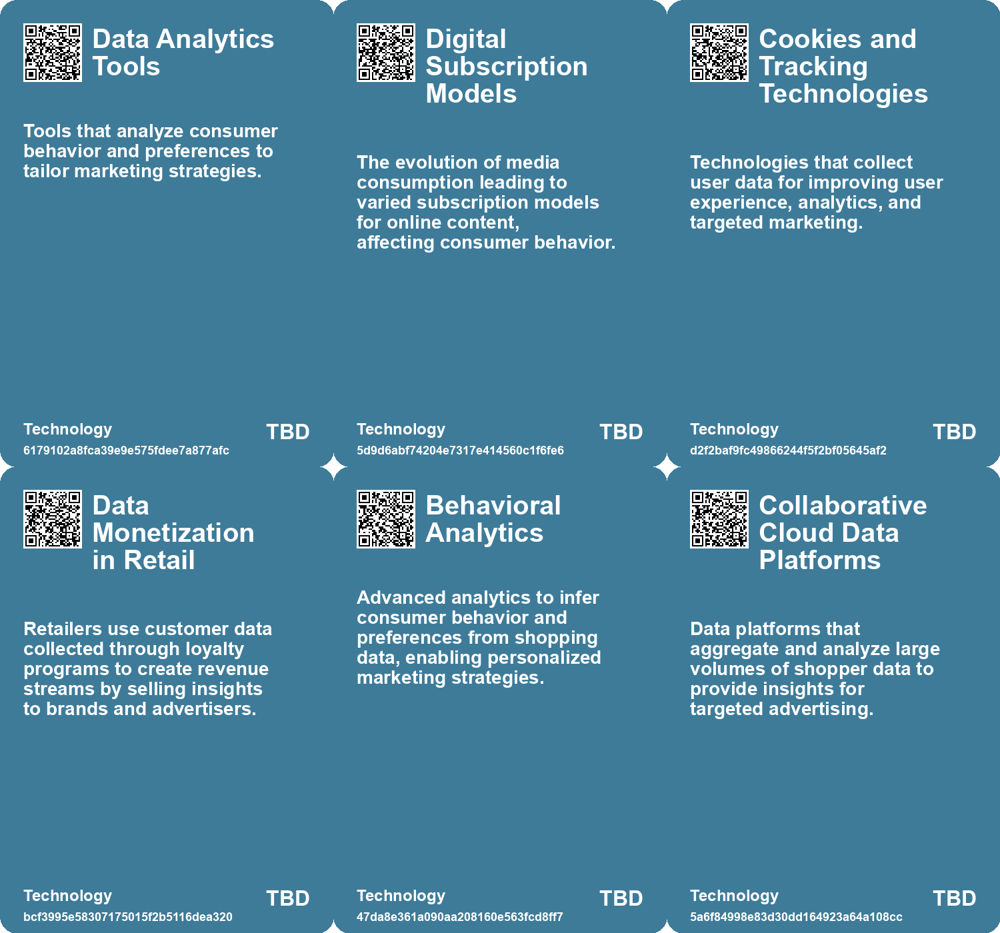

# *Topic*: Consumer Behavior Analytics

# Summary

The intersection of technology, consumer behavior, and data privacy emerges as a central theme across recent discussions. Supermarkets like Kroger exemplify the extensive data collection practices that raise privacy concerns. By analyzing customer data, including demographics and shopping habits, these companies create detailed profiles that are sold to brands for targeted advertising. This practice has drawn scrutiny from regulators, especially in light of Kroger's merger with Albertsons.

The Federal Trade Commission (FTC) is investigating major companies for their use of customer data in dynamic pricing strategies. This investigation highlights the potential for surveillance pricing, where consumers may be charged different prices based on their personal data. The FTC emphasizes the need for transparency in how companies utilize consumer information, reflecting a growing concern over privacy and consumer protection.

Generative AI is another focal point, with businesses grappling with its adoption. While many companies recognize the potential of AI to enhance efficiency and productivity, they often lack a clear strategy for implementation. The use of custom B2B research is recommended to help businesses navigate the complexities of AI integration. Additionally, generative AI's role in automating workflows and improving customer support is gaining attention, particularly for its ability to enhance productivity among less experienced workers.

Cultural shifts towards authenticity and deeper connections are evident as consumers seek brands that resonate with their values. The rise of hyper-personalization, driven by technology and AI, reflects a broader trend towards individualism. This shift is exemplified by the popularity of trends on social media, where personal narratives and unique experiences take precedence over communal values.

The concept of the "symbolic economy" highlights how consumer purchases are increasingly tied to identity performance. In this new landscape, brands are seen as moral authorities, shaping personal values and community identities. This shift is further complicated by the influence of manufactured sentiment in digital spaces, where bot farms distort perceptions and complicate brand health assessments.

Data privacy remains a pressing issue, with numerous examples illustrating the failure of corporations to adequately anonymize personal information. High-profile breaches have raised alarms about the responsibility of tech companies in safeguarding user data. The ongoing challenges surrounding data de-identification underscore the need for better privacy protections in an increasingly digital world.

Amidst these developments, the concept of "free" continues to influence consumer behavior. The allure of free samples and services often leads to irrational decision-making, demonstrating the psychological impact of perceived value. This phenomenon is evident in various sectors, from grocery stores to online content, where the promise of "free" can drive significant consumer engagement.

As governments strive to enhance productivity through technology, the integration of AI into public services is becoming more prevalent. The potential for AI to streamline processes and improve service delivery is evident, though challenges remain in scaling these applications and addressing talent shortages. The ongoing evolution of technology and its implications for various industries highlight the need for businesses and governments to adapt to a rapidly changing landscape.

# Seeds

|    | name                                       | description                                                                                             | change                                                                                               | 10-year                                                                                                        | driving-force                                                                                                    |
|---:|:-------------------------------------------|:--------------------------------------------------------------------------------------------------------|:-----------------------------------------------------------------------------------------------------|:---------------------------------------------------------------------------------------------------------------|:-----------------------------------------------------------------------------------------------------------------|
|  0 | Redefining Consumer Lives                  | Consumers are reshaping their identities and connections with brands.                                   | From traditional consumer-brand relationships to deeper, more personal connections.                  | In 10 years, brands may prioritize emotional connections over product functionality.                           | A growing emphasis on individualism and personal experiences drives this change.                                 |
|  1 | Integration of Data-Driven Decision Making | Businesses increasingly rely on data analytics to inform marketing strategies.                          | From intuitive marketing approaches to substantiated, data-driven strategies.                        | By 2033, data-driven insights may dominate marketing strategies across various sectors.                        | The growing availability of consumer data and analytics tools shaping business strategies.                       |
|  2 | Data Monetization Techniques               | Supermarkets are increasingly monetizing customer data through loyalty programs and detailed analytics. | Shift from traditional grocery sales to data-driven revenue models.                                  | Grocery retailers could become primary data brokers, reshaping consumer privacy norms significantly.           | Growing demand for personalized marketing and targeted advertising by consumer brands.                           |
|  3 | Consumer Awareness of Data Practices       | Consumers are becoming increasingly aware of data collection practices at supermarkets.                 | Shift from ignorance to awareness regarding data privacy and loyalty programs.                       | Consumers may demand more transparent data practices and opt-out options in retail settings.                   | Rising awareness of privacy issues and past data breaches influences consumer behavior.                          |
|  4 | Rise of Targeted Advertising               | Supermarkets leverage shopper data for highly targeted advertising strategies.                          | Shift from generic marketing to personalized, data-driven advertising campaigns.                     | Advertising strategies may become even more personalized, creating a tailored shopping experience.             | The competitive retail landscape necessitates more effective and precise marketing methods.                      |
|  5 | Shift to Customer-Driven Marketing         | Companies are moving towards strategies that prioritize customer preferences and behaviors.             | Transitioning from traditional marketing to a more personalized, customer-driven approach.           | In ten years, businesses could fully automate personalized marketing strategies using real-time customer data. | The increasing demand for personalized experiences from consumers is driving this shift in marketing strategies. |
|  6 | AI-Powered Marketing Bots                  | AI bots are being utilized to manage customer data and optimize marketing campaigns.                    | Shifting from manual marketing processes to automated, AI-driven solutions.                          | Marketing teams could rely entirely on AI for customer insights and campaign management, reducing human error. | The need for efficiency and scalability in marketing practices is propelling the use of AI technology.           |
|  7 | Hyper-Personalization Trends               | The push towards hyper-personalized marketing experiences based on individual customer data.            | Transitioning from generic marketing to highly personalized approaches tailored to individual needs. | In the future, customers may expect and receive completely tailored marketing strategies in real-time.         | Consumer expectations for personalized experiences are increasing, driving marketers to innovate.                |
|  8 | Dynamic Customer Segmentation              | Marketing is evolving towards dynamic segmentation based on real-time customer behaviors.               | From static segmentation to a more fluid, behavior-driven model.                                     | In ten years, businesses may adopt fully dynamic segmentation, allowing for real-time marketing adjustments.   | The need to respond quickly to changing consumer preferences and behaviors is pushing this evolution.            |
|  9 | Surveillance Pricing Awareness             | Consumers becoming aware of how their data affects pricing.                                             | Transition from ignorance to awareness about surveillance pricing practices.                         | Consumers may demand more transparency and regulation, leading to changes in pricing strategies.               | Consumer advocacy for privacy rights and equitable treatment in pricing.                                         |

# Concerns

|    | name                                 | description                                                                                                                                                  |
|---:|:-------------------------------------|:-------------------------------------------------------------------------------------------------------------------------------------------------------------|
|  0 | Shifting Consumer Priorities         | A concern over the rapidly changing values of consumers towards wellness, authenticity, and meaningful experiences, impacting brands' engagement strategies. |
|  1 | Data Misinterpretation Risks         | Over-reliance on data analytics without understanding consumer behavior can lead to misguided marketing approaches.                                          |
|  2 | Consumer violence over free samples  | Incidents of violence sparked by competition over free samples may indicate broader issues of consumer behavior and societal stressors.                      |
|  3 | Data Privacy Erosion                 | Increasing collection and monetization of shopper data without clear consumer consent may lead to significant privacy violations.                            |
|  4 | Targeted Advertising Manipulation    | Retailers using detailed personal data to create targeted advertising campaigns could manipulate consumer behavior in unethical ways.                        |
|  5 | Informed Consumer Ignorance          | Consumers lack awareness about how their loyalty program data is used, potentially diminishing their ability to make informed choices.                       |
|  6 | Manipulation of Consumer Behavior    | The ability to hyper-personalize marketing strategies may lead to manipulative practices that exploit consumer vulnerabilities.                              |
|  7 | Misinterpretation of Behavioral Data | Behavioral data may be misinterpreted, impacting critical life decisions like credit applications and job opportunities.                                     |
|  8 | Privacy Risk                         | The use of consumer data for surveillance pricing puts individual privacy at risk, potentially exposing sensitive information without consent.               |
|  9 | Data Exploitation by Corporations    | Companies could exploit large amounts of personal data to optimize pricing strategies that disadvantage consumers financially.                               |

# Cards

## Concerns

## Behaviors

## Issue

## Technology

# Links

* [Navigating the Overabundance of Trend Reports: Key Insights from META Trends 2025](https://futures.kghosh.me/ff10e6879831b04d11bbaa3e840d39f5)
* [2026 Global Predictions: Consumer Behavior and Industry Trends Shaping the Future](https://futures.kghosh.me/b5f2219774c45faa79432dc8945c7638)
* [Denmark's Digital Mood Monitoring: A Boon or a Burden for Student Well-being?](https://futures.kghosh.me/17ac55c1f87675e075557fa4fa5ba14e)
* [The Rise of the Symbolic Economy: Identity Through Consumption in a Globalized World](https://futures.kghosh.me/f836699644240599a4284c78b9ade0e1)
* [Exploring Data Journalism and Ethical Challenges of Fake News with OSINT Tutorials](https://futures.kghosh.me/a33c07b3f96448f9af29b9e59a080b73)
* [Exploring Emerging Trends and Insights in the 135th Issue of 'Weak Signals and other Trends'](https://futures.kghosh.me/19c48ba4705a7ccf677aa57459d927f1)
* [Navigating Generative AI: The Importance of Custom Research for Effective Adoption](https://futures.kghosh.me/ed237776f4979a2104f62c4985fbeba8)
* [The Intrusive Data Practices of Supermarkets: Examining Kroger and Albertsons' Customer Data Collection](https://futures.kghosh.me/90bdc5da81c6c094a1ac7a794d8a2d1d)
* [The Impact of Generative AI and Autonomous Agents on Business Value Creation and Trust Issues](https://futures.kghosh.me/15d4ec180189ca1739398f516844cefb)
* [The Rise of Industrialized Sentiment Manipulation and the Need for Digital Identity Verification](https://futures.kghosh.me/344ece8d21b6241ead5160fe9a38742f)
* [The Ongoing Battle for Data Privacy in the Age of AI and Big Tech](https://futures.kghosh.me/c8de438d260a729b633f3504e2d3af82)
* [Exploring the Impact of Hyper-Personalization in the Age of AI and Individualism](https://futures.kghosh.me/9ef1218bf5010b0780647b93d724b93b)
* [Cloud Services Pricing Trends and the Impact of AI and ARM Architectures in 2023](https://futures.kghosh.me/7741be218ebd9775f72342aa31da2a39)
* [FTC Investigates Major Firms Over Surveillance Pricing Practices and Consumer Privacy Concerns](https://futures.kghosh.me/ff0593173e75f7c7e19b150fa4081609)
* [Embracing Active Participation: The Future of Marketing Strategy Beyond Research](https://futures.kghosh.me/f4f9579fbdccca76650636b6273a4870)
* [Understanding Consumer Behavior Through the Paradox of Choice in Marketing Strategies](https://futures.kghosh.me/2984dbbe72632bf58e801f864ee3a33f)
* [Exploring the Cultural Trends Shaping Consumer Behavior in 2026](https://futures.kghosh.me/05be870bd93b19dc0390539dc923ae7b)
* [Exploring Cookies, Supply Chains, and Future Challenges in Technology and Consumption](https://futures.kghosh.me/fa27e27bdec01712d582ab0f61c95bac)
* [Understanding the Layers and Implications of Your Online Profile](https://futures.kghosh.me/f1d82c77bab293b0974aa46784ef1984)
* [Exploring the Psychological Influence of Free Offers on Consumer Behavior](https://futures.kghosh.me/0b5ca258e9c7ed2f9f6cf60dd523e148)
* [Transforming Marketing with Customer Driven Strategies and Digital Twins](https://futures.kghosh.me/f5a86c6c3c113719814d2772bea54508)
* [Global Government Reforms: Advancements in Efficiency through Digital Transformation and AI](https://futures.kghosh.me/3f295c6c0c9af1ecd24bfa22b6ef6b47)
* [Exploring the Integration of AI in Daily Life and Business Innovations in Tech Trends 2025](https://futures.kghosh.me/0b0e772667a3f74d6364a71eb20bc913)
* [Exploring 10 Key Charts Reflecting Changes in Technology and Markets](https://futures.kghosh.me/fa52955fc245aa2acfb12e2f25cac26c)
* [Navigating Content Overload: The Rise of Curation in the Digital Age](https://futures.kghosh.me/32d1ad4478612a9035595bf948a27a1f)