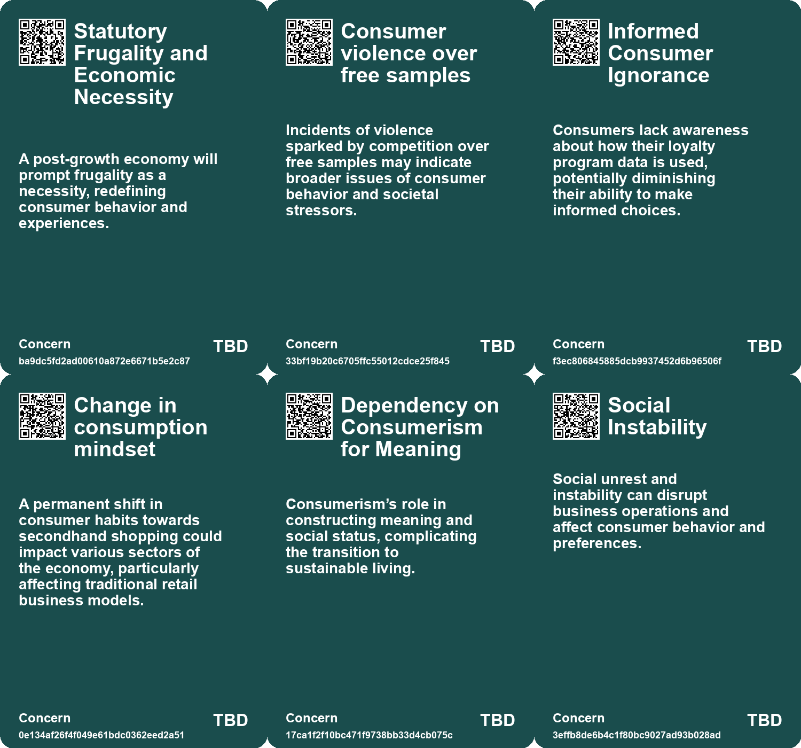
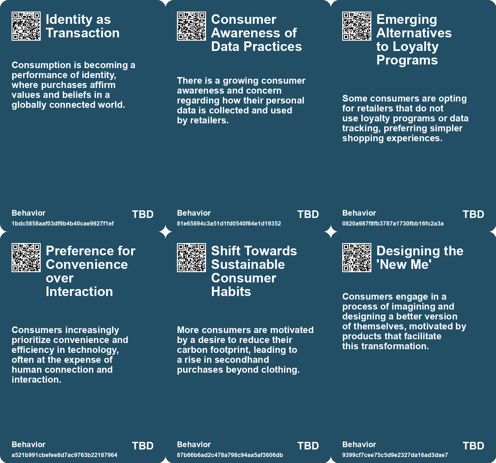
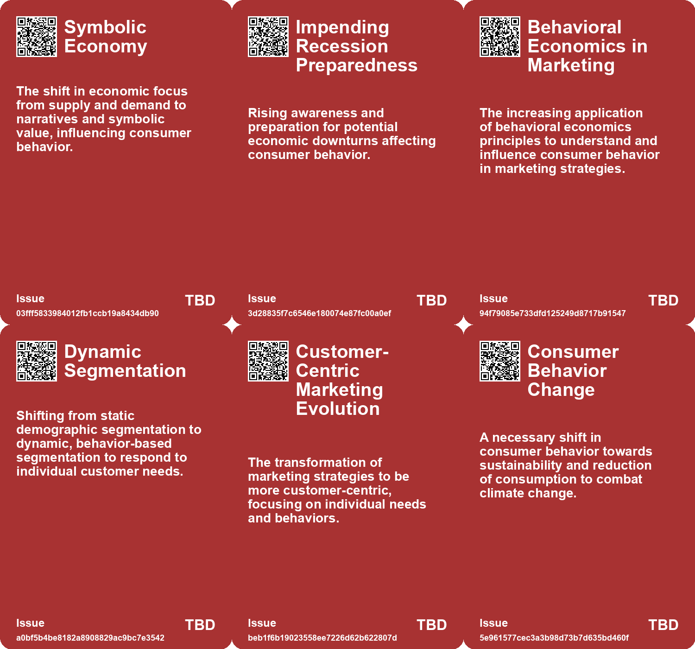
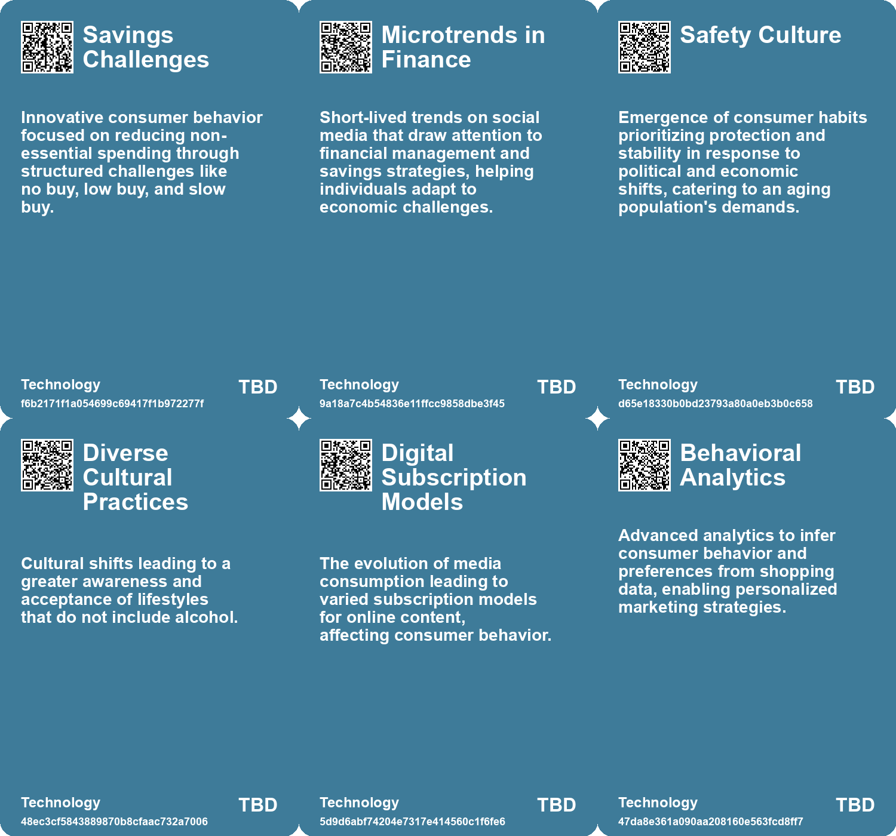

# *Topic*: Consumer Behavior Changes

# Summary

Consumer behavior is increasingly shaped by the allure of "free" offerings, as seen in incidents at retailers like Costco. Behavioral psychology reveals that free samples and services, such as free shipping, can lead to irrational decision-making. This phenomenon highlights how the perception of value can drive consumer choices, often leading to unexpected consequences.

Amid rising inflation, many Americans are re-evaluating their spending habits. A significant portion of consumers is considering cutting back on non-essential purchases, influenced by social media trends promoting mindful consumption. Younger generations are particularly affected, turning to platforms for financial advice while grappling with the mental health impacts of financial stress. Experts advocate for budgeting over fleeting trends, emphasizing the importance of recognizing excess spending.

Cultural shifts are emerging as society seeks deeper connections and authenticity in response to technological advancements and societal challenges. The tension between AI-generated and human-created content is notable, as consumers increasingly favor brands that reflect traditional values and community-centric experiences. This shift presents opportunities for businesses that adapt to these evolving consumer preferences.

The business landscape is also undergoing transformative changes, with a focus on de-materialization and localized trade relations. The rise of agentic AI is reshaping interactions within organizations, potentially altering traditional hierarchies. Demographic shifts, including a wealth transfer to women and declining birth rates, are expected to influence corporate strategies and economic power dynamics.

The 'Paradox of Choice' illustrates how an abundance of options can lead to decision paralysis, as demonstrated by a study on consumer behavior with jam varieties. Small businesses are encouraged to simplify their offerings to enhance customer satisfaction and drive sales. This principle underscores the idea that fewer choices can lead to happier consumers.

As we look toward the future, predictions indicate a decline in democratic institutions and a rise in autocratic governance, particularly in the West. This shift is accompanied by the emergence of new cultural movements that challenge traditional corporate values. Economic models are expected to evolve, emphasizing minimalism and pleasure in a landscape marked by stagnation.

The concept of "Everything as a Service" reflects a transactional mindset that permeates various aspects of life. This commodification raises questions about the outsourcing of personal agency and fulfillment. True meaning and purpose, the text argues, cannot be bought but must be sought from within.

The rise of secondhand shopping, particularly thrifting, is gaining traction as consumers seek sustainable alternatives amid economic uncertainty. The recommerce market is experiencing significant growth, driven by a desire for lower prices and reduced environmental impact. This trend indicates a shift in consumer habits toward more sustainable practices.

In the workplace, a survey reveals that many executives are struggling to keep pace with employees eager for change. The potential for a "great resignation" looms as workers seek new skills and embrace artificial intelligence. Companies are urged to foster a culture of innovation and adaptability to remain competitive in a rapidly evolving landscape.

# Seeds

|    | name                                            | description                                                                                     | change                                                                                     | 10-year                                                                                                        | driving-force                                                                                                    |
|---:|:------------------------------------------------|:------------------------------------------------------------------------------------------------|:-------------------------------------------------------------------------------------------|:---------------------------------------------------------------------------------------------------------------|:-----------------------------------------------------------------------------------------------------------------|
|  0 | Redefining Consumer Lives                       | Consumers are reshaping their identities and connections with brands.                           | From traditional consumer-brand relationships to deeper, more personal connections.        | In 10 years, brands may prioritize emotional connections over product functionality.                           | A growing emphasis on individualism and personal experiences drives this change.                                 |
|  1 | Wellness-driven Consumer Expectations           | Shift towards wellness and authenticity among consumers.                                        | From superficial consumerism to seeking authentic, wellness-oriented experiences.          | The market may see a significant rise in products prioritizing mental and physical well-being.                 | Growing health consciousness and self-care trends motivate this transformation.                                  |
|  2 | Impact of Changing Lifestyles on Household Care | Shifts in consumer lifestyles impact household care relationships.                              | From generic household products to tailored solutions for diverse lifestyles.              | Household care products may become more customized to fit individual consumer lifestyles.                      | The evolving nature of work and home life drives the need for tailored solutions.                                |
|  3 | Decline of Traditional Institutions             | Growing trust in brands over traditional moral authorities is reshaping consumer relationships. | From religious and civic guidance to brand influence in moral and ethical choices.         | Brands will increasingly fulfill roles of community and guidance traditionally held by religious institutions. | Societal disillusionment with traditional institutions and the rise of consumer activism.                        |
|  4 | Decision Paralysis in Consumer Behavior         | Consumers may feel overwhelmed by too many choices, leading to inaction.                        | From having unlimited choices to recognizing the benefit of limited options.               | In ten years, consumers may prefer minimalistic shopping experiences with curated selections.                  | Shifts in marketing strategies that emphasize simplicity and user experience.                                    |
|  5 | Consumer Awareness of Data Practices            | Consumers are becoming increasingly aware of data collection practices at supermarkets.         | Shift from ignorance to awareness regarding data privacy and loyalty programs.             | Consumers may demand more transparent data practices and opt-out options in retail settings.                   | Rising awareness of privacy issues and past data breaches influences consumer behavior.                          |
|  6 | Shift to Customer-Driven Marketing              | Companies are moving towards strategies that prioritize customer preferences and behaviors.     | Transitioning from traditional marketing to a more personalized, customer-driven approach. | In ten years, businesses could fully automate personalized marketing strategies using real-time customer data. | The increasing demand for personalized experiences from consumers is driving this shift in marketing strategies. |
|  7 | Dynamic Customer Segmentation                   | Marketing is evolving towards dynamic segmentation based on real-time customer behaviors.       | From static segmentation to a more fluid, behavior-driven model.                           | In ten years, businesses may adopt fully dynamic segmentation, allowing for real-time marketing adjustments.   | The need to respond quickly to changing consumer preferences and behaviors is pushing this evolution.            |
|  8 | Cultural Shift towards 'Bespoke Consumption'    | Consumer expectations are shifting towards customized and tailored products.                    | Transitioning from mass consumption to bespoke consumption paradigms.                      | In ten years, consumer products will likely be predominantly personalized, affecting production methods.       | Consumer desire for unique and personalized experiences in a saturated market.                                   |
|  9 | Transformation of Marketing Interactions        | Consumer interactions with brands are increasingly multi-dimensional and complex.               | Shift from linear marketing journeys to integrated, immersive consumer experiences.        | Brand engagement will be more holistic, leading to innovative marketing strategies.                            | Technological advancements in digital marketing and consumer behavior.                                           |

# Concerns

|    | name                                                 | description                                                                                                                                                              |
|---:|:-----------------------------------------------------|:-------------------------------------------------------------------------------------------------------------------------------------------------------------------------|
|  0 | Shifting Consumer Priorities                         | A concern over the rapidly changing values of consumers towards wellness, authenticity, and meaningful experiences, impacting brands' engagement strategies.             |
|  1 | Household Care Industry Transformation               | Changing lifestyles may lead to significant shifts in consumer relationships with household care products, necessitating industry adaptation.                            |
|  2 | Statutory Frugality and Economic Necessity           | A post-growth economy will prompt frugality as a necessity, redefining consumer behavior and experiences.                                                                |
|  3 | Consumer violence over free samples                  | Incidents of violence sparked by competition over free samples may indicate broader issues of consumer behavior and societal stressors.                                  |
|  4 | Change in consumption mindset                        | A permanent shift in consumer habits towards secondhand shopping could impact various sectors of the economy, particularly affecting traditional retail business models. |
|  5 | Dependency on Consumerism for Meaning                | Consumerism’s role in constructing meaning and social status, complicating the transition to sustainable living.                                                         |
|  6 | Social Instability                                   | Social unrest and instability can disrupt business operations and affect consumer behavior and preferences.                                                              |
|  7 | Emerging Customer Needs                              | Changing consumer preferences and demands require companies to continually reassess their value propositions and business models.                                        |
|  8 | Consumer Dependency on Products for Self-Improvement | Consumers increasingly rely on products to achieve personal evolution and betterment, potentially leading to a loss of individual agency and traditional skills.         |
|  9 | Implications of Behavioral Economics                 | Insights from behavioral economics indicate that consumers do not always make rational choices, complicating market predictions and product development.                 |

# Cards

## Concerns

## Behaviors

## Issue

## Technology

# Links

* [The Impact of Urban Design on Public Space Usage and Social Interaction](https://futures.kghosh.me/2f31d87f3801765f9645d092cadf513a)
* [Understanding Consumer Behavior Through the Paradox of Choice in Marketing Strategies](https://futures.kghosh.me/2984dbbe72632bf58e801f864ee3a33f)
* [The Rise of Secondhand Shopping Amid Economic Challenges: A Sustainable Trend](https://futures.kghosh.me/6e8eeaf2acd0e96acb4d43a085c483e1)
* [Exploring the Modern Entertainment Landscape and Its Societal Implications](https://futures.kghosh.me/c5c2c794f1426e6e307a9df3f9ff61f6)
* [The Shift in Automotive Sales: Embracing Car Subscriptions and Electric Vehicles](https://futures.kghosh.me/b9a5b69113b7ca17b6493414799b0e6e)
* [Understanding Employee Sentiment: Key Findings from PwC's Global Workforce Survey](https://futures.kghosh.me/b865313fdf172979b9c852573395fab1)
* [The Intrusive Data Practices of Supermarkets: Examining Kroger and Albertsons' Customer Data Collection](https://futures.kghosh.me/90bdc5da81c6c094a1ac7a794d8a2d1d)
* [Understanding Jobs to be Done (JTBD): A Theory of Consumer Motivation and Innovation](https://futures.kghosh.me/110ac9459692757f523d5d37b79eaf3d)
* [Understanding Gen Z Shopping Preferences: The Shift Towards Community and Experience in Retail](https://futures.kghosh.me/adc1258885aa937c5350875662ee892f)
* [Exploring the Psychological Influence of Free Offers on Consumer Behavior](https://futures.kghosh.me/0b5ca258e9c7ed2f9f6cf60dd523e148)
* [Transforming Marketing with Customer Driven Strategies and Digital Twins](https://futures.kghosh.me/f5a86c6c3c113719814d2772bea54508)
* [2026 Global Predictions: Consumer Behavior and Industry Trends Shaping the Future](https://futures.kghosh.me/b5f2219774c45faa79432dc8945c7638)
* [Exploring Kate Soper’s Vision for Sustainable Living in 'Post-Growth Living'](https://futures.kghosh.me/71cbf82b85b58a6675d05308f8e1759e)
* [The Diminishing Role of Human Interaction in Modern Technology and Its Societal Implications](https://futures.kghosh.me/31491f2b50e77cc7c45e541a9b2915d7)
* [Exploring the Impact of Hyper-Personalization in the Age of AI and Individualism](https://futures.kghosh.me/9ef1218bf5010b0780647b93d724b93b)
* [Navigating Business Model Reinvention Amidst Technological and Environmental Challenges](https://futures.kghosh.me/5b306738838609725fba5dfdcbdff28b)
* [Five Emerging Trends Transforming Business in the Coming Year](https://futures.kghosh.me/55bac03899915f25bf0b47fa4342472c)
* [The Rise of the Symbolic Economy: Identity Through Consumption in a Globalized World](https://futures.kghosh.me/f836699644240599a4284c78b9ade0e1)
* [Navigating Workforce Transformation: Insights from PwC's Global Survey on Employee Aspirations and Company Culture](https://futures.kghosh.me/4c886ce0e70f066b9f2199abe1d7bd1c)
* [Exploring the Cultural Trends Shaping Consumer Behavior in 2026](https://futures.kghosh.me/05be870bd93b19dc0390539dc923ae7b)
* [The Four Shifts: Transforming Society and Business in a Rapidly Changing World](https://futures.kghosh.me/0506cba04945d4f8cf25bf2399d36a46)
* [Future Trends Post-2024: Declining Democracies and Emerging Cultural Shifts](https://futures.kghosh.me/bd1b01636b1360716b5951e1cac42724)
* [Concerns Over Inflation Drive Americans to Adopt Spending Reduction Habits](https://futures.kghosh.me/713b509d3ed652f3a8dbfe7c90bcd0b9)
* [Understanding the Rise of Sobriety Among Young Adults: Trends and Reasons Behind Alcohol Avoidance](https://futures.kghosh.me/94960bd3c0ad4c594fd56651f4087128)
* [Exploring the Dangers of Outsourcing Happiness and Personal Fulfillment in Modern Society](https://futures.kghosh.me/a5c0ba498382a4edc0f2bf0d9653ad16)