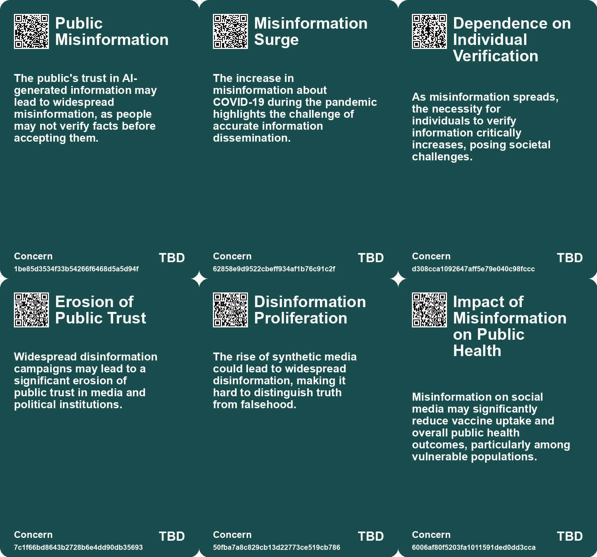
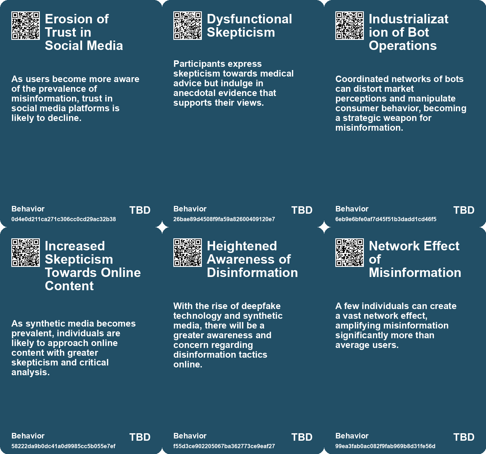
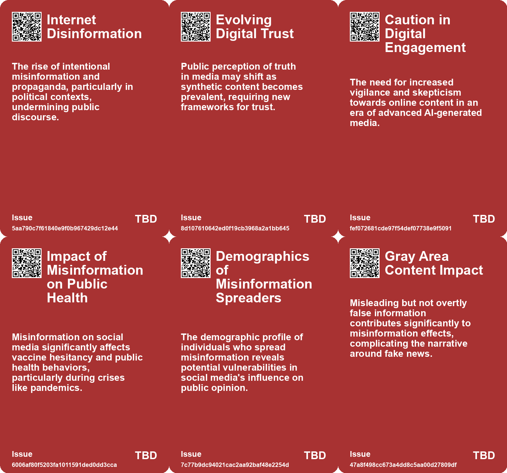
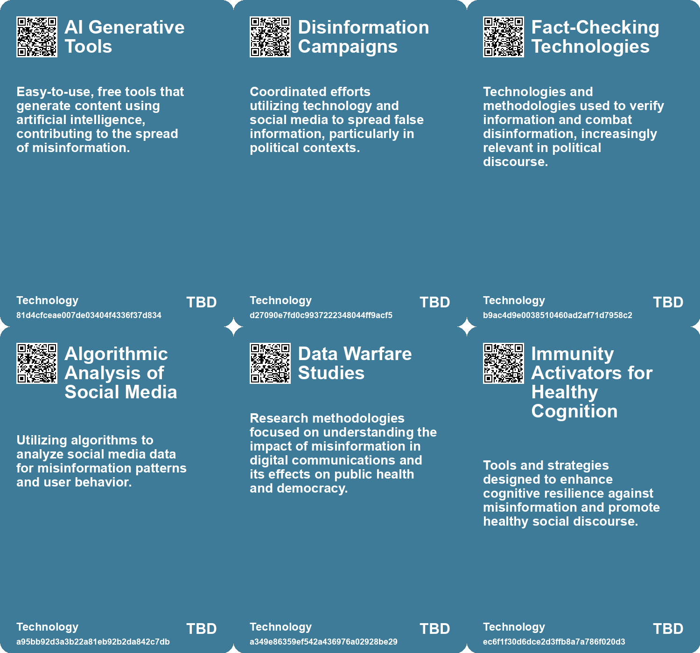

# *Topic*: Consumer Skepticism and Misinformation

# Summary

Misinformation remains a significant threat to democracy, as highlighted by recent studies showing that a small group of individuals, termed "supersharers," is responsible for the majority of fake news dissemination on social media. These findings reveal that misinformation, particularly regarding vaccines, can significantly influence public health decisions. The studies emphasize the need for effective strategies to combat misinformation, especially among demographics that are more likely to share false information.

The precarious state of democracy is further exacerbated by the rise of synthetic media, including deepfakes, which pose new challenges for information authenticity. A report from Europol warns that by 2026, a substantial portion of online content could be artificially generated, raising concerns about the implications for artists and the integrity of information. This technological evolution necessitates a cautious approach to ensure that the public remains aware of the potential for manipulation.

Education plays a crucial role in addressing misinformation. Finland's innovative approach to integrating digital literacy and fact-checking into its school curriculum serves as a model for other nations. By teaching students to critically evaluate information, Finland aims to foster a generation capable of navigating the complexities of the digital landscape. However, the success of such initiatives relies heavily on adequate teacher training and support.

The influence of technology on society extends beyond misinformation. The Techno-Optimist’s Fallacy highlights the dangers of uncritical acceptance of technological advancements, as seen in the context of nuclear energy and the rise of harmful products. This perspective urges a more nuanced understanding of technology's impact, advocating for a balance between innovation and ethical considerations.

The phenomenon of "deep doubt" reflects a growing skepticism towards digital media, fueled by the prevalence of AI-generated content. This skepticism can lead to a culture of distrust, where even genuine events are questioned. The concept of the "liar's dividend" illustrates how deceptive technologies can undermine authentic evidence, complicating the public's ability to discern truth from falsehood.

Surveillance and privacy concerns are increasingly relevant in discussions about technology. The shift from fictional portrayals of espionage to real-life surveillance systems raises questions about the implications for individual freedoms. As technology companies expand their surveillance capabilities, there is a growing awareness and activism among workers against the militarization of technology.

The rise of AI technologies also presents challenges in various sectors, including political polling and content moderation. Experts propose that AI simulations could replace traditional polling methods, while concerns about the reliability of AI-generated content persist. The ethical implications of AI, particularly in sensitive areas, highlight the need for transparency and accountability in its development and deployment.

Finally, the intersection of technology and personal experiences reveals a longing for simpler times. The constant connectivity and overwhelming choices of the digital age can lead to a sense of disconnection. Emphasizing the importance of curated experiences and deep engagement, this perspective advocates for a cultural shift towards valuing quality over quantity in our interactions with technology and media.

# Seeds

|    | name                                        | description                                                                                 | change                                                                                         | 10-year                                                                                                     | driving-force                                                                                          |
|---:|:--------------------------------------------|:--------------------------------------------------------------------------------------------|:-----------------------------------------------------------------------------------------------|:------------------------------------------------------------------------------------------------------------|:-------------------------------------------------------------------------------------------------------|
|  0 | Cultivation of Anti-Establishment Sentiment | Skepticism toward doctors and healthcare fuels anti-establishment views.                    | Incremental doubt toward medical professionals to open disdain and rejection.                  | A polarized public health environment, leading to differentiated health practices.                          | Erosion of trust in scientific and medical communities post-pandemic.                                  |
|  1 | Trust in Digital Content Erosion            | Erosion of trust in online content as synthetic media becomes pervasive.                    | Shifting from trust in traditional media to skepticism towards digital content.                | Audiences will rely on verification tools and critical thinking to assess content authenticity.             | Increased awareness of misinformation and the capabilities of synthetic media.                         |
|  2 | Disinformation Concerns                     | Growing concerns about disinformation driven by deepfake technology.                        | Shift from traditional disinformation tactics to sophisticated AI-generated misinformation.    | Information ecosystems will require new frameworks to combat and verify authenticity.                       | The ongoing battle against misinformation and the need for public awareness.                           |
|  3 | Ineffectiveness of Content Flagging         | Flagging misinformation is less effective than previously assumed.                          | Shift from reliance on flagging false content to understanding broader misinformation impacts. | Future platforms may develop new strategies beyond flagging to combat misinformation.                       | The realization of flagging inadequacies in controlling misinformation flow.                           |
|  4 | Exploitation of cognitive biases            | Groups exploit cognitive biases in humans to spread misinformation.                         | Shift from democratic discourse to manipulation through psychological tactics.                 | Democracy may struggle as misinformation becomes more sophisticated and widely accepted.                    | Increasing sophistication of technology and understanding of human psychology.                         |
|  5 | Deep Doubt Era                              | Increasing public skepticism towards the authenticity of media due to AI-generated content. | Shift from trust in media to widespread skepticism about the authenticity of visuals.          | In 10 years, media consumption may prioritize transparency and verification tools over traditional sources. | The proliferation of advanced AI tools that enable easy creation of convincing fake media.             |
|  6 | Conspiracy Theories Amplification           | Rise in conspiracy theories fueled by AI-generated media and deep doubt.                    | Shift from skepticism towards specific events to broader distrust in all media narratives.     | Conspiracy theories may become mainstream, affecting public trust in institutions and media.                | The intersection of technology, misinformation, and social media dynamics.                             |
|  7 | Misinformation Overload                     | The rise of AI-generated content leads to an overwhelming volume of misinformation.         | Shift from occasional misinformation to a pervasive ocean of false information.                | Society may struggle to discern truth in a landscape dominated by AI-generated misinformation.              | The ease of producing large volumes of content using AI tools encourages the spread of misinformation. |
|  8 | Rise of Misinformation Awareness            | Increased awareness of misinformation spread through digital platforms.                     | Growing recognition of misinformation as a significant societal issue.                         | Stronger emphasis on digital literacy and critical evaluation of information sources.                       | The overwhelming volume of information available online necessitating discernment.                     |
|  9 | Empowerment of Individual Verification      | Young people are increasingly relying on personal verification of information.              | Shifting from trust in media to personal responsibility for information accuracy.              | A more informed and discerning public that critically evaluates sources.                                    | Evolving media landscape and the proliferation of information channels.                                |

# Concerns

|    | name                                      | description                                                                                                                                           |
|---:|:------------------------------------------|:------------------------------------------------------------------------------------------------------------------------------------------------------|
|  0 | Public Misinformation                     | The public's trust in AI-generated information may lead to widespread misinformation, as people may not verify facts before accepting them.           |
|  1 | Misinformation Surge                      | The increase in misinformation about COVID-19 during the pandemic highlights the challenge of accurate information dissemination.                     |
|  2 | Dependence on Individual Verification     | As misinformation spreads, the necessity for individuals to verify information critically increases, posing societal challenges.                      |
|  3 | Erosion of Public Trust                   | Widespread disinformation campaigns may lead to a significant erosion of public trust in media and political institutions.                            |
|  4 | Disinformation Proliferation              | The rise of synthetic media could lead to widespread disinformation, making it hard to distinguish truth from falsehood.                              |
|  5 | Impact of Misinformation on Public Health | Misinformation on social media may significantly reduce vaccine uptake and overall public health outcomes, particularly among vulnerable populations. |
|  6 | Demographic Targeting in Misinformation   | The predominance of specific demographics among misinformation spreaders may exacerbate existing social and political divides.                        |
|  7 | Exploitation of Cognitive Biases          | Manipulation of psychological biases through disinformation can distort public perception and decision-making.                                        |
|  8 | Immunization Against Misinformation       | The lack of immunity activators for cognitive health could result in increased susceptibility to misinformation.                                      |
|  9 | Increased Conspiracy Theories             | The prevalence of 'deep doubt' fuels conspiracy theories, as people may dismiss factual events as AI fabrications, leading to misinformation.         |

# Cards

## Concerns

## Behaviors

## Issue

## Technology

# Links

* [Nostalgia for Simplicity: The Burden of Infinite Choice in Modern Life](https://futures.kghosh.me/7b316ebe449187b79e519a8c6d12a2cd)
* [Exploring the Modern Entertainment Landscape and Its Societal Implications](https://futures.kghosh.me/c5c2c794f1426e6e307a9df3f9ff61f6)
* [The Freedom Summit: A Rallying Cry for Anti-Vaccine Sentiments and Medical Distrust](https://futures.kghosh.me/5bb4812db1abfd19da133a7139cbbac9)
* [Exploring the Ordinary Origins of Surveillance: Insights from Hochman and González's New Books](https://futures.kghosh.me/ccdebc20efc0694474f1c64e2835e260)
* [Bangladesh's Disinformation Campaign: The Role of AI and Deep Fakes in Elections](https://futures.kghosh.me/299ee0a175c6ba617e28713566f23557)
* [The Vital Role of Dissent in Effective Decision-Making for Organizations](https://futures.kghosh.me/4ff63da3f7bc4da4e925370b5eb9bfbe)
* [AI Workers Share Ethical Concerns and Distrust Over Generative AI Reliability and Safety](https://futures.kghosh.me/440c60817054047ca4be7ef38b8c3074)
* [Addressing Threats to Democracy: Strategies for Resilience Against Misinformation and Manipulation](https://futures.kghosh.me/56d1a28746cd95ebaa3d62a4e1f91c3a)
* [The Perils of Expertise: How Assumptions Can Hinder Market Understanding](https://futures.kghosh.me/2cf6f5729ee4e412f3083c0db2f76c9f)
* [Finland's Innovative Approach to Combating Fake News Through Education](https://futures.kghosh.me/ad15fbe04bbe50ec3436c61403d19fca)
* [The Rise of Industrialized Sentiment Manipulation and the Need for Digital Identity Verification](https://futures.kghosh.me/344ece8d21b6241ead5160fe9a38742f)
* [The Impact of the Internet and AI on Human Cognition and Productivity](https://futures.kghosh.me/652fc7ec1f422e931bc5a9ba8011650a)
* [Understanding Polarization: Healing Our Relationship with Technology and Embracing Diverse Perspectives](https://futures.kghosh.me/c1bb890337ef382bfaa5720c9fd05134)
* [The Impact of Supersharers on Vaccine Hesitancy and Fake News Spread on Social Media](https://futures.kghosh.me/091c0c86efbac50bd1354fbc72324198)
* [A Personal Account of Falling Victim to a Phone Scam and Its Implications for Banking Security](https://futures.kghosh.me/6bca129462382d090b52faf72fe48e3d)
* [Exploring the Rise of 'Deep Doubt' Amidst AI-Generated Media Content](https://futures.kghosh.me/97be17298986599d68a1642e4359d6d5)
* [Understanding the Techno-Optimist's Fallacy and its Implications for Technology Regulation](https://futures.kghosh.me/0e281eb043be786a51d70cb923881594)
* [Navigating AI: Balancing Technological Optimism with Appropriate Fear for the Future](https://futures.kghosh.me/98862cc3722aadf82c60f8af71f1fed5)
* [Europol Report Warns of Rising AI-Generated Content and Disinformation Risks](https://futures.kghosh.me/8900fb75566c9d1b008c2e2c36f7a8e2)
* [Google's Transition to Remote Work and the Evolution of Information Security](https://futures.kghosh.me/7a34820852cf03cbbdb1fb75ca3b629c)
* [Exploring the Dangers of Manipulated Machine-Learning Models and Their Impacts on Society](https://futures.kghosh.me/4d1abdf7e702b559c6ccff847ce4d8d0)
* [The Backlash Against Lina Khan: A Fight for Consumer Protection and Antitrust Reform](https://futures.kghosh.me/0e022693721e3552f32062f41e8c4f98)
* [The Dual-edged Sword of AI: Misinformation and Societal Threats in the Age of Advanced Language Models](https://futures.kghosh.me/9787333cafcd0252d71a9bff845ad093)
* [Harvard Scholars Advocate for AI in Political Polling Amid Declining Human Engagement](https://futures.kghosh.me/1e5947176c3712200aba7c2dfb0db020)