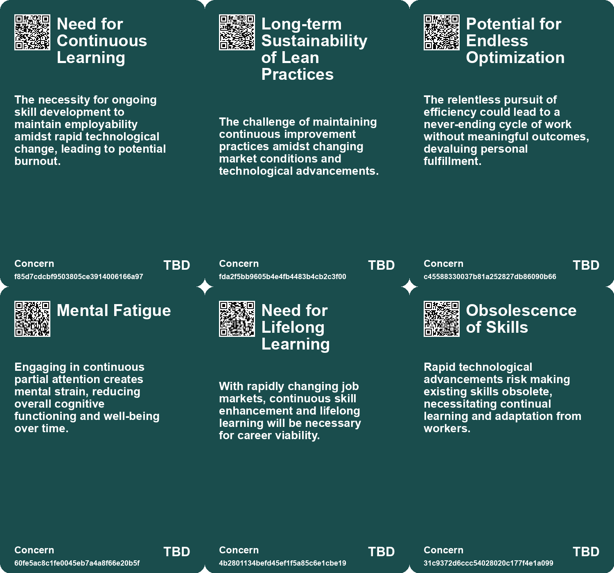
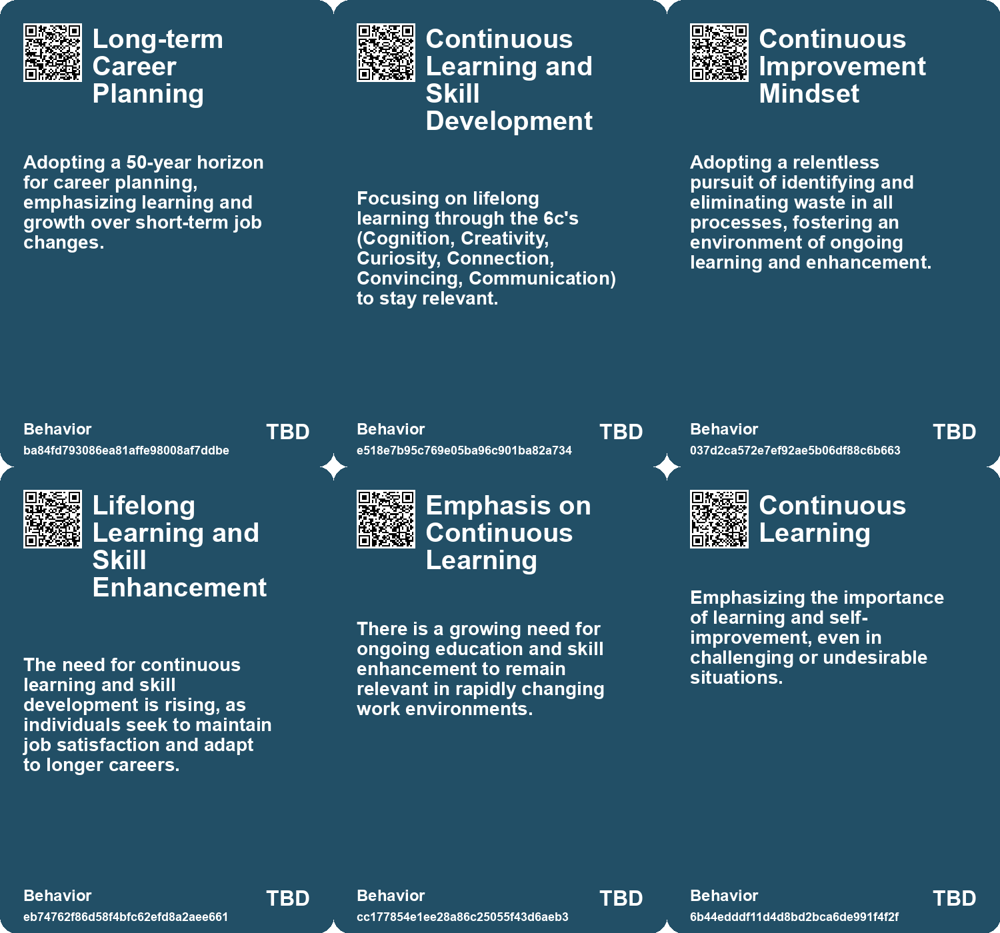
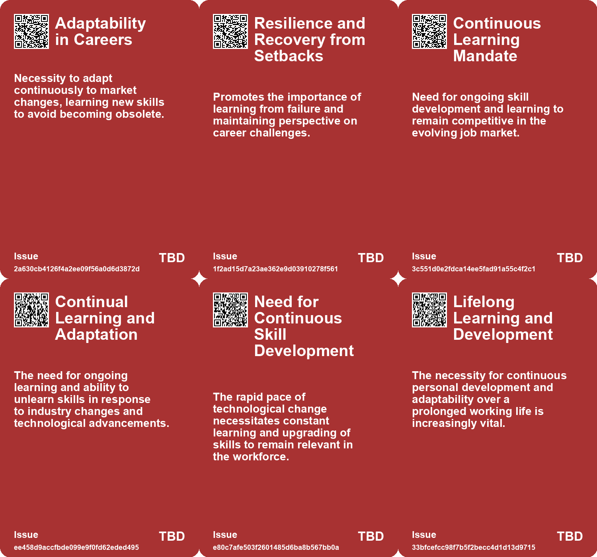
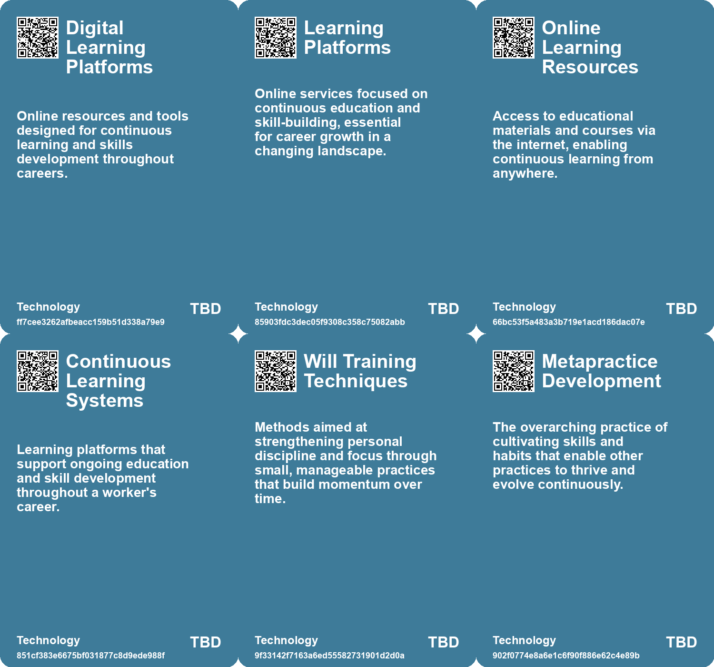

# *Topic*: Continuous Learning Commitment

# Summary

In today’s fast-paced world, the concept of attention has emerged as a critical theme. Continuous partial attention, where individuals split their focus between multiple tasks, can hinder personal and professional relationships. This phenomenon underscores the need for mindful engagement, particularly in face-to-face interactions. The importance of reclaiming attention is echoed in discussions about mental clarity and personal freedom, emphasizing the value of observing thoughts without judgment.

The evolving nature of work is another significant theme. Predictions indicate that by 2027, freelancers will make up over half of the U.S. workforce, driven by factors such as an aging population, the gig economy, and technological advancements. This shift necessitates a "Company of One" mindset, encouraging individuals to hone their skills and build strong professional networks. As traditional career paths become less common, the focus on continuous learning and adaptability is paramount.

The impact of artificial intelligence on decision-making and productivity is also a pressing concern. As AI capabilities grow, there is a need for humans to enhance their decision-making skills to remain relevant. The concept of AAA—Anticipatory, Antifragile, and Agility—provides a framework for navigating complex systems in an AI-driven landscape. This theme is complemented by discussions on the challenges posed by a culture of false urgency, which can lead to burnout and decreased productivity. Strategies for prioritizing meaningful work and creating space for deep thinking are essential in combating this urgency.

Talent development and recruitment are crucial in a rapidly changing job market. Emphasizing skills such as collaboration, creativity, and communication, organizations must focus on integrating experienced talent while fostering personal growth. The importance of building valuable relationships and investing in skills for the future cannot be overstated.

The notion of slow and mindful learning is gaining traction as a counter to the rapid pace of information and technology. Inspired by the Slow Food movement, this approach advocates for continuous reskilling and self-reflection over mere evaluation. It encourages individuals to ask questions and engage in collaborative learning, promoting sustainability in education.

The transformative power of storytelling and human connection is highlighted as a vital component of effective communication in both personal and professional realms. As individuals navigate the complexities of modern life, the ability to influence others through authentic narratives becomes increasingly important.

Lastly, the principles of the Toyota Production System serve as a reminder of the value of continuous improvement and respect for people in organizational culture. This approach, rooted in problem-solving and efficiency, remains relevant as industries adapt to new challenges, including the integration of AI in consulting and other sectors. The emphasis on intellectual curiosity and observation is essential for driving systemic change and fostering innovation.

# Seeds

|    | name                                      | description                                                                                                      | change                                                                                        | 10-year                                                                                                           | driving-force                                                                                                |
|---:|:------------------------------------------|:-----------------------------------------------------------------------------------------------------------------|:----------------------------------------------------------------------------------------------|:------------------------------------------------------------------------------------------------------------------|:-------------------------------------------------------------------------------------------------------------|
|  0 | Company of One Mindset                    | Employees must think of themselves as businesses, fostering ongoing skills development.                          | Shift from employee dependency to self-sustaining career development.                         | Work culture where individual brands and skills are prioritized over traditional employment.                      | Increased competition and necessity for self-reliance in career management.                                  |
|  1 | Continuous Learning as a Career Essential | Emphasis on constant learning is crucial to career advancement and relevance.                                    | Moving from static expertise to continuous skill and knowledge upgrading.                     | Lifelong learning becomes a foundational principle of career success in all fields.                               | Rapid technological and market changes necessitate adaptive skillsets for job security.                      |
|  2 | Lifelong Learning Emphasis                | There is an increasing emphasis on continuous learning and adaptation throughout one's career.                   | Shift from fixed skill sets to a model where continuous learning and unlearning are expected. | Continuous learning may become a standard expectation in all industries, impacting training and development.      | Rapid technological advancements and market changes necessitate ongoing skill development.                   |
|  3 | Importance of Continuous Learning         | There's a growing emphasis on continuous skill updating to remain relevant in the workforce.                     | From static skill sets to dynamic, ongoing learning and adaptation.                           | Lifelong learning will become essential for career sustainability and growth.                                     | Rapid technological advancements necessitating new skills and knowledge.                                     |
|  4 | Shift in Perspective on Time Management   | A growing awareness of the importance of actively engaging with time rather than passively letting it slip away. | A transition from viewing time as simply passing to actively making the most of each moment.  | In 10 years, people may prioritize personal growth and continuous learning over traditional productivity metrics. | The rise of mindfulness and self-improvement movements encourages individuals to take control of their time. |
|  5 | Cultural Emphasis on Continuous Learning  | An increasing trend where individuals prioritize learning in all aspects of life, regardless of their situation. | A shift from static career paths to dynamic learning experiences in everyday life.            | In a decade, lifelong learning may become a core value, influencing job designs and educational systems.          | Technological advancements and information accessibility drive the need for continuous skill development.    |
|  6 | Lifelong Learning                         | The emphasis on continuous learning and development throughout a 50-year working life.                           | From static career paths to dynamic, ongoing personal and professional growth.                | A culture of lifelong learning will be prevalent, with individuals constantly upskilling and reskilling.          | The rapid pace of change in industries necessitates ongoing education and adaptation.                        |
|  7 | The Continuous Nature of Learning         | Learning is an ongoing process without a clear endpoint.                                                         | Shift from viewing learning as finite to embracing it as a lifelong journey.                  | In 10 years, personal and professional development will be viewed as a continuous, adaptive process.              | A growing emphasis on adaptability in rapidly changing job markets drives this perspective.                  |
|  8 | Focus on Continuous Learning              | There’s a growing need for ongoing skill development in a fast-changing world.                                   | From static skill sets to an emphasis on lifelong learning and adaptability.                  | The workforce will continuously evolve, with ongoing education being a norm rather than an exception.             | Rapid technological advancements require continuous skills updates and learning.                             |
|  9 | Vulnerability in Learning                 | Learners are encouraged to embrace vulnerability in their learning journeys.                                     | From fear of judgment to acceptance of mistakes as part of the learning process.              | Educational environments may prioritize psychological safety, fostering innovation and experimentation.           | A cultural shift towards valuing authenticity and personal growth in education.                              |

# Concerns

|    | name                                       | description                                                                                                                                       |
|---:|:-------------------------------------------|:--------------------------------------------------------------------------------------------------------------------------------------------------|
|  0 | Sustainability of Futures Literacy         | The long-term retention and application of futures literacy skills developed may diminish without ongoing support and reinforcement post-program. |
|  1 | Need for Continuous Learning               | The necessity for ongoing skill development to maintain employability amidst rapid technological change, leading to potential burnout.            |
|  2 | Long-term Sustainability of Lean Practices | The challenge of maintaining continuous improvement practices amidst changing market conditions and technological advancements.                   |
|  3 | Potential for Endless Optimization         | The relentless pursuit of efficiency could lead to a never-ending cycle of work without meaningful outcomes, devaluing personal fulfillment.      |
|  4 | Mental Fatigue                             | Engaging in continuous partial attention creates mental strain, reducing overall cognitive functioning and well-being over time.                  |
|  5 | Obsolescence of Skills                     | Rapid technological advancements risk making existing skills obsolete, necessitating continual learning and adaptation from workers.              |
|  6 | Missed Opportunities for Growth            | Focusing solely on future ambitions can cause individuals to overlook valuable learning moments in their current situations.                      |
|  7 | Mental Burnout in Extended Careers         | Long working lives could lead to mental fatigue, impacting health and productivity if engagement strategies aren't developed.                     |
|  8 | Reactive Culture                           | A culture of constant reactivity may stifle creativity and innovation, impacting long-term organizational success.                                |
|  9 | Talent Irrelevance                         | Failure to continuously upgrade skills leads to professional irrelevance in rapidly changing industries.                                          |

# Cards

## Concerns

## Behaviors

## Issue

## Technology

# Links

* [Innovative Approaches to Public Space Transformation in U.S. Cities](https://futures.kghosh.me/465b809f2a993c634a1a239ca0cab476)
* [Reimagining Learning: Embracing Slow Learning in an Accelerated World](https://futures.kghosh.me/042cf62855760b54fa5a194db9e6cf11)
* [Navigating Talent Development and Recruitment in a Rapidly Changing World](https://futures.kghosh.me/14935a7eab6d6c1d8a5ce2f25d3b54bb)
* [Essential Skills for Thriving in a Changing Work Landscape: Embrace the Future](https://futures.kghosh.me/d7ef2be80aa075fa18028d91bf7c1aaa)
* [Thriving in an AI Era: Embracing, Adapting, and Complementing Technology](https://futures.kghosh.me/23a3410059759ba4214235628d4ebd4b)
* [Embracing Public Learning: Transform Your Knowledge into Community Engagement](https://futures.kghosh.me/037aba804501ec9f75f8bb434b8a6c20)
* [The Art of Attention: Cultivating Clarity and Freedom in Life](https://futures.kghosh.me/87a721a144cf24b41194484d535bcbc9)
* [Choosing Between Alive Time and Dead Time: Embracing Growth in Adversity](https://futures.kghosh.me/8d4bd0ce2d72299be0ce6e03d98f6f9e)
* [Anticipating the Future: A Course on Strategic Foresight and Adaptation](https://futures.kghosh.me/40a99c098bad8dda821b757d8d88a80a)
* [Exploring Future Consciousness: Join the Future Forward Program to Shape Tomorrow](https://futures.kghosh.me/2f66695f2596205814b8aeb4dc746072)
* [Navigating Decision-Making Challenges in an AI-Driven World: The Need for AAA Traits](https://futures.kghosh.me/c474eac8117547a89cac2c805652df9c)
* [Empowering Futures Literacy Through a Collaborative Learning Journey in Futures Lab](https://futures.kghosh.me/212a668a5e92b7c79844e3e49dc00f0b)
* [The Importance of Self-Management in Modern Careers: Insights from Peter Drucker](https://futures.kghosh.me/b76d6d3f8d4be2311caae40cce7b39a3)
* [Combating False Urgency: Strategies for a More Productive Work Culture](https://futures.kghosh.me/4ea057ebf3a14884754e7d3fe2566ce5)
* [Combating False Urgency: Strategies for a More Productive Work Culture](https://futures.kghosh.me/b4184f4b97d0fb3cd618ec7e7d8ed842)
* [Insights on Career Management: Navigating Work in a Changing Landscape](https://futures.kghosh.me/c722454183bad20fa287d966577d8b77)
* [The Transformative Power of the Toyota Production System and its Relevance in an AI-Driven World](https://futures.kghosh.me/ae195a0a52b9b143bee7074983343615)
* [Essential Career Lessons for Success Across Decades in Today’s Workforce](https://futures.kghosh.me/a06d27f1dd5a2328ba6aa8854abc5318)
* [Navigating Jevons Paradox: Embracing Authenticity in a Productivity-Driven World](https://futures.kghosh.me/fc47a0f6771688b5d00260a9567c1fee)
* [The Shift to Freelancing: Embracing a Company of One Mindset for Future Success](https://futures.kghosh.me/39c874e172728d9411bc5af518598ba3)
* [Embracing Continuous Practice for Personal Growth and Skill Development](https://futures.kghosh.me/a81f85f066b0093553fc39638d3e0559)
* [The Impact of Continuous Partial Attention on Networking and Relationships in a Digital World](https://futures.kghosh.me/417df5448432cb603f40dec77f469b87)