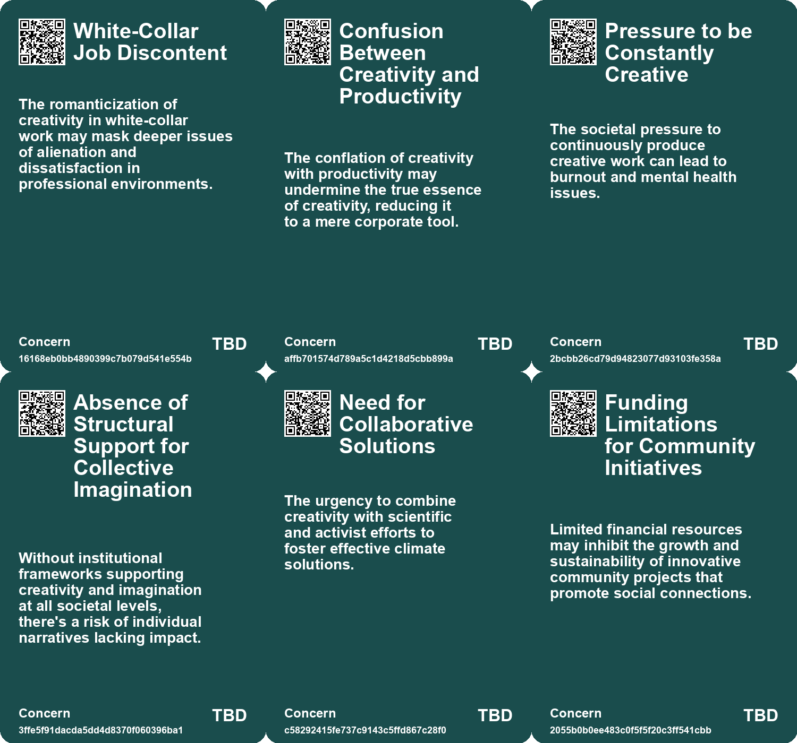
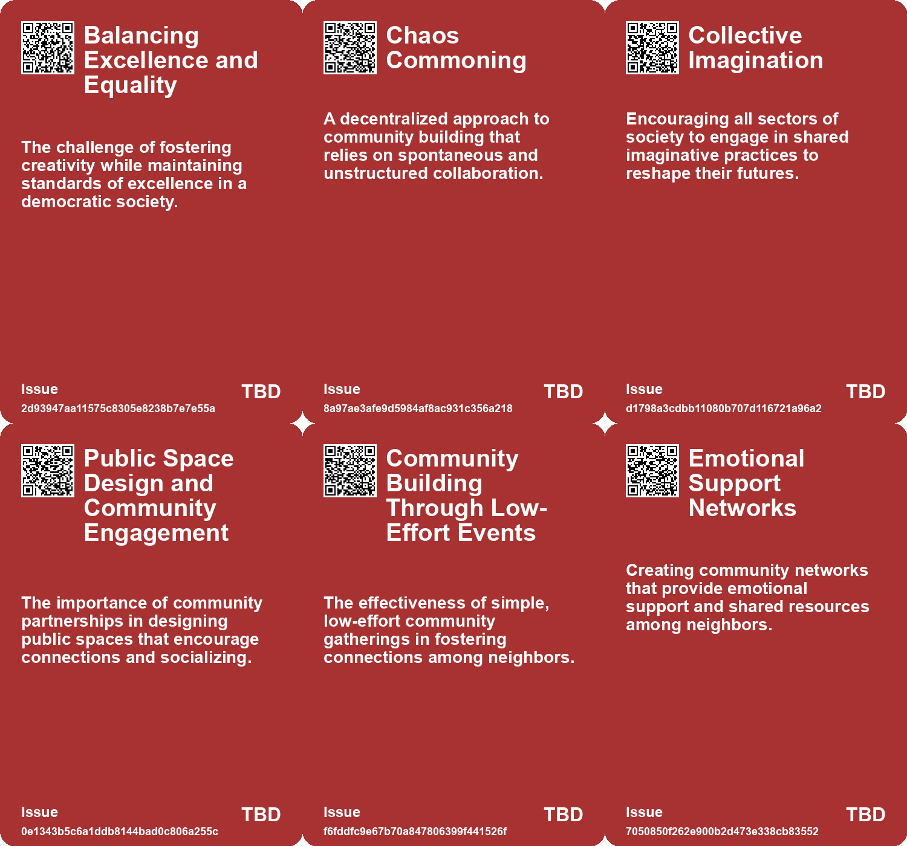
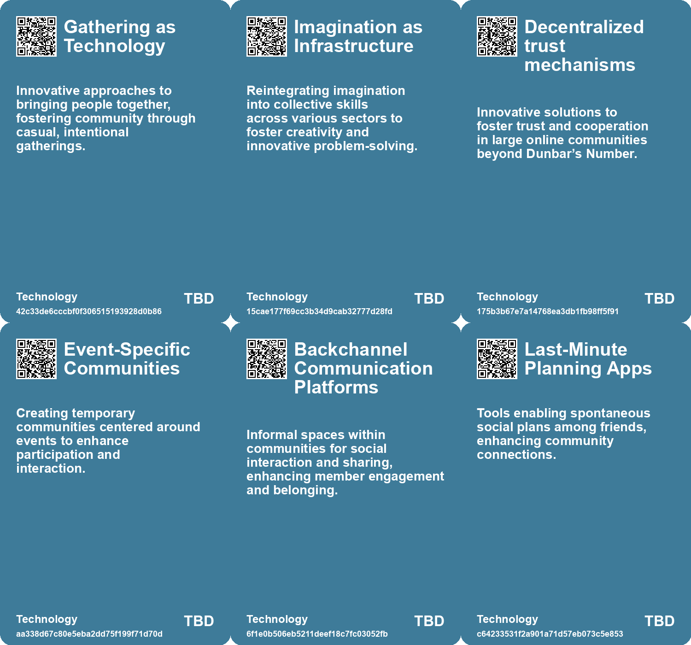

# *Topic*: Creativity as Community Bonding

# Summary

The evolving concept of creativity has become a focal point in various sectors, from urban development to personal fulfillment. Initially a niche topic, creativity gained prominence in the 1950s as industries sought innovative solutions to adapt to changing economic landscapes. Today, it is celebrated as essential for both personal and professional success, often linked to traits like nonconformity and emotional sensitivity. This cultural shift has sparked discussions about the dualities surrounding creativity, such as optimism versus pessimism and elitism versus egalitarianism.

Urban environments are increasingly embracing creativity through community-driven initiatives. Cities across the U.S. are implementing the Reimagining the Civic Commons model, which aims to transform public spaces into vibrant areas that foster collaboration and civic engagement. These projects are designed to counteract loneliness and economic segregation, promoting a sense of belonging among residents. Similarly, the concept of co-imagination is gaining traction, where collaborative envisioning of the future strengthens social relationships and combats feelings of isolation.

Loneliness has emerged as a significant public health crisis, with a growing number of individuals reporting feelings of isolation. The U.S. Surgeon General's report highlights the detrimental effects of loneliness on mental and emotional well-being, urging communities and businesses to prioritize authentic social connections. Initiatives like Oma's Soep's campaign in Amsterdam demonstrate how companies can play a role in reducing loneliness by facilitating interactions among different age groups.

The importance of community building is further emphasized through personal stories of individuals transforming their neighborhoods into connected spaces. Simple actions, such as hosting casual gatherings, can significantly enhance social ties and foster supportive environments. This grassroots approach to community engagement is vital in addressing the challenges posed by gentrification and social equity.

In the workplace, the concept of job crafting is gaining attention as a means to enhance job satisfaction and engagement. By creatively aligning personal goals with organizational needs, individuals can transform unfulfilling jobs into meaningful experiences. This aligns with the broader theme of personal development, where skills like collaboration, communication, and creativity are increasingly valued in a rapidly changing world.

The intersection of creativity and technology is also a critical area of exploration. While artificial intelligence offers the potential for efficiency, it raises concerns about the risk of homogenizing creative output. Designers are encouraged to collaborate with AI while embracing the unique, winding paths that characterize human creativity. This balance is essential for fostering innovation and ensuring that technology enhances rather than diminishes the creative process.

Finally, the role of storytelling in shaping narratives and fostering resilience is highlighted as a necessary skill for navigating complex societal challenges. Futures literacy, defined as the ability to imagine and prepare for possibilities, emphasizes the importance of collaborative storytelling in creating inclusive futures. By engaging in shared narratives, communities can cultivate a vision that values well-being and interconnection, ultimately driving meaningful change.

# Seeds

|    | name                                | description                                                                                                 | change                                                                                       | 10-year                                                                                                    | driving-force                                                                                 |
|---:|:------------------------------------|:------------------------------------------------------------------------------------------------------------|:---------------------------------------------------------------------------------------------|:-----------------------------------------------------------------------------------------------------------|:----------------------------------------------------------------------------------------------|
|  0 | Democratization of Creativity       | Creativity is now considered a value that everyone can possess and cultivate.                               | Shift from creativity being exclusive to artists to being a shared human capacity.           | In 10 years, creativity might be integrated into standard educational and professional frameworks for all. | Societal and economic needs for innovation require broader access to creative thinking.       |
|  1 | Gathering as Technology             | The power of communal gatherings to foster change.                                                          | Shift from digital interactions to physical, presence-oriented community actions.            | Physical gathering spaces promoting deeper connections and collective actions.                             | Desire for real, tangible interactions amidst digital overload.                               |
|  2 | Imagination as a Collective Muscle  | Imagination is practiced collectively, not just by artists or designers but by everyone.                    | From imagination as an individual skill to a shared societal practice.                       | Imaginative capacity enhances community engagement and cooperative problem-solving.                        | The recognition of the importance of creative thinking in facing societal challenges.         |
|  3 | Revival of Neighborhood Gatherings  | Communities are increasingly reviving outdoor gatherings to foster connections among neighbors.             | From isolated individuals to more connected neighbors through intentional gatherings.        | Communities may prioritize social interaction and shared spaces as vital for social health.                | Growing awareness of isolation and the need for community support networks.                   |
|  4 | Emerging Local Events Culture       | Neighborhoods are creating a culture of hosting small scale community events for fun and bonding.           | From sporadic social events to a thriving calendar of community-building activities.         | Local events may become central to community identity and resilience.                                      | Desire for inclusive spaces that enhance local engagement and connection.                     |
|  5 | Utilization of Public Spaces        | Residents are creatively transforming underutilized public spaces into community gathering spots.           | From neglected public spaces to vibrant community hubs fostering interaction.                | Urban areas may evolve to prioritize community spaces and public engagement.                               | The need for inclusive and engaging urban environments amidst growing urbanization.           |
|  6 | Potential for Combating Loneliness  | Co-imagination may serve as a tool to alleviate feelings of loneliness and disconnection.                   | From individual coping strategies to shared imaginative experiences combating loneliness.    | Co-imagination could become a widely adopted method in community building and mental health initiatives.   | Growing awareness of loneliness as a public health issue and the need for social connection.  |
|  7 | Rise of Anti-Loneliness Initiatives | Growing number of organizations focusing on combating loneliness through community building and connection. | Shift from individualistic lifestyles to community-oriented solutions addressing loneliness. | In 10 years, anti-loneliness initiatives may be integral to urban planning and social policy.              | Increasing recognition of loneliness as a public health crisis, prompting proactive measures. |
|  8 | Serendipitous connections           | Niche projects lead to unexpected and interesting connections in creative communities.                      | From a focus on broad appeal to valuing niche, personally meaningful projects.               | Creative communities will thrive on niche interests, leading to unique collaborations and innovations.     | The search for meaningful engagement and connection among creators.                           |
|  9 | The Future Bazaar                   | A toolkit for community-driven collective imagination and creativity.                                       | From isolated artistic expression to collaborative, co-creative future envisioning.          | Communities will frequently engage in collective imagination, fostering innovation and creativity.         | Need for inclusive creative spaces that empower diverse voices.                               |

# Concerns

|    | name                                                     | description                                                                                                                                             |
|---:|:---------------------------------------------------------|:--------------------------------------------------------------------------------------------------------------------------------------------------------|
|  0 | White-Collar Job Discontent                              | The romanticization of creativity in white-collar work may mask deeper issues of alienation and dissatisfaction in professional environments.           |
|  1 | Confusion Between Creativity and Productivity            | The conflation of creativity with productivity may undermine the true essence of creativity, reducing it to a mere corporate tool.                      |
|  2 | Pressure to be Constantly Creative                       | The societal pressure to continuously produce creative work can lead to burnout and mental health issues.                                               |
|  3 | Absence of Structural Support for Collective Imagination | Without institutional frameworks supporting creativity and imagination at all societal levels, there's a risk of individual narratives lacking impact.  |
|  4 | Need for Collaborative Solutions                         | The urgency to combine creativity with scientific and activist efforts to foster effective climate solutions.                                           |
|  5 | Funding Limitations for Community Initiatives            | Limited financial resources may inhibit the growth and sustainability of innovative community projects that promote social connections.                 |
|  6 | Overemphasis on Structure                                | Too rigid a focus on frameworks and structures may stifle organic growth and creativity within the community.                                           |
|  7 | Civic Culture Development                                | The need for communities to foster a civic culture that attracts and retains businesses, which is crucial for local resilience in a globalized economy. |
|  8 | Emotional Labor in Socialization                         | Building community requires significant emotional labor, which can lead to burnout and frustration for those who take on the initiative.                |
|  9 | Need for Innovative Community Engagement                 | Companies must explore innovative ways to foster community interactions and mitigate social isolation.                                                  |

# Cards

## Concerns

## Behaviors

## Issue

## Technology

# Links

* [Innovative Approaches to Public Space Transformation in U.S. Cities](https://futures.kghosh.me/465b809f2a993c634a1a239ca0cab476)
* [The Impact of Urban Design on Public Space Usage and Social Interaction](https://futures.kghosh.me/2f31d87f3801765f9645d092cadf513a)
* [Exploring the Link Between Creativity and Climate Optimism for a Sustainable Future](https://futures.kghosh.me/1803433f32d1db4b39c9b6041650b939)
* [Creating a Minimum Viable Community of Practice Through Co-Design Workshops](https://futures.kghosh.me/62917f945a037530e2691fe05a2600ea)
* [Exploring Front Porch Futuring: Small Actions for Collective Change](https://futures.kghosh.me/2eb10da6327ac336a7829b713d35b7b5)
* [Navigating Talent Development and Recruitment in a Rapidly Changing World](https://futures.kghosh.me/14935a7eab6d6c1d8a5ce2f25d3b54bb)
* [Seven Innovative Projects Foster a Future Centered on Love](https://futures.kghosh.me/397a8902bff1e80356fc872c0a0f5d98)
* [Oma's Soep Launches Campaign to Combat Loneliness Through Grocery Store Interactions](https://futures.kghosh.me/d73cef2dc5d458ba6b4a61dff2997181)
* [Addressing the Social Fitness Crisis: The Need for Connection in Modern Society](https://futures.kghosh.me/9aeeedec876dadd7664c8ac15af0b90e)
* [Exploring the Paradox of Exhaustion and Creative Flow Through the Noetic Spiral](https://futures.kghosh.me/41317b487f66f51787c3f667e738a046)
* [Building Community: Lessons from Casement Windows and Neighborly Connections](https://futures.kghosh.me/c4728e4ed6178e40f3f788745d12f911)
* [Exploring the Role of Creativity in Transforming the United Nations System](https://futures.kghosh.me/0e4fa89385bf984d36c7b8a31fd670e7)
* [Connecting Local Economies to Global Markets: Insights from Rosabeth Moss Kanter's Analysis](https://futures.kghosh.me/b0f9303688b3f36feafd21625c5d3461)
* [The Fourth Era of Brand Communities: Integrating Events with Marketing Strategies](https://futures.kghosh.me/c179345a7154fb8f3f2f4209ed487406)
* [Exploring Healing-Centric Design in the Age of Emerging Technologies](https://futures.kghosh.me/6ce4d4d1c40fef14044ea70a600c66d4)
* [Transforming Your Job: The Power of Job Crafting for Personal Growth](https://futures.kghosh.me/0a3a9424a728fe164599bd9118481521)
* [The Importance of Shared Reality with Partners in Enhancing Work Meaning](https://futures.kghosh.me/df4b0eb3222fcdbb37fc1236b613fd80)
* [The Value of Publicly Sharing Creative Processes Over Finished Products](https://futures.kghosh.me/2f48103338d2c48e804e6878d7019e0b)
* [The Rise of the Symbolic Economy: Identity Through Consumption in a Globalized World](https://futures.kghosh.me/f836699644240599a4284c78b9ade0e1)
* [Radha Agrawal's Vision: Combating Loneliness Through Community and Connection](https://futures.kghosh.me/679d6fb4c5f29e0375c7218d15d8287b)
* [Empowering Artisanal Labor through Technology and Community Collaboration in Detroit](https://futures.kghosh.me/9069cc46631b516b7780b893c126086e)
* [Harnessing the Power of Imagination for a Better Future Through Imagineering](https://futures.kghosh.me/c8574c3fabcddaff47072c5b93a50476)
* [The Rise of Creativity: Understanding Its Evolution and Cultural Impact Since WWII](https://futures.kghosh.me/4704e0c971a5aab83464d9025df5fe6d)
* [The Power of Co-Imagination: Building Closer Connections Through Shared Future Experiences](https://futures.kghosh.me/88c8d5d92bc16f2295e3bcdf3e62d47f)
* [Exploring the Balance Between AI Efficiency and Human Creativity in Design](https://futures.kghosh.me/92ae644db3cc8e4d0fb262bac8413f8b)
* [Transforming a San Francisco Neighborhood Through Simple Community Engagement Traditions](https://futures.kghosh.me/9caf76914f8aba33fd9d01d7be823a97)
* [Transforming Futures Through Collective Storytelling and Imagination in 2040](https://futures.kghosh.me/5253f33fcfca081374c34a3c9f617a75)
* [Understanding Dunbar's Number: The Limits of Human Social Relationships and Modern Technology's Impact](https://futures.kghosh.me/a93d70ec87432da167666ebc18542edd)