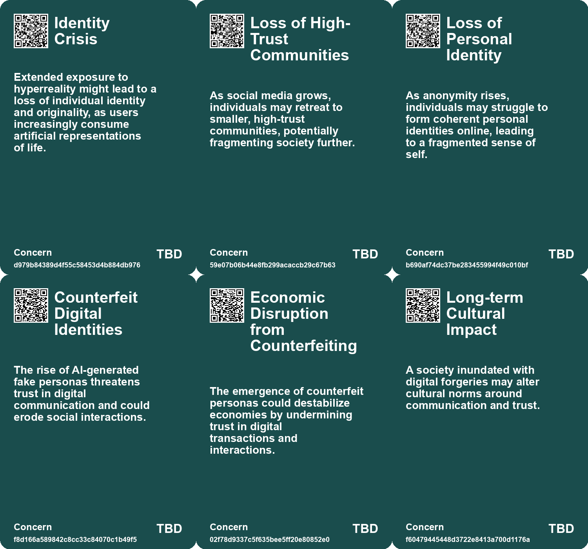
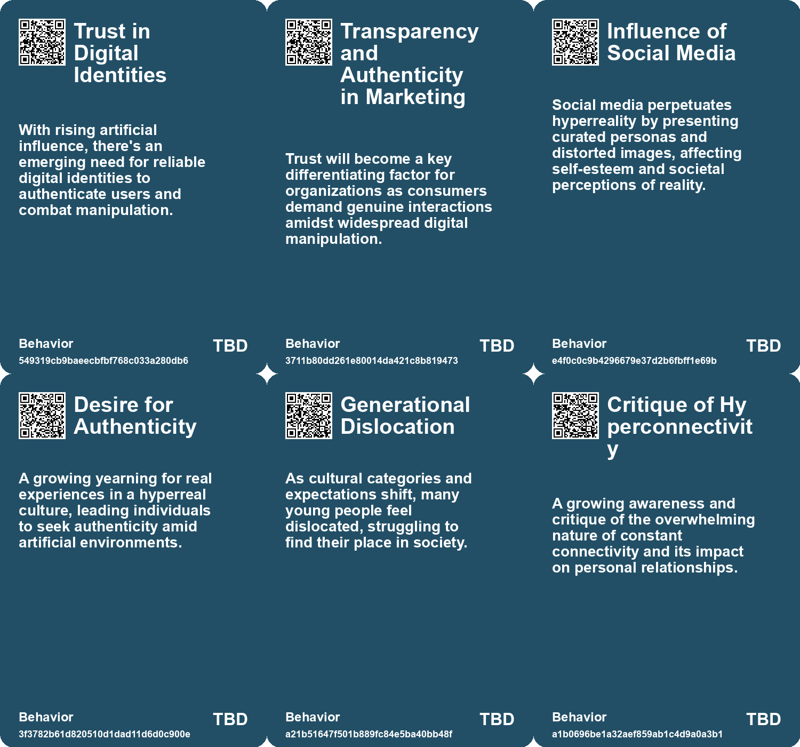
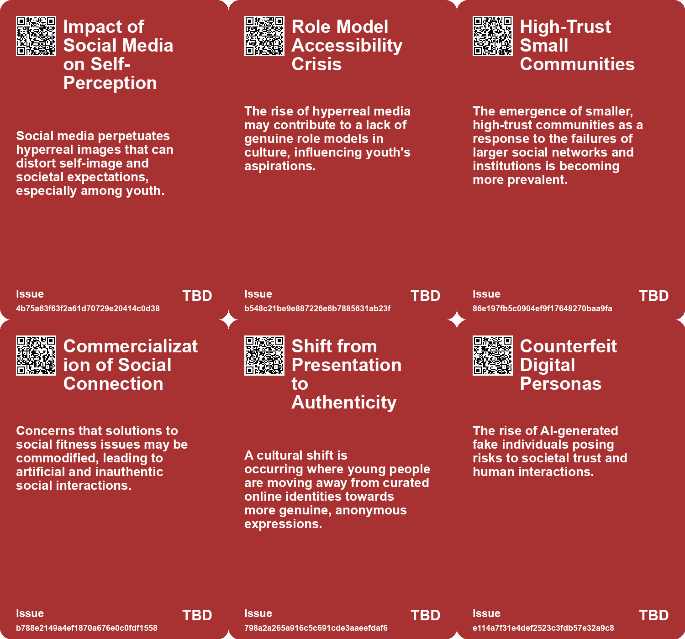
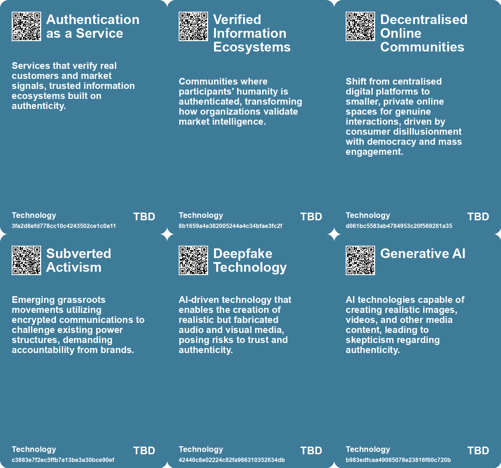

# *Topic*: Crisis of Authenticity in Social

# Summary

Loneliness and social connection have emerged as critical public health issues, with a significant portion of the American population reporting feelings of isolation. The U.S. Surgeon General's report underscores the importance of fostering meaningful relationships, particularly in an age where technology often replaces authentic interactions. This crisis is especially pronounced among younger generations, who are increasingly turning to platforms that prioritize anonymity and privacy over personal branding.

The rise of anonymity among Gen Z reflects a broader cultural shift away from the pressures of social media. As traditional platforms like Instagram evolve into curated spaces dominated by influencers, users are seeking refuge in private groups and niche communities. This trend highlights a growing desire for authenticity in a digital landscape that often prioritizes commercial viability over genuine expression. Artists and creatives face mounting pressure to develop personal brands, leading to a conflict between artistic integrity and the demands of self-promotion.

The influence of technology extends beyond social media, impacting the very nature of creativity and authenticity. The proliferation of artificial intelligence has raised concerns about the creation of counterfeit identities, which can distort perceptions and undermine trust in digital interactions. The emergence of "deep doubt" reflects a skepticism towards the authenticity of digital media, as AI-generated content blurs the lines between reality and fabrication. This skepticism is compounded by the challenges of misinformation, which threaten the foundations of democracy.

As society grapples with these issues, the concept of "Everything as a Service" emerges, critiquing the transactional nature of modern life. The outsourcing of personal agency and emotional stability raises questions about fulfillment and purpose. In a world where social issues are commodified, true meaning must be sought from within rather than through external validation.

The decline of democratic institutions and the rise of autocratic governance are also significant concerns. The fragmentation of global power and the influence of emerging cultural movements signal a shift in societal norms. As younger generations rise against existing systems, the need for grassroots movements becomes increasingly apparent.

Amid these challenges, the importance of ethical leadership and corporate responsibility is underscored. The prevalence of "bullshit jobs" in corporate environments highlights a disconnect between productivity and meaningful work. Organizations must prioritize long-term thinking and open dialogue to prevent ethical collapse.

Finally, the concept of Dunbar's Number suggests that maintaining social relationships is becoming increasingly difficult in a digitally connected world. As communities grow beyond manageable sizes, trust erodes, prompting a retreat to smaller, high-trust environments. This evolution may be essential for sustaining social cohesion in an age marked by rapid technological change and shifting cultural landscapes.

# Seeds

|    | name                                    | description                                                                                             | change                                                                                               | 10-year                                                                                                                 | driving-force                                                                                                       |
|---:|:----------------------------------------|:--------------------------------------------------------------------------------------------------------|:-----------------------------------------------------------------------------------------------------|:------------------------------------------------------------------------------------------------------------------------|:--------------------------------------------------------------------------------------------------------------------|
|  0 | Rise of Verified Information Ecosystems | Communities prioritizing verified identities for authentic interactions are emerging.                   | Shift from public social media to trusted networks centered on identity verification.                | Verified ecosystems may lead to more trusted, actionable market intelligence.                                           | Organizations strive for authenticity and competitive advantage in the face of digital manipulation.                |
|  1 | Crisis of Information Integrity         | Social media platforms viewed as compromised sources, leading to trust erosion.                         | Decline in reliance on traditional social media for genuine sentiment analysis.                      | Shift towards private, authenticated channels for genuine market insights.                                              | Consumer skepticism towards manipulated content elevates demand for trustworthy information sources.                |
|  2 | Blending of Reality and Fiction         | Modern culture has blurred the lines between what is real and what is fictional, impacting perceptions. | Moving from clear distinctions between reality and fiction to a seamless integration of both.        | In a decade, experiences may favor hyperreal interactions over genuine reality, impacting social dynamics.              | Technological advancements enable immersive experiences that synthesize reality and fiction, redefining engagement. |
|  3 | The Role of Authentic Connections       | Focus on maintaining genuine social interactions beyond commercial influences.                          | Shift from superficial interactions driven by AI to meaningful, authentic connections.               | Cultural value placed on authentic relationships will redefine social engagement norms.                                 | A societal backlash against commodification and a desire for deeper connections.                                    |
|  4 | Rise of Anonymity Culture               | Younger generations are increasingly valuing anonymity over personal branding online.                   | Shift from valuing personal branding and visibility to preferring anonymity and privacy.             | A future where online identities are predominantly anonymous, fostering different social interactions and communities.  | Young people's frustration with surveillance and the pressures of attention-seeking behavior.                       |
|  5 | Rise of Counterfeit Digital Entities    | AI-generated counterfeit people could undermine trust in both digital and physical interactions.        | Shift from relying on human interactions to mistrusting digital representations.                     | In 10 years, digital communication may require verification systems to distinguish real from AI-generated interactions. | The rapid advancement of AI technology enabling the creation of realistic digital personas.                         |
|  6 | Erosion of Human Trust                  | The proliferation of counterfeit people threatens the foundational trust of society.                    | Transition from a society built on trust to one where skepticism prevails in digital communications. | In 10 years, societal norms may evolve to require verification of identities in digital spaces.                         | Increasing reliance on digital interactions and the ease of creating counterfeit personas.                          |
|  7 | Growth of Alternative Platforms         | New social media apps are emerging to cater to users' desire for authenticity and privacy.              | Emergence of platforms like BeReal that focus on more genuine sharing.                               | Diverse social media platforms may thrive based on authenticity and community.                                          | The search for alternatives to mainstream social media giants like Instagram.                                       |
|  8 | Rise of Counterfeit Digital Entities    | AI-generated counterfeit people could undermine trust in both digital and physical interactions.        | Shift from relying on human interactions to mistrusting digital representations.                     | In 10 years, digital communication may require verification systems to distinguish real from AI-generated interactions. | The rapid advancement of AI technology enabling the creation of realistic digital personas.                         |
|  9 | Erosion of Human Trust                  | The proliferation of counterfeit people threatens the foundational trust of society.                    | Transition from a society built on trust to one where skepticism prevails in digital communications. | In 10 years, societal norms may evolve to require verification of identities in digital spaces.                         | Increasing reliance on digital interactions and the ease of creating counterfeit personas.                          |

# Concerns

|    | name                                    | description                                                                                                                                                               |
|---:|:----------------------------------------|:--------------------------------------------------------------------------------------------------------------------------------------------------------------------------|
|  0 | Identity Crisis                         | Extended exposure to hyperreality might lead to a loss of individual identity and originality, as users increasingly consume artificial representations of life.          |
|  1 | Loss of High-Trust Communities          | As social media grows, individuals may retreat to smaller, high-trust communities, potentially fragmenting society further.                                               |
|  2 | Loss of Personal Identity               | As anonymity rises, individuals may struggle to form coherent personal identities online, leading to a fragmented sense of self.                                          |
|  3 | Counterfeit Digital Identities          | The rise of AI-generated fake personas threatens trust in digital communication and could erode social interactions.                                                      |
|  4 | Economic Disruption from Counterfeiting | The emergence of counterfeit personas could destabilize economies by undermining trust in digital transactions and interactions.                                          |
|  5 | Long-term Cultural Impact               | A society inundated with digital forgeries may alter cultural norms around communication and trust.                                                                       |
|  6 | Erosion of Mental Resilience            | Continuous exposure to counterfeit interactions may weaken individuals' capacities to navigate complex social environments.                                               |
|  7 | Loss of Authenticity                    | As our online personas are increasingly crafted by algorithms, there is a risk of losing the authenticity of individual identity.                                         |
|  8 | Authenticity Crisis                     | As generative AI blurs lines between genuine and artificial experiences, the value of perceived authenticity may diminish, leading to confusion about 'real' experiences. |
|  9 | Loss of Authentic Interactions          | The prevalence of technology has diminished authentic, spontaneous social interactions and reliance on personal connections.                                              |

# Cards

## Concerns

## Behaviors

## Issue

## Technology

# Links

* [Understanding Corporate Ethical Collapse: Key Signs and Preventive Measures](https://futures.kghosh.me/45854362019860740951c83df1c7122e)
* [Future Trends Post-2024: Declining Democracies and Emerging Cultural Shifts](https://futures.kghosh.me/bd1b01636b1360716b5951e1cac42724)
* [Addressing the Social Fitness Crisis: The Need for Connection in Modern Society](https://futures.kghosh.me/9aeeedec876dadd7664c8ac15af0b90e)
* [Nostalgia for Simplicity: The Burden of Infinite Choice in Modern Life](https://futures.kghosh.me/7b316ebe449187b79e519a8c6d12a2cd)
* [Polaroid’s Shift: From Creativity to Authenticity in the Age of AI](https://futures.kghosh.me/ba6b48e83806da532c7578d24e914455)
* [Exploring Networked Counterculture: Artists Subverting Social Media Algorithms for Authenticity](https://futures.kghosh.me/e5f4b1b4319694169f1551be43a837c9)
* [Exploring the Modern Entertainment Landscape and Its Societal Implications](https://futures.kghosh.me/c5c2c794f1426e6e307a9df3f9ff61f6)
* [Future Risks Report 2024: Key Findings on Emerging Global Challenges](https://futures.kghosh.me/caf29de5522a914887f9653f8edfd0a6)
* [Exploring the Dangers of Outsourcing Happiness and Personal Fulfillment in Modern Society](https://futures.kghosh.me/a5c0ba498382a4edc0f2bf0d9653ad16)
* [The Shift from Public Instagram to Private Community Sharing: A New Era in Social Media](https://futures.kghosh.me/73a2bffc6e94204086528949ae1205e7)
* [The Psychological Impact of Algorithmic Profiling and Surveillance on Self-Identity in the Digital Age](https://futures.kghosh.me/70ebc812b72117e2ce11248d77ec7d37)
* [Understanding Hyperreality: The Blurring Lines Between Reality and Fiction in Culture](https://futures.kghosh.me/28faebdbb8f547e4b2eaa7c6689982ec)
* [Addressing Threats to Democracy: Strategies for Resilience Against Misinformation and Manipulation](https://futures.kghosh.me/56d1a28746cd95ebaa3d62a4e1f91c3a)
* [The Burden of Self-Promotion: Navigating Art in the Age of Personal Branding](https://futures.kghosh.me/2306b74e2c380b5208c7752bd78c4e12)
* [The UK's Declining Geopolitical Relevance and Elite Inaction: A Historical Perspective](https://futures.kghosh.me/ca555520973a0e8519ff854da1de4d88)
* [The Rise of Industrialized Sentiment Manipulation and the Need for Digital Identity Verification](https://futures.kghosh.me/344ece8d21b6241ead5160fe9a38742f)
* [The Urgent Need to Outlaw AI-Generated Counterfeit People to Protect Society](https://futures.kghosh.me/df749b28f13a14f030501985011f6c5b)
* [Nostalgia for Pre-Smartphone Era: A Reflection on Simpler Times](https://futures.kghosh.me/06ca8cfe66a96c99e2830d74b7493668)
* [The Rise of Anonymity: Gen Z's Shift from Personal Branding to Privacy Online](https://futures.kghosh.me/52a829c92d96543f396d37b44440c475)
* [Understanding Polarization: Healing Our Relationship with Technology and Embracing Diverse Perspectives](https://futures.kghosh.me/c1bb890337ef382bfaa5720c9fd05134)
* [The Facade of Corporate Jobs: Navigating the Illusion of Meaning in the Workplace](https://futures.kghosh.me/b3a123db3ae75230ecea1b94013650e4)
* [Understanding 'Failure to Launch': The Cultural and Economic Struggles of Young American Men](https://futures.kghosh.me/c6a3cc9fe503779d0ad2ec2c66aa7fb8)
* [Understanding Dunbar's Number: The Limits of Human Social Relationships and Modern Technology's Impact](https://futures.kghosh.me/a93d70ec87432da167666ebc18542edd)
* [Exploring the Rise of 'Deep Doubt' Amidst AI-Generated Media Content](https://futures.kghosh.me/97be17298986599d68a1642e4359d6d5)
* [The Urgent Need to Outlaw AI-Generated Counterfeit People to Protect Society](https://futures.kghosh.me/ee8ec5a4a60822d8e8a1774e02d3a7e5)