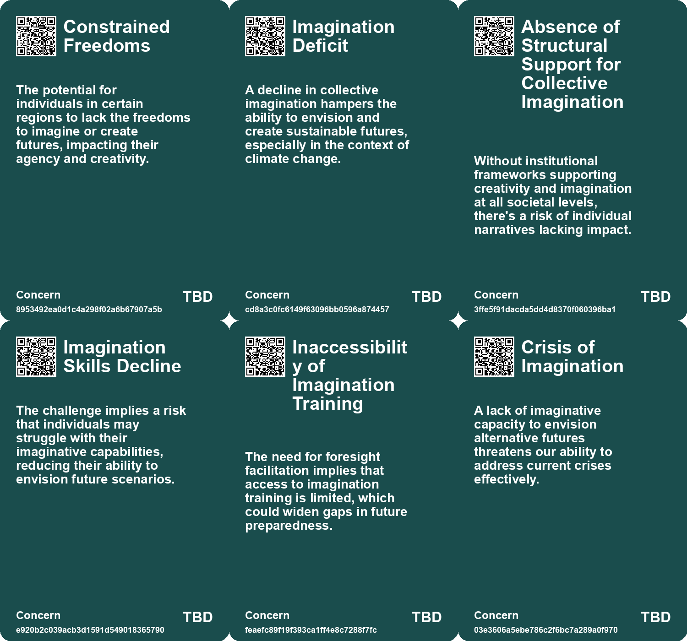
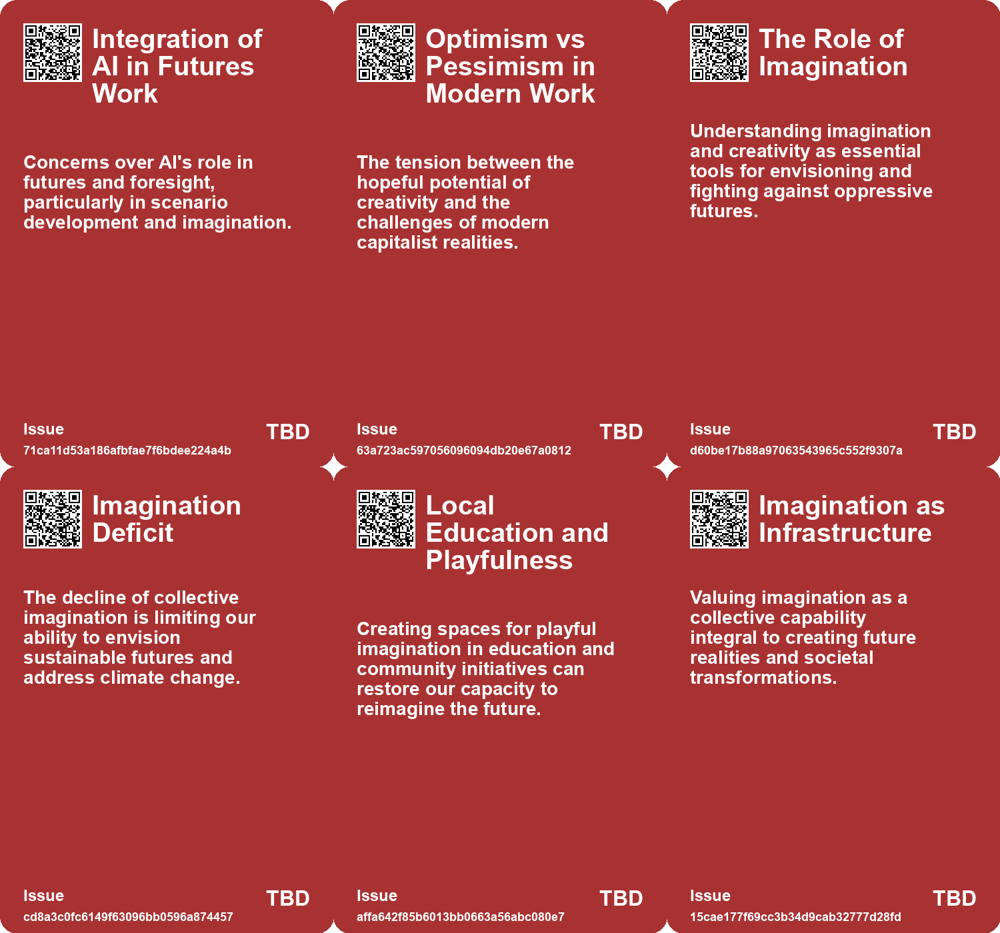
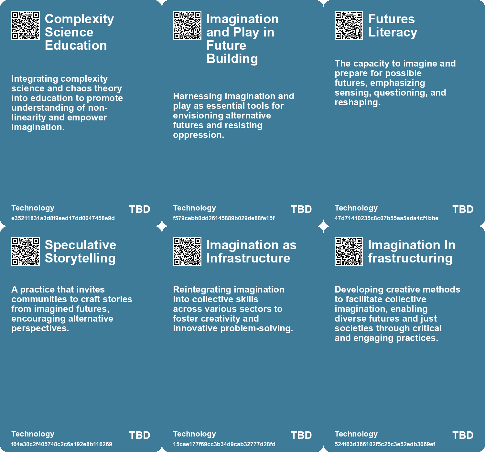

# *Topic*: Crisis of Imagination

# Summary

Imagination and creativity are increasingly recognized as essential tools for addressing contemporary challenges, particularly in the realms of climate change and social justice. Rob Hopkins emphasizes the need for collective imagination to foster community-led initiatives that promote sustainability. His work highlights the importance of storytelling in cultivating optimism and resilience, showcasing successful local projects that inspire action.

Science fiction plays a pivotal role in shaping public discourse around science and technology. It provides a framework for understanding complex future scenarios and encourages empathy through narrative. Initiatives like the Center for Science and the Imagination demonstrate how collaborative worldbuilding can yield impactful policy insights, bridging the gap between imagination and practical solutions.

The concept of futures literacy is gaining traction, emphasizing the ability to envision and prepare for multiple possibilities. This approach encourages communities to engage in storytelling practices that reshape narratives tied to growth and success. By utilizing visioning exercises and speculative storytelling, individuals can cultivate a shared vision that values well-being and interconnection.

However, the field of futures studies faces challenges, particularly in integrating qualitative imagination with quantitative forecasting methods. The disconnect between the desire for multiple possibilities and the demand for singular predictions limits the potential of scenario development. A shift towards embracing complexity and fostering imaginative thinking is necessary to empower future generations.

Co-imagination emerges as a vital process for strengthening social relationships. Research indicates that collaborative envisioning fosters deeper connections among individuals, addressing feelings of loneliness and isolation. This interactive imagination can enhance understanding and empathy, making it a crucial element in building community resilience.

The rise of AI technology raises concerns about its impact on critical thinking and creativity. As reliance on AI increases, there is a risk of declining cognitive abilities and literacy skills. The need for educational practices that prioritize deep thinking and engagement is more pressing than ever, as society grapples with the implications of technological advancements.

Finally, the integration of creativity within organizational frameworks, such as the UN Global Pulse, highlights the importance of imaginative approaches in addressing 21st-century challenges. By combining past achievements with forward-thinking creativity, organizations can foster innovation and drive meaningful change. This perspective underscores the necessity of creativity as a catalyst for transformation in a rapidly evolving world.

# Seeds

|    | name                               | description                                                                               | change                                                                                                  | 10-year                                                                                                   | driving-force                                                                                                      |
|---:|:-----------------------------------|:------------------------------------------------------------------------------------------|:--------------------------------------------------------------------------------------------------------|:----------------------------------------------------------------------------------------------------------|:-------------------------------------------------------------------------------------------------------------------|
|  0 | AI in Scenario Development         | Concerns about AI's role in generating futures scenarios over human imagination.          | Transition from human-led to AI-driven scenario generation, risking imagination loss.                   | Human intuition and creativity in scenario building may diminish as AI takes over more processes.         | The rapid advancement of AI technologies encourages reliance on AI for future scenario creation.                   |
|  1 | Imagination as Resistance          | Using imagination and play is seen as a defense against oppression.                       | Shifting from a constrained view of creativity to seeing it as a tool for freedom.                      | In 10 years, more communities will utilize imagination to envision and advocate for their futures.        | The desire for personal freedoms and creative expression against oppressive environments.                          |
|  2 | Stress as Creative Fuel            | Recognizing stress as a driving force for creativity and future imagining.                | From viewing stress negatively to seeing it as a catalyst for innovation.                               | In 10 years, strategies to harness stress for productivity and creativity will be commonplace.            | The necessity to adapt to challenges and harness pressure for positive outcomes.                                   |
|  3 | The Ministry of Imagination        | Emergence of creative policy frameworks promoting imaginative solutions.                  | From conventional policy-making to imaginative, audacious propositions for change.                      | New governmental structures that prioritize creativity in addressing societal issues.                     | The need for innovative thinking in response to complex global challenges.                                         |
|  4 | Imagination as a Collective Muscle | Imagination is practiced collectively, not just by artists or designers but by everyone.  | From imagination as an individual skill to a shared societal practice.                                  | Imaginative capacity enhances community engagement and cooperative problem-solving.                       | The recognition of the importance of creative thinking in facing societal challenges.                              |
|  5 | Creativity as Survival Skill       | Increasing recognition of creativity as an essential tool in navigating crises.           | From viewing creativity as a luxury to recognizing it as essential for problem-solving.                 | Society will increasingly value creative skills in response to environmental and social challenges.       | The urgent need to innovate amidst pressing global issues such as climate change.                                  |
|  6 | Crisis of Imagination              | A growing awareness of the limitations in imagining alternative futures is emerging.      | Shifting from a narrow scope of future possibilities to a broader, more imaginative potential.          | In ten years, societies may develop richer narratives and plausible alternatives to current trajectories. | The urgent need for innovative thinking in response to the limitations of current societal structures drives this. |
|  7 | Shift in Storytelling Methods      | Increasing use of science fiction as a tool for envisioning future scenarios.             | Transition from traditional scenario building to storytelling for future planning.                      | In 10 years, storytelling will be a primary method for policy-making and strategic planning.              | Growing uncertainty in the world drives the need for imaginative and flexible future planning.                     |
|  8 | Shift in Storytelling Methods      | Increasing use of science fiction as a tool for envisioning future scenarios.             | Transition from traditional scenario building to storytelling for future planning.                      | In 10 years, storytelling will be a primary method for policy-making and strategic planning.              | Growing uncertainty in the world drives the need for imaginative and flexible future planning.                     |
|  9 | Shift to Collaborative Imagination | Research indicates a growing interest in co-imagination over individual imagination.      | From individual psychological processes to collaborative, interactive frameworks for imagining futures. | In 10 years, collaborative imagination might be a standard practice in therapy and relationship building. | Increasing recognition of social dynamics and their influence on individual cognitive processes.                   |
| 10 | Potential for Combating Loneliness | Co-imagination may serve as a tool to alleviate feelings of loneliness and disconnection. | From individual coping strategies to shared imaginative experiences combating loneliness.               | Co-imagination could become a widely adopted method in community building and mental health initiatives.  | Growing awareness of loneliness as a public health issue and the need for social connection.                       |

# Concerns

|    | name                                                     | description                                                                                                                                            |
|---:|:---------------------------------------------------------|:-------------------------------------------------------------------------------------------------------------------------------------------------------|
|  0 | Constrained Freedoms                                     | The potential for individuals in certain regions to lack the freedoms to imagine or create futures, impacting their agency and creativity.             |
|  1 | Imagination Deficit                                      | A decline in collective imagination hampers the ability to envision and create sustainable futures, especially in the context of climate change.       |
|  2 | Absence of Structural Support for Collective Imagination | Without institutional frameworks supporting creativity and imagination at all societal levels, there's a risk of individual narratives lacking impact. |
|  3 | Imagination Skills Decline                               | The challenge implies a risk that individuals may struggle with their imaginative capabilities, reducing their ability to envision future scenarios.   |
|  4 | Inaccessibility of Imagination Training                  | The need for foresight facilitation implies that access to imagination training is limited, which could widen gaps in future preparedness.             |
|  5 | Crisis of Imagination                                    | A lack of imaginative capacity to envision alternative futures threatens our ability to address current crises effectively.                            |
|  6 | Narrative Shifts                                         | Failure to create inclusive narratives may inhibit collective imagination and progress toward hopeful futures.                                         |
|  7 | Cultural Resistance to Art and Imagination               | Some stakeholders may view art and imagination as unprofessional or irrelevant, impeding their integration into serious work.                          |
|  8 | Effectiveness of Fictional Narratives                    | Concern about the real-world impact of speculative fiction when it contrasts significantly with reality.                                               |
|  9 | Generational Divide in Visioning                         | Disparities in how different generations perceive and engage in imagining futures could lead to disconnection and conflict.                            |

# Cards

## Concerns

## Behaviors

## Issue

## Technology

# Links

* [The Rise of Science Fiction: J.G. Ballard's Vision for Literature and Society](https://futures.kghosh.me/8ebb431ce8d949d5a1ecb52bbd42a69f)
* [Envisioning Future Societies Through Science Fiction Prototyping](https://futures.kghosh.me/a438591373b3ce215c807a83c53eabe3)
* [Exploring the Link Between Creativity and Climate Optimism for a Sustainable Future](https://futures.kghosh.me/1803433f32d1db4b39c9b6041650b939)
* [Exploring Future Scenarios: Insights from the AXA Foresight Report](https://futures.kghosh.me/d7b9e79afee991472cfcc08d1fa1ce91)
* [Navigating the Challenges of Futures Work: The Importance of Imagination over Forecasting](https://futures.kghosh.me/fc5aff18bd82eee704d71ab624500dbe)
* [Exploring Tensions and Truths in Envisioning Future Possibilities After Recent Events](https://futures.kghosh.me/b752d5e8f3a088df428207c6902c9477)
* [Harnessing Science Fiction as a Tool for Engaging Science and Technology Policy Discussions](https://futures.kghosh.me/58c98790e621e1df2e408b359c701026)
* [A Call for Systemic Change and Collective Imagination for a Better Future](https://futures.kghosh.me/acf990eb33fa063a87b3395a3a2e3bb4)
* [Exploring the Paradox of Exhaustion and Creative Flow Through the Noetic Spiral](https://futures.kghosh.me/41317b487f66f51787c3f667e738a046)
* [Rob Hopkins: A Visionary Advocate for Imagination and Sustainable Futures](https://futures.kghosh.me/7ae45f5efaa5dccd74ad7d99220e86b6)
* [Exploring the Role of Creativity in Transforming the United Nations System](https://futures.kghosh.me/0e4fa89385bf984d36c7b8a31fd670e7)
* [The Impact of AI Imaging on Art, Creativity, and Human Connection](https://futures.kghosh.me/de89ae90257007a4fbb1a5c7a7dc82a5)
* [Exploring Healing-Centric Design in the Age of Emerging Technologies](https://futures.kghosh.me/6ce4d4d1c40fef14044ea70a600c66d4)
* [Institute for Sustainable Worlds: A Catalyst for Social Change and Imagination](https://futures.kghosh.me/08e55fc0d90249b2ec84db7f4da5a0a0)
* [The Decline of Human Thinking in the Age of AI: A Call for Educational Reform](https://futures.kghosh.me/1909e5d11ae6f5dc49eb87e739bb1885)
* [Envisioning Future Societies Through Science Fiction Prototyping](https://futures.kghosh.me/5d2fec6b3cc04645c92e73267da0f7d9)
* [Exploring Future Concepts: Julio Cortázar's Influence and Alternative Models](https://futures.kghosh.me/b8b0a7af9c851d7f68d775d61199fa62)
* [Enhancing Future Imagination Through a Structured Five-Minute Challenge](https://futures.kghosh.me/b23e3944a43b1519308d2c3d25e7f320)
* [Exploring Futurism in Indigenous Art: Future Imaginaries Exhibit](https://futures.kghosh.me/d688ddddbb61a934e594c21b14d2aaf6)
* [Understanding Graham Wallas's Four Stages of Creativity from 1926](https://futures.kghosh.me/3afedfeeb9568b51e6c20d086a734e92)
* [Reimagining Futures Thinking: Addressing Critical Flaws and Embracing Transformation](https://futures.kghosh.me/670b7a7f03caef5935520a962c78dd5a)
* [Harnessing the Power of Imagination for a Better Future Through Imagineering](https://futures.kghosh.me/c8574c3fabcddaff47072c5b93a50476)
* [The Rise of Creativity: Understanding Its Evolution and Cultural Impact Since WWII](https://futures.kghosh.me/4704e0c971a5aab83464d9025df5fe6d)
* [The Power of Co-Imagination: Building Closer Connections Through Shared Future Experiences](https://futures.kghosh.me/88c8d5d92bc16f2295e3bcdf3e62d47f)
* [Transforming Futures Through Collective Storytelling and Imagination in 2040](https://futures.kghosh.me/5253f33fcfca081374c34a3c9f617a75)
* [Exploring the Intersection of Gaming and Futures Studies: Insights from the Dreams and Disruptions Game](https://futures.kghosh.me/7497f712012e964266a440f7ff73974e)
* [Understanding Polarization: Healing Our Relationship with Technology and Embracing Diverse Perspectives](https://futures.kghosh.me/c1bb890337ef382bfaa5720c9fd05134)