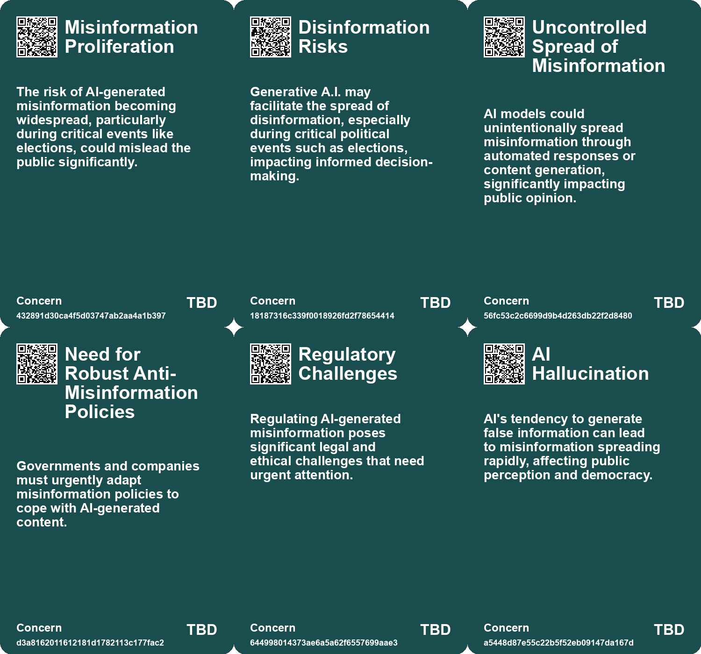
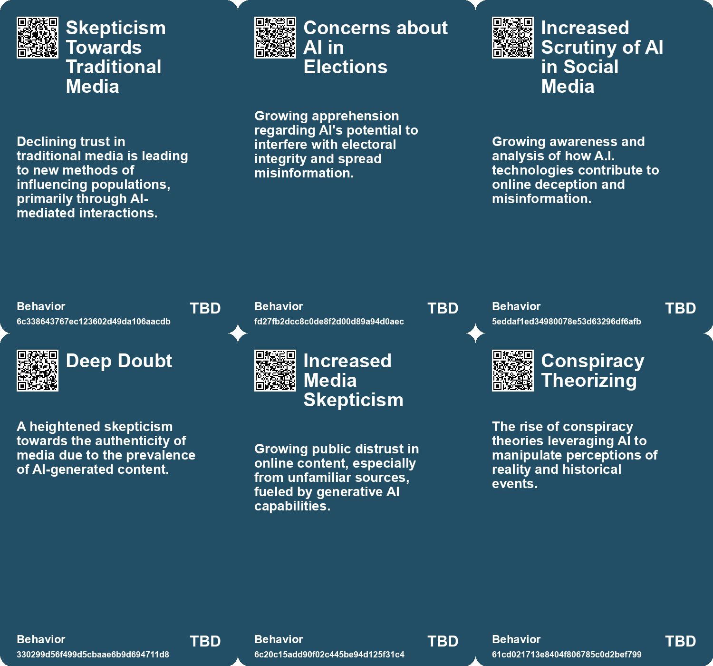
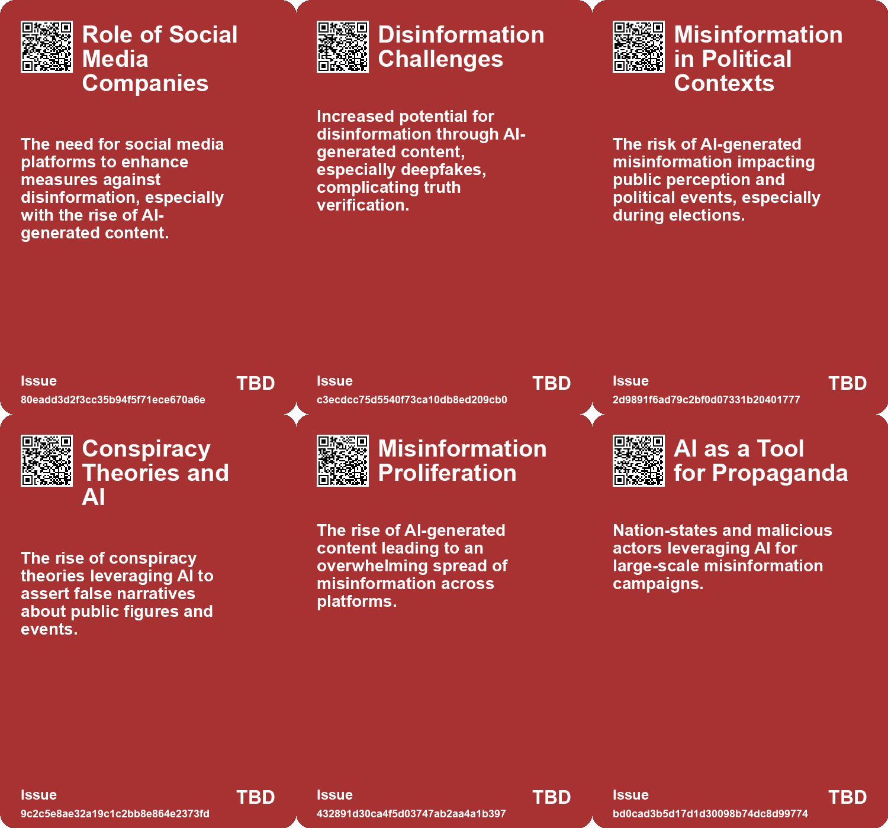
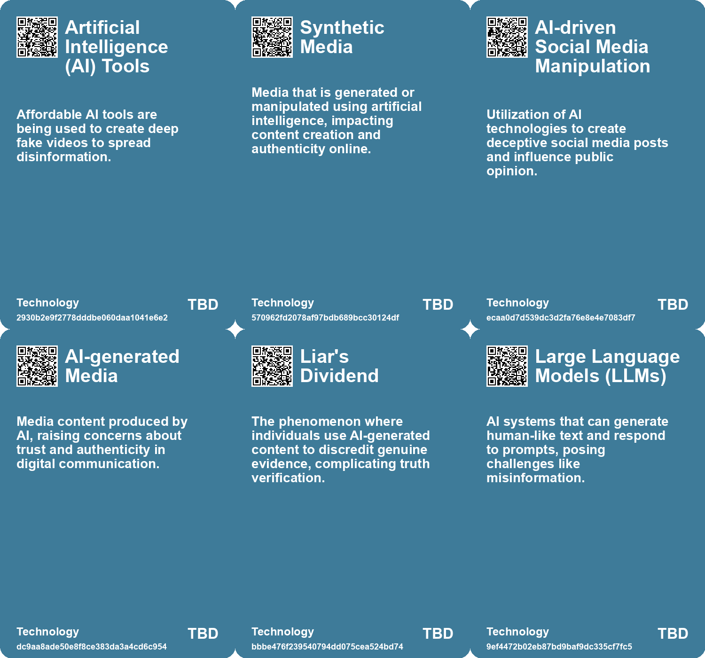

# *Topic*: Crisis of Misinformation through AI

# Summary

The rise of artificial intelligence (AI) and synthetic media is reshaping the digital landscape, raising significant concerns about misinformation and trust. A report from Europol warns that by 2026, up to 90 percent of online content could be artificially generated, highlighting the potential for deepfake technology to manipulate information and harm artists and writers. This growing skepticism, termed "deep doubt," reflects a broader societal unease about the authenticity of digital media, as seen in conspiracy theories involving public figures.

AI systems, such as chatGPT and Dall-E 2, are capable of producing human-like text and images, but their ease of use raises questions about the reliability of information. The proliferation of AI-generated content has already impacted platforms like Stack Overflow, where misinformation can spread rapidly. Experts emphasize the need for social media companies to reconsider their misinformation policies and develop tools to combat the threats posed by AI-generated content.

The ethical implications of AI are further complicated by its misuse in extremist propaganda. Reports indicate that groups like Hezbollah and Hamas are leveraging generative AI to create and disseminate propaganda, potentially undermining efforts to remove extremist content from the internet. The use of AI by domestic extremist groups in the U.S. is also on the rise, with reports detailing the creation of AI-generated hate speech and recruitment materials. This trend underscores the urgent need for regulations to address the challenges posed by AI in the context of political and social extremism.

Concerns about election integrity are mounting as AI technologies become more prevalent. OpenAI's CEO, Sam Altman, has called for regulatory measures to prevent AI from compromising electoral processes, especially with the 2024 election approaching. The potential for AI to generate misleading content, such as deepfake videos, necessitates a clear code of conduct for political actors and greater transparency in campaign communications.

The environmental impact of AI and the biases inherent in large language models are also critical issues. The computing power required for these models raises concerns about their carbon footprint, while biased systems can perpetuate harmful stereotypes. The rush to deploy AI technologies without adequate security measures has led to a "glitchy and scammy internet," prompting calls for more responsible AI development.

As AI continues to evolve, the need for public awareness and education becomes increasingly important. The potential for AI to disrupt the labor market and create significant job displacement necessitates government intervention and support for workforce retraining. The conversation around AI ethics and governance is gaining momentum, with experts advocating for transparency and accountability in AI development.

Finally, the emergence of counterfeit digital identities poses a serious threat to societal trust. The ability to create convincing AI-generated personas can undermine democracy and manipulate public opinion. Experts argue for the implementation of watermark systems and strict liability laws to hold AI companies accountable for misuse, emphasizing the need to protect human dignity and freedom in an increasingly digital world.

# Seeds

|    | name                                                     | description                                                                                 | change                                                                                                    | 10-year                                                                                                            | driving-force                                                                                             |
|---:|:---------------------------------------------------------|:--------------------------------------------------------------------------------------------|:----------------------------------------------------------------------------------------------------------|:-------------------------------------------------------------------------------------------------------------------|:----------------------------------------------------------------------------------------------------------|
|  0 | Disinformation Concerns                                  | Growing concerns about disinformation driven by deepfake technology.                        | Shift from traditional disinformation tactics to sophisticated AI-generated misinformation.               | Information ecosystems will require new frameworks to combat and verify authenticity.                              | The ongoing battle against misinformation and the need for public awareness.                              |
|  1 | Public Demand for AI Transparency                        | A push for transparency in AI-generated content to combat misinformation.                   | Transition from opaque AI content to clear labeling of AI-generated materials.                            | In a decade, all AI-generated content may be required to be transparently labeled, reducing misinformation spread. | The need to build public trust in digital information sources amidst rising misinformation concerns.      |
|  2 | Generative A.I. and Online Disinformation                | Concerns about the role of generative A.I. in spreading disinformation during elections.    | Change from traditional media influence to digital A.I.-generated disinformation.                         | In a decade, A.I. may play a dominant role in shaping electoral narratives and public opinion.                     | The convergence of technology and politics during critical electoral periods.                             |
|  3 | Deep Doubt Era                                           | Increasing public skepticism towards the authenticity of media due to AI-generated content. | Shift from trust in media to widespread skepticism about the authenticity of visuals.                     | In 10 years, media consumption may prioritize transparency and verification tools over traditional sources.        | The proliferation of advanced AI tools that enable easy creation of convincing fake media.                |
|  4 | Conspiracy Theories Amplification                        | Rise in conspiracy theories fueled by AI-generated media and deep doubt.                    | Shift from skepticism towards specific events to broader distrust in all media narratives.                | Conspiracy theories may become mainstream, affecting public trust in institutions and media.                       | The intersection of technology, misinformation, and social media dynamics.                                |
|  5 | Misinformation Overload                                  | The rise of AI-generated content leads to an overwhelming volume of misinformation.         | Shift from occasional misinformation to a pervasive ocean of false information.                           | Society may struggle to discern truth in a landscape dominated by AI-generated misinformation.                     | The ease of producing large volumes of content using AI tools encourages the spread of misinformation.    |
|  6 | AI as a Tool for Propaganda                              | Nation-states leverage AI to create vast amounts of misleading content.                     | Shift from traditional misinformation to automated and sophisticated propaganda techniques.               | The landscape of information warfare may evolve, increasing the sophistication of misinformation campaigns.        | The strategic advantage gained from using AI to amplify propaganda efforts.                               |
|  7 | Integration of AI in Misinformation Combat               | Call for new AI tools to counter misinformation generated by large language models.         | Shift from reliance on existing AI models to the development of specialized tools for truth verification. | New AI systems may emerge, designed specifically to identify and combat misinformation.                            | The recognition of the limitations of current AI models in fighting misinformation effectively.           |
|  8 | Collaboration Between Political Parties on AI Regulation | A potential cross-party consensus on managing AI and misinformation.                        | From fragmented approaches to a collaborative framework for AI regulation in politics.                    | Political parties will work together to establish norms and regulations for AI usage in campaigns.                 | The shared risks posed by AI misuse encourage bipartisan efforts to find solutions.                       |
|  9 | Educational Initiatives for AI Literacy                  | A push for critical thinking education to combat misinformation created by AI.              | From passive consumption of information to active critical engagement with AI-generated content.          | Society will prioritize AI literacy, enabling voters to discern credible information from misinformation.          | The need to maintain information integrity amidst rising AI-generated content drives educational reforms. |

# Concerns

|    | name                                         | description                                                                                                                                                     |
|---:|:---------------------------------------------|:----------------------------------------------------------------------------------------------------------------------------------------------------------------|
|  0 | Misinformation Proliferation                 | The risk of AI-generated misinformation becoming widespread, particularly during critical events like elections, could mislead the public significantly.        |
|  1 | Disinformation Risks                         | Generative A.I. may facilitate the spread of disinformation, especially during critical political events such as elections, impacting informed decision-making. |
|  2 | Uncontrolled Spread of Misinformation        | AI models could unintentionally spread misinformation through automated responses or content generation, significantly impacting public opinion.                |
|  3 | Need for Robust Anti-Misinformation Policies | Governments and companies must urgently adapt misinformation policies to cope with AI-generated content.                                                        |
|  4 | Regulatory Challenges                        | Regulating AI-generated misinformation poses significant legal and ethical challenges that need urgent attention.                                               |
|  5 | AI Hallucination                             | AI's tendency to generate false information can lead to misinformation spreading rapidly, affecting public perception and democracy.                            |
|  6 | Ethical Issues in AI Content Creation        | Concerns about media manipulation, copyright violations and the potential for misinformation as AI-generated content becomes ubiquitous.                        |
|  7 | AI-driven Misinformation and Fraud           | The potential for AI technologies to generate harmful misinformation and facilitate fraud, negatively impacting society.                                        |
|  8 | AI Reliability and Safety                    | The reliability of AI systems like Google's AI Overviews is under scrutiny, with potentially harmful misinformation being propagated.                           |
|  9 | Information Overload and Misinformation      | The risk of individuals being overwhelmed by misinformation due to the proliferation of AI-generated content, threatening consensus on reality.                 |

# Cards

## Concerns

## Behaviors

## Issue

## Technology

# Links

* [OpenAI Discovers Abuse of Its AI Tools in Global Disinformation Campaigns by State Actors](https://futures.kghosh.me/038728d36aa4f09090b2d01ffe571ab4)
* [The Urgent Need for Ethical AI Regulations Amid Rapid Development and Deployment](https://futures.kghosh.me/382e9ebc1e518ee49e541da1e6b5f8af)
* [Addressing Generative AI Threats in the Upcoming UK General Election](https://futures.kghosh.me/9bcd0e8850a5de2296f414bfeeff7567)
* [The Rising Threat of Generative AI in Extremist Propaganda and Child Exploitation](https://futures.kghosh.me/4aae935ffedd7227301fe1eb6647d69f)
* [Navigating the Promises and Perils of Artificial Intelligence Development](https://futures.kghosh.me/7fcef9a240c0738d2390c83f9713dc98)
* [Extremists in the US Exploit AI Tools for Hate Speech and Recruitment Efforts](https://futures.kghosh.me/922dd73d3cd60450863808b908f314d8)
* [Bangladesh's Disinformation Campaign: The Role of AI and Deep Fakes in Elections](https://futures.kghosh.me/299ee0a175c6ba617e28713566f23557)
* [The Threat of Deepfake Technology: Implications for Women and Society](https://futures.kghosh.me/14889902198ab8b6f7991b108f6ebb02)
* [AI's Impact on Society: Job Displacement and the Need for Retraining](https://futures.kghosh.me/cf119665e47c7434e3e3c54dbbc585e3)
* [Thriving in an AI Era: Embracing, Adapting, and Complementing Technology](https://futures.kghosh.me/23a3410059759ba4214235628d4ebd4b)
* [Stability AI's CEO Predicts AI Will Disrupt Society More Than the Pandemic](https://futures.kghosh.me/283ff70c63aed09ef2b0613f6acc2eb9)
* [The Urgent Need to Outlaw AI-Generated Counterfeit People to Protect Society](https://futures.kghosh.me/df749b28f13a14f030501985011f6c5b)
* [Exploring the Future of AI in Knowledge Ecosystems and Global Challenges](https://futures.kghosh.me/a9266018b458295480a07167310458a9)
* [Exploring the Rise of 'Deep Doubt' Amidst AI-Generated Media Content](https://futures.kghosh.me/97be17298986599d68a1642e4359d6d5)
* [The Security Risks of Rapid AI Integration: A Call for Caution and Awareness](https://futures.kghosh.me/b30a4282af9e53ca673438a8223d9525)
* [The Threat of Authoritarian Intelligence: A Call for Responsible AI Development](https://futures.kghosh.me/0ba4fa557cd2aae4760bd7a2abca844e)
* [Europol Report Warns of Rising AI-Generated Content and Disinformation Risks](https://futures.kghosh.me/8900fb75566c9d1b008c2e2c36f7a8e2)
* [Google's 2026 Cybersecurity Forecast: The Rise of AI-Driven Cybercrime and Nation-State Threats](https://futures.kghosh.me/5cbd39db8f9df76ceec518a276cd7d17)
* [The Dual-edged Sword of AI: Misinformation and Societal Threats in the Age of Advanced Language Models](https://futures.kghosh.me/9787333cafcd0252d71a9bff845ad093)
* [The Future of Espionage: The Rise of AI Companions and Their Impact on Intelligence Operations](https://futures.kghosh.me/d69000a9cb92fc175a8a1dfb042622e2)
* [OpenAI CEO Highlights AI Risks to Election Integrity and Calls for Regulation](https://futures.kghosh.me/fd96f58595786b0820cca21394223a66)
* [The Urgent Need to Outlaw AI-Generated Counterfeit People to Protect Society](https://futures.kghosh.me/ee8ec5a4a60822d8e8a1774e02d3a7e5)