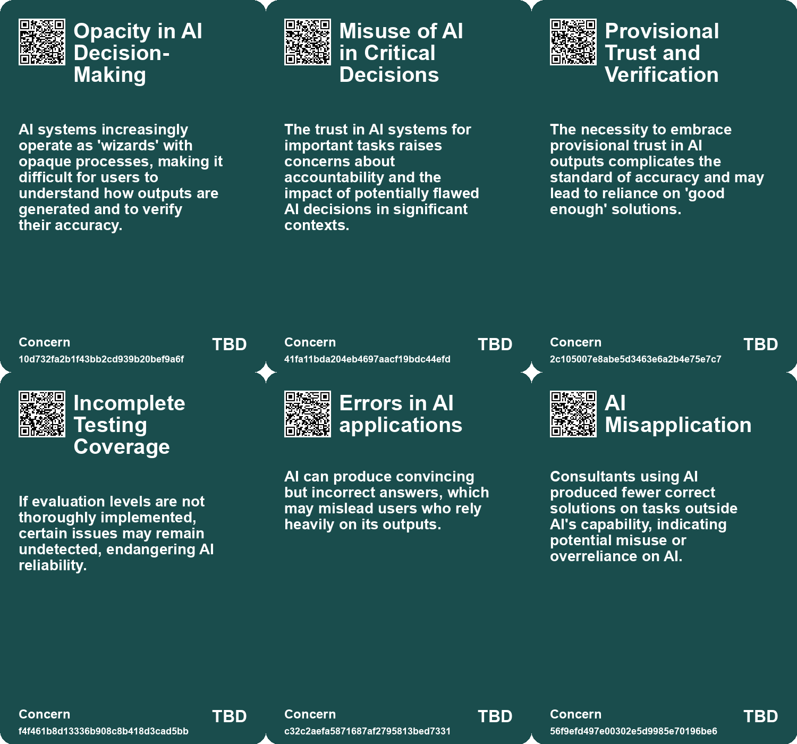
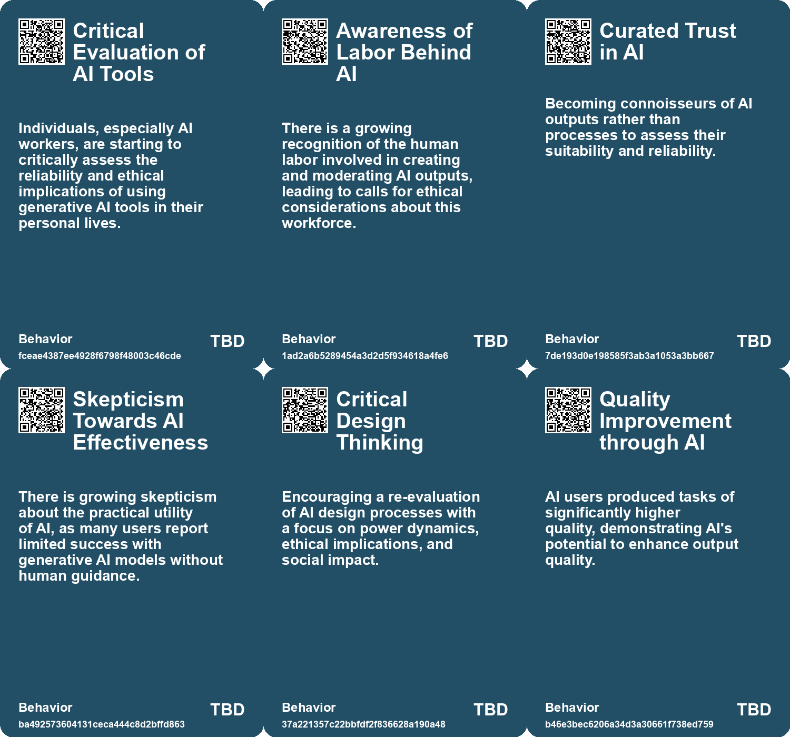
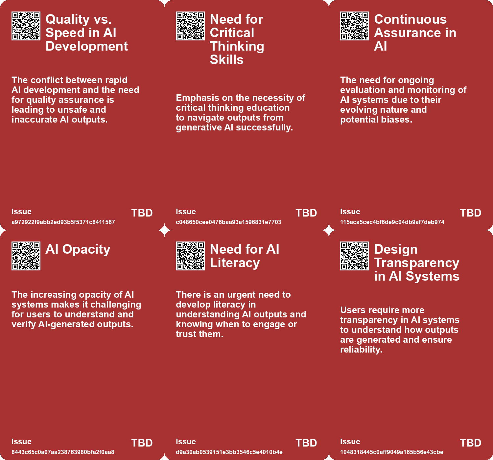
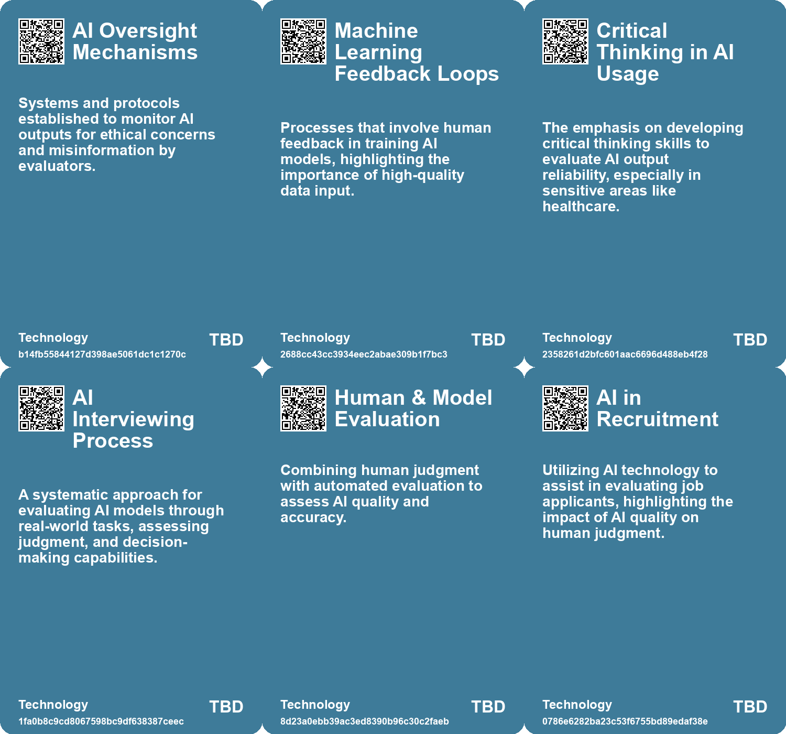

# *Topic*: Critical Evaluation of AI Outputs

# Summary

The integration of artificial intelligence (AI) into various sectors has sparked significant discussion about its impact on productivity, creativity, and the workforce. Studies show that AI can enhance the productivity of knowledge workers, particularly in consulting, where AI-assisted consultants outperformed their peers in quality and efficiency. However, reliance on AI also presents risks, such as cognitive atrophy and over-reliance on technology, which can diminish critical thinking skills.

Despite the potential benefits, a substantial number of AI implementations in enterprises fail to yield positive financial outcomes. Research indicates that 95% of generative AI projects do not create measurable business impact, often due to poor integration with existing workflows. Successful AI initiatives tend to focus on specific pain points and involve collaboration with external providers. This highlights the need for organizations to align their AI strategies with clear objectives and invest in data readiness.

The evaluation of AI systems is crucial for their successful deployment. Robust evaluation frameworks can help organizations assess AI performance beyond initial demonstrations, ensuring continuous improvement and effective debugging. Companies are encouraged to develop tailored assessments that reflect real-world tasks, moving away from flawed benchmarks that may not accurately measure AI capabilities.

Concerns about the ethical implications of AI are also prominent. Workers in AI-related fields express distrust in the reliability of AI-generated content, particularly in sensitive areas like medical information. The potential for misinformation and the ethical use of AI tools are critical issues that need addressing. As AI becomes more integrated into daily life, the risk of dependency on these systems raises questions about the future of learning and skill development.

The impact of AI on the job market is another area of concern. While AI has the potential to automate tasks and improve efficiency, it also poses risks of job displacement, particularly in entry-level positions. The economic viability of AI automation varies, with only a fraction of tasks currently suitable for AI integration. This calls for a gradual approach to AI adoption, considering both the potential for new job creation and the need for reskilling the workforce.

The relationship between humans and AI is evolving, with users increasingly relying on AI outputs without fully understanding their processes. This shift necessitates a new literacy in navigating AI-generated content, emphasizing the importance of critical engagement and skepticism. As AI tools become more sophisticated, the need for transparency and trust in these systems remains paramount.

Finally, the societal implications of AI extend beyond individual productivity and creativity. The rapid advancement of AI technology raises questions about equity, misinformation, and the distribution of value within the industry. As big tech companies dominate the AI landscape, there are opportunities for startups to innovate at the application layer. The ongoing dialogue about AI's role in society underscores the need for responsible implementation and thoughtful consideration of its broader impacts.

# Seeds

|    | name                                       | description                                                                                       | change                                                                                           | 10-year                                                                                                         | driving-force                                                                                            |
|---:|:-------------------------------------------|:--------------------------------------------------------------------------------------------------|:-------------------------------------------------------------------------------------------------|:----------------------------------------------------------------------------------------------------------------|:---------------------------------------------------------------------------------------------------------|
|  0 | Distrust Among AI Workers                  | AI workers express deep skepticism about the reliability of generative AI systems.                | Shift from trust in AI systems to skepticism and caution among AI professionals.                 | In 10 years, generative AI might be seen as unreliable, affecting its usage in various sectors.                 | Increased awareness of AI's limitations and variability in output quality drives caution.                |
|  1 | Integration of Human Expertise             | The evaluation of AI will increasingly involve human experts in realistic assessments.            | From pure AI self-assessment to combined assessments with human evaluations.                     | AI evaluations will integrate expert insights, leading to richer and more reliable assessments.                 | Expert judgment is needed to interpret complex AI performances and implications.                         |
|  2 | Focus on Continuous Assurance              | Emphasis on continuous evaluation and testing of AI systems for long-term performance.            | From one-time testing approaches to ongoing, iterative assurance processes for AI.               | Continuous assurance could lead to more reliable and adaptive AI systems across sectors.                        | The dynamic nature of AI systems demands continual vigilance and adjustment over time.                   |
|  3 | Challenges in verifying AI output accuracy | Difficulty in confirming the accuracy of AI-generated results due to lack of transparency.        | Transitioning from easily verifiable outputs to trusting AI conclusions without thorough checks. | Potential widespread acceptance of AI outputs despite uncertainty concerning accuracy and correctness.          | Increased complexity of tasks handled by AI making verification cumbersome or impossible.                |
|  4 | Need for an AI literacy framework          | Emerging requirement for users to understand AI functionality and outputs critically.             | From traditional evaluation methods to a need for new literacy in assessing AI outputs.          | A developed framework for understanding, trusting, and interacting critically with AI tools.                    | Growing integration of AI in professional tasks necessitating a new skill set for effective interaction. |
|  5 | AI and Decreased Creative Thinking         | AI reliance reportedly hinders creativity, particularly when outputs are challenging to evaluate. | Shift from independent creative processes to reliance on AI-assisted outputs for creative tasks. | The creative landscape may be dominated by AI-assisted solutions, with reduced original thought among creators. | A trend towards efficiency leads individuals to prioritize speed over creativity in work.                |
|  6 | Rethinking AI's Role in Society            | Critique on AI’s lack of reevaluated purpose and societal role.                                   | From a blind adoption of AI technologies to a more critical engagement with their purposes.      | AI technologies may be designed with explicit and evaluated societal benefits as primary goals.                 | Increased societal scrutiny and demand for meaningful technology.                                        |
|  7 | AI in Peer Review Processes                | Introduction of AI in peer review, potentially affecting quality of feedback.                     | Change from human-led peer review to AI-assisted evaluations in academia.                        | Peer review processes may rely heavily on AI, impacting the integrity of scientific validation.                 | Desire for efficiency and faster publication times in academic publishing.                               |
|  8 | Mistrust in Generative AI                  | People show skepticism towards generative AI in high-value areas.                                 | Shift from mistrust in valuable applications to increased reliance on trustworthy AI.            | In 10 years, generative AI may be widely trusted and integrated into critical business processes.               | The need for efficiency and innovation in business drives acceptance of AI technologies.                 |
|  9 | Trustworthiness as a Key Concern           | Trust in AI's outputs is crucial, with emphasis on provenance and traceability of information.    | From blind trust in AI outputs to a demand for verifiable and trustworthy information.           | AI systems may be designed to prioritize transparency and accuracy, fostering user trust.                       | Public demand for accountability and reliability in information sources drives this focus.               |

# Concerns

|    | name                               | description                                                                                                                                                             |
|---:|:-----------------------------------|:------------------------------------------------------------------------------------------------------------------------------------------------------------------------|
|  0 | Opacity in AI Decision-Making      | AI systems increasingly operate as 'wizards' with opaque processes, making it difficult for users to understand how outputs are generated and to verify their accuracy. |
|  1 | Misuse of AI in Critical Decisions | The trust in AI systems for important tasks raises concerns about accountability and the impact of potentially flawed AI decisions in significant contexts.             |
|  2 | Provisional Trust and Verification | The necessity to embrace provisional trust in AI outputs complicates the standard of accuracy and may lead to reliance on 'good enough' solutions.                      |
|  3 | Incomplete Testing Coverage        | If evaluation levels are not thoroughly implemented, certain issues may remain undetected, endangering AI reliability.                                                  |
|  4 | Errors in AI applications          | AI can produce convincing but incorrect answers, which may mislead users who rely heavily on its outputs.                                                               |
|  5 | AI Misapplication                  | Consultants using AI produced fewer correct solutions on tasks outside AI's capability, indicating potential misuse or overreliance on AI.                              |
|  6 | AI Hallucination Risks             | Potential risks of AI-driven inaccuracies could undermine trust in AI outputs and affect decision-making.                                                               |
|  7 | Disillusionment with Generative AI | Users may become disillusioned with generative AI tools due to lack of effectiveness and reliability, impacting the industry's growth.                                  |
|  8 | AI in Peer Review Process          | There is a risk that AI may influence peer review, leading to biased or unqualified evaluations of research.                                                            |
|  9 | Ethical Concerns in Publishing     | The potential for AI-generated errors raises questions about the ethical standards of publishing practices in academia.                                                 |

# Cards

## Concerns

## Behaviors

## Issue

## Technology

# Links

* [Rethinking the Role of AI: From Political Tool to Ethical Design Options](https://futures.kghosh.me/c25cae2b8d72e7634d591247d9ac96d2)
* [The Impact of Generative AI on Human Creativity in Story Writing](https://futures.kghosh.me/de55bd2afb2b9bfadae84d2a0fb8b4e8)
* [Understanding the Importance of Robust Evaluation Systems in AI Development](https://futures.kghosh.me/036d251f4174f7f407504fbb77e9c7c5)
* [The Dual-edged Sword of AI: Misinformation and Societal Threats in the Age of Advanced Language Models](https://futures.kghosh.me/9787333cafcd0252d71a9bff845ad093)
* [The Transformative Potential of AI: Revolutionizing Education, Healthcare, and Global Equity](https://futures.kghosh.me/8acafe1fbe51c2de3cd689956b25b39f)
* [The Impact of Generative AI and Autonomous Agents on Business Value Creation and Trust Issues](https://futures.kghosh.me/15d4ec180189ca1739398f516844cefb)
* [MIT Study Challenges AI Job Displacement Fears with Economic Viability Insights](https://futures.kghosh.me/89ee61cc0d9fa77ecb1eb4100622a53f)
* [Exploring the Future of AI in Knowledge Ecosystems and Global Challenges](https://futures.kghosh.me/a9266018b458295480a07167310458a9)
* [The Impact of Generative AI on Human Creativity in Story Writing](https://futures.kghosh.me/e2006a4269f097491cc98583df08a47d)
* [The Uncertain Future of Generative AI: Hype vs. Reality and Its Implications](https://futures.kghosh.me/f35afe43c2e3b465b8ed4b00023cb0ac)
* [The Dangers of AI Reliance: Cognitive Atrophy and Critical Thinking Decline in Knowledge Workers](https://futures.kghosh.me/682e04f0b543e67738d8ffbb84fc50dd)
* [Exploring AI's Implications: Insights from a Discussion in New Zealand on Artificial Intelligence and Society](https://futures.kghosh.me/7bdbb32950c9d265f6ec455d964973fe)
* [The Transformative Potential of AI: Revolutionizing Education, Healthcare, and Global Equity](https://futures.kghosh.me/2449c2fc4b8afc7e268db4987fa821e5)
* [Evaluating AI Effectiveness: The Need for Customized Assessments Beyond Standard Benchmarks](https://futures.kghosh.me/18de8dd66f7714385f35628458d7671a)
* [MIT Study Reveals High Failure Rate of Enterprise AI Implementations Due to Poor Integration](https://futures.kghosh.me/a6a18a39971f1bcdb555339c05b4dbc5)
* [AI Workers Share Ethical Concerns and Distrust Over Generative AI Reliability and Safety](https://futures.kghosh.me/440c60817054047ca4be7ef38b8c3074)
* [Understanding the Real Risks of AI Beyond Superintelligence and Scalability](https://futures.kghosh.me/ff7f7a51f925c273449a8648a18b7df8)
* [Understanding the 95% AI Pilot Failure Rate and How to Achieve Success](https://futures.kghosh.me/381b17bbec6c2957fe0995c6813483d0)
* [The Urgent Need for Ethical AI Regulations Amid Rapid Development and Deployment](https://futures.kghosh.me/382e9ebc1e518ee49e541da1e6b5f8af)
* [The Impact of AI on Human Performance: A Study on Complacency and Skill Reduction](https://futures.kghosh.me/82d675e881c727c6bf2f35d6a78e72f6)
* [Concerns Over AI Misuse in Scientific Literature: A Growing Challenge for Research Integrity](https://futures.kghosh.me/6dd4fe4c2f8f6e8fcc6f47e7ac1641cf)
* [Navigating the Dilemma of AI Integration in Organizations: Embracing Secret Cyborgs for Innovation](https://futures.kghosh.me/c42a95f16678ed3834840d48f8e775a3)
* [Exploring the Risks of Homogeneity in AI Generated Content and Its Impact on Creativity](https://futures.kghosh.me/9f228766187c6c10eeddbda5a6dbbe7b)
* [AI Testing Framework: Ensuring Safe and Effective Public Sector AI Solutions](https://futures.kghosh.me/7ff12b663b4c7b648df68fea6f762d0a)
* [AI's Impact on Work: Insights from a Study on Consultants Using ChatGPT-4](https://futures.kghosh.me/c94f72ff677c7517a836417c1f1df620)
* [The Transformative Impact of AI on Jobs, Reality, and Economic Value Distribution](https://futures.kghosh.me/17cff4adea214f71c7a5eed15307b0e7)
* [Shifting Relationships: From Co-Intelligence to Dependence on AI Wizards](https://futures.kghosh.me/8303805e3d7cbd7515b1e1e178fe6120)
* [Examining the Effects of AI on Knowledge Worker Performance: A Study with Boston Consulting Group](https://futures.kghosh.me/c63bd059cb529b72b00ecbdcd2f85268)