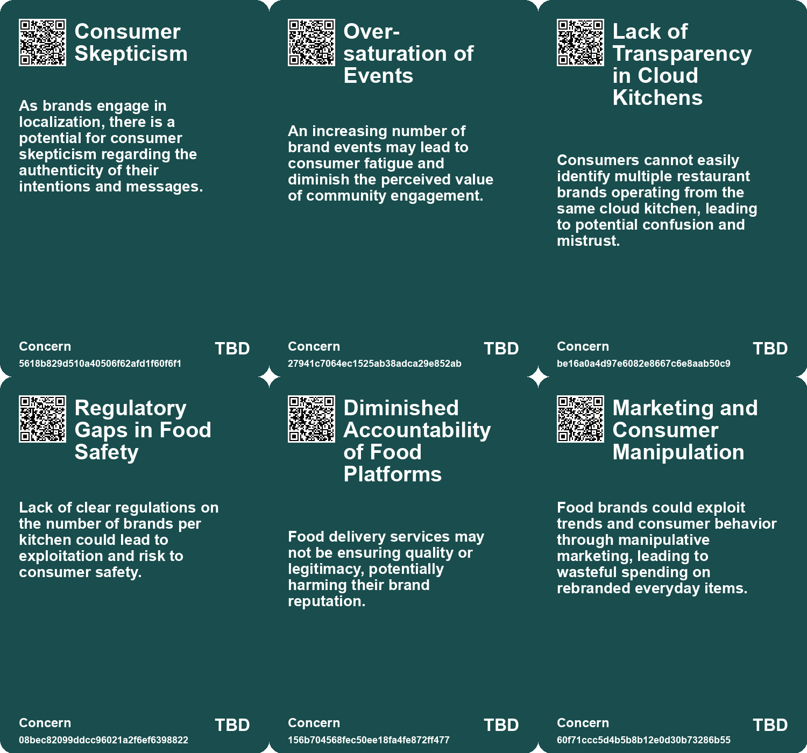
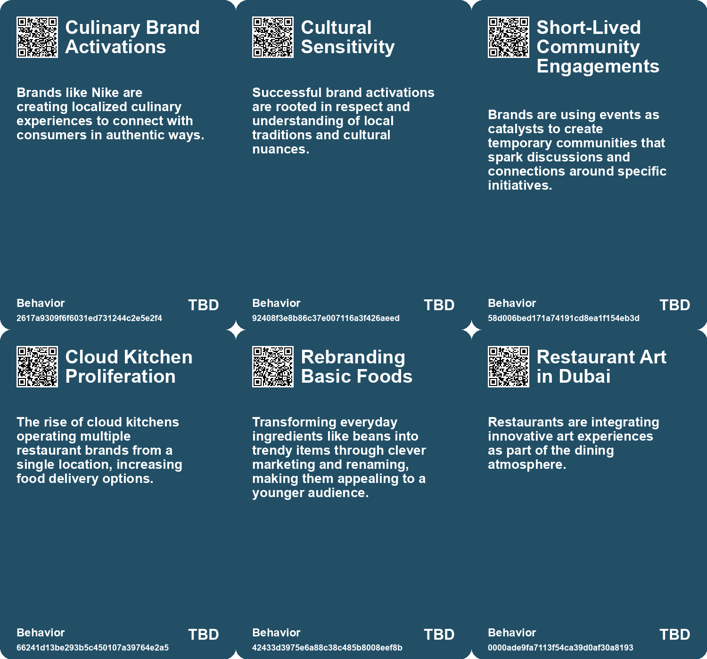
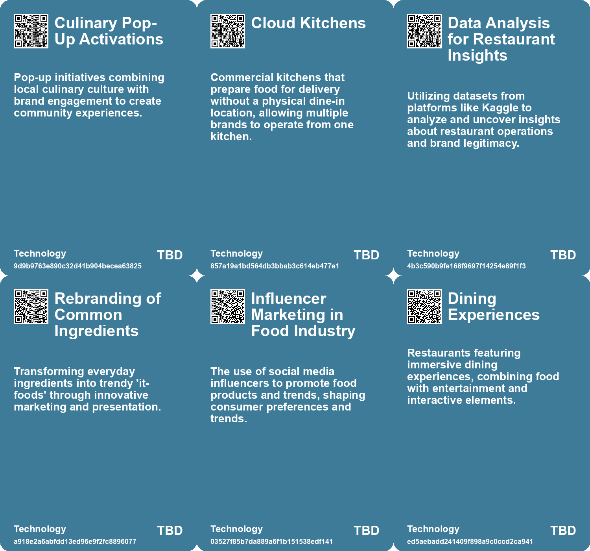

# *Topic*: Culinary Brand Activations

# Summary

The intersection of community engagement and consumer behavior is increasingly evident across various sectors. Initiatives like Oma's Soep's campaign in Amsterdam aim to reduce loneliness among older adults by fostering intergenerational conversations in grocery stores. This reflects a broader trend where brands are recognizing the importance of building community connections, as seen in the evolving strategies of event marketers who focus on community-driven experiences rather than traditional branding.

Retail environments are also adapting to changing consumer preferences. Malls are transforming into social hubs that cater to younger generations, integrating dining and entertainment to enhance the shopping experience. This shift is mirrored in the rise of offline experiences, where brands are prioritizing in-person interactions to combat digital fatigue. Retailers are creating spaces that encourage community engagement, particularly for Gen Z, who value physical shopping as a social activity.

The impact of technology on consumer behavior is significant. The rise of cloud kitchens highlights the challenges of transparency and quality in the food industry, as multiple brands operate from single locations, often misleading consumers. Meanwhile, the emergence of AI in B2B marketing is reshaping how brands engage with customers, introducing new frameworks for communication that prioritize automated interactions.

Sustainability and health concerns are driving changes in consumer choices. The popularity of gas stoves, despite their health risks, illustrates the tension between marketing and consumer awareness. Influencers promote these appliances while downplaying their pollution effects, raising questions about the responsibility of brands in consumer education. In contrast, companies like Eat Just are pioneering alternative proteins, navigating the challenges of profitability while addressing the demand for sustainable food sources.

Cultural shifts are influencing how brands approach identity and marketing. The concept of the symbolic economy emphasizes consumption as a reflection of personal values, with brands taking on roles as moral authorities. This is evident in Taco Bell's marketing strategies that resonate with Gen Z, creating a cult-like following through innovative experiences and collaborations.

The future of urban spaces is being reimagined through initiatives that promote civic engagement and sustainability. Cities are investing in public spaces to foster collaboration and socioeconomic mixing, aiming to enhance quality of life and counteract trends of loneliness and segregation. These efforts reflect a growing recognition of the need for vibrant, inclusive environments that serve diverse communities.

Finally, the pressure on creative individuals to build personal brands highlights the challenges within artistic fields. As artists navigate the demands of self-promotion in a competitive market, the balance between creativity and commercial viability becomes increasingly precarious. This dynamic underscores the evolving landscape of cultural production, where economic survival often takes precedence over artistic integrity.

# Seeds

|    | name                                     | description                                                                                      | change                                                                                                     | 10-year                                                                                                                       | driving-force                                                                                            |
|---:|:-----------------------------------------|:-------------------------------------------------------------------------------------------------|:-----------------------------------------------------------------------------------------------------------|:------------------------------------------------------------------------------------------------------------------------------|:---------------------------------------------------------------------------------------------------------|
|  0 | Technological Integration in Consumption | Brands integrating technology to enhance consumer engagement and identity reinforcement.         | Transition from simple product marketing to technologically enriched brand experiences.                    | The consumer experience will increasingly blend technology and branding to reinforce identity.                                | Advances in technology present opportunities for deeper consumer engagement and loyalty.                 |
|  1 | Emphasis on Experiential Marketing       | Brands are leveraging events to foster community connections and enhance customer relationships. | Moving from static marketing to dynamic, experience-driven brand interactions.                             | Events will become primary channels for fostering brand loyalty through community engagement.                                 | The need for more immersive and interactive customer experiences in marketing.                           |
|  2 | Community Participation Over Management  | Brands are encouraged to view social media as a platform for community participation.            | A move from one-way communication to active community involvement in brand narratives.                     | Social media will evolve into community-driven platforms where brands co-create with consumers.                               | The desire for more authentic interactions and shared ownership in brand stories.                        |
|  3 | Rise of Cloud Kitchens                   | Increase in cloud kitchens operating multiple brands from a single location.                     | Shift from traditional restaurants to cloud kitchens offering diverse brands from one kitchen.             | In a decade, dining experiences may primarily involve ordering from varied cloud kitchens instead of traditional restaurants. | Growing demand for food delivery services and convenience during and post-pandemic.                      |
|  4 | Social Media Influencer Impact           | Influencers drive food trends, making previously mundane items popular.                          | Transition from traditional food marketing to influencer-driven trends.                                    | Influencers may dominate the food industry, dictating trends and consumption habits.                                          | The power of social media platforms in shaping consumer preferences.                                     |
|  5 | Community-Centric Retail Spaces          | Brands are expected to collaborate with local artists and communities.                           | Transition from generic store designs to community-focused, unique retail experiences.                     | Retail spaces will be local art and culture hubs, reflecting community values and identity.                                   | Gen Z's increasing awareness of social responsibility and community involvement.                         |
|  6 | Dining Out Experience Transformation     | Restaurants are enhancing dining with glamorous elements and open kitchens.                      | Shifting from traditional dining to immersive and entertaining dining experiences.                         | Dining will likely integrate more entertainment and immersive elements, redefining restaurant norms.                          | Consumer demand for unique and memorable dining experiences drives this trend.                           |
|  7 | Innovative Restaurant Experiences        | Restaurants are integrating local art and innovative designs into dining experiences.            | From standard dining environments to artistic and interactive culinary experiences.                        | Dining venues will likely become cultural spaces, merging food with artistic expression.                                      | Consumer desire for holistic experiences that combine art and dining motivates this change.              |
|  8 | Sonic Branding in Culinary Experience    | Restaurants increasingly use sound to enhance dining experiences and trigger customer cravings.  | Shift from visual and taste-focused marketing to incorporating sound as a key element in food experiences. | Sonic branding will become a standard practice in restaurants, influencing customer choices and dining experiences.           | The desire for multisensory experiences in dining, enhancing emotional connections and customer loyalty. |
|  9 | Experiential Dining                      | Malls are emphasizing unique dining experiences to attract visitors.                             | Dining at malls is evolving from a secondary activity to a primary attraction.                             | Malls will become known for their diverse and engaging dining options, not just retail.                                       | The desire for memorable experiences and social interactions around meals.                               |

# Concerns

|    | name                                        | description                                                                                                                                      |
|---:|:--------------------------------------------|:-------------------------------------------------------------------------------------------------------------------------------------------------|
|  0 | Over-saturation of Events                   | An increasing number of brand events may lead to consumer fatigue and diminish the perceived value of community engagement.                      |
|  1 | Lack of Transparency in Cloud Kitchens      | Consumers cannot easily identify multiple restaurant brands operating from the same cloud kitchen, leading to potential confusion and mistrust.  |
|  2 | Regulatory Gaps in Food Safety              | Lack of clear regulations on the number of brands per kitchen could lead to exploitation and risk to consumer safety.                            |
|  3 | Diminished Accountability of Food Platforms | Food delivery services may not be ensuring quality or legitimacy, potentially harming their brand reputation.                                    |
|  4 | Marketing and Consumer Manipulation         | Food brands could exploit trends and consumer behavior through manipulative marketing, leading to wasteful spending on rebranded everyday items. |
|  5 | Cultural Homogenization                     | The standardization of food trends driven by influencers may dilute diverse culinary traditions and lead to a lack of authenticity.              |
|  6 | Micro-Influencing as a New Norm             | Brands must adapt to the micro-influencing trend where consumers expect to engage as experts rather than passive recipients of marketing.        |
|  7 | Cultural Appropriation in Culinary Trends   | Revival of traditional cuisines may result in cultural appropriation if not authentic to the communities they represent.                         |
|  8 | Cultural Appropriation                      | Taco Bell's collaboration with fashion brands raises questions about cultural appropriation in fast food marketing.                              |
|  9 | Social Media Influence                      | The reliance on social media for brand interaction can create pressure on consumers to portray a lifestyle tied to fast food consumption.        |

# Cards

## Concerns

## Behaviors

## Issue

## Technology

# Links

* [The Sizzling Sound: How Chili's Turned Fajitas into a Sensory Experience That Captivated the World](https://futures.kghosh.me/5c228cd6351b4146834e77002fe29c47)
* [The Shift from E-commerce to In-Person Retail Experiences in Fashion](https://futures.kghosh.me/2db44f1091d08697f6f525dbe8740189)
* [Exploring the Future of B2B Marketing in an AI-Driven Landscape](https://futures.kghosh.me/cc17636a3991ac83eb8155ac8c5e486c)
* [Brands Embrace Age Diversity: Engaging Consumers Across Generations](https://futures.kghosh.me/f7a0c499386ab051f0f92f3f4749c73d)
* [Exploring Trends and Innovations in Greek Agtech: A Newsletter Overview](https://futures.kghosh.me/6b4817fc4f138ec8a276f6048589e9c0)
* [Breaking Free from Self-Sabotage in Innovation: A Call for Reflection and Action](https://futures.kghosh.me/d963f3a93dc8311262c1ccbe947f0700)
* [Future Trends Post-2024: Declining Democracies and Emerging Cultural Shifts](https://futures.kghosh.me/bd1b01636b1360716b5951e1cac42724)
* [Oma's Soep Launches Campaign to Combat Loneliness Through Grocery Store Interactions](https://futures.kghosh.me/d73cef2dc5d458ba6b4a61dff2997181)
* [Blank Street: Revolutionizing Coffee with Zero-Emission Carts and Affordable Prices in NYC](https://futures.kghosh.me/ad6334d8203e40ef0376165b2141e1d3)
* [Critique of Millennial Branding in Consumer Packaging and Its Impact](https://futures.kghosh.me/15c3e276ff4d0cdae6da27cb3d8431c5)
* [The Shift from Public Instagram to Private Community Sharing: A New Era in Social Media](https://futures.kghosh.me/73a2bffc6e94204086528949ae1205e7)
* [The Gas Stove Trend: Influencer Marketing Masks Health Risks and Environmental Concerns](https://futures.kghosh.me/227b991054ad856de1bc31ba4bd349b4)
* [The Rise and Challenges of Eat Just: A Deep Dive into Alternative Protein Innovation](https://futures.kghosh.me/df3eedff9086debf1a7f5824b0cc2f69)
* [Tasty Treat Launches AI Service to Help Bangladeshis Determine Their Birth Dates](https://futures.kghosh.me/238cf35dbdb0975d7e08058437a5c927)
* [Embracing Active Participation: The Future of Marketing Strategy Beyond Research](https://futures.kghosh.me/f4f9579fbdccca76650636b6273a4870)
* [Innovative Approaches to Public Space Transformation in U.S. Cities](https://futures.kghosh.me/465b809f2a993c634a1a239ca0cab476)
* [The Evolving Role of Brand Publishing in Investment Banking and Media Landscape](https://futures.kghosh.me/02ee3cafff03f6aeedca8bd7ccac033a)
* [The Burden of Self-Promotion: Navigating Art in the Age of Personal Branding](https://futures.kghosh.me/2306b74e2c380b5208c7752bd78c4e12)
* [Exploring the Top Urban Trends for 2024: A Global Perspective from Time Out Editors](https://futures.kghosh.me/e326bf8ab0b424d515d0691f5eac1fd7)
* [The Rise of the Symbolic Economy: Identity Through Consumption in a Globalized World](https://futures.kghosh.me/f836699644240599a4284c78b9ade0e1)
* [Understanding Gen Z Shopping Preferences: The Shift Towards Community and Experience in Retail](https://futures.kghosh.me/adc1258885aa937c5350875662ee892f)
* [The Revival of Malls: How Gen Z is Reshaping Shopping Destinations](https://futures.kghosh.me/3c27a71013ec18bf55a80ae739105bd7)
* [The Fourth Era of Brand Communities: Integrating Events with Marketing Strategies](https://futures.kghosh.me/c179345a7154fb8f3f2f4209ed487406)
* [The Shift to Offline Engagement: Emphasizing Exclusivity in Marketing Strategy](https://futures.kghosh.me/65551baaae23bcc5299a04882667bf50)
* [The Rise of Pickles: A Reflection of Gen Z's Food Trends and Social Dynamics](https://futures.kghosh.me/668e265ec4654109892bee400ea26d68)
* [How Taco Bell Captures Gen Z: Innovative Marketing and Brand Loyalty](https://futures.kghosh.me/30fbbe7e3a9a373534e7331470ef13a5)
* [Exploring the Rise of Cloud Kitchens and the Issues of Transparency in Food Delivery Services](https://futures.kghosh.me/922837a7daf20516c8487df8f6e20ae7)