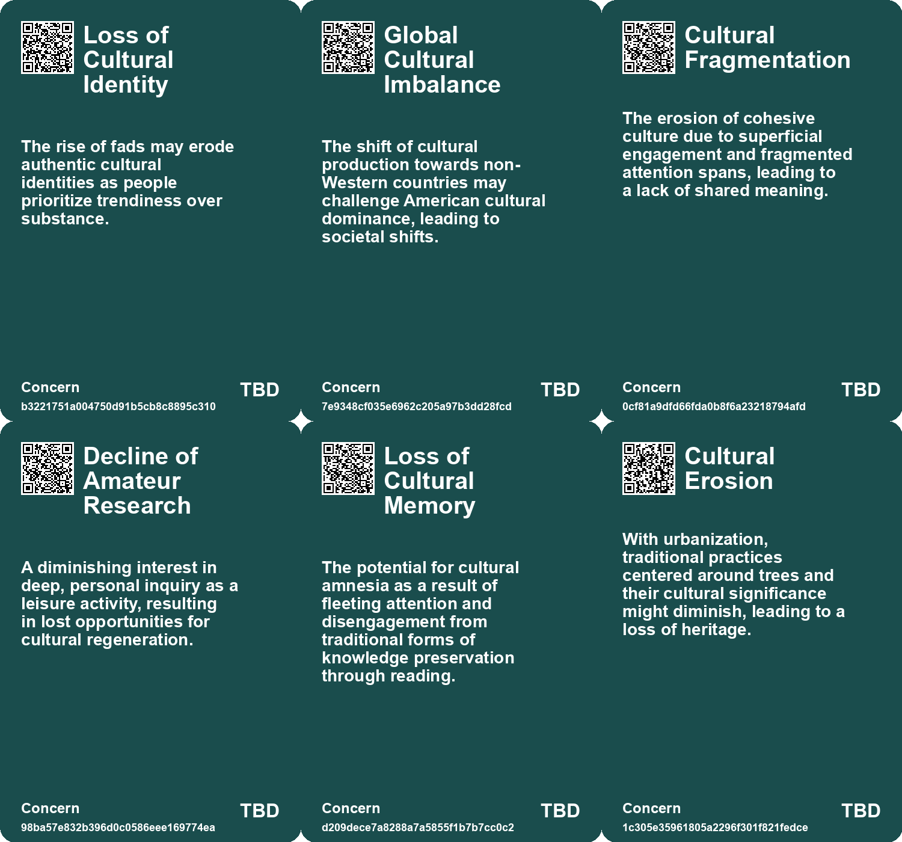
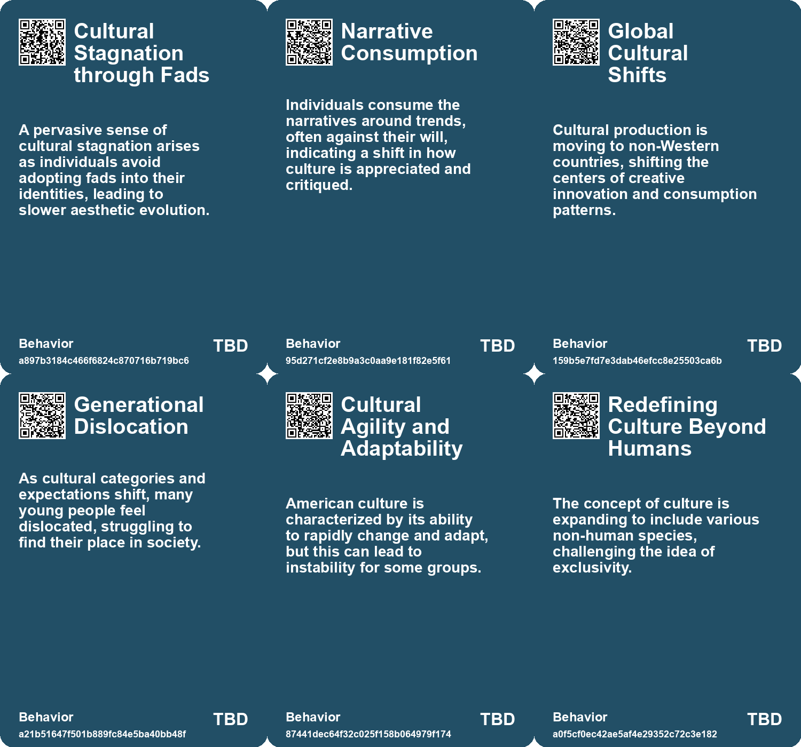
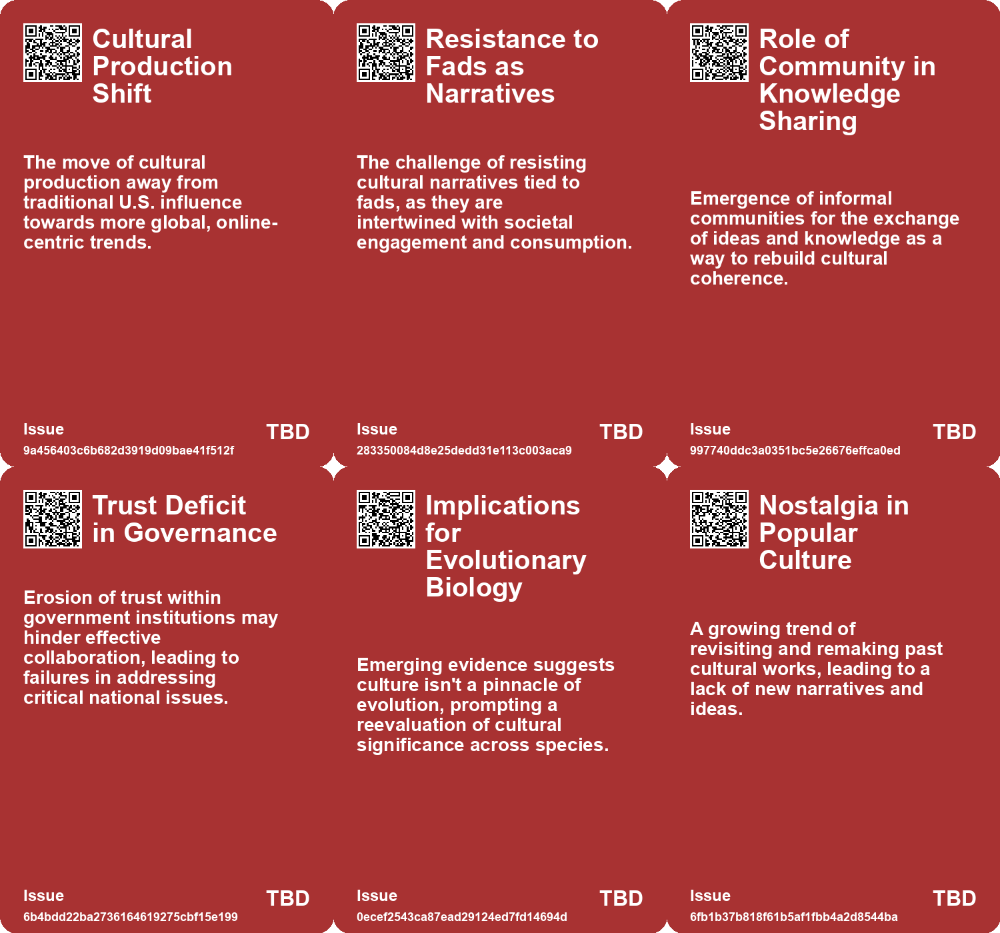
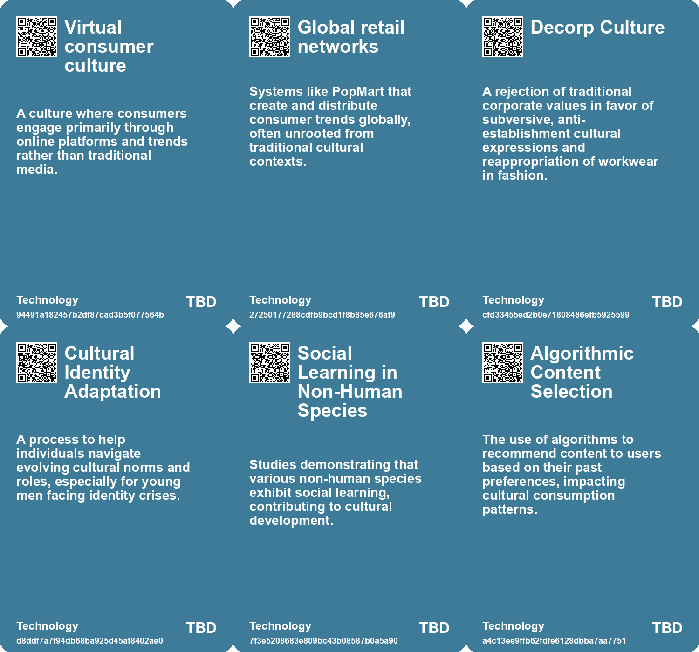

# *Topic*: Cultural Erosion

# Summary

The decline of traditional structures and the rise of new cultural dynamics are evident across various sectors, from rural communities to urban environments. In rural Bulgaria, the village of Tyurkmen faces abandonment, with its population dwindling from over 1,200 to less than 200. This demographic shift reflects a global trend of rural depopulation, raising questions about the ecological consequences of human absence and the future of abandoned lands.

In the political realm, a decline in democratic institutions is anticipated by 2040, with a shift towards autocratic governance in the West. This fragmentation of power is accompanied by emerging cultural movements that challenge traditional corporate values. Younger generations are expected to rise against established systems, advocating for grassroots movements that emphasize stability and security.

The impact of technology on society is another critical theme. The concept of "enshittification" highlights the decline in social media quality due to a lack of competition and regulation. This decline is paralleled by a broader critique of the effects of technology on political discourse, where juvenile behavior has replaced mature civic responsibility. The need for a cultural shift towards deeper engagement and meaningful interactions is emphasized, particularly in the context of the Talmud's teachings.

Cultural identity and expression are evolving, particularly among Gen Z, who navigate a landscape shaped by economic and technological forces. The polished uniformity of their fashion choices contrasts with the chaotic individuality of past subcultures, suggesting a new form of resistance. This transformation is mirrored in the fusion of hip-hop and traditional dance forms, as seen in Usha Jey's work, which highlights the blending of cultural identities.

The role of infrastructure in society is also under scrutiny. The degradation of infrastructure can lead to catastrophic consequences, as illustrated by recent natural disasters. The need for sustainable and equitable infrastructure planning is critical to address social inequalities and climate change.

In the realm of cultural production, the rise of trendy fads driven by social media reflects a shift towards short-lived trends that prioritize trendiness over substance. This phenomenon indicates a broader cultural stagnation, as identities become less fluid and consumers hesitate to engage deeply with fleeting trends.

Finally, the importance of reading and research as foundational elements of culture is underscored. The shift from deep engagement with texts to superficial consumption of information poses challenges to societal progress. Reclaiming a contemplative approach to knowledge can help combat cultural fragmentation and foster a more profound connection to community and identity. 

These overlapping themes illustrate a complex landscape where traditional values and structures are challenged by new cultural dynamics, technological advancements, and shifting societal norms.

# Seeds

|    | name                                    | description                                                                                            | change                                                                                                                   | 10-year                                                                                                              | driving-force                                                                                               |
|---:|:----------------------------------------|:-------------------------------------------------------------------------------------------------------|:-------------------------------------------------------------------------------------------------------------------------|:---------------------------------------------------------------------------------------------------------------------|:------------------------------------------------------------------------------------------------------------|
|  0 | Shift in Cultural Production Base       | Cultural production is moving away from the U.S. to online-first trend-driven cultures.                | A transition from U.S.-centric cultural production to global, primarily online-driven production.                        | Expect to see a diverse range of cultural outputs originating from non-Western countries.                            | The rise of social media platforms promoting rapid trend cycles and global connectivity.                    |
|  1 | Crisis of Cultural Coherence            | A growing cultural fragmentation and erosion of shared meaning across society.                         | From unified cultural norms to more fragmented individual experiences and understanding.                                 | Potential emergence of niche cultures focused on shared inquiry and understanding.                                   | Loss of coherent narratives in media and education leading to cultural disintegration.                      |
|  2 | Cultural Fragmentation                  | The decline in shared cultural references amidst rising digital content.                               | Shifting from a shared mainstream culture to a highly diversified culture.                                               | Cultural experiences will increasingly cater to niche interests over mainstream trends.                              | The internet and AI will continue to allow diverse content creation and distribution.                       |
|  3 | Spirited Tech                           | Blending of technology with alternative spiritualities influencing culture and personal identity.      | Transition from purely functional technology to more holistic and spiritual engagements with technological advancements. | By 2034, personal identities may increasingly intertwine with technological and spiritual expressions in daily life. | The search for meaning in an advanced tech society prompts exploration of new identities and relationships. |
|  4 | Evolving Concepts of Culture            | The concept of culture may be less exclusive and more prevalent among species than previously thought. | From a narrow view of culture being human-centric to an inclusive understanding across species.                          | Broader definitions of culture could lead to new discoveries in behavioral sciences.                                 | Continued research into animal behavior challenging traditional views of intelligence and culture.          |
|  5 | Urban Displacement Anxiety              | Growing unease due to the rapid disappearance of familiar urban landscapes.                            | Shift from stable, recognizable neighborhoods to transient, ever-changing cityscapes.                                    | Cities may become unrecognizable, leading to a loss of community identity and increased mental health issues.        | Real estate trends and economic growth causing rapid urban redevelopment.                                   |
|  6 | Anomie in Urban Life                    | Sense of normlessness as societal values and customs shift rapidly.                                    | Transition from clear societal norms to confusion and lack of guidance in urban environments.                            | Possible rise in mental health issues and social unrest as people struggle to adapt to new norms.                    | Rapid economic changes and social upheaval leading to confusion about societal values.                      |
|  7 | Cultural Resistance to Change           | A deeply ingrained cultural norm of overwork hampers change efforts.                                   | From a culture that rewards overwork to one that values work-life balance and mental health.                             | Work cultures may evolve to prioritize employee well-being, reducing burnout and turnover.                           | Increased awareness of mental health and work-life balance in modern work environments.                     |
|  8 | Cultural Preservation Trends            | A growing emphasis on preserving cultural heritage amidst rapid societal changes.                      | From rapid modernization to a more balanced approach that respects historical contexts.                                  | In ten years, we might see stronger regulations and community initiatives aimed at preserving cultural sites.        | The desire to maintain a sense of identity and history in an increasingly fast-paced world.                 |
|  9 | Generational Shift in Cultural Interest | As people age, their interests shift from fast-paced trends to slower cultural aspects.                | Change in focus from immediate, rapid trends to long-term cultural stability and values.                                 | In a decade, cultural institutions may see a resurgence in interest from older demographics.                         | The natural progression of priorities as individuals seek deeper meaning and connection.                    |

# Concerns

|    | name                                            | description                                                                                                                                                   |
|---:|:------------------------------------------------|:--------------------------------------------------------------------------------------------------------------------------------------------------------------|
|  0 | Loss of Cultural Identity                       | The rise of fads may erode authentic cultural identities as people prioritize trendiness over substance.                                                      |
|  1 | Global Cultural Imbalance                       | The shift of cultural production towards non-Western countries may challenge American cultural dominance, leading to societal shifts.                         |
|  2 | Cultural Fragmentation                          | The erosion of cohesive culture due to superficial engagement and fragmented attention spans, leading to a lack of shared meaning.                            |
|  3 | Decline of Amateur Research                     | A diminishing interest in deep, personal inquiry as a leisure activity, resulting in lost opportunities for cultural regeneration.                            |
|  4 | Loss of Cultural Memory                         | The potential for cultural amnesia as a result of fleeting attention and disengagement from traditional forms of knowledge preservation through reading.      |
|  5 | Cultural Erosion                                | With urbanization, traditional practices centered around trees and their cultural significance might diminish, leading to a loss of heritage.                 |
|  6 | Community Displacement and Cultural Change      | As outsiders invest and change the culture, long-time residents may feel alienated, leading to a significant disconnect between new and existing inhabitants. |
|  7 | Cultural Loss and Memory                        | The fading of community memories, traditions, and cultural landmarks as rural populations decrease poses a social concern.                                    |
|  8 | Technological Change vs. Organisational Culture | How entrenched cultures can obstruct adaptation to technological advancements, resulting in failures akin to historical military defeats.                     |
|  9 | Cultural Stagnation Due to Rapid Change         | Rapid shifts in commerce and governance may outpace cultural evolution, leading to societal dissonance and disconnection.                                     |

# Cards

## Concerns

## Behaviors

## Issue

## Technology

# Links

* [Navigating Gen Z Fashion: From Individuality to Algorithmic Uniformity](https://futures.kghosh.me/722ee1eb57d4c576f7e7604a88c9ef56)
* [Future Trends Post-2024: Declining Democracies and Emerging Cultural Shifts](https://futures.kghosh.me/bd1b01636b1360716b5951e1cac42724)
* [Reviving Research as Leisure: Embracing Curiosity and Reading Culture for Civilization's Future](https://futures.kghosh.me/e3389ae6863265accc860c33c364c11f)
* [Exploring the Historical and Future Transformations of Land Ownership Worldwide](https://futures.kghosh.me/68a769f0b8d15a4efd8f8136482b9660)
* [Nostalgia for Simplicity: The Burden of Infinite Choice in Modern Life](https://futures.kghosh.me/7b316ebe449187b79e519a8c6d12a2cd)
* [Exploring the Modern Entertainment Landscape and Its Societal Implications](https://futures.kghosh.me/c5c2c794f1426e6e307a9df3f9ff61f6)
* [The Cultural Clash Over Lawns: Conformity Versus Biodiversity in Suburban America](https://futures.kghosh.me/8cdf7f73ff6f9ea3a14a213a28f8b25e)
* [The Decline of Political Maturity in America: A Call for Responsible Citizenship](https://futures.kghosh.me/ec5b543a174bedb5387b497cc449e5b9)
* [The Impact of Urban Design on Public Space Usage and Social Interaction](https://futures.kghosh.me/2f31d87f3801765f9645d092cadf513a)
* [Redefining Storytelling: From Heroic Conquests to Collective Narratives in Climate Change](https://futures.kghosh.me/9583276a9aeb9f9a0bf87400700799bc)
* [Exploring Enshittification, Futures Thinking in Architecture, and the Decline of Urban Scenius](https://futures.kghosh.me/4c0323220b8e42ef6b79dd4d720ce80a)
* [AI's Role in Fragmenting Culture and Software: A New Era of Creation](https://futures.kghosh.me/c25f207450d56b52443cc95f158d4138)
* [Revitalizing Ruins: Bombay Beach's Transformation Through Art and Community](https://futures.kghosh.me/9e3df9dec95cee1464d33e4ab8528d91)
* [Understanding Business Dynamics Through Stewart Brand's Pace Layers Model](https://futures.kghosh.me/fead11d257c1adccb50b37901212887b)
* [The UK's Declining Geopolitical Relevance and Elite Inaction: A Historical Perspective](https://futures.kghosh.me/ca555520973a0e8519ff854da1de4d88)
* [The Invaluable Role of Trees in Ecosystems, Culture, and Fantasy Worlds](https://futures.kghosh.me/563485cd0238037cb5a78c68aab850a9)
* [Exploring the Cultural and Economic Impact of Fads Like Labubu in the 21st Century](https://futures.kghosh.me/be6b5b1f64e2a032cdef6417b4b84a7e)
* [Understanding Polarization: Healing Our Relationship with Technology and Embracing Diverse Perspectives](https://futures.kghosh.me/c1bb890337ef382bfaa5720c9fd05134)
* [Bumblebees Exhibit Cultural Behavior: New Insights into Insect Learning and Social Behavior](https://futures.kghosh.me/2394a07d8b41ae57fc3d67bd80e7f751)
* [Understanding 'Failure to Launch': The Cultural and Economic Struggles of Young American Men](https://futures.kghosh.me/c6a3cc9fe503779d0ad2ec2c66aa7fb8)
* [Exploring Urban Change and Psychological Responses in Austin's Transformation](https://futures.kghosh.me/e825171606432c71606dc78b9bf86eee)
* [Understanding Pace Layering: The Resilience of Complex Systems and Civilizations](https://futures.kghosh.me/d8dac76e8ee03a934c18e53570b3a0f8)
* [Reimagining Infrastructure: Towards a Redistributive and Ecologically Sound Future](https://futures.kghosh.me/177a0857ffe0d07d48cd99a269f28a02)
* [Exploring Electroculture: A New Trend in Gardening Amidst Historical Skepticism and Modern Science](https://futures.kghosh.me/257c9d336364e061c817ec77db9e78f6)
* [Exploring Cultural Fusion in Dance and Lessons from the Battle of Crecy](https://futures.kghosh.me/0eec94d49d73ca7a3669da31cea25e51)
* [The Rise of Cultural Oligopoly: A Call for Diversity in Media](https://futures.kghosh.me/317aa39c987f1d5e3509dbc5e50c8bb3)
* [Exploring the Consequences of Abandonment in Rural Bulgaria and Nature's Response](https://futures.kghosh.me/9ab2903416b01dac618d7f3b93ab6dfa)