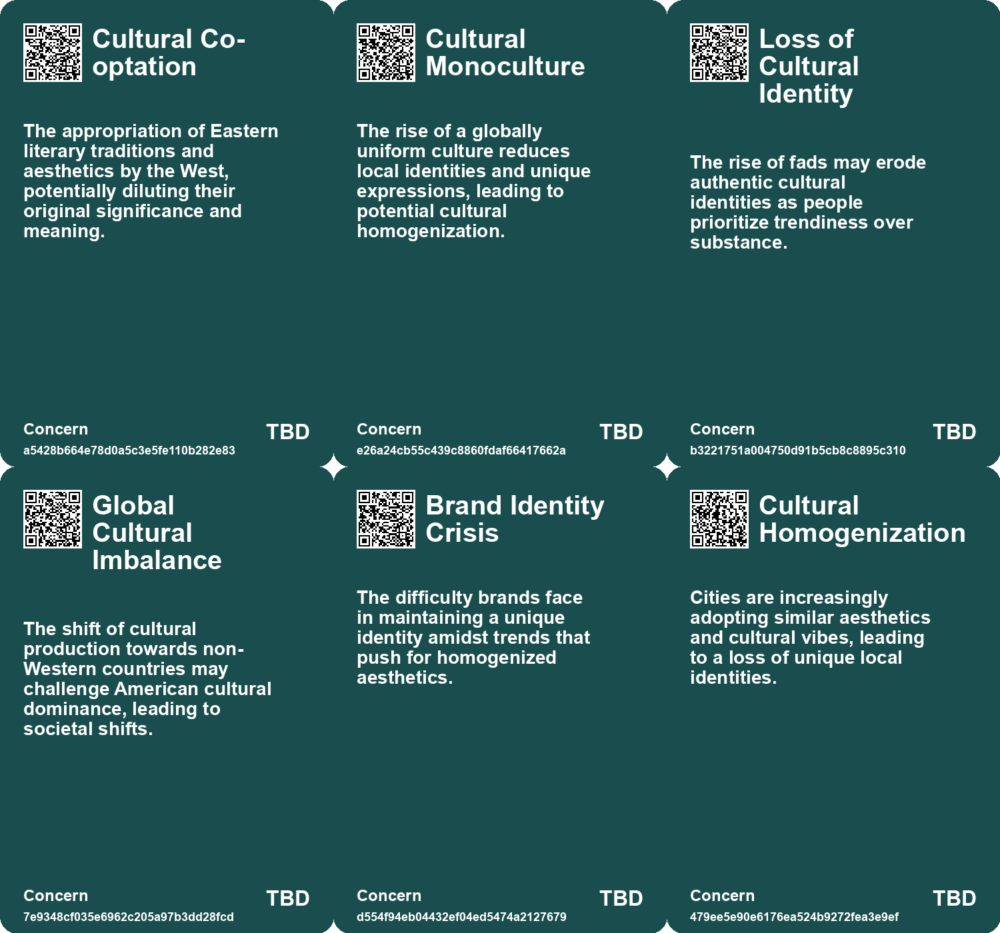
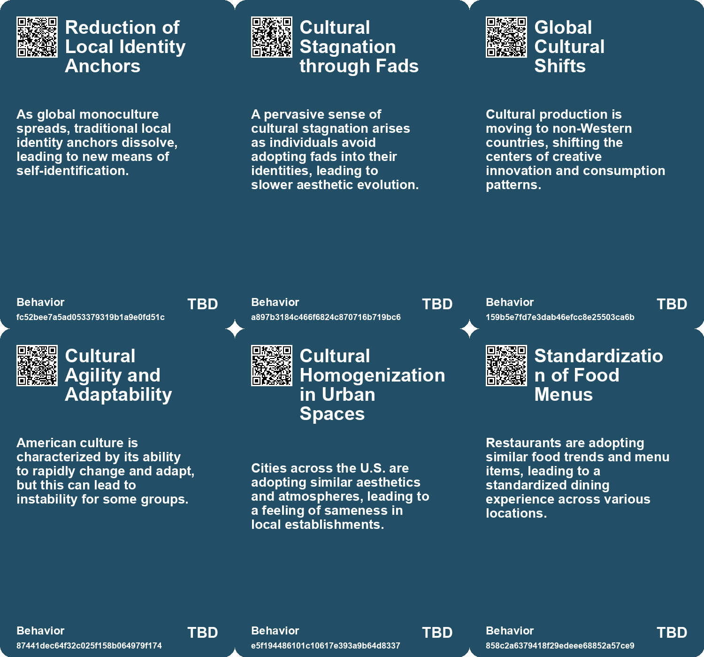
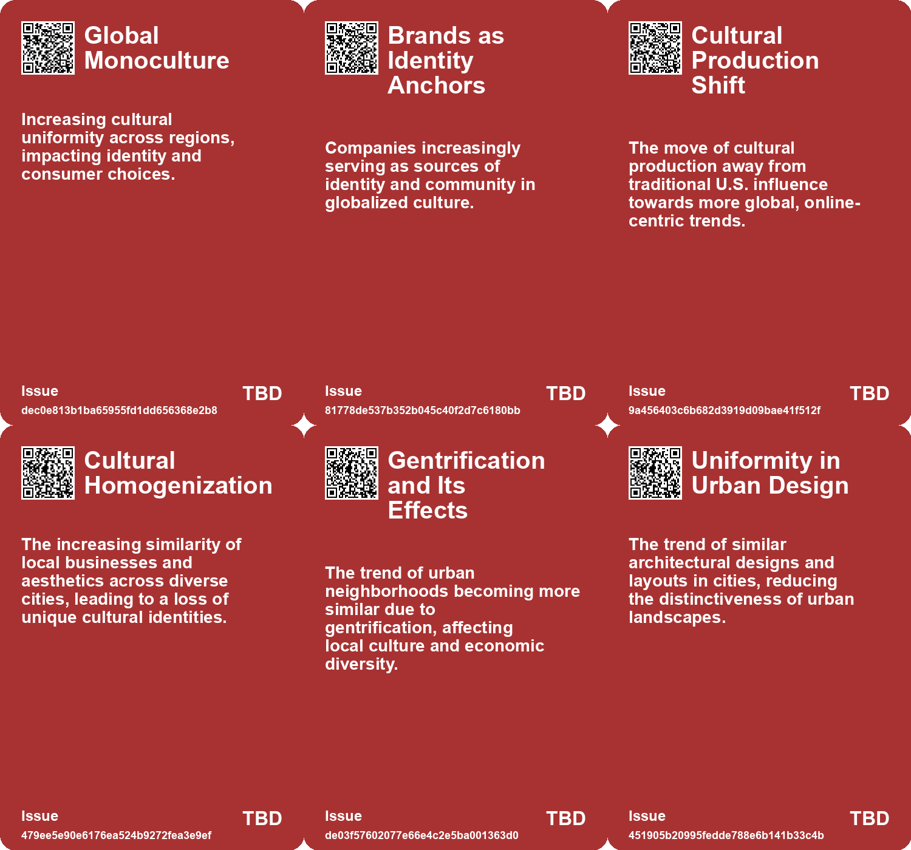
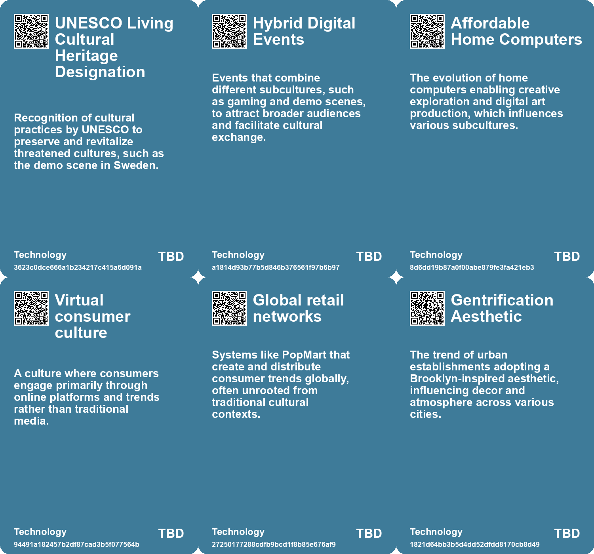

# *Topic*: Cultural Homogenization

# Summary

The current cultural landscape is marked by a growing oligopoly in pop culture, where a few major players dominate the market. This trend is evident across various media, including movies, music, and video games, leading to a proliferation of remakes and sequels at the expense of original content. The consolidation of studios and labels stifles creativity and limits the diversity of available content, although there remains potential for unique voices to emerge if consumers actively seek them out.

Fashion and identity among Gen Z reflect a shift from chaotic individuality to a polished uniformity shaped by social media algorithms. This change raises questions about the loss of rebellion and whether conformity represents a new form of resistance. Economic and technological forces play a significant role in shaping how today's youth express themselves through fashion.

The rise of artificial intelligence (AI) tools has sparked concerns about the homogenization of content, a phenomenon termed “The Great Same-ning.” While AI can enhance individual creativity, it risks diminishing collective novelty. Studies indicate that the outputs of AI may lack diversity, emphasizing the need for thoughtful use of these technologies to foster distinctiveness.

As democratic institutions decline and autocratic governance rises, significant societal shifts are anticipated by 2040. Emerging cultural movements, such as Decorp Culture, challenge traditional corporate values, while a focus on Safety Culture prioritizes stability. Economic models are expected to evolve towards stagflation, leading to new consumer behaviors and identities that brands must adapt to.

The concept of "greenhindering" highlights how media and influencers can perpetuate unsustainable practices, complicating efforts to foster sustainability. This contrasts with greenwashing, which has received more scrutiny. The normalization of wasteful behaviors poses a significant challenge to shifting social norms toward sustainability.

The symbolic economy is emerging, where consumption is tied to identity performance rather than traditional supply and demand. In this new landscape, brands act as moral authorities, shaping personal values and community identities. This shift reflects a broader trend of declining trust in traditional institutions.

The phenomenon of abandonment in rural areas, particularly in Bulgaria, illustrates the demographic shifts affecting communities worldwide. As populations decline, the relationship between human absence and environmental change becomes increasingly complex. The future of abandoned lands raises critical questions about ecological outcomes and the role of human presence in shaping them. 

These overlapping themes reveal a cultural landscape in flux, driven by technological advancements, shifting identities, and evolving societal norms. The interplay between individual expression and collective trends continues to shape the way people engage with culture, identity, and community.

# Seeds

|    | name                                | description                                                                                          | change                                                                                                                   | 10-year                                                                                                              | driving-force                                                                                               |
|---:|:------------------------------------|:-----------------------------------------------------------------------------------------------------|:-------------------------------------------------------------------------------------------------------------------------|:---------------------------------------------------------------------------------------------------------------------|:------------------------------------------------------------------------------------------------------------|
|  0 | Cultural Monoculture                | A globally connected culture is leading to a uniformity in consumer behavior and identity signaling. | Transition from local cultural identities to global monocultural consumption patterns.                                   | Global brands will become the primary identity anchors for individuals in diverse cultures.                          | The accessibility of information and products worldwide diminishes regional distinctions.                   |
|  1 | Shift in Cultural Production Base   | Cultural production is moving away from the U.S. to online-first trend-driven cultures.              | A transition from U.S.-centric cultural production to global, primarily online-driven production.                        | Expect to see a diverse range of cultural outputs originating from non-Western countries.                            | The rise of social media platforms promoting rapid trend cycles and global connectivity.                    |
|  2 | Media Literacy Evolution            | Knowledge of all culture, including fads, becomes essential for media literacy.                      | A shift from valuing traditional cultural literacy to including fleeting cultural references.                            | Media literacy may redefine to encompass understanding transient online phenomena, influencing education.            | The digital landscape necessitates awareness of diverse media narratives for informed participation.        |
|  3 | Emerging Middle Class Culture       | New middle classes in non-Western regions are forming identities based on trendiness.                | A shift from stable cultural identities to fluid, trend-based self-presentation in emerging markets.                     | Expect a generation of consumers whose identities are built on a mosaic of global fads.                              | Economic growth and increased internet access in developing regions enabling trend participation.           |
|  4 | Cultural Fragmentation              | The decline in shared cultural references amidst rising digital content.                             | Shifting from a shared mainstream culture to a highly diversified culture.                                               | Cultural experiences will increasingly cater to niche interests over mainstream trends.                              | The internet and AI will continue to allow diverse content creation and distribution.                       |
|  5 | Spirited Tech                       | Blending of technology with alternative spiritualities influencing culture and personal identity.    | Transition from purely functional technology to more holistic and spiritual engagements with technological advancements. | By 2034, personal identities may increasingly intertwine with technological and spiritual expressions in daily life. | The search for meaning in an advanced tech society prompts exploration of new identities and relationships. |
|  6 | Homogenization of Urban Aesthetics  | Cities across the U.S. exhibit similar architectural and cultural aesthetics.                        | Shift from unique local identities to a standardized urban experience.                                                   | In a decade, urban areas may look increasingly similar, diminishing local charm.                                     | Globalization and social media influence the design and culture of local establishments.                    |
|  7 | Gentrification and Return Migration | Young adults return to hometowns, bringing urban aesthetics and culture with them.                   | Movement from urban centers back to smaller towns, merging cultures.                                                     | Small towns may become cultural hubs, blending urban and rural lifestyles.                                           | Cost of living and desire for community drive return migration trends.                                      |
|  8 | The Great Same-ning                 | A term describing AI tools' tendency to produce homogenous content.                                  | Shift from diverse, unique content to uniform outputs due to AI training.                                                | In 10 years, creative outputs may all appear similar, lacking diversity and uniqueness.                              | The increasing reliance on AI tools for content generation leads to averaged outputs.                       |
|  9 | Opportunities in Distinctiveness    | Homogeneity creates a market for unique and distinct outputs.                                        | From a saturated market of sameness to a growing demand for distinct creativity.                                         | The future may see a premium placed on unique and diverse outputs in all fields.                                     | The need for differentiation will drive demand for unique creative expressions.                             |

# Concerns

|    | name                                   | description                                                                                                                           |
|---:|:---------------------------------------|:--------------------------------------------------------------------------------------------------------------------------------------|
|  0 | Cultural Monoculture                   | The rise of a globally uniform culture reduces local identities and unique expressions, leading to potential cultural homogenization. |
|  1 | Loss of Cultural Identity              | The rise of fads may erode authentic cultural identities as people prioritize trendiness over substance.                              |
|  2 | Global Cultural Imbalance              | The shift of cultural production towards non-Western countries may challenge American cultural dominance, leading to societal shifts. |
|  3 | Brand Identity Crisis                  | The difficulty brands face in maintaining a unique identity amidst trends that push for homogenized aesthetics.                       |
|  4 | Cultural Homogenization                | Cities are increasingly adopting similar aesthetics and cultural vibes, leading to a loss of unique local identities.                 |
|  5 | Algorithmic Influence on Identity      | The pervasive influence of algorithms on fashion choices may dilute individuality, leading to a homogenized culture.                  |
|  6 | Cultural Homogeneity                   | The increasing dominance of a few franchises leads to cultural sameness, stunting creativity and diversity in media.                  |
|  7 | Digital Influence on Cultural Heritage | The popularity of online platforms may overshadow traditional forms of dance and cultural expression, leading to homogenization.      |
|  8 | Youth Identity in Global Culture       | The adaptation of global music genres like hip-hop may alter youth identity and cultural narratives across different societies.       |
|  9 | Reinforcement of Common Trends         | Popular AI-generated outputs could overshadow rare or distinct options, leading to a homogenized cultural landscape.                  |

# Cards

## Concerns

## Behaviors

## Issue

## Technology

# Links

* [Exploring the Risks of Homogeneity in AI Generated Content and Its Impact on Creativity](https://futures.kghosh.me/9f228766187c6c10eeddbda5a6dbbe7b)
* [Navigating Gen Z Fashion: From Individuality to Algorithmic Uniformity](https://futures.kghosh.me/722ee1eb57d4c576f7e7604a88c9ef56)
* [Future Trends Post-2024: Declining Democracies and Emerging Cultural Shifts](https://futures.kghosh.me/bd1b01636b1360716b5951e1cac42724)
* [Exploring the Historical and Future Transformations of Land Ownership Worldwide](https://futures.kghosh.me/68a769f0b8d15a4efd8f8136482b9660)
* [Nostalgia for Simplicity: The Burden of Infinite Choice in Modern Life](https://futures.kghosh.me/7b316ebe449187b79e519a8c6d12a2cd)
* [Exploring the Modern Entertainment Landscape and Its Societal Implications](https://futures.kghosh.me/c5c2c794f1426e6e307a9df3f9ff61f6)
* [Critique of Millennial Branding in Consumer Packaging and Its Impact](https://futures.kghosh.me/15c3e276ff4d0cdae6da27cb3d8431c5)
* [Understanding Greenhindering: A Greater Challenge Than Greenwashing for Sustainability](https://futures.kghosh.me/9c017d08a10b9c2409d54a3113acfe44)
* [The Decline of Political Maturity in America: A Call for Responsible Citizenship](https://futures.kghosh.me/ec5b543a174bedb5387b497cc449e5b9)
* [The Psychological Impact of Algorithmic Profiling and Surveillance on Self-Identity in the Digital Age](https://futures.kghosh.me/70ebc812b72117e2ce11248d77ec7d37)
* [Exploring Enshittification, Futures Thinking in Architecture, and the Decline of Urban Scenius](https://futures.kghosh.me/4c0323220b8e42ef6b79dd4d720ce80a)
* [AI's Role in Fragmenting Culture and Software: A New Era of Creation](https://futures.kghosh.me/c25f207450d56b52443cc95f158d4138)
* [Les Transformations Contemporaines de l'Habitat et le Rôle des Générations Futures](https://futures.kghosh.me/a9f264ee6e3332ece01b15847d55b5cf)
* [The Rise of the Symbolic Economy: Identity Through Consumption in a Globalized World](https://futures.kghosh.me/f836699644240599a4284c78b9ade0e1)
* [Exploring the Impact of Hyper-Personalization in the Age of AI and Individualism](https://futures.kghosh.me/9ef1218bf5010b0780647b93d724b93b)
* [Connecting Local Economies to Global Markets: Insights from Rosabeth Moss Kanter's Analysis](https://futures.kghosh.me/b0f9303688b3f36feafd21625c5d3461)
* [Exploring the Cultural and Economic Impact of Fads Like Labubu in the 21st Century](https://futures.kghosh.me/be6b5b1f64e2a032cdef6417b4b84a7e)
* [The Demo Scene: A Cultural Legacy Facing Decline and Change](https://futures.kghosh.me/d81db4d6acedbfe1945cc1bb5e64d43e)
* [Understanding Polarization: Healing Our Relationship with Technology and Embracing Diverse Perspectives](https://futures.kghosh.me/c1bb890337ef382bfaa5720c9fd05134)
* [Exploring the Homogenization of Urban Culture Through Coffee Shops and Bars Across America](https://futures.kghosh.me/4ab5b0cd09e7bc298ec4ac68816ae6b4)
* [Bumblebees Exhibit Cultural Behavior: New Insights into Insect Learning and Social Behavior](https://futures.kghosh.me/2394a07d8b41ae57fc3d67bd80e7f751)
* [Understanding 'Failure to Launch': The Cultural and Economic Struggles of Young American Men](https://futures.kghosh.me/c6a3cc9fe503779d0ad2ec2c66aa7fb8)
* [Exploring Urban Change and Psychological Responses in Austin's Transformation](https://futures.kghosh.me/e825171606432c71606dc78b9bf86eee)
* [The Economic Consequences of Declining Birth Rates and Aging Populations](https://futures.kghosh.me/bff595b72330d833dba477e2dc2a5656)
* [From Household Gods to Machine Gods: The Evolution of Human Dependence on Idols and AI](https://futures.kghosh.me/fb6ff31e43cd6fac10f799bcee562946)
* [Exploring Cultural Fusion in Dance and Lessons from the Battle of Crecy](https://futures.kghosh.me/0eec94d49d73ca7a3669da31cea25e51)
* [The Rise of Cultural Oligopoly: A Call for Diversity in Media](https://futures.kghosh.me/317aa39c987f1d5e3509dbc5e50c8bb3)
* [Exploring the Consequences of Abandonment in Rural Bulgaria and Nature's Response](https://futures.kghosh.me/9ab2903416b01dac618d7f3b93ab6dfa)