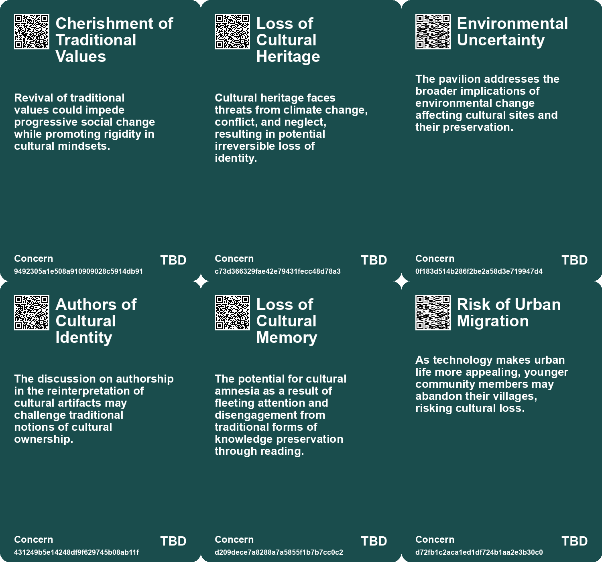
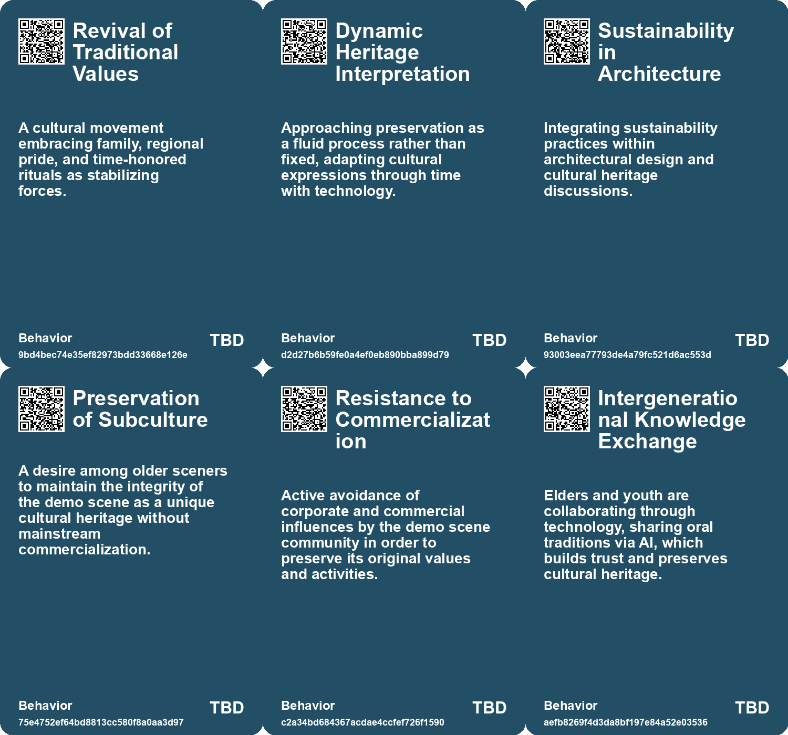
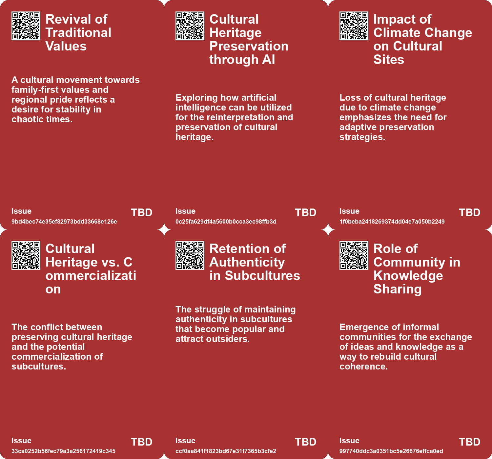
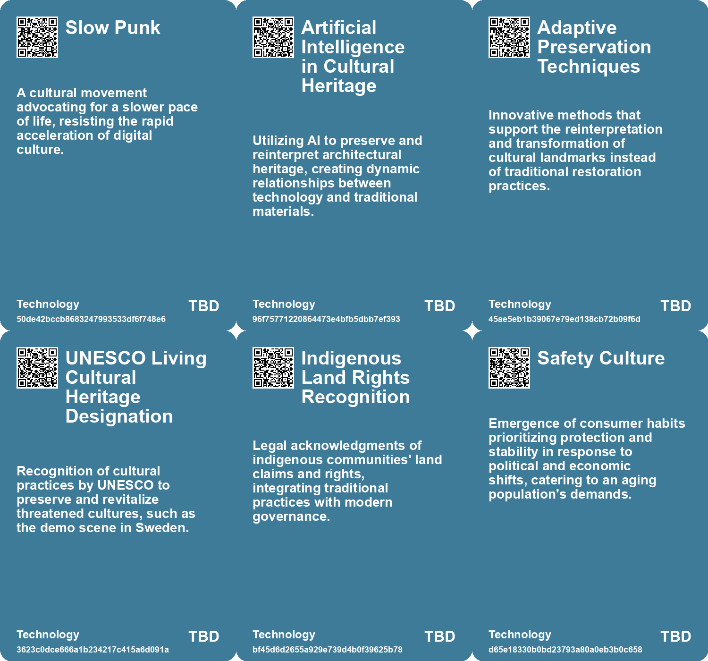

# *Topic*: Cultural Preservation

# Summary

The digital age presents significant challenges for data preservation, with concerns about hardware longevity, format accessibility, and comprehensibility. The risk of entering a "Digital Dark Age" looms as valuable information may be lost due to inadequate preservation efforts. Organizations and technologies are emerging to address these issues, emphasizing the need for sustainable and equitable solutions.

In rural Bulgaria, the village of Tyurkmen faces abandonment, reflecting a global trend of population decline in rural areas as people migrate to cities. This demographic shift raises questions about the relationship between human absence and environmental change, highlighting the potential for ecological recovery alongside the risks posed by invasive species. Research into these dynamics underscores the importance of understanding how human presence influences ecological outcomes.

Aesthetic norms and zoning restrictions significantly impact economic and social structures, affecting housing prices, segregation, and climate action. Conservation areas, while preserving historical integrity, hinder energy efficiency improvements, contributing to avoidable carbon emissions. Policymakers are urged to facilitate retrofitting in these areas to address climate challenges effectively.

The influence of technology on society is profound, with a call for a cultural shift towards deeper engagement and a Talmudic approach that values multiple perspectives. The polarization of societies, exacerbated by social media, necessitates a focus on attention over availability to counteract the negative effects of technology.

As democratic institutions decline and autocratic governance rises, significant trends are emerging. The fragmentation of global power and the rise of cultural movements like Decorp Culture reflect a shift towards prioritizing stability and security. Economic models are evolving, with younger generations poised to challenge existing systems through grassroots movements, while brands must adapt to these transformative consumer behaviors.

The importance of reading and research as cultural foundations is emphasized, with a call to reclaim 'research as leisure' to foster deeper connections to knowledge. The shift from meaningful engagement with texts to superficial consumption in the digital age raises concerns about cultural fragmentation and the need for community-driven knowledge-sharing.

Adaptive reuse of buildings is increasingly vital in addressing sustainability challenges. The transformation of spaces like churches and shopping malls highlights the need for innovative design solutions that reduce carbon emissions. The pandemic has accelerated these trends, emphasizing the importance of reusing existing structures to create resilient urban environments.

Cultural transmission is not limited to humans, as recent studies reveal that bumblebees can learn and share behaviors, challenging the notion of culture as a uniquely human trait. This discovery broadens our understanding of social learning across species.

The demo scene, recognized as UNESCO Living Cultural Heritage, faces a decline in youth participation, raising concerns about its future. Despite its challenges, the scene remains a niche community valuing creativity over commercialization.

The evolving relationship between land ownership and societal structures is explored, emphasizing the need for equitable land reform in the face of climate change and population dynamics. Innovative approaches to property rights could promote social equity and address future challenges.

Urban public spaces are undergoing transformation through initiatives aimed at enhancing civic engagement and fostering collaboration. These projects seek to create vibrant environments that counteract loneliness and economic segregation.

The rise of private power poses a threat to democratic societies, necessitating a focus on safeguarding liberty and promoting economic democracy. Addressing economic inequalities is crucial to ensuring social justice and preventing societal unrest.

In the realm of creativity, the concept has evolved significantly since the post-World War II era, becoming a cultural mantra associated with personal fulfillment and professional success. The dualities surrounding creativity continue to shape modern perceptions and the individuals labeled as 'creatives.'

As cultural trends shift towards authenticity and deeper connections, the interplay between technology and traditional values becomes increasingly relevant. The rise of AI-generated content alongside human creativity reflects a broader societal desire for community-centric experiences amid modern challenges.

# Seeds

|    | name                                      | description                                                                                             | change                                                                                                  | 10-year                                                                                                          | driving-force                                                                                                            |
|---:|:------------------------------------------|:--------------------------------------------------------------------------------------------------------|:--------------------------------------------------------------------------------------------------------|:-----------------------------------------------------------------------------------------------------------------|:-------------------------------------------------------------------------------------------------------------------------|
|  0 | Revival of Traditional Values             | A cultural movement emphasizing family values and regional pride.                                       | Shift from modern individualism to a collective focus on traditional values.                            | Future society might prioritize community and traditional values over individualism.                             | A response to chaos and uncertainty, seeking grounding in tradition.                                                     |
|  1 | AI in Cultural Preservation               | Emerging use of AI technologies to reinterpret and preserve cultural heritage.                          | Transition from traditional preservation methods to AI-assisted reinterpretation and documentation.     | AI technologies may lead to revitalized cultural identities and new forms of heritage expression.                | The increasing threat to cultural heritage from climate change, conflict, and neglect necessitates innovative solutions. |
|  2 | Dynamic Cultural Memory                   | Shift towards viewing cultural memory as a dynamic, adaptable entity.                                   | From fixed historical interpretations towards a more fluid and evolving representation of culture.      | Cultural heritage may become more inclusive and representational of diverse narratives through reinterpretation. | The desire to keep cultural heritage relevant amid changing environmental and socio-political landscapes.                |
|  3 | UNESCO Recognition                        | The demo scene gains UNESCO Living Cultural Heritage status, reflecting cultural significance.          | Recognition from a cultural organization is shifting the perception of the demo scene.                  | In ten years, the demo scene might evolve as a concerted attempt for preservation and awareness.                 | Recognition by a prestigious body may lead to increased interest and potential revitalization efforts.                   |
|  4 | Elder-Youth Knowledge Exchange            | Elders are using technology to share oral traditions with younger generations.                          | Shift from oral traditions being lost to active engagement using technology.                            | Elderly could play a crucial role in tech-driven cultural transmission, bridging generations.                    | Need to preserve oral histories in a technology-driven era.                                                              |
|  5 | Public Engagement in Digital Preservation | Rising interest in collective efforts to preserve digital heritage among organizations and individuals. | Shift from isolated efforts to community-driven approaches to archival practices.                       | In ten years, collaborative models for digital preservation might be the standard across institutions.           | Growing acknowledgment that digital preservation is a shared responsibility needing diverse input.                       |
|  6 | Human Role in Ecosystem Management        | The potential positive role of humans in maintaining biodiversity in rural landscapes.                  | Shift from viewing humans as detrimental to recognizing their role in ecosystem diversity.              | In a decade, a new understanding of human-environment interaction may emerge, promoting coexistence.             | Growing awareness of the need for sustainable land use practices in rural areas.                                         |
|  7 | Role of Traditional Practices             | Traditional land management practices may help maintain biodiversity in rural areas.                    | Transition from abandonment to sustainable practices that enhance local ecosystems.                     | In 10 years, revival of traditional practices could support biodiversity and ecosystem health.                   | Increased recognition of indigenous and traditional knowledge in environmental management.                               |
|  8 | Rise of the Social Sector                 | The emergence of nongovernmental organizations addressing cultural governance issues.                   | Shift from traditional governance to a more integrated role of social organizations in societal issues. | In ten years, the social sector may play a crucial role in shaping governance and cultural priorities.           | Increased reliance on community-driven solutions and volunteerism amid global challenges.                                |
|  9 | Cultural Preservation Trends              | A growing emphasis on preserving cultural heritage amidst rapid societal changes.                       | From rapid modernization to a more balanced approach that respects historical contexts.                 | In ten years, we might see stronger regulations and community initiatives aimed at preserving cultural sites.    | The desire to maintain a sense of identity and history in an increasingly fast-paced world.                              |

# Concerns

|    | name                                            | description                                                                                                                                              |
|---:|:------------------------------------------------|:---------------------------------------------------------------------------------------------------------------------------------------------------------|
|  0 | Cherishment of Traditional Values               | Revival of traditional values could impede progressive social change while promoting rigidity in cultural mindsets.                                      |
|  1 | Loss of Cultural Heritage                       | Cultural heritage faces threats from climate change, conflict, and neglect, resulting in potential irreversible loss of identity.                        |
|  2 | Environmental Uncertainty                       | The pavilion addresses the broader implications of environmental change affecting cultural sites and their preservation.                                 |
|  3 | Authors of Cultural Identity                    | The discussion on authorship in the reinterpretation of cultural artifacts may challenge traditional notions of cultural ownership.                      |
|  4 | Loss of Cultural Memory                         | The potential for cultural amnesia as a result of fleeting attention and disengagement from traditional forms of knowledge preservation through reading. |
|  5 | Risk of Urban Migration                         | As technology makes urban life more appealing, younger community members may abandon their villages, risking cultural loss.                              |
|  6 | Equity in Data Preservation                     | Ensuring equitable access and ability for diverse communities to preserve their digital content to prevent historical bias.                              |
|  7 | Cultural Loss and Memory                        | The fading of community memories, traditions, and cultural landmarks as rural populations decrease poses a social concern.                               |
|  8 | Technological Change vs. Organisational Culture | How entrenched cultures can obstruct adaptation to technological advancements, resulting in failures akin to historical military defeats.                |
|  9 | Blindness to Social Change                      | Organisational cultures that resist change may become obsolete, unable to address evolving social and technological landscapes.                          |

# Cards

## Concerns

## Behaviors

## Issue

## Technology

# Links

* [The Interplay of Democracy, Work, and Economic Justice in Modern Society](https://futures.kghosh.me/43aa6ac3d82bbc19f0d66d5b2bb37897)
* [Future Trends Post-2024: Declining Democracies and Emerging Cultural Shifts](https://futures.kghosh.me/bd1b01636b1360716b5951e1cac42724)
* [Preserving Our Digital Future: The Challenge of Avoiding a Digital Dark Age](https://futures.kghosh.me/86e67181c4dcbce08848023aa2929bcb)
* [Reviving Research as Leisure: Embracing Curiosity and Reading Culture for Civilization's Future](https://futures.kghosh.me/e3389ae6863265accc860c33c364c11f)
* [Exploring the Historical and Future Transformations of Land Ownership Worldwide](https://futures.kghosh.me/68a769f0b8d15a4efd8f8136482b9660)
* [Nostalgia for Simplicity: The Burden of Infinite Choice in Modern Life](https://futures.kghosh.me/7b316ebe449187b79e519a8c6d12a2cd)
* [Exploring the Modern Entertainment Landscape and Its Societal Implications](https://futures.kghosh.me/c5c2c794f1426e6e307a9df3f9ff61f6)
* [Exploring Cultural Heritage Through AI: Armenia's Pavilion at Venice Biennale 2025](https://futures.kghosh.me/34b4d87b744230499df1eb6a00d5c11d)
* [Innovative Adaptations of Assam's Chang Ghars for Flood Resilience and Climate Change Challenges](https://futures.kghosh.me/141479bb35e9f52f4fa3fdccd0d2b13a)
* [The Decline of Political Maturity in America: A Call for Responsible Citizenship](https://futures.kghosh.me/ec5b543a174bedb5387b497cc449e5b9)
* [The Impact of Urban Design on Public Space Usage and Social Interaction](https://futures.kghosh.me/2f31d87f3801765f9645d092cadf513a)
* [Innovative Approaches to Public Space Transformation in U.S. Cities](https://futures.kghosh.me/465b809f2a993c634a1a239ca0cab476)
* [Redefining Storytelling: From Heroic Conquests to Collective Narratives in Climate Change](https://futures.kghosh.me/9583276a9aeb9f9a0bf87400700799bc)
* [Exploring Enshittification, Futures Thinking in Architecture, and the Decline of Urban Scenius](https://futures.kghosh.me/4c0323220b8e42ef6b79dd4d720ce80a)
* [Indigenous Communities Harness AI to Preserve Culture and Improve Lives](https://futures.kghosh.me/f16c744150991b5f2533077e99ec33b1)
* [The Rise of Creativity: Understanding Its Evolution and Cultural Impact Since WWII](https://futures.kghosh.me/4704e0c971a5aab83464d9025df5fe6d)
* [The Urgent Need for Adaptive Reuse in Architecture Today](https://futures.kghosh.me/cf7cc3361b8139c51e3e97835a2da4e4)
* [The Demo Scene: A Cultural Legacy Facing Decline and Change](https://futures.kghosh.me/d81db4d6acedbfe1945cc1bb5e64d43e)
* [Exploring the Cultural Trends Shaping Consumer Behavior in 2026](https://futures.kghosh.me/05be870bd93b19dc0390539dc923ae7b)
* [Understanding Polarization: Healing Our Relationship with Technology and Embracing Diverse Perspectives](https://futures.kghosh.me/c1bb890337ef382bfaa5720c9fd05134)
* [Bumblebees Exhibit Cultural Behavior: New Insights into Insect Learning and Social Behavior](https://futures.kghosh.me/2394a07d8b41ae57fc3d67bd80e7f751)
* [The Impact of Conservation Areas on Climate Action and Housing Energy Efficiency in England](https://futures.kghosh.me/fc01cd22da2aa0a185a6c1bb2a7e1145)
* [Understanding Pace Layering: The Resilience of Complex Systems and Civilizations](https://futures.kghosh.me/d8dac76e8ee03a934c18e53570b3a0f8)
* [From Household Gods to Machine Gods: The Evolution of Human Dependence on Idols and AI](https://futures.kghosh.me/fb6ff31e43cd6fac10f799bcee562946)
* [Exploring Cultural Fusion in Dance and Lessons from the Battle of Crecy](https://futures.kghosh.me/0eec94d49d73ca7a3669da31cea25e51)
* [Exploring Time: Cycles, Reclamation, and Jenny Odell’s Insights in Saving Time](https://futures.kghosh.me/047936a2b08c1b5dda3018bc98dc1d9b)
* [Exploring the Consequences of Abandonment in Rural Bulgaria and Nature's Response](https://futures.kghosh.me/9ab2903416b01dac618d7f3b93ab6dfa)