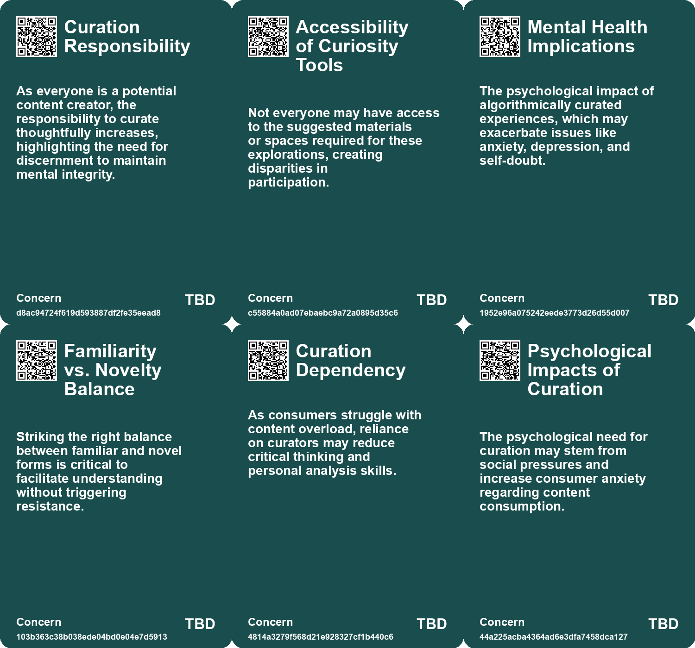
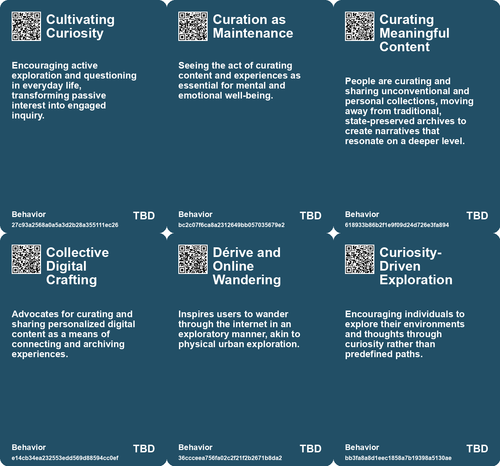
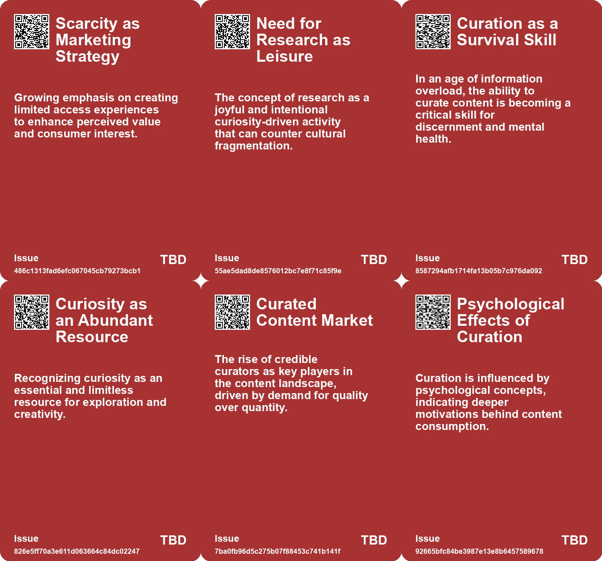
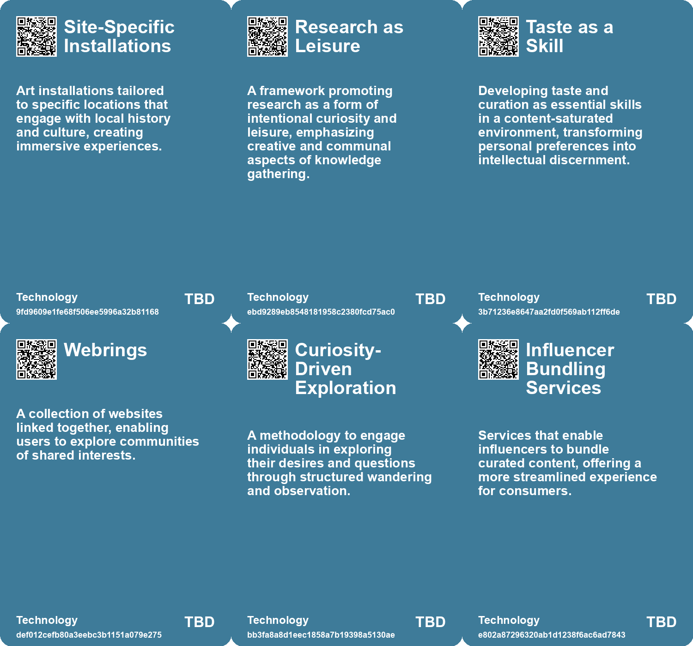

# *Topic*: Curated Exploration

# Summary

In an age of content overload, the need for curation has become increasingly vital. As social media and digital platforms flood users with information, consumers are seeking credible curators to help them navigate the noise. This trend highlights the emergence of influencer bundling, where curators take on the role of creators, guiding audiences through valuable content. The psychological factors driving this demand include the overwhelming volume of information and the challenge of distinguishing high-value content from low-value distractions.

Nostalgia for simpler times is a recurring theme, as individuals reflect on the impact of technology on communication and media consumption. The constant connectivity and limitless choices of the digital age have led to a longing for limitations and curated experiences. This sentiment underscores the importance of deep engagement with fewer, more meaningful interactions, contrasting sharply with the superficial consumption prevalent today.

The intersection of technology and culture is further explored through various exhibitions and projects. The Future & Other Fictions exhibition encourages visitors to engage with optimistic narratives about the future, emphasizing themes of Indigenous culture and environmental sustainability. Similarly, the Deep Time Walk initiative fosters a connection with Earth’s history, promoting advocacy for a regenerative planet through immersive experiences.

The rise of offline experiences and exclusivity in marketing strategies reflects a shift towards meaningful connections. As digital detox trends gain traction, brands are predicted to prioritize in-person events and unique experiences that foster community engagement. This movement challenges the dominance of social media, suggesting a return to more tangible forms of interaction.

Amid these cultural shifts, the importance of reading and research as foundational elements of civilization is highlighted. The transition from deep engagement with texts to superficial consumption raises concerns about cultural fragmentation. Reclaiming research as a leisurely pursuit can enhance connections to knowledge and culture, fostering a more profound understanding of societal issues.

The evolving landscape of technology and its implications for identity and consumption is also examined. The emergence of the symbolic economy ties consumption to identity performance, with brands increasingly acting as moral authorities. This shift reflects a broader trend of consumers seeking authenticity and deeper connections in their interactions with brands and communities.

Finally, the exploration of future trends reveals a desire for deeper connections and authenticity amid societal challenges. Key shifts include the tension between AI-generated and human-created content, a revival of traditional values, and the rise of playful escapism. These trends indicate significant market opportunities for brands that adapt to the changing cultural landscape, emphasizing community-centric experiences and a reclamation of authenticity in response to modern chaos.

# Seeds

|    | name                                    | description                                                                                            | change                                                                                                  | 10-year                                                                                                                               | driving-force                                                                                                 |
|---:|:----------------------------------------|:-------------------------------------------------------------------------------------------------------|:--------------------------------------------------------------------------------------------------------|:--------------------------------------------------------------------------------------------------------------------------------------|:--------------------------------------------------------------------------------------------------------------|
|  0 | Diverse Pathways in Digital Exploration | Encouragement to explore alternative web routes beyond mainstream platforms.                           | From a singular focus on popular apps to embracing diverse online platforms and methods of exploration. | Ten years from now, users may actively utilize various platforms tailored to individual interests, enriching their online experience. | Dissatisfaction with the current monopolization of online spaces, prompting a search for alternatives.        |
|  1 | Question-Paths Exploration              | Emphasis on exploring conceptual routes to enhance curiosity and understanding.                        | Shift from linear thinking to a more exploratory, curiosity-driven approach.                            | In 10 years, individuals may prioritize curiosity-led exploration over rigid knowledge acquisition.                                   | A growing desire for personal growth and deeper understanding of complex issues.                              |
|  2 | Emphasis on Relationality               | Exploring the connections between ideas and themes to foster deeper understanding.                     | From isolated thinking to recognizing the interplay of concepts and ideas.                              | In 10 years, collaborative and relational thinking may be integral to problem-solving.                                                | The increasing complexity of global challenges requiring interdisciplinary collaboration.                     |
|  3 | Collective Future Exploration           | Encouraging collective exploration of futures among diverse groups for richer dialogue.                | From individualistic future thinking to collaborative, group-based explorations of possible futures.    | In ten years, collaborative future exploration will be the norm, fostering community and shared understanding.                        | The increasing complexity of global challenges necessitates collective approaches to planning for the future. |
|  4 | Emergence of Curators                   | Rise of new roles for curators as consumers seek guidance through content.                             | Transition from content consumers to active participants who rely on curators for valuable insights.    | Curators will shape media consumption, becoming key influencers in content selection.                                                 | Consumer fatigue from content overload leading to demand for expert curation.                                 |
|  5 | Curation as a Service                   | Curation evolving into a monetizable service for brands and individuals.                               | Shift from free content access to curated content as a paid service.                                    | Widespread adoption of curation services across various industries, enhancing user experience.                                        | The need for differentiation in a saturated content market and demand for specialized knowledge.              |
|  6 | Curation Communities                    | Formation of communities around curated content enhancing engagement.                                  | From isolated content consumption to community-driven curation experiences.                             | Tight-knit communities forming around shared interests, facilitating collaborative curation.                                          | Social dynamics encouraging connection and shared knowledge among content consumers.                          |
|  7 | Transformative Walking Experiences      | Guided walks promoting deep connections with Earth’s history and climate awareness.                    | Shift from passive learning to immersive experiences promoting environmental advocacy.                  | In 10 years, walking experiences may become mainstream educational tools for climate consciousness.                                   | Growing concern for climate change and desire for experiential education.                                     |
|  8 | Integration of Arts and Science         | Combining artistic expressions with scientific narratives to enhance understanding of Earth's history. | Transition from isolated disciplines to collaborative, interdisciplinary approaches to education.       | In 10 years, arts and sciences may be fully integrated in educational frameworks.                                                     | Recognition of the power of narrative and creativity in engaging diverse audiences.                           |
|  9 | Empowerment through storytelling        | Exhibition encourages active participation in shaping the future through storytelling.                 | Shift from passive consumption of stories to active engagement in future creation.                      | Greater public involvement in future planning and storytelling methods.                                                               | Desire for individuals to influence societal outcomes and futures.                                            |

# Concerns

|    | name                              | description                                                                                                                                                          |
|---:|:----------------------------------|:---------------------------------------------------------------------------------------------------------------------------------------------------------------------|
|  0 | Curation Responsibility           | As everyone is a potential content creator, the responsibility to curate thoughtfully increases, highlighting the need for discernment to maintain mental integrity. |
|  1 | Accessibility of Curiosity Tools  | Not everyone may have access to the suggested materials or spaces required for these explorations, creating disparities in participation.                            |
|  2 | Mental Health Implications        | The psychological impact of algorithmically curated experiences, which may exacerbate issues like anxiety, depression, and self-doubt.                               |
|  3 | Familiarity vs. Novelty Balance   | Striking the right balance between familiar and novel forms is critical to facilitate understanding without triggering resistance.                                   |
|  4 | Curation Dependency               | As consumers struggle with content overload, reliance on curators may reduce critical thinking and personal analysis skills.                                         |
|  5 | Psychological Impacts of Curation | The psychological need for curation may stem from social pressures and increase consumer anxiety regarding content consumption.                                      |
|  6 | Creator vs. Curator Dynamics      | As curators emerge as key players, the balance of creative expression might shift, affecting original content creators' visibility.                                  |
|  7 | Science Engagement Relevance      | The challenge of ensuring that participants find the future of science engagement events relevant and impactful for their communities.                               |
|  8 | Environmental degradation         | The exhibition suggests possible futures without fossil fuels, highlighting the need to address climate change and environmental collapse.                           |
|  9 | Curation Fatigue                  | The pressure to curate every aspect of life leads to stress and diminishes the joy of spontaneous experiences.                                                       |

# Cards

## Concerns

## Behaviors

## Issue

## Technology

# Links

* [Diriyah Gate: A New Approach to Urban Development in Saudi Arabia](https://futures.kghosh.me/8a6d9cd006acf1a98de5163e4b1d8b63)
* [Exploring Cultural Heritage Through AI: Armenia's Pavilion at Venice Biennale 2025](https://futures.kghosh.me/34b4d87b744230499df1eb6a00d5c11d)
* [Exploring the Modern Entertainment Landscape and Its Societal Implications](https://futures.kghosh.me/c5c2c794f1426e6e307a9df3f9ff61f6)
* [Exploring the Future Through Storytelling: ACMI's "The Future & Other Fictions" Exhibition](https://futures.kghosh.me/46e9768b6adfdac55725eb9e91eb66e4)
* [Futures Canvas: A Collaborative Platform for Shaping the Future Together](https://futures.kghosh.me/ca4df2617146551eab6d6792c32adb78)
* [Maximizing Life Returns: The Pursuit Mapping Exercise for Fulfillment and Success](https://futures.kghosh.me/7632526d8354e59e27adb52bd988d1aa)
* [The Shift to Offline Engagement: Emphasizing Exclusivity in Marketing Strategy](https://futures.kghosh.me/65551baaae23bcc5299a04882667bf50)
* [The Importance of Taste as a Form of Intelligence in Today's Overloaded Content Landscape](https://futures.kghosh.me/2963416a4c45f2a77bc10bf8344acf01)
* [Navigating Content Overload: The Rise of Curation in the Digital Age](https://futures.kghosh.me/32d1ad4478612a9035595bf948a27a1f)
* [Reviving Research as Leisure: Embracing Curiosity and Reading Culture for Civilization's Future](https://futures.kghosh.me/e3389ae6863265accc860c33c364c11f)
* [Exploring Earth's History and Climate Action through Deep Time Walk](https://futures.kghosh.me/bd69c597ef1076608d7200913ff5770c)
* [The Rise of the Symbolic Economy: Identity Through Consumption in a Globalized World](https://futures.kghosh.me/f836699644240599a4284c78b9ade0e1)
* [Nostalgia for Simplicity: The Burden of Infinite Choice in Modern Life](https://futures.kghosh.me/7b316ebe449187b79e519a8c6d12a2cd)
* [The Psychological Impact of Algorithmic Profiling and Surveillance on Self-Identity in the Digital Age](https://futures.kghosh.me/70ebc812b72117e2ce11248d77ec7d37)
* [Calibrating Future Experiences: Engaging Audiences Through Tailored Artefacts](https://futures.kghosh.me/60ca937aa44bdaf31b5128e3b4f01fe9)
* [Exploring Futurism in Indigenous Art: Future Imaginaries Exhibit](https://futures.kghosh.me/d688ddddbb61a934e594c21b14d2aaf6)
* [Emerging Signals for the Future: Trends in Play, Community, and Science](https://futures.kghosh.me/e5ff0f0fff5787f47270376cae318af3)
* [Navigating the AI Revolution: Displacement, Authenticity, and Trust in Digital Content](https://futures.kghosh.me/19b33a2f2bd407e37ddde7951fd18ee8)
* [The Value of Personal Archives in the Age of Generative AI](https://futures.kghosh.me/c65d4320f2df02acbf67825e53f76d90)
* [Exploring the Cultural Trends Shaping Consumer Behavior in 2026](https://futures.kghosh.me/05be870bd93b19dc0390539dc923ae7b)
* [Introducing ASH: An AI-Powered Field Guide for Young Ecology Guardians](https://futures.kghosh.me/e2e0bd82e1edd6e65aa54aeb538ede8c)
* [Rediscovering the Internet: Exploring Alternative Paths and Local Connections in Digital Spaces](https://futures.kghosh.me/6f8a5d927973f7315eafe2e8f7207e36)
* [Exploring Curiosity: A Guide to Falling Down Rabbit Holes of Inquiry](https://futures.kghosh.me/f2b683b13837d892795ddf32eebdccd8)
* [The Importance of Authentic Experiences and Awe in a Tech-Dominated World](https://futures.kghosh.me/ce43c884bb8eefce9268368190014a48)
* [Exploring Cookies, Supply Chains, and Future Challenges in Technology and Consumption](https://futures.kghosh.me/fa27e27bdec01712d582ab0f61c95bac)