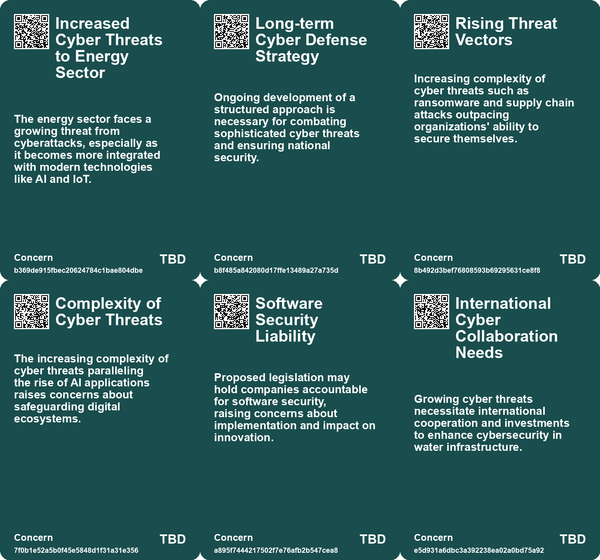
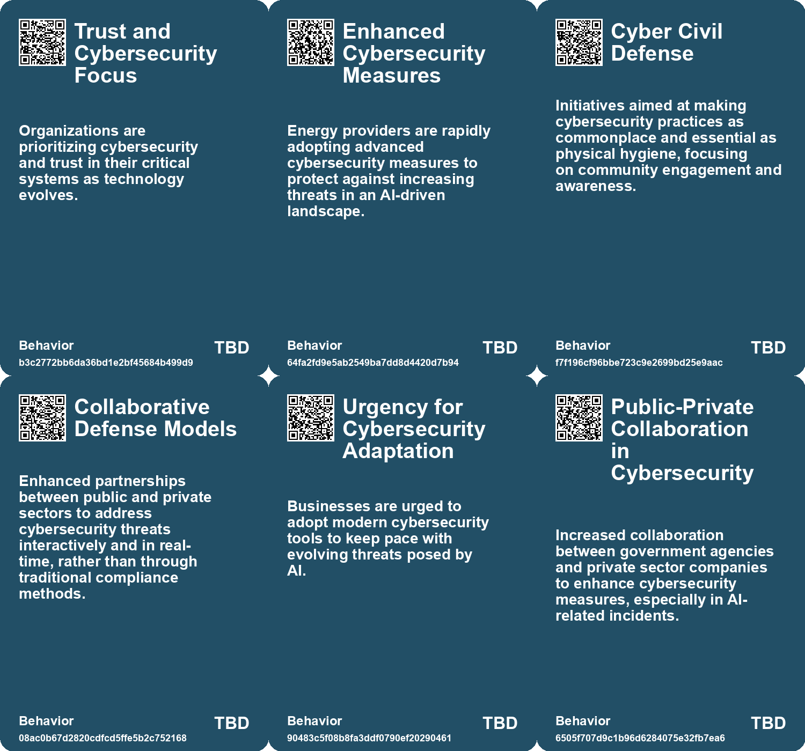
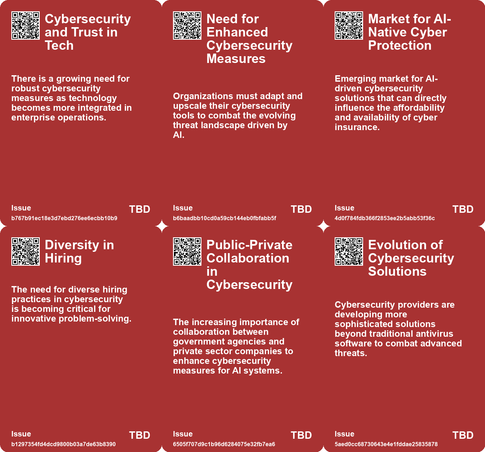
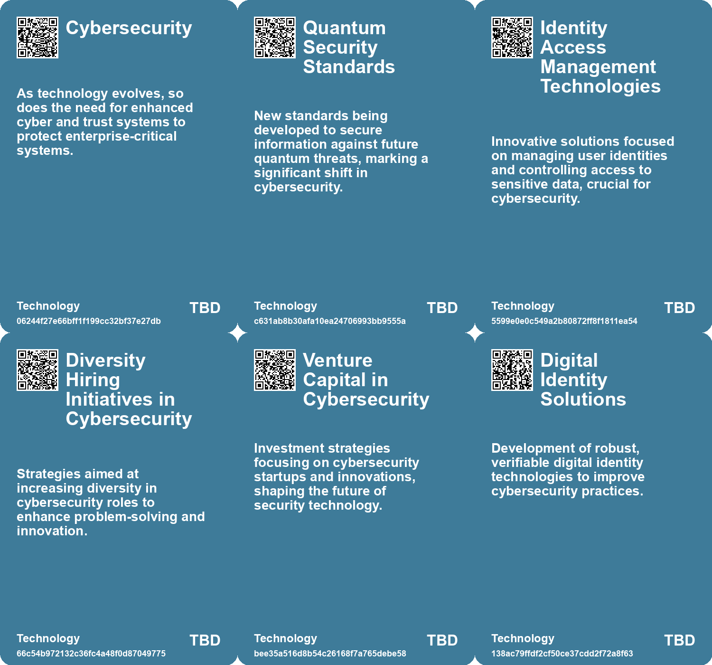

# *Topic*: Cybersecurity Innovations

# Summary

The cybersecurity landscape is marked by a complex interplay of threats, innovations, and evolving strategies. Economic uncertainty has led to layoffs in the cybersecurity job market, creating a disconnect between job forecasts and actual opportunities. Job seekers face challenges in navigating this landscape, highlighting the importance of accurate data and networking to identify promising positions. Despite these hurdles, many openings remain in top cybersecurity firms.

The sector is experiencing rapid growth driven by the increasing sophistication of cyberattacks. The rise of big data, cloud computing, and remote work has heightened the demand for security services. Investors are eyeing this growth, particularly in companies focused on endpoint and network security. However, elevated valuations in the cybersecurity sector warrant caution, suggesting that selective investment is prudent.

In the UK, the energy sector faces significant cybersecurity threats, exacerbated by outdated infrastructure and a surge in ransomware attacks. The integration of AI into energy systems poses additional risks, necessitating modern security measures like zero-trust frameworks. Proactive strategies, including threat intelligence and incident response planning, are essential for safeguarding critical infrastructure.

The Biden administration's national cybersecurity strategy aims to strengthen the U.S. cybersecurity posture by establishing accountability for software security and enhancing collaboration with the private sector. This strategy identifies China as a primary cyber threat and emphasizes the need for secure software development standards.

U.S. cyber agencies have issued warnings about potential attacks from Iranian-affiliated hackers targeting critical infrastructure. Organizations in sectors such as energy and healthcare are urged to bolster defenses against these threats, which may include ransomware and politically motivated attacks.

AI is increasingly recognized as a double-edged sword in cybersecurity. While it offers tools for improving risk assessments and enhancing security measures, it also facilitates new vulnerabilities. The rise of AI-driven cybercrime, including voice phishing and social engineering, underscores the need for organizations to adapt their security strategies.

The UK’s National Cyber Security Centre warns that companies must enhance their defenses against quantum-powered cyber threats. The adoption of post-quantum cryptography is crucial for protecting against future vulnerabilities. This guidance aligns with similar recommendations from the U.S., emphasizing the urgency of transitioning to new cryptographic standards.

Burnout is becoming a significant issue in the cybersecurity workforce, driven by high stress and demanding workloads. The need for better mental health support and regulatory frameworks is increasingly recognized as essential for retaining talent in this high-pressure field. As the industry evolves, addressing these challenges will be critical for maintaining a resilient cybersecurity workforce.

# Seeds

|    | name                                                     | description                                                                                  | change                                                                                                 | 10-year                                                                                                            | driving-force                                                                                               |
|---:|:---------------------------------------------------------|:---------------------------------------------------------------------------------------------|:-------------------------------------------------------------------------------------------------------|:-------------------------------------------------------------------------------------------------------------------|:------------------------------------------------------------------------------------------------------------|
|  0 | Quantum-Powered Cyber Attacks                            | An emergence of cyber threats utilizing quantum computing technologies.                      | Current cybersecurity methods will become obsolete as quantum attacks become prevalent.                | Quantum computing will redefine cyber threats, needing entirely new security infrastructures in organizations.     | Rapid advancements in quantum computing capabilities that could be exploited by malicious actors.           |
|  1 | Collaboration for Cyber Defense                          | Increased partnerships between public and private sectors to improve cybersecurity defenses. | Moving from isolated cyber defense efforts to collaborative strategies involving various stakeholders. | A robust ecosystem of shared information and resources enhances national cyber defense capabilities significantly. | The interconnected nature of cyber threats necessitates collaboration across sectors for effective defense. |
|  2 | Human-AI Collaboration                                   | Integration of human expertise within AI-driven cybersecurity workflows.                     | Move from purely AI-based solutions to hybrid models combining human judgment and AI capabilities.     | Cybersecurity strategies will rely on continuous feedback loops between AI systems and human experts.              | The complexity of cyber threats necessitating human insight alongside AI efficiency.                        |
|  3 | Market Accessibility Initiatives                         | Efforts to make cyber insurance more accessible for small organizations.                     | From a niche market to broader coverage options for diverse business sizes.                            | Cyber insurance will be an essential component for all businesses, regardless of size or sector.                   | The drive to reduce barriers and increase awareness of cyber insurance importance.                          |
|  4 | Regulatory Changes Impacting Cyber Security              | New regulations may mandate better cyber security practices for maritime operations.         | Shift from voluntary to mandatory cyber security standards in maritime sectors.                        | Maritime operations will see enhanced cyber security measures driven by regulations.                               | Increasing incidents of cyber threats push for regulatory changes for safety.                               |
|  5 | Cyber Security Guidance for Businesses                   | New guidance published for business leaders to improve cyber security practices.             | Businesses are beginning to recognize cyber security as a critical financial issue.                    | In ten years, cyber security may be integrated into core business strategies across sectors.                       | The recognition of cyber threats as vital business concerns drives enhanced security measures.              |
|  6 | Public Awareness of Cyber Threats                        | Increased public and organizational awareness of the cyber security landscape.               | Public awareness of cyber threats is growing, leading to better preparedness.                          | In ten years, public and organizational readiness for cyber threats will be significantly improved.                | Rising incidents of cyber attacks prompt a need for greater awareness and education.                        |
|  7 | Integration of Cybersecurity in Defense Products         | Defense companies are increasingly incorporating cybersecurity into their offerings.         | Blurring lines between traditional defense and cybersecurity solutions.                                | Emergence of hybrid products that combine defense and cybersecurity features.                                      | Increased recognition of cyber threats as a component of national security.                                 |
|  8 | Accelerated Growth in Cybersecurity Providers            | The cybersecurity sector is experiencing rapid growth in service demand.                     | From a niche market to a vital component of technology infrastructure.                                 | Cybersecurity services become a fundamental aspect of all technology offerings.                                    | The escalating complexity of managing cybersecurity in an interconnected world.                             |
|  9 | Integration of Emerging Technologies in Cyber Operations | DoD explores the intersection of emerging technologies with cyber capabilities.              | Shift from conventional cyber tactics to incorporating emerging technologies in defense.               | Cyber operations will leverage advanced technologies, making them more sophisticated and effective.                | Rapid technological advancement necessitates integration into defense strategies.                           |

# Concerns

|    | name                                                     | description                                                                                                                                    |
|---:|:---------------------------------------------------------|:-----------------------------------------------------------------------------------------------------------------------------------------------|
|  0 | Increased Cyber Threats to Energy Sector                 | The energy sector faces a growing threat from cyberattacks, especially as it becomes more integrated with modern technologies like AI and IoT. |
|  1 | Long-term Cyber Defense Strategy                         | Ongoing development of a structured approach is necessary for combating sophisticated cyber threats and ensuring national security.            |
|  2 | Rising Threat Vectors                                    | Increasing complexity of cyber threats such as ransomware and supply chain attacks outpacing organizations' ability to secure themselves.      |
|  3 | Complexity of Cyber Threats                              | The increasing complexity of cyber threats paralleling the rise of AI applications raises concerns about safeguarding digital ecosystems.      |
|  4 | Software Security Liability                              | Proposed legislation may hold companies accountable for software security, raising concerns about implementation and impact on innovation.     |
|  5 | International Cyber Collaboration Needs                  | Growing cyber threats necessitate international cooperation and investments to enhance cybersecurity in water infrastructure.                  |
|  6 | Increased Cyberattack Sophistication                     | Cybercriminals are leveraging advanced technologies, making attacks more sophisticated and difficult to prevent.                               |
|  7 | Critical Infrastructure Security Risks                   | Defending critical infrastructure against sophisticated cyber threats remains a pressing concern for national security.                        |
|  8 | Emerging Technologies and Cybercapabilities Intersection | The exploration of new technologies in cybersecurity could lead to unforeseen vulnerabilities if not carefully evaluated.                      |
|  9 | Long-term Impact of Cyber Strategy                       | Ensuring a lasting effect of the cyber strategy may prove challenging amid rapid cyber threat evolution.                                       |

# Cards

## Concerns

## Behaviors

## Issue

## Technology

# Links

* [UK Cyber Security Chief Warns of Rising AI-Assisted Ransomware Threats](https://futures.kghosh.me/1c3d82ee939ffa81f9376cb961a20f46)
* [CISA Hosts Inaugural AI Tabletop Exercise to Enhance Cybersecurity Response Collaboration](https://futures.kghosh.me/bed32c427bb73bc07f5e7795433951c4)
* [Biden Administration Unveils New Cybersecurity Strategy to Combat Growing Threats](https://futures.kghosh.me/1eaefdcf11b24d5f443b5f4e7645e0a5)
* [Enhancing Cyber Insurance Accessibility and Affordability Through AI Innovations](https://futures.kghosh.me/724dfbad882cc57ee4e3526f4f43327b)
* [Belgium Implements Comprehensive Legal Protections for Ethical Hackers, Leading EU in Cybersecurity Policy](https://futures.kghosh.me/8ae26b7eeafce0d7e88a3f1e7cadcfd7)
* [Challenges and Opportunities in the 2023 Cybersecurity Job Market: Insights and Strategies](https://futures.kghosh.me/0ab36af538bf262c85b73fa7e7bd657f)
* [Understanding the Growing Burnout Crisis in Cybersecurity Professions](https://futures.kghosh.me/c87f31ea7f919c966942a4169f2f5a72)
* [Understanding the Financial Motivations Behind Maritime Cyber Security Threats](https://futures.kghosh.me/af7a13a1e97a8ebff3d521dabea087ce)
* [Jen Easterly Reflects on CISA's Achievements and the Future of Cybersecurity Challenges](https://futures.kghosh.me/307c9f9c16755de33ab15a8802b80e68)
* [Urgent Warning: Threats from Iranian Cyber Hackers to U.S. Critical Infrastructure](https://futures.kghosh.me/605e2654bd3bbaa502827084ca7a44be)
* [White House Launches Initiative to Secure Open Source Software in Critical Infrastructure](https://futures.kghosh.me/925e58163f39d747785e0e85eeea0f25)
* [Safeguarding the UK's Energy Sector: The Cybersecurity Challenge in an AI Era](https://futures.kghosh.me/58871ce6d54ebbaf1ac529fa1376eb2a)
* [Generative AI: Transforming Identity Security and Governance Amidst Rising Threats](https://futures.kghosh.me/06af6687242788a345b934758b3a0705)
* [U.S. Department of Commerce Announces New AI Safety and Trustworthiness Initiatives](https://futures.kghosh.me/fa4fc4145d0de8fe7d6c3a734a47557f)
* [Exploring Investment Opportunities in the Rapidly Growing Cybersecurity Sector](https://futures.kghosh.me/211803931bfabc324f12ad1524640ef1)
* [Overview of Cyber Threats in the UK: Insights from the 2023 Cyber Security Breaches Survey](https://futures.kghosh.me/576f8cf76f713e057b075e2424ea709c)
* [Increasing Cyber Threats in the UK: The Role of AI and Generative Services](https://futures.kghosh.me/dabd88039518d1eb97139f16625eeec8)
* [UK Cybersecurity Agency Urges Firms to Adopt Post-Quantum Cryptography by 2035](https://futures.kghosh.me/e09fec2736014f7199149dc8b70af3c4)
* [Exploring the Integration of AI in Daily Life and Business Innovations in Tech Trends 2025](https://futures.kghosh.me/0b0e772667a3f74d6364a71eb20bc913)
* [Google's 2026 Cybersecurity Forecast: The Rise of AI-Driven Cybercrime and Nation-State Threats](https://futures.kghosh.me/5cbd39db8f9df76ceec518a276cd7d17)
* [Overview of the US DoD's 2023 Cyber Strategy: Enhancing Cyber Defense and Partnerships](https://futures.kghosh.me/f88aebcf579dffa42fc0dbe74de919c4)
* [Humorous Caricatures of Security Professionals in the Industry](https://futures.kghosh.me/5444b9b0cc036d01ecca1bfa972e2f67)
* [Growing Cybersecurity Threats to Water Infrastructure Demand Immediate Action and Collaboration](https://futures.kghosh.me/fb9b2211d0fcea8245837d9b34379d9f)
* [Understanding Neurosecurity: Protection for Neural Devices and User Behavior](https://futures.kghosh.me/70be08bc846223ea4b986fd5f9a69bcf)
* [Transforming Water Utilities: Addressing Security and Sustainability Challenges through Innovation](https://futures.kghosh.me/d54442ea6fe7853d0f8674688c9b7064)
* [Examining the Alleged Crisis in Information Security Job Market: Myths and Realities](https://futures.kghosh.me/38bda67182126c0f814ed70882b5fed2)