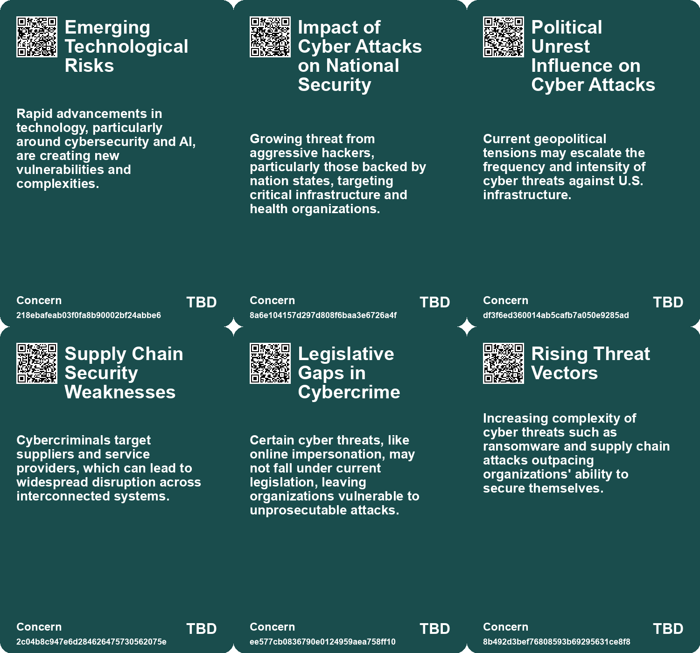
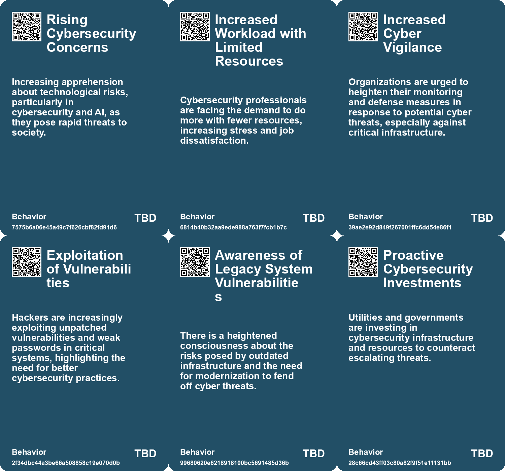
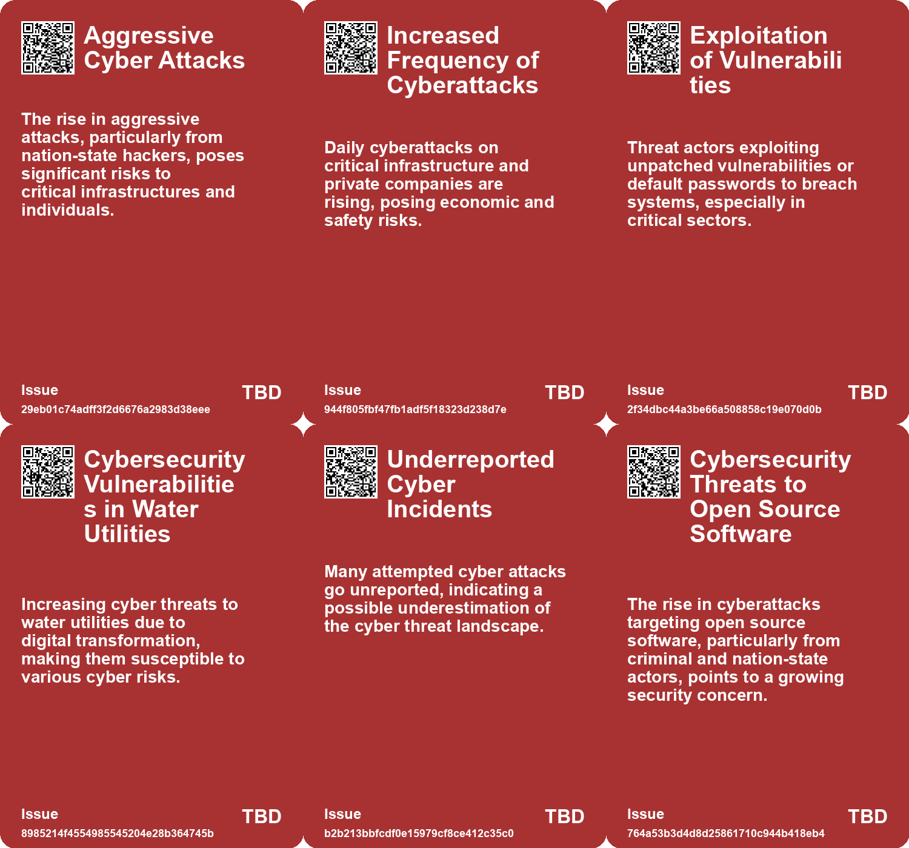
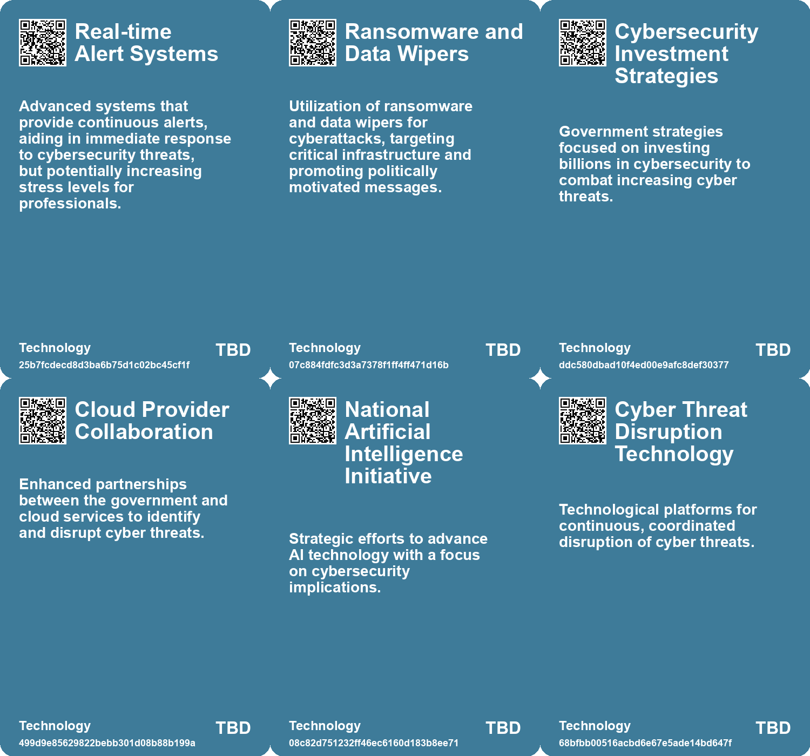

# *Topic*: Cybersecurity Threats

# Summary

Cybersecurity is increasingly at the forefront of national and global concerns, with various sectors facing heightened threats. U.S. cyber agencies have issued warnings about potential attacks from Iranian-affiliated hackers targeting critical infrastructure, particularly in energy, water, and healthcare. Organizations are urged to strengthen their defenses against ransomware and other politically motivated cyber threats. The Biden administration's national cybersecurity strategy aims to enhance the country's cybersecurity posture, emphasizing accountability for software security and collaboration with the private sector.

In the UK, cybercrime is rampant, with phishing attacks being the most common. Ransomware incidents have caused significant disruptions, particularly in public services like the NHS. The National Cyber Security Centre has highlighted the growing threat of AI-assisted ransomware, making it easier for novice hackers to execute attacks. The government is investing heavily to bolster defenses against these rising threats, but concerns remain about the vulnerability of critical national infrastructure.

The cybersecurity job market is experiencing turbulence due to economic uncertainty, leading to layoffs and budget cuts. Despite a reported shortage of cybersecurity professionals, job seekers face challenges in finding opportunities. Networking and accurate market data are essential for those looking to enter the field. Meanwhile, the cybersecurity sector is poised for growth, driven by the increasing complexity of cyberattacks and the demand for advanced security services.

AI is transforming the landscape of cybersecurity, both as a tool for attackers and defenders. Cybercriminals are leveraging AI for sophisticated phishing and social engineering attacks, while organizations are adopting AI-driven security measures to combat these threats. The rise of generative AI has led to a significant increase in voice phishing attacks, prompting a shift in identity security strategies. Companies are increasingly implementing zero-trust frameworks and real-time behavioral analytics to enhance their defenses.

The maritime industry is also facing unique cybersecurity challenges, with hackers targeting it for financial gain. Ransomware and invoice fraud are prevalent, and new tactics, such as shorting stocks before a breach, raise ethical concerns. Proactive measures are essential for maritime businesses to safeguard against these evolving threats.

Germany is grappling with a surge in attacks on its critical infrastructure, including cyberattacks and sabotage linked to organized crime. The government is urged to take decisive action to protect public trust and enhance defense mechanisms. Similarly, the UK faces a potential catastrophic ransomware attack due to inadequate planning and investment in cybersecurity for its critical national infrastructure.

Finally, the importance of addressing internal conflicts within organizations is highlighted as a significant barrier to effective incident response. Tensions between cybersecurity leaders and business executives can hinder collaboration and exacerbate the impact of cyberattacks. Emphasizing the business value of cybersecurity initiatives is crucial for fostering support and improving resilience against threats.

# Seeds

|    | name                                                | description                                                                                          | change                                                                                                                     | 10-year                                                                                                                  | driving-force                                                                                                                         |
|---:|:----------------------------------------------------|:-----------------------------------------------------------------------------------------------------|:---------------------------------------------------------------------------------------------------------------------------|:-------------------------------------------------------------------------------------------------------------------------|:--------------------------------------------------------------------------------------------------------------------------------------|
|  0 | Increased Cybersecurity Threats                     | Heightened risks from Iranian-affiliated hackers targeting U.S. critical infrastructure.             | Shift from low-level to high-stakes cyber threats against essential services.                                              | More sophisticated cyber defenses and international cybersecurity coalitions emerge.                                     | Geopolitical tensions and enhanced hacking capabilities motivate cyber aggression.                                                    |
|  1 | Increased Vulnerability of Businesses               | Businesses are becoming more vulnerable to cyber threats due to AI advancements.                     | Transition from secure systems to more easily breached systems due to AI tools.                                            | In a decade, businesses may face unprecedented levels of cyber threats and data breaches.                                | The continuous evolution of cyberattack strategies leveraging AI advancements.                                                        |
|  2 | Cybersecurity Vulnerabilities in Public WiFi        | Recent cyber attacks expose risks in public WiFi networks used by critical infrastructure.           | Shift from underestimating public WiFi security to recognizing it as a critical risk factor.                               | Public WiFi networks will likely see enhanced security measures and regulations, improving overall cybersecurity.        | Growing awareness of cyber threats and their impact on public safety will drive demand for better security protocols.                 |
|  3 | Insider Threats to Cybersecurity                    | Insider breaches highlight vulnerabilities in cybersecurity management within organizations.         | Shift from focusing solely on external threats to acknowledging significant risks from within organizations.               | Organizations will implement more rigorous internal security measures to mitigate insider threats effectively.           | Increased incidents of insider threats will compel companies to strengthen internal monitoring and access protocols.                  |
|  4 | Increased Cyber Threats to Water Sector             | Growing incidents of cyberattacks on water utilities indicate heightened vulnerability.              | The water sector is shifting from underestimating cyber risks to prioritizing cybersecurity measures.                      | In 10 years, water utilities will adopt advanced cybersecurity frameworks and technologies to safeguard against threats. | The increasing sophistication and frequency of cyberattacks drive the need for enhanced security measures in critical infrastructure. |
|  5 | Increased Awareness of Infrastructure Vulnerability | Rising incidents raise awareness about the vulnerabilities of water infrastructure to cyber threats. | Awareness is shifting from ignorance about vulnerabilities to a proactive stance on cybersecurity in water infrastructure. | In a decade, water infrastructure will be designed with built-in cybersecurity measures as a standard practice.          | Incidents of cyberattacks and their potential impacts prompt a reevaluation of existing infrastructure vulnerabilities.               |
|  6 | Rising Cyber Threats from Geopolitical Adversaries  | Increased cyberattacks from nations like China and Russia targeting infrastructures.                 | Shift from individual data theft to state-sponsored attacks on critical systems.                                           | Increased investment in national cybersecurity infrastructure and global cooperation on cyber defense.                   | Geopolitical tensions and the need for national security in cyberspace.                                                               |
|  7 | Integration of Cybersecurity in Defense Products    | Defense companies are increasingly incorporating cybersecurity into their offerings.                 | Blurring lines between traditional defense and cybersecurity solutions.                                                    | Emergence of hybrid products that combine defense and cybersecurity features.                                            | Increased recognition of cyber threats as a component of national security.                                                           |
|  8 | Accelerated Growth in Cybersecurity Providers       | The cybersecurity sector is experiencing rapid growth in service demand.                             | From a niche market to a vital component of technology infrastructure.                                                     | Cybersecurity services become a fundamental aspect of all technology offerings.                                          | The escalating complexity of managing cybersecurity in an interconnected world.                                                       |
|  9 | Potential for Cyber-Physical Attacks                | Emerging risks of cyber-physical attacks on critical infrastructure could threaten safety.           | From traditional cyber threats to potential physical harm through cyber-attack vectors.                                    | In 10 years, there may be stricter regulations and protections for cyber-physical systems.                               | The need for safety and security in critical infrastructure drives advancements in cybersecurity.                                     |

# Concerns

|    | name                                         | description                                                                                                                                           |
|---:|:---------------------------------------------|:------------------------------------------------------------------------------------------------------------------------------------------------------|
|  0 | Emerging Technological Risks                 | Rapid advancements in technology, particularly around cybersecurity and AI, are creating new vulnerabilities and complexities.                        |
|  1 | Impact of Cyber Attacks on National Security | Growing threat from aggressive hackers, particularly those backed by nation states, targeting critical infrastructure and health organizations.       |
|  2 | Political Unrest Influence on Cyber Attacks  | Current geopolitical tensions may escalate the frequency and intensity of cyber threats against U.S. infrastructure.                                  |
|  3 | Supply Chain Security Weaknesses             | Cybercriminals target suppliers and service providers, which can lead to widespread disruption across interconnected systems.                         |
|  4 | Legislative Gaps in Cybercrime               | Certain cyber threats, like online impersonation, may not fall under current legislation, leaving organizations vulnerable to unprosecutable attacks. |
|  5 | Rising Threat Vectors                        | Increasing complexity of cyber threats such as ransomware and supply chain attacks outpacing organizations' ability to secure themselves.             |
|  6 | Nation-State Attacks                         | Cyber threats from nation-state actors pose significant risks due to their resources and intent to disrupt infrastructure.                            |
|  7 | Increased Cyberattack Sophistication         | Cybercriminals are leveraging advanced technologies, making attacks more sophisticated and difficult to prevent.                                      |
|  8 | Vulnerabilities in Critical Infrastructure   | Cyberattacks targeting essential services, such as the power grid, can jeopardize public safety and national security.                                |
|  9 | Critical Infrastructure Security Risks       | Defending critical infrastructure against sophisticated cyber threats remains a pressing concern for national security.                               |

# Cards

## Concerns

## Behaviors

## Issue

## Technology

# Links

* [Overview of Cyber Threats in the UK: Insights from the 2023 Cyber Security Breaches Survey](https://futures.kghosh.me/576f8cf76f713e057b075e2424ea709c)
* [Enhancing Cyber Insurance Accessibility and Affordability Through AI Innovations](https://futures.kghosh.me/724dfbad882cc57ee4e3526f4f43327b)
* [Future Risks Report 2025: Increasing Global Crises and Emerging Risks Analysis](https://futures.kghosh.me/c5ecb012c90eddae1d46c1137e384c86)
* [Understanding the Growing Burnout Crisis in Cybersecurity Professions](https://futures.kghosh.me/c87f31ea7f919c966942a4169f2f5a72)
* [Exploring Investment Opportunities in the Rapidly Growing Cybersecurity Sector](https://futures.kghosh.me/211803931bfabc324f12ad1524640ef1)
* [UK Cyber Security Chief Warns of Rising AI-Assisted Ransomware Threats](https://futures.kghosh.me/1c3d82ee939ffa81f9376cb961a20f46)
* [Examining the Alleged Crisis in Information Security Job Market: Myths and Realities](https://futures.kghosh.me/38bda67182126c0f814ed70882b5fed2)
* [CISO-CEO Tensions Hinder Cyber Incident Response: Experts Urge Focus on Business Alignment](https://futures.kghosh.me/2270b1d57d23935deb07f3964bd621e5)
* [Addressing Threats to Democracy: Strategies for Resilience Against Misinformation and Manipulation](https://futures.kghosh.me/56d1a28746cd95ebaa3d62a4e1f91c3a)
* [Overview of the US DoD's 2023 Cyber Strategy: Enhancing Cyber Defense and Partnerships](https://futures.kghosh.me/f88aebcf579dffa42fc0dbe74de919c4)
* [Understanding the Financial Motivations Behind Maritime Cyber Security Threats](https://futures.kghosh.me/af7a13a1e97a8ebff3d521dabea087ce)
* [Safeguarding the UK's Energy Sector: The Cybersecurity Challenge in an AI Era](https://futures.kghosh.me/58871ce6d54ebbaf1ac529fa1376eb2a)
* [Increasing Threats to German Infrastructure: Drones, Cyberattacks, and Sabotage](https://futures.kghosh.me/d045d8b5ced2f8d16cc811c965dee5e2)
* [Biden Administration Unveils New Cybersecurity Strategy to Combat Growing Threats](https://futures.kghosh.me/1eaefdcf11b24d5f443b5f4e7645e0a5)
* [Growing Cybersecurity Threats to Water Infrastructure Demand Immediate Action and Collaboration](https://futures.kghosh.me/fb9b2211d0fcea8245837d9b34379d9f)
* [Challenges and Opportunities in the 2023 Cybersecurity Job Market: Insights and Strategies](https://futures.kghosh.me/0ab36af538bf262c85b73fa7e7bd657f)
* [Cyber Attack on UK Train Stations Highlights Public WiFi Security Vulnerabilities](https://futures.kghosh.me/94c1456af1955d62efd074577c67b4e8)
* [Emerging Global Risks: Climate Change, Geopolitical Tensions, and Technological Threats in 2025](https://futures.kghosh.me/c279f12eda98e732755a0f730b9d4d4b)
* [White House Launches Initiative to Secure Open Source Software in Critical Infrastructure](https://futures.kghosh.me/925e58163f39d747785e0e85eeea0f25)
* [UK Faces High Risk of Catastrophic Ransomware Attack Due to Poor Cybersecurity Investment](https://futures.kghosh.me/3de8b64ba20eb613a72b0479350b5e5b)
* [Generative AI: Transforming Identity Security and Governance Amidst Rising Threats](https://futures.kghosh.me/06af6687242788a345b934758b3a0705)
* [Transforming Water Utilities: Addressing Security and Sustainability Challenges through Innovation](https://futures.kghosh.me/d54442ea6fe7853d0f8674688c9b7064)
* [Google's 2026 Cybersecurity Forecast: The Rise of AI-Driven Cybercrime and Nation-State Threats](https://futures.kghosh.me/5cbd39db8f9df76ceec518a276cd7d17)
* [Trump Administration's Cybersecurity Advisory Boards Dismantled Amid Rising Threats from China](https://futures.kghosh.me/6f7b4e8be445b769c44531f844aabe0f)
* [Increasing Cyber Threats in the UK: The Role of AI and Generative Services](https://futures.kghosh.me/dabd88039518d1eb97139f16625eeec8)
* [Urgent Warning: Threats from Iranian Cyber Hackers to U.S. Critical Infrastructure](https://futures.kghosh.me/605e2654bd3bbaa502827084ca7a44be)