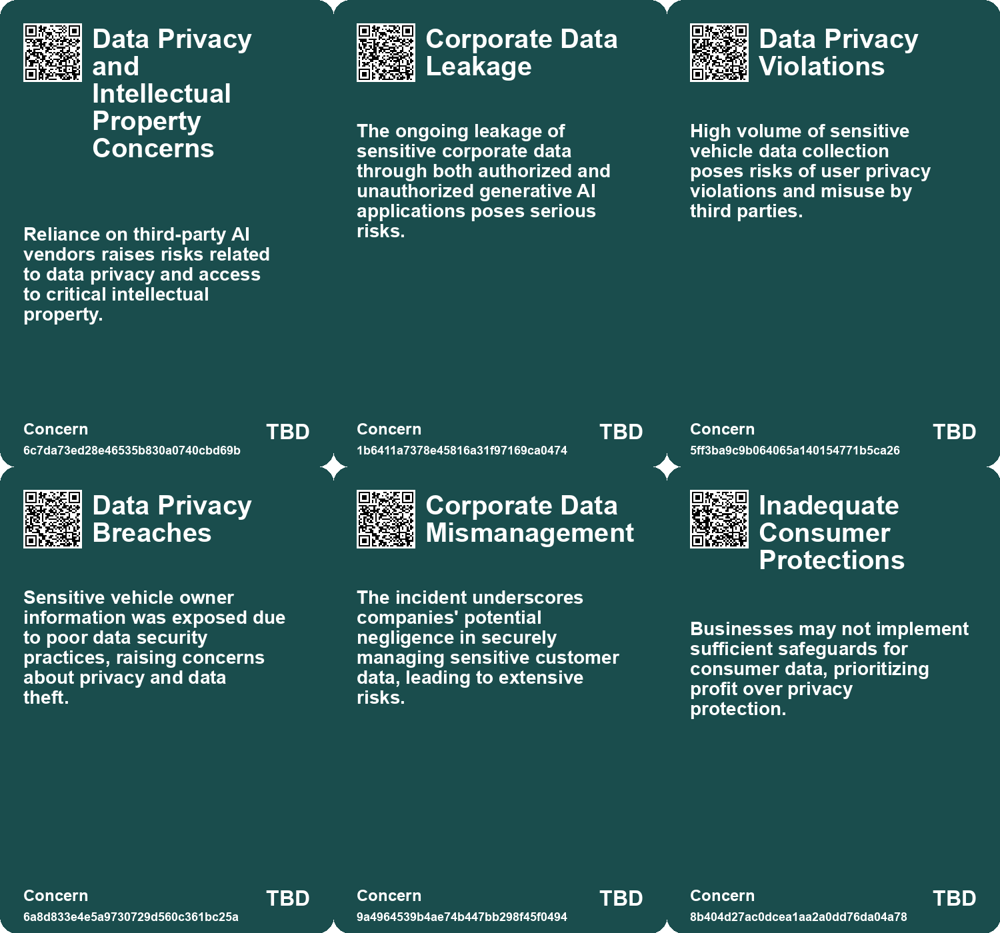
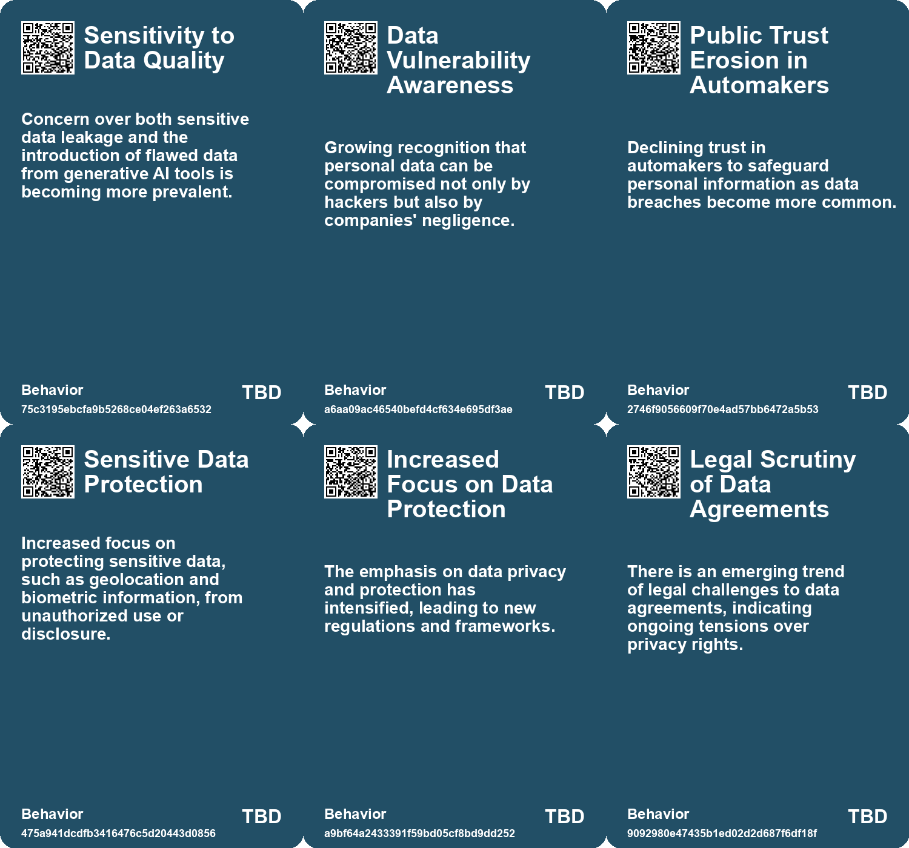
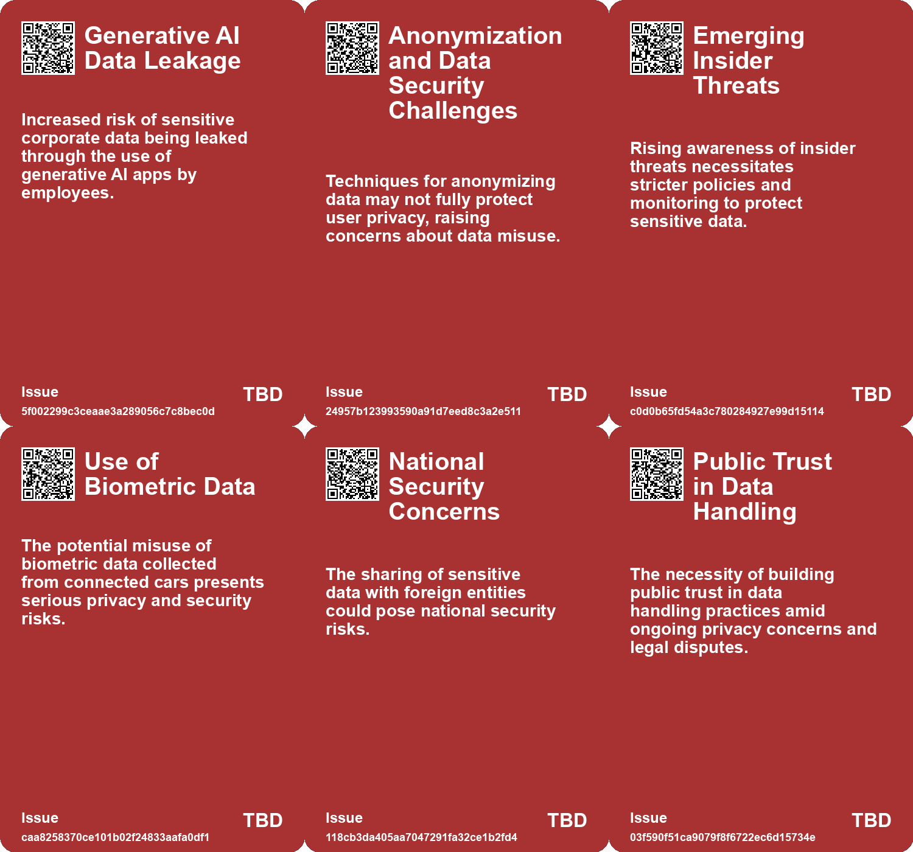
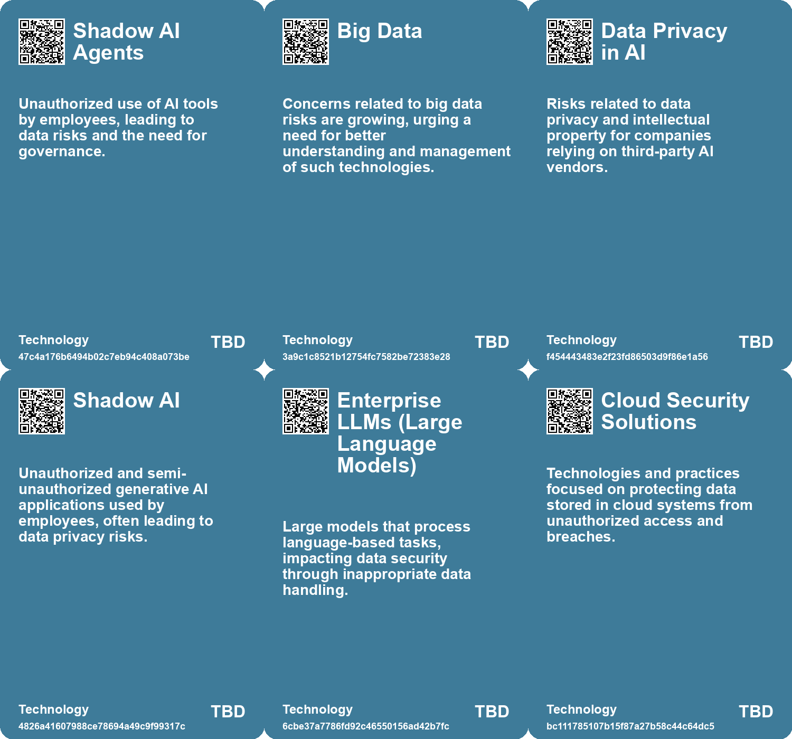

# *Topic*: Data Privacy and Security Risks

# Summary

The intersection of technology and security is increasingly fraught with challenges as organizations grapple with the implications of generative AI and cybersecurity threats. A report reveals that enterprise users are inadvertently leaking sensitive data through both authorized and unauthorized AI applications, with a significant percentage of employee prompts containing confidential information. Chief Information Security Officers face the dual challenge of managing data leakage risks while navigating the complexities of shadow AI tools.

Cybercrime remains a pressing issue, particularly in the UK, where phishing attacks are the most common form of security breach. Organizations are urged to prioritize cybersecurity measures to combat impersonation, malware, and ransomware attacks. The energy sector is particularly vulnerable, with outdated infrastructure making it a prime target for cybercriminals. Proactive strategies, including modern security measures and incident response planning, are essential to safeguard critical infrastructure.

The automotive industry is also under scrutiny for its data collection practices. A significant data breach involving the VW Group exposed sensitive information of electric vehicle owners, highlighting the urgent need for improved cybersecurity measures. Privacy advocates express concerns over the extensive data collected by connected cars, which can include personal information and biometrics. The Federal Trade Commission is actively addressing these privacy issues, emphasizing the importance of data security and consumer protection.

As generative AI technology evolves, it presents both opportunities and risks. Companies are navigating the complexities of data privacy, copyright, and attribution in the realm of AI-generated content. Legal battles are emerging, underscoring the need for clear guidelines and fair use considerations. Organizations are encouraged to adopt AI responsibly while addressing privacy and security concerns.

The Future Risks Report highlights the growing complexity of global risks, with climate change, geopolitical instability, and cybersecurity emerging as top concerns. Social fragmentation is intensifying vulnerabilities, and the report calls for a holistic approach to risk management. Changing demographics also pose new challenges, particularly for healthcare systems facing strain from an aging population.

The cybersecurity job market is experiencing turbulence amid economic uncertainty, leading to layoffs and budget cuts. Despite these challenges, there remains a disconnect between job market forecasts and the reality of finding new opportunities in cybersecurity. Job seekers are advised to leverage networking and seek accurate data to identify promising areas within the market.

Finally, the regulatory landscape for AI is fragmented, with regulators racing to establish guidelines that promote innovation while addressing potential risks. The rise of AI-fueled cybercrime is anticipated, necessitating new security measures and oversight. As organizations adapt to these evolving threats, the importance of transparency, governance, and individual rights in the digital landscape cannot be overstated.

# Seeds

|    | name                                          | description                                                                                           | change                                                                                                            | 10-year                                                                                                            | driving-force                                                                                                       |
|---:|:----------------------------------------------|:------------------------------------------------------------------------------------------------------|:------------------------------------------------------------------------------------------------------------------|:-------------------------------------------------------------------------------------------------------------------|:--------------------------------------------------------------------------------------------------------------------|
|  0 | Emergence of Technological Risks              | Technological risks are appearing at an unprecedented pace, with growing public concerns.             | Shift from traditional risks to rapid emerging technological threats in public perception and expert discussions. | In a decade, society might prioritize cybersecurity and AI risk management in policies and everyday practices.     | The rapid advancement of technology outpaces existing risk management frameworks, raising new societal concerns.    |
|  1 | Growing Awareness of Data Privacy             | Drivers are becoming increasingly aware of the data collected by their vehicles and privacy risks.    | Shifting from ignorance about data collection to informed concern about privacy violations.                       | In ten years, consumers may demand stricter regulations and transparency from automakers regarding data usage.     | Increasing incidents of data breaches and privacy violations will drive consumers to prioritize their data privacy. |
|  2 | Insecurity Due to Cyber Threats               | Cyber security concerns rising amidst geopolitical tensions and AI advancements.                      | Moving from moderate to significant concern about cyber threats.                                                  | In ten years, cyber security will be a critical aspect of national security and personal privacy.                  | Advancements in AI and increased digital interdependencies.                                                         |
|  3 | Data Breaches in Automotive Industry          | Frequent data breaches affecting personal information of vehicle owners.                              | From occasional breaches to a pattern of recurring data security failures in the automotive sector.               | In ten years, data security will be a major consideration influencing vehicle purchases and brand trust.           | Increased connectivity and reliance on cloud services in modern vehicles heighten risks of data breaches.           |
|  4 | Data Ownership and Privacy                    | Concerns about who owns and controls data collected from devices.                                     | Control over personal data shifting from corporations to individuals and regulatory bodies.                       | More individuals owning their data, leading to new business models and privacy protections.                        | Growing awareness and activism around data privacy rights.                                                          |
|  5 | Privacy Concerns in Modern Vehicles           | The collection of personal data by car manufacturers raises significant privacy issues for consumers. | Shift from vehicles as private spaces to data-collecting devices that invade personal privacy.                    | Vehicles may be regulated to limit data collection, leading to greater consumer control over personal data.        | Growing consumer awareness and demand for privacy protections in technology.                                        |
|  6 | Increased scrutiny on data transfer practices | Regulatory bodies show heightened concern about data anonymisation and pseudonymisation.              | Shift from lenient data transfer practices to stricter scrutiny and regulations.                                  | In 10 years, data transfer will be heavily regulated, ensuring higher privacy standards.                           | Growing public demand for data privacy and protection against misuse.                                               |
|  7 | Integration of tracking technologies          | Widespread use of tracking technologies across multiple platforms raises privacy concerns.            | Transition from isolated data use to interconnected tracking systems that enhance user identification.            | In 10 years, tracking technologies may be ubiquitous, leading to more personalized but intrusive user experiences. | Advancements in technology and marketing strategies that rely on user data.                                         |
|  8 | Potential for re-identification               | Concerns arise about the ability to re-identify individuals from supposedly anonymised data.          | Move from perceived anonymity in data to potential risks of individual identification.                            | In 10 years, methods to re-identify individuals may become more sophisticated, challenging privacy laws.           | Technological advancements in data analytics and machine learning.                                                  |
|  9 | Emerging legal frameworks for data protection | The evolving legal landscape surrounding data protection and privacy rights is becoming more complex. | Shift from basic data protection laws to comprehensive frameworks addressing modern data practices.               | In 10 years, legal frameworks for data protection may become more robust and universally enforced.                 | Increased awareness and advocacy for individual data rights and protections.                                        |

# Concerns

|    | name                                            | description                                                                                                                                  |
|---:|:------------------------------------------------|:---------------------------------------------------------------------------------------------------------------------------------------------|
|  0 | Data Privacy and Intellectual Property Concerns | Reliance on third-party AI vendors raises risks related to data privacy and access to critical intellectual property.                        |
|  1 | Corporate Data Leakage                          | The ongoing leakage of sensitive corporate data through both authorized and unauthorized generative AI applications poses serious risks.     |
|  2 | Data Privacy Violations                         | High volume of sensitive vehicle data collection poses risks of user privacy violations and misuse by third parties.                         |
|  3 | Data Privacy Breaches                           | Sensitive vehicle owner information was exposed due to poor data security practices, raising concerns about privacy and data theft.          |
|  4 | Corporate Data Mismanagement                    | The incident underscores companies' potential negligence in securely managing sensitive customer data, leading to extensive risks.           |
|  5 | Inadequate Consumer Protections                 | Businesses may not implement sufficient safeguards for consumer data, prioritizing profit over privacy protection.                           |
|  6 | Legal Challenges                                | Ongoing legal battles and appeals regarding the adequacy of the new data privacy framework may create instability for businesses and users.  |
|  7 | Public Trust in Data Safety                     | Despite assurances, public confidence in data safety remains fragile, which could undermine the economic benefits projected from data flows. |
|  8 | Privacy Violations                              | Potential breaches of privacy in data usage for training AI models may attract legal scrutiny and harm user trust.                           |
|  9 | Inadequate Privacy Laws                         | Current privacy regulations failing to protect users against the unintended consequences of their digital traces.                            |

# Cards

## Concerns

## Behaviors

## Issue

## Technology

# Links

* [Understanding the Complex Landscape of Connected Vehicle Data and Privacy Concerns](https://futures.kghosh.me/fe7e41280ce4475f799785a436070868)
* [Overview of Cyber Threats in the UK: Insights from the 2023 Cyber Security Breaches Survey](https://futures.kghosh.me/576f8cf76f713e057b075e2424ea709c)
* [Future Risks Report 2025: Increasing Global Crises and Emerging Risks Analysis](https://futures.kghosh.me/c5ecb012c90eddae1d46c1137e384c86)
* [Understanding Google's Pseudonymisation vs Anonymisation in Data Handling](https://futures.kghosh.me/903096f9f71209541fb6fabd6220b72b)
* [Preserving Our Digital Future: The Challenge of Avoiding a Digital Dark Age](https://futures.kghosh.me/86e67181c4dcbce08848023aa2929bcb)
* [Exploring Cookies, Supply Chains, and Future Challenges in Technology and Consumption](https://futures.kghosh.me/fa27e27bdec01712d582ab0f61c95bac)
* [Future Risks Report 2024: Key Findings on Emerging Global Challenges](https://futures.kghosh.me/caf29de5522a914887f9653f8edfd0a6)
* [Navigating the Risks of Generative AI: Data Privacy and Intellectual Property Challenges](https://futures.kghosh.me/3c44301c056cd97da8e2fee49627b03e)
* [Understanding Digital Zombies: Managing the Threats of Online Activity and Privacy](https://futures.kghosh.me/20892c25b0e91262ff5377f30ae5b938)
* [The Alarming Privacy Issues of Modern Cars: A Deep Dive into Data Collection and Consent](https://futures.kghosh.me/d36bfc24eaef43d38c611b9c8d2491d0)
* [Enterprise Risks of Data Leaks Through Generative AI Applications: Insights and Recommendations](https://futures.kghosh.me/8db2a36589f876d68d47c64440d9b91c)
* [Privacy Risks of Connected Cars: FTC's Ongoing Efforts to Protect Consumers](https://futures.kghosh.me/cc8016bef53cadd0aadec4626a406982)
* [Safeguarding the UK's Energy Sector: The Cybersecurity Challenge in an AI Era](https://futures.kghosh.me/58871ce6d54ebbaf1ac529fa1376eb2a)
* [Understanding the Layers and Implications of Your Online Profile](https://futures.kghosh.me/f1d82c77bab293b0974aa46784ef1984)
* [Biden Administration Unveils New Cybersecurity Strategy to Combat Growing Threats](https://futures.kghosh.me/1eaefdcf11b24d5f443b5f4e7645e0a5)
* [EU Approves New Data Transfer Deal with the U.S. Amid Ongoing Privacy Concerns](https://futures.kghosh.me/bef6f36725097d0c16289eca2eb18df4)
* [Navigating the Complex Regulatory Landscape of Generative AI: Risks and Strategies for Organizations](https://futures.kghosh.me/43eafc183f7cc060f7cb7fed455e20a7)
* [Challenges and Opportunities in the 2023 Cybersecurity Job Market: Insights and Strategies](https://futures.kghosh.me/0ab36af538bf262c85b73fa7e7bd657f)
* [Emerging Global Risks: Climate Change, Geopolitical Tensions, and Technological Threats in 2025](https://futures.kghosh.me/c279f12eda98e732755a0f730b9d4d4b)
* [Generative AI: Transforming Identity Security and Governance Amidst Rising Threats](https://futures.kghosh.me/06af6687242788a345b934758b3a0705)
* [VW Group Data Breach Exposes 800,000 EV Owners' Sensitive Information, Raising Cybersecurity Concerns](https://futures.kghosh.me/74093ff7c82ad21987f693911e97634c)
* [Google's 2026 Cybersecurity Forecast: The Rise of AI-Driven Cybercrime and Nation-State Threats](https://futures.kghosh.me/5cbd39db8f9df76ceec518a276cd7d17)
* [AI Risks Increasingly Acknowledged by S&P 500 Firms Amid Optimism on Business Opportunities](https://futures.kghosh.me/ffb77d0b4aee98b9deee7e41a3c1bbdf)
* [Increasing Cyber Threats in the UK: The Role of AI and Generative Services](https://futures.kghosh.me/dabd88039518d1eb97139f16625eeec8)
* [Urgent Warning: Threats from Iranian Cyber Hackers to U.S. Critical Infrastructure](https://futures.kghosh.me/605e2654bd3bbaa502827084ca7a44be)