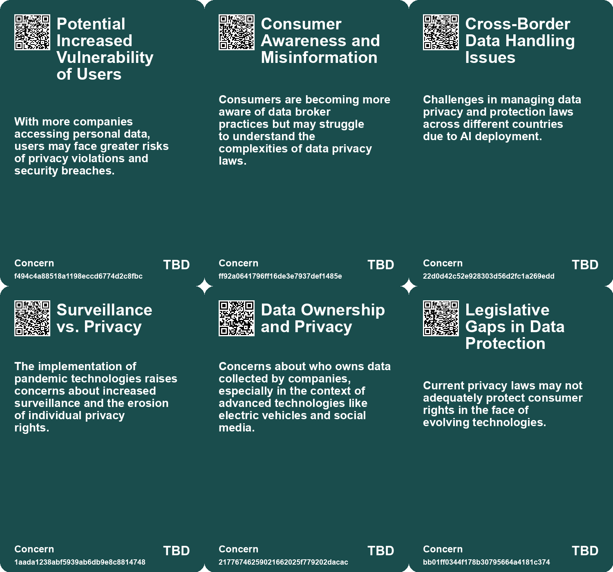
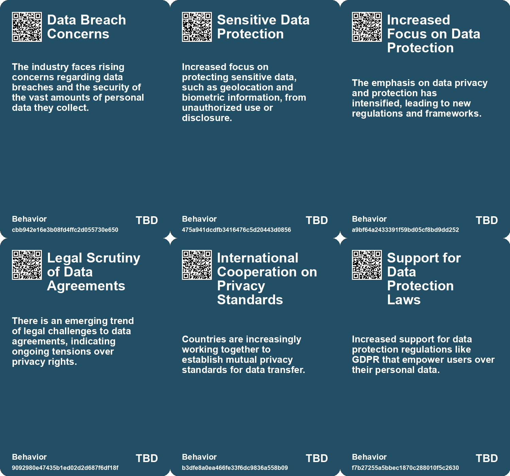
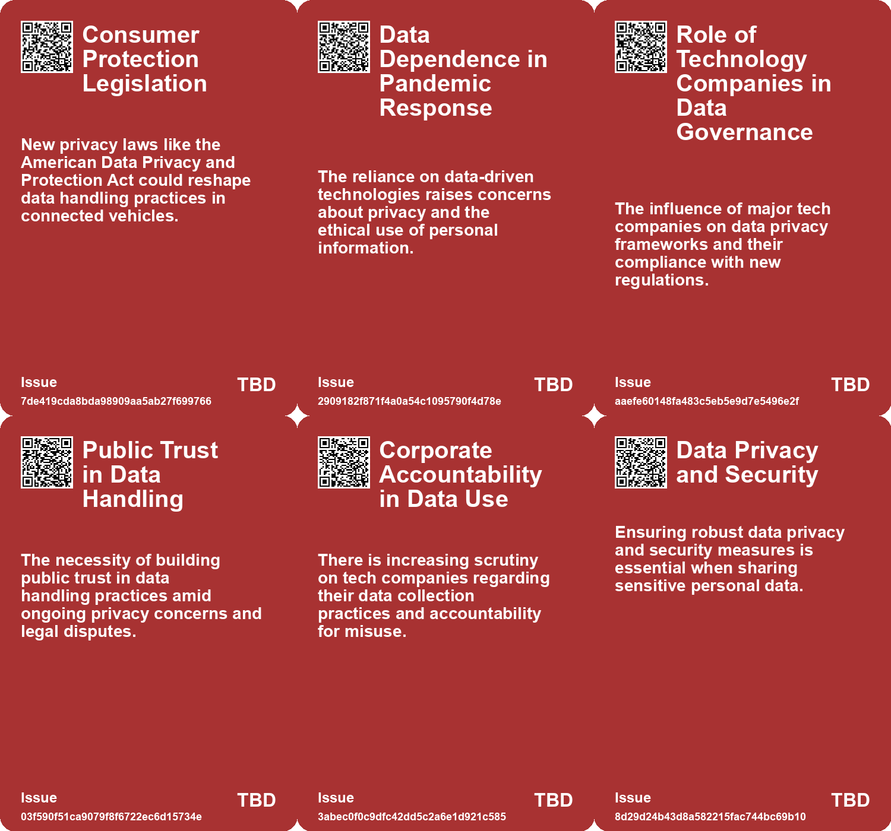
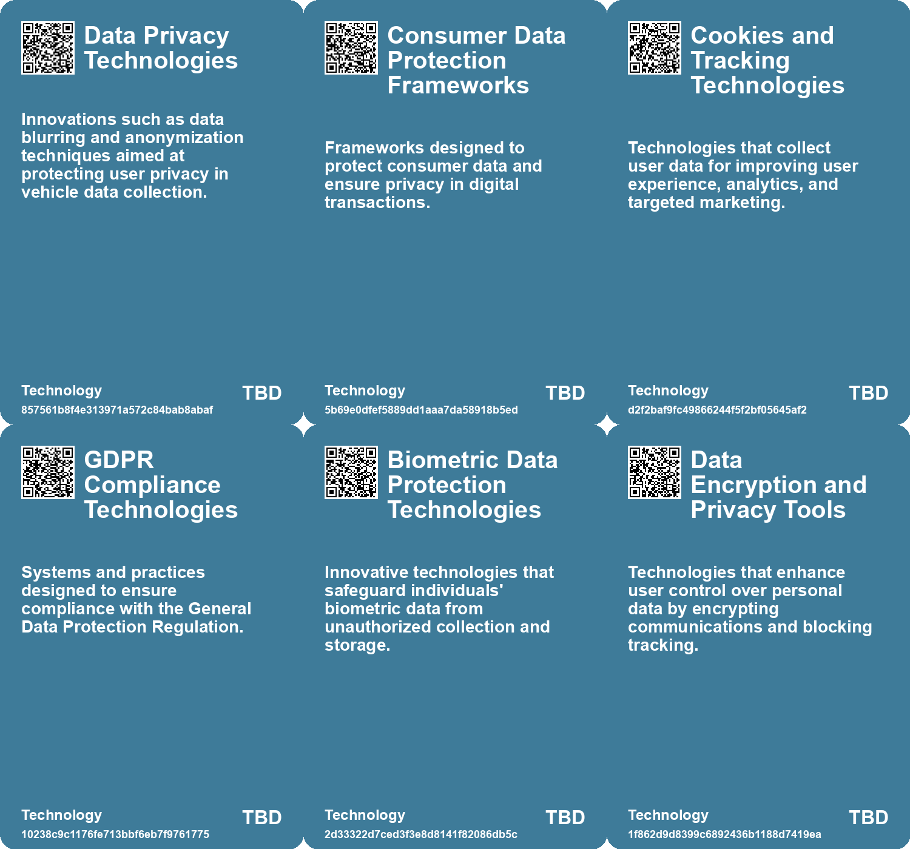

# *Topic*: Data Privacy Technologies

# Summary

The intersection of technology, privacy, and data management is increasingly shaping modern society. The European Union has taken significant steps to facilitate data transfers between the EU and the United States through the EU-U.S. Data Privacy Framework. This agreement aims to provide clarity for tech companies and ensure adequate protection for European citizens' personal data, following the collapse of the previous Privacy Shield agreement.

As technology companies and advertisers continue to shape online profiles, concerns arise about the trustworthiness of these profiles compared to personal narratives. The reliance on algorithms for decision-making raises questions about transparency and user control over personal data. This issue is echoed in the automotive industry, where connected cars collect extensive data, often without drivers' full understanding. The lack of regulations governing this data collection amplifies privacy risks, prompting calls for clearer consent controls and privacy settings.

Connected vehicles also pose unique challenges, as they gather sensitive information that could be misused. The Federal Trade Commission (FTC) is actively addressing these concerns, emphasizing the need for companies to prioritize data security and avoid unnecessary data collection. The FTC's investigation into surveillance pricing practices highlights the potential misuse of personal data in setting prices, further underscoring the importance of transparency in data usage.

In the realm of personal safety, innovative technologies like Callisto offer survivors of sexual assault a way to report incidents while maintaining their privacy. This platform utilizes cryptography to help identify repeat offenders without revealing the identities of survivors. The discussion around privacy-enhancing technologies (PETs) extends to various fields, suggesting their potential to address societal challenges while safeguarding individual privacy.

The pandemic has accelerated the adoption of data-driven solutions, raising questions about the implications of relying on technology for public health. While these innovations can enhance control over health crises, they also prompt a reevaluation of the societal values being reinforced through their implementation.

The automotive sector faces scrutiny as research reveals that many car brands collect and share driver data without adequate transparency. Advocacy for reform is growing, with consumers encouraged to take proactive measures to protect their privacy. Similarly, the data broker industry has come under fire for its extensive lobbying efforts and the potential risks associated with data breaches.

The practice of data scraping raises ethical concerns, as it involves collecting information without consent. This practice empowers data brokers and surveillance technology, prompting calls for better regulation to protect privacy. The government is also responding to concerns about bias in artificial intelligence and algorithmic tools, with plans to publish a public register to enhance transparency.

As governments strive to improve efficiency through technology, the integration of artificial intelligence presents both opportunities and challenges. While AI can streamline processes and enhance productivity, issues such as talent shortages and ethical considerations remain pressing.

In a notable initiative, Brazil has launched a pilot program allowing citizens to manage and profit from their digital data. This project aims to empower individuals while addressing concerns about accessibility and the potential commodification of personal information.

The growing prevalence of facial recognition technology has sparked privacy concerns, leading to the development of clothing designed to obscure users from such systems. This highlights the ongoing tension between technological advancement and the protection of individual rights.

# Seeds

|    | name                                             | description                                                                                           | change                                                                                                          | 10-year                                                                                                                    | driving-force                                                                                         |
|---:|:-------------------------------------------------|:------------------------------------------------------------------------------------------------------|:----------------------------------------------------------------------------------------------------------------|:---------------------------------------------------------------------------------------------------------------------------|:------------------------------------------------------------------------------------------------------|
|  0 | Technological Advancements in Data Anonymization | Companies are promoting advanced methods for anonymizing user data to protect privacy.                | Shifting from basic data handling practices to sophisticated anonymization techniques.                          | In a decade, anonymization technologies may evolve to ensure greater protection of user data in vehicles.                  | The desire to maintain consumer trust and comply with privacy regulations will drive tech innovation. |
|  1 | Market for Privacy-focused Products              | Emerging market for products designed to protect individual privacy.                                  | Growth of a niche market for privacy-preserving technologies and clothing.                                      | In 10 years, privacy-preserving products may become mainstream consumer goods.                                             | Increasing consumer demand for privacy protection in the digital age.                                 |
|  2 | GDPR Influence                                   | GDPR introduces transparency and user rights in data profiling.                                       | A shift towards greater transparency and user rights in data collection and profiling.                          | In 10 years, businesses may adopt transparent data practices to build trust with consumers.                                | Increased regulatory scrutiny and consumer demand for ethical data practices will drive change.       |
|  3 | Backlash Against Data Extraction                 | Users are increasingly frustrated with mandatory data-sharing policies by tech companies.             | Shift from passive data sharing to active resistance against intrusive data collection practices.               | Users may demand more transparent and ethical data-sharing practices from tech companies, leading to stricter regulations. | The growing awareness and concern over privacy and data rights among users.                           |
|  4 | Increased Data Control Awareness                 | Users are becoming more aware of their rights regarding data control.                                 | Shift from ignorance of data rights to proactive engagement in data protection.                                 | Users may have more tools and resources to manage their data and assert their rights effectively.                          | The growing emphasis on digital rights and user empowerment in the tech landscape.                    |
|  5 | Increased scrutiny on data transfer practices    | Regulatory bodies show heightened concern about data anonymisation and pseudonymisation.              | Shift from lenient data transfer practices to stricter scrutiny and regulations.                                | In 10 years, data transfer will be heavily regulated, ensuring higher privacy standards.                                   | Growing public demand for data privacy and protection against misuse.                                 |
|  6 | Integration of tracking technologies             | Widespread use of tracking technologies across multiple platforms raises privacy concerns.            | Transition from isolated data use to interconnected tracking systems that enhance user identification.          | In 10 years, tracking technologies may be ubiquitous, leading to more personalized but intrusive user experiences.         | Advancements in technology and marketing strategies that rely on user data.                           |
|  7 | Emerging legal frameworks for data protection    | The evolving legal landscape surrounding data protection and privacy rights is becoming more complex. | Shift from basic data protection laws to comprehensive frameworks addressing modern data practices.             | In 10 years, legal frameworks for data protection may become more robust and universally enforced.                         | Increased awareness and advocacy for individual data rights and protections.                          |
|  8 | Surveillance Technology Growth                   | Surveillance technologies are becoming more reliant on scraped data from public sources.              | Transition from limited surveillance practices to widespread use of scraped data for surveillance and security. | The proliferation of surveillance tech may lead to significant privacy concerns and debates over data ownership.           | Advancements in AI and the growing need for security solutions in various sectors.                    |
|  9 | Increased Awareness and Adoption of PETs         | Awareness of privacy-enhancing technologies is growing among consumers and organizations.             | From niche awareness to mainstream understanding and application of privacy tech.                               | In ten years, PETs may be a standard requirement for all data handling operations.                                         | The escalating importance of data privacy in the digital age.                                         |

# Concerns

|    | name                                       | description                                                                                                                                      |
|---:|:-------------------------------------------|:-------------------------------------------------------------------------------------------------------------------------------------------------|
|  0 | Potential Increased Vulnerability of Users | With more companies accessing personal data, users may face greater risks of privacy violations and security breaches.                           |
|  1 | Consumer Awareness and Misinformation      | Consumers are becoming more aware of data broker practices but may struggle to understand the complexities of data privacy laws.                 |
|  2 | Cross-Border Data Handling Issues          | Challenges in managing data privacy and protection laws across different countries due to AI deployment.                                         |
|  3 | Surveillance vs. Privacy                   | The implementation of pandemic technologies raises concerns about increased surveillance and the erosion of individual privacy rights.           |
|  4 | Data Ownership and Privacy                 | Concerns about who owns data collected by companies, especially in the context of advanced technologies like electric vehicles and social media. |
|  5 | Legislative Gaps in Data Protection        | Current privacy laws may not adequately protect consumer rights in the face of evolving technologies.                                            |
|  6 | Data Privacy Regulations                   | The need for robust regulatory frameworks to protect user data and privacy in the face of pervasive data scraping.                               |
|  7 | Surveillance Technology Growth             | The rise of surveillance technologies that utilize scraped data, raising concerns over privacy and civil liberties.                              |
|  8 | Data Privacy Risks in Technology           | Despite advancements in privacy-enhancing technologies, there are still concerns about potential data breaches and misuse.                       |
|  9 | Ethical Implications of Data Sharing       | The balance between privacy and the need for data sharing in various sectors raises ethical concerns.                                            |

# Cards

## Concerns

## Behaviors

## Issue

## Technology

# Links

* [Understanding the Complex Landscape of Connected Vehicle Data and Privacy Concerns](https://futures.kghosh.me/fe7e41280ce4475f799785a436070868)
* [Global Government Reforms: Advancements in Efficiency through Digital Transformation and AI](https://futures.kghosh.me/3f295c6c0c9af1ecd24bfa22b6ef6b47)
* [Investigation Reveals Extensive Driver Data Collection by Major Car Brands in Australia](https://futures.kghosh.me/62c61eaa138e1224c7ca89ac43a85b1e)
* [Understanding Google's Pseudonymisation vs Anonymisation in Data Handling](https://futures.kghosh.me/903096f9f71209541fb6fabd6220b72b)
* [Brazil Introduces World’s First Data Ownership Pilot, Enabling Citizens to Profit from Their Digital Footprints](https://futures.kghosh.me/38207f22024a6cf01b4671ffe08e9a2d)
* [The Rise of Secret Camouflage Clothing to Evade Facial Recognition Technology](https://futures.kghosh.me/281fd0758b55c5d94dbc4a181e043f2c)
* [Preserving Our Digital Future: The Challenge of Avoiding a Digital Dark Age](https://futures.kghosh.me/86e67181c4dcbce08848023aa2929bcb)
* [Exploring Cookies, Supply Chains, and Future Challenges in Technology and Consumption](https://futures.kghosh.me/fa27e27bdec01712d582ab0f61c95bac)
* [Understanding the Three C’s of Data Participation: Context, Consent, and Control in AI](https://futures.kghosh.me/2251d443897c8e2b1369bb144d9252b5)
* [Exploring Callisto and the Role of Privacy-Enhancing Technologies in Combating Sexual Assault](https://futures.kghosh.me/e37681e9430b42da8833c0133e69c45d)
* [The Alarming Privacy Issues of Modern Cars: A Deep Dive into Data Collection and Consent](https://futures.kghosh.me/d36bfc24eaef43d38c611b9c8d2491d0)
* [Exploring the Ethical Implications and Legal Challenges of Data Scraping Practices](https://futures.kghosh.me/2703e9bdcf4fd2ee2214fd78aa4064dc)
* [Enterprise Risks of Data Leaks Through Generative AI Applications: Insights and Recommendations](https://futures.kghosh.me/8db2a36589f876d68d47c64440d9b91c)
* [Italy Bans ChatGPT Over Privacy Violations, Marking a First for Western Countries](https://futures.kghosh.me/caeeead9c8d9fbf401e8fb2532781f77)
* [Privacy Risks of Connected Cars: FTC's Ongoing Efforts to Protect Consumers](https://futures.kghosh.me/cc8016bef53cadd0aadec4626a406982)
* [Exploring Data Journalism and Ethical Challenges of Fake News with OSINT Tutorials](https://futures.kghosh.me/a33c07b3f96448f9af29b9e59a080b73)
* [Understanding the Layers and Implications of Your Online Profile](https://futures.kghosh.me/f1d82c77bab293b0974aa46784ef1984)
* [Technologies of Hope: Navigating Pandemic Innovations and Their Societal Implications](https://futures.kghosh.me/d44d0c046d2ee3330a2d40cfccdfc0d3)
* [EU Approves New Data Transfer Deal with the U.S. Amid Ongoing Privacy Concerns](https://futures.kghosh.me/bef6f36725097d0c16289eca2eb18df4)
* [UK Government to Publish AI Tools Register Amid Bias Concerns and Campaigner Challenges](https://futures.kghosh.me/4dfbcd63db7ee3f5da2f9ecc8eaf2ed0)
* [Unlocking the Potential of Local Data in UK Government Devolution for Enhanced Services](https://futures.kghosh.me/715753b68e3f5ba36be643d1ded0de93)
* [The Rising Influence of Data Brokers: Lobbying, Spending, and Privacy Concerns](https://futures.kghosh.me/8bc87c35679e6c4bea07f47e1c503d58)
* [FTC Investigates Major Firms Over Surveillance Pricing Practices and Consumer Privacy Concerns](https://futures.kghosh.me/ff0593173e75f7c7e19b150fa4081609)