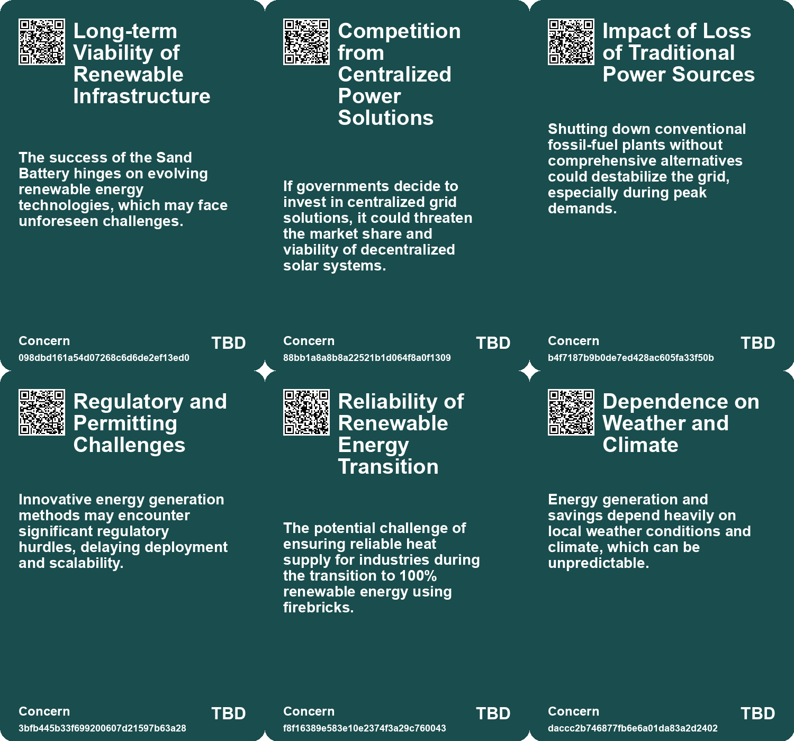
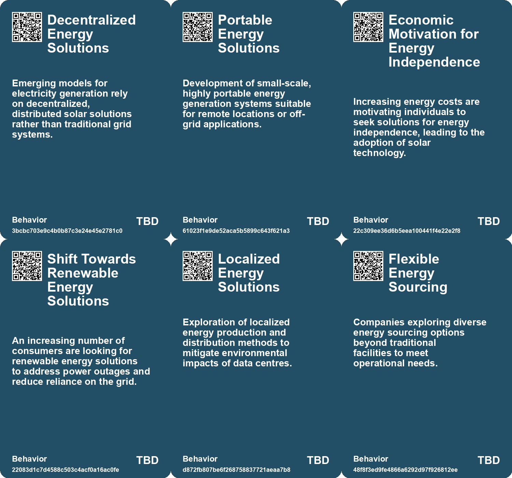
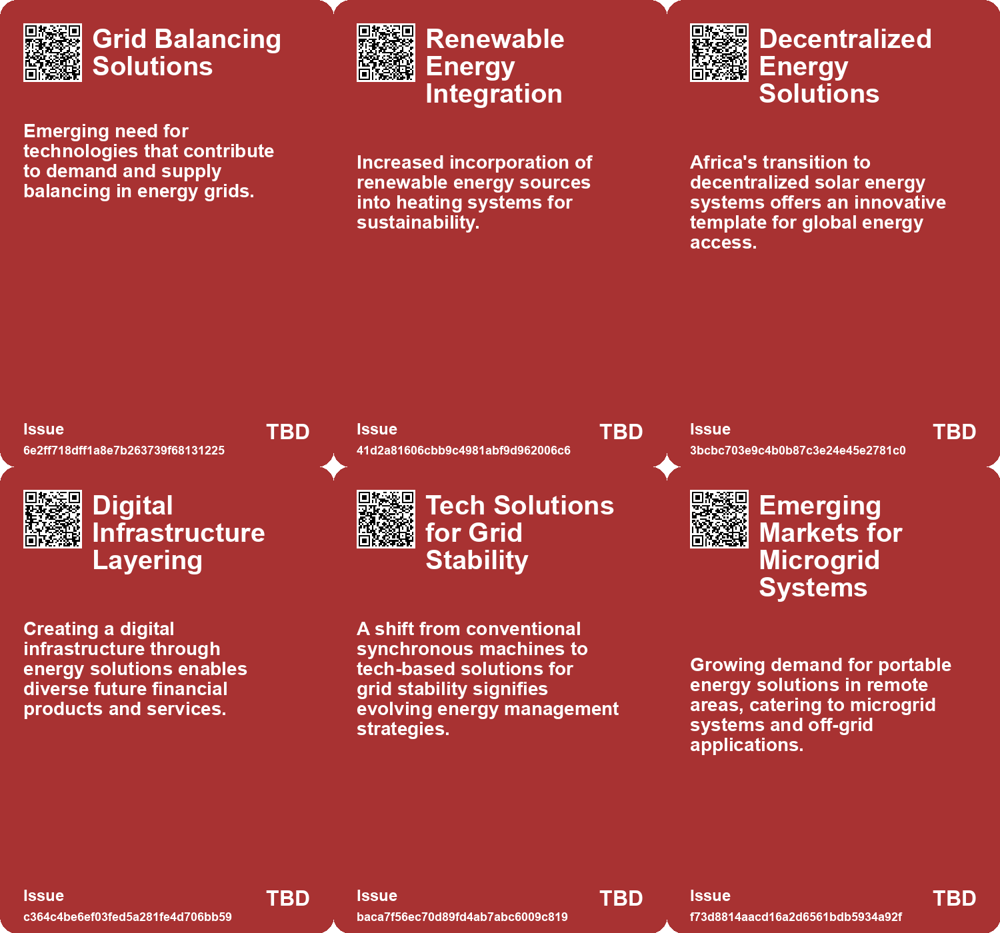
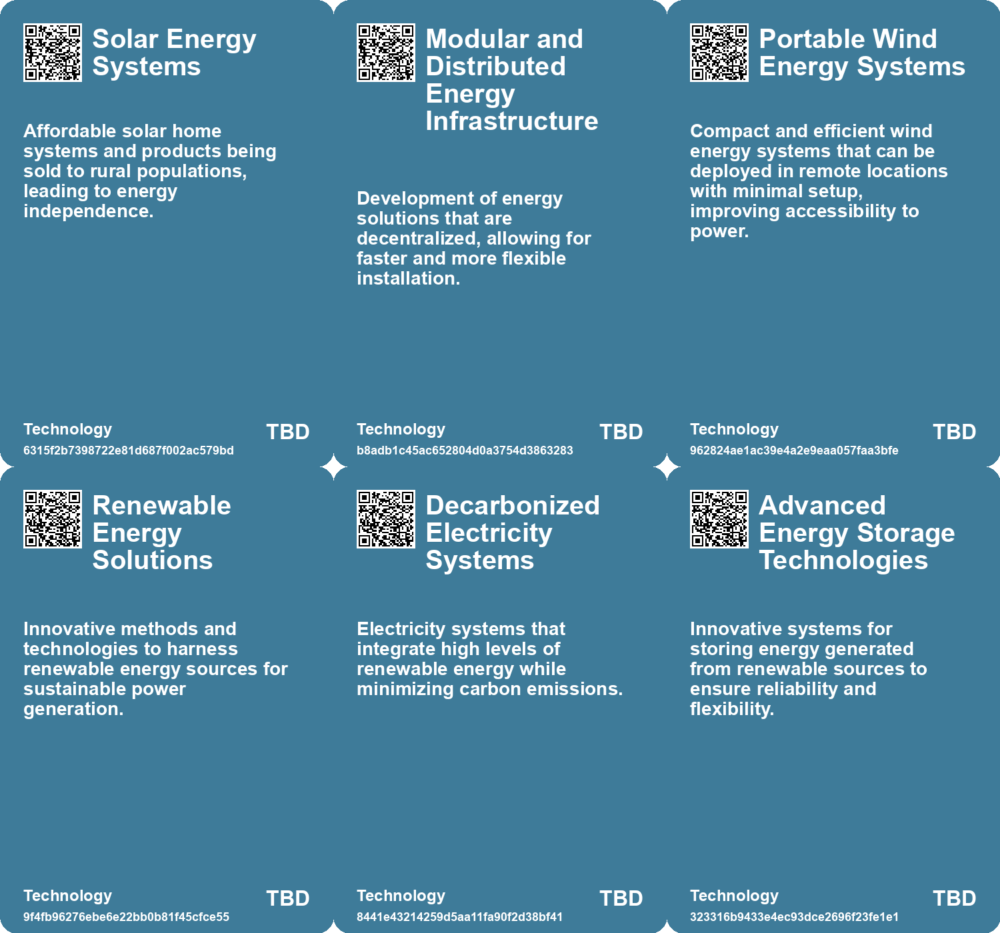

# *Topic*: Decentralized Energy Solutions

# Summary

The energy landscape is undergoing significant transformation, driven by advancements in renewable technologies and the urgent need for sustainable solutions. Solar energy continues to lead this shift, particularly in regions like Sub-Saharan Africa, where innovative financing models such as Pay-As-You-Go are making solar products accessible to millions. In the European Union, solar power has become the largest source of electricity, surpassing traditional energy sources like coal and nuclear. This growth is accompanied by a push for increased renewable generation, with countries like Denmark leading the way.

However, the reliance on imported solar panels from China raises concerns about energy security and supply chain vulnerabilities. The EU's energy strategy is also influenced by geopolitical factors, particularly the need to reduce dependency on Russian gas. As the region aims for a fossil-free grid by 2025, the integration of wind energy and other renewables is essential, though challenges remain in meeting ambitious capacity targets.

In the tech sector, companies like Meta and Google are exploring nuclear power as a solution to their growing energy demands. Meta's initiative to develop nuclear power plants reflects a broader trend among tech giants seeking reliable energy sources for their data centers. Meanwhile, the rise of data centers in regions like Ireland has sparked debate over their environmental impact and energy consumption. Efforts are underway to transition these facilities to renewable energy sources, addressing community concerns while ensuring their operational viability.

Innovative technologies are also emerging in the energy sector. Heimdall Power's collaboration with Meteomatics has enhanced power grid transmission capacity, while a new grid-scale battery in Scotland demonstrated its ability to stabilize the grid during generator failures. Windlift's unique kite-based energy generation method offers a cost-effective alternative to traditional wind turbines, showcasing the potential for new approaches in renewable energy.

Cybersecurity remains a critical issue as the energy sector becomes increasingly digitized. The UK's energy infrastructure faces heightened threats, necessitating modern security measures to protect against cyberattacks. Similarly, vulnerabilities in solar energy monitoring systems expose them to potential exploitation, highlighting the need for robust security protocols.

Water scarcity is another pressing concern, particularly for data centers that rely heavily on water for cooling. Companies are implementing strategies to reduce water consumption, with Microsoft aiming to achieve "water positive" status by 2030. Innovative solutions, such as a solar-powered desalination system developed by MIT engineers, aim to provide clean water to communities facing increasing salinity in groundwater.

As countries like Sweden pivot towards nuclear energy to achieve a fossil fuel-free future, the focus on sustainable energy solutions continues to grow. The collaboration between Polar Night Energy and Lahti Energia in Finland exemplifies efforts to reduce fossil fuel emissions through innovative thermal energy storage technologies. The ongoing evolution of the energy sector reflects a collective commitment to addressing climate challenges and ensuring a sustainable future.

# Seeds

|    | name                                           | description                                                                                | change                                                                                                     | 10-year                                                                                                  | driving-force                                                                                               |
|---:|:-----------------------------------------------|:-------------------------------------------------------------------------------------------|:-----------------------------------------------------------------------------------------------------------|:---------------------------------------------------------------------------------------------------------|:------------------------------------------------------------------------------------------------------------|
|  0 | Scaling Renewable Heating Solutions            | Large-scale projects demonstrating viability of renewable thermal energy systems.          | Scaling up thermal energy storage from smaller projects to larger district heating networks.               | Large-scale renewables could dominate urban energy systems, enhancing efficiency and sustainability.     | Advances in technology and funding for renewable infrastructure promoting larger projects.                  |
|  1 | Digital Infrastructure Layer Creation          | Solar energy systems are building a digital infrastructure for further financial services. | Emergence of holistic systems combining energy and financial services for consumers.                       | Enhanced access to various economic opportunities through a single infrastructure model.                 | The increasing need for integrated services in developing markets to drive economic growth.                 |
|  2 | Integration of OT and IT                       | Increasing digital transformation creates complexities in securing energy systems.         | From isolated operational technologies to interconnected systems requiring cohesive security.              | Shift toward integrated cybersecurity measures that address both physical and digital vulnerabilities.   | Push for efficiency through technology integration drives the demand for cohesive cybersecurity strategies. |
|  3 | Cost Reduction in Renewable Energy             | Innovative technologies are driving down costs in energy production.                       | Transition from expensive traditional energy sources to more affordable renewable options.                 | Renewable energy will become the most cost-effective energy source globally, displacing fossil fuels.    | The urgent need to combat climate change and reduce energy costs.                                           |
|  4 | Scalability of Renewable Technologies          | Smaller, scalable renewable technology solutions are gaining traction.                     | From large, fixed infrastructure to smaller, adaptable energy systems usable anywhere.                     | Scalable technologies will allow for energy generation in previously unreachable environments.           | The growing need for adaptability in energy solutions as demand varies geographically.                      |
|  5 | Potential Market for Energy Bundling           | Tech companies may venture into energy markets, offering bundled services.                 | A shift from traditional tech services to integrated energy solutions for consumers.                       | Consumers may receive bundled services including internet and electricity, changing market dynamics.     | The convergence of technology and energy sectors in response to consumer needs.                             |
|  6 | Safety Concerns with Home Energy Solutions     | Growing concerns about the safety of integrating home energy systems with the grid.        | Transition from traditional safety perceptions to a need for better safety protocols for new technologies. | Enhanced safety standards and regulations for home energy systems to protect consumers and workers.      | Rising safety concerns and regulatory scrutiny push for better practices in home energy management.         |
|  7 | Market for Energy Storage Solutions            | Emerging demand for efficient battery storage solutions in residential settings.           | From reliance on the grid to increased use of home battery systems for energy storage.                     | Widespread adoption of home battery systems could change the landscape of residential energy management. | The quest for energy independence and resilience drives the demand for effective storage solutions.         |
|  8 | Rise of energy communities                     | Increasing popularity of energy communities leveraging nearby solar installations.         | From isolated energy consumption to collaborative energy generation among neighbors.                       | In the future, energy communities may dominate urban energy solutions, enhancing local sustainability.   | Desire for self-sufficiency and reduced dependence on centralized energy sources.                           |
|  9 | Increased awareness of energy self-sufficiency | Growing recognition of the need for cities to generate their own electricity.              | From dependence on centralized energy systems to a focus on localized energy production.                   | Urban areas may evolve to be energy self-sufficient, reducing reliance on external sources.              | The urgency of climate change and the need for sustainable energy practices.                                |

# Concerns

|    | name                                            | description                                                                                                                                     |
|---:|:------------------------------------------------|:------------------------------------------------------------------------------------------------------------------------------------------------|
|  0 | Long-term Viability of Renewable Infrastructure | The success of the Sand Battery hinges on evolving renewable energy technologies, which may face unforeseen challenges.                         |
|  1 | Competition from Centralized Power Solutions    | If governments decide to invest in centralized grid solutions, it could threaten the market share and viability of decentralized solar systems. |
|  2 | Impact of Loss of Traditional Power Sources     | Shutting down conventional fossil-fuel plants without comprehensive alternatives could destabilize the grid, especially during peak demands.    |
|  3 | Regulatory and Permitting Challenges            | Innovative energy generation methods may encounter significant regulatory hurdles, delaying deployment and scalability.                         |
|  4 | Reliability of Renewable Energy Transition      | The potential challenge of ensuring reliable heat supply for industries during the transition to 100% renewable energy using firebricks.        |
|  5 | Dependence on Weather and Climate               | Energy generation and savings depend heavily on local weather conditions and climate, which can be unpredictable.                               |
|  6 | Need for Robust Energy Systems                  | Future energy systems must adapt to high demand from data centres while achieving decarbonization goals, indicating systemic vulnerabilities.   |
|  7 | Energy Dependency Risks                         | Cities heavily reliant on centralized energy systems may be vulnerable to disruptions in electricity supply, especially during crises.          |
|  8 | Market Monopoly Concerns                        | Large energy companies may resist decentralized solar power models that threaten their traditional business models.                             |
|  9 | Consumer Adoption of New Technologies           | The success of GM Energy depends on consumer willingness to adopt new energy solutions, which may vary widely.                                  |

# Cards

## Concerns

## Behaviors

## Issue

## Technology

# Links

* [Sweden's Energy Crisis: Government Measures and EU Market Challenges Amid Rising Prices](https://futures.kghosh.me/d0c0ac935a4108e752daca80749387a8)
* [Google Partners with Kairos Power for Nuclear Energy to Power AI Data Centers](https://futures.kghosh.me/f9ef1fc984ab921e2f13d2c53db0a066)
* [Meta Seeks Nuclear Power Developers to Expand Energy Capacity for Data Centers](https://futures.kghosh.me/e343e1af0d512589be28a04f22739938)
* [Balancing Economic Growth and Environmental Responsibility: The Role of Data Centres in Ireland](https://futures.kghosh.me/fe8c9a54a3dbc61b0abc367d14524f53)
* [Innovation in Scotland: The Role of Grid-Scale Batteries in Stabilizing Energy Grids](https://futures.kghosh.me/ece3bd8007e38ba75470c88fcdafd4d3)
* [Extreme Heat and Rising Air Conditioning Demand: The Urgent Need for Energy Efficiency Solutions](https://futures.kghosh.me/0ca38b65b97d6235d3b3dbb3efdb0c21)
* [Heimdall Power and Meteomatics Boost Power Grid Capacity by 30% Through Innovative Technology](https://futures.kghosh.me/ac1dca3c524bdd7aa99f29fd255c7c41)
* [Spain Embraces DIY Solar Panels: A New Trend in Urban Energy Self-Sufficiency](https://futures.kghosh.me/6269bb1ff221e959b7b02d367d989ab2)
* [Impact of Drought on Data Centers and Water Usage in the U.S.](https://futures.kghosh.me/9ac7942b1052f8ef229db18aae468c4d)
* [Safeguarding the UK's Energy Sector: The Cybersecurity Challenge in an AI Era](https://futures.kghosh.me/58871ce6d54ebbaf1ac529fa1376eb2a)
* [EU Solar Power Surpasses Coal Amid Energy Transition Challenges and Geopolitical Dynamics](https://futures.kghosh.me/a69bf796514b025ebe64b26e2fd8657e)
* [Polar Night Energy and Lahti Energia Collaborate on a Major Sand Battery Project in Finland](https://futures.kghosh.me/0251d758d212293a473ce2ff6e3ab1ae)
* [Sweden Transitions to Nuclear Energy, Abandoning 100% Renewable Goal](https://futures.kghosh.me/b9666c2bcb5131de1b2411be30bb4b44)
* [Exploring the Environmental Impact and Challenges of Electric Vehicles](https://futures.kghosh.me/72ff11f7187edcfd9898c6484e429e6e)
* [Transformative Impact of Solar Energy Solutions in Africa: A New Infrastructure Paradigm](https://futures.kghosh.me/530d83cbb403ce78a442fbf71cacb512)
* [General Motors Launches GM Energy to Compete in Renewable Energy Market](https://futures.kghosh.me/db277b1d574be61a29e5d0e818b02268)
* [Maximizing Solar Energy Use at Home with EcoFlow's PowerStream System](https://futures.kghosh.me/3a0ad892ff7df4cb7345acc2449c51b9)
* [Electric Vehicles Surge Ahead Amid Cybersecurity Concerns and Research Innovations](https://futures.kghosh.me/aed93d4ebe969eabe23df9935bdb4cb8)
* [Transforming Water Utilities: Addressing Security and Sustainability Challenges through Innovation](https://futures.kghosh.me/d54442ea6fe7853d0f8674688c9b7064)
* [Stanford Study Reveals Firebricks as Affordable Solution for Renewable Energy Transition](https://futures.kghosh.me/a0f7b16254dcd0ee2c5a2f7fc051e7e0)
* [Windlift's Innovative Kite Technology Revolutionizes Electricity Generation from Wind Energy](https://futures.kghosh.me/175db8dd3eba9b2c13321d58a9aac643)
* [Revolutionary Ultra-Thin Solar Technology Promises Efficient Energy Generation Without Silicon Panels](https://futures.kghosh.me/121994a09192673002c6987ca6b78f77)
* [MIT Engineers Develop Innovative Solar-Powered Desalination System for Clean Water](https://futures.kghosh.me/66f16672fad50ae27b2625c86d101b01)
* [Publicly Accessible PV Monitoring Systems Pose Cybersecurity Risks](https://futures.kghosh.me/3ac657f7b32d24bb43bddca058e2db25)
* [EU's Electricity from Renewables Reaches 54% in Q2 2025, Led by Solar Power](https://futures.kghosh.me/239a1e4701a874e097e611adcb0f6c9b)