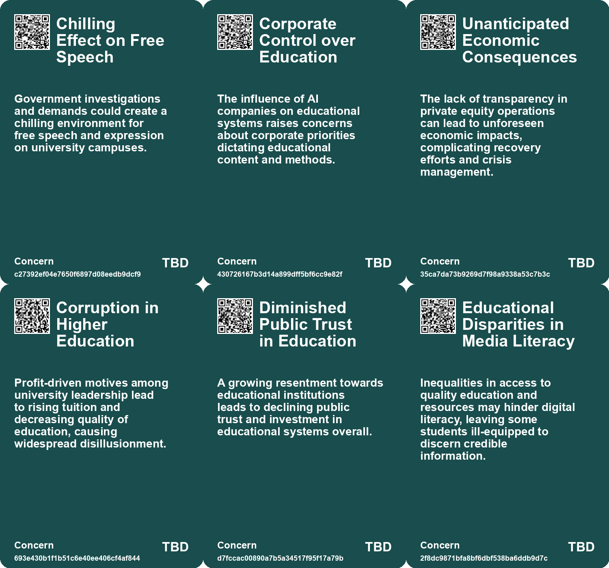
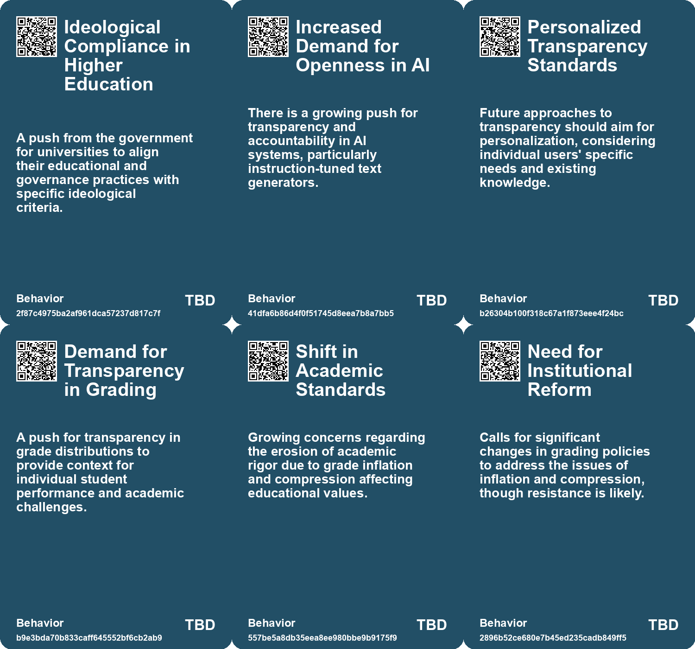
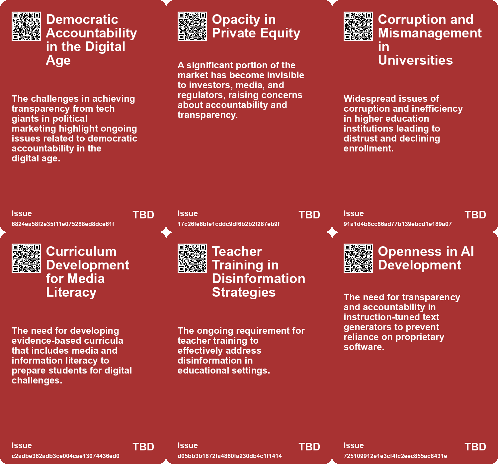
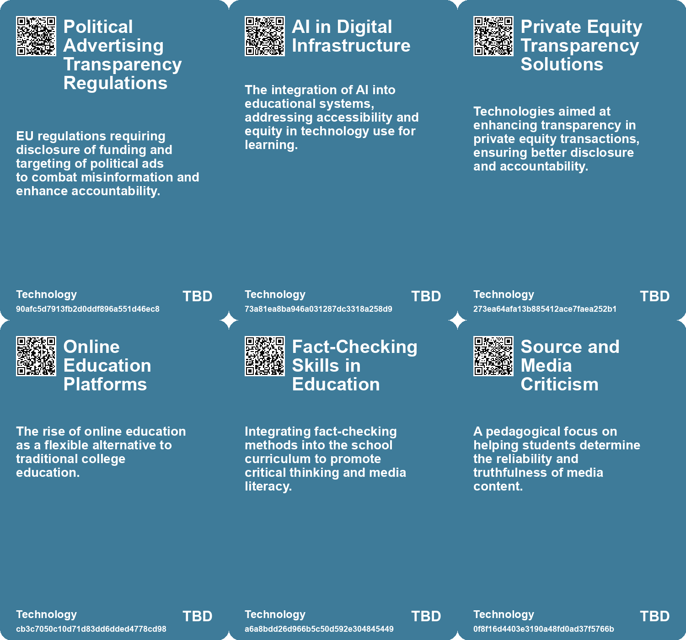

# *Topic*: Demand for Transparency in Ed

# Summary

The integration of artificial intelligence in various sectors is reshaping education, governance, and corporate practices. In education, AI tools like personalized tutors and automated lesson planning are becoming prevalent. However, this shift raises concerns about intellectual decline among students, as reliance on AI may diminish critical thinking and genuine learning. The phenomenon, termed the "Homework Apocalypse," highlights the need for educators to rethink traditional assignments in light of AI capabilities.

Governments are also leveraging AI to enhance efficiency and productivity. The U.S. Internal Revenue Service exemplifies how technology upgrades can streamline processes and reduce costs. Life event-based service delivery and data integration are key strategies driving this transformation. Yet, challenges remain, including the need for skilled personnel to implement AI effectively.

The issue of transparency in technology, particularly regarding artificial intelligence, is gaining attention. The European Union is introducing a new code of practice aimed at enhancing transparency for AI companies, focusing on copyright protections and public safety. This initiative follows the EU AI Act, which seeks to ensure that companies disclose their training data and model design choices. However, companies like Meta are pushing back against these regulations, citing excessive complexity and legal uncertainty.

Concerns about corporate accountability are also rising, particularly in the context of private equity. The decline in publicly traded companies in the U.S. is attributed to private equity acquisitions, which create an opaque economy and hinder transparency. This trend raises alarms about potential corporate wrongdoing and systemic risks, echoing historical precedents of unchecked corporate fraud.

In higher education, issues of grade inflation and compression are under scrutiny. Harvard University faces criticism for the rising average GPAs and the impact of grade compression on students' academic choices. Proposals for releasing annual grade distributions and contextualizing transcripts aim to address these challenges, emphasizing the need for a committee to tackle grade compression.

The landscape of adult literacy is also concerning, with approximately 130 million adults in the U.S. possessing low literacy skills. This issue affects daily life and economic success, yet adult literacy programs are underfunded and attendance is declining. Investment in these programs is crucial to mitigate the societal impacts of low literacy rates.

Finally, the intersection of corporate neutrality and political discourse is becoming increasingly relevant. Corporate leaders are advised to adopt a neutral stance on political issues to avoid alienating stakeholders. This approach mirrors challenges faced by educational institutions regarding free expression and political engagement, suggesting a need for formal policies guiding corporate leaders in their public statements.

These themes reflect a complex interplay of technology, education, corporate accountability, and societal challenges, highlighting the need for thoughtful approaches to navigate the evolving landscape.

# Seeds

|    | name                                       | description                                                                                                        | change                                                                                                  | 10-year                                                                                                                | driving-force                                                                                              |
|---:|:-------------------------------------------|:-------------------------------------------------------------------------------------------------------------------|:--------------------------------------------------------------------------------------------------------|:-----------------------------------------------------------------------------------------------------------------------|:-----------------------------------------------------------------------------------------------------------|
|  0 | Concerns Over Data Transparency            | Debates over the adequacy of ad review systems and their transparency.                                             | Move towards more conditional and scrutinized ad placements and reviews.                                | Systems may be developed or refined for improved accuracy in detecting political ads.                                  | Demand for transparency and accuracy in ad targeting within digital platforms.                             |
|  1 | Adaptation of Curriculum for Fact-Checking | Curriculum adaptations to include fact-checking methodologies for students.                                        | From rote learning to active engagement in verifying information.                                       | Students may develop lifelong skills in critical thinking and skepticism towards media.                                | Need for youth to navigate complex information landscapes effectively.                                     |
|  2 | Teacher Training in Media Literacy         | Need for comprehensive teacher training on media literacy initiatives.                                             | From traditional teacher training to specialized training in digital literacy.                          | Teachers globally may become equipped with skills to teach critical media evaluation.                                  | Demand for effective educational practices to combat misinformation highlights teacher training.           |
|  3 | Evidence-Based Curriculum Development      | Growing importance of evidence-based strategies in curriculum development.                                         | Transition from anecdotal to data-driven approaches in education.                                       | Curricula may become increasingly evidence-based, enhancing their effectiveness and relevance.                         | Demand for accountability and effectiveness in educational methods.                                        |
|  4 | Emerging Transparency Standards            | Best practices for transparency requirements under the EU AI Act are evolving based on stakeholder feedback.       | From vague transparency requirements to clearly defined best practices for AI systems.                  | A standardized framework for transparency in AI systems, tailored to various use cases and audiences.                  | The increasing demand for accountability and trust in AI technologies among users and regulators.          |
|  5 | Personalized Transparency                  | The concept of personalized transparency based on individual needs is gaining recognition.                         | From generic transparency measures to personalized approaches catering to user needs.                   | Transparency measures that dynamically adapt to users' knowledge and requirements, fostering trust.                    | The expectation of tailored experiences in digital interactions, driven by user-centric design principles. |
|  6 | New Use Cases for AI Regulation            | Emerging use cases such as emotion recognition and synthetic media require additional transparency considerations. | From limited use case testing to a broader scope of AI applications in regulatory frameworks.           | Comprehensive transparency regulations that cover a wider array of AI applications, including emerging technologies.   | Rapid advancements in AI technologies prompting the need for updated and relevant regulatory frameworks.   |
|  7 | Grade Inflation Awareness                  | Growing awareness and criticism of grade inflation at prestigious universities like Harvard.                       | Transitioning from acceptance of grade inflation to questioning its implications on academic integrity. | In ten years, universities may adopt stricter grading policies and transparency to combat inflation.                   | Pressure from employers and society for genuine academic achievement and integrity in education.           |
|  8 | Demand for Transparency in Grading         | Calls for universities to publicly disclose grade distributions to provide context to GPAs.                        | Shift from opaque grading practices to greater transparency and accountability in grading.              | In ten years, transparency in grading may be standard practice, allowing for better assessment of student performance. | Increased scrutiny from employers and the public regarding the validity of academic credentials.           |
|  9 | Potential for Educational Reform           | The need for reform in grading systems to address issues of inflation and compression is being discussed.          | From traditional grading systems to potential reforms aimed at enhancing educational integrity.         | In the next decade, we may see innovative grading practices that promote genuine learning and assessment.              | The evolving landscape of education demands more effective and meaningful assessment methods.              |

# Concerns

|    | name                                      | description                                                                                                                                                |
|---:|:------------------------------------------|:-----------------------------------------------------------------------------------------------------------------------------------------------------------|
|  0 | Chilling Effect on Free Speech            | Government investigations and demands could create a chilling environment for free speech and expression on university campuses.                           |
|  1 | Corporate Control over Education          | The influence of AI companies on educational systems raises concerns about corporate priorities dictating educational content and methods.                 |
|  2 | Unanticipated Economic Consequences       | The lack of transparency in private equity operations can lead to unforeseen economic impacts, complicating recovery efforts and crisis management.        |
|  3 | Corruption in Higher Education            | Profit-driven motives among university leadership lead to rising tuition and decreasing quality of education, causing widespread disillusionment.          |
|  4 | Diminished Public Trust in Education      | A growing resentment towards educational institutions leads to declining public trust and investment in educational systems overall.                       |
|  5 | Educational Disparities in Media Literacy | Inequalities in access to quality education and resources may hinder digital literacy, leaving some students ill-equipped to discern credible information. |
|  6 | Relative Nature of Transparency           | Understanding of transparency varies by individual, complicating the establishment of universally effective transparency measures.                         |
|  7 | Difficulty in Assessing Student Work      | As AI-generated content becomes harder to detect, educators face challenges in fairly evaluating student submissions.                                      |
|  8 | Need for Clear AI Policies                | Educators require clear policies on acceptable AI use to maintain academic integrity and encourage honest work.                                            |
|  9 | Overwhelming Citizen Expectations         | As technology improves, so do public expectations, which may lead to dissatisfaction if agencies cannot meet rising demands.                               |

# Cards

## Concerns

## Behaviors

## Issue

## Technology

# Links

* [Key Takeaways from OSPOS for Good 2024: The Role of Open Source in Sustainable Development](https://futures.kghosh.me/8dc0df9ec066b8cd1bca120998fc0f90)
* [Preparing for the Homework Apocalypse: AI's Impact on Education and Assignments](https://futures.kghosh.me/233c5bf90c64ceefb0cde33233c3fe6e)
* [Meta Halts Political Ads in EU to Avoid New Transparency Regulations](https://futures.kghosh.me/014ce3100d6fcc7d160362d608f5c6fe)
* [The Disruption of Education by AI: An Intellectual Crisis](https://futures.kghosh.me/9457c5541dba02968735056f18b53dc3)
* [Finland's Innovative Approach to Combating Fake News Through Education](https://futures.kghosh.me/ad15fbe04bbe50ec3436c61403d19fca)
* [Unlocking the Potential of Local Data in UK Government Devolution for Enhanced Services](https://futures.kghosh.me/715753b68e3f5ba36be643d1ded0de93)
* [The Decline of Higher Education: Generation Z's Shift Away from College](https://futures.kghosh.me/d64c4666be4d84f147f57055b74daa32)
* [FTC Investigates Major Firms Over Surveillance Pricing Practices and Consumer Privacy Concerns](https://futures.kghosh.me/ff0593173e75f7c7e19b150fa4081609)
* [Exploring the Future of AI in Knowledge Ecosystems and Global Challenges](https://futures.kghosh.me/a9266018b458295480a07167310458a9)
* [Global Government Reforms: Advancements in Efficiency through Digital Transformation and AI](https://futures.kghosh.me/3f295c6c0c9af1ecd24bfa22b6ef6b47)
* [Evaluating Openness and Accountability in Instruction-Tuned Text Generators: A Comprehensive Review](https://futures.kghosh.me/dad9dbd97cc50604963911f16fbb27aa)
* [cOAlition S Proposes Bold Changes to Revolutionize Research Publishing System](https://futures.kghosh.me/02f2ec8eec579967c3b2a336f34ac715)
* [Five Emerging Trends Transforming Business in the Coming Year](https://futures.kghosh.me/55bac03899915f25bf0b47fa4342472c)
* [The Crisis of Low Literacy in America: Funding Disparities and Economic Impacts](https://futures.kghosh.me/0b19a85d823e25919d360051c2e63a21)
* [The Case for Corporate Neutrality: Lessons from Higher Education on Political Silence](https://futures.kghosh.me/3a1dd7fd549b2cb6e4e12aded772585c)
* [U.S. Lifts Chip Design Export Ban on China for Rare Earth Material Compromise](https://futures.kghosh.me/f1b541cab285959d215ad40c3a16ac94)
* [Exploring the Transformative Impact of AI on Education and Children's Learning Experiences](https://futures.kghosh.me/adf886a1b9fd74281e0a43c3e7c70def)
* [Exploring Grade Inflation and Compression at Harvard: Challenges to Academic Risk-Taking](https://futures.kghosh.me/add3440e907f0e4e9cbb7fbbdd544a90)
* [EU's New Code of Practice Aims to Enhance Transparency and Compliance in AI Industry](https://futures.kghosh.me/b4018274e2792c9e4e374ad3ce424478)
* [Best Practices for Transparency in AI Under the EU AI Act: Insights from a Prototyping Project](https://futures.kghosh.me/d88cbb54d9e2d462585c4d515dd32067)
* [Future of Work: Embracing Opportunities and Adapting to Change Over the Next 50 Years](https://futures.kghosh.me/56ddb45deabcdc8b707c7647270e101d)
* [Trump Administration Nears $500 Million Deal with Harvard Amid Controversial Policies and Protests](https://futures.kghosh.me/f4837674f8eb8f9ba3fba1dd282670b7)
* [The Rise of Private Equity and Its Threat to Economic Transparency in the U.S.](https://futures.kghosh.me/86944a8ff63c9744c1d3cfb858bae3da)
* [Exploring Cookies, Supply Chains, and Future Challenges in Technology and Consumption](https://futures.kghosh.me/fa27e27bdec01712d582ab0f61c95bac)