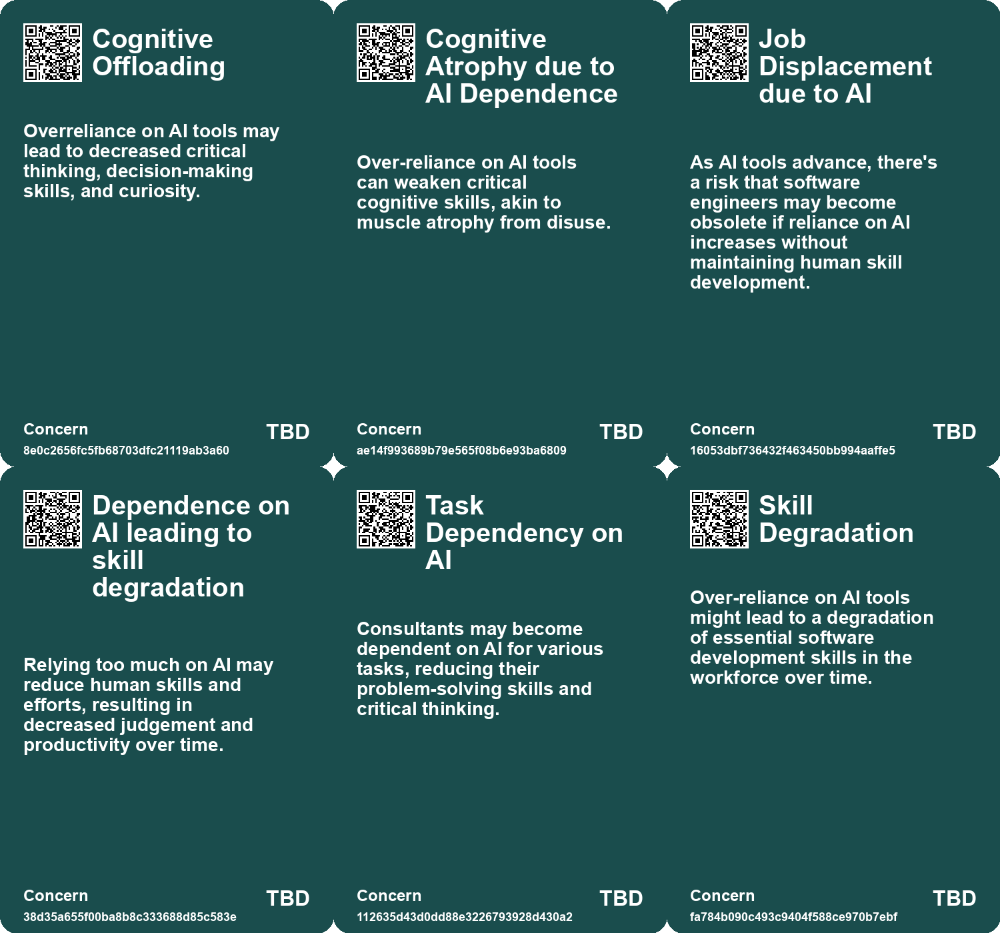
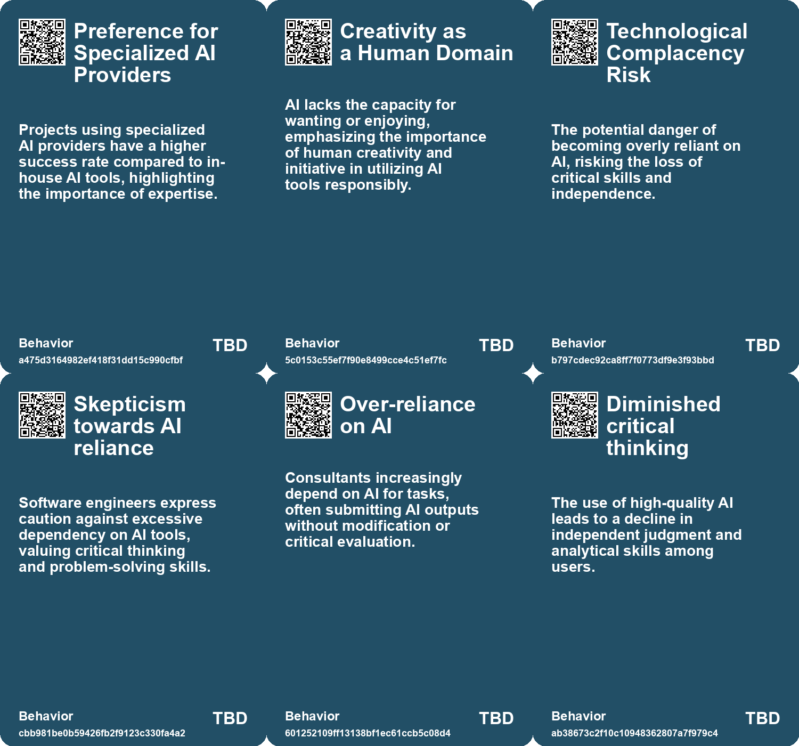
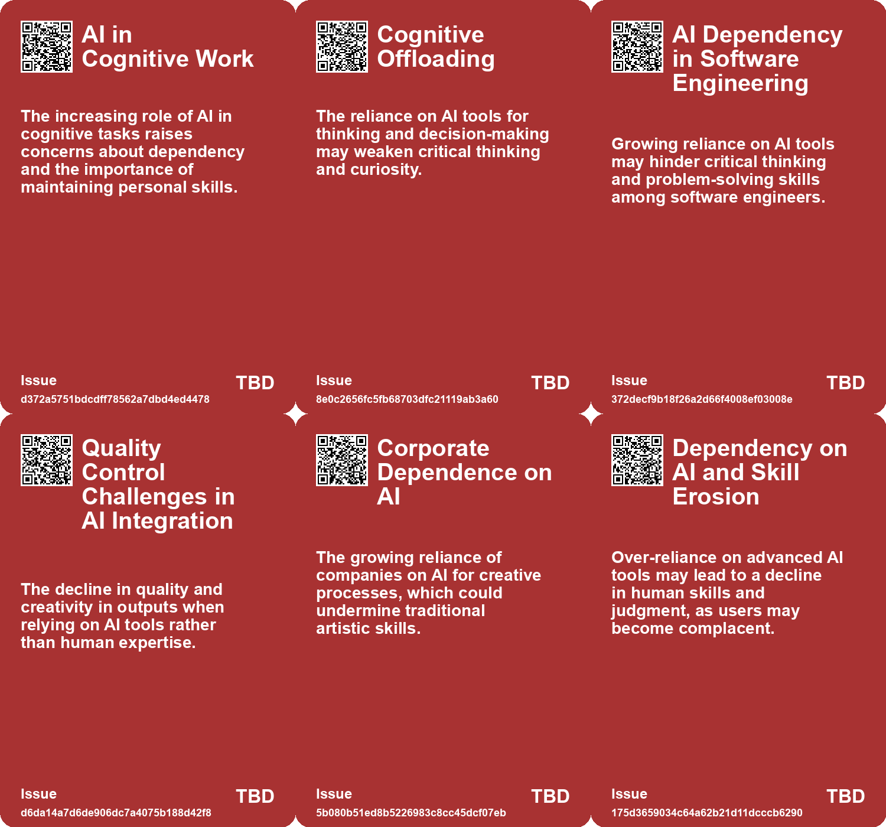
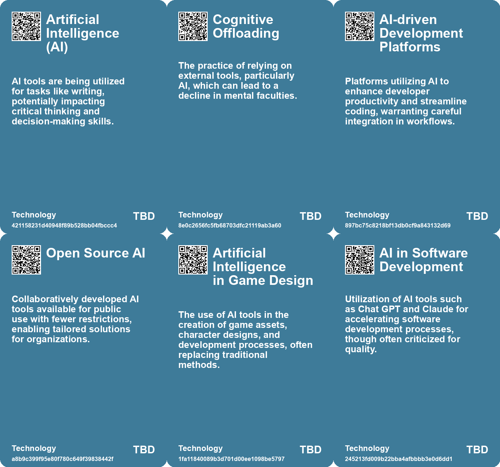

# *Topic*: Dependence on AI Tools

# Summary

The integration of artificial intelligence (AI) into various sectors is reshaping the landscape of work, creativity, and productivity. A significant concern is the potential for AI to replace human skills, particularly in engineering and creative fields. Many professionals express skepticism about over-reliance on AI, fearing it may diminish critical thinking and problem-solving abilities. The call for a balance between utilizing AI as a tool and maintaining essential skills is echoed across discussions, emphasizing the importance of personal growth through challenges.

Despite the promise of AI to enhance productivity, studies reveal that a large percentage of generative AI implementations in enterprises fail to yield positive financial outcomes. Poor integration with existing workflows is often cited as a primary reason for these failures. Successful AI projects tend to focus on specific pain points and involve collaboration with external providers. This highlights the need for organizations to rethink their approach to AI, ensuring that employees are engaged in the process and that fears surrounding AI usage are addressed.

The cognitive impact of AI tools is another critical theme. While AI can enhance efficiency in tasks such as writing and customer support, there is a growing concern about cognitive offloading, where reliance on AI leads to diminished curiosity and critical thinking. Studies suggest that overuse of AI tools may contribute to cognitive decline, raising questions about the long-term effects on learning and skill development. The importance of maintaining mental activity and skepticism towards AI is emphasized, as individuals must resist the convenience of AI for deeper learning.

The job market is also undergoing significant changes due to AI. Reports indicate rising job losses attributed to AI, with many business leaders predicting further layoffs. However, experts argue that while AI may displace certain roles, it also creates opportunities for restructuring and redefining jobs. The concept of "human-centered AI" is gaining traction, focusing on enhancing collaboration rather than outright replacement. Continuous skill development is essential for professionals to navigate the evolving landscape and mitigate the impact of AI on their careers.

The ethical implications of AI adoption are increasingly scrutinized. Concerns about bias, data quality, and the risks associated with scaling AI technologies are prevalent. The need for Explainable AI (XAI) is highlighted as a means to foster trust and transparency in AI systems. Organizations are encouraged to prioritize human values and creativity over mere efficiency, ensuring that ethical considerations are integrated into AI development cycles.

In the creative industries, AI's rise has sparked both excitement and apprehension. Many artists and developers express frustration over AI technologies that threaten traditional roles and undermine creative processes. The reliance on AI for efficiency raises ethical questions, particularly regarding the consent of artists in using AI-generated content. Despite the challenges, there is a strong resistance among creatives advocating for the value of human creativity in the face of AI encroachment.

As AI continues to evolve, the future of work will likely involve a shift in how individuals interact with technology. Personal AIs may mediate our interactions with applications, fundamentally changing user experiences. This shift will require businesses to adapt their strategies, focusing on the quality of data and the effectiveness of their APIs to remain competitive in an AI-driven world.

The ongoing discourse surrounding AI reflects a complex interplay of opportunity and challenge. As organizations and individuals navigate this landscape, the emphasis on ethical practices, skill development, and the preservation of human creativity will be crucial in shaping a future where AI complements rather than replaces human capabilities.

# Seeds

|    | name                               | description                                                                                          | change                                                                                              | 10-year                                                                                                       | driving-force                                                                                                     |
|---:|:-----------------------------------|:-----------------------------------------------------------------------------------------------------|:----------------------------------------------------------------------------------------------------|:--------------------------------------------------------------------------------------------------------------|:------------------------------------------------------------------------------------------------------------------|
|  0 | Cognitive Atrophy                  | Over-reliance on AI tools is leading to a gradual decline in mental faculties.                       | Shift from active mental engagement to passive reliance on AI tools for cognitive tasks.            | Society may face a significant deterioration in critical thinking and problem-solving skills.                 | The growing convenience and efficiency provided by AI tools encourages increased dependence.                      |
|  1 | Cognitive Offloading               | Frequent use of AI tools reduces effort required for thinking and problem-solving.                   | Move from active cognitive engagement to habitual dependence on AI for tasks.                       | Workplaces may see a decline in employee creativity and critical analysis capabilities.                       | The need for efficiency and lower cognitive effort drives the adoption of AI solutions.                           |
|  2 | Deterioration of Critical Thinking | Students increasingly rely on AI tools like ChatGPT for learning.                                    | Shift from developed critical thinking skills to dependency on AI solutions.                        | An education system dominated by AI reliance may create a generation lacking analytical skills.               | Widespread access to AI tools without proper educational frameworks.                                              |
|  3 | Emerging Culture of AI Dependency  | An increasing tendency to rely on AI solutions for coding tasks among engineers.                     | Shift from hands-on coding and problem-solving to dependency on AI outputs.                         | Engineers may lose some fundamental coding skills, leading to challenges in innovation and critical thinking. | The allure and convenience of AI tools that promise efficiency in coding tasks.                                   |
|  4 | Adoption of Open Source AI         | Increasing reliance on open source AI tools by enterprises, reflecting a significant industry shift. | Shift from primarily proprietary AI solutions to a balanced mix including open source technologies. | In 10 years, open source AI may dominate enterprise AI solutions, altering the competitive landscape.         | The need for cost efficiency and customization drives enterprises towards open source AI technologies.            |
|  5 | AI Impact on Game Development      | The increasing reliance on AI tools in video game development is reshaping traditional workflows.    | Shift from human creativity and iterative processes to AI-generated content and quick fixes.        | In 10 years, AI may dominate the creative process, with human artists relegated to oversight roles.           | The pressure for increased efficiency and cost-cutting in the competitive gaming industry.                        |
|  6 | Workplace Dynamics Altered by AI   | Team dynamics and workflows are being fundamentally altered by the imposition of AI tools.           | Shift from collaborative creativity to reliance on AI-generated outputs and diminished roles.       | In ten years, workplace cultures may be heavily influenced by AI use, impacting creativity and collaboration. | Corporate eagerness to adopt AI solutions to modernize and cut costs shapes workplace dynamics.                   |
|  7 | AI Collaboration with Developers   | Current AI tools are acting as assistants to developers rather than replacements.                    | Shifting from a view of AI as a replacement to seeing it as a collaborative tool for developers.    | In the future, developers may work alongside advanced AI, enhancing their productivity and creativity.        | The necessity for developers to focus on complex tasks while utilizing AI for routine work fosters collaboration. |
|  8 | Over-reliance on AI                | Consultants using AI tend to depend too much on it for tasks.                                        | Shift from independent problem-solving to reliance on AI for answers.                               | Human roles may evolve to become less analytical and more reliant on AI outputs.                              | The increasing accessibility and effectiveness of AI tools in professional settings.                              |
|  9 | AI Literacy as a Necessity         | Increasing need for individuals to understand and use AI tools effectively.                          | Shift from ignorance of AI to a requirement for AI literacy in personal and professional settings.  | In 10 years, AI literacy will be as fundamental as digital literacy for all individuals.                      | Rapid advancements in AI technology necessitating understanding for effective use.                                |

# Concerns

|    | name                                          | description                                                                                                                                              |
|---:|:----------------------------------------------|:---------------------------------------------------------------------------------------------------------------------------------------------------------|
|  0 | Cognitive Offloading                          | Overreliance on AI tools may lead to decreased critical thinking, decision-making skills, and curiosity.                                                 |
|  1 | Cognitive Atrophy due to AI Dependence        | Over-reliance on AI tools can weaken critical cognitive skills, akin to muscle atrophy from disuse.                                                      |
|  2 | Job Displacement due to AI                    | As AI tools advance, there's a risk that software engineers may become obsolete if reliance on AI increases without maintaining human skill development. |
|  3 | Dependence on AI leading to skill degradation | Relying too much on AI may reduce human skills and efforts, resulting in decreased judgement and productivity over time.                                 |
|  4 | Task Dependency on AI                         | Consultants may become dependent on AI for various tasks, reducing their problem-solving skills and critical thinking.                                   |
|  5 | Skill Degradation                             | Over-reliance on AI tools might lead to a degradation of essential software development skills in the workforce over time.                               |
|  6 | Over-reliance on AI                           | Consultants exhibited over-reliance on AI tools, leading to potential errors and diminished independent problem-solving skills.                          |
|  7 | Reduced learning opportunities                | Dependence on AI could hinder personal and professional growth, limiting opportunities for skill development and learning.                               |
|  8 | Dependence on AI                              | As AI integrates deeper into workflows, there’s a risk of humans becoming overly dependent on AI for decision-making and analysis.                       |
|  9 | Dependence on Technology                      | As reliance on AI tools grows, there is a risk of reduced human skills and critical thinking due to over-dependence on AI solutions.                     |

# Cards

## Concerns

## Behaviors

## Issue

## Technology

# Links

* [Rethinking the Role of AI: From Political Tool to Ethical Design Options](https://futures.kghosh.me/c25cae2b8d72e7634d591247d9ac96d2)
* [AI's Disruptive Presence in the Video Game Industry: Personal Experiences and Concerns](https://futures.kghosh.me/07654b65aaa32bbf290cfde69ddf3253)
* [Balancing AI Assistance and Personal Skill Development as We Enter 2026](https://futures.kghosh.me/90f97dd5051985535e179bd08233512b)
* [Navigating the Perils and Promises of AI in Software Engineering: A Cautionary Perspective](https://futures.kghosh.me/fa2616fcf26515676cb66de98b4891bf)
* [The Impact of Generative AI on Automation and Employment: Opportunities and Challenges Ahead](https://futures.kghosh.me/897ed4ea5ae6173e4397f1091ddb7e7e)
* [The Importance of Explainable AI: Building Trust in Artificial Intelligence for Organizations](https://futures.kghosh.me/afe2219279811b5905b43a7731e95da7)
* [The Rise of Augmented Humans: Embracing AI in a Transformative Era](https://futures.kghosh.me/a8f2b9b3c07bd0f1d91784ff8b5ee5fc)
* [The Impact of Generative AI and Autonomous Agents on Business Value Creation and Trust Issues](https://futures.kghosh.me/15d4ec180189ca1739398f516844cefb)
* [The Future of Software Development Amidst the Rise of AI and Automation](https://futures.kghosh.me/3699c5351d26e57924945e715d2345c5)
* [The Shift to AI-Mediated Interactions: Implications for Businesses and APIs](https://futures.kghosh.me/416560fac9bedd69aa678761b51406a2)
* [MIT Study Challenges AI Job Displacement Fears with Economic Viability Insights](https://futures.kghosh.me/89ee61cc0d9fa77ecb1eb4100622a53f)
* [The Cognitive Costs of AI: Are We Sacrificing Our Mental Abilities for Convenience?](https://futures.kghosh.me/09e7abde98ff0c5590320545c5b20679)
* [Exploring AI's Implications: Insights from a Discussion in New Zealand on Artificial Intelligence and Society](https://futures.kghosh.me/7bdbb32950c9d265f6ec455d964973fe)
* [The Impact of AI on Employee Workload and Burnout: A Global Study's Findings and Recommendations](https://futures.kghosh.me/24919a630ace2f95d7dc1ec6e455b419)
* [The Transformative Potential of AI: Revolutionizing Education, Healthcare, and Global Equity](https://futures.kghosh.me/2449c2fc4b8afc7e268db4987fa821e5)
* [MIT Study Reveals High Failure Rate of Enterprise AI Implementations Due to Poor Integration](https://futures.kghosh.me/a6a18a39971f1bcdb555339c05b4dbc5)
* [The Transformative Impact of AI on Productivity and Entrepreneurship in 2023](https://futures.kghosh.me/a40580730388900810b4496ff9891dc9)
* [The Impact of AI on Employment: Predictions, Layoffs, and the Future of Work](https://futures.kghosh.me/b0e031972e42be984d1309170155800e)
* [Exploring AI's Effect on Cognitive Skills and Learning Processes](https://futures.kghosh.me/950253f15955ca7be1cb2ebf244d0939)
* [Understanding the Real Risks of AI Beyond Superintelligence and Scalability](https://futures.kghosh.me/ff7f7a51f925c273449a8648a18b7df8)
* [The Impact of AI on Human Performance: A Study on Complacency and Skill Reduction](https://futures.kghosh.me/82d675e881c727c6bf2f35d6a78e72f6)
* [Navigating the Dilemma of AI Integration in Organizations: Embracing Secret Cyborgs for Innovation](https://futures.kghosh.me/c42a95f16678ed3834840d48f8e775a3)
* [Thriving in an AI Era: Embracing, Adapting, and Complementing Technology](https://futures.kghosh.me/23a3410059759ba4214235628d4ebd4b)
* [Exploring the Risks of Homogeneity in AI Generated Content and Its Impact on Creativity](https://futures.kghosh.me/9f228766187c6c10eeddbda5a6dbbe7b)
* [Exploring the Rise of Open Source AI in Enterprises: Key Findings and Trends](https://futures.kghosh.me/0abf112a6559f5a14e4db206af1db78a)
* [AI's Impact on Work: Insights from a Study on Consultants Using ChatGPT-4](https://futures.kghosh.me/c94f72ff677c7517a836417c1f1df620)
* [Examining the Effects of AI on Knowledge Worker Performance: A Study with Boston Consulting Group](https://futures.kghosh.me/c63bd059cb529b72b00ecbdcd2f85268)