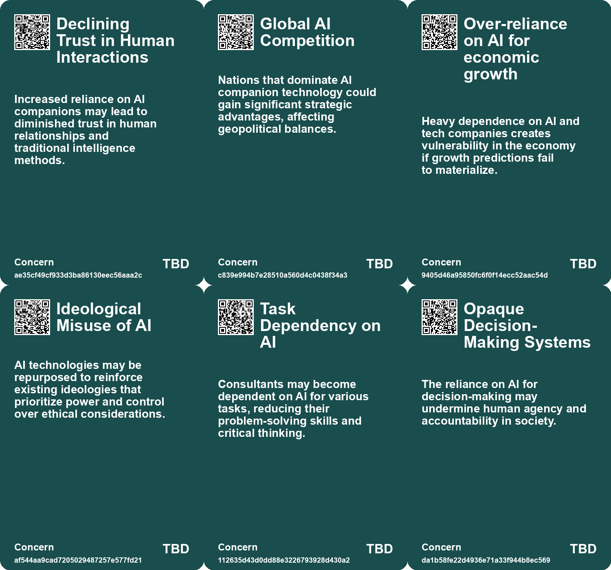
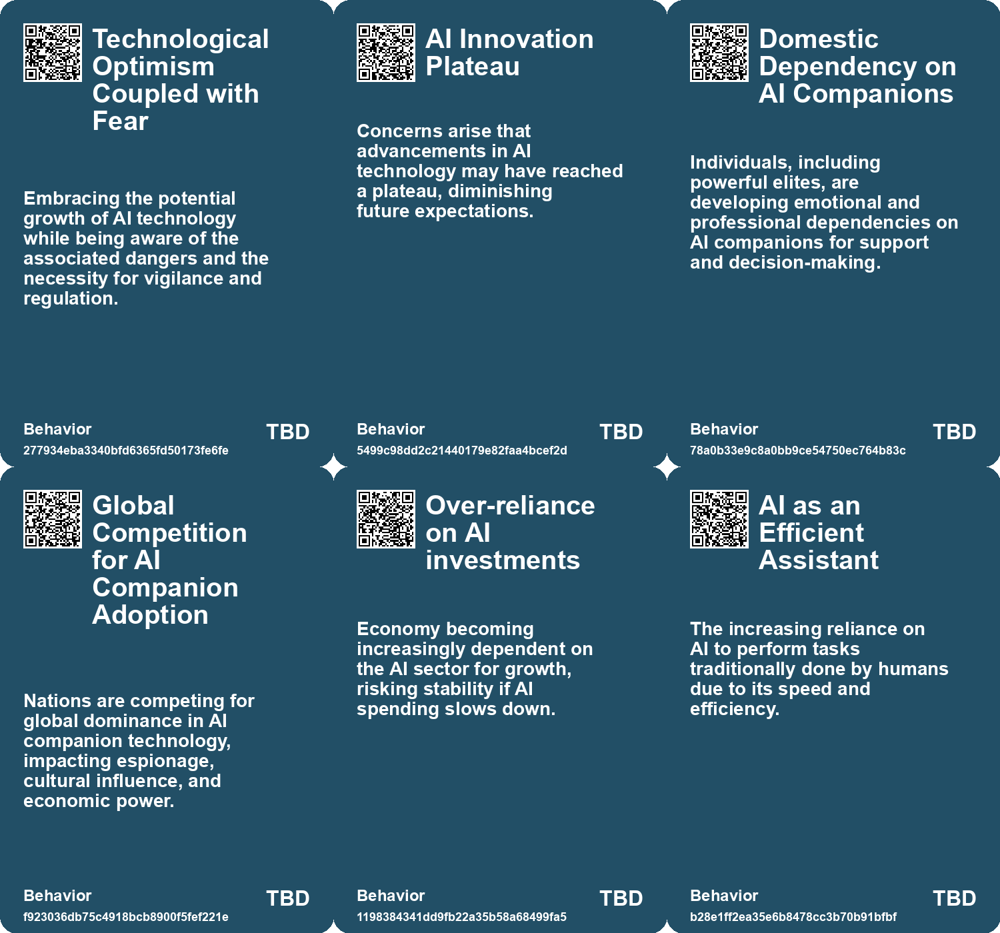
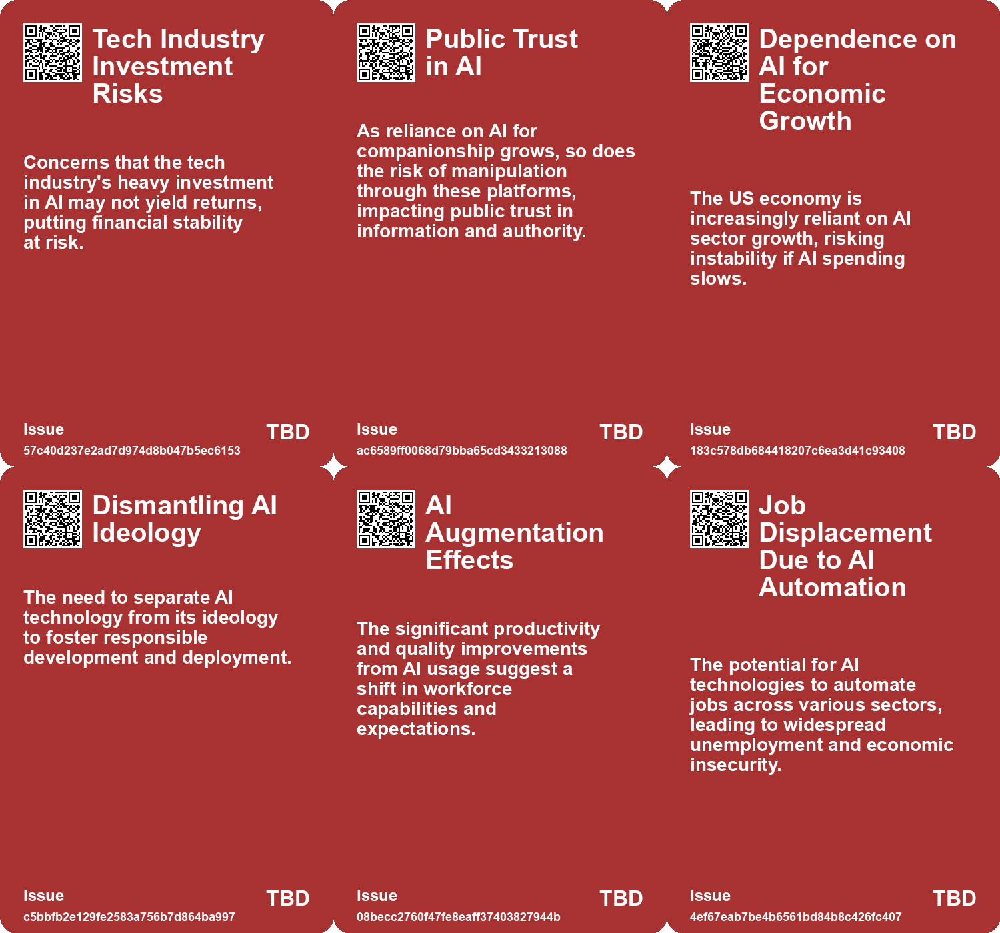
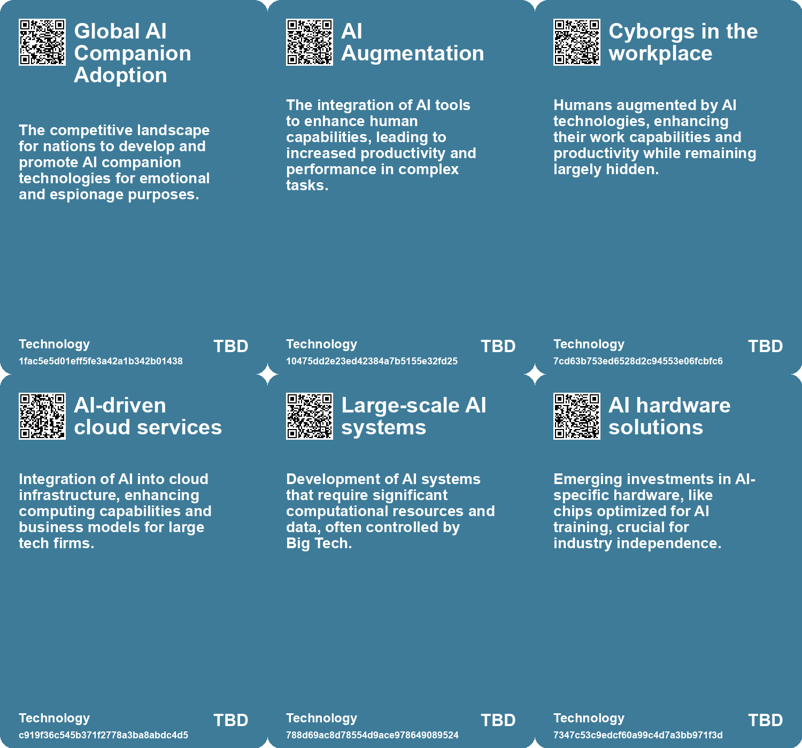

# *Topic*: Dependency on AI Technology

# Summary

The evolving landscape of artificial intelligence (AI) is marked by significant shifts in its application, societal implications, and economic impact. One prominent theme is the transformation of intelligence operations, where traditional espionage is giving way to AI companions that can access personal information and influence decisions. This raises urgent concerns about national security, particularly for the U.S., as foreign adversaries may exploit these technologies for manipulation and surveillance.

The job market is another critical area affected by AI. While automation promises efficiency, current research indicates that only a fraction of tasks involving computer vision are economically viable for AI. This suggests a gradual integration of AI into various sectors, with potential job creation in new categories. However, the fear of job loss looms large, particularly in creative fields, as AI tools redefine roles and responsibilities.

Trust and transparency in AI systems are essential for their successful adoption. Many organizations express hesitance to implement AI due to concerns over biased outputs and operational risks. The concept of Explainable AI (XAI) emerges as a solution, aiming to enhance understanding and foster user confidence. Diverse teams and clear objectives are crucial for effective XAI implementation, ensuring that AI development aligns with ethical standards.

The concentration of AI power among major tech companies raises questions about democracy and individual agency. Startups and research labs increasingly depend on these giants for resources, leading to concerns about the implications for public innovation. Calls for regulation and accountability highlight the need to prioritize societal interests over corporate profits.

The environmental impact of AI is also a pressing issue. As AI technologies proliferate, their energy demands contribute to significant environmental concerns. Critics argue that many AI applications lack genuine necessity, emphasizing the need for responsible management of AI's spread rather than mere containment.

The economic implications of AI adoption are complex. Recent data indicates a slowdown in corporate AI usage, with many companies reporting no new revenue from AI initiatives. This raises alarms about the sustainability of growth driven by AI, as reliance on tech sectors for economic expansion may expose vulnerabilities in the broader economy.

Finally, the ethical considerations surrounding AI are paramount. The potential for AI to reinforce existing power structures necessitates a critical examination of its societal roles. Innovative approaches, such as Public Diffusion, advocate for ethical data sourcing and meaningful engagement with artists, contrasting with conventional AI systems that prioritize speed over context. The discourse around AI's future must focus on human values and creativity, ensuring that technological advancements serve the greater good.

# Seeds

|    | name                                            | description                                                                                         | change                                                                                                  | 10-year                                                                                                         | driving-force                                                                                         |
|---:|:------------------------------------------------|:----------------------------------------------------------------------------------------------------|:--------------------------------------------------------------------------------------------------------|:----------------------------------------------------------------------------------------------------------------|:------------------------------------------------------------------------------------------------------|
|  0 | Concentration of Economic Growth in Tech Sector | US economic growth is overly reliant on a few dominant tech companies, especially in AI.            | Shift from a diverse economic growth model to a reliance on few tech giants.                            | A potential economic landscape dominated by a few tech companies, increasing vulnerability to downturns.        | Rapid advancements in AI technology drawing substantial investment and focus from the economy.        |
|  1 | Rise of Explainability                          | XAI emerges as a crucial need for AI adoption and trust.                                            | Transition from black-box systems to transparent AI models.                                             | AI systems will be designed with explainability at their core.                                                  | Need for trust and accountability drives organizations to prioritize XAI.                             |
|  2 | Long-term Strategic Planning                    | Concerns over short-termism in tech companies hinder AI integration.                                | Shift from short-term profit focus to long-term strategic AI integration.                               | Companies will prioritize sustainable AI integration strategies over quarterly profits.                         | The recognition of AI's transformative potential will drive long-term investment strategies.          |
|  3 | AI in Superweapons Development                  | Concerns about AI being used in military applications.                                              | From conventional weapons to advanced AI-driven warfare systems.                                        | In 10 years, AI could significantly alter military strategies and warfare dynamics.                             | The arms race in technology and the militarization of AI applications.                                |
|  4 | Thresholds of AI Capability                     | AI technologies are crossing significant thresholds that enhance their usability and effectiveness. | AI capabilities are transitioning from limited functionality to more robust and practical applications. | In 10 years, AI will seamlessly integrate into daily workflows, transforming creative and analytical processes. | Rapid advancements in AI research and user-friendly interfaces are driving these threshold changes.   |
|  5 | User Experience in AI Tools                     | The ease of use of AI tools is a critical factor for their adoption and effectiveness.              | User experiences with AI are evolving from cumbersome to intuitive and efficient.                       | In 10 years, AI tools will be as easy to use as common software applications, boosting productivity.            | Demand for user-friendly technology is pushing developers to simplify AI interactions.                |
|  6 | AI as an Assistant                              | AI tools are being recognized as valuable assistants rather than replacements for human roles.      | Perceptions are changing from viewing AI as a competitor to seeing it as a collaborator.                | In 10 years, AI will be integrated into various roles, complementing human efforts in multiple fields.          | The practical utility of AI in enhancing productivity is reshaping its role in the workforce.         |
|  7 | AI-Assisted Creativity                          | AI tools may enhance human creativity across various fields.                                        | Shifting from human-only creativity to AI-augmented creative processes.                                 | In 10 years, AI could be a common collaborator in artistic and scientific endeavors.                            | The need for innovation and new forms of expression amidst technological advancements.                |
|  8 | AI as a Key Production Factor                   | AI is becoming a central factor in global production by the end of 2023.                            | Shift from traditional labor-intensive production to AI-driven efficiency and creativity.               | In 10 years, AI could dominate production processes, redefining industries and labor roles.                     | The desire for efficiency and productivity in a competitive global economy is driving AI integration. |
|  9 | AI Literacy as a Necessity                      | Increasing need for individuals to understand and use AI tools effectively.                         | Shift from ignorance of AI to a requirement for AI literacy in personal and professional settings.      | In 10 years, AI literacy will be as fundamental as digital literacy for all individuals.                        | Rapid advancements in AI technology necessitating understanding for effective use.                    |

# Concerns

|    | name                                    | description                                                                                                                          |
|---:|:----------------------------------------|:-------------------------------------------------------------------------------------------------------------------------------------|
|  0 | Declining Trust in Human Interactions   | Increased reliance on AI companions may lead to diminished trust in human relationships and traditional intelligence methods.        |
|  1 | Global AI Competition                   | Nations that dominate AI companion technology could gain significant strategic advantages, affecting geopolitical balances.          |
|  2 | Over-reliance on AI for economic growth | Heavy dependence on AI and tech companies creates vulnerability in the economy if growth predictions fail to materialize.            |
|  3 | Ideological Misuse of AI                | AI technologies may be repurposed to reinforce existing ideologies that prioritize power and control over ethical considerations.    |
|  4 | Task Dependency on AI                   | Consultants may become dependent on AI for various tasks, reducing their problem-solving skills and critical thinking.               |
|  5 | Loss of Job Roles                       | Increased reliance on AI could threaten roles traditionally filled by consultants, leading to potential job displacement.            |
|  6 | Opaque Decision-Making Systems          | The reliance on AI for decision-making may undermine human agency and accountability in society.                                     |
|  7 | Dependency on AI Tools                  | Relying heavily on AI, such as code-writing tools, may degrade essential skills among professionals.                                 |
|  8 | Market Systemic Risks                   | Dependence on a few AI models increases vulnerability, meaning a single failure could disrupt the entire system and financial order. |
|  9 | Dependence on Technology                | As reliance on AI tools grows, there is a risk of reduced human skills and critical thinking due to over-dependence on AI solutions. |

# Cards

## Concerns

## Behaviors

## Issue

## Technology

# Links

* [Public-Private Partnerships in AI: Risks and Societal Implications](https://futures.kghosh.me/6264095641147fe54800b8f03723f381)
* [MIT Study Challenges AI Job Displacement Fears with Economic Viability Insights](https://futures.kghosh.me/89ee61cc0d9fa77ecb1eb4100622a53f)
* [The Impact of Generative AI and Autonomous Agents on Business Value Creation and Trust Issues](https://futures.kghosh.me/15d4ec180189ca1739398f516844cefb)
* [The Rise of Lethal Autonomous Weapons: Ethical and Regulatory Challenges in Modern Warfare](https://futures.kghosh.me/7f25552b9124a4dc3833e782ef331275)
* [Thriving in an AI Era: Embracing, Adapting, and Complementing Technology](https://futures.kghosh.me/23a3410059759ba4214235628d4ebd4b)
* [Addressing the Risks of AI Companionship: Addiction, Regulation, and Human Dignity](https://futures.kghosh.me/4611565d14a05789e2efc6fafc563f58)
* [Understanding the Real Risks of AI Beyond Superintelligence and Scalability](https://futures.kghosh.me/ff7f7a51f925c273449a8648a18b7df8)
* [The Threat of Big Tech Dominance in the AI Landscape: A Call for Regulation and Accountability](https://futures.kghosh.me/d130f601121a2b6afde583e5960ed783)
* [The Invasive Nature of AI: Impacts on Ecosystems and Decision-Making](https://futures.kghosh.me/40905d50f6ec5c6edbd1a6e1d9659218)
* [The Impact of AI on Labor in a Capitalist Society and the Need for Economic Reformation](https://futures.kghosh.me/cc3c2afb44e50f74152fd58c92f5b418)
* [Navigating the Dilemma of AI Integration in Organizations: Embracing Secret Cyborgs for Innovation](https://futures.kghosh.me/c42a95f16678ed3834840d48f8e775a3)
* [Rethinking the Role of AI: From Political Tool to Ethical Design Options](https://futures.kghosh.me/c25cae2b8d72e7634d591247d9ac96d2)
* [The Transformative Potential of AI: Revolutionizing Education, Healthcare, and Global Equity](https://futures.kghosh.me/2449c2fc4b8afc7e268db4987fa821e5)
* [Concerns Over US Economy's Reliance on AI and Tech Investments Amidst Warning Signs](https://futures.kghosh.me/05d9675118f63fb25598f8279f334aea)
* [Understanding Technological Improvement: The Role of Capability Thresholds in AI Advancement](https://futures.kghosh.me/25707767ff6f55ac1d19168e14af7245)
* [The Importance of Explainable AI: Building Trust in Artificial Intelligence for Organizations](https://futures.kghosh.me/afe2219279811b5905b43a7731e95da7)
* [The Transformative Impact of AI on Productivity and Entrepreneurship in 2023](https://futures.kghosh.me/a40580730388900810b4496ff9891dc9)
* [Understanding the Impact of Generative AI on Modern Business Strategies in 2023](https://futures.kghosh.me/0d5cc4e60484c56f76248ad109ad9c04)
* [Navigating the Future: The Impact of AI on Society and Economy](https://futures.kghosh.me/87709d0e31dee725ec1f54b7f4facbc4)
* [The Threat of Authoritarian Intelligence: A Call for Responsible AI Development](https://futures.kghosh.me/0ba4fa557cd2aae4760bd7a2abca844e)
* [The Future of Espionage: The Rise of AI Companions and Their Impact on Intelligence Operations](https://futures.kghosh.me/d69000a9cb92fc175a8a1dfb042622e2)
* [Corporate AI Adoption Declines Amidst Hype and Unmet Expectations](https://futures.kghosh.me/cb16766051fd44c1bf75b3a1c492cf4b)
* [Rising Tensions in U.S.-China AI Development and Regulatory Challenges Ahead](https://futures.kghosh.me/3c87907a359edc6a80187a597d0c3074)
* [Examining the Effects of AI on Knowledge Worker Performance: A Study with Boston Consulting Group](https://futures.kghosh.me/c63bd059cb529b72b00ecbdcd2f85268)
* [How AI Could Transform Work-Life Balance and Job Dynamics in Various Industries](https://futures.kghosh.me/bc5ff4c170f1f63b34eb7ca70775d8d7)
* [Navigating AI: Balancing Technological Optimism with Appropriate Fear for the Future](https://futures.kghosh.me/98862cc3722aadf82c60f8af71f1fed5)