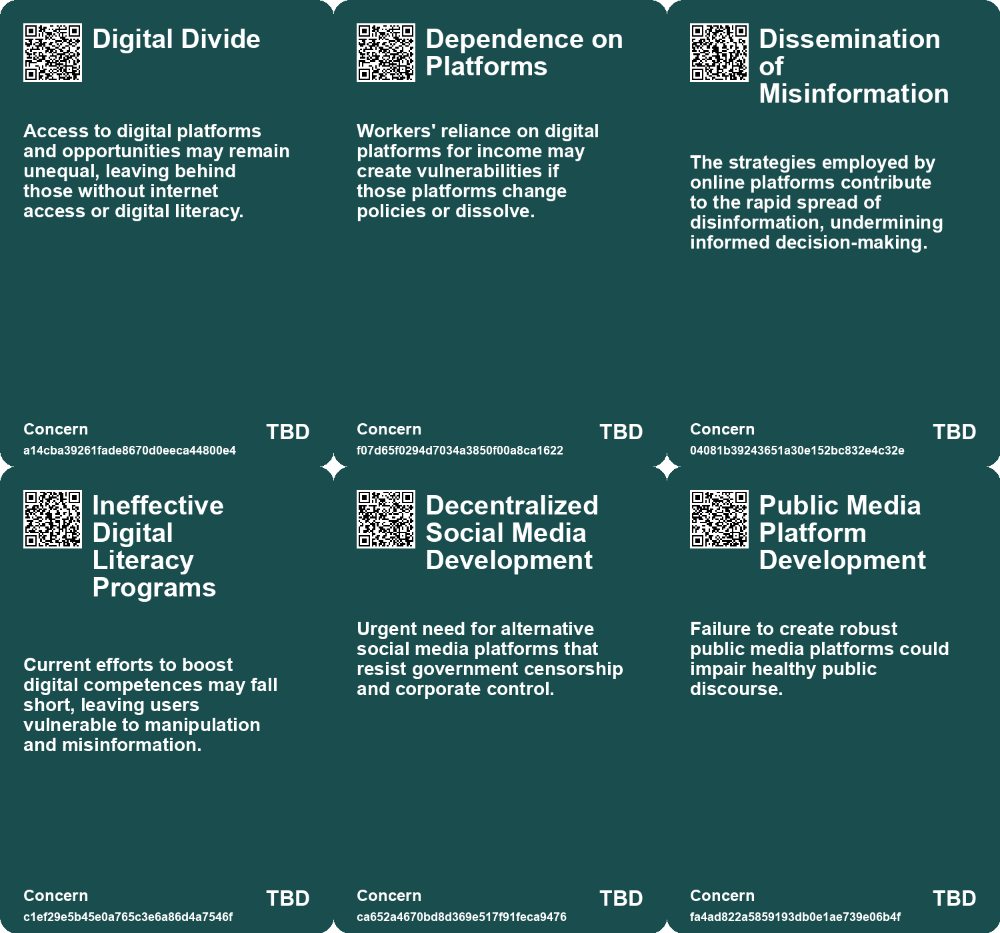
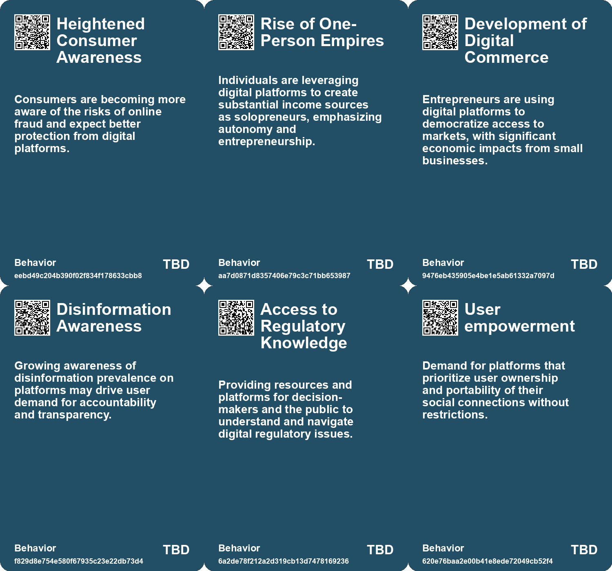
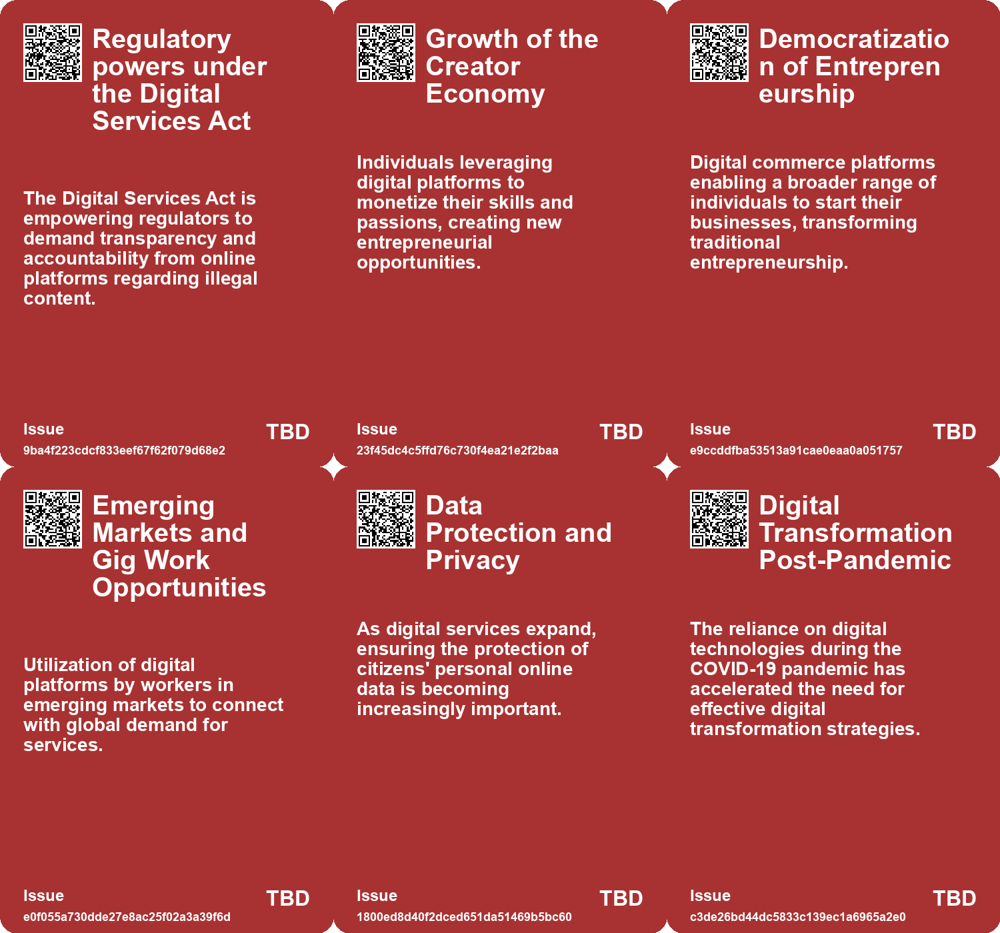
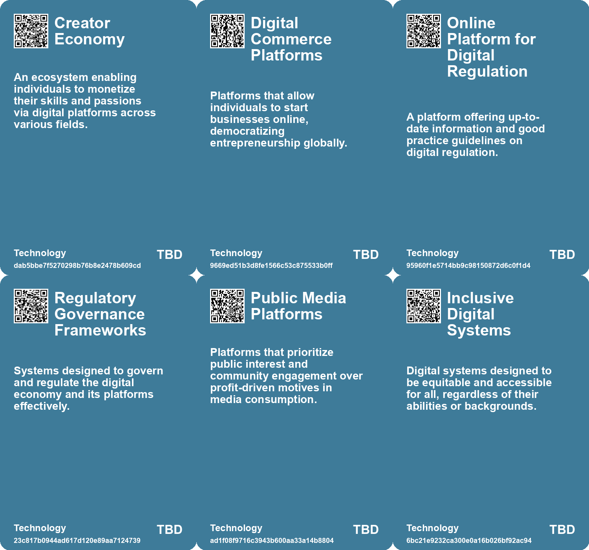

# *Topic*: Digital Communication Platforms

# Summary

Digital liveness is becoming increasingly important in online interactions, as platforms create a sense of presence through user engagement. Markers like message indicators and verified accounts reveal user status and influence, while the decline in organic reach on social media highlights the need for effective content and community strategies. This shift underscores the dynamics of user interaction and platform design in the digital landscape.

As digital applications permeate economies and societies, questions arise about the protection of digital infrastructure and citizens' rights. The World Bank and the International Telecommunication Union have updated the ICT Regulatory Handbook to address these concerns, focusing on regulatory governance, data protection, and consumer affairs. This resource aims to promote a safe digital economy, especially for disadvantaged communities, emphasizing the need for universal internet access.

The decentralized workforce is reshaping employment, with freelancers and gig workers prioritizing autonomy and flexibility over traditional jobs. The gig economy is expected to grow, providing opportunities for specialized skills, while the creator economy allows individuals to monetize their passions. However, challenges like platform fees and lack of benefits necessitate a reevaluation of worker protections in this evolving landscape.

Democracy faces threats from groups adept at spreading misinformation through social media. These groups exploit cognitive biases, undermining democratic processes. To combat this, the development of immunity activators, such as public media platforms and media literacy strategies, is essential. These measures aim to foster transparency and promote pro-social online behaviors.

The entertainment and media industries are experiencing a slowdown, with growth hampered by the lingering effects of the pandemic and changing consumer spending habits. Companies are now seeking new growth opportunities, particularly in advertising and the use of generative AI. Despite challenges, the industry is expected to continue evolving, driven by live events, gaming, and technological advancements.

Digital architectures often prioritize commercial interests, which can undermine human autonomy and facilitate disinformation. To address these issues, strategies that enhance cognitive competences and improve digital environments are necessary. These approaches aim to promote truth and democratic discourse online, ensuring that users can navigate the digital landscape effectively.

The future of smart cities hinges on innovative governance and community involvement. Different city models illustrate the need for collaboration and adaptation to the digital landscape. Successful urban innovation will require leveraging local strengths while adhering to global standards, enabling communities to shape their futures with digital tools.

# Seeds

|    | name                                     | description                                                                                      | change                                                                                     | 10-year                                                                                                            | driving-force                                                                                           |
|---:|:-----------------------------------------|:-------------------------------------------------------------------------------------------------|:-------------------------------------------------------------------------------------------|:-------------------------------------------------------------------------------------------------------------------|:--------------------------------------------------------------------------------------------------------|
|  0 | Growing Creator Economy                  | Individuals monetize expertise through digital platforms, expanding the creator economy.         | Evolving from passive income to active engagement in income generation.                    | Significant growth in independent creators leading to diverse income sources and democratized entrepreneurship.    | Advancements in digital tools enable individuals to reach global audiences effortlessly.                |
|  1 | Digital Commerce Expansion               | E-commerce platforms enable more people to become entrepreneurs with low barriers.               | Transition from traditional retail to digital entrepreneurship as a primary income source. | Large-scale democratization of business ownership creates diverse market landscape.                                | Technological advancements lowering entry barriers and facilitating global market access.               |
|  2 | De-materialization of Products           | Shift towards digital solutions replacing physical products and services.                        | Transitioning from physical goods to digital solutions and services.                       | By 2033, many industries may operate primarily through digital platforms, reducing reliance on physical products.  | Advancements in technology enabling more efficient and accessible digital alternatives.                 |
|  3 | Inclusive Digital Design                 | A growing focus on creating digital systems that serve diverse user needs.                       | Shifting from designing for the majority to inclusivity for all users.                     | Digital systems will be more accessible and tailored to diverse communities, enhancing user experience.            | Increasing awareness of systemic inequities and advocacy for marginalized groups.                       |
|  4 | Digital Liveness Concept                 | The evolving model of digital liveness influences user interaction on platforms.                 | Shifting from passive content consumption to active, dynamic interaction through screens.  | In 10 years, digital interactions may feel more immersive and real-time, blurring the lines of presence.           | The demand for authentic and engaging online experiences drives this evolution in digital liveness.     |
|  5 | Platform-Specific Features               | Different platforms develop unique features to enhance user engagement and digital liveness.     | From generic features to tailored functionalities that reflect user community dynamics.    | In 10 years, platforms may offer highly personalized features based on user behavior and preferences.              | Competition among platforms to retain users encourages the development of unique engagement strategies. |
|  6 | Shift to Digital Consumption             | Increasing emphasis on digital access to news and analysis over print subscriptions.             | Shift from print-focused journalism to predominantly digital platforms and subscriptions.  | In 10 years, print journalism may be largely obsolete, with digital being the primary medium for news consumption. | The convenience and immediacy of digital access attract more readers and advertisers.                   |
|  7 | Shift to Digital Consumption             | Increasing emphasis on digital access to news and analysis over print subscriptions.             | Shift from print-focused journalism to predominantly digital platforms and subscriptions.  | In 10 years, print journalism may be largely obsolete, with digital being the primary medium for news consumption. | The convenience and immediacy of digital access attract more readers and advertisers.                   |
|  8 | Shift to Digital Consumption             | Increasing emphasis on digital access to news and analysis over print subscriptions.             | Shift from print-focused journalism to predominantly digital platforms and subscriptions.  | In 10 years, print journalism may be largely obsolete, with digital being the primary medium for news consumption. | The convenience and immediacy of digital access attract more readers and advertisers.                   |
|  9 | Data Accessibility as a Core Requirement | The need for reliable and accessible data is becoming central to digital transformation efforts. | Transition from siloed data to organization-wide accessibility and usability.              | Data architecture will evolve to ensure real-time access across functions and teams.                               | The demand for data-driven insights and quick decision-making drives this change.                       |

# Concerns

|    | name                                        | description                                                                                                                                 |
|---:|:--------------------------------------------|:--------------------------------------------------------------------------------------------------------------------------------------------|
|  0 | Digital Divide                              | Access to digital platforms and opportunities may remain unequal, leaving behind those without internet access or digital literacy.         |
|  1 | Dependence on Platforms                     | Workers' reliance on digital platforms for income may create vulnerabilities if those platforms change policies or dissolve.                |
|  2 | Dissemination of Misinformation             | The strategies employed by online platforms contribute to the rapid spread of disinformation, undermining informed decision-making.         |
|  3 | Ineffective Digital Literacy Programs       | Current efforts to boost digital competences may fall short, leaving users vulnerable to manipulation and misinformation.                   |
|  4 | Decentralized Social Media Development      | Urgent need for alternative social media platforms that resist government censorship and corporate control.                                 |
|  5 | Public Media Platform Development           | Failure to create robust public media platforms could impair healthy public discourse.                                                      |
|  6 | Spread of Misinformation                    | Social platforms' design facilitates rapid spread of misinformation, causing potential harm to communities, as seen during the pandemic.    |
|  7 | Data Privacy and Cybersecurity Risks        | As digital transformations deepen, the integration of advanced technologies raises concerns about data security and privacy management.     |
|  8 | Geopolitical Instability                    | Geopolitical tensions and shifting regulatory environments may adversely affect market dynamics, particularly for global digital platforms. |
|  9 | Sustainability Concerns from Digital Growth | Increased digitalization may lead to environmental concerns regarding energy consumption and e-waste from technology advancements.          |

# Cards

## Concerns

## Behaviors

## Issue

## Technology

# Links

* [The Urgent Need for Decentralized Social Media Amidst Political Turmoil](https://futures.kghosh.me/b8ae24e6d0683d0069e0ee250a9d21f0)
* [Elon Musk Accuses EU Commission of Offering Illegal Deal to Censor Speech on X](https://futures.kghosh.me/2be2858d309c5af66e1cbe5f2d9acbfe)
* [Horizon Europe Cluster 4: Advancing Digital, Industry, and Space Technologies for a Sustainable Future](https://futures.kghosh.me/274a9d87be7f508c7f636326ab796992)
* [Exploring the Top Five Digital Trends Transforming the AEC Industry by 2025](https://futures.kghosh.me/4fa95d956537d2dbb69564d1fce9ab67)
* [Explore Subscription Benefits of Standard and Premium Digital Access to Financial Times](https://futures.kghosh.me/eda0205a52f2174ac59da0ed0ea7c08a)
* [Understanding Digital Liveness: Key Indicators and User Engagement on Social Media](https://futures.kghosh.me/4d99da5c2a48b37588b98182eb31478a)
* [Understanding Digital Transformation: Key Strategies and Leadership Roles for Success](https://futures.kghosh.me/5564aecc487fff9617e0ddb0869d26fd)
* [The Digital Regulation Handbook: A Comprehensive Guide to Digital Transformation and Regulation](https://futures.kghosh.me/a38960ed1dcfd200d74ebd16e92e4151)
* [Enhancing Digital Competences: Strategies for Navigating Online Challenges](https://futures.kghosh.me/0770afeb444e4bbb336cdc72c07d6688)
* [The Decentralized Workforce: Transforming Employment through Digital Platforms](https://futures.kghosh.me/2c7f9030c5c74a2a747af2b356f1ce98)
* [EU Targets Big Tech Over Online Financial Fraud Compliance and Regulation](https://futures.kghosh.me/9f00a202a57779259fe6d6291b5773bf)
* [The Entertainment and Media Industry's Shift: Growth Challenges and Opportunities Ahead](https://futures.kghosh.me/c18691583943e0d2d1e217558293d06b)
* [Addressing Threats to Democracy: Strategies for Resilience Against Misinformation and Manipulation](https://futures.kghosh.me/56d1a28746cd95ebaa3d62a4e1f91c3a)
* [Explore Subscription Benefits of Standard and Premium Digital Access to Financial Times](https://futures.kghosh.me/a867472610f24a4471636e0df4557090)
* [Exploration des Futurs Possibles pour les Villes Numériques : Quatre Typologies Innovantes](https://futures.kghosh.me/72e5a64ac4cd53212ecf3efd96335b04)
* [EU Study Reveals X (Twitter) Leads in Disinformation Among Social Media Platforms](https://futures.kghosh.me/5793d28b92e90a64b918cfaefad509db)
* [Five Emerging Trends Transforming Business in the Coming Year](https://futures.kghosh.me/55bac03899915f25bf0b47fa4342472c)
* [Exploring the Concept of Digital Infinity in Linguistics and Its Implications](https://futures.kghosh.me/61e44b7ae88ca5a1dbe11323ec862712)
* [Digital Reinvention: Transforming Law Firm Success in the Post-Pandemic Era](https://futures.kghosh.me/f9f1a04c9e44cac963fd3522f407a5e8)
* [The Evolving Role of Designers in an Era of Accessible Digital Tools and Automation](https://futures.kghosh.me/ece4f1f782525a6ae341e9d4c9df3533)
* [Explore Subscription Benefits of Standard and Premium Digital Access to Financial Times](https://futures.kghosh.me/f914f2a663349c70de99c3fbb3d7ee96)
* [Building an Inclusive Digital Future: Challenges and Solutions for Aotearoa New Zealand](https://futures.kghosh.me/8115a7120c6b8a58c853c504e0d0ab75)
* [Exploring Cookies, Supply Chains, and Future Challenges in Technology and Consumption](https://futures.kghosh.me/fa27e27bdec01712d582ab0f61c95bac)
* [Exploring the $100 Trillion Potential of B2B Marketplaces and Their Innovation](https://futures.kghosh.me/50aefdd8b2bffa1bb84f8460c7b559c2)