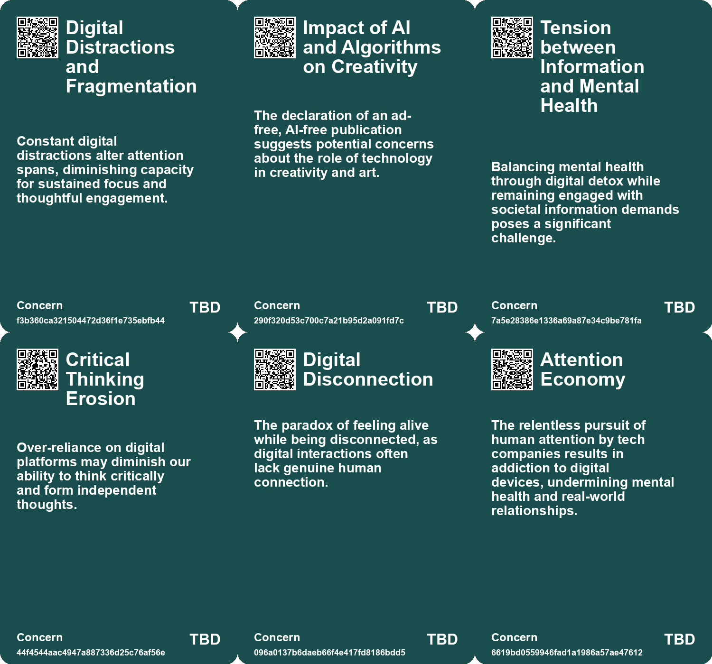
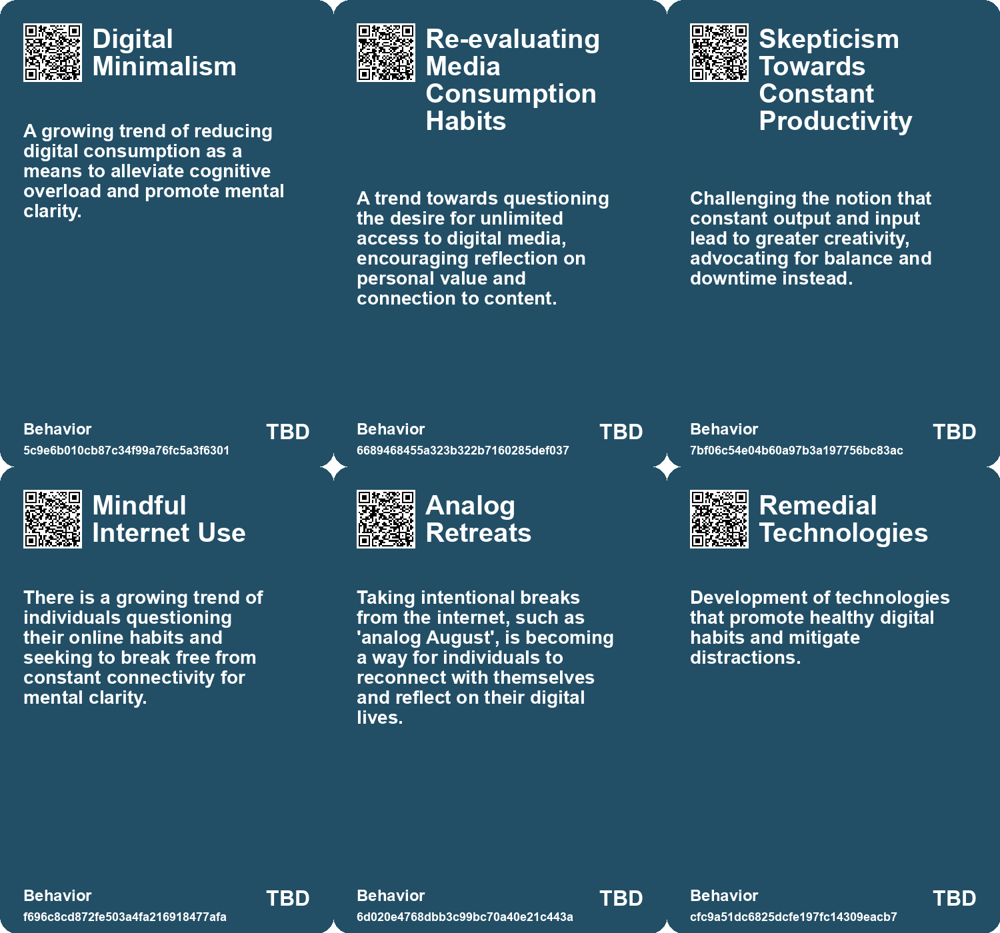
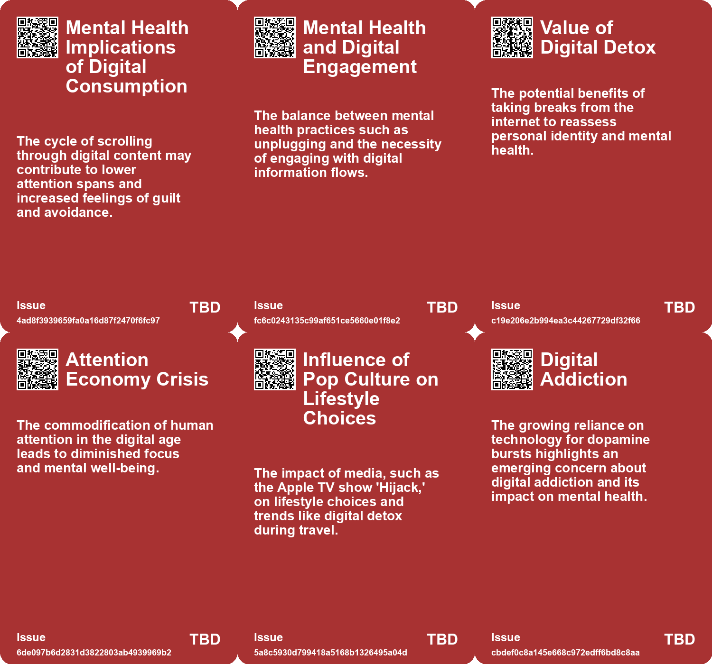
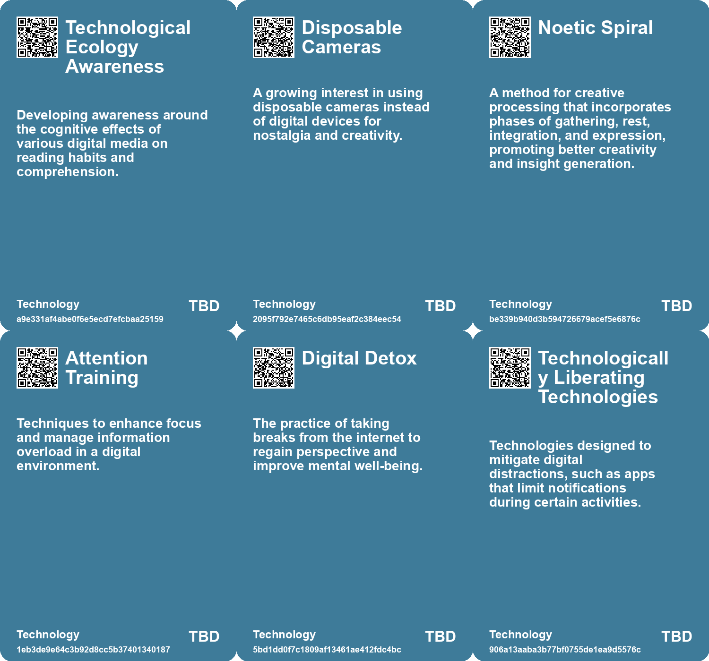

# *Topic*: Digital Detox for Creativity

# Summary

The intersection of technology and creativity emerges as a central theme, with discussions on how digital tools shape artistic expression. The rise of artificial intelligence in music creation raises concerns about the authenticity of artistic output, as seen in critiques of Taylor Swift's latest album, which some liken to "AI slop." This sentiment echoes in the exploration of how designers must adapt to collaborate with AI while preserving the unique human journey of creativity.

The impact of technology on personal well-being and social interactions is another significant focus. The phenomenon of "Waldenponding" suggests a retreat from digital distractions to reclaim attention, yet it is critiqued for being a selfish approach. Instead, a more engaged relationship with technology is advocated, emphasizing the importance of individual contributions in a digitally entangled world. The rise of nostalgia for simpler times, as seen in the return to analog devices among teens, reflects a desire for authentic experiences amidst constant connectivity.

Education faces a crisis attributed to smartphone addiction, with students struggling to engage in traditional learning. Teachers express concern over declining motivation and cognitive skills, drawing alarming comparisons to incarcerated students who show greater enthusiasm for learning. This highlights the urgent need for awareness and action against the detrimental effects of technology on education.

The concept of digital ownership is scrutinized, particularly in light of Amazon's ban on downloading Kindle e-books. This shift underscores the illusion of ownership in the digital age, where consumers are reminded they are purchasing licenses rather than tangible products. The article advocates for a return to curated personal collections, emphasizing the importance of digital ownership in a culture increasingly driven by convenience.

The exploration of deep reading versus superficial engagement reveals a cultural shift that threatens intellectual capacities. The decline of deep reading habits, influenced by technology, risks eroding our ability to engage with complex literature and critical thought. This concern is echoed in discussions about the need for meaningful engagement and the value of friction in experience design, which fosters curiosity and exploration.

Amidst these challenges, the importance of rest and reflection is highlighted as essential for creativity and mental well-being. The concept of the "Noetic Spiral" emphasizes the necessity of cycles in creativity, advocating for pauses and stillness to allow for deeper thought. Personal experiences of meditation and digital detox illustrate the benefits of stepping back from constant stimulation to restore mental balance.

Finally, the evolving landscape of business norms and societal structures is examined, with trends such as de-materialization and localized trade relations anticipated to reshape corporate strategies. The implications of demographic changes, particularly a wealth transfer to women, signal a shift in economic power dynamics. These transformative shifts reflect a broader cultural narrative that challenges existing systems and encourages new ways of thinking about technology, creativity, and community.

# Seeds

|    | name                                     | description                                                                                       | change                                                                                                 | 10-year                                                                                                   | driving-force                                                                                                   |
|---:|:-----------------------------------------|:--------------------------------------------------------------------------------------------------|:-------------------------------------------------------------------------------------------------------|:----------------------------------------------------------------------------------------------------------|:----------------------------------------------------------------------------------------------------------------|
|  0 | Creativity vs. Consumption               | Individuals find more creativity while consuming less media and information.                      | Shifting from constant media consumption to intentional, limited inputs leads to greater creativity.   | A trend towards minimalism in media will redefine creativity, focusing on quality over quantity.          | The need for mental space and cognitive processing in an information-dense society drives this change.          |
|  1 | Focus on Mental Well-being in Creativity | Emphasis on mental health and well-being in creative practices.                                   | From art as a solitary endeavor to one that prioritizes mental wellness.                               | In 10 years, creative practices may be more closely linked to mental health initiatives.                  | Increased awareness of mental health issues and their connection to creativity.                                 |
|  2 | Waldenponding Movement                   | A growing trend of individuals retreating from technology for mental health.                      | Shift from engagement with digital platforms to a preference for digital detox.                        | Increased acceptance of digital detox as a lifestyle choice among many demographics.                      | Rising awareness of mental health issues related to technology use.                                             |
|  3 | Attention Management Awareness           | Growing awareness about the need for effective attention management in the digital age.           | Shift from passive consumption to active management of attention and information.                      | Widespread adoption of attention management techniques among digital users.                               | Increased information overload leading to cognitive fatigue and stress.                                         |
|  4 | Digital Detox Movement                   | Increased interest in taking breaks from digital connectivity.                                    | A growing awareness of the need for offline time in a hyper-connected world.                           | More structured digital detox programs and societal acceptance of offline lifestyles.                     | The realization of the negative impacts of constant connectivity on mental health.                              |
|  5 | Raw Dogging Trend                        | A growing trend among young men to embrace digital detox during flights.                          | Shift from consuming entertainment to embracing boredom and mindfulness during travel.                 | In 10 years, digital detox practices may become mainstream travel rituals for mental well-being.          | A desire for mindfulness and a break from constant digital stimulation in a hyper-connected world.              |
|  6 | Digital Detox Experimentation            | People are beginning to test their limits with technology addiction through personal experiments. | Shifting from passive technology consumption to active self-experimentation and mindfulness practices. | In ten years, more individuals may regularly engage in digital detoxes as part of mental health routines. | Growing awareness of mental health issues related to technology overuse and a desire for deeper self-awareness. |
|  7 | Degradation of Attention Span            | Attention spans have drastically decreased due to digital distractions.                           | Shift from longer focus periods to increasingly shorter attention spans.                               | In 10 years, attention spans may shorten further, impacting work and learning.                            | The proliferation of digital devices and constant notifications drives distraction.                             |
|  8 | Nostalgia for Analog Experiences         | A yearning for simpler times without digital distractions.                                        | Shift from limited social interactions to overwhelming digital connectivity.                           | Increased appreciation for non-digital interactions and experiences, fostering deeper relationships.      | Desire for authenticity and meaningful connections in a hyper-connected world.                                  |
|  9 | Digital Nostalgia                        | Individuals rediscovering old digital content they had forgotten about.                           | From neglecting digital artifacts to actively revisiting and valuing them.                             | In 10 years, digital nostalgia may lead to curated digital experiences and platforms for rediscovery.     | A growing appreciation for personal history and the stories contained within digital artifacts.                 |

# Concerns

|    | name                                           | description                                                                                                                                                  |
|---:|:-----------------------------------------------|:-------------------------------------------------------------------------------------------------------------------------------------------------------------|
|  0 | Digital Distractions and Fragmentation         | Constant digital distractions alter attention spans, diminishing capacity for sustained focus and thoughtful engagement.                                     |
|  1 | Impact of AI and Algorithms on Creativity      | The declaration of an ad-free, AI-free publication suggests potential concerns about the role of technology in creativity and art.                           |
|  2 | Tension between Information and Mental Health  | Balancing mental health through digital detox while remaining engaged with societal information demands poses a significant challenge.                       |
|  3 | Critical Thinking Erosion                      | Over-reliance on digital platforms may diminish our ability to think critically and form independent thoughts.                                               |
|  4 | Digital Disconnection                          | The paradox of feeling alive while being disconnected, as digital interactions often lack genuine human connection.                                          |
|  5 | Attention Economy                              | The relentless pursuit of human attention by tech companies results in addiction to digital devices, undermining mental health and real-world relationships. |
|  6 | Choice Overload                                | An abundance of choices in the digital age can lead to decision fatigue, dissatisfaction, and reduced happiness.                                             |
|  7 | Degradation of Attention Span                  | The pervasive use of digital tools may lead to shorter attention spans and cognitive deterioration.                                                          |
|  8 | Economic Stagnation due to Digital Distraction | Increased digital distractions could further stifle productivity growth and economic prosperity.                                                             |
|  9 | Attention Fragmentation                        | Constant influx of digital content may divide attention, impacting the ability to engage meaningfully with personal interests.                               |

# Cards

## Concerns

## Behaviors

## Issue

## Technology

# Links

* [Exploring Technology's Impact: Insights from Michael Harris on Life Before and After the Internet](https://futures.kghosh.me/357214f864be2592efced782b93b25b3)
* [The Crisis in Education: Students as Victims of Smartphone Addiction and Tech Overreach](https://futures.kghosh.me/a5688e452658f03667dfc0fe392e1f1d)
* [Exploring the Modern Entertainment Landscape and Its Societal Implications](https://futures.kghosh.me/c5c2c794f1426e6e307a9df3f9ff61f6)
* [Understanding Digital Liveness: Key Indicators and User Engagement on Social Media](https://futures.kghosh.me/4d99da5c2a48b37588b98182eb31478a)
* [Exploring Sensory Deprivation: A 24-Hour Experiment in Thought and Willpower](https://futures.kghosh.me/6cf9b19c5f473573ce74865766bf351c)
* [Exploring the Paradox of Exhaustion and Creative Flow Through the Noetic Spiral](https://futures.kghosh.me/41317b487f66f51787c3f667e738a046)
* [The Decline of Deep Reading: Impacts on Cognition and Culture in Modern Society](https://futures.kghosh.me/08ff2978b223efa281782cda55dd71a8)
* [Breaking Free from Self-Sabotage in Innovation: A Call for Reflection and Action](https://futures.kghosh.me/d963f3a93dc8311262c1ccbe947f0700)
* [Rediscovering Silence: The Need for Downtime in a Noisy World](https://futures.kghosh.me/6baa5e7c702f9608bef8029fe7db9156)
* [The Illusion of Digital Ownership: Amazon's Kindle Policy and the Future of Media Consumption](https://futures.kghosh.me/e1616df02a40343d004044a2bc18c0d6)
* [The Impact of the Internet and AI on Human Cognition and Productivity](https://futures.kghosh.me/652fc7ec1f422e931bc5a9ba8011650a)
* [Discovering Hidden Treasures in My Digital Attic: A Journey Through Forgotten Notes and Music](https://futures.kghosh.me/87f9730271bcf5ea04a27a68c90a9bcd)
* [Teens Embrace Older Tech Amid School Smartphone Bans, Sparking Nostalgia and Socialization](https://futures.kghosh.me/2c00b2575d94795c1ea258a68f0cf8ea)
* [Embracing Friction in Experience Design: The Need for Depth and Engagement](https://futures.kghosh.me/5594aa9268467c4e8aa504e504cfdeb7)
* [Exploring Idling, Rotting, and True Rest in Modern Parenting and Leisure](https://futures.kghosh.me/f7596a590c3cf73d3fc4e51347159b95)
* [Five Emerging Trends Transforming Business in the Coming Year](https://futures.kghosh.me/55bac03899915f25bf0b47fa4342472c)
* [The Case Against Waldenponding: Embracing Digital Engagement Instead of Retreating](https://futures.kghosh.me/1f9f5c2997f105f07aba13ba1adb86e1)
* [Nostalgia for Simplicity: The Burden of Infinite Choice in Modern Life](https://futures.kghosh.me/7b316ebe449187b79e519a8c6d12a2cd)
* [The Rise of 'Raw Dogging': A New Trend in Digital Detox During Flights](https://futures.kghosh.me/543af6e9c598a0c4a14f1e21aa5ff28c)
* [Exploring the Future: How Technology Will Transform Society by 2034](https://futures.kghosh.me/8ef50cfd87ff3eedbc028932b07520b3)
* [Exploring the Balance Between AI Efficiency and Human Creativity in Design](https://futures.kghosh.me/92ae644db3cc8e4d0fb262bac8413f8b)
* [The Rise of Creativity: Understanding Its Evolution and Cultural Impact Since WWII](https://futures.kghosh.me/4704e0c971a5aab83464d9025df5fe6d)
* [Future Trends Post-2024: Declining Democracies and Emerging Cultural Shifts](https://futures.kghosh.me/bd1b01636b1360716b5951e1cac42724)
* [Exploring the Dichotomy of Talent and Technology: Swift, Slop, and AI Creativity](https://futures.kghosh.me/97ed8c242eb852cc99a642878c3433bc)
* [Understanding Polarization: Healing Our Relationship with Technology and Embracing Diverse Perspectives](https://futures.kghosh.me/c1bb890337ef382bfaa5720c9fd05134)
* [Exploring Creativity: Reflections and Tributes from the Week](https://futures.kghosh.me/e3b92f617e8798cb961022e6d57bf13a)