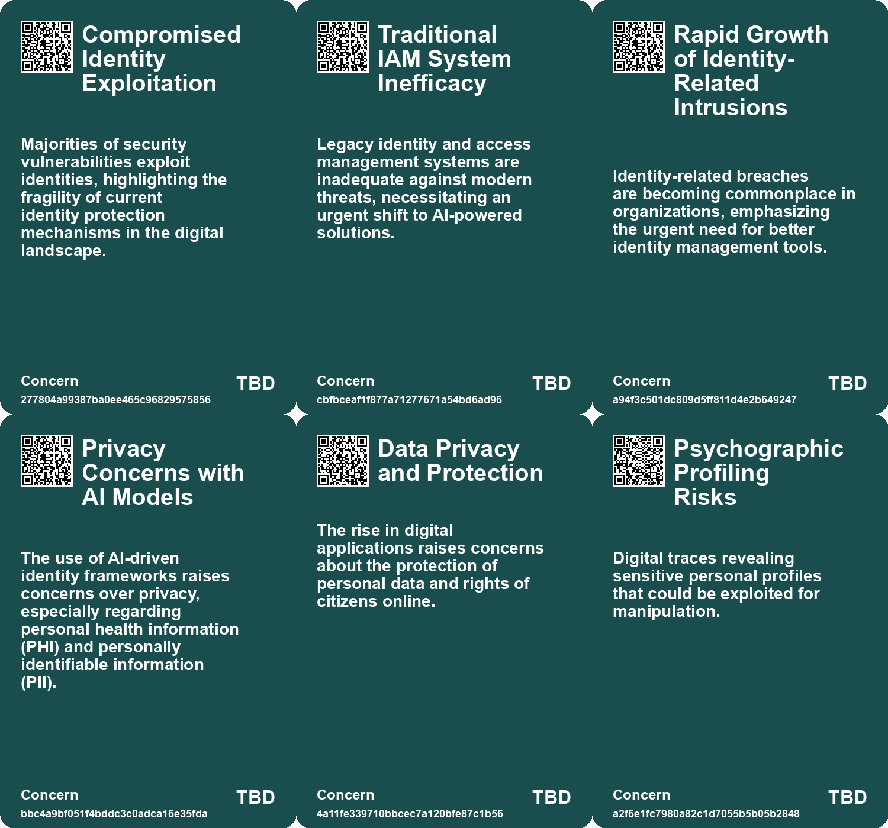
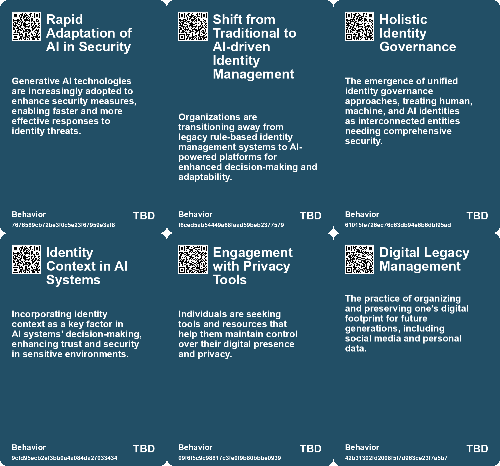
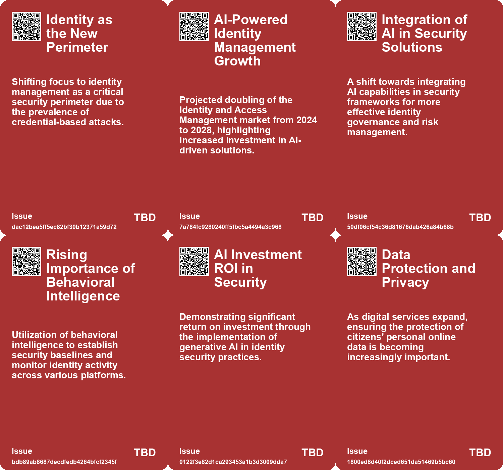
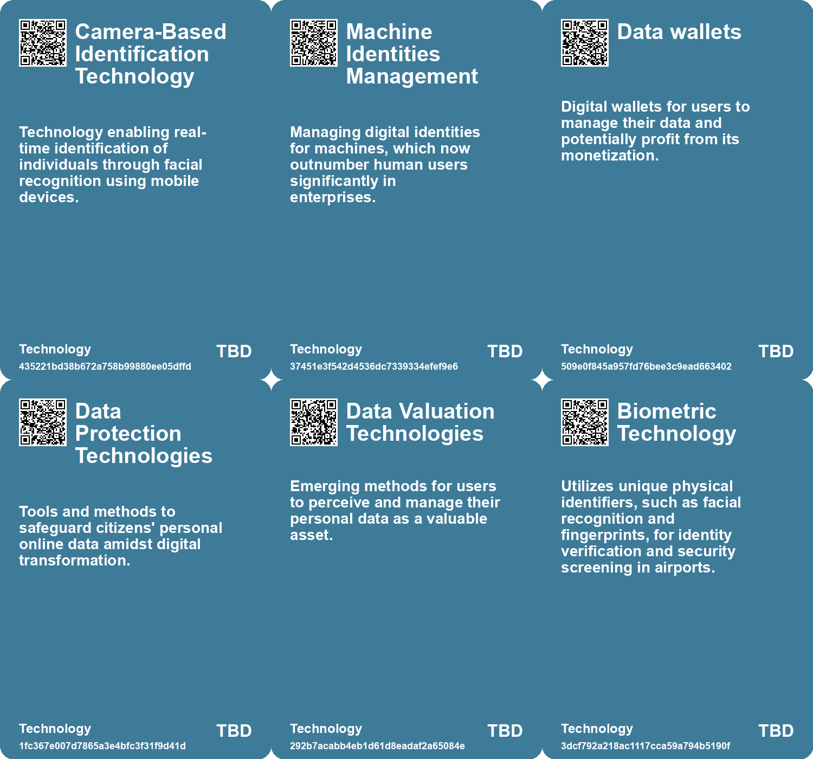

# *Topic*: Digital Identity Management

# Summary

Generative AI is reshaping identity security, presenting both new vulnerabilities and advanced defenses. The rise of voice phishing attacks has surged by 442%, as traditional security measures struggle against machine-driven threats. Organizations are increasingly adopting AI-powered identity security systems, such as CrowdStrike's Falcon, which leverages real-time behavioral analytics. The shift towards a zero-trust approach is evident, with companies like Cushman & Wakefield integrating identity management to enhance security. Generative AI is proving to be a valuable investment, significantly reducing investigation times and false positives.

Digital applications are now essential to modern economies, yet critical questions about digital infrastructure protection and citizens' rights remain. The World Bank and the International Telecommunication Union have updated the ICT Regulatory Handbook to address these issues, covering regulatory governance, data protection, and access for all. This resource aims to guide decision-makers in promoting a safe digital economy, especially for disadvantaged communities. The COVID-19 pandemic has underscored the urgency of global digital transformation, highlighting the need for robust regulatory frameworks.

Biometric technology, particularly facial recognition, is increasingly utilized in air travel to enhance security and efficiency. Major airlines and airports are investing in biometric systems, which promise to reduce wait times. However, privacy concerns persist, with critics questioning the ethical implications and the potential for misuse. The TSA's confidence in this technology is met with calls for a balance between convenience and privacy, leading to legislative efforts to regulate its use.

In higher education, the integration of digital twins and AI agents is seen as a way to address challenges like declining student enrollment and funding pressures. Dr. Vince Kellen of UC San Diego emphasizes the need for automation to improve productivity and security. By capturing IT professionals' knowledge for AI applications, institutions can proactively detect issues and streamline operations.

Governments worldwide are leveraging technology to enhance efficiency and productivity. The IRS exemplifies how AI can improve government services by detecting fraud and streamlining processes. However, challenges remain in scaling AI applications and addressing the talent shortage in the public sector. The combination of technology, policy, and process improvements is crucial for driving productivity in government.

The digital landscape raises concerns about data ownership and privacy. Brazil's pilot program allows citizens to manage and profit from their digital footprints through data wallets, aiming to correct imbalances in the digital economy. While this initiative positions Brazil as a leader in data ownership, critics warn of potential exploitation and the risks of commodifying personal data.

The emergence of digital afterlife services raises ethical questions about autonomy and consent. Companies are creating digital versions of deceased individuals, prompting discussions about the implications of datafication and the emotional complexities involved. A framework is needed to protect individuals' rights regarding their digital legacies.

The U.S. military is utilizing generative AI to remove references to diversity, equity, inclusion, and accessibility from training materials, following an executive order. This initiative reflects a broader effort to streamline military operations while raising concerns about the implications of such actions on inclusivity.

The Biden administration's national cybersecurity strategy aims to strengthen the U.S. cybersecurity posture by establishing liability for software security. The strategy emphasizes collaboration with Congress and the private sector to hold companies accountable for their software's security, identifying China as a significant cyber threat. This approach marks a pivotal moment in shaping standards for secure software development.

# Seeds

|    | name                                      | description                                                                                    | change                                                                                            | 10-year                                                                                                                      | driving-force                                                                                  |
|---:|:------------------------------------------|:-----------------------------------------------------------------------------------------------|:--------------------------------------------------------------------------------------------------|:-----------------------------------------------------------------------------------------------------------------------------|:-----------------------------------------------------------------------------------------------|
|  0 | Proactive AI-Powered Security             | Organizations are increasingly adopting AI to automate real-time identity protection measures. | Traditional reactive security approaches are evolving into proactive measures powered by AI.      | In a decade, security may largely rely on AI-driven automated defenses, minimizing human intervention.                       | The need for faster, more effective responses to evolving cyber threats.                       |
|  1 | Embedded Identity Governance              | Identity is being integrated into Large Language Models for enhanced security capabilities.    | Shift from isolated identity management to integrated governance within AI systems.               | In ten years, identity governance could be seamlessly integrated into AI models, improving security.                         | The emergence of advanced AI capabilities demanding stronger identity protection.              |
|  2 | Emergence of Privacy Management Solutions | Rise of services aimed at helping individuals manage their digital past.                       | Transition from passive sharing to active management of one's online presence.                    | A thriving market for privacy management tools will emerge, central to digital citizenship.                                  | Growing demand for control over personal data and digital reputation.                          |
|  3 | Datafication of Personal Identity         | The transformation of personal data into digital legacies raises ethical concerns.             | Transition from viewing data as disposable to recognizing its potential as a legacy of identity.  | Society will need to develop new ethical frameworks surrounding digital data ownership and consent postmortem.               | Increased awareness of digital footprints and their implications for personal legacy.          |
|  4 | Digital Identity Solutions                | Efforts to implement robust digital identity solutions are part of the strategy.               | Shift from traditional identity verification methods to more secure digital identity frameworks.  | Digital identity solutions may become standard, enhancing security and trust online.                                         | The need for secure and verifiable identities in an increasingly digital world.                |
|  5 | Digital Immortality Exploration           | Increasing interest in using LLMs for creating digital backups of human identity.              | Moving from traditional understandings of identity toward digitally backed versions of ourselves. | Personal digital backups could become mainstream, allowing people to interact with digital selves long after physical death. | Fear of mortality and desire for legacy drive development in digital immortality technologies. |
|  6 | Integration of Genetic Information        | Potential to use genetic data to enhance the accuracy of digital selves created by LLMs.       | Moving from purely experiential identity creation to incorporating biological aspects.            | Digital identities may incorporate genetic information, leading to more holistic representations of individuals.             | Advancements in genetic technologies and understanding of identity drive this integration.     |
|  7 | Cloud Computing for Government            | Increased adoption of cloud computing to enhance digital infrastructure in government.         | From outdated systems to modern cloud-based solutions for data management.                        | Cloud computing may become the backbone of all government operations, improving data accessibility.                          | The need for scalable and flexible technological solutions in government drives this change.   |
|  8 | Digital Immortality Exploration           | Increasing interest in using LLMs for creating digital backups of human identity.              | Moving from traditional understandings of identity toward digitally backed versions of ourselves. | Personal digital backups could become mainstream, allowing people to interact with digital selves long after physical death. | Fear of mortality and desire for legacy drive development in digital immortality technologies. |
|  9 | Integration of Genetic Information        | Potential to use genetic data to enhance the accuracy of digital selves created by LLMs.       | Moving from purely experiential identity creation to incorporating biological aspects.            | Digital identities may incorporate genetic information, leading to more holistic representations of individuals.             | Advancements in genetic technologies and understanding of identity drive this integration.     |

# Concerns

|    | name                                        | description                                                                                                                                                                  |
|---:|:--------------------------------------------|:-----------------------------------------------------------------------------------------------------------------------------------------------------------------------------|
|  0 | Compromised Identity Exploitation           | Majorities of security vulnerabilities exploit identities, highlighting the fragility of current identity protection mechanisms in the digital landscape.                    |
|  1 | Traditional IAM System Inefficacy           | Legacy identity and access management systems are inadequate against modern threats, necessitating an urgent shift to AI-powered solutions.                                  |
|  2 | Rapid Growth of Identity-Related Intrusions | Identity-related breaches are becoming commonplace in organizations, emphasizing the urgent need for better identity management tools.                                       |
|  3 | Privacy Concerns with AI Models             | The use of AI-driven identity frameworks raises concerns over privacy, especially regarding personal health information (PHI) and personally identifiable information (PII). |
|  4 | Data Privacy and Protection                 | The rise in digital applications raises concerns about the protection of personal data and rights of citizens online.                                                        |
|  5 | Psychographic Profiling Risks               | Digital traces revealing sensitive personal profiles that could be exploited for manipulation.                                                                               |
|  6 | Loss of Control Over Personal Data          | Users feel a lack of control over their digital profiles, leading to potential exploitation and discrimination.                                                              |
|  7 | Data Security and Misuse                    | The risk of biometric data being hacked or misused poses significant threats to individual safety.                                                                           |
|  8 | Integrity of Digital Immortals              | Changes in technology may alter how digital versions of individuals are perceived, risking authenticity and ethical implications.                                            |
|  9 | Ethical Implications of Digital Immortality | The moral and ethical concerns surrounding the creation and ownership of digital replicas of individuals.                                                                    |

# Cards

## Concerns

## Behaviors

## Issue

## Technology

# Links

* [US Army Uses CamoGPT AI to Remove DEIA References from Training Materials](https://futures.kghosh.me/dec2141754cdc7d7593bc168eacc8643)
* [OpenAI Introduces Watermarks for DALL-E 3 Images to Enhance Content Provenance](https://futures.kghosh.me/1bcd97057549477b1985b5965b78ab43)
* [The Impact of Facial Recognition Technology on Airport Security and Passenger Experience](https://futures.kghosh.me/53c3e72c4d0a4687bf4652b5f6a5076a)
* [Exploring Digital Immortality Through LLMs: Preserving Human Identity Before Death](https://futures.kghosh.me/4b5e4f86651ce9d8c1f4d0ed6c13e384)
* [Department of Defense Launches AI Bias Bounty to Detect Bias in AI Systems](https://futures.kghosh.me/012558fa97aeed65d7ca86de4a6c1cbd)
* [Google DeepMind Launches SynthID Watermarking Tool for AI-Generated Images](https://futures.kghosh.me/2bf4929ce2ec00fa01290394feb3112a)
* [Unlocking the Potential of Local Data in UK Government Devolution for Enhanced Services](https://futures.kghosh.me/715753b68e3f5ba36be643d1ded0de93)
* [Urgent Warning: Threats from Iranian Cyber Hackers to U.S. Critical Infrastructure](https://futures.kghosh.me/605e2654bd3bbaa502827084ca7a44be)
* [Biden Administration Unveils New Cybersecurity Strategy to Combat Growing Threats](https://futures.kghosh.me/1eaefdcf11b24d5f443b5f4e7645e0a5)
* [Understanding Digital Zombies: Managing the Threats of Online Activity and Privacy](https://futures.kghosh.me/20892c25b0e91262ff5377f30ae5b938)
* [Generative AI: Transforming Identity Security and Governance Amidst Rising Threats](https://futures.kghosh.me/06af6687242788a345b934758b3a0705)
* [Elon Musk's Efficiency Department Dismantles Government Tech Teams, Jeopardizing Key Projects](https://futures.kghosh.me/15d077a9f9e40f5a124bab6b2e3f1381)
* [UK Government's Strategy for AI Adoption in Public Services: Opportunities and Challenges](https://futures.kghosh.me/953521f099a7344b89a76fbdefbbc71c)
* [Launch of Mobile Identify App by US Customs for Local Law Enforcement Immigration Operations](https://futures.kghosh.me/8f1bbb447112e239bd6d359964b8abd8)
* [Exploring the Ethical Implications of the Digital Afterlife Industry](https://futures.kghosh.me/b3bf37e3b59a56380f056d4a3df78395)
* [CIO Advocates for Digital Twins and AI to Enhance Tech Workforce Efficiency at UC San Diego](https://futures.kghosh.me/9decd18c96b2e397a3ca5c1ecd5f8176)
* [Exploring Digital Immortality Through LLMs: Preserving Human Identity Before Death](https://futures.kghosh.me/7eaef73ec22b42f1a0b0f4aa8b084a49)
* [Understanding the Layers and Implications of Your Online Profile](https://futures.kghosh.me/f1d82c77bab293b0974aa46784ef1984)
* [Exploring Cookies, Supply Chains, and Future Challenges in Technology and Consumption](https://futures.kghosh.me/fa27e27bdec01712d582ab0f61c95bac)
* [Understanding Digital Liveness: Key Indicators and User Engagement on Social Media](https://futures.kghosh.me/4d99da5c2a48b37588b98182eb31478a)
* [Global Government Reforms: Advancements in Efficiency through Digital Transformation and AI](https://futures.kghosh.me/3f295c6c0c9af1ecd24bfa22b6ef6b47)
* [Brazil Introduces World’s First Data Ownership Pilot, Enabling Citizens to Profit from Their Digital Footprints](https://futures.kghosh.me/38207f22024a6cf01b4671ffe08e9a2d)
* [The Digital Regulation Handbook: A Comprehensive Guide to Digital Transformation and Regulation](https://futures.kghosh.me/a38960ed1dcfd200d74ebd16e92e4151)
* [Preserving Our Digital Future: The Challenge of Avoiding a Digital Dark Age](https://futures.kghosh.me/86e67181c4dcbce08848023aa2929bcb)