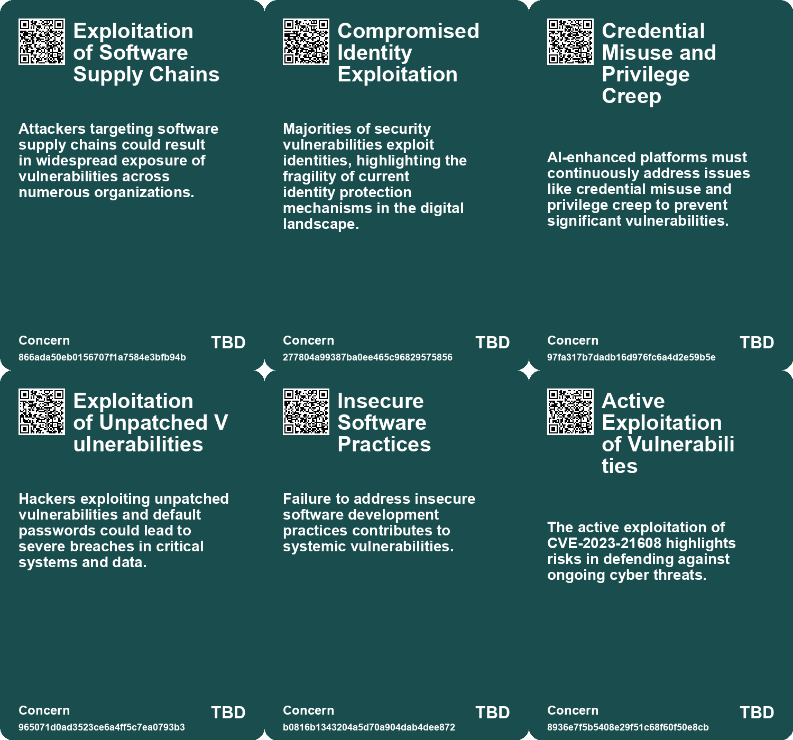
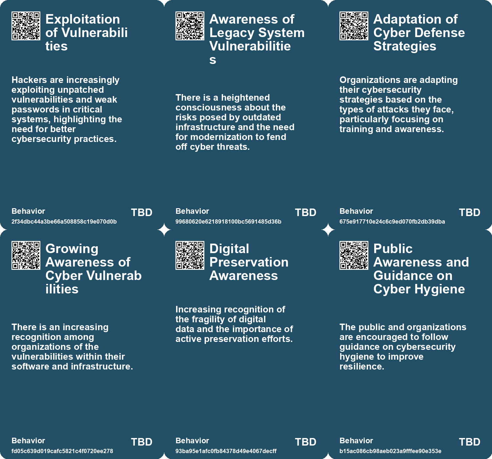
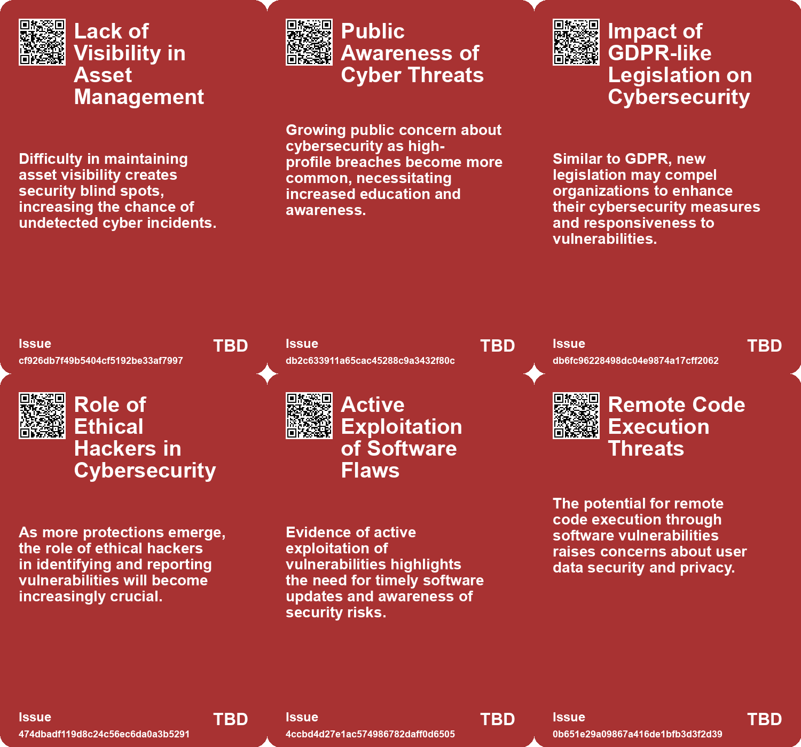
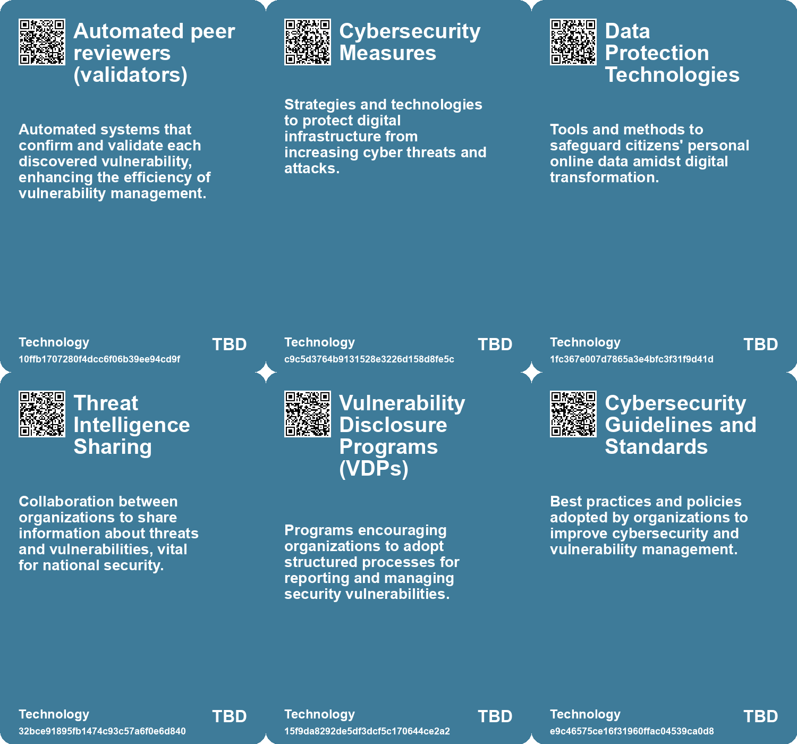

# *Topic*: Digital Vulnerability Awareness

# Summary

Cybersecurity remains a pressing concern across various sectors, with heightened threats from both state-sponsored and independent actors. U.S. cyber agencies have issued warnings about potential attacks from Iranian-affiliated hackers targeting critical infrastructure, particularly in energy, water, and healthcare sectors. Organizations are urged to strengthen their defenses against ransomware and other politically motivated cyber threats. The water sector, in particular, faces increasing vulnerabilities, prompting government agencies to recommend enhanced security measures and legislative efforts to protect vital infrastructure.

The job market in cybersecurity is experiencing turbulence due to economic uncertainty, leading to layoffs and budget cuts. Despite the challenges, there are still numerous open positions in top cybersecurity firms. Job seekers are encouraged to leverage networking and accurate market data to navigate this difficult landscape. Meanwhile, the introduction of a national safe harbor framework for ethical hackers in Belgium aims to encourage vulnerability reporting, potentially leading to more robust security practices across Europe.

The integration of artificial intelligence (AI) into cybersecurity is a double-edged sword. While AI is being used to enhance security measures, it also presents new vulnerabilities. The rise of AI-driven cybercrime, including automated phishing and voice cloning attacks, is alarming. The UK's National Cyber Security Centre has warned that AI is making it easier for novice criminals to execute sophisticated attacks, particularly ransomware. Organizations are urged to adopt proactive strategies, such as zero-trust frameworks and real-time risk assessments, to combat these evolving threats.

Data breaches continue to pose significant risks, as seen in the recent incident involving the VW Group, where sensitive information of electric vehicle owners was exposed due to poor cloud security. This incident underscores the need for improved cybersecurity measures in the automotive industry. Similarly, a significant breach in the U.S. Department of Justice linked to the SolarWinds software highlights the ongoing threat of cyber espionage, affecting multiple federal agencies and tech companies.

The importance of digital safety education is gaining recognition, particularly among younger populations. Initiatives in Telangana, India, aim to teach students about online scams and cyber hygiene, emphasizing the need for digital awareness to combat rising cybercrimes targeting women and children. This educational approach is crucial as the digital landscape continues to evolve, with old online content, or "digital zombies," resurfacing to create reputational and legal challenges for individuals.

The U.S. Department of Defense is actively addressing cybersecurity through its 2023 Cyber Strategy, which focuses on enhancing the cyber capabilities of allies and partners. This strategy includes initiatives to disrupt cybercriminal infrastructure and improve the resilience of critical systems. Additionally, the DoD is conducting AI Bias Bounty exercises to identify and mitigate risks in AI systems, reflecting a growing awareness of the ethical implications of technology in cybersecurity.

Finally, the need for effective data preservation strategies is becoming increasingly urgent in the digital age. As digital files face obsolescence, organizations are exploring solutions to ensure valuable information remains accessible. The World Bank and the International Telecommunication Union have updated their regulatory frameworks to address these challenges, emphasizing the importance of universal internet access and data protection in fostering a secure digital economy.

# Seeds

|    | name                                                | description                                                                                           | change                                                                                                                     | 10-year                                                                                                                  | driving-force                                                                                                                         |
|---:|:----------------------------------------------------|:------------------------------------------------------------------------------------------------------|:---------------------------------------------------------------------------------------------------------------------------|:-------------------------------------------------------------------------------------------------------------------------|:--------------------------------------------------------------------------------------------------------------------------------------|
|  0 | Default Password Risks                              | Insecure software and default passwords contribute to cybersecurity vulnerabilities.                  | Shift from acceptance of default passwords to a culture of secure software practices.                                      | In 10 years, secure coding practices will be standard, reducing vulnerabilities from default settings.                   | Growing awareness of cybersecurity risks will drive the push for secure software development.                                         |
|  1 | Erosion of Trust in Software Providers              | Increased skepticism towards software companies due to undetected vulnerabilities.                    | A change from reliance on software firms to questioning their security measures and practices.                             | In ten years, organizations may demand greater transparency and security guarantees from software providers.             | High-profile breaches have led to a demand for accountability and better security practices from tech companies.                      |
|  2 | Corporate Adoption of Security Trends               | Companies are increasingly recognizing the value of security researchers and VDPs.                    | Shift from ignorance to recognition of security researchers' contributions to cybersecurity.                               | In the future, companies may proactively engage with security researchers as partners in safeguarding systems.           | The urgent need to mitigate cyber risks and leverage external expertise for better security.                                          |
|  3 | Cyber Security Guidance for Businesses              | New guidance published for business leaders to improve cyber security practices.                      | Businesses are beginning to recognize cyber security as a critical financial issue.                                        | In ten years, cyber security may be integrated into core business strategies across sectors.                             | The recognition of cyber threats as vital business concerns drives enhanced security measures.                                        |
|  4 | Public Awareness of Cyber Threats                   | Increased public and organizational awareness of the cyber security landscape.                        | Public awareness of cyber threats is growing, leading to better preparedness.                                              | In ten years, public and organizational readiness for cyber threats will be significantly improved.                      | Rising incidents of cyber attacks prompt a need for greater awareness and education.                                                  |
|  5 | Increase in IoT Device Exploits                     | Cybercriminals are using known vulnerabilities to exploit PV systems.                                 | From isolated incidents to a systematic approach targeting known vulnerabilities in IoT devices.                           | In a decade, there may be improved global collaboration to mitigate IoT vulnerabilities across industries.               | The ongoing evolution of cyber threats and the need for better security in IoT ecosystems.                                            |
|  6 | Increased collaboration in vulnerability discovery  | Collaborative efforts by researchers lead to quicker identification and reporting of vulnerabilities. | From isolated discovery to collaborative approaches in cybersecurity research.                                             | Stronger partnerships between security researchers and software vendors may enhance software security.                   | The need for collective defense strategies in the evolving cybersecurity landscape.                                                   |
|  7 | Increased Cyber Threats to Water Sector             | Growing incidents of cyberattacks on water utilities indicate heightened vulnerability.               | The water sector is shifting from underestimating cyber risks to prioritizing cybersecurity measures.                      | In 10 years, water utilities will adopt advanced cybersecurity frameworks and technologies to safeguard against threats. | The increasing sophistication and frequency of cyberattacks drive the need for enhanced security measures in critical infrastructure. |
|  8 | Increased Awareness of Infrastructure Vulnerability | Rising incidents raise awareness about the vulnerabilities of water infrastructure to cyber threats.  | Awareness is shifting from ignorance about vulnerabilities to a proactive stance on cybersecurity in water infrastructure. | In a decade, water infrastructure will be designed with built-in cybersecurity measures as a standard practice.          | Incidents of cyberattacks and their potential impacts prompt a reevaluation of existing infrastructure vulnerabilities.               |
|  9 | Emergence of Bug Bounty Programs                    | DoD launches 'Hack the Pentagon' to engage security researchers in vulnerability discovery.           | Move from traditional security measures to community-driven cybersecurity initiatives.                                     | A culture of proactive vulnerability discovery will enhance national cybersecurity resilience.                           | Incentivizing external expertise to uncover and fix vulnerabilities in defense systems.                                               |

# Concerns

|    | name                                                     | description                                                                                                                                               |
|---:|:---------------------------------------------------------|:----------------------------------------------------------------------------------------------------------------------------------------------------------|
|  0 | Exploitation of Software Supply Chains                   | Attackers targeting software supply chains could result in widespread exposure of vulnerabilities across numerous organizations.                          |
|  1 | Compromised Identity Exploitation                        | Majorities of security vulnerabilities exploit identities, highlighting the fragility of current identity protection mechanisms in the digital landscape. |
|  2 | Credential Misuse and Privilege Creep                    | AI-enhanced platforms must continuously address issues like credential misuse and privilege creep to prevent significant vulnerabilities.                 |
|  3 | Exploitation of Unpatched Vulnerabilities                | Hackers exploiting unpatched vulnerabilities and default passwords could lead to severe breaches in critical systems and data.                            |
|  4 | Insecure Software Practices                              | Failure to address insecure software development practices contributes to systemic vulnerabilities.                                                       |
|  5 | Active Exploitation of Vulnerabilities                   | The active exploitation of CVE-2023-21608 highlights risks in defending against ongoing cyber threats.                                                    |
|  6 | Increased Attack Surface of PDF Applications             | With multiple vulnerabilities like CVE-2023-21608 being targeted, PDF applications present a vulnerable attack surface for cyber threats.                 |
|  7 | Digital literacy and safety education                    | Need for improved education on digital safety, especially among vulnerable groups like students, to combat cyber threats.                                 |
|  8 | Insecure IoT Devices                                     | Continued reliance on poorly secured IoT devices could lead to widespread vulnerabilities and attacks on personal and national infrastructure.            |
|  9 | Emerging Technologies and Cybercapabilities Intersection | The exploration of new technologies in cybersecurity could lead to unforeseen vulnerabilities if not carefully evaluated.                                 |

# Cards

## Concerns

## Behaviors

## Issue

## Technology

# Links

* [Unraveling a Major Cyberespionage Campaign: The SolarWinds Hack Incident](https://futures.kghosh.me/60d708d49e171255bc45464e0b5e6a6a)
* [Understanding Digital Zombies: Managing the Threats of Online Activity and Privacy](https://futures.kghosh.me/20892c25b0e91262ff5377f30ae5b938)
* [UK Cyber Security Chief Warns of Rising AI-Assisted Ransomware Threats](https://futures.kghosh.me/1c3d82ee939ffa81f9376cb961a20f46)
* [Belgium Implements Comprehensive Legal Protections for Ethical Hackers, Leading EU in Cybersecurity Policy](https://futures.kghosh.me/8ae26b7eeafce0d7e88a3f1e7cadcfd7)
* [Enhancing Cyber Insurance Accessibility and Affordability Through AI Innovations](https://futures.kghosh.me/724dfbad882cc57ee4e3526f4f43327b)
* [Biden Administration Unveils New Cybersecurity Strategy to Combat Growing Threats](https://futures.kghosh.me/1eaefdcf11b24d5f443b5f4e7645e0a5)
* [Challenges and Opportunities in the 2023 Cybersecurity Job Market: Insights and Strategies](https://futures.kghosh.me/0ab36af538bf262c85b73fa7e7bd657f)
* [VW Group Data Breach Exposes 800,000 EV Owners' Sensitive Information, Raising Cybersecurity Concerns](https://futures.kghosh.me/74093ff7c82ad21987f693911e97634c)
* [Xbow: The AI Chatbot Outperforming Human Hackers in Cybersecurity](https://futures.kghosh.me/8f69e7bae0b7871d4fd09375a6f4cfdd)
* [Urgent Warning: Threats from Iranian Cyber Hackers to U.S. Critical Infrastructure](https://futures.kghosh.me/605e2654bd3bbaa502827084ca7a44be)
* [The Digital Regulation Handbook: A Comprehensive Guide to Digital Transformation and Regulation](https://futures.kghosh.me/a38960ed1dcfd200d74ebd16e92e4151)
* [Preserving Our Digital Future: The Challenge of Avoiding a Digital Dark Age](https://futures.kghosh.me/86e67181c4dcbce08848023aa2929bcb)
* [White House Launches Initiative to Secure Open Source Software in Critical Infrastructure](https://futures.kghosh.me/925e58163f39d747785e0e85eeea0f25)
* [Safeguarding the UK's Energy Sector: The Cybersecurity Challenge in an AI Era](https://futures.kghosh.me/58871ce6d54ebbaf1ac529fa1376eb2a)
* [Generative AI: Transforming Identity Security and Governance Amidst Rising Threats](https://futures.kghosh.me/06af6687242788a345b934758b3a0705)
* [Publicly Accessible PV Monitoring Systems Pose Cybersecurity Risks](https://futures.kghosh.me/3ac657f7b32d24bb43bddca058e2db25)
* [Addressing Threats to Democracy: Strategies for Resilience Against Misinformation and Manipulation](https://futures.kghosh.me/56d1a28746cd95ebaa3d62a4e1f91c3a)
* [Overview of Cyber Threats in the UK: Insights from the 2023 Cyber Security Breaches Survey](https://futures.kghosh.me/576f8cf76f713e057b075e2424ea709c)
* [Google's 2026 Cybersecurity Forecast: The Rise of AI-Driven Cybercrime and Nation-State Threats](https://futures.kghosh.me/5cbd39db8f9df76ceec518a276cd7d17)
* [Overview of the US DoD's 2023 Cyber Strategy: Enhancing Cyber Defense and Partnerships](https://futures.kghosh.me/f88aebcf579dffa42fc0dbe74de919c4)
* [Growing Cybersecurity Threats to Water Infrastructure Demand Immediate Action and Collaboration](https://futures.kghosh.me/fb9b2211d0fcea8245837d9b34379d9f)
* [CISA's Red Team Exercise Uncovers Major Security Flaws in Federal Agency After Five Months Undetected](https://futures.kghosh.me/8ce2e3c9b07df17c316a67b21e7397a9)
* [Transforming Water Utilities: Addressing Security and Sustainability Challenges through Innovation](https://futures.kghosh.me/d54442ea6fe7853d0f8674688c9b7064)
* [CISA Adds High-Severity Adobe Acrobat Reader Vulnerability to KEV Catalog](https://futures.kghosh.me/089706e00a9c0d142049a6a6c557e3e7)
* [Department of Defense Launches AI Bias Bounty to Detect Bias in AI Systems](https://futures.kghosh.me/012558fa97aeed65d7ca86de4a6c1cbd)
* [Empowering Students Against Cybercrime: Telangana's Cyber Ambassador Program](https://futures.kghosh.me/b9256c2eb50c1c3e1ea2df625cf259ec)