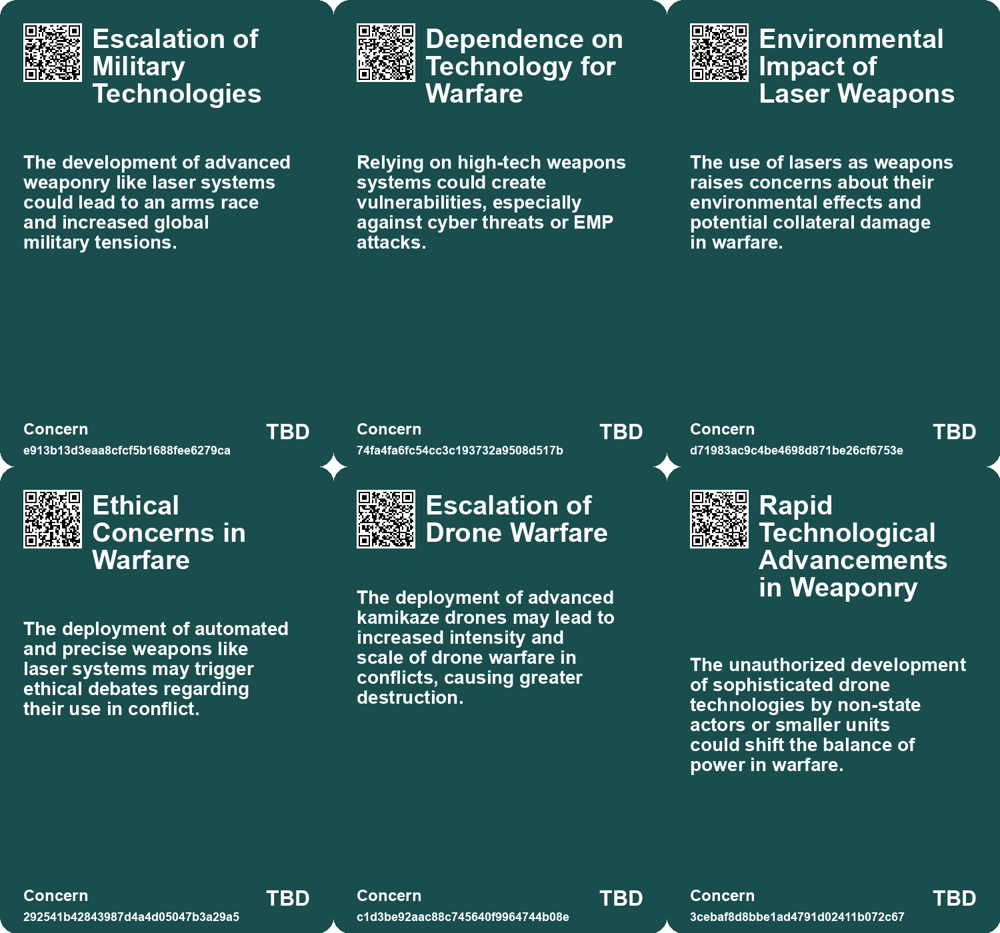
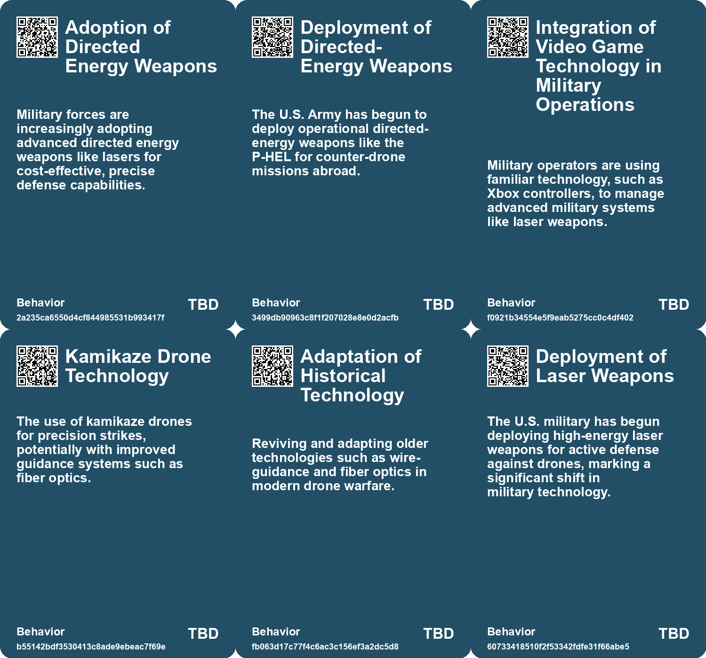
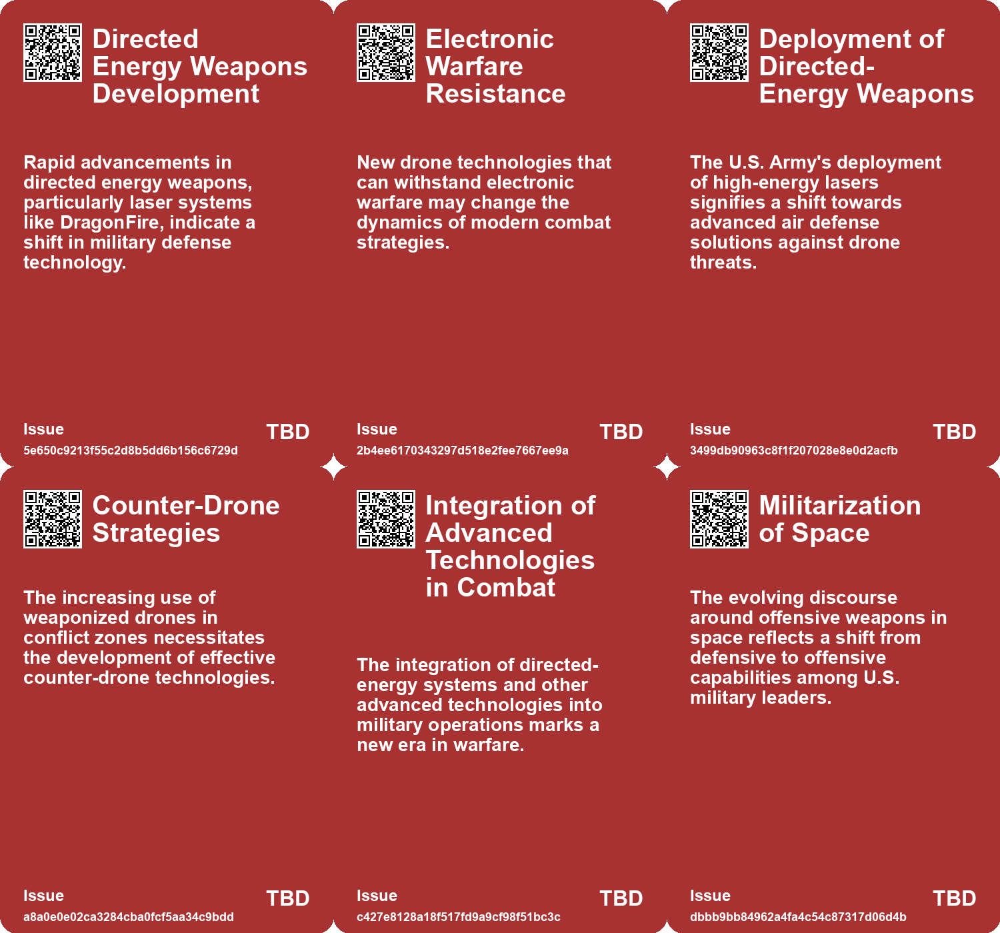
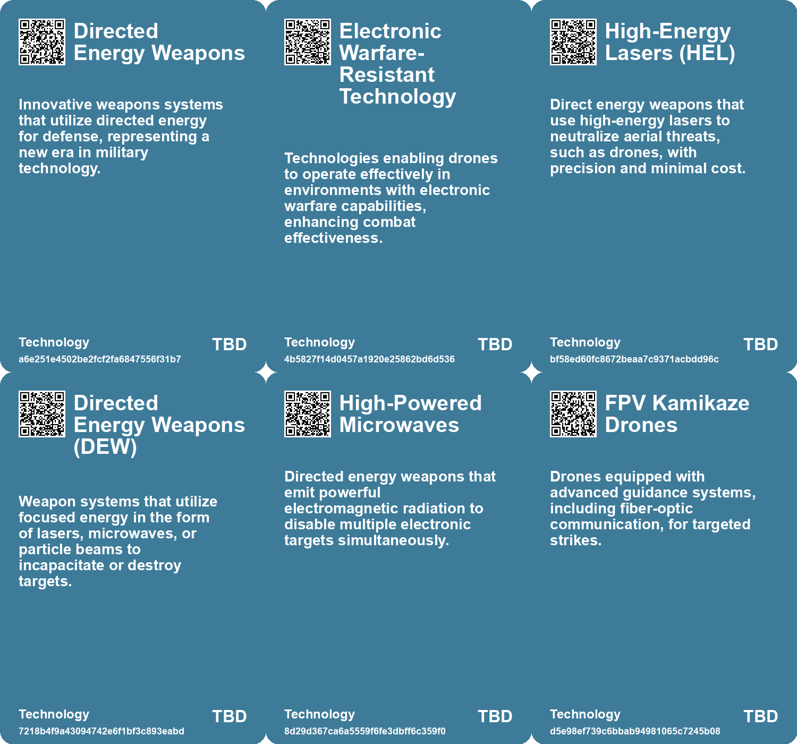

# *Topic*: Directed Energy Weapons

# Summary

The deployment of advanced military technologies is reshaping modern warfare, with a focus on directed-energy weapons and drone capabilities. The U.S. Army has made significant strides by deploying high-energy laser systems, specifically the Palletized High Energy Laser (P-HEL), to counter enemy drones. This marks a historic moment as it is the first public use of laser weapons for air defense. Similarly, the UK's Ministry of Defence is investing in the DragonFire laser weapon system, which aims to enhance naval defense capabilities and create jobs in the UK.

Drones continue to play a pivotal role in contemporary conflicts, particularly in the ongoing war between Russia and Ukraine. Ukraine has been leveraging drones for precision strikes and logistics, but faces challenges from Russian electronic warfare that disrupts drone operations. In response, Ukraine has developed innovative technologies like Eagle Eyes, which allows drones to navigate without communication signals. The introduction of the Brave1 kamikaze drone further enhances Ukraine's offensive capabilities, showcasing the importance of technological advancements in warfare.

The rise of artificial intelligence (AI) in military applications is another critical theme. Nations are investing heavily in lethal autonomous weapons, raising ethical concerns about machines making life-and-death decisions. The United Nations is addressing these issues, aiming to establish regulations on autonomous weapons by 2026. The integration of AI is also evident in the development of drones that utilize fiber-optic communication to evade jamming, presenting new challenges for counter-drone systems.

Space defense strategies are evolving as nations like the U.S. and European countries seek to maintain dominance in space amid rising threats from adversaries. The U.S. Space Force is prioritizing offensive capabilities to deter potential conflicts, while European leaders are discussing the establishment of a defense network to counter drone incursions, particularly from Russia. The urgency for enhanced military capabilities in space is underscored by the need for integrated approaches across various domains.

Cybersecurity remains a pressing concern, particularly in the energy sector. The UK's energy infrastructure faces increased threats from cybercriminals, exacerbated by outdated systems. Proactive measures, such as adopting zero-trust frameworks and modern security protocols, are essential to protect critical infrastructure. The intersection of AI and cybersecurity is crucial for ensuring resilience against evolving threats.

Nuclear fusion technology is gaining attention as a potential solution for sustainable energy. Recent breakthroughs in fusion research, including advancements at the Lawrence Livermore National Laboratory and the inauguration of the JT-60SA reactor in Japan, highlight the promise of fusion as a clean energy source. However, significant engineering challenges remain before fusion can be commercially viable.

The integration of innovative technologies extends beyond military applications. Researchers at the University of Texas at Dallas have developed a wireless power transfer system for drones, which could revolutionize recharging methods for various devices. This technology has implications for electric vehicles and wearable devices, showcasing the potential for advancements in energy solutions.

As nations navigate the complexities of modern warfare and technological advancements, the interplay between military capabilities, cybersecurity, and energy solutions will shape the future landscape of global security.

# Seeds

|    | name                                                  | description                                                                                                   | change                                                                                              | 10-year                                                                                                         | driving-force                                                                                           |
|---:|:------------------------------------------------------|:--------------------------------------------------------------------------------------------------------------|:----------------------------------------------------------------------------------------------------|:----------------------------------------------------------------------------------------------------------------|:--------------------------------------------------------------------------------------------------------|
|  0 | Emergence of Directed Energy Weapons                  | The UK is developing advanced Directed Energy Weapons, starting with the DragonFire laser system.             | Transition from traditional weapons systems to advanced directed energy systems.                    | Directed energy weapons may become the primary defense technology in military operations.                       | The need for cost-effective, precise, and innovative defense solutions.                                 |
|  1 | Increased Investment in Defense Technology            | The UK government is investing nearly £1 billion in directed energy weapons this Parliament.                  | Shift in defense procurement from traditional methods to innovative technology-focused investments. | Defense budgets may increasingly prioritize emerging technologies over conventional systems.                    | National security concerns and the push for modernized technology in defense.                           |
|  2 | Electronic Warfare Advancements                       | Technological advancements in overcoming electronic warfare capabilities indicate future military strategies. | Shift from vulnerable military assets to resilient technologies countering EW tactics.              | Future battles may increasingly feature technologies specifically designed to neutralize jamming.               | The ongoing arms race in military technology fuels developments in electronic warfare countermeasures.  |
|  3 | Deployment of High-Energy Lasers                      | The U.S. Army has deployed high-energy laser systems for operational air defense against drones.              | Transitioning from experimental testing of laser weapons to operational deployment in combat zones. | Potential widespread adoption of directed-energy systems as standard air defense solutions for military forces. | Increasing threats from drone warfare necessitate innovative and cost-effective defensive technologies. |
|  4 | Cost-Effective Counter-Drone Solutions                | Laser weapons provide a significantly lower cost per shot compared to traditional munitions.                  | Moving from expensive conventional missiles to cheaper directed-energy alternatives.                | Military budgets may shift focus towards more cost-effective directed-energy technologies for defense.          | The need to reduce defense spending while maintaining effective operational capabilities.               |
|  5 | Integration of Directed Energy in Military Operations | The Army is integrating directed-energy weapons into various platforms and units.                             | From separate experimental systems to integrated defense solutions across military units.           | Directed-energy weapons could become standard equipment across all military branches.                           | The push for modernization and efficiency in military capabilities.                                     |
|  6 | Dynamic Beamforming for Power Transfer                | Using telemetry and phased-array antennas to direct power beams to moving UAVs.                               | Advancing from static power sources to dynamic, real-time power transfer systems.                   | In a decade, power transfer systems may adapt to moving targets across various applications.                    | The evolution of autonomous vehicles and the need for continuous power supply.                          |
|  7 | Emerging Technologies in Counterspace Operations      | Discussion on various counterspace capabilities including electronic warfare and lasers.                      | From traditional military capabilities to modern tech-driven counterspace strategies.               | Technological advancements could redefine how nations engage in space warfare.                                  | The need for effective counterspace capabilities drives technological innovation.                       |
|  8 | Deployment of Laser Weapons                           | The US Army has deployed high-energy laser systems in combat for the first time.                              | Changing from traditional explosive weaponry to directed-energy systems for air defense.            | In a decade, laser weapons could become standard in military engagements globally.                              | The increasing threat of cheap drones and missile attacks driving demand for cost-effective solutions.  |
|  9 | Cost-Effectiveness of Laser Weapons                   | Laser weapons offer a much lower cost-per-shot compared to traditional munitions.                             | Transition from high-cost missiles to low-cost laser systems for air defense.                       | Military budgets may increasingly allocate resources toward laser technology development.                       | Need for cost-effective solutions in the face of rising military expenditures.                          |

# Concerns

|    | name                                         | description                                                                                                                                        |
|---:|:---------------------------------------------|:---------------------------------------------------------------------------------------------------------------------------------------------------|
|  0 | Escalation of Military Technologies          | The development of advanced weaponry like laser systems could lead to an arms race and increased global military tensions.                         |
|  1 | Dependence on Technology for Warfare         | Relying on high-tech weapons systems could create vulnerabilities, especially against cyber threats or EMP attacks.                                |
|  2 | Environmental Impact of Laser Weapons        | The use of lasers as weapons raises concerns about their environmental effects and potential collateral damage in warfare.                         |
|  3 | Ethical Concerns in Warfare                  | The deployment of automated and precise weapons like laser systems may trigger ethical debates regarding their use in conflict.                    |
|  4 | Escalation of Drone Warfare                  | The deployment of advanced kamikaze drones may lead to increased intensity and scale of drone warfare in conflicts, causing greater destruction.   |
|  5 | Rapid Technological Advancements in Weaponry | The unauthorized development of sophisticated drone technologies by non-state actors or smaller units could shift the balance of power in warfare. |
|  6 | Debris Generation                            | Deploying kinetic weapons in space could create significant debris, jeopardizing future space operations and increasing collision risks.           |
|  7 | AI-Driven Targeting Errors                   | AI weapons risk making catastrophic mistakes in target selection, leading to unintended civilian casualties.                                       |
|  8 | Dependence on Laser Weapons                  | Increased reliance on laser weapon technology could create vulnerabilities if systems fail operationally.                                          |
|  9 | Potential Ethical Concerns                   | Deployment of directed-energy weapons raises ethical issues related to the nature of warfare and civilian safety.                                  |

# Cards

## Concerns

## Behaviors

## Issue

## Technology

# Links

* [Exploring the Innovative Fiber-Optic Communication in Russian Kamikaze Drones](https://futures.kghosh.me/94eef963c78af554a74cfb0a92209944)
* [MIT's Controversial Ties to Israeli Military Funding and Student Protests](https://futures.kghosh.me/0d4171563ade773e41ab3c5949dccb52)
* [European Leaders Address Drone Threats and Strengthen Defense Strategies Against Hybrid War](https://futures.kghosh.me/38f4bf649d0757debecb51a159c59887)
* [EUROfusion Leverages AI and Machine Learning to Enhance Fusion Energy Research and Development](https://futures.kghosh.me/bd445839c71314d0f39e5d8288e7aeaf)
* [The Deployment of Laser Weapons: A New Era in Military Air Defense](https://futures.kghosh.me/6edce3de8121a1d42c8e7aac1cc18323)
* [U.S. Army's Initiative to Use High-Altitude Balloons for Drone Swarms and ISR Operations](https://futures.kghosh.me/4d4f8bb17a5a7e5a852786591e70ffc8)
* [EU and NATO Mobilize for Enhanced Drone Defense Amid Ongoing Russian Threats in Ukraine](https://futures.kghosh.me/3e4c925ac500834d9f4d986e418bcc26)
* [Ukraine's Strategic Shift: Investing in Land Robots and Domestic Arms Production](https://futures.kghosh.me/6860a1a22c22dc8bdb8a95d66320925b)
* [University of Texas Team Develops Wireless Charging Tech for Drones and Beyond](https://futures.kghosh.me/442dee7d7ffa984ba157b0d7bce3add0)
* [Ukraine Develops AI Software to Counteract Russian Drone Jamming](https://futures.kghosh.me/c53d8deebd79b3b56d65c227875d65e6)
* [Israel's Arrow Missile Defense System Achieves Historic Interception of Houthi Missile](https://futures.kghosh.me/dfc7ce150fa3c7f91ae6b846623df7f2)
* [Transforming Warfare: The Role of Uncrewed Systems in Modern Military Strategy](https://futures.kghosh.me/df83d0064f88153a92b016bc412f6b97)
* [Safeguarding the UK's Energy Sector: The Cybersecurity Challenge in an AI Era](https://futures.kghosh.me/58871ce6d54ebbaf1ac529fa1376eb2a)
* [Green Berets Showcase Cyber Warfare Skills in NATO Exercise Swift Response 24](https://futures.kghosh.me/58bfce5efba9086072a6ad50dbc26725)
* [Russia's Shahed Drones Reportedly Equipped with Starlink Terminals Amid Ongoing Conflict](https://futures.kghosh.me/67c8d04710352174e3a5f61ab700043c)
* [Lawrence Livermore Laboratory Achieves Breakthrough in Nuclear Fusion Energy Generation](https://futures.kghosh.me/136f0479a4a508ee27ea66d38d8d2b41)
* [U.S. Army's Deployment of Patriot Missiles Amid Heightening Global Tensions and Demand](https://futures.kghosh.me/e7d130a11e7f432efd9d3c5bcbcad482)
* [UK's Groundbreaking DragonFire Laser Weapon Set to Transform Royal Navy by 2027](https://futures.kghosh.me/158d2e015bb34038ecf3cd9a3c405841)
* [Ukrainian Drones Attack Russian Ground Robots: A Rare Instance of Drone-on-Drone Combat](https://futures.kghosh.me/e1c2bc61b45e6587c4cc278532416665)
* [U.S. Army Deploys High-Energy Lasers for Counter-Drone Operations Overseas](https://futures.kghosh.me/9ede94d7b77e4a5a6316ba0271d5f561)
* [Betavolt Technology Unveils 50-Year Lifespan Nuclear Batteries for Personal Devices](https://futures.kghosh.me/0bf800ce5670b171372104f147e0c878)
* [The Rise of Lethal Autonomous Weapons: Ethical and Regulatory Challenges in Modern Warfare](https://futures.kghosh.me/7f25552b9124a4dc3833e782ef331275)
* [Japan Launches World's Largest Experimental Nuclear Fusion Reactor, JT-60SA, to Explore Clean Energy Solutions](https://futures.kghosh.me/1c46960244111ec5f16e85701a85e602)
* [Ukraine Unveils Brave1 Drones: Electronic Warfare-Resistant Kamikaze Technology with 31-Mile Range](https://futures.kghosh.me/fcc056c1ff7bd727a512e8b77f936c54)
* [U.S. Military Leaders Emphasize Need for Offensive Counterspace Weapons Amid Growing Threats](https://futures.kghosh.me/14449a59854fc9db2d294ba484581701)