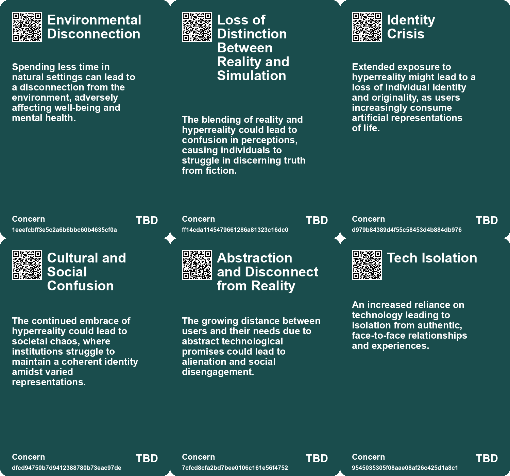
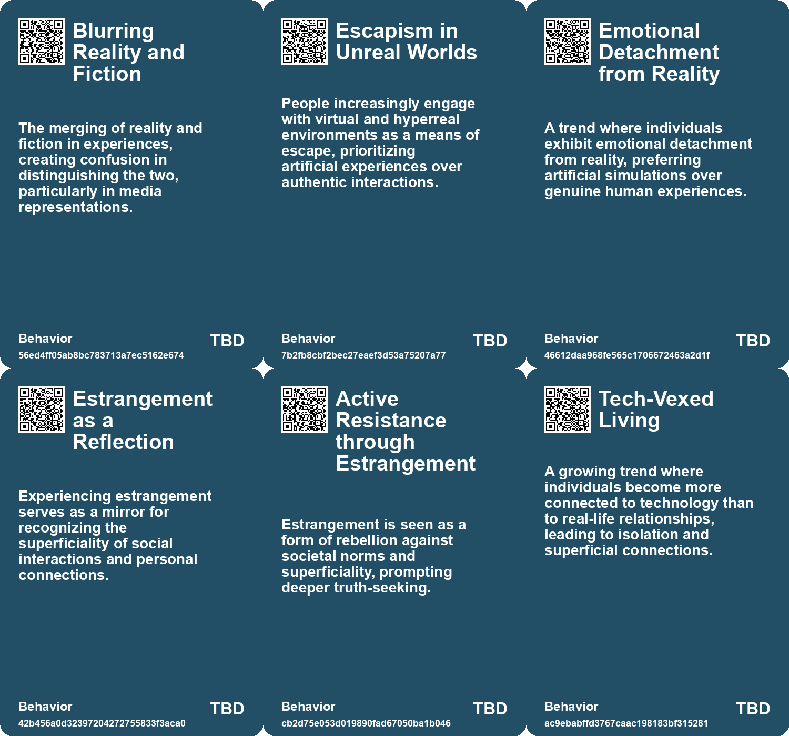
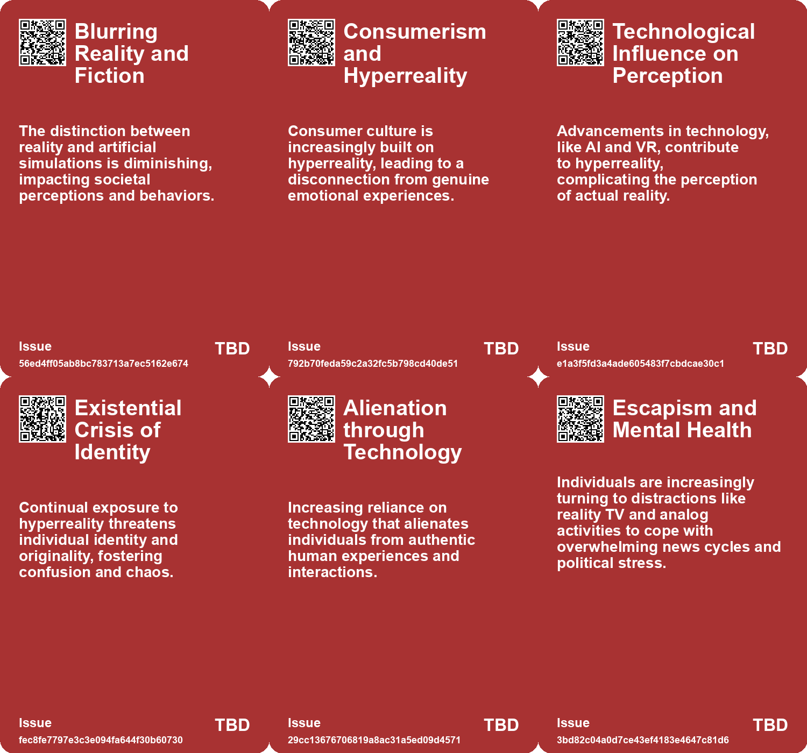
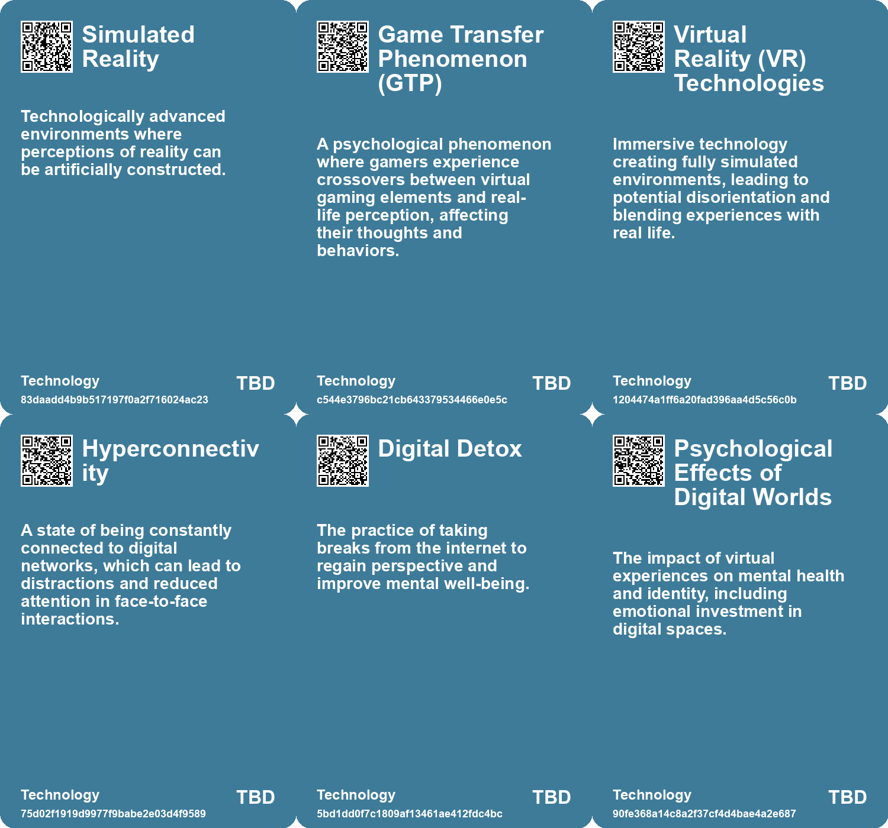

# *Topic*: Disconnection from Reality

# Summary

The intersection of technology and human experience is a recurring theme in contemporary discourse, revealing both the benefits and challenges posed by digital advancements. The impact of technology on mental health and social interactions is evident, as seen in the phenomenon of Game Transfer Phenomenon (GTP), where gamers experience real-world effects from their virtual experiences. This raises concerns about the mental health implications of increasingly realistic games, particularly for younger players. 

Escapism has become a coping mechanism for many, especially in the wake of political fatigue. Individuals are turning to reality TV and low-stakes activities to avoid the negativity of constant news cycles. This shift reflects a broader trend of withdrawing from political engagement, as people seek solace in curated information channels and reliable sources, distancing themselves from the chaos of social media.

The influence of technology extends to education, where a frustrated teacher highlights a crisis stemming from students' addiction to smartphones. This addiction has led to declines in motivation and cognitive skills, prompting calls for awareness and action against the detrimental effects of technology on learning. The rise of AI further complicates this landscape, as concerns grow over students outsourcing critical thinking and writing to machines, potentially de-skilling future generations.

Amidst these challenges, there is a push for deeper human connections and authentic experiences. The contrast between meaningful interactions and superficial, technology-driven engagements is stark. The importance of cultivating awe and genuine relationships is emphasized, as individuals navigate a world increasingly dominated by digital distractions. The concept of continuous partial attention illustrates how our hyper-connected lives dilute our ability to engage fully with others, impacting both personal and professional relationships.

The commodification of experiences and emotions is another critical theme. The notion of "Everything as a Service" reflects a transactional mindset that permeates society, leading to dissatisfaction and a sense of emptiness. This perspective critiques the outsourcing of personal agency and fulfillment, urging individuals to seek meaning from within rather than relying on external validation.

In the realm of entertainment and media, the tension between the promises of technology and its actual capabilities is palpable. Events like the Consumer Electronics Show reveal a disconnect between the hype surrounding AI and the reality of its limitations. This skepticism extends to the evolving landscape of simulation technologies in video games, where the quest for realism raises ethical questions about environmental impact and ownership in digital spaces.

Finally, the exploration of hallucinogens and hypnosis highlights the diverse ways individuals seek altered states of consciousness. From cultural practices to therapeutic applications, these substances offer insights into the human experience and the complexities of perception. The discussion around these topics underscores the ongoing quest for understanding and connection in an increasingly fragmented world.

# Seeds

|    | name                                    | description                                                                                                 | change                                                                                                 | 10-year                                                                                                          | driving-force                                                                                                       |
|---:|:----------------------------------------|:------------------------------------------------------------------------------------------------------------|:-------------------------------------------------------------------------------------------------------|:-----------------------------------------------------------------------------------------------------------------|:--------------------------------------------------------------------------------------------------------------------|
|  0 | Blending of Reality and Fiction         | Modern culture has blurred the lines between what is real and what is fictional, impacting perceptions.     | Moving from clear distinctions between reality and fiction to a seamless integration of both.          | In a decade, experiences may favor hyperreal interactions over genuine reality, impacting social dynamics.       | Technological advancements enable immersive experiences that synthesize reality and fiction, redefining engagement. |
|  1 | Hyperreality in Entertainment           | Hyperreality creates experiences in entertainment venues like Disneyland that feel real yet are fabricated. | Transitioning from authentic experiences to curated hyperreal environments that overshadow reality.    | Theme parks and entertainment may become entirely virtualized, reducing physical spaces for genuine interaction. | Consumer demand for immersive experiences drives the creation of hyperreal entertainment landscapes.                |
|  2 | Insensitivity to Surroundings           | Individuals exhibit apathy towards social situations and emergencies, attributed to phone usage.            | From community-oriented behavior to increased individualism and social detachment.                     | Potential cultural shifts emphasizing community awareness and social responsibility.                             | The need to revive empathetic engagement in society as a counter to tech addiction.                                 |
|  3 | Tech-vexed Living                       | The rise of technology leads to isolation from real human connections.                                      | Shift from physical social interactions to technology-mediated relationships.                          | Greater emotional disconnection in relationships, leading to societal challenges.                                | Increased reliance on technology for communication and entertainment.                                               |
|  4 | Hyperconnectivity Impacting Networking  | Hyperconnectivity is diminishing the quality of in-person networking experiences.                           | Moving away from meaningful connections to superficial online interactions.                            | Networking events may prioritize digital engagement over personal connections, changing their nature.            | The desire to remain connected online during in-person events drives this change.                                   |
|  5 | Waldenponding Movement                  | A growing trend of individuals retreating from technology for mental health.                                | Shift from engagement with digital platforms to a preference for digital detox.                        | Increased acceptance of digital detox as a lifestyle choice among many demographics.                             | Rising awareness of mental health issues related to technology use.                                                 |
|  6 | Digital Detox Movement                  | Increased interest in taking breaks from digital connectivity.                                              | A growing awareness of the need for offline time in a hyper-connected world.                           | More structured digital detox programs and societal acceptance of offline lifestyles.                            | The realization of the negative impacts of constant connectivity on mental health.                                  |
|  7 | Mental Health Concerns                  | Isolation and loneliness are rising due to digital technology's influence.                                  | Shift from community engagement to individual isolation exacerbated by technology.                     | In ten years, mental health issues related to loneliness may become a major public health crisis.                | Digital connectivity replaces physical interactions, leading to increased feelings of alienation.                   |
|  8 | Porous Membrane Concept in Digital Life | The boundary between physical and virtual lives is becoming increasingly blurred.                           | Shifting perception of the separation between virtual and physical realities.                          | Individuals may navigate a more fluid identity that integrates both physical and digital selves.                 | Advancements in technology facilitating deeper integration of virtual experiences.                                  |
|  9 | Hypnotized Society                      | Concerns about society becoming hypnotized by digital content and losing individual agency.                 | Shifting from conscious, active participation to a more passive, hypnotized state influenced by media. | A potential rise in collective behaviors driven by external digital influences rather than conscious thought.    | The dominance of social media and the internet in shaping societal norms and behaviors.                             |

# Concerns

|    | name                                               | description                                                                                                                                                         |
|---:|:---------------------------------------------------|:--------------------------------------------------------------------------------------------------------------------------------------------------------------------|
|  0 | Environmental Disconnection                        | Spending less time in natural settings can lead to a disconnection from the environment, adversely affecting well-being and mental health.                          |
|  1 | Loss of Distinction Between Reality and Simulation | The blending of reality and hyperreality could lead to confusion in perceptions, causing individuals to struggle in discerning truth from fiction.                  |
|  2 | Identity Crisis                                    | Extended exposure to hyperreality might lead to a loss of individual identity and originality, as users increasingly consume artificial representations of life.    |
|  3 | Cultural and Social Confusion                      | The continued embrace of hyperreality could lead to societal chaos, where institutions struggle to maintain a coherent identity amidst varied representations.      |
|  4 | Abstraction and Disconnect from Reality            | The growing distance between users and their needs due to abstract technological promises could lead to alienation and social disengagement.                        |
|  5 | Tech Isolation                                     | An increased reliance on technology leading to isolation from authentic, face-to-face relationships and experiences.                                                |
|  6 | Digital Retreat Mentality                          | Escaping to a disconnected lifestyle might reflect an avoidance of responsibility in participating meaningfully in societal information systems.                    |
|  7 | Anomie and Alienation                              | A societal condition characterized by normlessness due to rapid changes can cause individuals to feel disconnected and lost.                                        |
|  8 | Disconnection Despite Connectivity                 | The paradox of being more digitally connected while experiencing emotional and social disconnection in real life.                                                   |
|  9 | Impact of Digital Disconnection                    | Loss of access to virtual worlds can lead to significant psychological distress among users, highlighting the mental health ramifications of digital disconnection. |

# Cards

## Concerns

## Behaviors

## Issue

## Technology

# Links

* [Exploring Technology's Impact: Insights from Michael Harris on Life Before and After the Internet](https://futures.kghosh.me/357214f864be2592efced782b93b25b3)
* [The Crisis in Education: Students as Victims of Smartphone Addiction and Tech Overreach](https://futures.kghosh.me/a5688e452658f03667dfc0fe392e1f1d)
* [Exploring Hypnosis, Bicameral Mind, and Individual Agency in Modern Society](https://futures.kghosh.me/b7b7937de66bde57d6ca5ef00fd23cc9)
* [Exploring the Modern Entertainment Landscape and Its Societal Implications](https://futures.kghosh.me/c5c2c794f1426e6e307a9df3f9ff61f6)
* [Nostalgia for Pre-Smartphone Era: A Reflection on Simpler Times](https://futures.kghosh.me/06ca8cfe66a96c99e2830d74b7493668)
* [Exploring Goal Flexibility and AI's Impact on Creativity and Connection](https://futures.kghosh.me/94d31e760d2d34d7355ef3ee6bf47ffe)
* [Exploring Game Transfer Phenomenon: When Video Games Impact Reality](https://futures.kghosh.me/cb84d5c485fbaeeb34783dc5340cbf09)
* [Exploring the Intersection of Video Game Simulation and Real-World Ecology](https://futures.kghosh.me/57fcfcda347e1934e0c1da9fc212fcec)
* [Rediscovering Silence: The Need for Downtime in a Noisy World](https://futures.kghosh.me/6baa5e7c702f9608bef8029fe7db9156)
* [The Decline of Human Thinking in the Age of AI: A Call for Educational Reform](https://futures.kghosh.me/1909e5d11ae6f5dc49eb87e739bb1885)
* [The Shift from Political Engagement to Escapism in Post-Election America](https://futures.kghosh.me/ffdc204f7f00cafc0c71c5c32e83a713)
* [Exploring Urban Change and Psychological Responses in Austin's Transformation](https://futures.kghosh.me/e825171606432c71606dc78b9bf86eee)
* [Understanding Polarization: Healing Our Relationship with Technology and Embracing Diverse Perspectives](https://futures.kghosh.me/c1bb890337ef382bfaa5720c9fd05134)
* [Exploring Hallucinations: From Huichol Rituals to the Dreamachine Experience](https://futures.kghosh.me/efd4c52c6b463ea98a9302e343414689)
* [Five Emerging Trends Transforming Business in the Coming Year](https://futures.kghosh.me/55bac03899915f25bf0b47fa4342472c)
* [The Case Against Waldenponding: Embracing Digital Engagement Instead of Retreating](https://futures.kghosh.me/1f9f5c2997f105f07aba13ba1adb86e1)
* [Nostalgia for Simplicity: The Burden of Infinite Choice in Modern Life](https://futures.kghosh.me/7b316ebe449187b79e519a8c6d12a2cd)
* [Exploring the Disconnection Between AI Promises and Reality at CES 2023](https://futures.kghosh.me/761a3d9b508c2a1db7a6c60d1be5ec98)
* [The Impact of Continuous Partial Attention on Networking and Relationships in a Digital World](https://futures.kghosh.me/417df5448432cb603f40dec77f469b87)
* [The Emotional Impact of Losing Access to Virtual Worlds in Gaming](https://futures.kghosh.me/7ce06613470d821b81126a4378a0eb2e)
* [The Illusion of Online Activism in the Age of Trump: Embracing Real-World Action Instead](https://futures.kghosh.me/9f50450d1a7c46c073a928b6fa172c18)
* [Understanding Hyperreality: The Blurring Lines Between Reality and Fiction in Culture](https://futures.kghosh.me/28faebdbb8f547e4b2eaa7c6689982ec)
* [The Importance of Authentic Experiences and Awe in a Tech-Dominated World](https://futures.kghosh.me/ce43c884bb8eefce9268368190014a48)
* [The Emotional Impact of Virtual Reality and AI in Grieving Process](https://futures.kghosh.me/f97f969e4aadfbae3dee287de4ab721d)
* [Exploring the Dangers of Outsourcing Happiness and Personal Fulfillment in Modern Society](https://futures.kghosh.me/a5c0ba498382a4edc0f2bf0d9653ad16)