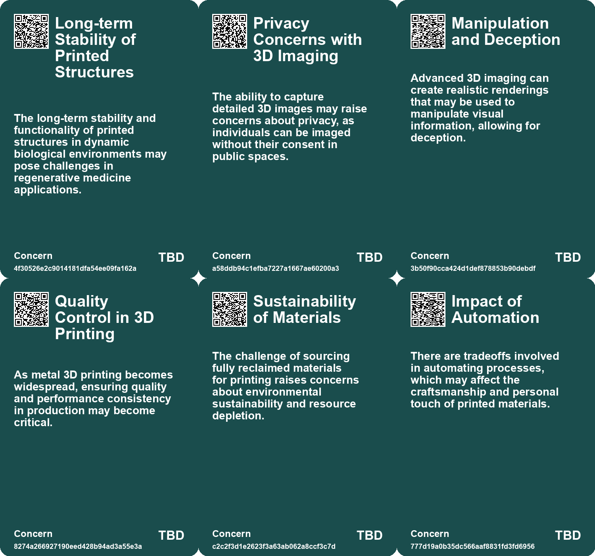
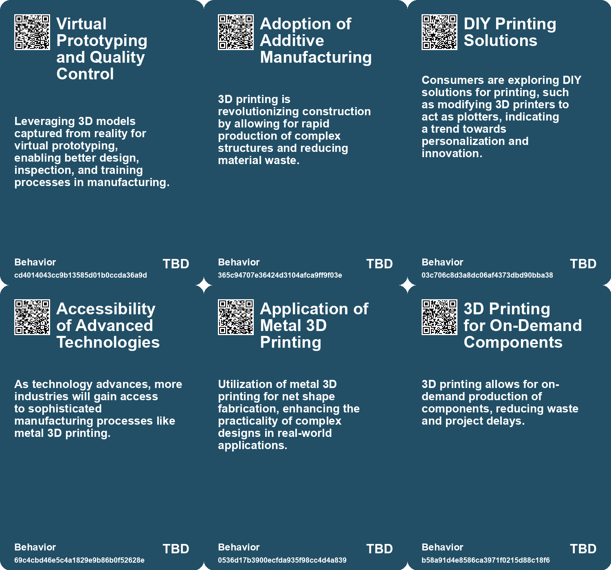
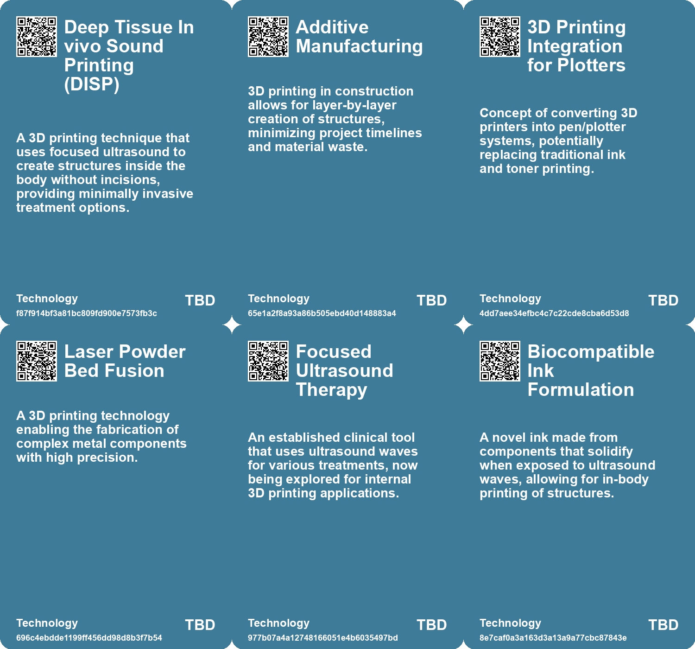

# *Topic*: 3D Printing

# Summary

The construction industry is undergoing a significant transformation driven by technological advancements and a growing emphasis on sustainability. Innovations such as Building Information Modeling (BIM), 3D printing, and digital twin technology are reshaping how buildings are designed and managed. These tools enhance collaboration among stakeholders and improve project efficiency. However, challenges like labor shortages and rising material costs persist, prompting the need for strategic partnerships and workforce development.

In the realm of manufacturing, new techniques are emerging that promise to revolutionize production processes. Rapid Liquid Print's Gravity Free Manufacturing technology allows for mass customization and the creation of complex designs without traditional limitations. This innovation, along with Canon's introduction of nanoimprint lithography, aims to simplify production methods and reduce costs in semiconductor manufacturing. Both developments highlight a shift towards more efficient and adaptable manufacturing practices.

Healthcare and bioprinting are also experiencing breakthroughs. The Deep tissue In vivo Sound Printing (DISP) technique enables the creation of biocompatible structures inside the body using focused ultrasound, potentially transforming cancer therapy and regenerative medicine. Similarly, researchers at the University of Cambridge are developing eco-friendly sensors that can be printed directly onto biological surfaces, offering new possibilities for health monitoring and environmental applications.

The integration of advanced technologies extends to the field of imaging and data collection. A new lensless camera captures 3D information with a single exposure, providing valuable applications in industrial inspection and robotics. This innovation, along with reality capture methods that transform real-world environments into digital data, underscores the importance of accurate data collection in various industries.

Sustainability remains a central theme across these advancements. The construction sector is increasingly prioritizing eco-friendly materials and practices, while the development of adaptive sensors and high-strength materials reflects a commitment to reducing environmental impact. As industries embrace these trends, the potential for enhanced productivity and profitability becomes evident.

The intersection of technology and everyday life is also explored through wearable tech. The concept of cyborg lifestyles, where human and machine merge, is gaining traction. Wearable devices are poised to revolutionize social interactions and access to innovations like augmented reality, although challenges remain in achieving seamless integration into daily routines.

Finally, the exploration of cross-disciplinary connections highlights the interplay between seemingly disparate fields. The application of astrophysics principles in semiconductor technology illustrates how insights from one domain can inform advancements in another. This blending of ideas fosters innovation and drives progress across various sectors, emphasizing the importance of curiosity and collaboration in shaping the future.

# Seeds

|    | name                                            | description                                                                                                   | change                                                                                                   | 10-year                                                                                                                  | driving-force                                                                                              |
|---:|:------------------------------------------------|:--------------------------------------------------------------------------------------------------------------|:---------------------------------------------------------------------------------------------------------|:-------------------------------------------------------------------------------------------------------------------------|:-----------------------------------------------------------------------------------------------------------|
|  0 | 3D Bioprinting Inside the Body                  | A new method enables 3D printing of soft tissues directly within the body without incisions.                  | From traditional surgical methods to a non-invasive ultrasound-guided printing technique.                | In a decade, surgeries may be largely replaced by non-invasive 3D printing methods for tissue repair and drug delivery.  | The push for less invasive medical technologies and personalized treatment strategies.                     |
|  1 | Rise of Additive Manufacturing                  | 3D printing is transforming how construction projects are executed and designed.                              | Transition from traditional construction methods to additive manufacturing for speed and efficiency.     | By 2035, 3D printing will be standard for building homes and infrastructure, reducing waste and costs.                   | The demand for faster, cheaper, and sustainable construction solutions is pushing this technology forward. |
|  2 | Development of Non-Cartridge Printing Solutions | Exploration of alternatives to traditional ink and toner cartridges, such as 3D printing or robotic plotters. | From ink-based printing to innovative methods that eliminate cartridges altogether.                      | Emergence of versatile printing technologies that do not rely on traditional cartridges, changing the market landscape.  | Innovation and consumer demand for more sustainable and efficient printing solutions.                      |
|  3 | Evolution of Metal 3D Printing Technology       | Emerging technologies in metal 3D printing making fabrication easier and faster.                              | Shift from traditional manufacturing to advanced 3D printing for intricate designs.                      | Metal 3D printing becomes standard in manufacturing, allowing for complex and efficient designs.                         | Need for rapid prototyping and customized manufacturing in various sectors.                                |
|  4 | Growth of 3D Printing                           | 3D printing is revolutionizing material sourcing and waste reduction in construction.                         | Shift from conventional material sourcing to on-demand 3D printing of components.                        | 3D printing will become standard, allowing for rapid customization and reduced waste.                                    | Demand for sustainability and efficiency in construction practices.                                        |
|  5 | 3D Printing Integration                         | 3D printing technology is being integrated into construction practices.                                       | Transition from conventional building methods to 3D printing for efficiency and cost-saving.             | 3D printed structures may become commonplace, addressing housing shortages and reducing waste.                           | Need for affordable housing and sustainable building practices.                                            |
|  6 | 3D-printed infrastructure                       | Emerging trend of using 3D printing technology for constructing infrastructure like bridges.                  | Transitioning from traditional construction methods to additive manufacturing for structural components. | Widespread adoption of 3D-printed materials in various infrastructure projects, reducing costs and environmental impact. | Advancements in additive manufacturing technology and a push for sustainable construction practices.       |
|  7 | Adoption of 3D printing technology              | Increased use of 3D printing in construction can significantly reduce costs and waste.                        | Shifting from traditional construction methods to advanced 3D printing techniques.                       | Widespread use of 3D printing could revolutionize construction, making it faster and more sustainable.                   | Demand for cost-effective and efficient building solutions.                                                |
|  8 | 3D Printing for Construction                    | 3D printing is streamlining the construction process with rapid and cost-effective methods.                   | Shifting from traditional building techniques to automated, additive manufacturing processes.            | Widespread adoption of 3D-printed structures leading to reduced construction times and costs.                            | The challenge of labor shortages and the need for innovative building solutions.                           |
|  9 | Growth of 3D Printing in Construction           | 3D printing is changing material sourcing and reducing waste in construction.                                 | Transition from traditional material sourcing to on-site 3D printing.                                    | Construction will increasingly rely on 3D printing for sustainability and efficiency.                                    | Need to reduce waste and improve material logistics in construction.                                       |

# Concerns

|    | name                                      | description                                                                                                                                                   |
|---:|:------------------------------------------|:--------------------------------------------------------------------------------------------------------------------------------------------------------------|
|  0 | Long-term Stability of Printed Structures | The long-term stability and functionality of printed structures in dynamic biological environments may pose challenges in regenerative medicine applications. |
|  1 | Privacy Concerns with 3D Imaging          | The ability to capture detailed 3D images may raise concerns about privacy, as individuals can be imaged without their consent in public spaces.              |
|  2 | Manipulation and Deception                | Advanced 3D imaging can create realistic renderings that may be used to manipulate visual information, allowing for deception.                                |
|  3 | Quality Control in 3D Printing            | As metal 3D printing becomes widespread, ensuring quality and performance consistency in production may become critical.                                      |
|  4 | Sustainability of Materials               | The challenge of sourcing fully reclaimed materials for printing raises concerns about environmental sustainability and resource depletion.                   |
|  5 | Impact of Automation                      | There are tradeoffs involved in automating processes, which may affect the craftsmanship and personal touch of printed materials.                             |
|  6 | Decline of Local Printing Infrastructure  | The decrease of small self-service printers restricts access to DIY printing options, affecting local creativity and resourcefulness.                         |
|  7 | Technological Complexity                  | The rapid integration of new construction technologies such as robotics and 3D printing may lead to complications in training and implementation.             |
|  8 | Environmental Impact of New Technologies  | The production and operation of advanced technologies, such as 3D printing, may have unforeseen negative environmental consequences.                          |
|  9 | Sustainability Concerns                   | 3D printing and other technologies could create challenges related to material sourcing and environmental impact.                                             |

# Cards

## Concerns

## Behaviors

## Issue

## Technology

# Links

* [Northeastern Researchers Discover Thermoformable Ceramics for Electronics Cooling Solutions](https://futures.kghosh.me/bd35b1587de303b44a62d0e99fb749fc)
* [The 2025 Transformation of the AEC Industry: Embracing Innovation and Sustainability](https://futures.kghosh.me/7b28983e661f02dd4b79aa866889d2a4)
* [Key Construction Industry Trends to Watch in 2025: Embracing Technology, Sustainability, and Efficiency](https://futures.kghosh.me/6f62b7e11cd7f44dc8b9ec3d16bc7c0c)
* [Exploring Reality Capture: Transforming Real World into Digital Experience](https://futures.kghosh.me/e7ca971a22ddfefb04348322026f64d5)
* [Key BIM Trends Shaping the Construction Industry in 2025](https://futures.kghosh.me/db19efdef6be30b739c30502d88e1298)
* [Canon's Nanoimprint Lithography: A Game Changer for Silicon Chip Manufacturing?](https://futures.kghosh.me/83303afccbf004016a1af5f68fc8abe3)
* [Innovative Technologies Transforming the U.S. Construction Industry in 2023](https://futures.kghosh.me/9fbdae5a2d70130c66d895f559f2839d)
* [Revolutionary Ultrasound Method Promises Safer, Less Invasive Surgical Procedures](https://futures.kghosh.me/bccb19f0e8600750a06777c4ccea673e)
* [Revolutionizing Civil Engineering: The World's First 3D-Printed Steel Bridge and Its Digital Twin Technology](https://futures.kghosh.me/73bdb86789ac19a60022e3bc5bb2b532)
* [Autodesk Unveils Neural CAD Models to Transform Digital Design and Manufacturing](https://futures.kghosh.me/9893a49f51b6a7a21fee0c53a9bbaf67)
* [Exploring the Future of the Construction Industry: Trends and Challenges for 2025](https://futures.kghosh.me/eef1ff97c4e2d5da254da8b3ac49fbb7)
* [Breakthrough in Genetic Preservation: Human Genome Stored on 5D Memory Crystal](https://futures.kghosh.me/95c3193946ea889c35e9737579133194)
* [Key Trends Transforming the Construction Industry by 2025: Embracing Technology and Sustainability](https://futures.kghosh.me/29741a43bf551d1a7a575f42d694d23a)
* [Top 10 Construction Technology Trends Transforming the Industry by 2025](https://futures.kghosh.me/e5f654f63eaeb60d2dce7ea70a8c03aa)
* [Innovative Eco-Friendly Sensors for Health Monitoring and Environmental Applications](https://futures.kghosh.me/0370fcd11fe23fc06dd8784115da238b)
* [Print Object: An Annual Celebration of Analog Practices and Thoughtful Distribution](https://futures.kghosh.me/1c98afd188af29f3c99a822dad8a1d3a)
* [Innovative Lensless Camera Captures 3D Images with Single Exposure for Various Applications](https://futures.kghosh.me/8bb1226617cfc9b177ec5976f3716680)
* [Exploring the Unexpected Link Between Supernovae and EUV Lithography in Semiconductor Fabrication](https://futures.kghosh.me/1398be9d6a80172394114ee43deccd64)
* [Innovative 3D Printing Technique Revolutionizes In-Body Medical Applications](https://futures.kghosh.me/b650d2500235b72478de21bf9c0928ec)
* [DeepMind's AI Uncovers 2.2 Million New Crystal Structures for Material Science](https://futures.kghosh.me/115b59fc3f0d7b148482545adb1a8038)
* [Advancements in Titanium Multi-Topology Metamaterials for High-Temperature Applications](https://futures.kghosh.me/20bb9bd3a253c043a7eaee3a75d9c834)
* [Exploring Ink Cartridge Technology and Printer Market Dynamics: A Personal Perspective](https://futures.kghosh.me/b68a8209a7be97fb0e15b1ff21fe332b)
* [The Future of Construction: Top Trends Shaping the Industry by 2025](https://futures.kghosh.me/51b8cd9c9abe5a1fcdbfebc871067ac6)
* [Exploring Cookies, Supply Chains, and Future Challenges in Technology and Consumption](https://futures.kghosh.me/fa27e27bdec01712d582ab0f61c95bac)
* [The Future of Wearable Technology: Merging Cyborg Lifestyles with Daily Life](https://futures.kghosh.me/a81c4775b91ccd0db3e1b84da893ac6f)
* [Exploring Future Construction Technologies: Key Innovations Transforming the Industry](https://futures.kghosh.me/e1b7298d69221a6360cc9325c1096933)