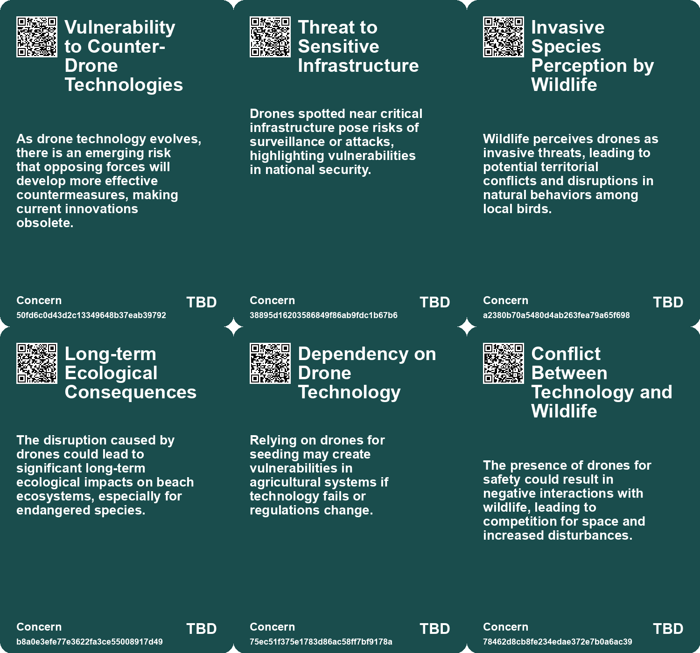
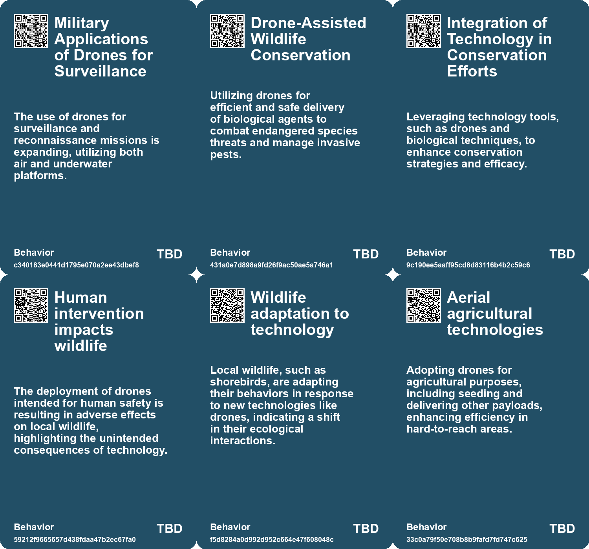
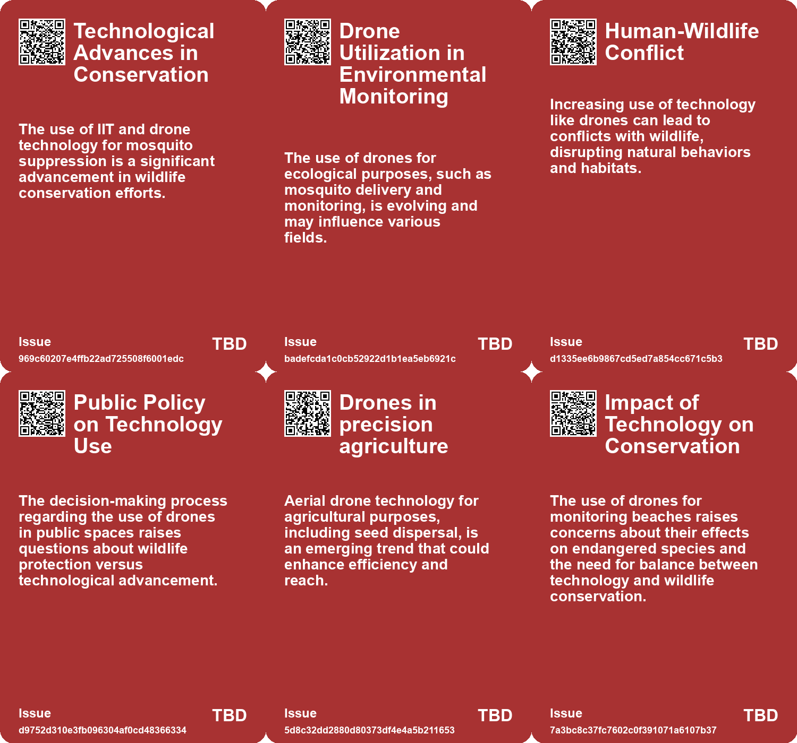
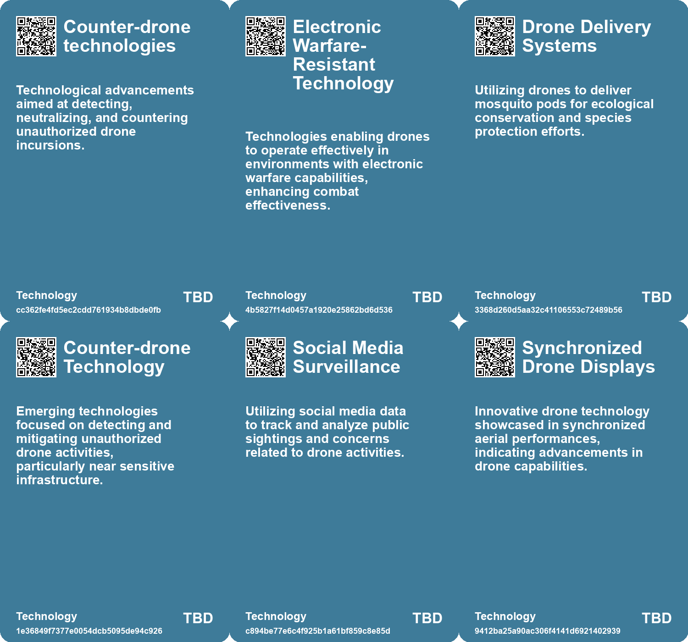

# *Topic*: Drone Technology for Biodiversity

# Summary

Drones are increasingly becoming a pivotal technology across various sectors, from military applications to agriculture and conservation efforts. The Ukrainian army has been enhancing its combat capabilities by utilizing drones for precise ammunition delivery. However, Russian electronic warfare has posed significant challenges, leading Ukraine to develop Eagle Eyes, a software that enables drones to navigate using machine vision even when communication signals are jammed. This innovation underscores the ongoing arms race in drone technology amid the conflict.

In agriculture, farmers in Nigeria are turning to private satellite data to improve crop yields. By adopting advanced agricultural technology, they can monitor crop health and make informed decisions, addressing the challenges posed by climate change. This shift towards data-driven farming reflects a broader trend in Africa, where technology is increasingly seen as a solution to traditional farming limitations.

The University of Texas at Dallas has made strides in drone technology with the development of far-field wireless power transfer, allowing drones to recharge mid-flight. This advancement could revolutionize not only drone operations but also extend to electric vehicles and other devices, showcasing the potential for innovation in energy solutions.

In conservation, a project in Hawaii is utilizing genetically modified mosquitoes to combat avian malaria threatening native bird species. By deploying these modified males via drones, the initiative aims to reduce mosquito populations and protect endangered honeycreepers. This approach highlights the intersection of biotechnology and drone technology in addressing environmental challenges.

The use of drones is not without controversy. In New York City, drones deployed for beach safety have faced opposition from local shorebirds, raising concerns about their impact on endangered species. The situation illustrates the need for careful consideration of wildlife interactions as drone usage expands.

The illicit use of drones for drug smuggling has also surged, with incidents reported globally. In India, border officials have intercepted numerous drug-carrying drones from Pakistan, highlighting the evolving tactics of criminal organizations. This trend raises significant concerns about security and the challenges of regulating drone technology.

In the realm of military strategy, the U.S. Army is exploring high-altitude balloons to launch drone swarms for intelligence gathering and monitoring enemy activity. This concept aims to enhance multi-domain operations and reflects a growing interest in integrating various technologies for defense purposes.

Finally, the emergence of mysterious drone clusters in the northeastern U.S. has sparked political concern and investigations. With thousands of reported sightings near sensitive infrastructure, officials are grappling with the implications of unidentified drone activity, raising questions about security and potential threats.

These developments illustrate the multifaceted role of drones in contemporary society, spanning military, agricultural, environmental, and security domains. As technology continues to advance, the implications of drone usage will likely expand, necessitating ongoing dialogue and regulation.

# Seeds

|    | name                                      | description                                                                                                        | change                                                                                                       | 10-year                                                                                                                         | driving-force                                                                                                    |
|---:|:------------------------------------------|:-------------------------------------------------------------------------------------------------------------------|:-------------------------------------------------------------------------------------------------------------|:--------------------------------------------------------------------------------------------------------------------------------|:-----------------------------------------------------------------------------------------------------------------|
|  0 | Technological Integration in Conservation | The use of drones and biotechnology in conservation efforts for native species.                                    | Transitioning from traditional methods of conservation to high-tech solutions for ecological challenges.     | In 10 years, wildlife conservation could heavily rely on advanced technology and biotechnological methods for species recovery. | The urgency of combating species extinction drives innovative technological solutions in conservation practices. |
|  1 | Emerging Delivery Methods for Insects     | The development of biodegradable pods for mosquito delivery via drones.                                            | Moving from manual release methods to automated aerial delivery for ecological interventions.                | Within a decade, aerial delivery systems may become standard in ecological management and pest control efforts.                 | The need for efficient and safe methods to manage invasive species drives this technological advancement.        |
|  2 | Impact of Drones on Wildlife              | Drones are perceived as invasive species by local bird populations, affecting their behavior.                      | From traditional beach safety methods to reliance on technology that disrupts wildlife.                      | In 10 years, the use of drones in wildlife areas may be heavily regulated or banned.                                            | The need for effective wildlife conservation strategies amidst technological advancements.                       |
|  3 | Drone Warfare Evolution                   | The rise of drone technology as a central aspect of modern combat.                                                 | From traditional warfare to a focus on drones and electronic warfare.                                        | Drone technology will likely dominate military strategies and operations.                                                       | Advancements in technology and the low cost of FPV drones.                                                       |
|  4 | Increased Drone Capabilities              | Drones are becoming more powerful, portable, and capable of sophisticated tasks.                                   | Evolution from basic consumer drones to advanced tech capable of targeted cyberattacks.                      | Future drones could integrate AI for autonomous hacking, complicating detection and prevention efforts.                         | Continuous innovation in drone technology meets the needs of malicious actors.                                   |
|  5 | Wildlife Awareness in Urban Planning      | Agencies are now considering wildlife life cycles when deploying drones for safety.                                | From neglecting wildlife impacts to incorporating ecological considerations in urban safety measures.        | Urban planning may increasingly integrate wildlife protection measures into safety protocols.                                   | Growing public awareness and concern for wildlife conservation in urban environments.                            |
|  6 | Increased Use of Drones for Safety        | Drones are being adopted more widely for monitoring aquatic environments and ensuring swimmer safety.              | From traditional lifeguard methods to technologically advanced drone surveillance for safety.                | Drones may become standard for beach monitoring, requiring new regulations for wildlife interactions.                           | Rising incidents of drowning and shark attacks prompting innovative safety solutions.                            |
|  7 | Endangered Species Monitoring             | Local officials are intensifying monitoring of endangered species due to drone activities.                         | From passive observation of endangered species to active protection protocols against technological threats. | Wildlife monitoring may become more proactive, integrating technology for better conservation results.                          | Legal and ethical obligations to protect endangered species in urban settings.                                   |
|  8 | Shift in Military Procurement             | Need for rapid acquisition of off-the-shelf drone technologies.                                                    | From traditional, lengthy procurement processes to agile, innovative acquisition.                            | Military procurement will prioritize speed and adaptability to tech advancements.                                               | The urgency of maintaining a technological edge in warfare.                                                      |
|  9 | Evolving Drone Technology                 | The evolution of drone technology from the 1970s insectothopter to modern micro-drones signifies rapid innovation. | Transition from large, cumbersome drones to small, efficient, and highly capable micro-drones.               | Increased integration of drones in everyday life, including personal use and commercial applications.                           | Growing demand for versatile and efficient aerial technology in various sectors.                                 |

# Concerns

|    | name                                                | description                                                                                                                                                   |
|---:|:----------------------------------------------------|:--------------------------------------------------------------------------------------------------------------------------------------------------------------|
|  0 | Vulnerability to Counter-Drone Technologies         | As drone technology evolves, there is an emerging risk that opposing forces will develop more effective countermeasures, making current innovations obsolete. |
|  1 | Threat to Sensitive Infrastructure                  | Drones spotted near critical infrastructure pose risks of surveillance or attacks, highlighting vulnerabilities in national security.                         |
|  2 | Invasive Species Perception by Wildlife             | Wildlife perceives drones as invasive threats, leading to potential territorial conflicts and disruptions in natural behaviors among local birds.             |
|  3 | Long-term Ecological Consequences                   | The disruption caused by drones could lead to significant long-term ecological impacts on beach ecosystems, especially for endangered species.                |
|  4 | Dependency on Drone Technology                      | Relying on drones for seeding may create vulnerabilities in agricultural systems if technology fails or regulations change.                                   |
|  5 | Conflict Between Technology and Wildlife            | The presence of drones for safety could result in negative interactions with wildlife, leading to competition for space and increased disturbances.           |
|  6 | Safety of Endangered Species                        | Drones could inadvertently jeopardize endangered bird species, such as piping plovers, if nesting sites are not adequately protected.                         |
|  7 | Technological Advancements in Drone Capabilities    | As drone technology improves, drug traffickers may access more capable drones, increasing smuggling capacities and complicating enforcement.                  |
|  8 | Technological Advancements in Military Applications | Rapid advancements in drone technology may outpace ethical considerations, leading to misuse in warfare and surveillance.                                     |
|  9 | Environmental Impact of Surveillance Drones         | The proliferation of drones, including bio-inspired ones, could negatively affect ecosystems and wildlife through disruption and habitat destruction.         |

# Cards

## Concerns

## Behaviors

## Issue

## Technology

# Links

* [Conservation Efforts in Hawaii: Using Biologically Modified Mosquitoes to Save Endangered Honeycreepers](https://futures.kghosh.me/855f7683fc6470c8fbe82c31b535416f)
* [European Leaders Address Drone Threats and Strengthen Defense Strategies Against Hybrid War](https://futures.kghosh.me/38f4bf649d0757debecb51a159c59887)
* [U.S. Army's Initiative to Use High-Altitude Balloons for Drone Swarms and ISR Operations](https://futures.kghosh.me/4d4f8bb17a5a7e5a852786591e70ffc8)
* [The Growing Role of Drones in Global Drug Trafficking and Smuggling Operations](https://futures.kghosh.me/1eabce42f0f6a8a399a0db3e2591c302)
* [Ikea Expands Use of Drones for Inventory Management Across Europe](https://futures.kghosh.me/73c05925a7ca7e2fe6fd64b7074f4098)
* [Revolutionizing Naval Warfare: The Rise of Autonomous Underwater Vehicles in Modern Conflict](https://futures.kghosh.me/ec4164fa3eae25e84bb4570d78845332)
* [Ukraine Develops AI Software to Counteract Russian Drone Jamming](https://futures.kghosh.me/c53d8deebd79b3b56d65c227875d65e6)
* [The CIA's Insectothopter: A Revolutionary Yet Unused Spy Robot from the 1970s](https://futures.kghosh.me/a960d86f2945ad8d666b1c649c42edc1)
* [Innovative E-seed Technology Enhances Aerial Seeding Inspired by Nature](https://futures.kghosh.me/58c165e1a46408307f2b60f63df7c549)
* [University of Texas Team Develops Wireless Charging Tech for Drones and Beyond](https://futures.kghosh.me/442dee7d7ffa984ba157b0d7bce3add0)
* [Introducing ASH: An AI-Powered Field Guide for Young Ecology Guardians](https://futures.kghosh.me/e2e0bd82e1edd6e65aa54aeb538ede8c)
* [New York National Guard Soldiers Train with Pocket-Sized Drones to Enhance Reconnaissance and Safety](https://futures.kghosh.me/68360fde62e6a94980474fa1805e4b8c)
* [Exploring Digital Bioacoustics: Understanding Nature's Unheard Voices Through Technology](https://futures.kghosh.me/db2690cf7530366ddf6f9606b830f782)
* [The Impact of Ubiquitous Surveillance Cameras on Society and Accountability](https://futures.kghosh.me/7790ecd5c227bae024a54ac5725ac978)
* [Transforming Warfare: The Role of Uncrewed Systems in Modern Military Strategy](https://futures.kghosh.me/df83d0064f88153a92b016bc412f6b97)
* [How African Farmers Are Leveraging Satellite Data to Enhance Crop Yields and Combat Climate Change](https://futures.kghosh.me/3c4f4b0832ff414899cf292220127e16)
* [Conflict Between Drones and Shorebirds on NYC Beaches Raises Wildlife Concerns](https://futures.kghosh.me/e8beabe726a250dd1676e8f681a56c9d)
* [Ukrainian Drones Attack Russian Ground Robots: A Rare Instance of Drone-on-Drone Combat](https://futures.kghosh.me/e1c2bc61b45e6587c4cc278532416665)
* [Serhii "Flash" Beskrestnov: Shaping Ukraine's Drone Defense Amidst War](https://futures.kghosh.me/c482a391981058e49ac4d639abc47040)
* [The Rise of Drone-Enabled Cyberattacks: A Financial Firm Targeted](https://futures.kghosh.me/20ad49fa494b31286502efcbf6e22d9a)
* [NYC Beach Birds Attack Police Drones in Defense of Their Territory](https://futures.kghosh.me/86ea49a6a7f6e3c63190508eff2d8945)
* [The Rise of Lethal Autonomous Weapons: Ethical and Regulatory Challenges in Modern Warfare](https://futures.kghosh.me/7f25552b9124a4dc3833e782ef331275)
* [Mysterious Drone Sightings Over New Jersey Prompt Political and Public Concern](https://futures.kghosh.me/c3e8d6ff1b93d47f455b0e6cc885f181)
* [Ukraine Unveils Brave1 Drones: Electronic Warfare-Resistant Kamikaze Technology with 31-Mile Range](https://futures.kghosh.me/fcc056c1ff7bd727a512e8b77f936c54)