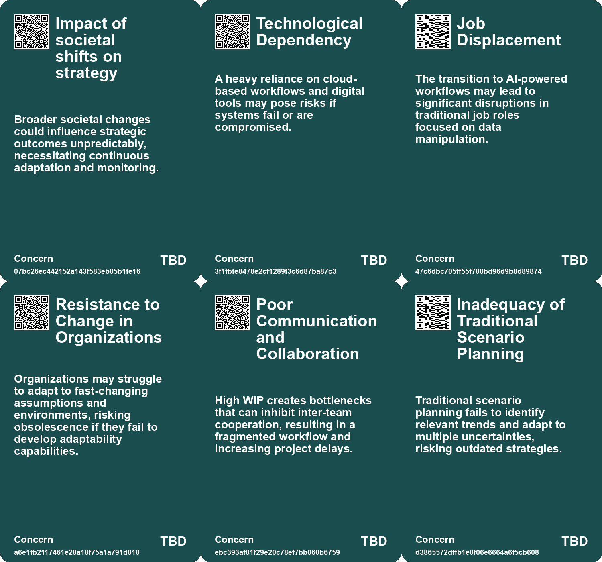
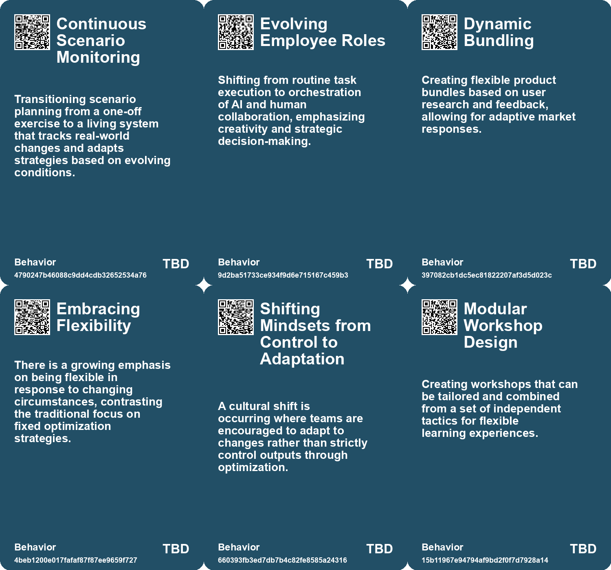
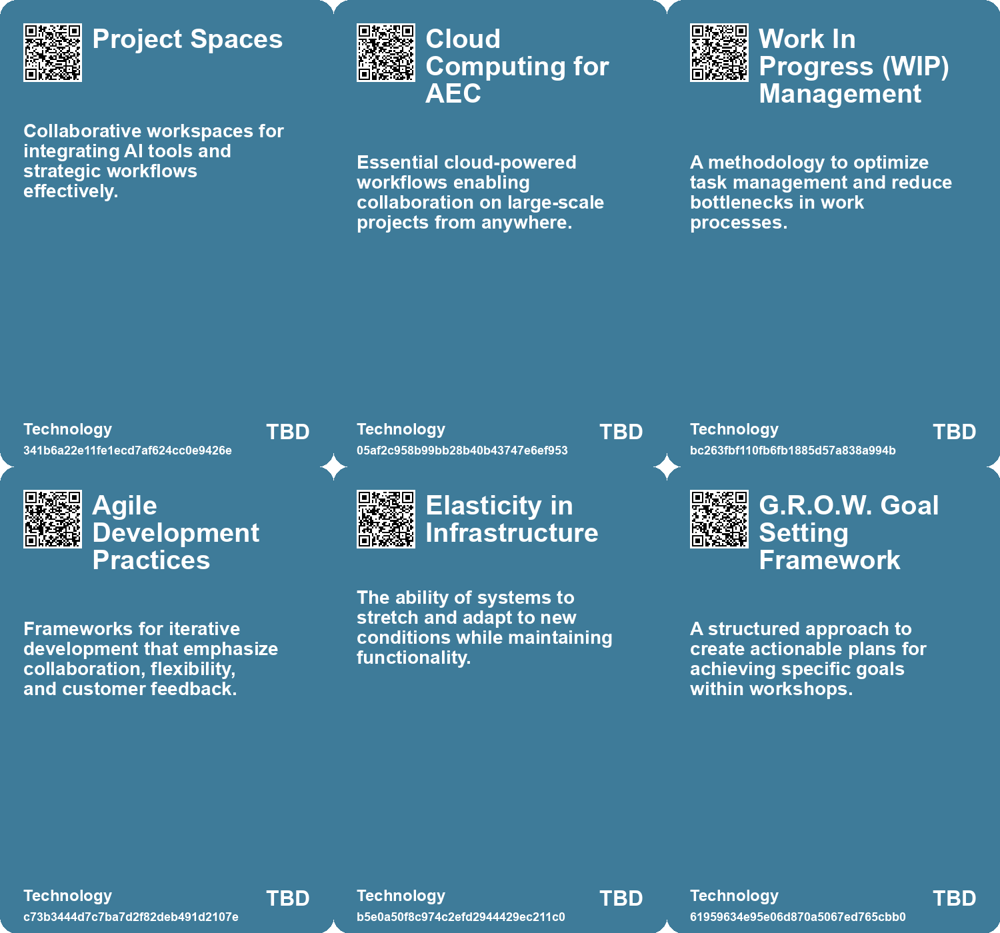

# *Topic*: Dynamic Workflow Adaptation

# Summary

The intersection of artificial intelligence (AI) and organizational dynamics is a prominent theme across recent discussions. As businesses increasingly integrate AI into their operations, the structure and nature of work are evolving. The rise of hybrid teams, where human intelligence collaborates with machine capabilities, is reshaping traditional hierarchies. This shift emphasizes the need for dedicated AI leadership roles and a workforce that is adaptable and skilled in both technical and soft skills.

In the realm of software development, generative AI tools like GitHub Copilot are changing task allocation, allowing developers to focus more on core coding activities. This shift not only enhances productivity but also fosters a more autonomous work environment. The impact of AI extends to customer support, where AI-driven tools have been shown to improve productivity and knowledge sharing among employees, particularly benefiting those with less experience.

The concept of self-orientation in human learning highlights the limitations of AI in flexibility and adaptability. Research indicates that while AI can assist in various tasks, it lacks the innate ability to navigate complex, changing environments as effectively as humans. This gap underscores the importance of human insight in decision-making processes, especially in unpredictable situations.

As organizations face increasing uncertainties from climate change and technological advancements, strategic foresight methodologies like scenario planning are becoming essential. Generative AI can enhance these planning processes by providing more effective contingency strategies, allowing businesses to prepare for multiple divergent scenarios.

The construction and architecture sectors are also undergoing transformation, driven by the integration of digital tools and AI. Trends such as sustainability, modular construction, and the use of digital twin technology are reshaping how buildings are designed and managed. This evolution aims to create a more efficient and connected approach to construction, moving away from traditional methods.

Change management in the AI era is critical, with organizations needing to balance automation with human insight. Strategies that emphasize the importance of explaining AI's role to employees and fostering a culture of collaboration are vital for successful integration. The focus should be on amplifying human potential rather than overshadowing it.

Finally, the emergence of Agentic Business Objects (ABOs) represents a significant shift in how data is managed within organizations. By enabling data records to autonomously process information and communicate without human intervention, companies can eliminate inefficiencies and revolutionize workflows. This transformation requires new skills for employees, emphasizing oversight and systems design as roles adapt to harness this technology. 

These themes reflect a broader narrative of adaptation and transformation in the workplace, driven by the integration of AI and the need for organizations to remain agile in a rapidly changing environment.

# Seeds

|    | name                                     | description                                                                                    | change                                                                                                  | 10-year                                                                                                    | driving-force                                                                                       |
|---:|:-----------------------------------------|:-----------------------------------------------------------------------------------------------|:--------------------------------------------------------------------------------------------------------|:-----------------------------------------------------------------------------------------------------------|:----------------------------------------------------------------------------------------------------|
|  0 | Rise of AI in Strategy                   | AI's integration into strategy and decision-making workflows.                                  | From manual strategy planning to AI-assisted simulation and analysis.                                   | AI will be an essential tool for strategic decision-making in organizations.                               | The need for efficient and data-driven decision-making in complex environments.                     |
|  1 | Transformation of Employee Roles         | Roles evolving from routine task handling to strategic process management and oversight of AI. | Shift from manual data processing roles to more strategic, design-oriented responsibilities.            | In 10 years, employees will focus on managing AI-driven processes rather than performing repetitive tasks. | Automation creating new job roles centered on oversight and strategic design rather than execution. |
|  2 | Focus on Agile Methodologies             | Continued emphasis on agile practices to streamline workflows in software development.         | From traditional waterfall methods to agile practices that allow for adaptability and quicker delivery. | Agile methodologies will likely become the norm in many sectors, beyond just tech.                         | The demand for quicker, more flexible development cycles in a fast-paced market.                    |
|  3 | Emergence of Flexible Work Environments  | Workplaces are evolving to become more adaptable to change rather than strictly efficient.     | Transforming rigid work environments into flexible and responsive systems.                              | Future workplaces may emphasize employee well-being and adaptability over strict performance metrics.      | The need for organizations to respond quickly to market or environmental changes.                   |
|  4 | Cultural Shift in Management Practices   | Management practices are evolving to support resilience and adaptability.                      | Transitioning from command-and-control management to more flexible approaches.                          | Future management may focus on empowering teams to respond creatively to change.                           | The need for organizations to remain competitive in fast-changing environments.                     |
|  5 | Rise of Agile Workshop Techniques        | Increasing adoption of agile methodologies in workshop formats.                                | Shift from traditional problem-solving methods to agile-driven workshops.                               | Workshops will predominantly focus on agile frameworks and collaborative techniques to solve problems.     | Growing need for adaptability and speed in product development processes.                           |
|  6 | Integration of Remote Facilitation Tools | Increased use of digital tools for facilitating workshops remotely.                            | From in-person workshops to hybrid or fully remote facilitation techniques.                             | Remote collaboration tools will enhance global participation in workshops, increasing diversity of ideas.  | Shift towards remote work and global collaboration trends.                                          |
|  7 | Customizable Workshop Formats            | Growing trend of creating tailored workshop experiences based on team needs.                   | From one-size-fits-all workshops to highly customizable formats.                                        | Workshops will be designed with flexibility to cater to specific team dynamics and challenges.             | Desire for personalized learning and development experiences in organizations.                      |
|  8 | Shift in Education Priorities            | A call to transform the education system to prioritize creativity and adaptability.            | Education is moving from rote learning to fostering curiosity and experimentation.                      | By 2033, education systems may fully embrace experiential learning, reducing standardized testing.         | The need for adaptability in a rapidly changing, complex world.                                     |
|  9 | Conditional Motion Generation            | Models like MDM enable generation of motions conditioned on textual descriptions or actions.   | Evolution from static motion generation to dynamic, context-aware motion creation.                      | Future models may allow for real-time, context-sensitive animations that adapt to user input.              | The need for more interactive and engaging content in digital media and entertainment.              |

# Concerns

|    | name                                        | description                                                                                                                                                |
|---:|:--------------------------------------------|:-----------------------------------------------------------------------------------------------------------------------------------------------------------|
|  0 | Impact of societal shifts on strategy       | Broader societal changes could influence strategic outcomes unpredictably, necessitating continuous adaptation and monitoring.                             |
|  1 | Technological Dependency                    | A heavy reliance on cloud-based workflows and digital tools may pose risks if systems fail or are compromised.                                             |
|  2 | Job Displacement                            | The transition to AI-powered workflows may lead to significant disruptions in traditional job roles focused on data manipulation.                          |
|  3 | Resistance to Change in Organizations       | Organizations may struggle to adapt to fast-changing assumptions and environments, risking obsolescence if they fail to develop adaptability capabilities. |
|  4 | Poor Communication and Collaboration        | High WIP creates bottlenecks that can inhibit inter-team cooperation, resulting in a fragmented workflow and increasing project delays.                    |
|  5 | Inadequacy of Traditional Scenario Planning | Traditional scenario planning fails to identify relevant trends and adapt to multiple uncertainties, risking outdated strategies.                          |
|  6 | Facilitation Skill Gaps                     | There could be significant variation in facilitation skills among leaders, which may impact the success of workshops.                                      |
|  7 | Rapid Organizational Changes                | The pace of AI development may require organizations to adapt quickly, leading to potential instability during transition phases.                          |
|  8 | Evolving Nature of Job Skills               | With routine tasks being automated, there's a concern about the need for continual skill adaptation and re-skilling in the workforce.                      |
|  9 | Overconfidence in AI Efficiency             | Assuming AI can always streamline processes may lead to neglect of its limitations in flexible problem-solving.                                            |

# Cards

## Concerns

## Behaviors

## Issue

## Technology

# Links

* [Navigating the Infinite Workday: Insights from the 2025 Work Trend Index Report](https://futures.kghosh.me/eef55f2e710257a37ec32bae1b59f47c)
* [Effective Change Management Strategies for AI Integration in Organizations](https://futures.kghosh.me/7eff1fa6b2dda89fa9c1470272891080)
* [The 2025 Transformation of the AEC Industry: Embracing Innovation and Sustainability](https://futures.kghosh.me/7b28983e661f02dd4b79aa866889d2a4)
* [Adapting Organizational Structures to Embrace AI: Lessons from History and Future Directions](https://futures.kghosh.me/fd0f3b7a6783ba6a0fcd3a18c8241be5)
* [The Flexibility of Human Self-Orientation vs. AI Limitations in Dynamic Environments](https://futures.kghosh.me/d9411983cedc4ea97632f2e8a3c2c090)
* [Transforming Business Processes: The Rise of Agentic Business Objects (ABOs) and AI Integration](https://futures.kghosh.me/3284928cf2598cdbd55d0bb8efda5d42)
* [Transforming Work: The Impact of Generative AI on Software Development and Task Allocation](https://futures.kghosh.me/edb0e0cf3a686780a6e12d15b5ba4d5c)
* [Navigating API Transformations: Embracing Humor and Clear Communication in Corporate Language](https://futures.kghosh.me/99229aa4d7c278866812a2c6b9dd9f8f)
* [Navigating Job Transitions: Embracing AI and Automation with Confidence](https://futures.kghosh.me/b0d2ee7f12089094cc1ccbe512130503)
* [Enhancing Scenario Planning with Generative AI: Overcoming Traditional Limitations](https://futures.kghosh.me/eb3b989221a954bad78ff582adfacdba)
* [Transforming Work: The Impact of Generative AI on Software Development and Task Allocation](https://futures.kghosh.me/e1e6faa41ee9a3845a0530464bd12e90)
* [The Transformative Impact of AI on Organizational Structures and Culture](https://futures.kghosh.me/fe6a32f4a3def00b40a187cec64fec72)
* [Navigating Decision-Making Challenges in an AI-Driven World: The Need for AAA Traits](https://futures.kghosh.me/c474eac8117547a89cac2c805652df9c)
* [The Conflict Between Optimization and Resilience in Organizational Systems](https://futures.kghosh.me/0362ad6b5f22e9f1a7f14a4b08987bc0)
* [Five Emerging Trends Transforming Business in the Coming Year](https://futures.kghosh.me/55bac03899915f25bf0b47fa4342472c)
* [Introducing Motion Diffusion Model for Natural Human Motion Generation in Animation](https://futures.kghosh.me/07bcf7d8e29d33f8438f4b35a7f15021)
* [The Impact of AI on Wages and Human Adaptation in the Workforce](https://futures.kghosh.me/faa0e4de05145c04c5d22a8449a70d95)
* [Integrating AI in Strategic Scenario Planning: A Six-Step Workflow for Enhanced Decision Making](https://futures.kghosh.me/c489c0f6d7cb946fd417f27656aac6c8)
* [Strategies for Developing Multi-Product Portfolios: Bundling, Integration, and Customer-Centric Design](https://futures.kghosh.me/52ee02cc495e301f25e77472907bb8df)
* [The Transformative Power of the Toyota Production System and its Relevance in an AI-Driven World](https://futures.kghosh.me/ae195a0a52b9b143bee7074983343615)
* [Understanding High Work-In-Progress in Software Development and the Need for Laziness](https://futures.kghosh.me/d728fb3d0390537d7c1040ae6f2af408)
* [An Overview of Workshop Tactics: Effective Problem-Solving Techniques for Teams](https://futures.kghosh.me/e6cb167bfeaed16d68d2e384681bfbb7)