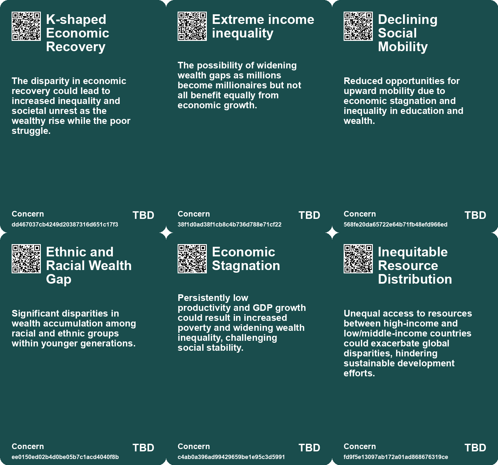
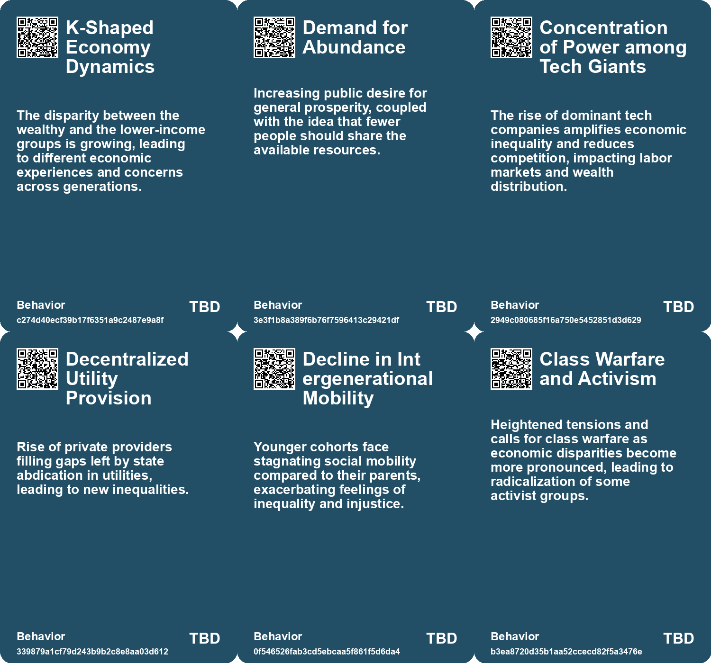
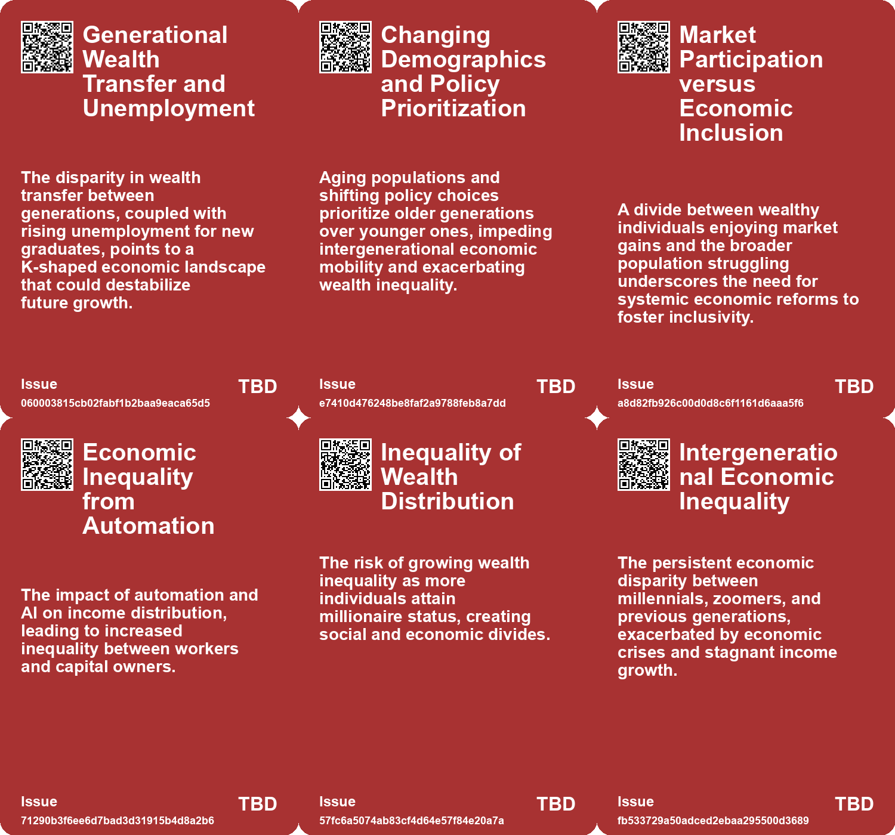
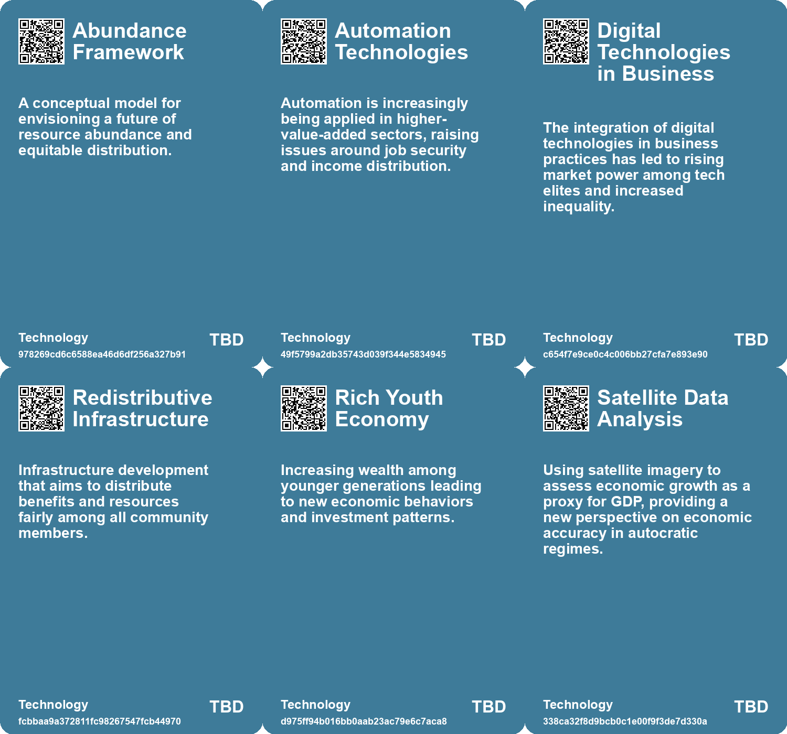

# *Topic*: Economic Inequality

# Summary

The concept of economic growth is under scrutiny as the world grapples with the implications of wealth concentration and environmental degradation. The idea of ultraprosperity, characterized by two decades of uninterrupted economic growth, raises questions about sustainability and the need for meaning beyond financial success. While some envision a future of abundance, the reality is that billionaires and the super-rich often exacerbate inequality, waste resources, and hinder progress on critical issues like climate change. Proposed solutions include higher taxes on the wealthy and systemic economic changes to address the negative consequences of extreme wealth.

In the U.K., a focus on finance over industry has led to a decline in productivity and living standards. Austerity measures and restrictive policies have contributed to a housing crisis and energy shortages, highlighting the need for comprehensive reforms to stimulate growth. The country’s economic challenges reflect a broader trend seen in many developed nations, where demographic decline and an aging workforce threaten innovation and economic vitality. Countries like Italy, Japan, and South Korea face similar issues, with falling birth rates leading to a shrinking pool of educated young workers.

The rise of a 'casino economy' emphasizes financialization over traditional growth, resulting in a K-shaped recovery where wealth concentration increases for the affluent while the lower class struggles. This economic landscape fosters a transactional view of life, where materialism intertwines with spirituality, as individuals seek security in the stock market amid uncertainty. The critique of contemporary capitalism reveals that many jobs contribute little to human survival, perpetuating poverty and environmental degradation. A reevaluation of work is necessary, advocating for a society focused on happiness and fulfillment rather than profit.

Infrastructure plays a crucial role in shaping societal outcomes, with degradation leading to catastrophic events and perpetuating social inequality. The need for sustainable and equitable infrastructure development is urgent, especially in the context of climate change. Additionally, the concept of externalities highlights the costs imposed by businesses that are not accounted for in their operations, emphasizing the need for a new industrial system that integrates sustainability into economic practices.

The Jevons paradox illustrates how improvements in resource efficiency can paradoxically lead to increased consumption, raising concerns about sustainability efforts. As younger generations, particularly Millennials and Generation Z, navigate adulthood, they face unique challenges, including economic difficulties, mental health issues, and a sense of disillusionment. Their experiences will shape future economic policies as they become the driving force in society.

Finally, the manipulation of economic data by authoritarian regimes underscores the importance of transparency and accountability in governance. The overstatement of GDP growth in dictatorships reveals the lengths to which leaders will go to maintain power, often at the expense of their citizens' well-being. Addressing these interconnected themes is essential for fostering a more equitable and sustainable future.

# Seeds

|    | name                                      | description                                                                                           | change                                                                                                | 10-year                                                                                                     | driving-force                                                                                     |
|---:|:------------------------------------------|:------------------------------------------------------------------------------------------------------|:------------------------------------------------------------------------------------------------------|:------------------------------------------------------------------------------------------------------------|:--------------------------------------------------------------------------------------------------|
|  0 | Economic K-Shaped Recovery                | Wealth concentration is intensifying while the lower-income bracket faces challenges.                 | Economic disparity is growing, where the wealthy become wealthier while others struggle.              | Wealth gaps will widen, leading to potential societal friction and calls for reform.                        | Economic policies that favor asset growth over income stability.                                  |
|  1 | Crisis of Scarcity vs. Abundance          | Escalating debate on scarcity and the inequities it breeds in society.                                | Moving from a scarcity mindset to embracing potential paths to abundance for all.                     | Future discussions will revolve around equitable distribution and sustainability rather than mere survival. | Economic inequality prompting demand for fair resource allocation and shared prosperity.          |
|  2 | Emergence of a Two-Tier Society           | Society is becoming increasingly unequal, with a divide between tech elites and the general populace. | From a more equitable society to one starkly divided by wealth and access to technology.              | In a decade, the disparity may lead to social unrest and calls for reform.                                  | The accumulation of wealth and power among tech leaders at the expense of workers.                |
|  3 | Privatization of Utilities                | Privatization of public utilities leads to inequitable access to essential services.                  | Transition from public to privatized utility services, affecting affordability and access.            | In 10 years, there may be a push for re-nationalization or regulation of essential services.                | Growing awareness of social inequalities resulting from privatization.                            |
|  4 | Social Fissures from Energy Inequality    | Energy consumption disparities are creating social divides and tensions.                              | From equitable energy access to significant disparities based on consumption and resources.           | In 10 years, energy policies may prioritize equity and sustainability in access.                            | Growing awareness of energy equity and its impact on social cohesion.                             |
|  5 | Increased Racial and Economic Inequality  | Younger generations experience heightened economic disparities, especially among ethnic minorities.   | Shift from a predominantly white wealth accumulation to increased diversity and poverty.              | Socioeconomic structures may change to address growing disparities and demands for equity.                  | Awareness of systemic inequalities and calls for social justice.                                  |
|  6 | Educational Disparities                   | Many young individuals lack proper education, limiting their economic contributions.                  | From a well-educated workforce to a growing number of undereducated young individuals.                | A potential workforce crisis as fewer young people are equipped to innovate.                                | Insufficient educational systems failing to meet the needs of the population.                     |
|  7 | Global Economic Disparities               | Discrepancies between reported and actual economic growth in different regimes.                       | Shift from perceived economic growth in autocracies to a clearer understanding of economic realities. | Economic policies may be adjusted globally to address disparities revealed through accurate data.           | A push for equitable economic policies in response to revealed disparities motivates this change. |
|  8 | Class Warfare and Political Fragmentation | Increased conflict between wealthy oligarchs and progressive activists over welfare policies.         | From collaborative support for progressive causes to potential clashes over economic policies.        | Political alliances may splinter, leading to a fragmented political landscape.                              | The unsustainable nature of funding welfare initiatives amid economic decline.                    |
|  9 | Inequality and Economic Polarization      | Concerns about rising inequality and its societal impacts due to automation.                          | Shift from wealth creation benefiting shareholders to a more equitable distribution model.            | A society where economic equality is a priority, reducing polarization and social strife.                   | Recognition of the negative effects of unchecked technological advancement on society.            |

# Concerns

|    | name                              | description                                                                                                                                                     |
|---:|:----------------------------------|:----------------------------------------------------------------------------------------------------------------------------------------------------------------|
|  0 | K-shaped Economic Recovery        | The disparity in economic recovery could lead to increased inequality and societal unrest as the wealthy rise while the poor struggle.                          |
|  1 | Extreme income inequality         | The possibility of widening wealth gaps as millions become millionaires but not all benefit equally from economic growth.                                       |
|  2 | Declining Social Mobility         | Reduced opportunities for upward mobility due to economic stagnation and inequality in education and wealth.                                                    |
|  3 | Ethnic and Racial Wealth Gap      | Significant disparities in wealth accumulation among racial and ethnic groups within younger generations.                                                       |
|  4 | Economic Stagnation               | Persistently low productivity and GDP growth could result in increased poverty and widening wealth inequality, challenging social stability.                    |
|  5 | Inequitable Resource Distribution | Unequal access to resources between high-income and low/middle-income countries could exacerbate global disparities, hindering sustainable development efforts. |
|  6 | Inequality and Poverty            | The accumulation of wealth by a small percentage while the majority live in poverty creates societal instability and discontent.                                |
|  7 | Socioeconomic Inequality          | Increasing economic inequalities exacerbate discontent and could lead to social movements or revolts.                                                           |
|  8 | Concentration of Wealth           | The increasing wealth disparity caused by billionaires accumulating vast resources while the general population faces stagnant income.                          |
|  9 | Social Unrest and Backlash        | Historical patterns suggest that extreme wealth inequality can lead to social upheaval and violent responses.                                                   |

# Cards

## Concerns

## Behaviors

## Issue

## Technology

# Links

* [Understanding Externalities: The Need for a Revolutionary Shift in Industrial Practices](https://futures.kghosh.me/364fecbe1c46f164e48d52c279422351)
* [Exploring the Impact of Technology on Inequality and Labor in 'Power and Progress'](https://futures.kghosh.me/997c962feb825d066ca4dc6e4742e8a9)
* [The Interplay of Democracy, Work, and Economic Justice in Modern Society](https://futures.kghosh.me/43aa6ac3d82bbc19f0d66d5b2bb37897)
* [Economic Challenges Faced by Millennials and Generation Z: A Deep Dive into Inequality and Instability](https://futures.kghosh.me/86001e4fb7b55397aece664afd67001a)
* [The Unraveling of Progressive Politics: Economic Shifts and Growing Conflicts](https://futures.kghosh.me/f4ea5244ccafd654e5955673b0ee3976)
* [Exploring the Dangers of Outsourcing Happiness and Personal Fulfillment in Modern Society](https://futures.kghosh.me/a5c0ba498382a4edc0f2bf0d9653ad16)
* [Understanding the Casino Economy: How Financialization Shapes Our Lives and Beliefs](https://futures.kghosh.me/f4ca03eca53c5d3b3ccc3dd5b1a9aeb4)
* [The Unexpected Stagnation of Productivity Growth Post-Pandemic](https://futures.kghosh.me/99bc8113e8e7bacc050e12acdae75e14)
* [Understanding Economic Termites: Hidden Monopolies Driving Up Costs and Eroding Trust](https://futures.kghosh.me/ff9fdda9334a55cda4fd1788668b3e15)
* [Preparing for AI Job Displacement: The Case for Universal Basic Income](https://futures.kghosh.me/550efa34f0d3da2d8dc49d97f98859d9)
* [Rethinking Economic Growth: The Case for Degrowth in a Sustainable Future](https://futures.kghosh.me/d18185596b0ee658ac31e9c3003c6d92)
* [The Vision of Ultraprosperity: A Future of Economic Growth and Change](https://futures.kghosh.me/719500bc852b3f2db19af6d9280207bf)
* [Exploring the UK’s Economic Crisis Rooted in Housing and Energy Shortages](https://futures.kghosh.me/14c9e2a7976b48f09c3e0cdf3c054c0a)
* [Reevaluating Work: A Critique of Capitalism and Its Impact on Humanity](https://futures.kghosh.me/b20fb97f6ad12a6389468e434068e2ad)
* [The UK's Declining Geopolitical Relevance and Elite Inaction: A Historical Perspective](https://futures.kghosh.me/ca555520973a0e8519ff854da1de4d88)
* [Examining the Billionaire Problem: Wealth Inequality and Its Societal Impact](https://futures.kghosh.me/4ef8cee75515da28d5c6ad986ee83030)
* [The Impact of Poverty on Cognitive Performance: Understanding the Links between Finances and Intelligence](https://futures.kghosh.me/2e671c014ba53b8b49159c3c5143c526)
* [The Decline of the U.K.: A Cautionary Tale of Economic Dysfunction and Austerity](https://futures.kghosh.me/356a6ba108d8bfda52fe56a947f6b347)
* [Understanding Jevons Paradox: The Unexpected Rise in Resource Consumption Through Efficiency Gains](https://futures.kghosh.me/72ad2ad82a4064cc0219178869779cd8)
* [The Economic Consequences of Declining Birth Rates and Aging Populations](https://futures.kghosh.me/bff595b72330d833dba477e2dc2a5656)
* [Reimagining Infrastructure: Towards a Redistributive and Ecologically Sound Future](https://futures.kghosh.me/177a0857ffe0d07d48cd99a269f28a02)
* [Examining the Political Landscape: A Reflection on Ezra Klein and Derek Thompson's 'Abundance'](https://futures.kghosh.me/b7820dcd25b4e5b36ef678f56602f4c4)
* [Study Reveals Dictatorial Deception in Economic Growth Reporting Using Satellite Data](https://futures.kghosh.me/40c2db3bc4702bff2612a3faba89097a)