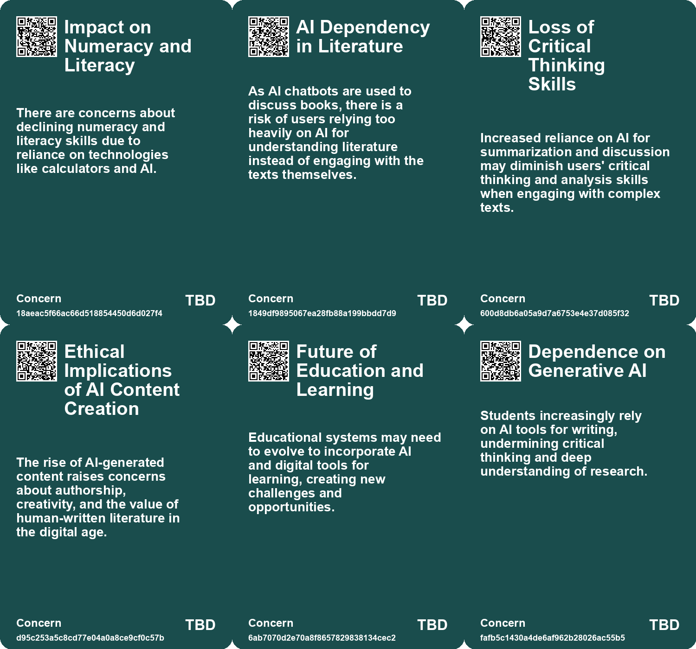
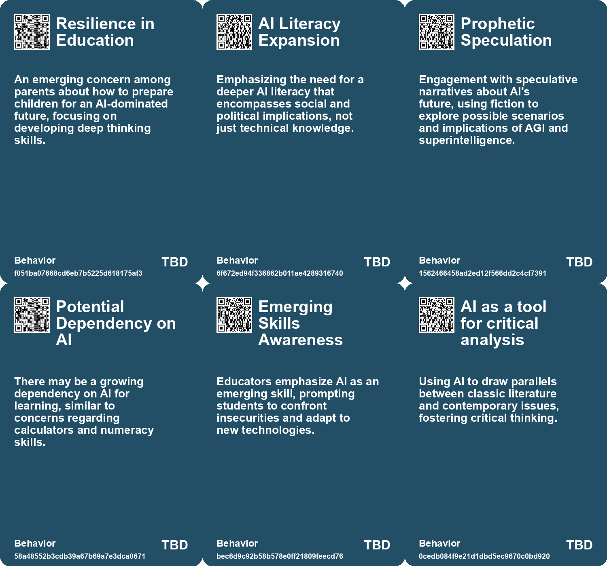
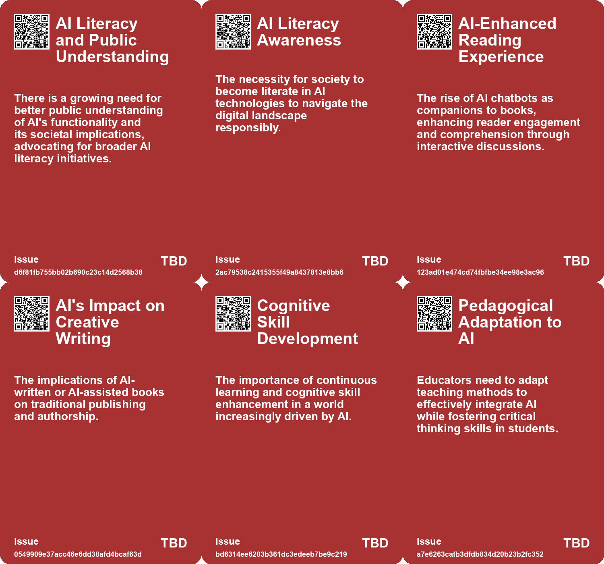
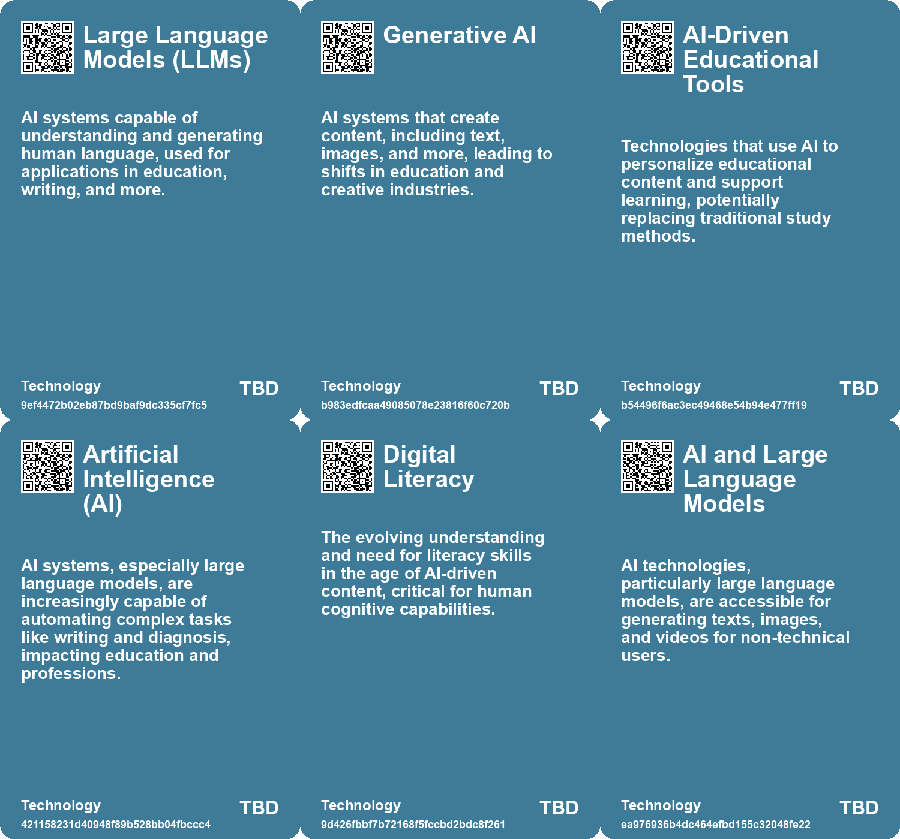

# *Topic*: Emerging Literacy for AI

# Summary

The rise of artificial intelligence (AI) is reshaping various aspects of society, particularly in education and cognitive development. Concerns are growing about the decline in critical thinking and cognitive abilities as students increasingly rely on AI tools for writing and learning. This trend raises alarms about literacy and comprehension skills, with experts warning that outsourcing critical thinking to AI could lead to a de-skilling of humanity. The need for educational practices that promote deep thinking and cognitive engagement is becoming more urgent.

AI imaging technology is also a focal point of discussion, with implications for how we perceive reality. The ability to create virtual images through AI raises concerns about authenticity and the potential for a disconnect from nature and human interaction. As AI-generated content becomes more prevalent, the importance of literacy in navigating this new landscape is emphasized.

In the educational sector, AI has the potential to enhance learning through personalized tutoring. However, the integration of AI must be approached with caution to ensure it improves educational outcomes rather than prioritizing profit. The balance between leveraging AI's capabilities and maintaining the quality of education is crucial. Business schools are already adapting their curriculums to include AI, recognizing the importance of technology skills for future graduates.

The impact of AI on cognitive skills is significant, with tools like ChatGPT enhancing writing without fostering deeper understanding. This cognitive offloading can lead to diminished curiosity and mental weakening. The analogy of AI as an elevator illustrates the trade-off between convenience and intellectual rigor. To combat this trend, individuals are encouraged to resist the ease of AI and engage in deeper learning.

The societal implications of AI extend beyond education. Discussions around AI's role in shaping our future highlight the need for responsible development and regulation. The potential risks associated with AI, such as the creation of deepfakes and the exacerbation of social inequalities, are critical considerations. As AI continues to evolve, the importance of transparency and accountability in its application is underscored.

The integration of AI in creative fields is also being explored. Tools like Wordcraft aim to assist writers in their creative processes, showcasing the potential for AI to enhance artistic expression. Collaboration between technologists and artists is essential to ensure that AI tools positively impact the writing world.

Finally, the narrative surrounding AI often reflects broader societal fears, influenced by popular culture. The Future of Life Institute advocates for a more nuanced understanding of AI, emphasizing the need to envision positive futures through the integration of the humanities in AI discussions. By fostering ethical considerations in AI development, society can better navigate the challenges and opportunities presented by this transformative technology.

# Seeds

|    | name                                             | description                                                                                       | change                                                                                                 | 10-year                                                                                                         | driving-force                                                                                      |
|---:|:-------------------------------------------------|:--------------------------------------------------------------------------------------------------|:-------------------------------------------------------------------------------------------------------|:----------------------------------------------------------------------------------------------------------------|:---------------------------------------------------------------------------------------------------|
|  0 | Need for a New Educational Framework             | Educational institutions may need to adapt radically in response to the rise of AI.               | From traditional educational systems to tech-integrated learning environments.                         | Universities may resemble historical monastic institutions that emphasize disciplined learning.                 | The challenge posed by AI and its effects on learning dynamics.                                    |
|  1 | AI as a Catalyst for Critical Skills Development | Generative AI is pushing educators to re-evaluate and enhance critical skill sets among students. | Evolution from rote memorization to critical thinking and problem-solving with AI guidance.            | Educational systems may prioritize critical engagement with AI tools in skill development.                      | Need for students to adapt and thrive in an increasingly automated and AI-driven landscape.        |
|  2 | AI as an Emerging Skill in Education             | AI usage is being recognized as a crucial emerging skill in business education.                   | Shift from traditional skill sets to integrating AI as a core competency.                              | AI literacy may become a fundamental requirement for all business graduates.                                    | The increasing importance of AI in various business functions and decision-making processes.       |
|  3 | AI as a Knowledge Interface                      | AI is being used to transform various knowledge sources into conversational formats.              | The evolution from static knowledge representation to dynamic, interactive AI interfaces.              | In 10 years, accessing information may primarily occur through AI-driven conversational agents.                 | The demand for more accessible and engaging ways to interact with information.                     |
|  4 | AI Literacy as a Necessity                       | Increasing need for individuals to understand and use AI tools effectively.                       | Shift from ignorance of AI to a requirement for AI literacy in personal and professional settings.     | In 10 years, AI literacy will be as fundamental as digital literacy for all individuals.                        | Rapid advancements in AI technology necessitating understanding for effective use.                 |
|  5 | AI-Enhanced Creativity                           | AI tools like Wordcraft are emerging as partners in the creative writing process.                 | Shift from traditional writing practices to AI-assisted creativity.                                    | In 10 years, AI could be a standard collaborator in creative writing workflows.                                 | The need for innovative tools to address writer's block and enhance creativity drives this change. |
|  6 | AI as Research Assistant                         | Writers are using AI as a tool to research and gather information.                                | Shift from traditional research methods to AI-powered information retrieval.                           | In a decade, writers may rely exclusively on AI for research and fact-checking.                                 | The vast amount of information online creates a demand for efficient research tools.               |
|  7 | Open Dialog Between Technologists and Artists    | The necessity for collaboration in developing AI tools for writers.                               | Transition from isolated development to inclusive design processes.                                    | In 10 years, writer input will be integral to the design of AI writing tools.                                   | The need for tools that truly meet the needs of writers encourages collaboration.                  |
|  8 | The Rise of AI Writing Tools                     | AI writing tools are becoming common among novice writers and students.                           | Shift from traditional writing aids to AI-assisted writing tools.                                      | AI writing tools could become standard educational resources for new writers.                                   | The increasing accessibility and user-friendliness of AI tools drive adoption.                     |
|  9 | Emerging AI-curated Knowledge Ecosystem          | AI is increasingly curating knowledge, raising issues of trust and explainability.                | Shift from human-curated knowledge to AI-driven curation, challenging traditional information sources. | AI may dominate information dissemination, leading to a more homogenized and potentially biased knowledge base. | The rapid advancement of AI technologies and the need for efficient information processing.        |

# Concerns

|    | name                                        | description                                                                                                                                                              |
|---:|:--------------------------------------------|:-------------------------------------------------------------------------------------------------------------------------------------------------------------------------|
|  0 | Impact on Numeracy and Literacy             | There are concerns about declining numeracy and literacy skills due to reliance on technologies like calculators and AI.                                                 |
|  1 | AI Dependency in Literature                 | As AI chatbots are used to discuss books, there is a risk of users relying too heavily on AI for understanding literature instead of engaging with the texts themselves. |
|  2 | Loss of Critical Thinking Skills            | Increased reliance on AI for summarization and discussion may diminish users' critical thinking and analysis skills when engaging with complex texts.                    |
|  3 | Ethical Implications of AI Content Creation | The rise of AI-generated content raises concerns about authorship, creativity, and the value of human-written literature in the digital age.                             |
|  4 | Future of Education and Learning            | Educational systems may need to evolve to incorporate AI and digital tools for learning, creating new challenges and opportunities.                                      |
|  5 | Dependence on Generative AI                 | Students increasingly rely on AI tools for writing, undermining critical thinking and deep understanding of research.                                                    |
|  6 | Inability to Identify AI-Generated Content  | Difficulty in distinguishing AI-generated text can lead to challenges in assessing student work.                                                                         |
|  7 | Cognitive Dependency on Technology          | Increased reliance on AI for reading and comprehension may weaken critical thinking and analytical skills in individuals.                                                |
|  8 | Impact on Novice Writers                    | Widespread use of AI writing tools may complicate the craft of writing for beginners, altering the learning landscape.                                                   |
|  9 | Dependence on Technology                    | Over-reliance on AI for assistance might undermine traditional writing skills and critical thinking in writers.                                                          |

# Cards

## Concerns

## Behaviors

## Issue

## Technology

# Links

* [Understanding AI: Definitions, Implications, and the Need for Literacy in Technology](https://futures.kghosh.me/45d0e20c84c31176fa084646d8d045b4)
* [The Rapid Evolution of AI: Impacts on Work, Truth, and Education](https://futures.kghosh.me/3aaa975f44b2a607ef191978083cf2b8)
* [Leopold Aschenbrenner's Essays Predict Rapid Advancements in AI and AGI by 2026](https://futures.kghosh.me/3a139aae193a7793a135395cd01940ff)
* [Exploring the Future: How AI Will Transform Our Lives by 2041](https://futures.kghosh.me/1621aeb7941f2df0feefc2de14851249)
* [Thriving in an AI Era: Embracing, Adapting, and Complementing Technology](https://futures.kghosh.me/23a3410059759ba4214235628d4ebd4b)
* [The Impact of AI on Student Writing: A Teacher's Perspective on Leaving the Classroom](https://futures.kghosh.me/86cb668eb531243c4f8cd92b0d1d3821)
* [Harnessing Storytelling to Reimagine AI: The Role of Arts and Humanities in Shaping a Positive Future](https://futures.kghosh.me/026067bce7eb8accee127cf0cac4dfa5)
* [The Impact of AI Imaging on Art, Creativity, and Human Connection](https://futures.kghosh.me/de89ae90257007a4fbb1a5c7a7dc82a5)
* [Exploring the Role of AI in Creative Writing through Wordcraft](https://futures.kghosh.me/3acd488d3b86b4637bd78d0f3f3e0e65)
* [YouAI's Book AI: Transforming Books into Conversational Chatbots for Enhanced Reader Engagement](https://futures.kghosh.me/52ee8c1b0291daa92b97c28225a816b6)
* [The Transformative Potential of AI: Revolutionizing Education, Healthcare, and Global Equity](https://futures.kghosh.me/2449c2fc4b8afc7e268db4987fa821e5)
* [The Decline of Human Thinking in the Age of AI: A Call for Educational Reform](https://futures.kghosh.me/1909e5d11ae6f5dc49eb87e739bb1885)
* [The Transformative Impact of AI on Humanities Education and Its Challenges](https://futures.kghosh.me/72aad99b3b502b39304cbe2302a55141)
* [Reflections on AI: Balancing Human Essence and Technological Advancement as the Year Ends](https://futures.kghosh.me/67e5f63a5ea04ad81ae4e5ef192811be)
* [Exploring AI's Effect on Cognitive Skills and Learning Processes](https://futures.kghosh.me/950253f15955ca7be1cb2ebf244d0939)
* [Exploring the Transformative Impact of AI on Education and Children's Learning Experiences](https://futures.kghosh.me/adf886a1b9fd74281e0a43c3e7c70def)
* [Navigating AI's Impact on Education: A Call for a New Learning Model](https://futures.kghosh.me/28bb84905643c6dc551653659cfbb8d9)
* [Exploring AI's Implications: Insights from a Discussion in New Zealand on Artificial Intelligence and Society](https://futures.kghosh.me/7bdbb32950c9d265f6ec455d964973fe)
* [Examining the Effects of AI on Knowledge Worker Performance: A Study with Boston Consulting Group](https://futures.kghosh.me/c63bd059cb529b72b00ecbdcd2f85268)
* [The Integration of AI in Business School Curriculums to Enhance Graduate Competitiveness](https://futures.kghosh.me/bc232b227c806ac26adf2b99fa4cff9d)
* [The Transformative Power of Reading and the Enduring Magic of Books](https://futures.kghosh.me/a9f822eb98b10e38248c245ba437d9c8)
* [Exploring the Future of AI in Knowledge Ecosystems and Global Challenges](https://futures.kghosh.me/a9266018b458295480a07167310458a9)
* [AI's Impact on Education: Adaptation, Challenges, and Opportunities for Learning](https://futures.kghosh.me/ea74b217d36ec570bb432fb5aa679090)