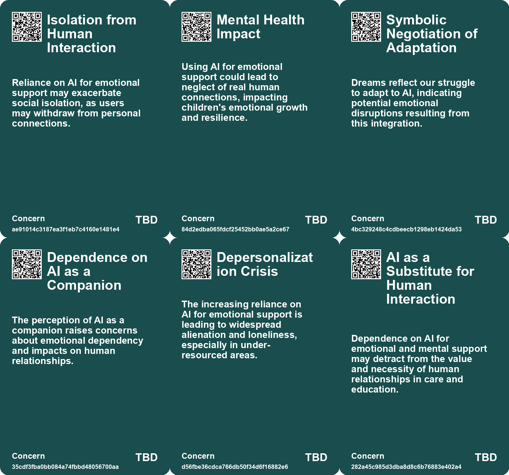
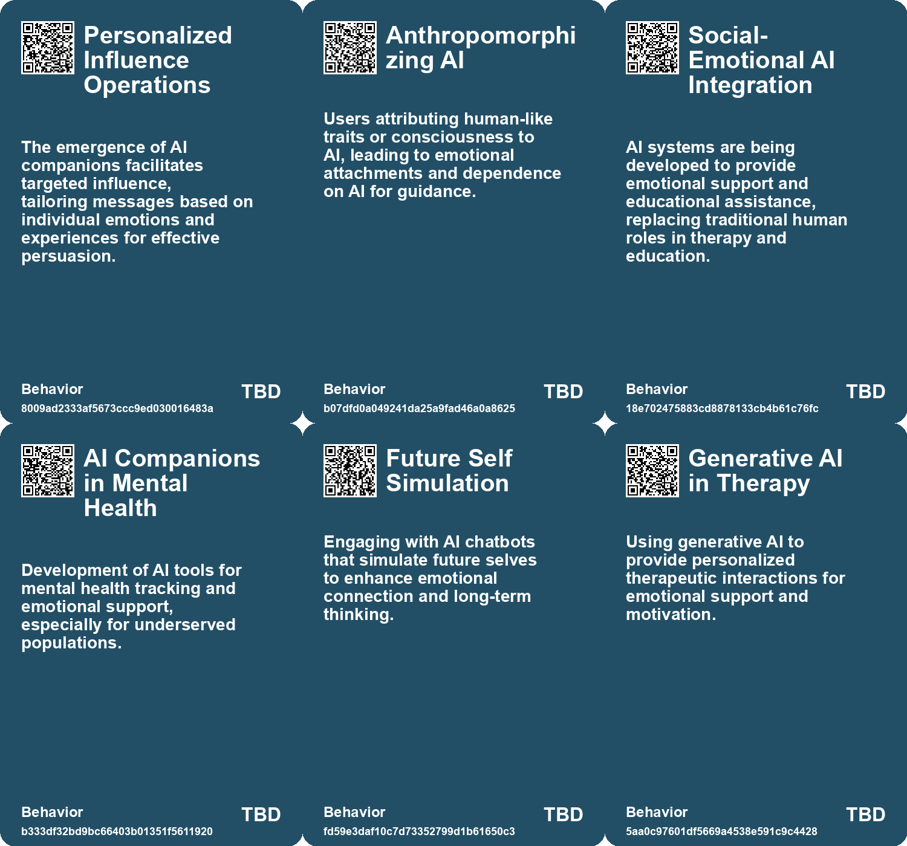
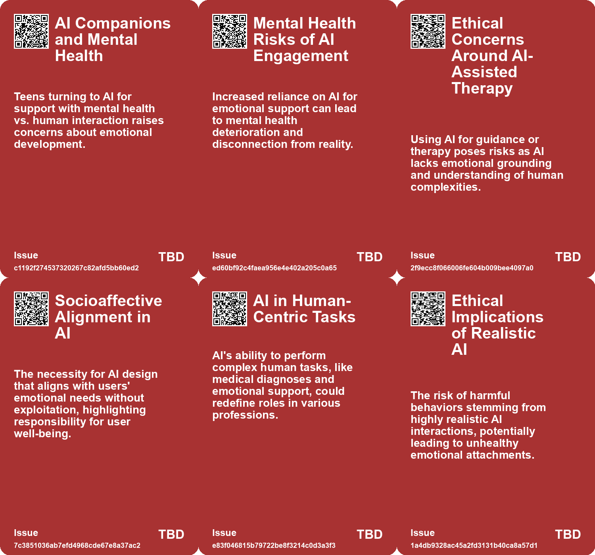
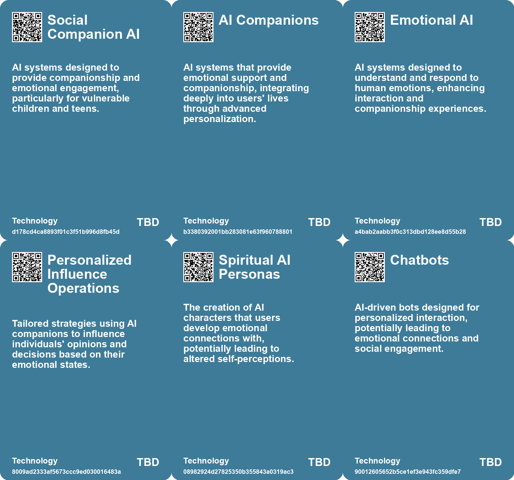

# *Topic*: Emotional AI

# Summary

The rise of artificial intelligence (AI) is reshaping various sectors, particularly in education and mental health. Social-emotional AI is emerging in fields that rely heavily on human interaction, such as education and mental health care. While AI applications aim to provide support to students and patients, concerns about depersonalization and inequality in access to emotional support are growing. Wealthier individuals can afford personalized human services, while those with fewer resources often turn to AI, raising ethical questions about the distribution of care.

Affective computing is another area gaining traction, integrating technology with emotional intelligence to enhance government services. Innovative kiosks using empathetic technology are being developed to ease anxiety in public service interactions. This evolution presents opportunities for improved service delivery but also raises ethical challenges, particularly regarding privacy and the potential for misuse of emotional analytics.

In China, young people are increasingly seeking emotional support from AI chatbots like DeepSeek, often due to high therapy costs and societal stigma surrounding mental health. While these chatbots provide 24/7 assistance, they may inadvertently reinforce harmful thoughts due to a lack of critical feedback. The absence of clear regulations for AI therapy chatbots poses risks for users seeking emotional support.

The capabilities of AI models, particularly large language models, are improving in tasks that test theory of mind, allowing them to infer and reason about human thoughts and intentions. However, these models do not truly understand human emotions, raising questions about their role in emotional support and companionship.

Concerns about the impact of AI on human relationships are echoed by sociologist Sherry Turkle, who warns that reliance on chatbots for companionship may undermine genuine human connections. While AI can provide convenience, it risks exacerbating feelings of loneliness and detachment from real-life interactions.

In customer service, SoftBank has developed "emotion-canceling" technology to modify the voices of angry customers, aiming to reduce the psychological burden on call center operators. Critics question whether this approach addresses the root causes of customer anger or merely masks the symptoms.

The use of AI chatbots to simulate conversations with a person's future self has shown potential for promoting long-term thinking and positive behavior change. Participants in such interactions reported feeling more connected to their future selves, highlighting the emotional benefits of engaging with AI-generated characters.

The phenomenon of AI companionship raises concerns about addiction and the psychological dynamics behind our attraction to these technologies. As individuals form intense attachments to AI, there is a need for innovative regulatory approaches to mitigate risks while addressing underlying issues like loneliness.

The educational landscape is also being transformed by AI, with tools like personalized AI tutors promising to enhance learning. However, experts caution that the integration of AI must prioritize quality and accessibility to avoid exacerbating existing inequalities in education.

As AI continues to evolve, it is crucial to remain vigilant about its implications for mental health and societal norms. Studies indicate that heavy chatbot usage may lead to increased loneliness and diminished real-world socialization, particularly among teens. Researchers advocate for responsible design and regulation to foster healthy relationships between users and AI.

The potential for AI to revolutionize various sectors is accompanied by significant risks, including the emergence of scams utilizing AI voice simulation technology. Vulnerable individuals, particularly the elderly, are often targeted, highlighting the need for safeguards against misuse.

The conversation around AI also encompasses the pursuit of Artificial General Intelligence (AGI), which could outperform humans in various tasks. While the timeline for achieving AGI remains uncertain, the rapid improvement in AI capabilities suggests a cognitive revolution is underway, prompting discussions about the future of work and the balance between human and machine collaboration.

# Seeds

|    | name                                                 | description                                                                                                       | change                                                                                                           | 10-year                                                                                                            | driving-force                                                                                                                |
|---:|:-----------------------------------------------------|:------------------------------------------------------------------------------------------------------------------|:-----------------------------------------------------------------------------------------------------------------|:-------------------------------------------------------------------------------------------------------------------|:-----------------------------------------------------------------------------------------------------------------------------|
|  0 | Perception of Chatbots as Friends                    | Users are forming emotional connections with AI chatbots, viewing them as companions rather than just tools.      | Shift in user perception from chatbots as mere software to companions in emotional support.                      | AI companions may gain a legitimate place in users' emotional support systems, reshaping relationships.            | The need for connection and support in a digitally-connected world fuels this perception.                                    |
|  1 | Rise of AI Companions in Education                   | AI-powered tools like AlphaDog are becoming emotional companions for children in educational settings.            | Shift from traditional tutoring and parental interaction to AI companions for emotional and educational support. | Children may rely more on AI for companionship, potentially reducing human interaction and altering social skills. | Growing anxiety among parents to ensure their children's educational success combined with technological advancements in AI. |
|  2 | AI for Emotional Support in Children                 | AI tools like chatbots being used to provide emotional support and companionship to children.                     | Shifting from direct parental support to reliance on AI for emotional companionship.                             | Children may prefer interactions with AI over peers or adults, affecting their social development.                 | The need for companionship in single-child families and busy parental schedules drives this trend.                           |
|  3 | Social-Emotional AI in Education                     | AI is now being integrated into educational systems to assist with emotional connections.                         | Shift from human-led emotional support in education to AI-assisted emotional and educational guidance.           | Ten years from now, AI will play a central role in educational emotional support, with varying accessibility.      | The increasing need for personalized education and support, especially in under-resourced areas.                             |
|  4 | Emotional AI Interactions                            | There is a growing interest in creating emotionally intelligent AI capable of meaningful interactions with users. | From simple programmed responses to emotionally aware AI interactions that can influence human behavior.         | AI could become a common companion in daily life, providing emotional support and promoting positive behaviors.    | The human desire for connection and support in an increasingly digital world.                                                |
|  5 | Empathetic AI Interfaces                             | Government kiosks are developing empathetic AI interfaces that respond to emotional cues.                         | Moving from rigid processes to emotionally responsive, human-like interactions in government services.           | By 2033, government services may fully integrate empathetic AI, ensuring personalized citizen interactions.        | The increasing demand for improved citizen experiences and emotional intelligence in public services.                        |
|  6 | Integration of Affective Computing and Generative AI | Combining affective computing with generative AI for deeper emotional analysis.                                   | Transitioning from basic AI interactions to context-aware, emotionally intelligent systems.                      | In 10 years, AI will adapt based on emotional feedback, creating tailored citizen services.                        | The pursuit of enhancing citizen engagement and satisfaction through personalized experiences.                               |
|  7 | Rise in AI Companionship                             | Increasing reliance on AI chatbots for companionship and emotional support.                                       | Shifting from human interactions to AI-based companionship for addressing loneliness.                            | A society where AI is the primary source of companionship, diminishing human relationships.                        | Growing loneliness and desire for constant availability in social interactions.                                              |
|  8 | Artificial Intimacy                                  | AI chatbots providing a simulated version of empathy and companionship.                                           | Transitioning from authentic human relationships to artificial emotional support.                                | A landscape where genuine empathy is undervalued and AI interactions dominate.                                     | Convenience and perceived reliability of AI over human relationships.                                                        |
|  9 | Improving AI Understanding of Human Emotions         | AI models are becoming better at tasks measuring human mental states.                                             | AI performance shifts from basic interaction to nuanced understanding of human emotions.                         | In 10 years, AI could provide more empathetic interactions, resembling human emotional understanding.              | The drive to create more human-like AI for better user experiences and applications.                                         |

# Concerns

|    | name                                     | description                                                                                                                                    |
|---:|:-----------------------------------------|:-----------------------------------------------------------------------------------------------------------------------------------------------|
|  0 | Isolation from Human Interaction         | Reliance on AI for emotional support may exacerbate social isolation, as users may withdraw from personal connections.                         |
|  1 | Mental Health Impact                     | Using AI for emotional support could lead to neglect of real human connections, impacting children's emotional growth and resilience.          |
|  2 | Symbolic Negotiation of Adaptation       | Dreams reflect our struggle to adapt to AI, indicating potential emotional disruptions resulting from this integration.                        |
|  3 | Dependence on AI as a Companion          | The perception of AI as a companion raises concerns about emotional dependency and impacts on human relationships.                             |
|  4 | Depersonalization Crisis                 | The increasing reliance on AI for emotional support is leading to widespread alienation and loneliness, especially in under-resourced areas.   |
|  5 | AI as a Substitute for Human Interaction | Dependence on AI for emotional and mental support may detract from the value and necessity of human relationships in care and education.       |
|  6 | Bias in Emotion Recognition Algorithms   | Emotional AI may propagate biases leading to discrimination, impacting fairness in public services.                                            |
|  7 | Dependence on AI-generated Insights      | Reliance on AI for emotional analysis may lead to incorrect interpretations of citizen sentiments.                                             |
|  8 | Atrophy of Human Relationships           | Excessive reliance on AI for companionship may weaken personal connections between people, affecting social skills and emotional intelligence. |
|  9 | Manipulation of Emotional Reality        | AI technology may filter and alter genuine emotions, leading to a disconnect between service providers and customers' real concerns.           |

# Cards

## Concerns

## Behaviors

## Issue

## Technology

# Links

* [Exploring the Risks of Heavy Chatbot Use on Mental Health and Social Interactions](https://futures.kghosh.me/424dd84488f34cb7d735777fe34b584e)
* [Addressing the Risks of AI Companionship: Addiction, Regulation, and Human Dignity](https://futures.kghosh.me/4611565d14a05789e2efc6fafc563f58)
* [The Quest for AGI: Current AI Capabilities and Future Implications](https://futures.kghosh.me/77c5c92357a7aeff1c388c1eb79b7259)
* [AI Models Show Improved Performance in Theory of Mind Tests Compared to Humans](https://futures.kghosh.me/25cdc8c55ebb70b51b85134dc01e6efd)
* [Exploring Our Subconscious Relationship with AI Through Dream Analysis](https://futures.kghosh.me/4e4b26032513a63a68eacef1c81bb38f)
* [Rising Use of AI Chatbots Among Children Sparks Concerns Over Friendship and Mental Health Risks](https://futures.kghosh.me/7a05cd6af09dd8274d14be8e04717bac)
* [AI-Fueled Delusions: The Disconnection Between Reality and Spiritual Fantasies](https://futures.kghosh.me/6515dbf29262169e3de5e2539171fd96)
* [Harnessing Affective Computing for Empathetic Government Services: Opportunities and Ethical Considerations](https://futures.kghosh.me/53860cc08efad09239e718349307f246)
* [Navigating the Future of Work: Balancing AI, Humanity, and Connection in an Evolving Landscape](https://futures.kghosh.me/7b41f864312f447b7347166caa5e880c)
* [The Rise of AI Chatbots in China's Mental Health Landscape: Opportunities and Risks](https://futures.kghosh.me/70e9fcd5fc1d2dd04ae1df8b2628194d)
* [AI's Potential to Enhance Human Evolution and Self-Actualization](https://futures.kghosh.me/8893f2e58b95e1993a5f8a1af090eedd)
* [Navigating the Promises and Perils of Artificial Intelligence Development](https://futures.kghosh.me/7fcef9a240c0738d2390c83f9713dc98)
* [Exploring Emotional Connections with Future Selves Through AI Chatbots: Insights from MIT's Future You Project](https://futures.kghosh.me/65cf4789fa6df6abeb1b059b62894622)
* [The Dangers of Relying on AI Chatbots for Companionship and Connection](https://futures.kghosh.me/729afaa8f8699c39b8d4b175d032fa41)
* [Exploring the Transformative Impact of AI on Education and Children's Learning Experiences](https://futures.kghosh.me/adf886a1b9fd74281e0a43c3e7c70def)
* [Exploring AI's Effect on Cognitive Skills and Learning Processes](https://futures.kghosh.me/950253f15955ca7be1cb2ebf244d0939)
* [SoftBank Develops AI to Calm Angry Customer Voices in Call Centers](https://futures.kghosh.me/291a9b422929106e96db914ff5d60401)
* [Thriving in an AI Era: Embracing, Adapting, and Complementing Technology](https://futures.kghosh.me/23a3410059759ba4214235628d4ebd4b)
* [The Role of Social-Emotional AI: Bridging or Widening the Gap in Human Connection?](https://futures.kghosh.me/8e191b6221caa8d9f27b19268ab8a048)
* [The Impact of AI in Chinese Education: Promise and Concerns](https://futures.kghosh.me/5374f9d1b84138f1c928c0e7fd727877)
* [The Rise of Augmented Humans: Embracing AI in a Transformative Era](https://futures.kghosh.me/a8f2b9b3c07bd0f1d91784ff8b5ee5fc)
* [The Future of Espionage: The Rise of AI Companions and Their Impact on Intelligence Operations](https://futures.kghosh.me/d69000a9cb92fc175a8a1dfb042622e2)
* [Study Reveals Teens Use AI Companions but Prefer Real Human Interaction](https://futures.kghosh.me/43924b182fd09138a38642c6f8ecb9d8)
* [The Rise of AI Voice Scams: How Technology is Exploiting Vulnerable Individuals](https://futures.kghosh.me/0a49a5c0770b63ff41a4b19b66e478b1)
* [Reflections on AI: Balancing Human Essence and Technological Advancement as the Year Ends](https://futures.kghosh.me/67e5f63a5ea04ad81ae4e5ef192811be)
* [The Integration of AI in Business School Curriculums to Enhance Graduate Competitiveness](https://futures.kghosh.me/bc232b227c806ac26adf2b99fa4cff9d)