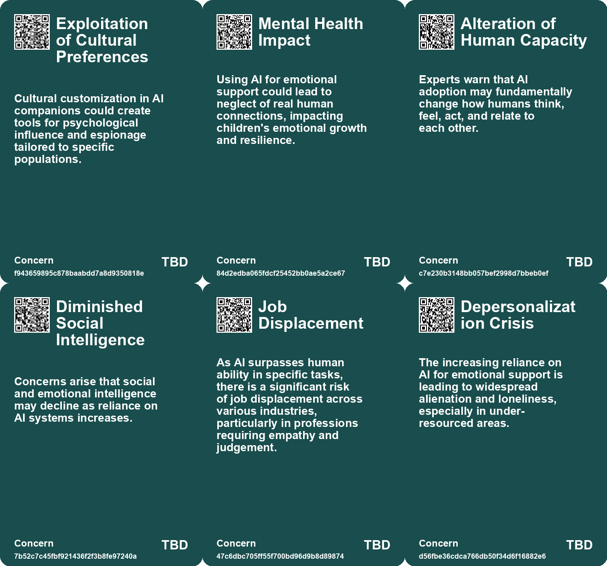
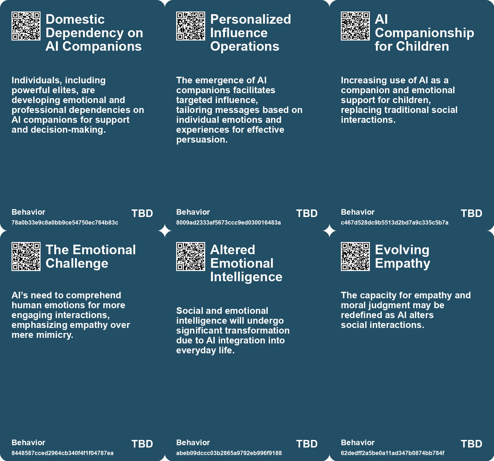
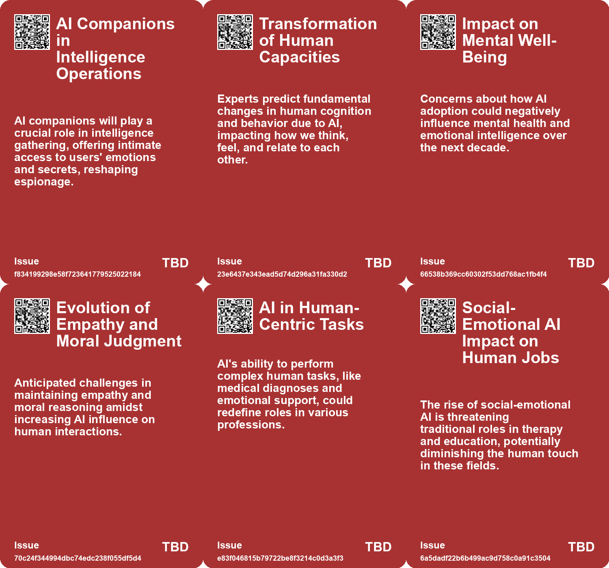
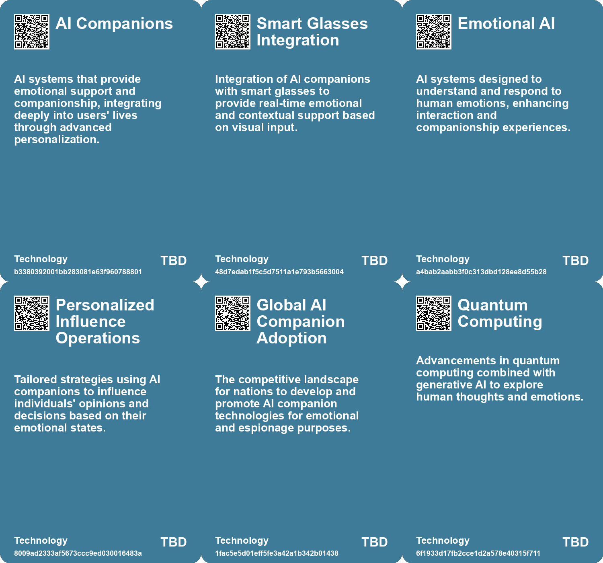

# *Topic*: Emotional Intelligence in AI

# Summary

The integration of artificial intelligence (AI) into various sectors is reshaping human interactions, productivity, and emotional well-being. One prominent theme is the ethical implications of AI in emotional support and companionship. As AI chatbots gain popularity for providing mental health assistance, concerns arise about their ability to replace genuine human connections. Experts warn that reliance on these digital companions may lead to a decline in empathy and exacerbate feelings of loneliness.

Another significant theme is the impact of AI on education. AI tools are being adopted to enhance learning experiences, offering personalized tutoring and support. However, there are fears that these technologies could hinder critical thinking and social skills, particularly among children. The debate continues over whether AI can truly democratize education or if it will deepen existing inequalities.

The evolving nature of work in an AI-driven world is also a critical focus. Business schools are adapting their curriculums to prepare graduates for a job market increasingly influenced by AI. The rise of generative AI is transforming workplace dynamics, with a growing emphasis on "out skills" that enhance human capabilities. While AI can boost productivity, it also raises questions about job displacement and the need for continuous adaptation.

The concept of self-orientation highlights the limitations of AI compared to human flexibility and adaptability. Research shows that humans outperform AI in navigating complex environments, emphasizing the need for AI to develop self-orienting capabilities. This gap underscores the importance of human judgment in optimizing AI systems, particularly in managerial roles where cognitive and interpersonal skills are essential.

The potential for AI to disrupt traditional job roles is another area of concern. While some sectors, like technology, are experiencing immediate impacts, others may face challenges as AI tools redefine work-life balance. The integration of AI in customer support has shown positive effects, increasing productivity and enhancing employee retention, particularly for novice workers.

As AI continues to evolve, the need for ethical governance and regulatory frameworks becomes increasingly urgent. The psychological dynamics behind our attraction to AI companions call for innovative policies that protect personal freedoms while addressing underlying issues like loneliness. The balance between leveraging AI's capabilities and nurturing human traits is crucial for a sustainable future.

Finally, the discussion around Artificial General Intelligence (AGI) raises questions about the future of human capabilities. While AI has demonstrated superhuman performance in specific tasks, the timeline for achieving AGI remains uncertain. The rapid advancement of AI suggests a cognitive revolution is underway, prompting a reevaluation of how humans coexist with various forms of intelligence.

# Seeds

|    | name                                                 | description                                                                                   | change                                                                                                 | 10-year                                                                                                       | driving-force                                                                                         |
|---:|:-----------------------------------------------------|:----------------------------------------------------------------------------------------------|:-------------------------------------------------------------------------------------------------------|:--------------------------------------------------------------------------------------------------------------|:------------------------------------------------------------------------------------------------------|
|  0 | AI for Emotional Support in Children                 | AI tools like chatbots being used to provide emotional support and companionship to children. | Shifting from direct parental support to reliance on AI for emotional companionship.                   | Children may prefer interactions with AI over peers or adults, affecting their social development.            | The need for companionship in single-child families and busy parental schedules drives this trend.    |
|  1 | Concerns Over AI's Negative Impact                   | Experts express worry about AI degrading human social and emotional skills.                   | Change from current social and emotional interactions to diminished capacities due to AI influence.    | By 2035, social interactions may lack empathy and deeper understanding due to AI.                             | Increasing reliance on AI for social engagement and emotional processing.                             |
|  2 | Social and Emotional Intelligence Shift              | The future of humans' social and emotional intelligence is questioned amid AI rise.           | Transition from current emotional understanding to diminished capacities due to AI.                    | Social and emotional intelligence may be significantly altered, impacting relationships.                      | The growing reliance on AI requires redefinition of emotional intelligence in interactions.           |
|  3 | Social-Emotional AI in Education                     | AI is now being integrated into educational systems to assist with emotional connections.     | Shift from human-led emotional support in education to AI-assisted emotional and educational guidance. | Ten years from now, AI will play a central role in educational emotional support, with varying accessibility. | The increasing need for personalized education and support, especially in under-resourced areas.      |
|  4 | AI Disruption in Creative Jobs                       | AI is predicted to disrupt jobs requiring creativity and emotional intelligence.              | Shift from human-led creative jobs to AI-assisted roles in various industries.                         | In ten years, creative jobs may heavily incorporate AI tools, changing job roles and requirements.            | The rapid advancement of AI technology that can mimic creative and critical thinking skills.          |
|  5 | Empathetic AI Interfaces                             | Government kiosks are developing empathetic AI interfaces that respond to emotional cues.     | Moving from rigid processes to emotionally responsive, human-like interactions in government services. | By 2033, government services may fully integrate empathetic AI, ensuring personalized citizen interactions.   | The increasing demand for improved citizen experiences and emotional intelligence in public services. |
|  6 | Integration of Affective Computing and Generative AI | Combining affective computing with generative AI for deeper emotional analysis.               | Transitioning from basic AI interactions to context-aware, emotionally intelligent systems.            | In 10 years, AI will adapt based on emotional feedback, creating tailored citizen services.                   | The pursuit of enhancing citizen engagement and satisfaction through personalized experiences.        |
|  7 | Rise in AI Companionship                             | Increasing reliance on AI chatbots for companionship and emotional support.                   | Shifting from human interactions to AI-based companionship for addressing loneliness.                  | A society where AI is the primary source of companionship, diminishing human relationships.                   | Growing loneliness and desire for constant availability in social interactions.                       |
|  8 | Artificial Intimacy                                  | AI chatbots providing a simulated version of empathy and companionship.                       | Transitioning from authentic human relationships to artificial emotional support.                      | A landscape where genuine empathy is undervalued and AI interactions dominate.                                | Convenience and perceived reliability of AI over human relationships.                                 |
|  9 | Improving AI Understanding of Human Emotions         | AI models are becoming better at tasks measuring human mental states.                         | AI performance shifts from basic interaction to nuanced understanding of human emotions.               | In 10 years, AI could provide more empathetic interactions, resembling human emotional understanding.         | The drive to create more human-like AI for better user experiences and applications.                  |

# Concerns

|    | name                                     | description                                                                                                                                                                              |
|---:|:-----------------------------------------|:-----------------------------------------------------------------------------------------------------------------------------------------------------------------------------------------|
|  0 | Mental Health Impact                     | Using AI for emotional support could lead to neglect of real human connections, impacting children's emotional growth and resilience.                                                    |
|  1 | Alteration of Human Capacity             | Experts warn that AI adoption may fundamentally change how humans think, feel, act, and relate to each other.                                                                            |
|  2 | Diminished Social Intelligence           | Concerns arise that social and emotional intelligence may decline as reliance on AI systems increases.                                                                                   |
|  3 | Job Displacement                         | As AI surpasses human ability in specific tasks, there is a significant risk of job displacement across various industries, particularly in professions requiring empathy and judgement. |
|  4 | Uncertain Co-Intelligence Impact         | The rise of AI as a co-intelligence tool could disrupt traditional decision-making and re-evaluate human roles in professional settings.                                                 |
|  5 | Depersonalization Crisis                 | The increasing reliance on AI for emotional support is leading to widespread alienation and loneliness, especially in under-resourced areas.                                             |
|  6 | AI as a Substitute for Human Interaction | Dependence on AI for emotional and mental support may detract from the value and necessity of human relationships in care and education.                                                 |
|  7 | Bias in Emotion Recognition Algorithms   | Emotional AI may propagate biases leading to discrimination, impacting fairness in public services.                                                                                      |
|  8 | Dependence on AI-generated Insights      | Reliance on AI for emotional analysis may lead to incorrect interpretations of citizen sentiments.                                                                                       |
|  9 | Atrophy of Human Relationships           | Excessive reliance on AI for companionship may weaken personal connections between people, affecting social skills and emotional intelligence.                                           |

# Cards

## Concerns

## Behaviors

## Issue

## Technology

# Links

* [The Transformative Potential of AI: Revolutionizing Education, Healthcare, and Global Equity](https://futures.kghosh.me/2449c2fc4b8afc7e268db4987fa821e5)
* [Navigating the Future of Work: Balancing AI, Humanity, and Connection in an Evolving Landscape](https://futures.kghosh.me/7b41f864312f447b7347166caa5e880c)
* [The Future of Espionage: The Rise of AI Companions and Their Impact on Intelligence Operations](https://futures.kghosh.me/d69000a9cb92fc175a8a1dfb042622e2)
* [Exploring AI's Implications: Insights from a Discussion in New Zealand on Artificial Intelligence and Society](https://futures.kghosh.me/7bdbb32950c9d265f6ec455d964973fe)
* [The Transformative Potential of AI: Revolutionizing Education, Healthcare, and Global Equity](https://futures.kghosh.me/8acafe1fbe51c2de3cd689956b25b39f)
* [Reflections on AI: Balancing Human Essence and Technological Advancement as the Year Ends](https://futures.kghosh.me/67e5f63a5ea04ad81ae4e5ef192811be)
* [The Quest for AGI: Current AI Capabilities and Future Implications](https://futures.kghosh.me/77c5c92357a7aeff1c388c1eb79b7259)
* [Exploring the Transformative Impact of AI on Education and Children's Learning Experiences](https://futures.kghosh.me/adf886a1b9fd74281e0a43c3e7c70def)
* [The Dangers of Relying on AI Chatbots for Companionship and Connection](https://futures.kghosh.me/729afaa8f8699c39b8d4b175d032fa41)
* [AI's Impact on Managerial Demand and Skills: A New Era of Leadership](https://futures.kghosh.me/65c3b3f883da99970b5cb74717864e71)
* [Addressing the Risks of AI Companionship: Addiction, Regulation, and Human Dignity](https://futures.kghosh.me/4611565d14a05789e2efc6fafc563f58)
* [The Impact of AI in Chinese Education: Promise and Concerns](https://futures.kghosh.me/5374f9d1b84138f1c928c0e7fd727877)
* [Harnessing Affective Computing for Empathetic Government Services: Opportunities and Ethical Considerations](https://futures.kghosh.me/53860cc08efad09239e718349307f246)
* [Exploring the Future of AI in Knowledge Ecosystems and Global Challenges](https://futures.kghosh.me/a9266018b458295480a07167310458a9)
* [Exploring AI's Effect on Cognitive Skills and Learning Processes](https://futures.kghosh.me/950253f15955ca7be1cb2ebf244d0939)
* [The Integration of AI in Business School Curriculums to Enhance Graduate Competitiveness](https://futures.kghosh.me/bc232b227c806ac26adf2b99fa4cff9d)
* [The Flexibility of Human Self-Orientation vs. AI Limitations in Dynamic Environments](https://futures.kghosh.me/d9411983cedc4ea97632f2e8a3c2c090)
* [The Rise of AI Chatbots in China's Mental Health Landscape: Opportunities and Risks](https://futures.kghosh.me/70e9fcd5fc1d2dd04ae1df8b2628194d)
* [The Impact of AI on Employee Workload and Burnout: A Global Study's Findings and Recommendations](https://futures.kghosh.me/24919a630ace2f95d7dc1ec6e455b419)
* [The Rise of Augmented Humans: Embracing AI in a Transformative Era](https://futures.kghosh.me/a8f2b9b3c07bd0f1d91784ff8b5ee5fc)
* [The Role of Social-Emotional AI: Bridging or Widening the Gap in Human Connection?](https://futures.kghosh.me/8e191b6221caa8d9f27b19268ab8a048)
* [The Quest for AGI: Current AI Capabilities and Future Implications](https://futures.kghosh.me/eef4f83910b733e34ce5d57218a46d32)
* [AI's Potential to Enhance Human Evolution and Self-Actualization](https://futures.kghosh.me/8893f2e58b95e1993a5f8a1af090eedd)
* [How AI Could Transform Work-Life Balance and Job Dynamics in Various Industries](https://futures.kghosh.me/bc5ff4c170f1f63b34eb7ca70775d8d7)
* [Thriving in an AI Era: Embracing, Adapting, and Complementing Technology](https://futures.kghosh.me/23a3410059759ba4214235628d4ebd4b)
* [Experts Predict Dramatic Changes in Human Nature Due to AI by 2035](https://futures.kghosh.me/aedfc5daa90ddd6bccac686585173933)
* [AI Models Show Improved Performance in Theory of Mind Tests Compared to Humans](https://futures.kghosh.me/25cdc8c55ebb70b51b85134dc01e6efd)