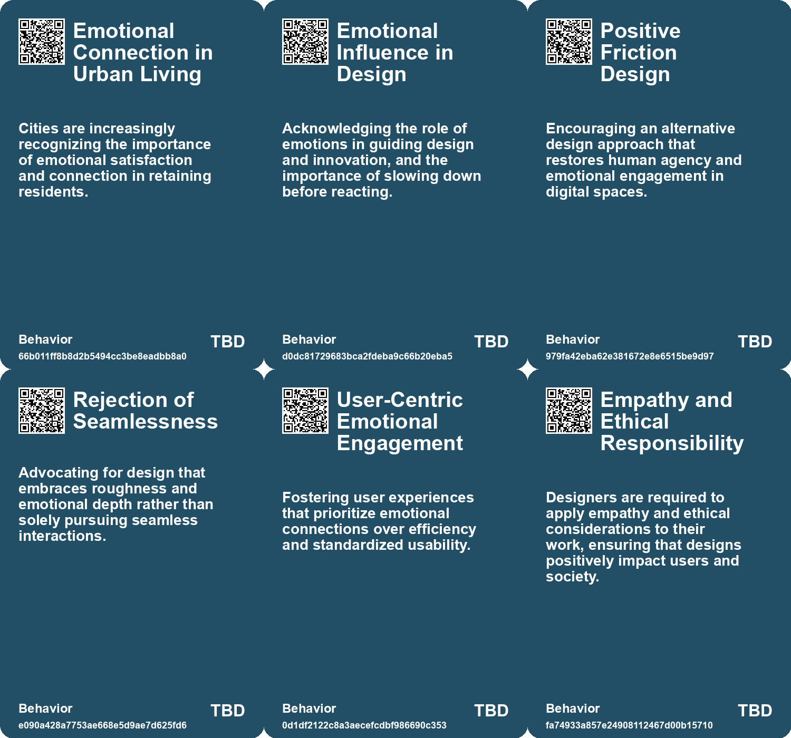
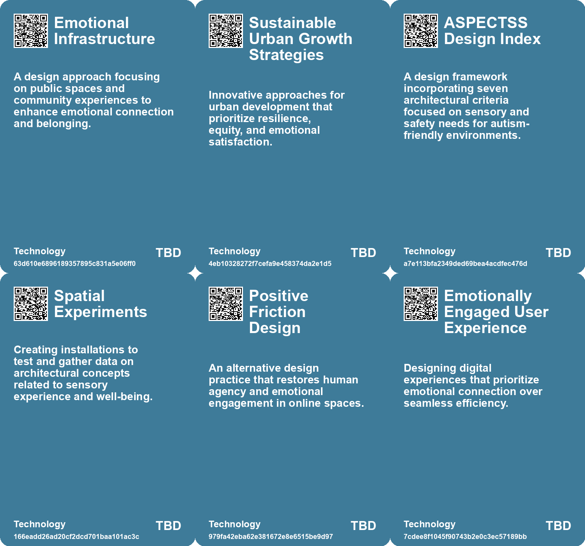

# *Topic*: Emotional Wellbeing in Design

# Summary

The intersection of design, technology, and human experience emerges as a central theme across various discussions. The rapid advancement of artificial intelligence and digital tools is reshaping the design landscape, making it more accessible to a broader audience. This democratization of design is accompanied by a shift in the role of designers, who are now required to adopt a systems mindset and prioritize user needs while navigating ethical considerations.

The concept of emotional intelligence in design is gaining traction, particularly in the context of public services. Affective computing is being integrated into government interactions, aiming to create more empathetic and responsive experiences for citizens. This approach highlights the importance of emotional connections in fostering trust and satisfaction in public services.

Sustainability remains a critical focus, with discussions emphasizing the need for regenerative design principles that promote harmony between human activities and the natural environment. Reports advocate for a shift towards circular economies and sustainable practices, urging designers and policymakers to consider the socio-ecological impacts of their decisions. The call for child-friendly urban planning underscores the importance of creating inclusive spaces that cater to the needs of younger generations, ultimately benefiting entire communities.

The role of creativity in the face of technological advancements is also a significant theme. While AI offers efficiency, it poses a threat to traditional creative careers. The need for designers to collaborate with AI and embrace innovative thinking is essential for maintaining the value of human creativity. This collaboration can free up time for more authentic and unique design processes.

Mental health considerations are increasingly relevant in various fields, including open-source research and education. The importance of maintaining mental hygiene and establishing healthy work-life boundaries is emphasized, particularly in high-stress environments. This focus on well-being extends to the design of educational tools, where the use of apps to monitor student moods raises concerns about privacy and the potential for self-surveillance.

Finally, the future of work is characterized by the need for adaptability and continuous learning. Emerging sectors, such as regenerative industries and care-based economies, present new opportunities for job creation. Individuals are encouraged to cultivate skills that align with these evolving demands, while governments are urged to support lifelong learning and collaboration to prepare for a changing economic landscape.

# Seeds

|    | name                                     | description                                                                                  | change                                                                                              | 10-year                                                                                                             | driving-force                                                                                      |
|---:|:-----------------------------------------|:---------------------------------------------------------------------------------------------|:----------------------------------------------------------------------------------------------------|:--------------------------------------------------------------------------------------------------------------------|:---------------------------------------------------------------------------------------------------|
|  0 | Emotional Connection as a Differentiator | Cities are focusing on emotional connections to retain residents, not just economic factors. | Shift from metrics like economic opportunity to emotional satisfaction in urban success indicators. | Cities might become more community-focused with integrated emotional and social planning as a priority.             | A growing understanding of mental well-being and community ties in urban environments              |
|  1 | Community-Centric Approaches             | Rising emphasis on social and community benefits in design processes.                        | Transition from individualistic designs to community-focused regenerative approaches.               | Communities might benefit from improved social cohesion and environmental health due to inclusive design practices. | Demand for social justice and equitable access to resources in urban spaces.                       |
|  2 | Emotions in Innovation                   | Recognition of emotions as a driving force in design and innovation processes.               | From objective, data-driven design to emotionally aware and responsive design.                      | Innovations will increasingly reflect emotional intelligence, creating more relatable and impactful designs.        | The need for deeper connection and resonance in products and services.                             |
|  3 | Sensory decolonization                   | A movement to create mindful sensory environments in urban design.                           | From commodified, overstimulating environments to more considerate, inclusive spaces.               | Cities will be designed with sensory inclusivity, benefiting a wider range of neurodiverse individuals.             | Awareness of sensory sensitivities in diverse populations including neurodiverse individuals.      |
|  4 | Positive Friction in Design              | Encouraging alternative design practices to restore human agency in digital spaces.          | Shift from standardized, emotionless design to frictional, engaging experiences.                    | Designs that prioritize emotional engagement and creativity over efficiency in digital interactions.                | A growing desire for emotional engagement and memorable experiences in digital interactions.       |
|  5 | Emphasis on Emotion in Design            | Highlighting the importance of emotions in digital design practices.                         | From a focus on efficiency to prioritizing emotional depth in user interactions.                    | Digital designs that evoke emotions and create lasting memories for users.                                          | Recognition of the emotional dimension as essential for user satisfaction and connection.          |
|  6 | Mental Health and Creativity Focus       | A growing emphasis on creativity as a key component of mental health.                        | Shifting from basic mental health services to integrating creativity as a therapeutic tool.         | In 10 years, creative sectors will flourish, significantly contributing to mental health and community well-being.  | Rising mental health awareness prompting the integration of creative therapies in various sectors. |
|  7 | Digital Twins for Urban Planning         | The concept of digital twins integrated with emotional data for urban planning is emerging.  | Moving from traditional planning to data-driven, emotionally informed urban design.                 | Cities could dynamically adapt in real time to citizens' emotional responses and needs by 2033.                     | The need for urban environments that foster positive emotional experiences for residents.          |
|  8 | Focus Shift from Empathy to Context      | A call to prioritize context understanding over mere empathy in design processes.            | From empathy-centric design approaches to context-aware design methodologies.                       | Design education may emphasize contextual understanding, changing how designers approach problems.                  | Recognizing the multi-faceted influences on design beyond just user empathy.                       |
|  9 | Mental Health and Creativity Focus       | A growing emphasis on creativity as a key component of mental health.                        | Shifting from basic mental health services to integrating creativity as a therapeutic tool.         | In 10 years, creative sectors will flourish, significantly contributing to mental health and community well-being.  | Rising mental health awareness prompting the integration of creative therapies in various sectors. |

# Concerns

|    | name                                  | description                                                                                                                                                   |
|---:|:--------------------------------------|:--------------------------------------------------------------------------------------------------------------------------------------------------------------|
|  0 | Emotional Infrastructure Gap          | As cities prioritize emotional infrastructure, a lack of investment may hinder urban resilience and long-term growth.                                         |
|  1 | AI Misinterpretation of Human Emotion | AI may struggle to grasp the emotional depth of human creativity, leading to less impactful designs.                                                          |
|  2 | Emotional Impact on Design            | The influence of emotions in design decisions can lead to unintended social and environmental consequences, compounding existing problems.                    |
|  3 | Mindless Design Practices             | Architectural and urban design practices often overlook the implications of sensory experiences, leading to environments that may disable rather than enable. |
|  4 | Ethical Design Practices              | The increasing complexity of user needs calls for stronger advocacy for ethical design, especially regarding accessibility and user welfare.                  |
|  5 | Ethical Use of Affective Computing    | Navigating the ethical implications of utilizing affective computing in government services is crucial for trust.                                             |
|  6 | Vicarious Trauma Awareness            | Researchers face cumulative emotional distress from engaging with traumatic content, which can impact mental health and decision-making.                      |
|  7 | Sound Distress                        | Audio elements in graphic content can intensify emotional responses, necessitating strategies to mitigate their impact.                                       |
|  8 | Self-Monitoring for Mental Health     | Researchers must actively monitor their emotional responses to avoid burnout and maintain psychological health.                                               |
|  9 | Loss of Joy in Modern Society         | As success is redefined, the potential loss of genuine joy amidst consumerism and societal pressures is a concern that needs addressing.                      |

# Cards

## Concerns

## Behaviors

## Issue

## Technology

# Links

* [The 2025 Transformation of the AEC Industry: Embracing Innovation and Sustainability](https://futures.kghosh.me/7b28983e661f02dd4b79aa866889d2a4)
* [Reimagining Design: Moving Beyond Human-Centricity for Sustainability](https://futures.kghosh.me/5374f630138505a84bf07f321ed3d05e)
* [Exploring Regenerative Design for Harmonious Coexistence with Nature](https://futures.kghosh.me/a1acb04c0f65f709ad6c8ce2f0946a51)
* [Design as Governance: Lessons from a Coffee Shop Experience on User-Centric Design](https://futures.kghosh.me/2587a142b15645727d2adbee3539d4de)
* [Restoring Human Agency in Digital Design Through Friction and Creativity](https://futures.kghosh.me/c6357a8ef791346fab1c951e0773476f)
* [Understanding the Distinction Between Design Thinking and Digital Product Design](https://futures.kghosh.me/e7f06e98059e0e8ed4f95bb326e60e1c)
* [Gensler's City Pulse Survey Highlights Emotional Connections in Urban Migration and Retention](https://futures.kghosh.me/8ef19e1177d942bd48ddfdf4db392264)
* [Denmark's Digital Mood Monitoring: A Boon or a Burden for Student Well-being?](https://futures.kghosh.me/17ac55c1f87675e075557fa4fa5ba14e)
* [Rethinking Architecture: Embracing Futures Thinking to Combat Climate Crisis](https://futures.kghosh.me/26e385bfcd6784d024e3e49e8b04ce89)
* [Essential Strategies for Open Source Researchers to Protect Mental Health](https://futures.kghosh.me/ed4473b3a0fa1513b565081d8773b33e)
* [Exploring Healing-Centric Design in the Age of Emerging Technologies](https://futures.kghosh.me/6ce4d4d1c40fef14044ea70a600c66d4)
* [The Rise of PSYCARE: How Mental Health is Reshaping the Beauty Industry](https://futures.kghosh.me/b396d58ff64cbfdfe136c278b263ee5a)
* [Future of Work: Embracing Opportunities and Adapting to Change Over the Next 50 Years](https://futures.kghosh.me/a601d356f6c81dbc065229f13e92c3f8)
* [Emerging Technologies Shape the Future of the AEC Industry in 2025](https://futures.kghosh.me/95d469c68ec86b47c502e645a5b5c141)
* [Harnessing Affective Computing for Empathetic Government Services: Opportunities and Ethical Considerations](https://futures.kghosh.me/53860cc08efad09239e718349307f246)
* [Designing for Autism: A Comprehensive Approach to Inclusive Spaces](https://futures.kghosh.me/f4e5def07bc81aa4c6815cb7a529e44f)
* [Architecting Joy: Understanding the Elements of True Contentment and Connection](https://futures.kghosh.me/ec3b733c80a9fc0239d120b8450c979b)
* [The Evolving Role of Designers in an Era of Accessible Digital Tools and Automation](https://futures.kghosh.me/ece4f1f782525a6ae341e9d4c9df3533)
* [Future of Work: Embracing Opportunities and Adapting to Change Over the Next 50 Years](https://futures.kghosh.me/56ddb45deabcdc8b707c7647270e101d)
* [Exploring the Balance Between AI Efficiency and Human Creativity in Design](https://futures.kghosh.me/92ae644db3cc8e4d0fb262bac8413f8b)
* [Creating Child-Friendly Urban Spaces: A Path to Better Cities for All](https://futures.kghosh.me/f4247162dcc5eb2eb0d87f1843f993d8)