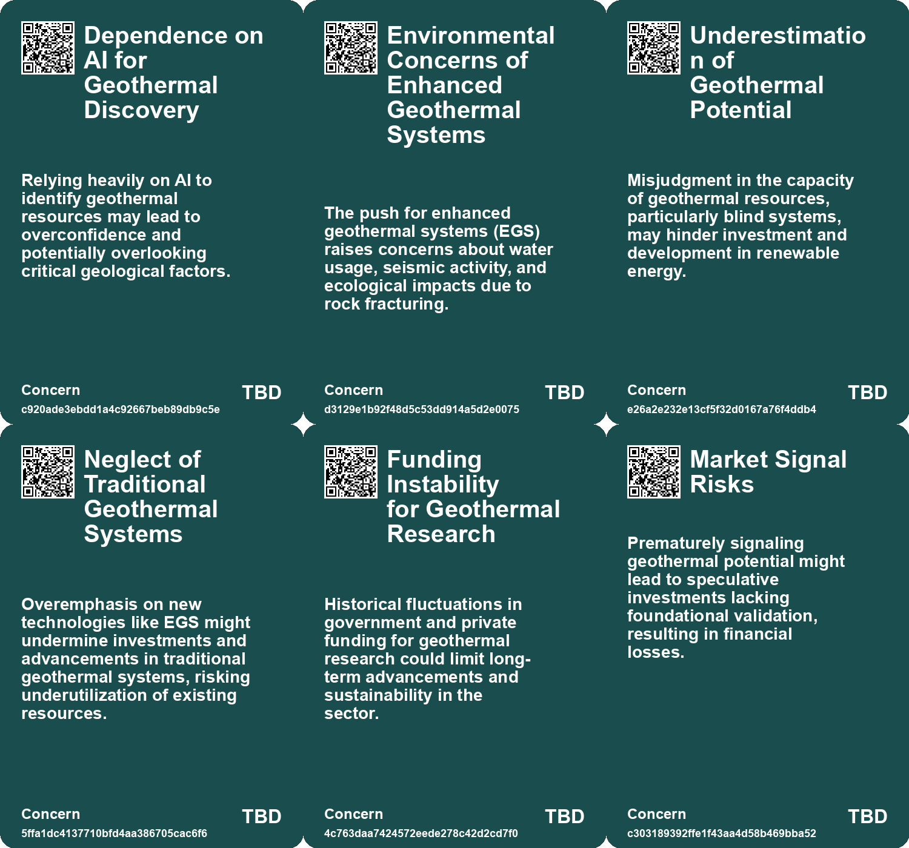
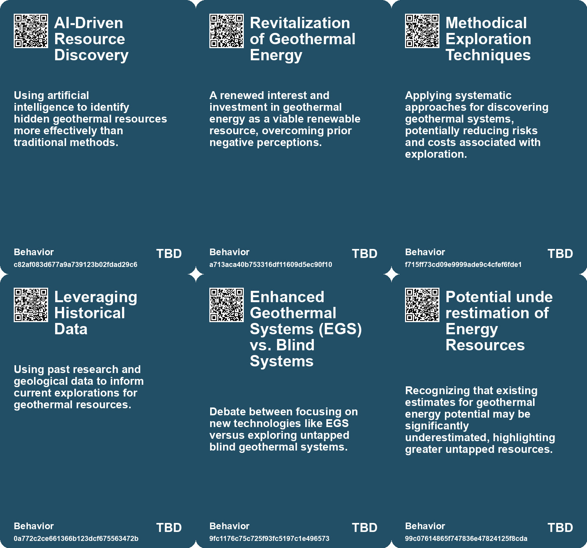
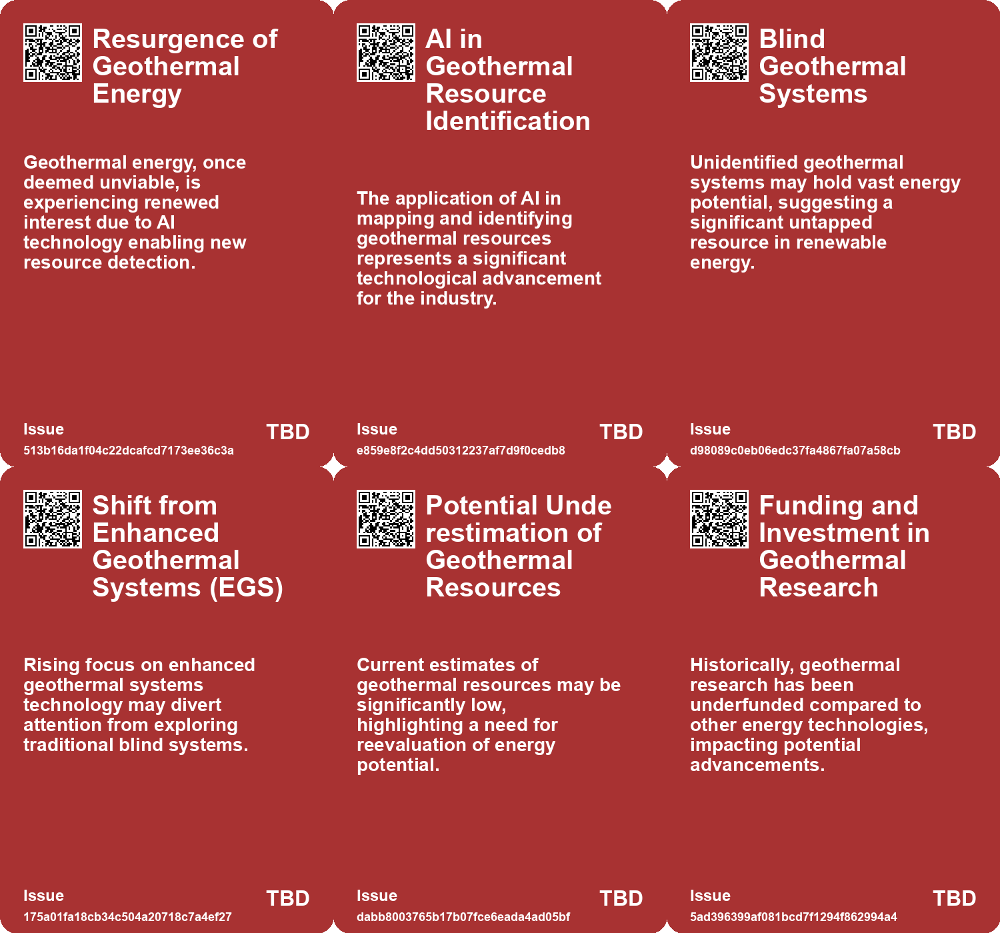
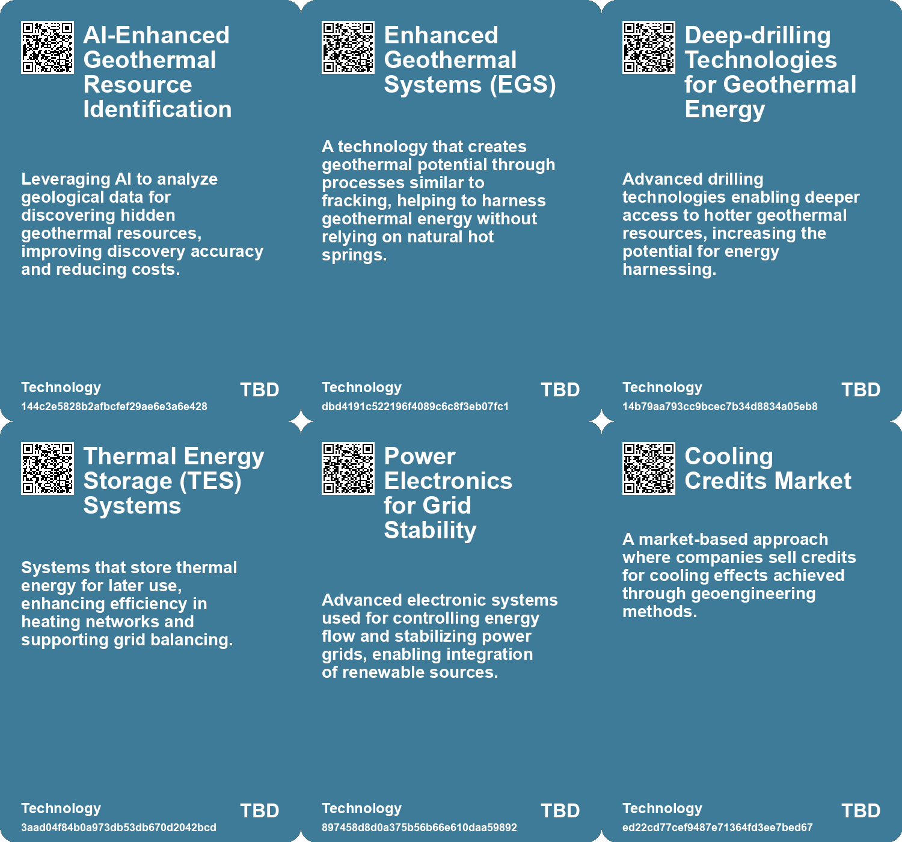

# *Topic*: Enhanced Geothermal Systems (EGS)

# Summary

Innovative energy solutions are emerging as a response to the global demand for sustainable resources. Zanskar, a geothermal startup, has made a significant geothermal discovery in Nevada, identifying a viable site for a power plant that could harness untapped energy from blind geothermal systems. This technology could potentially power millions of homes without extensive mining.

In the realm of water sustainability, MIT engineers have developed a solar-powered desalination system that efficiently converts brackish groundwater into clean drinking water. This system operates without battery storage, maximizing solar energy use and aiming to provide affordable water to inland communities facing saline groundwater challenges.

Finland is advancing its district heating capabilities through a collaboration between Polar Night Energy and Lahti Energia, utilizing a 'Sand Battery' technology. This system, with a heating power of 2MW, aims to significantly reduce fossil fuel emissions while providing sustainable heat to the district network.

Nuclear energy is also seeing innovation, with researchers in China successfully operating a thorium-powered molten salt reactor. This technology is considered safer than traditional nuclear systems and marks a revival of interest in thorium as a fuel source. Meanwhile, Westinghouse is developing the eVinci™ Microreactor, designed for decentralized applications, emphasizing transportability and minimal maintenance.

In the United States, Heimdall Power is enhancing grid efficiency with sphere-shaped sensors that monitor high-voltage power lines. This technology has already increased power-line capacity by 30% in Europe and aims to improve electricity stability while integrating more renewable energy into the grid.

Deep-sea mining is gaining traction as a potential source of critical minerals for clean energy technologies. The Metals Company is testing a remote-controlled machine designed to collect polymetallic nodules from the ocean floor, which contain essential metals for electric car manufacturing. However, environmental concerns persist regarding the impact of such mining practices.

Agricultural technology is also evolving, with African farmers leveraging private satellite data to improve crop yields. This data-driven approach allows farmers to monitor their fields more effectively, addressing challenges posed by climate change and traditional farming methods.

In the realm of energy storage, firebricks are being recognized as a cost-effective solution for transitioning industries to renewable energy. These thermal energy storage units can provide the high temperatures needed for manufacturing processes without relying on fossil fuels.

Cultural heritage is being preserved sustainably, as seen in Pompeii, where invisible solar panels are being installed to power the site without compromising its historical appearance. This initiative reflects a growing trend of integrating renewable energy solutions into heritage management.

Finally, advancements in quantum technology are being explored, with NASA set to launch a quantum sensor designed to detect subtle shifts in Earth’s gravity. This mission aims to improve the mapping of natural resources and geological shifts, potentially revolutionizing resource management and exploration.

These developments across various sectors highlight a collective movement towards sustainable practices, innovative technologies, and a commitment to addressing the pressing challenges of climate change and resource management.

# Seeds

|    | name                                                 | description                                                                                       | change                                                                                                      | 10-year                                                                                                              | driving-force                                                                                                   |
|---:|:-----------------------------------------------------|:--------------------------------------------------------------------------------------------------|:------------------------------------------------------------------------------------------------------------|:---------------------------------------------------------------------------------------------------------------------|:----------------------------------------------------------------------------------------------------------------|
|  0 | Resurgence of geothermal energy interest             | Growing excitement and investment in geothermal energy following decades of neglect.              | Transitioning from undervalued and abandoned technology to a competitive renewable energy option.           | Geothermal energy could contribute significantly to the renewable energy mix in the US.                              | Increasing demand for sustainable energy sources and energy security pushes this resurgence.                    |
|  1 | Enhanced Geothermal Systems (EGS) hype               | Public focus shifting toward EGS technologies, overshadowing blind geothermal systems.            | Shifting excitement from traditional geothermal to more complex and processed technologies like EGS.        | EGS may dominate geothermal discussions, but blind systems could reveal greater potential.                           | The pursuit of innovation and solutions for deeper resource tapping drives focus away from traditional methods. |
|  2 | Underestimated potential of blind geothermal systems | Research suggests much higher potential for blind geothermal resources than previously thought.   | Changing from a 30 GW potential estimate to a potential of 100s of GW based on new findings.                | Policies and investments may shift drastically to tap into the much larger unutilized geothermal potential.          | Advances in drilling technology and geological understanding fuel reevaluation of blind systems' viability.     |
|  3 | Geothermal’s untapped potential in the Western US    | Many hidden geothermal systems remain unexplored, suggesting vast energy potential.               | From minimal utilization to recognizing Western US as a hotspot for renewable geothermal energy production. | The Western US could become a leading region for geothermal energy, significantly impacting energy supply.           | Geological data and improved identification methods promote exploration of these hidden resources.              |
|  4 | Sand Battery Technology                              | A new energy storage solution using sand as a thermal medium for heating.                         | Shifting from traditional fossil fuels to innovative renewable heating solutions.                           | Widespread adoption of Sand Batteries could revolutionize district heating across Europe.                            | Demand for sustainable energy solutions aligns with global climate goals.                                       |
|  5 | Scaling Renewable Heating Solutions                  | Large-scale projects demonstrating viability of renewable thermal energy systems.                 | Scaling up thermal energy storage from smaller projects to larger district heating networks.                | Large-scale renewables could dominate urban energy systems, enhancing efficiency and sustainability.                 | Advances in technology and funding for renewable infrastructure promoting larger projects.                      |
|  6 | Market for Cooling Credits                           | Emergence of a market for credits based on geoengineering efforts like sulfur dioxide injection.  | Shift from traditional carbon offsets to new forms of geoengineering credits.                               | In 10 years, the market for geoengineering credits could expand significantly, raising ethical concerns.             | Desire for immediate climate action solutions, creating demand for innovative offset mechanisms.                |
|  7 | Technological Advances in Mining Equipment           | Emerging technologies designed for efficient collection of deep-sea mineral resources.            | Shift in mining methods from traditional land methods to advanced underwater technology.                    | New technologies may enable more efficient and less damaging extraction processes in deep-sea mining.                | Technological innovation driven by the need for sustainable mineral extraction methods.                         |
|  8 | Real-time Monitoring in Nuclear Facilities           | Integration of advanced monitoring systems in nuclear reactors for enhanced safety and oversight. | Shift from periodic manual checks to continuous real-time monitoring of reactor performance and safety.     | In ten years, nuclear plants may operate with fully automated, AI-driven monitoring systems ensuring maximum safety. | Technological advancements in AI and data analytics for improved operational safety and efficiency.             |
|  9 | Affordable Nuclear Energy Solutions                  | Development of cost-effective nuclear energy systems for residential use.                         | Move from expensive traditional energy systems to more affordable nuclear alternatives.                     | Nuclear energy may become a mainstream, cost-effective alternative to fossil fuels in residential areas.             | Economic pressures pushing for lower-cost, stable energy solutions amidst rising energy prices.                 |

# Concerns

|    | name                                                  | description                                                                                                                                                               |
|---:|:------------------------------------------------------|:--------------------------------------------------------------------------------------------------------------------------------------------------------------------------|
|  0 | Dependence on AI for Geothermal Discovery             | Relying heavily on AI to identify geothermal resources may lead to overconfidence and potentially overlooking critical geological factors.                                |
|  1 | Environmental Concerns of Enhanced Geothermal Systems | The push for enhanced geothermal systems (EGS) raises concerns about water usage, seismic activity, and ecological impacts due to rock fracturing.                        |
|  2 | Underestimation of Geothermal Potential               | Misjudgment in the capacity of geothermal resources, particularly blind systems, may hinder investment and development in renewable energy.                               |
|  3 | Neglect of Traditional Geothermal Systems             | Overemphasis on new technologies like EGS might undermine investments and advancements in traditional geothermal systems, risking underutilization of existing resources. |
|  4 | Funding Instability for Geothermal Research           | Historical fluctuations in government and private funding for geothermal research could limit long-term advancements and sustainability in the sector.                    |
|  5 | Market Signal Risks                                   | Prematurely signaling geothermal potential might lead to speculative investments lacking foundational validation, resulting in financial losses.                          |
|  6 | Public Perception of Geothermal Viability             | Misleading narratives around geothermal energy's potential could lead to public disillusionment if expectations are not met.                                              |
|  7 | Geopolitical Tensions Over Resources                  | Enhanced detection of resources may intensify competition and conflicts among nations over access to underground resources.                                               |
|  8 | Environmental Impact of Heat Generation               | Failure to mitigate heat generation from non-regenerative systems may negatively impact subway infrastructure and energy efficiency.                                      |
|  9 | Environmental Impact of Experimental Facilities       | Concerns regarding the ecological footprint and resource consumption of constructing and operating large experimental fusion reactors.                                    |

# Cards

## Concerns

## Behaviors

## Issue

## Technology

# Links

* [Innovations in Deep-Sea Mining: The Metals Company's Quest for Polymetallic Nodules](https://futures.kghosh.me/5bbc958cd9d41c08482acdaa4ac033e4)
* [China Achieves Landmark Success with Thorium-Powered Nuclear Reactor in Gobi Desert](https://futures.kghosh.me/c48f3a9b02f019354d70e1e43401525d)
* [Introducing the Enron Egg: A Compact and Safe Nuclear Energy Solution](https://futures.kghosh.me/dfb71549f97aeb8903d04389db76676a)
* [Exploring the Intersection of Video Game Simulation and Real-World Ecology](https://futures.kghosh.me/57fcfcda347e1934e0c1da9fc212fcec)
* [Innovative Quantum Sensing Technique Revolutionizes Infrastructure and Environmental Monitoring](https://futures.kghosh.me/92eababae2221aa6578c0eb95e5c370a)
* [Earth AI's Breakthrough in Mineral Discovery Using AI Technology in Australia](https://futures.kghosh.me/01d99c80c2a7c79cb131a6b2038c8c8e)
* [Google Partners with Kairos Power for Nuclear Energy to Power AI Data Centers](https://futures.kghosh.me/f9ef1fc984ab921e2f13d2c53db0a066)
* [The Call for a New, Focused ESG: Prioritizing Employees, Society, and Government](https://futures.kghosh.me/022335f24a4ab2580a4b1fb2dbb53fac)
* [Controversy Surrounds Make Sunsets' Weather Balloon Geoengineering Efforts in Climate Change Mitigation](https://futures.kghosh.me/9b4d90ee224c8b25ebb36d59218abe6f)
* [Greenlanders Support Sand Extraction Amid Climate Change: A New Economic Opportunity?](https://futures.kghosh.me/6c6a5e8d50e3045323cf202ba5b17ea9)
* [Innovation in Scotland: The Role of Grid-Scale Batteries in Stabilizing Energy Grids](https://futures.kghosh.me/ece3bd8007e38ba75470c88fcdafd4d3)
* [Innovative E-seed Technology Enhances Aerial Seeding Inspired by Nature](https://futures.kghosh.me/58c165e1a46408307f2b60f63df7c549)
* [Heimdall Power and Meteomatics Boost Power Grid Capacity by 30% Through Innovative Technology](https://futures.kghosh.me/ac1dca3c524bdd7aa99f29fd255c7c41)
* [Pompeii Adopts Invisible Solar Panels for Sustainable Archaeological Preservation](https://futures.kghosh.me/417d54f0e3fadd969f3f7fac0a03c99f)
* [How African Farmers Are Leveraging Satellite Data to Enhance Crop Yields and Combat Climate Change](https://futures.kghosh.me/3c4f4b0832ff414899cf292220127e16)
* [Westinghouse's eVinci Microreactor: A New Era of Compact, Reliable Nuclear Power](https://futures.kghosh.me/ab44ce47783a459e67d919c35c8960a2)
* [Zanskar's Groundbreaking Geothermal Discovery in Nevada: A New Era for Blind Systems](https://futures.kghosh.me/fb1df9286a9f60f1f5de2679016e07eb)
* [Polar Night Energy and Lahti Energia Collaborate on a Major Sand Battery Project in Finland](https://futures.kghosh.me/0251d758d212293a473ce2ff6e3ab1ae)
* [The Potential and Risks of Deep-Sea Mining: A Complex Debate Over Environmental Impact and Resource Demand](https://futures.kghosh.me/3d02bc01f88471d79643d8fe2ed79ec7)
* [NASA's Quantum Gravity Gradiometer Pathfinder to Revolutionize Earth Science and Exploration](https://futures.kghosh.me/bb9c8da11ad3d8c3ad7ad605d9106e4a)
* [Innovative Sphere Sensors Set to Revolutionize High-Voltage Power Line Monitoring in the U.S.](https://futures.kghosh.me/5f6b61cf3188966409a86606c4fb6134)
* [Barcelona's Innovative Subway System: Harnessing Regenerative Braking for Energy Efficiency](https://futures.kghosh.me/27e2e93d576270c6eaee2cfd32e5141c)
* [Stanford Study Reveals Firebricks as Affordable Solution for Renewable Energy Transition](https://futures.kghosh.me/a0f7b16254dcd0ee2c5a2f7fc051e7e0)
* [MIT Engineers Develop Innovative Solar-Powered Desalination System for Clean Water](https://futures.kghosh.me/66f16672fad50ae27b2625c86d101b01)
* [Japan Launches World's Largest Experimental Nuclear Fusion Reactor, JT-60SA, to Explore Clean Energy Solutions](https://futures.kghosh.me/1c46960244111ec5f16e85701a85e602)
* [Reimagining Natural Capital: A Stock Option Approach for Ecological Sustainability](https://futures.kghosh.me/bf06142acab0ca8fd2ed4e9231f0c279)