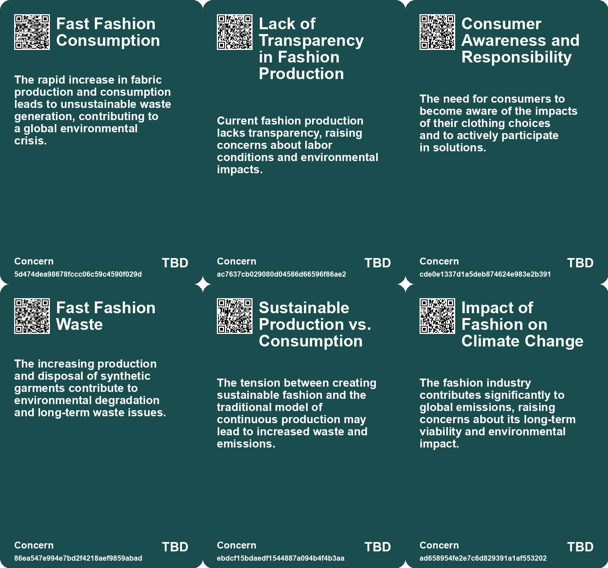
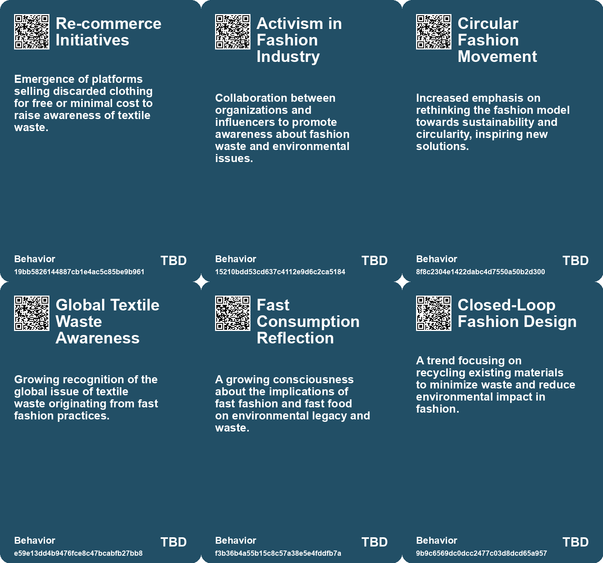
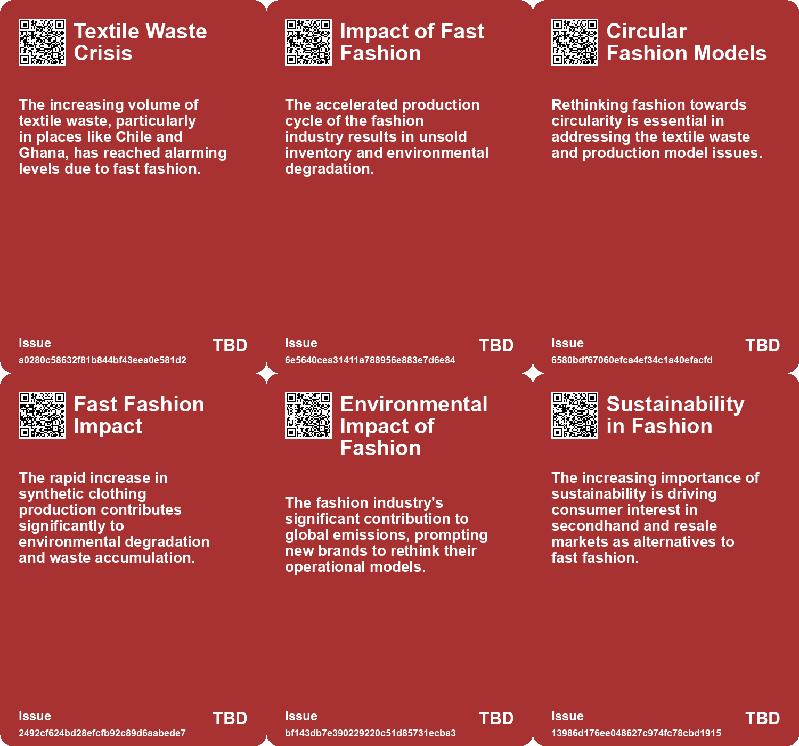
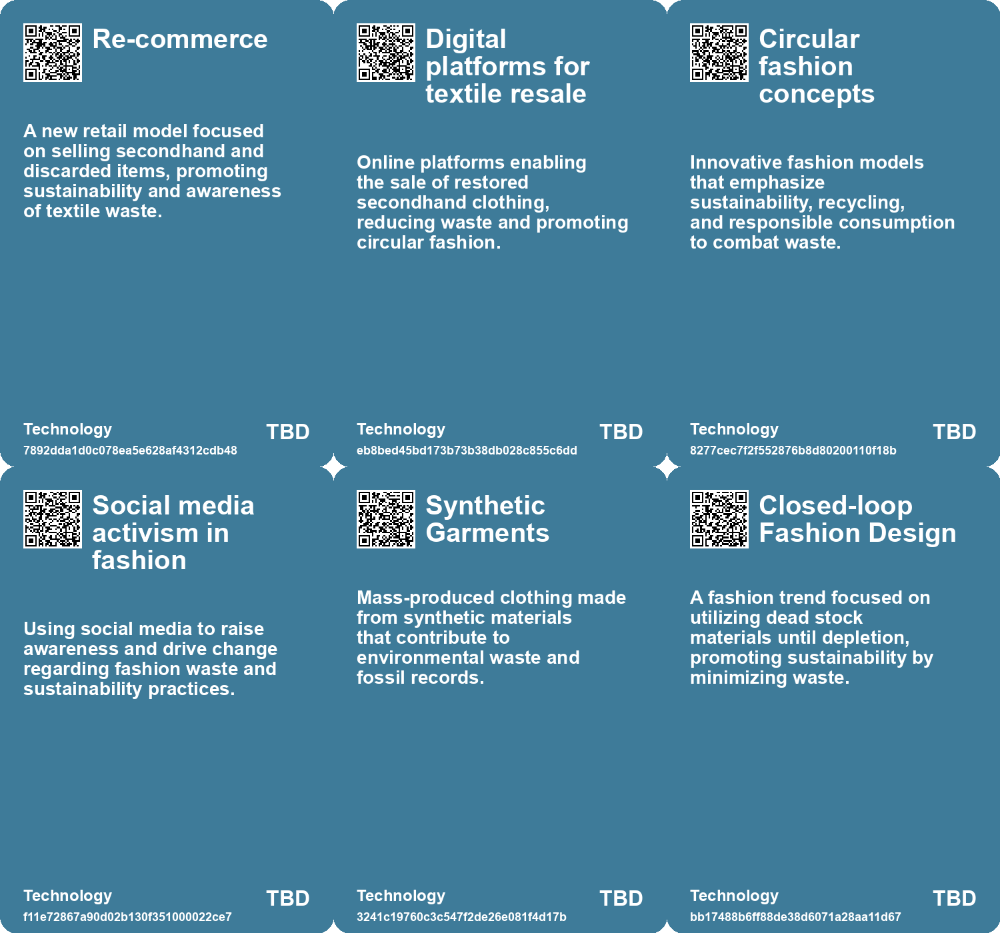

# *Topic*: Environmental Concerns of Fast Fashion

# Summary

The fashion industry is undergoing a significant transformation, driven by the rise of resale and secondhand shopping. As consumers become more aware of sustainability, platforms for buying and selling pre-owned clothing are gaining traction. This shift is not only a response to economic pressures but also a reflection of changing consumer habits, with many seeking to reduce their carbon footprint while finding unique fashion items. Initiatives like Re-commerce Atacama highlight the urgent need to address textile waste, emphasizing the importance of circularity in fashion and the environmental impact of fast fashion.

The concept of "technofossils" emerges as a stark reminder of humanity's legacy on the planet. Scientists predict that materials like plastic and synthetic clothing will dominate geological strata for millions of years, raising questions about our consumption patterns and environmental responsibility. This theme resonates with the growing awareness of e-waste, particularly the rapid disposal of small electronic items, which underscores the need for better recycling practices and a shift in consumer behavior.

As the global economy grapples with the challenges of perpetual growth, the idea of degrowth is gaining attention. This approach advocates for scaling down production that harms the environment and prioritizing human well-being. It calls for policies that support sustainable development and address the dependencies on growth that many economies face. The conversation around degrowth is intertwined with the need for alternative hedonism, which promotes happiness and well-being without excessive consumption.

In the realm of technology, the tension between the promises of AI and its current capabilities is evident. Events like the Consumer Electronics Show reveal a disconnect between high expectations and the reality of available technology. This skepticism extends to the environmental impact of the tech sector, which is responsible for a significant portion of global emissions. Companies are increasingly urged to adopt sustainable practices and integrate environmental considerations into their operations.

The future of urban living is also being reshaped by changing consumer preferences. As digital fatigue sets in, there is a growing desire for offline experiences and personal connections. Retailers are responding by creating curated environments that foster meaningful interactions, moving away from purely online sales. This trend reflects a broader cultural shift towards valuing experiences over convenience.

Climate change continues to pose significant risks to food security, with research highlighting the potential for simultaneous harvest failures in major breadbaskets. The implications of these risks are profound, affecting prices, food availability, and social stability. Addressing these challenges requires a collaborative approach, emphasizing community resilience and effective energy policies.

Finally, the concept of "greenhindering" illustrates how societal agents can perpetuate unsustainable practices, complicating efforts to foster a culture of sustainability. This contrasts with greenwashing, which has received more scrutiny. The normalization of wasteful behaviors through media and influencers highlights the need for accountability in promoting sustainable practices.

These interconnected themes reflect a growing awareness of the environmental and social challenges we face, urging a collective rethinking of consumption, technology, and community engagement.

# Seeds

|    | name                                 | description                                                                                  | change                                                                                               | 10-year                                                                                              | driving-force                                                                              |
|---:|:-------------------------------------|:---------------------------------------------------------------------------------------------|:-----------------------------------------------------------------------------------------------------|:-----------------------------------------------------------------------------------------------------|:-------------------------------------------------------------------------------------------|
|  0 | Environmental Health Concerns        | Burning fashion waste creates toxic clouds affecting local communities.                      | Shift from negligent waste handling to increased focus on eco-friendly solutions.                    | Greater emphasis on environmental regulations for waste management in fashion industries.            | Heightened awareness about environmental justice and community health.                     |
|  1 | Transparency in Fashion Production   | Call for greater transparency in how clothes are manufactured and disposed of.               | Transition from opaque production processes to transparent, accountable fashion supply chains.       | Consumers may demand full transparency, influencing purchasing decisions heavily.                    | Rising consumer consciousness regarding ethical consumption.                               |
|  2 | Fast Fashion Critique                | Growing backlash against the fast fashion model's waste generation.                          | Moving from a fast fashion consumption model to sustainable, slow fashion practices.                 | The industry may experience a significant decline in fast fashion brands and practices.              | A critical shift in consumer attitudes toward sustainability and ethical fashion.          |
|  3 | Technofossils Dominance              | Fast food and fast fashion items are likely to become enduring geological fossils.           | Transitioning from natural waste to synthetic materials dominating geological records.               | Future geological records may prominently feature synthetic materials like plastics and aluminum.    | Mass production and consumer culture lead to increased synthetic waste in the environment. |
|  4 | Mass Production of Synthetic Clothes | Rapidly increasing synthetic clothing production is polluting the environment significantly. | Shift from organic clothing materials to synthetic mass production and waste.                        | Fashion-related pollution could reflect immense changes in consumer habits and environmental impact. | A growing population leads to higher consumption of cheap, synthetic fashion items.        |
|  5 | Start-up, Shut-down Model            | A fashion brand designed to operate only until its materials run out.                        | Shifting from continuous production to a model that emphasizes material limitations.                 | More brands may adopt closed-loop systems, focusing on sustainability and minimal waste.             | Increasing awareness of climate change and the fashion industry's environmental impact.    |
|  6 | Sustainable Fashion Awareness        | Growing consumer awareness about the environmental impact of fashion drives resale.          | Shift from indifference to active concern about fashion's carbon footprint.                          | Sustainable fashion practices will dominate consumer preferences and purchasing decisions.           | Heightened awareness of environmental issues influences purchasing behavior.               |
|  7 | Economic Fashion Pragmatism          | Gen Z prioritizes cost-effective and durable clothing over luxury.                           | Shift from luxury fashion to practical, budget-friendly choices.                                     | Fashion industries may adapt to focus more on affordability and functionality.                       | Economic pressures from gig economies and student debt.                                    |
|  8 | Normalization of Disposable Culture  | Media glorifies disposable items, making them seem trendy among consumers, especially youth. | Shift from viewing disposables as wasteful to seeing them as stylish and normal.                     | Disposable culture may be entrenched, making sustainable alternatives less appealing and accepted.   | Influence of media and social media on consumer behavior and perceptions of normalcy.      |
|  9 | Shortened Trend Cycles               | Rapid turnover of trends on social media leads to impulse buying and overconsumption.        | Shift from developing personal style to following fleeting, cheap trends encouraged by social media. | Fashion may become even more unsustainable as consumers chase microtrends and discard items quickly. | The fast-paced nature of social media encourages constant consumption and trend chasing.   |

# Concerns

|    | name                                       | description                                                                                                                                                        |
|---:|:-------------------------------------------|:-------------------------------------------------------------------------------------------------------------------------------------------------------------------|
|  0 | Fast Fashion Consumption                   | The rapid increase in fabric production and consumption leads to unsustainable waste generation, contributing to a global environmental crisis.                    |
|  1 | Lack of Transparency in Fashion Production | Current fashion production lacks transparency, raising concerns about labor conditions and environmental impacts.                                                  |
|  2 | Consumer Awareness and Responsibility      | The need for consumers to become aware of the impacts of their clothing choices and to actively participate in solutions.                                          |
|  3 | Fast Fashion Waste                         | The increasing production and disposal of synthetic garments contribute to environmental degradation and long-term waste issues.                                   |
|  4 | Sustainable Production vs. Consumption     | The tension between creating sustainable fashion and the traditional model of continuous production may lead to increased waste and emissions.                     |
|  5 | Impact of Fashion on Climate Change        | The fashion industry contributes significantly to global emissions, raising concerns about its long-term viability and environmental impact.                       |
|  6 | Cultural Influence on Fashion Trends       | The influence of cultural and societal factors on sustainable fashion practices may create tensions in design philosophies.                                        |
|  7 | Environmental Impact of Fast Fashion       | The fast fashion industry significantly contributes to environmental degradation and waste generation, affecting global sustainability efforts.                    |
|  8 | Impact on sustainable initiatives          | Growing popularity of secondhand shopping may lead brands to exploit the sustainability narrative while continuing harmful production practices.                   |
|  9 | Fast fashion exploitation                  | Fast-fashion brands entering the recommerce space could undermine genuine sustainable efforts by offering secondhand options while still promoting overproduction. |

# Cards

## Concerns

## Behaviors

## Issue

## Technology

# Links

* [Reimagining Design: Moving Beyond Human-Centricity for Sustainability](https://futures.kghosh.me/5374f630138505a84bf07f321ed3d05e)
* [Benim Denim: A Revolutionary Fashion Brand Focused on Sustainability and Closure](https://futures.kghosh.me/e00cc39602993053c53f8dc014a0ab61)
* [The Rise of Secondhand Shopping Amid Economic Challenges: A Sustainable Trend](https://futures.kghosh.me/6e8eeaf2acd0e96acb4d43a085c483e1)
* [Re-commerce Atacama: Addressing Textile Waste and Fast Fashion's Impact in Chile](https://futures.kghosh.me/a8d354628149aa7040c527ba0a933d0e)
* [Understanding Greenhindering: A Greater Challenge Than Greenwashing for Sustainability](https://futures.kghosh.me/9c017d08a10b9c2409d54a3113acfe44)
* [Rethinking Economic Growth: The Case for Degrowth in a Sustainable Future](https://futures.kghosh.me/d18185596b0ee658ac31e9c3003c6d92)
* [The Future of Wearable Technology: Merging Cyborg Lifestyles with Daily Life](https://futures.kghosh.me/a81c4775b91ccd0db3e1b84da893ac6f)
* [The Resale Revolution: Redefining Fashion Through Sustainable Practices and Technology](https://futures.kghosh.me/8a1754f1df4fcfa417f1facfd72eebe0)
* [Exploring Healing-Centric Design in the Age of Emerging Technologies](https://futures.kghosh.me/6ce4d4d1c40fef14044ea70a600c66d4)
* [Navigating Gen Z Fashion: From Individuality to Algorithmic Uniformity](https://futures.kghosh.me/722ee1eb57d4c576f7e7604a88c9ef56)
* [Exploring Kate Soper’s Vision for Sustainable Living in 'Post-Growth Living'](https://futures.kghosh.me/71cbf82b85b58a6675d05308f8e1759e)
* [The Importance of Sustainability in the Tech Sector: A Call to Action for Companies](https://futures.kghosh.me/763a73de80e3ade3d3a068da6ce48182)
* [Exploring Enshittification, Futures Thinking in Architecture, and the Decline of Urban Scenius](https://futures.kghosh.me/4c0323220b8e42ef6b79dd4d720ce80a)
* [Exploring the Disconnection Between AI Promises and Reality at CES 2023](https://futures.kghosh.me/761a3d9b508c2a1db7a6c60d1be5ec98)
* [Research Uncovers Alarming E-Waste from Small Tech Items in the UK](https://futures.kghosh.me/78a83eb7da0d8ccb48eb7538e4068654)
* [Exploring the Challenges of Vertical Farming and Car-Centric Urban Planning](https://futures.kghosh.me/ef74de2ae50dd0f311346505df7068c3)
* [Study Highlights Underestimated Risks of Simultaneous Harvest Failures Due to Climate Change](https://futures.kghosh.me/9bebaea9ed2c74b635c7ffbedc039556)
* [Navigating Climate Change: The Need for Community Resilience and Social Trust](https://futures.kghosh.me/efa36dc9bd5ddc890866d4ab1e68e71f)
* [Technofossils: The Enduring Legacy of Plastic, Fast Food, and Synthetic Clothing](https://futures.kghosh.me/9b28b467817ea898c7c8c104f9103ab9)
* [Future Trends Post-2024: Declining Democracies and Emerging Cultural Shifts](https://futures.kghosh.me/bd1b01636b1360716b5951e1cac42724)
* [Navigating the Climate Crisis: The Importance of Community and Social Trust in Adapting to Change](https://futures.kghosh.me/d1e5dc8cd0f7c34dede43f5429dded3d)
* [Concerns Over Inflation Drive Americans to Adopt Spending Reduction Habits](https://futures.kghosh.me/713b509d3ed652f3a8dbfe7c90bcd0b9)
* [The Shift from E-commerce to In-Person Retail Experiences in Fashion](https://futures.kghosh.me/2db44f1091d08697f6f525dbe8740189)