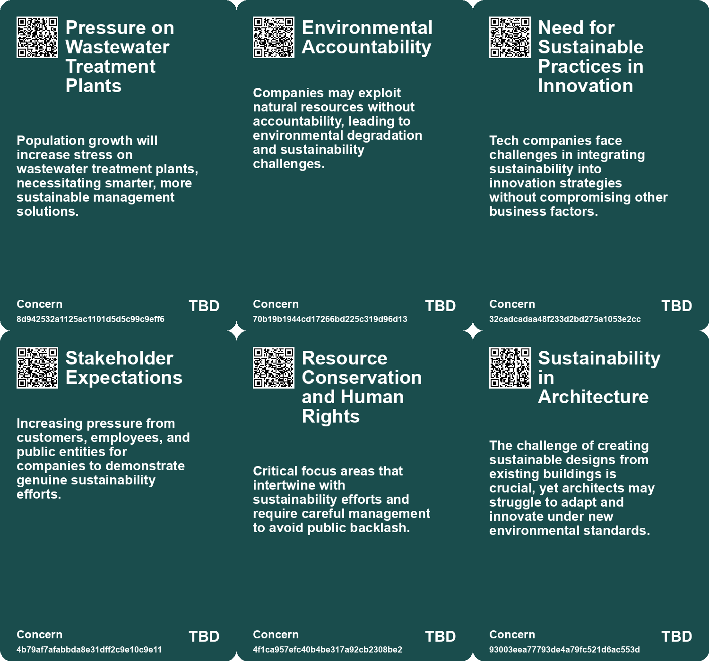
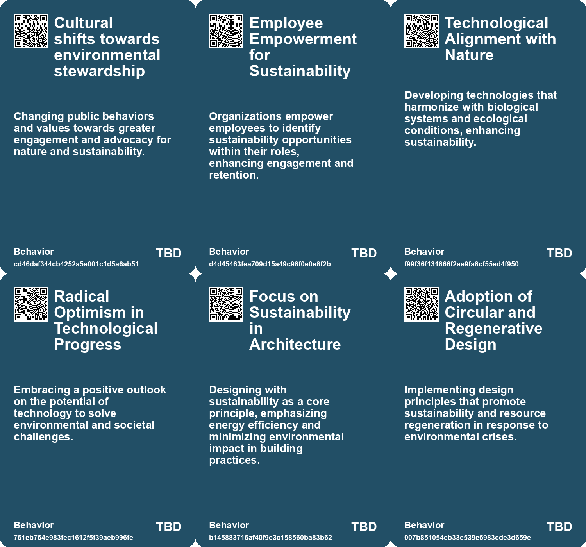
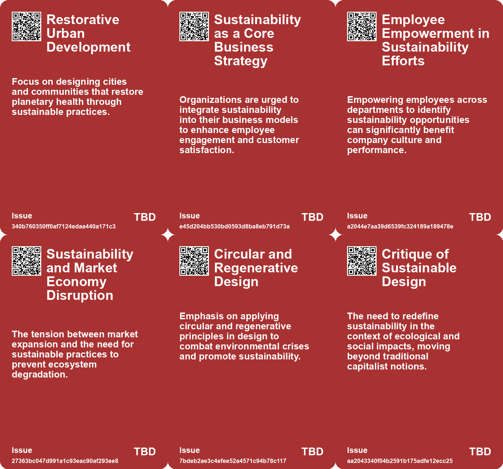
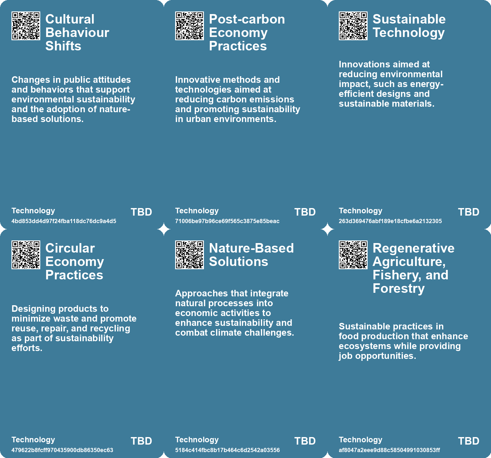

# *Topic*: Environmental Sustainability

# Summary

The intersection of technology and sustainability is a pressing concern as the tech sector contributes nearly 3% of global carbon emissions. Companies are increasingly urged to adopt greener practices, with a focus on transparency and accountability in their sustainability efforts. Western Digital, for instance, has committed to renewable energy and net-zero emissions by 2032. This shift not only enhances corporate responsibility but also boosts employee engagement and customer satisfaction.

Education plays a vital role in fostering sustainability. Programs like the EY Masters in Sustainability at Hult International Business School equip individuals with the skills needed to create long-term value for clients and society. This initiative aligns with the broader goal of integrating sustainability into business practices, emphasizing responsible and inclusive approaches to climate change.

The climate crisis demands radical solutions, including the concept of degrowth, which advocates for scaling down harmful production and prioritizing human well-being. This approach challenges the traditional reliance on perpetual economic growth, suggesting that policies should focus on reducing unnecessary production and improving public services. The transition to a degrowth model faces obstacles, including political resistance and the need for interdisciplinary research.

Design practices are also evolving to address environmental challenges. The call for alternative design approaches emphasizes the importance of moving beyond human-centric models to incorporate ecological considerations. Circular and regenerative design principles are gaining traction, promoting sustainable practices that consider the socio-ecological impacts of design.

The future of work is being reshaped by emerging technologies and cultural transformations. Experts predict a promising landscape with abundant opportunities, particularly in sectors focused on sustainability and well-being. Individuals are encouraged to develop skills that align with a circular economy, emphasizing creativity and adaptability. Governments are urged to support lifelong learning and collaboration to prepare for the evolving job market.

Water management is becoming increasingly critical as global water stress escalates. By 2025, two-thirds of the global population may face water scarcity. Digital transformation is essential for addressing these challenges, with innovations in AI, data analytics, and smart irrigation playing pivotal roles in sustainable water management.

Finally, the concept of intergenerational responsibility is gaining prominence. The Well-being of Future Generations Act in Wales exemplifies a commitment to long-term sustainability, requiring public bodies to consider the impact of their decisions on future generations. Advocates like Sophie Howe emphasize the importance of prioritizing the needs of those yet to come, ensuring that climate justice remains a central focus in policy-making.

# Seeds

|    | name                                      | description                                                                                        | change                                                                                                             | 10-year                                                                                                                          | driving-force                                                                                                     |
|---:|:------------------------------------------|:---------------------------------------------------------------------------------------------------|:-------------------------------------------------------------------------------------------------------------------|:---------------------------------------------------------------------------------------------------------------------------------|:------------------------------------------------------------------------------------------------------------------|
|  0 | Cultural Shift Toward Nature Engagement   | Increasing citizen and community engagement with natural environments.                             | Shifting from passive consumption of nature to active participation in its stewardship.                            | Communities will play a vital role in maintaining and enhancing local natural assets.                                            | Growing awareness of environmental issues and personal responsibility fosters community engagement.               |
|  1 | Integrated NbS in Urban Infrastructure    | Nature-based Solutions becoming integral to urban infrastructure planning.                         | Transitioning from separate planning processes to integrated NbS in urban development.                             | Urban areas will feature integrated nature-based infrastructure, improving livability and resilience.                            | The need for sustainable urban growth and resilience against climate impacts drives integration.                  |
|  2 | Social Movements for Degrowth             | Emergence of social movements advocating for degrowth principles and sustainable living practices. | Shift from individualistic growth-oriented cultures to collective movements emphasizing sustainability and equity. | In a decade, social movements may significantly influence policy and societal norms towards sustainable practices.               | Increased awareness of social and ecological crises is fostering grassroots movements for change.                 |
|  3 | Sustainability as a Competitive Advantage | Companies are leveraging sustainability for employee engagement and customer satisfaction.         | Transition from viewing sustainability as a cost to recognizing it as a strategic advantage.                       | Sustainable practices will be integral to corporate strategies, affecting market competitiveness.                                | The increasing demand from consumers and investors for responsible and sustainable business practices.            |
|  4 | Integration of Sustainability Metrics     | Engineers are encouraged to include sustainability in their performance metrics.                   | Move from solely focusing on efficiency to incorporating sustainability into key performance indicators.           | Sustainability will become a fundamental aspect of product development and engineering practices.                                | The need for innovation that aligns with global sustainability goals and practices.                               |
|  5 | Focus on Long-term Needs                  | Emphasis on balancing short-term needs with long-term sustainability.                              | Shift from reactive to proactive governance in public service planning.                                            | A cultural shift in public policy prioritizing long-term impacts over short-term gains.                                          | Growing awareness of climate change and its long-term effects.                                                    |
|  6 | Radical Optimism in Technology            | A growing belief that technology can evolve positively to support life and sustainability.         | From skepticism about technology's role in environmental degradation to optimism about its potential for good.     | Increased investment and development in technologies that enhance life quality and environmental sustainability.                 | The need to address climate change and ecological issues fosters a more hopeful view of technological innovation. |
|  7 | Growth of Sustainability Education        | Increased focus on sustainability programs in business education.                                  | Shift from traditional business education to sustainable and responsible practices in business.                    | Business graduates will increasingly specialize in sustainability, influencing corporate strategies globally.                    | Rising demand for sustainability expertise in response to climate change and social responsibility pressures.     |
|  8 | Hands-on Learning in Sustainability       | Emphasis on real-world challenges in sustainability education programs.                            | Move from theoretical learning to practical, experiential learning in sustainability.                              | Educational institutions will increasingly incorporate real-world challenges into their curricula to enhance student engagement. | The necessity for graduates to be job-ready and capable of addressing real-world sustainability issues.           |
|  9 | Revolutionizing Economic Systems          | The call for a new global industrial system that integrates sustainability.                        | Transition from traditional profit-driven models to sustainable practices that prioritize ecological health.       | In a decade, we may see widespread adoption of sustainable business practices across industries.                                 | The urgent need to address climate change and ecological degradation driving systemic change.                     |

# Concerns

|    | name                                         | description                                                                                                                                                            |
|---:|:---------------------------------------------|:-----------------------------------------------------------------------------------------------------------------------------------------------------------------------|
|  0 | Pressure on Wastewater Treatment Plants      | Population growth will increase stress on wastewater treatment plants, necessitating smarter, more sustainable management solutions.                                   |
|  1 | Environmental Accountability                 | Companies may exploit natural resources without accountability, leading to environmental degradation and sustainability challenges.                                    |
|  2 | Need for Sustainable Practices in Innovation | Tech companies face challenges in integrating sustainability into innovation strategies without compromising other business factors.                                   |
|  3 | Stakeholder Expectations                     | Increasing pressure from customers, employees, and public entities for companies to demonstrate genuine sustainability efforts.                                        |
|  4 | Resource Conservation and Human Rights       | Critical focus areas that intertwine with sustainability efforts and require careful management to avoid public backlash.                                              |
|  5 | Sustainability in Architecture               | The challenge of creating sustainable designs from existing buildings is crucial, yet architects may struggle to adapt and innovate under new environmental standards. |
|  6 | Sustainability vs. Growth Paradigm           | The outdated view of sustainability tied to capitalist growth might hinder true environmental and societal progress.                                                   |
|  7 | Sustainability Knowledge Gap                 | There may be a lack of understanding among professionals about sustainability issues, hindering effective business strategies.                                         |
|  8 | Ethical Behavior Concerns                    | Issues in ethical behavior can arise when integrating sustainability into business practices, leading to reputational risks.                                           |
|  9 | Intergenerational Climate Justice            | The need to balance the responsibilities of current generations with the rights of future generations to a healthy environment.                                        |

# Cards

## Concerns

## Behaviors

## Issue

## Technology

# Links

* [Reimagining Design: Moving Beyond Human-Centricity for Sustainability](https://futures.kghosh.me/5374f630138505a84bf07f321ed3d05e)
* [Exploring Regenerative Design for Harmonious Coexistence with Nature](https://futures.kghosh.me/a1acb04c0f65f709ad6c8ce2f0946a51)
* [Envisioning Humanity's Sustainable Space Future by 2040](https://futures.kghosh.me/10bce1d6a20db285c10362c75da86eec)
* [Empowering EY Professionals Through the Masters in Sustainability Program](https://futures.kghosh.me/fcb03e94b8239b410a79996496599390)
* [2025 Water Management: The Crucial Role of Digital Transformation in Addressing Global Water Challenges](https://futures.kghosh.me/a374b5aaabba03451c8c0ebd32edd833)
* [Overview of the Well-being of Future Generations (Wales) Act 2015 and Its Implications](https://futures.kghosh.me/3938700a79bbde32972657f9eb7b1b69)
* [Navigating Climate Change: The Role of Technology and the Shift from Quantity to Quality Growth](https://futures.kghosh.me/e44687e103abb436ad5980ac2d518f47)
* [Rethinking Economic Growth: The Case for Degrowth in a Sustainable Future](https://futures.kghosh.me/d18185596b0ee658ac31e9c3003c6d92)
* [Future of Work: Embracing Opportunities and Adapting to Change Over the Next 50 Years](https://futures.kghosh.me/a601d356f6c81dbc065229f13e92c3f8)
* [The Role of Future Generations Commissioners in Climate Action and Policy Making](https://futures.kghosh.me/32228bbf929d81d39a1808dd9b7c4493)
* [Exploring Kate Soper’s Vision for Sustainable Living in 'Post-Growth Living'](https://futures.kghosh.me/71cbf82b85b58a6675d05308f8e1759e)
* [The Importance of Sustainability in the Tech Sector: A Call to Action for Companies](https://futures.kghosh.me/763a73de80e3ade3d3a068da6ce48182)
* [The Call for a New, Focused ESG: Prioritizing Employees, Society, and Government](https://futures.kghosh.me/022335f24a4ab2580a4b1fb2dbb53fac)
* [Reimagining Natural Capital: A Stock Option Approach for Ecological Sustainability](https://futures.kghosh.me/bf06142acab0ca8fd2ed4e9231f0c279)
* [Understanding Externalities: The Need for a Revolutionary Shift in Industrial Practices](https://futures.kghosh.me/364fecbe1c46f164e48d52c279422351)
* [Addressing Urban Forestry Challenges: The Case for Trees as Vital Infrastructure](https://futures.kghosh.me/34fb411b34c997f52f550d855c864865)
* [The Urgent Need for Adaptive Reuse in Architecture Today](https://futures.kghosh.me/cf7cc3361b8139c51e3e97835a2da4e4)
* [Scaling Nature-based Solutions in Scotland: A Pathway to Climate Resilience](https://futures.kghosh.me/c7d3021c1b6298e7c47bc455cd7d8391)
* [Navigating Climate Change: The Need for Community Resilience and Social Trust](https://futures.kghosh.me/efa36dc9bd5ddc890866d4ab1e68e71f)
* [Future of Work: Embracing Opportunities and Adapting to Change Over the Next 50 Years](https://futures.kghosh.me/56ddb45deabcdc8b707c7647270e101d)
* [Navigating the Climate Crisis: The Importance of Community and Social Trust in Adapting to Change](https://futures.kghosh.me/d1e5dc8cd0f7c34dede43f5429dded3d)