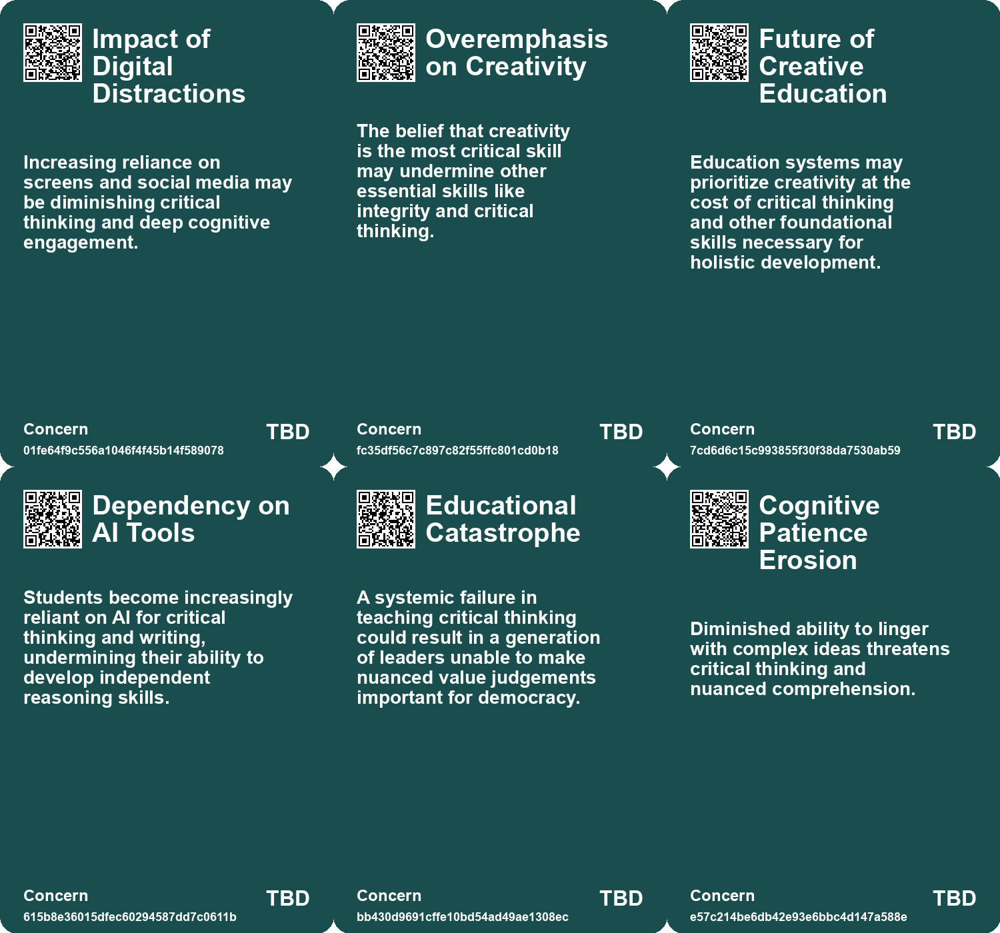
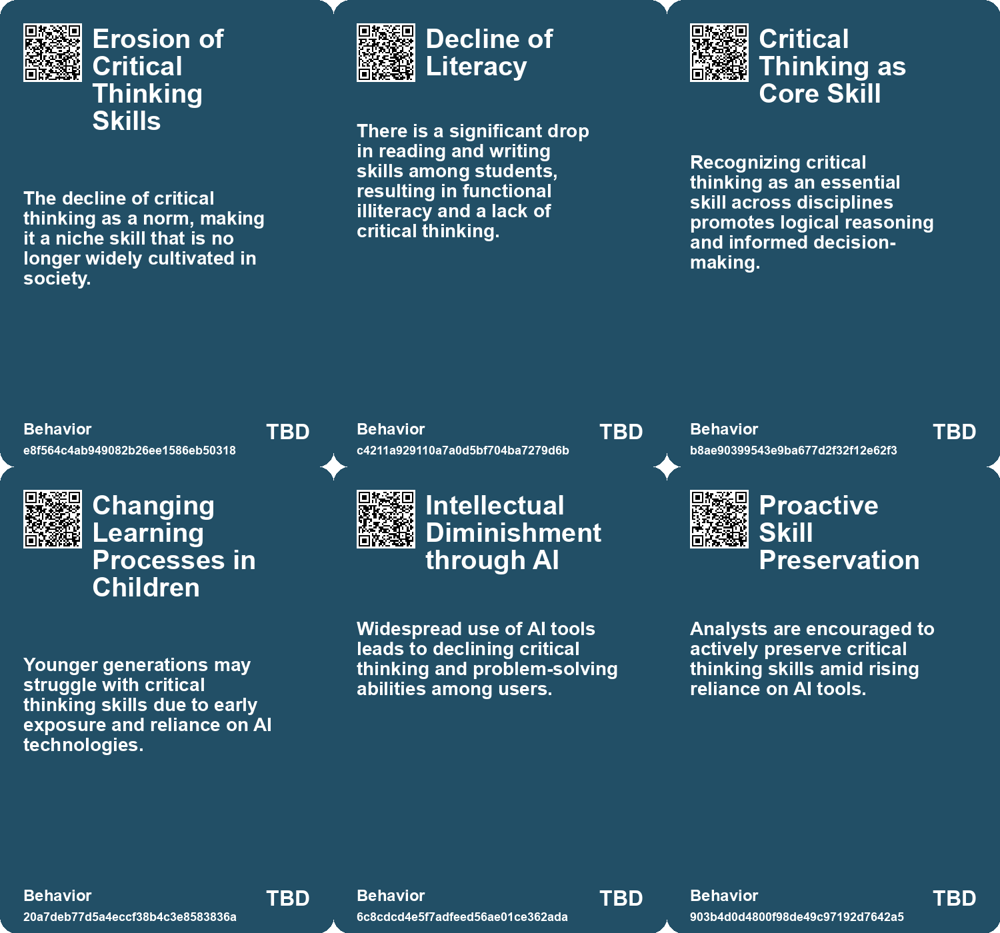
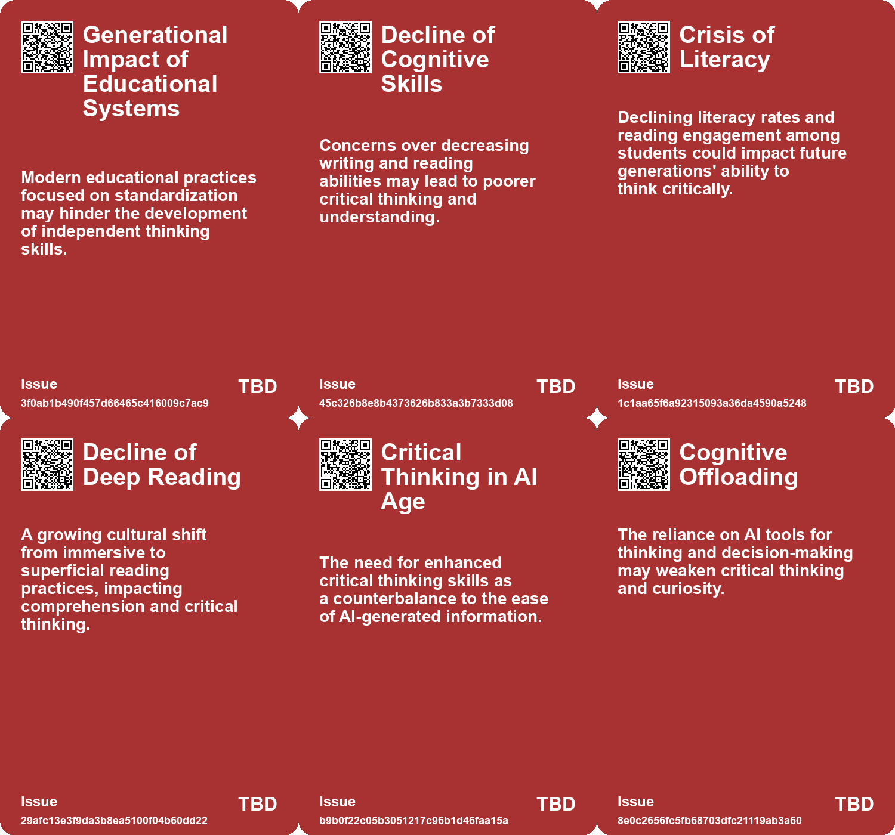
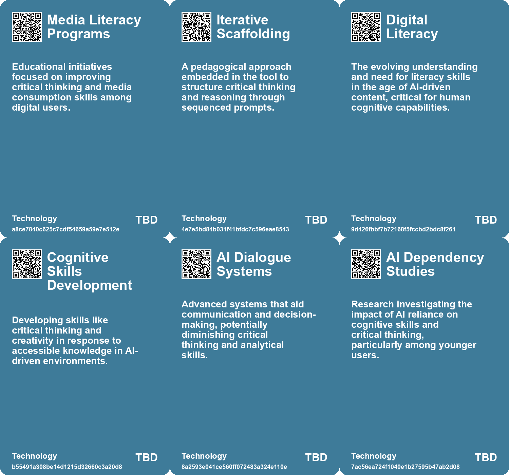

# *Topic*: Erosion of Critical Thinking Skills

# Summary

The rise of artificial intelligence (AI) is reshaping cognitive skills and critical thinking across various sectors, raising concerns about the long-term implications for education and society. Many educators and researchers warn that reliance on AI tools, such as ChatGPT, is leading to cognitive atrophy and diminished problem-solving abilities. Studies indicate that users who trust AI outputs often engage less in critical thinking, relying on AI as a crutch rather than a tool for enhancement. This trend is particularly alarming among younger users, who may develop a dependency on AI that hinders their ability to think independently.

In the educational landscape, the integration of AI has sparked a crisis, with students increasingly outsourcing their writing and critical thinking tasks. This shift has resulted in superficial understanding and a decline in literacy and comprehension skills. Teachers express frustration as traditional learning methods become less effective, urging a reevaluation of educational practices to foster deeper engagement and critical reasoning. Innovative tools, like CONFIDENCE INTERVAL, aim to counteract this trend by guiding students through structured argument development, promoting active engagement rather than passive consumption of AI-generated content.

The decline in critical thinking is not limited to students; it extends to professionals in fields like Open Source Intelligence (OSINT), where analysts are increasingly delegating cognitive tasks to AI. This complacency risks jeopardizing the accuracy and integrity of their work. Analysts are encouraged to maintain their analytical skills and treat AI as an augmentation tool rather than a replacement for human judgment. Strategies for preserving critical thinking include deliberate verification processes and challenging AI outputs to ensure thorough investigation.

The broader societal implications of AI reliance are evident in the declining cognitive abilities reported across all age groups. Research shows a drop in literacy, numeracy, and problem-solving skills, attributed to factors like increased screen time and superficial media consumption. This trend raises concerns about a generation becoming more susceptible to manipulation and less capable of engaging in meaningful discourse. The shift towards passive content consumption diminishes the capacity for critical thinking, affecting both young people and adults.

In response to these challenges, some countries, like Finland, are integrating digital literacy and fact-checking skills into their educational curricula. This proactive approach aims to equip students with the tools necessary to navigate misinformation and develop critical thinking skills. By fostering a culture of skepticism and inquiry, educators hope to counteract the negative effects of technology on cognitive development.

The decline of deep reading is another significant concern, as the rise of ultra-processed reading habits leads to superficial comprehension. Many students struggle to engage with complex texts, resulting in a loss of intellectual capacity. This trend is mirrored in higher education, where professors report that students arrive unprepared for rigorous literary engagement. The shift from teaching full texts to focusing on excerpts and standardized test preparation has contributed to this decline.

As society grapples with the implications of AI and technology, there is a growing recognition of the need for a cultural shift. Emphasizing the importance of deep thinking, critical engagement, and digital literacy can help counteract the detrimental effects of technology. By prioritizing these skills, individuals and educators can work towards fostering a more informed and intellectually resilient society.

# Seeds

|    | name                                           | description                                                                                                    | change                                                                                           | 10-year                                                                                                        | driving-force                                                                                                   |
|---:|:-----------------------------------------------|:---------------------------------------------------------------------------------------------------------------|:-------------------------------------------------------------------------------------------------|:---------------------------------------------------------------------------------------------------------------|:----------------------------------------------------------------------------------------------------------------|
|  0 | Erosion of Critical Thinking                   | Students increasingly rely on AI for writing, leading to a decline in critical thinking skills.                | Shift from active critical engagement to passive consumption of AI-generated content.            | Educational systems may adapt by integrating AI tools that enhance critical thinking rather than diminish it.  | The necessity for students to develop reasoning skills in an AI-dominated landscape.                            |
|  1 | Emergence of the Post-Literate Society         | Forecasts about the end of civilization linked to declining literacy and critical thinking.                    | From a literate society to potential pre-literate behaviors influenced by technology.            | Society may struggle with complex ideas and democratic functions without critical thinking.                    | The integration of technology that diminishes the need for deep thought and literacy.                           |
|  2 | Civic and Emotional Impacts of Shallow Reading | Cognitive and emotional skills are being compromised due to decreased reading depth.                           | Transition from deep insights and empathy gained through literature to shallow understanding.    | Society may struggle with empathy and civic engagement due to poor reading practices.                          | The disconnect from deep reading culture reduces critical thinking and emotional intelligence.                  |
|  3 | Critical Thinking Emphasis                     | Renewed focus on critical thinking skills across disciplines is rising.                                        | Shift from rote knowledge to a stronger emphasis on critical analysis and reasoning.             | In 10 years, critical thinking will be an essential skill in all professional fields and demographics.         | An increasingly complex world requires better decision-making and problem-solving abilities.                    |
|  4 | Cognitive Offloading Through AI                | Increased reliance on AI tools is leading to a decline in critical thinking and curiosity.                     | Shifting from self-driven learning to a dependence on AI for problem-solving.                    | In ten years, critical thinking skills may significantly decline in various demographics.                      | The convenience offered by AI that encourages users to outsource cognitive tasks.                               |
|  5 | Cognitive Atrophy from AI Usage                | Research suggests AI usage may lead to critical reduction in cognitive skills and critical thinking abilities. | Shift from active critical engagement to dependency on AI for decision-making.                   | In 10 years, a substantial portion of knowledge workers may rely heavily on AI, diminishing critical thinking. | An increasing trust in AI tools among workers may lead to dependency and reduced cognitive engagement.          |
|  6 | Avoidance of AI Trust in Children Education    | Younger users exhibit more dependency on AI, risking critical thinking skill development.                      | Shift from traditional learning methods to reliance on AI, especially among children and teens.  | Schools may adopt stricter guidelines on personal AI use to encourage independent learning for students.       | Parental concerns over children’s dependency on AI tools shaping educational policies.                          |
|  7 | Rise of Misinformation                         | Diminished critical thinking abilities make populations more susceptible to manipulation.                      | Shift from a well-informed public to increased gullibility and susceptibility to misinformation. | Greater difficulty in discerning truth from falsehoods could hinder democratic processes and societal trust.   | Manipulative communication styles favored by social media creating fertile ground for misinformation to thrive. |
|  8 | Shifts in Education and Critical Thinking      | Alterations in educational approaches may arise as AI's role in critical thinking is debated.                  | Transitioning from traditional learning methods to AI-integrated approaches in education.        | Education systems may evolve to include AI literacy as a core component of critical thinking skills.           | As AI tools become essential, educational curricula must adapt to prepare students for future challenges.       |
|  9 | User Self-Assessment Bias                      | Reliance on self-reporting could reflect misperceptions about personal critical thinking abilities.            | Shifting from objective measures of thinking skills to subjective user assessments.              | Future assessments of critical thinking may rely more heavily on self-evaluation, risking inaccuracy.          | The desire for users to feel competent and capable may influence how they report on their abilities.            |

# Concerns

|    | name                                      | description                                                                                                                                               |
|---:|:------------------------------------------|:----------------------------------------------------------------------------------------------------------------------------------------------------------|
|  0 | Impact of Digital Distractions            | Increasing reliance on screens and social media may be diminishing critical thinking and deep cognitive engagement.                                       |
|  1 | Overemphasis on Creativity                | The belief that creativity is the most critical skill may undermine other essential skills like integrity and critical thinking.                          |
|  2 | Future of Creative Education              | Education systems may prioritize creativity at the cost of critical thinking and other foundational skills necessary for holistic development.            |
|  3 | Dependency on AI Tools                    | Students become increasingly reliant on AI for critical thinking and writing, undermining their ability to develop independent reasoning skills.          |
|  4 | Educational Catastrophe                   | A systemic failure in teaching critical thinking could result in a generation of leaders unable to make nuanced value judgements important for democracy. |
|  5 | Cognitive Patience Erosion                | Diminished ability to linger with complex ideas threatens critical thinking and nuanced comprehension.                                                    |
|  6 | Cognitive Atrophy from AI Usage           | Increased reliance on AI tools may lead to diminished critical thinking skills among individuals, especially knowledge workers.                           |
|  7 | Diminished Critical Thinking Skills       | Increased reliance on generative AI may lead to a decline in users' critical thinking abilities over time.                                                |
|  8 | Teacher Preparedness and Support          | Teachers may lack the necessary training and support to effectively teach digital literacy and critical thinking skills.                                  |
|  9 | Reliance on Technological Solutions Alone | Overemphasizing technology in solving misinformation issues may neglect the importance of education in fostering critical thinking skills.                |

# Cards

## Concerns

## Behaviors

## Issue

## Technology

# Links

* [Thriving in the AI Age: The Importance of Human Voice and Critical Thinking](https://futures.kghosh.me/f070e7442b3634ec75c8272b5dd5f796)
* [The Cognitive Costs of AI: Are We Sacrificing Our Mental Abilities for Convenience?](https://futures.kghosh.me/09e7abde98ff0c5590320545c5b20679)
* [Preparing for the Homework Apocalypse: AI's Impact on Education and Assignments](https://futures.kghosh.me/233c5bf90c64ceefb0cde33233c3fe6e)
* [The Crisis in Education: Students as Victims of Smartphone Addiction and Tech Overreach](https://futures.kghosh.me/a5688e452658f03667dfc0fe392e1f1d)
* [Reimagining Learning: Embracing Slow Learning in an Accelerated World](https://futures.kghosh.me/042cf62855760b54fa5a194db9e6cf11)
* [The Disruption of Education by AI: An Intellectual Crisis](https://futures.kghosh.me/9457c5541dba02968735056f18b53dc3)
* [Navigating Talent Development and Recruitment in a Rapidly Changing World](https://futures.kghosh.me/14935a7eab6d6c1d8a5ce2f25d3b54bb)
* [The Impact of AI on Student Writing: A Teacher's Perspective on Leaving the Classroom](https://futures.kghosh.me/86cb668eb531243c4f8cd92b0d1d3821)
* [The Impact of Generative AI on Human Critical Thinking Abilities](https://futures.kghosh.me/76d1fece0d91841773a431fdb30d9d24)
* [Enhancing Digital Competences: Strategies for Navigating Online Challenges](https://futures.kghosh.me/0770afeb444e4bbb336cdc72c07d6688)
* [Finland's Innovative Approach to Combating Fake News Through Education](https://futures.kghosh.me/ad15fbe04bbe50ec3436c61403d19fca)
* [The Decline of Deep Reading: Impacts on Cognition and Culture in Modern Society](https://futures.kghosh.me/08ff2978b223efa281782cda55dd71a8)
* [Breaking Free from Self-Sabotage in Innovation: A Call for Reflection and Action](https://futures.kghosh.me/d963f3a93dc8311262c1ccbe947f0700)
* [Declining Intelligence: A Widespread Trend Across Generations in the Age of Social Media](https://futures.kghosh.me/76bc01451eb69c84d19e73fa1ed386a7)
* [Understanding the Decline of Reading Skills Among Elite College Students](https://futures.kghosh.me/9eaf821783c58fc818d9322edd8ce1b4)
* [The Impact of the Internet and AI on Human Cognition and Productivity](https://futures.kghosh.me/652fc7ec1f422e931bc5a9ba8011650a)
* [The Decline of Human Thinking in the Age of AI: A Call for Educational Reform](https://futures.kghosh.me/1909e5d11ae6f5dc49eb87e739bb1885)
* [The Transformative Impact of AI on Humanities Education and Its Challenges](https://futures.kghosh.me/72aad99b3b502b39304cbe2302a55141)
* [Reviving Research as Leisure: Embracing Curiosity and Reading Culture for Civilization's Future](https://futures.kghosh.me/e3389ae6863265accc860c33c364c11f)
* [Exploring the Paradox of Creativity in the Age of AI](https://futures.kghosh.me/76009afc0ea0729e3b74bb3666e98679)
* [Innovative AI Tool Strives to Enhance Critical Thinking in Education](https://futures.kghosh.me/f85228a2d6ec8d60e7772fa6cdf8edd3)
* [Exploring AI's Effect on Cognitive Skills and Learning Processes](https://futures.kghosh.me/950253f15955ca7be1cb2ebf244d0939)
* [Preserving Critical Thinking in OSINT: The Dangers of Over-Reliance on AI](https://futures.kghosh.me/5d957d35ce82e704d8c6267a1e911f2e)
* [The Dangers of AI Reliance: Cognitive Atrophy and Critical Thinking Decline in Knowledge Workers](https://futures.kghosh.me/682e04f0b543e67738d8ffbb84fc50dd)
* [The Decline of Intelligence: Are We Becoming Homo Idioticus?](https://futures.kghosh.me/08ebb0e6c793edcb964350ed424a70cf)
* [The Rise of Creativity: Understanding Its Evolution and Cultural Impact Since WWII](https://futures.kghosh.me/4704e0c971a5aab83464d9025df5fe6d)
* [Understanding Polarization: Healing Our Relationship with Technology and Embracing Diverse Perspectives](https://futures.kghosh.me/c1bb890337ef382bfaa5720c9fd05134)
* [The Limitations of Digital Whiteboards in Effective Communication](https://futures.kghosh.me/0427292acb53be01ba35b3b5b561cb59)