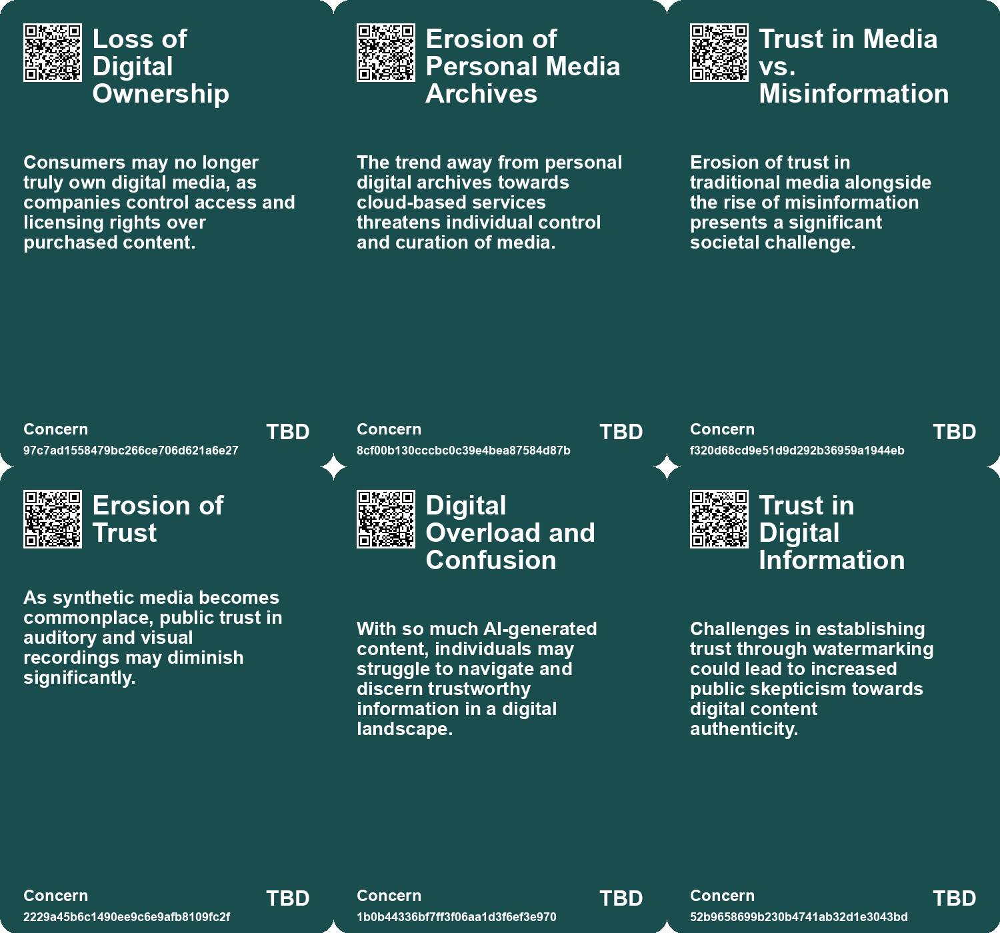
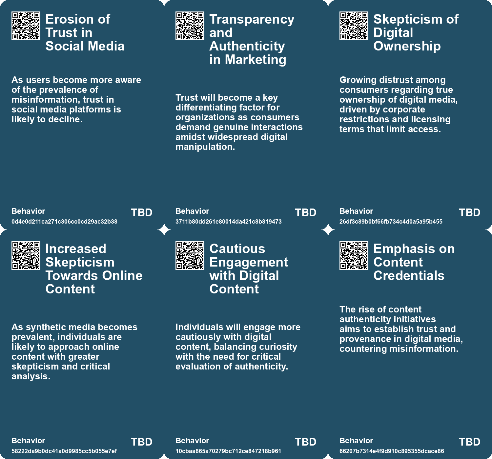
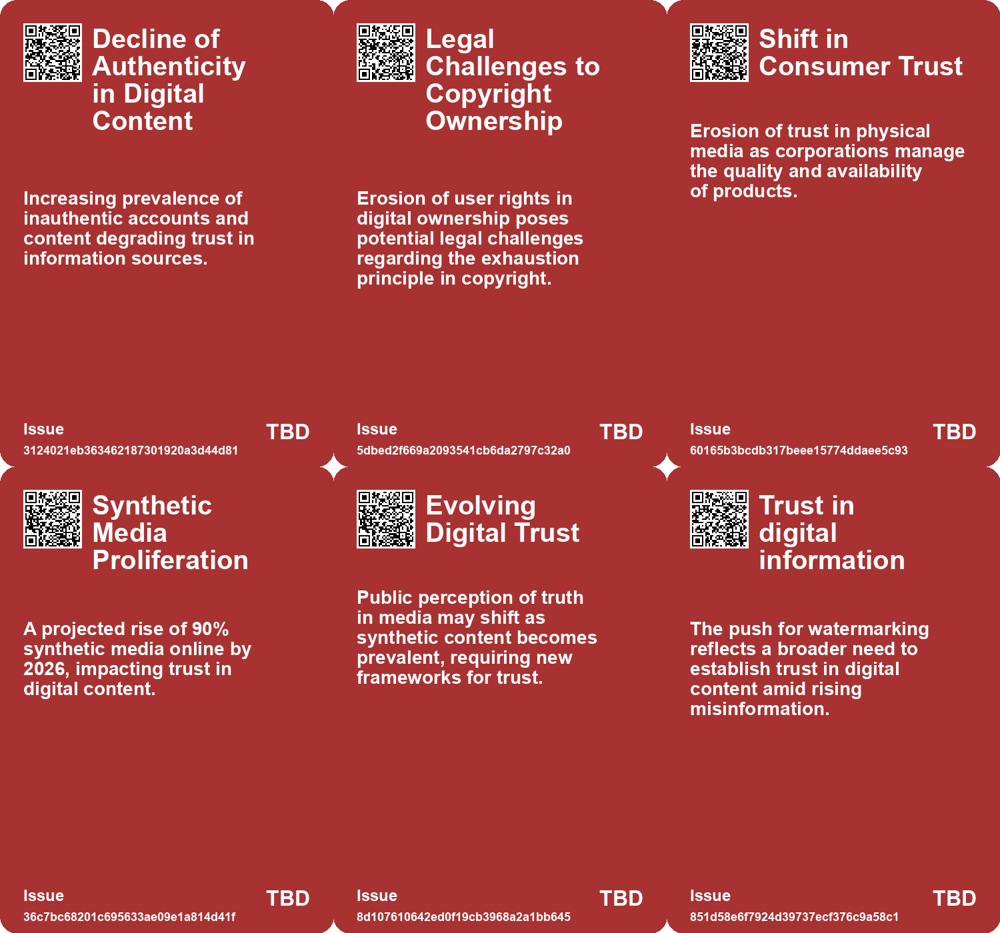
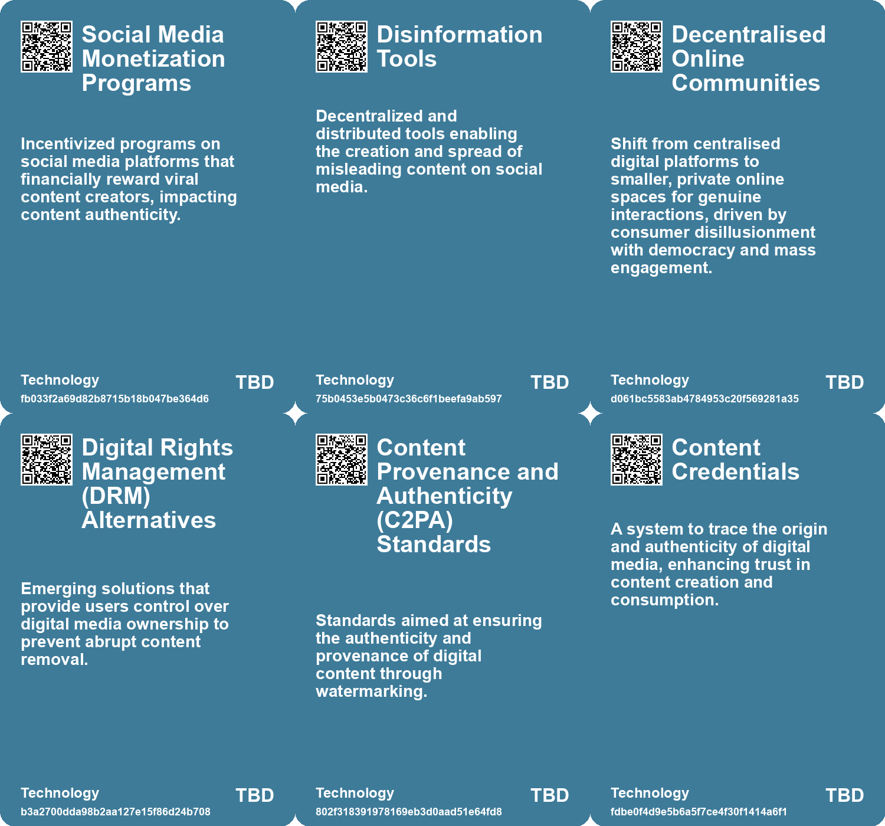

# *Topic*: Erosion of Trust in Digital Content

# Summary

Digital ownership is increasingly under scrutiny as tech companies shift from selling products to licensing content. Amazon's recent ban on downloading Kindle e-books to computers exemplifies this trend, highlighting the illusion of ownership in the digital age. Consumers are reminded that they are purchasing licenses rather than tangible products, which diminishes their rights over digital media. This shift has led to a culture of passive consumption, where personal media archives are shrinking, and curated collections are becoming less common.

Data preservation poses significant challenges in the digital era. Unlike physical artifacts, digital files are at risk of becoming inaccessible due to obsolete formats and hardware. The concept of a "Digital Dark Age" looms, where valuable information may be lost. Organizations are exploring solutions to ensure sustainability and equity in data preservation, emphasizing the need for collective efforts across various sectors.

The rise of artificial intelligence (AI) has sparked a phenomenon known as "deep doubt," where skepticism about the authenticity of digital media is growing. The prevalence of photorealistic AI-generated images raises questions about the validity of media and fuels misinformation. This skepticism is compounded by the increasing presence of synthetic media, with Europol warning that up to 90 percent of online content could be artificially generated by 2026. The implications for artists and the dissemination of information are profound, necessitating caution in navigating this evolving landscape.

The issue of disappearing online content is also pressing. A Pew Research Center study reveals that a significant portion of webpages collected over the past decade are no longer accessible. This loss can create gaps in the historical record and erode trust in the internet. Web archiving initiatives are essential for preserving historical content and ensuring long-term accessibility.

The influence of manufactured sentiment in digital environments complicates the landscape further. Bot farms manipulate online perceptions, distorting brand health assessments and fostering unreliable decision-making. Proposed solutions, such as digital identity verification, aim to enhance authenticity and distinguish real human interactions from artificial sentiment.

Amid these challenges, the creator economy is rapidly expanding, projected to reach $500 billion by 2027. However, this growth comes with hidden pressures on creators, who may struggle under the weight of their success. The narrative often overlooks the toll on individuals, highlighting the need for a broader perspective on the realities faced by those in the creator economy.

Finally, the decline of deep reading in contemporary society raises concerns about our intellectual capacities. The rise of ultra-processed reading habits diminishes our ability to engage with complex texts, leading to a culture increasingly detached from nuance and critical thought. Advocating for deep reading as a form of resistance against the fast-paced demands of modern life emphasizes the importance of meaningful engagement with literature and information.

# Seeds

|    | name                                          | description                                                                                 | change                                                                                     | 10-year                                                                                                     | driving-force                                                                                                      |
|---:|:----------------------------------------------|:--------------------------------------------------------------------------------------------|:-------------------------------------------------------------------------------------------|:------------------------------------------------------------------------------------------------------------|:-------------------------------------------------------------------------------------------------------------------|
|  0 | Crisis of Information Integrity               | Social media platforms viewed as compromised sources, leading to trust erosion.             | Decline in reliance on traditional social media for genuine sentiment analysis.            | Shift towards private, authenticated channels for genuine market insights.                                  | Consumer skepticism towards manipulated content elevates demand for trustworthy information sources.               |
|  1 | Cultural Fragmentation                        | The decline in shared cultural references amidst rising digital content.                    | Shifting from a shared mainstream culture to a highly diversified culture.                 | Cultural experiences will increasingly cater to niche interests over mainstream trends.                     | The internet and AI will continue to allow diverse content creation and distribution.                              |
|  2 | Trust in Digital Content Erosion              | Erosion of trust in online content as synthetic media becomes pervasive.                    | Shifting from trust in traditional media to skepticism towards digital content.            | Audiences will rely on verification tools and critical thinking to assess content authenticity.             | Increased awareness of misinformation and the capabilities of synthetic media.                                     |
|  3 | Resurgence of Digital Footprint Awareness     | Growing concern about old online content resurfacing and its implications.                  | Shift from casual posting to heightened awareness of online permanence and consequences.   | In 10 years, individuals may rigorously curate their digital footprints before posting online.              | Increased incidents of reputational damage due to past online behavior.                                            |
|  4 | Shift Toward Content Authenticity             | Content Credentials are becoming essential for establishing trust in digital media.         | From unverified content to a 'verify, then trust' approach in media consumption.           | Content authenticity will be standard, with viewers prioritizing trusted sources and verified content.      | The rising prevalence of misinformation and deepfakes motivates the need for verification tools.                   |
|  5 | Deep Doubt Era                                | Increasing public skepticism towards the authenticity of media due to AI-generated content. | Shift from trust in media to widespread skepticism about the authenticity of visuals.      | In 10 years, media consumption may prioritize transparency and verification tools over traditional sources. | The proliferation of advanced AI tools that enable easy creation of convincing fake media.                         |
|  6 | Increased Demand for Media Verification Tools | Growing need for tools that verify the authenticity of digital content.                     | From reliance on traditional media verification to demand for tech-driven solutions.       | Media literacy may evolve to include advanced verification technologies as standard practice.               | Public concern over misinformation and the desire for trustworthy content in media.                                |
|  7 | Digital Dark Age Awareness                    | Growing concern about losing digital content due to evolving technologies and formats.      | From a belief in permanent digital storage to recognition of potential data loss.          | In ten years, there may be significant initiatives for universal data preservation standards.               | Increased realization of vulnerabilities in digital storage and a collective push for better preservation methods. |
|  8 | Erosion of Trust in Online Information        | Frequent content disappearance erodes trust in the internet as a reliable source.           | Changing from a trusted information repository to skepticism about online content.         | Potential rise in alternative information sources as users seek reliability outside the web.                | Growing awareness of online content volatility and misinformation.                                                 |
|  9 | Dissatisfaction with Current Platforms        | A growing frustration with the enshittification of social media and news platforms.         | From passive consumption of content to active curation and control of information sources. | Users demand transparency and control over their content, reshaping platform policies.                      | Increased awareness of data privacy and user agency on the internet.                                               |

# Concerns

|    | name                                      | description                                                                                                                           |
|---:|:------------------------------------------|:--------------------------------------------------------------------------------------------------------------------------------------|
|  0 | Loss of Digital Ownership                 | Consumers may no longer truly own digital media, as companies control access and licensing rights over purchased content.             |
|  1 | Erosion of Personal Media Archives        | The trend away from personal digital archives towards cloud-based services threatens individual control and curation of media.        |
|  2 | Trust in Media vs. Misinformation         | Erosion of trust in traditional media alongside the rise of misinformation presents a significant societal challenge.                 |
|  3 | Erosion of Trust                          | As synthetic media becomes commonplace, public trust in auditory and visual recordings may diminish significantly.                    |
|  4 | Digital Overload and Confusion            | With so much AI-generated content, individuals may struggle to navigate and discern trustworthy information in a digital landscape.   |
|  5 | Trust in Digital Information              | Challenges in establishing trust through watermarking could lead to increased public skepticism towards digital content authenticity. |
|  6 | Loss of Authenticity in Media             | The rise of AI-generated content may dilute the human touch in creative works, impacting consumer trust and engagement.               |
|  7 | Erosion of Trust in Information           | Frequent disappearance of online content can erode trust in the internet as a reliable source of information.                         |
|  8 | Long-term Viability of Online Information | The disappearance of online content raises questions about the web's reliability as a long-term information repository.               |
|  9 | Erosion of User Empowerment               | Users face increasing challenges in maintaining control over their information and choices in a rapidly evolving digital landscape.   |

# Cards

## Concerns

## Behaviors

## Issue

## Technology

# Links

* [Understanding Digital Zombies: Managing the Threats of Online Activity and Privacy](https://futures.kghosh.me/20892c25b0e91262ff5377f30ae5b938)
* [Europol Report Warns of Rising AI-Generated Content and Disinformation Risks](https://futures.kghosh.me/8900fb75566c9d1b008c2e2c36f7a8e2)
* [Biden Administration Unveils New Cybersecurity Strategy to Combat Growing Threats](https://futures.kghosh.me/1eaefdcf11b24d5f443b5f4e7645e0a5)
* [OpenAI Introduces Watermarks for DALL-E 3 Images to Enhance Content Provenance](https://futures.kghosh.me/1bcd97057549477b1985b5965b78ab43)
* [Exploring the Modern Entertainment Landscape and Its Societal Implications](https://futures.kghosh.me/c5c2c794f1426e6e307a9df3f9ff61f6)
* [Understanding the Layers and Implications of Your Online Profile](https://futures.kghosh.me/f1d82c77bab293b0974aa46784ef1984)
* [Exploring the Rise of 'Deep Doubt' Amidst AI-Generated Media Content](https://futures.kghosh.me/97be17298986599d68a1642e4359d6d5)
* [The Impact of Generative AI on Creative Professions and the Need for New Data Rights Frameworks](https://futures.kghosh.me/858dac884c8fe7dfa6fc0c2cf093e97f)
* [The Erosion of Digital Freedom: A Timeline from 2011 to 2035](https://futures.kghosh.me/1f01cd79ea4dad626936ecf8a068c1be)
* [Preserving Our Digital Future: The Challenge of Avoiding a Digital Dark Age](https://futures.kghosh.me/86e67181c4dcbce08848023aa2929bcb)
* [Finland's Innovative Approach to Combating Fake News Through Education](https://futures.kghosh.me/ad15fbe04bbe50ec3436c61403d19fca)
* [Google's Transition to Remote Work and the Evolution of Information Security](https://futures.kghosh.me/7a34820852cf03cbbdb1fb75ca3b629c)
* [The Impact of DVD Rot on Classic Films Due to Warner Bros. Manufacturing Issues](https://futures.kghosh.me/c27666e5a75ec76a10b3b71969d1e013)
* [The Decline of Deep Reading: Impacts on Cognition and Culture in Modern Society](https://futures.kghosh.me/08ff2978b223efa281782cda55dd71a8)
* [The Illusion of Digital Ownership: Amazon's Kindle Policy and the Future of Media Consumption](https://futures.kghosh.me/e1616df02a40343d004044a2bc18c0d6)
* [The Rise of Industrialized Sentiment Manipulation and the Need for Digital Identity Verification](https://futures.kghosh.me/344ece8d21b6241ead5160fe9a38742f)
* [Addressing Threats to Democracy: Strategies for Resilience Against Misinformation and Manipulation](https://futures.kghosh.me/56d1a28746cd95ebaa3d62a4e1f91c3a)
* [The Creator Economy's Hidden Costs: Pressures Facing Modern Creators](https://futures.kghosh.me/27796e2cafeeaf48a8efbf2bb779b65d)
* [Nostalgia for Simplicity: The Burden of Infinite Choice in Modern Life](https://futures.kghosh.me/7b316ebe449187b79e519a8c6d12a2cd)
* [Emerging Trend: Foreign-Origin Accounts Spreading Disinformation on Social Media.](https://futures.kghosh.me/a451c80d4b2de44f3b3793ee7a52483c)
* [Navigating the AI Revolution: Displacement, Authenticity, and Trust in Digital Content](https://futures.kghosh.me/19b33a2f2bd407e37ddde7951fd18ee8)
* [The Illusion of Online Activism in the Age of Trump: Embracing Real-World Action Instead](https://futures.kghosh.me/9f50450d1a7c46c073a928b6fa172c18)
* [AI's Role in Fragmenting Culture and Software: A New Era of Creation](https://futures.kghosh.me/c25f207450d56b52443cc95f158d4138)
* [Embracing RSS: A Solution for a Better Internet Experience](https://futures.kghosh.me/1dbd39b8ce1a1c86ca4df7ec83cef470)
* [Future Trends Post-2024: Declining Democracies and Emerging Cultural Shifts](https://futures.kghosh.me/bd1b01636b1360716b5951e1cac42724)
* [Study Reveals Alarming Trend of Online Content Disappearance and Its Implications](https://futures.kghosh.me/1bc90bfc26abc848d87b0975e7095339)