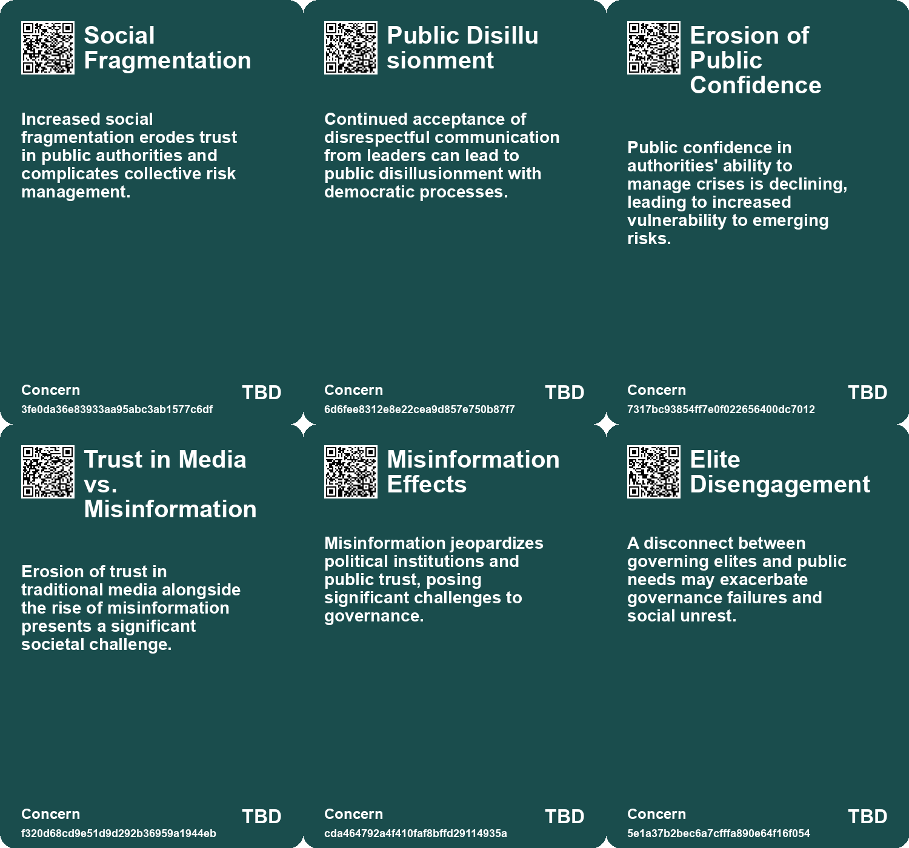
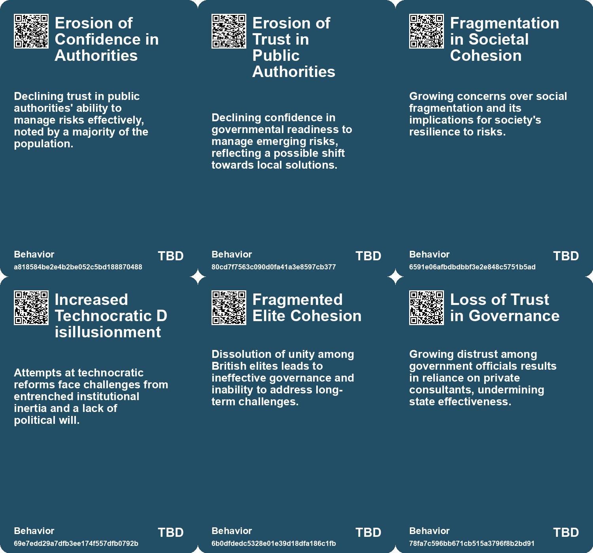
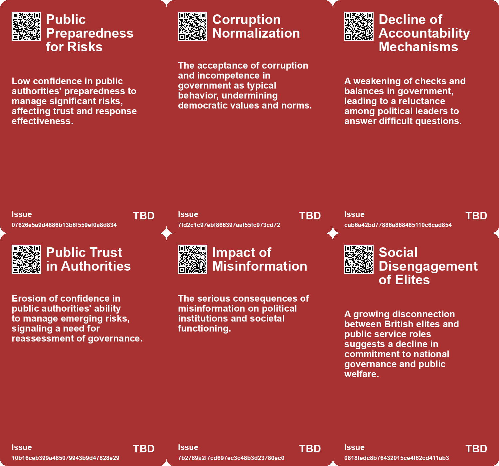
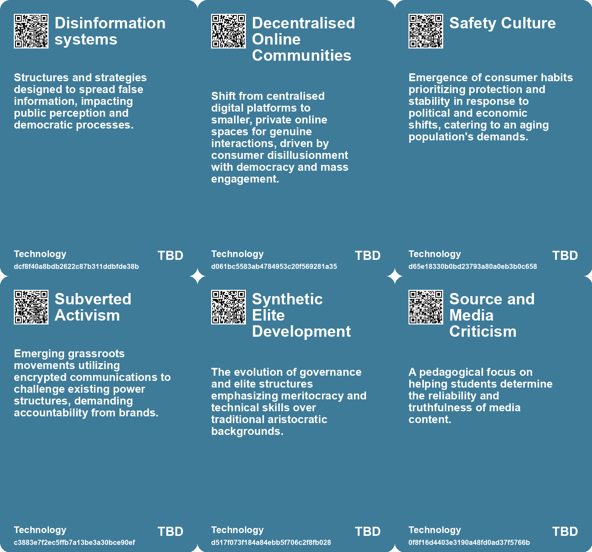

# *Topic*: Erosion of Trust in Institutions

# Summary

The decline of trust in institutions and the erosion of democratic values are prominent themes across various discussions. In the UK, a sense of intergenerational failure and a breakdown of trust in governance has led to a structural decline in productivity and social cohesion. This mirrors concerns in the U.S., where political discourse has devolved into juvenile behavior, undermining accountability and civic responsibility. The call for a return to maturity in political engagement highlights the need for citizens to demand higher standards from their leaders.

Infrastructure plays a critical role in shaping societal outcomes, with its degradation leading to social inequality and environmental challenges. Recent disasters, such as the flash flood in the Indian Himalayas, underscore the urgent need for sustainable infrastructure development. The relationship between human presence and environmental change is also explored, particularly in rural areas like Tyurkmen, Bulgaria, where abandonment raises questions about ecological recovery and biodiversity.

The rise of misinformation and the challenges posed by digital media are increasingly concerning. The phenomenon of "deep doubt" reflects a growing skepticism about the authenticity of digital content, exacerbated by the capabilities of AI to create counterfeit individuals. This trend threatens societal trust and complicates the landscape of information dissemination. Educational systems are grappling with the implications of AI, as students increasingly rely on technology for academic tasks, leading to a decline in critical thinking and cognitive skills.

Economic disparities and the concentration of private power are highlighted as significant threats to democracy. The rise of monopolistic practices, termed "economic termites," undermines fair competition and exacerbates inequalities. The need for a business system that supports social justice and an acceptable standard of living is emphasized, as is the importance of addressing the challenges posed by an aging population and changing demographics.

Climate change remains a pressing concern, consistently identified as a top risk by experts and the public alike. The Future Risks Report underscores the interconnectedness of global challenges, including geopolitical instability and cybersecurity threats. The report calls for a holistic approach to risk management, emphasizing local solutions and the critical role of the insurance sector in mitigating emerging risks.

The illegal sand mining industry exemplifies the environmental and security consequences of unchecked resource extraction. As the demand for sand in construction grows, the unsustainable practices associated with sand mining threaten ecosystems and water supplies. International cooperation and stricter regulations are necessary to address this pressing issue before it leads to a global shortage of construction-grade sand.

Finally, the impact of technology on society is a recurring theme, with discussions on the need for a cultural shift towards prioritizing critical thinking and attention over mere availability. The integration of digital literacy into education, as seen in Finland, offers a potential pathway to combat misinformation and foster deeper cognitive engagement among students. The challenges posed by AI and the need for ethical considerations in its deployment are critical as society navigates the complexities of a rapidly evolving digital landscape.

# Seeds

|    | name                                    | description                                                                                                | change                                                                                                     | 10-year                                                                                                               | driving-force                                                                                                   |
|---:|:----------------------------------------|:-----------------------------------------------------------------------------------------------------------|:-----------------------------------------------------------------------------------------------------------|:----------------------------------------------------------------------------------------------------------------------|:----------------------------------------------------------------------------------------------------------------|
|  0 | Emergence of Misinformation as a Hazard | Misinformation undermines trust in emergency responses and complicates disaster management efforts.        | Addressing misinformation shifts from an informational issue to a fundamental cognitive hazard.            | Systems to counter misinformation will evolve, enhancing public trust and response effectiveness.                     | The influence of social media and algorithm-driven content complicates risk communication.                      |
|  1 | Erosion of Public Trust in Authorities  | Confidence in public authorities to manage crises is declining.                                            | Public confidence shifts from trust in authorities to skepticism regarding their capabilities.             | In 10 years, communities may largely rely on local initiatives rather than central authorities for crisis management. | Increasing complexity and frequency of crises erodes public trust in government effectiveness and preparedness. |
|  2 | Erosion of Trust in Public Authorities  | Public confidence in authorities' ability to manage risks like climate change is declining.                | Declining public trust from a view of competent governance to growing skepticism.                          | In a decade, this erosion may lead to increased civil unrest and demand for alternative governance structures.        | Recurring failures in crisis management contributing to public distrust.                                        |
|  3 | Impact of Misinformation on Politics    | Growing recognition of misinformation's damaging effects on political institutions.                        | Shift from limited awareness to recognition of misinformation as a critical risk.                          | In ten years, misinformation could lead to fundamental changes in political processes and trust.                      | Increased digital communication and social media influence on public opinion.                                   |
|  4 | Erosion of Human Trust                  | The proliferation of counterfeit people threatens the foundational trust of society.                       | Transition from a society built on trust to one where skepticism prevails in digital communications.       | In 10 years, societal norms may evolve to require verification of identities in digital spaces.                       | Increasing reliance on digital interactions and the ease of creating counterfeit personas.                      |
|  5 | Conspiracy Theories Amplification       | Rise in conspiracy theories fueled by AI-generated media and deep doubt.                                   | Shift from skepticism towards specific events to broader distrust in all media narratives.                 | Conspiracy theories may become mainstream, affecting public trust in institutions and media.                          | The intersection of technology, misinformation, and social media dynamics.                                      |
|  6 | Growing Distrust in Institutions        | Workers exhibit increasing distrust towards institutions, paralleling political electoral abstention.      | Shift from trust and engagement in institutions to a sense of disillusionment and disengagement.           | Potential rise in alternative governance models or community-led initiatives in response to institutional failures.   | Continuous failure of traditional institutions to address people's needs and concerns.                          |
|  7 | Growing list of ethical collapses       | An increasing number of reputable companies are experiencing ethical failures, indicating systemic issues. | Transitioning from isolated incidents of ethical collapse to a widespread trend across many organizations. | In ten years, corporate culture may prioritize ethics, leading to a decline in scandals and improved trust.           | Increased public scrutiny and demand for corporate accountability are driving the emphasis on ethics.           |
|  8 | Culture of conflicts of interest        | Prevalence of conflicts of interest undermines ethical decision-making in organizations.                   | Moving from a culture of accepted conflicts to one that prioritizes transparency and conflict management.  | In ten years, companies may implement stringent conflict-of-interest policies, fostering better practices.            | Heightened awareness and regulatory scrutiny regarding conflicts of interest are driving this change.           |
|  9 | Erosion of Human Trust                  | The proliferation of counterfeit people threatens the foundational trust of society.                       | Transition from a society built on trust to one where skepticism prevails in digital communications.       | In 10 years, societal norms may evolve to require verification of identities in digital spaces.                       | Increasing reliance on digital interactions and the ease of creating counterfeit personas.                      |

# Concerns

|    | name                                 | description                                                                                                                                |
|---:|:-------------------------------------|:-------------------------------------------------------------------------------------------------------------------------------------------|
|  0 | Social Fragmentation                 | Increased social fragmentation erodes trust in public authorities and complicates collective risk management.                              |
|  1 | Public Disillusionment               | Continued acceptance of disrespectful communication from leaders can lead to public disillusionment with democratic processes.             |
|  2 | Erosion of Public Confidence         | Public confidence in authorities' ability to manage crises is declining, leading to increased vulnerability to emerging risks.             |
|  3 | Trust in Media vs. Misinformation    | Erosion of trust in traditional media alongside the rise of misinformation presents a significant societal challenge.                      |
|  4 | Misinformation Effects               | Misinformation jeopardizes political institutions and public trust, posing significant challenges to governance.                           |
|  5 | Elite Disengagement                  | A disconnect between governing elites and public needs may exacerbate governance failures and social unrest.                               |
|  6 | Long-term Cultural Impact            | A society inundated with digital forgeries may alter cultural norms around communication and trust.                                        |
|  7 | Erosion of Faith in Economic Systems | Growing public distrust in economic systems due to consistent hidden price hikes and poor service quality from monopolies.                 |
|  8 | Democratic Deficit                   | Rapid policy changes, such as those regarding the mink cull, could lead to perceptions of diminished public trust in democratic processes. |
|  9 | Exposure to Misinformation           | As political polarization increases, collective responses to misinformation could weaken the societal trust that has been built over time. |

# Cards

## Concerns

## Behaviors

## Issue

## Technology

# Links

* [Understanding Corporate Ethical Collapse: Key Signs and Preventive Measures](https://futures.kghosh.me/45854362019860740951c83df1c7122e)
* [Future Risks Report 2025: Increasing Global Crises and Emerging Risks Analysis](https://futures.kghosh.me/c5ecb012c90eddae1d46c1137e384c86)
* [The Interplay of Democracy, Work, and Economic Justice in Modern Society](https://futures.kghosh.me/43aa6ac3d82bbc19f0d66d5b2bb37897)
* [Future Trends Post-2024: Declining Democracies and Emerging Cultural Shifts](https://futures.kghosh.me/bd1b01636b1360716b5951e1cac42724)
* [The Unraveling of Progressive Politics: Economic Shifts and Growing Conflicts](https://futures.kghosh.me/f4ea5244ccafd654e5955673b0ee3976)
* [Exploring the Modern Entertainment Landscape and Its Societal Implications](https://futures.kghosh.me/c5c2c794f1426e6e307a9df3f9ff61f6)
* [Future Risks Report 2024: Key Findings on Emerging Global Challenges](https://futures.kghosh.me/caf29de5522a914887f9653f8edfd0a6)
* [The Decline of Human Thinking in the Age of AI: A Call for Educational Reform](https://futures.kghosh.me/1909e5d11ae6f5dc49eb87e739bb1885)
* [The Decline of Political Maturity in America: A Call for Responsible Citizenship](https://futures.kghosh.me/ec5b543a174bedb5387b497cc449e5b9)
* [Understanding Economic Termites: Hidden Monopolies Driving Up Costs and Eroding Trust](https://futures.kghosh.me/ff9fdda9334a55cda4fd1788668b3e15)
* [Evolving Perspectives on Risk Management in the Context of Modern Disasters](https://futures.kghosh.me/cd4f6f65b2486d56699138cd2270044d)
* [The Underreported Crisis of Illegal Sand Mining and Its Environmental Consequences](https://futures.kghosh.me/30353a701a13370e93f7369cc6b68c0b)
* [Addressing Threats to Democracy: Strategies for Resilience Against Misinformation and Manipulation](https://futures.kghosh.me/56d1a28746cd95ebaa3d62a4e1f91c3a)
* [The UK's Declining Geopolitical Relevance and Elite Inaction: A Historical Perspective](https://futures.kghosh.me/ca555520973a0e8519ff854da1de4d88)
* [Finland's Innovative Approach to Combating Fake News Through Education](https://futures.kghosh.me/ad15fbe04bbe50ec3436c61403d19fca)
* [The Urgent Need to Outlaw AI-Generated Counterfeit People to Protect Society](https://futures.kghosh.me/df749b28f13a14f030501985011f6c5b)
* [Growing Cybersecurity Threats to Water Infrastructure Demand Immediate Action and Collaboration](https://futures.kghosh.me/fb9b2211d0fcea8245837d9b34379d9f)
* [Understanding Polarization: Healing Our Relationship with Technology and Embracing Diverse Perspectives](https://futures.kghosh.me/c1bb890337ef382bfaa5720c9fd05134)
* [Emerging Global Risks: Climate Change, Geopolitical Tensions, and Technological Threats in 2025](https://futures.kghosh.me/c279f12eda98e732755a0f730b9d4d4b)
* [Exploring the Rise of 'Deep Doubt' Amidst AI-Generated Media Content](https://futures.kghosh.me/97be17298986599d68a1642e4359d6d5)
* [Exploring Trust in Denmark: A Nation Built on Goodwill and Equality](https://futures.kghosh.me/71b8e40b9db95feeacb1fe0d25d539e1)
* [Reimagining Infrastructure: Towards a Redistributive and Ecologically Sound Future](https://futures.kghosh.me/177a0857ffe0d07d48cd99a269f28a02)
* [Google's Transition to Remote Work and the Evolution of Information Security](https://futures.kghosh.me/7a34820852cf03cbbdb1fb75ca3b629c)
* [The Disruption of Education by AI: An Intellectual Crisis](https://futures.kghosh.me/9457c5541dba02968735056f18b53dc3)
* [The Urgent Need to Outlaw AI-Generated Counterfeit People to Protect Society](https://futures.kghosh.me/ee8ec5a4a60822d8e8a1774e02d3a7e5)
* [Economic Turmoil in Britain Signals Broader Crisis for Europe Due to Energy War](https://futures.kghosh.me/eab98729272b0f85f67258553c6590c7)
* [Exploring the Consequences of Abandonment in Rural Bulgaria and Nature's Response](https://futures.kghosh.me/9ab2903416b01dac618d7f3b93ab6dfa)