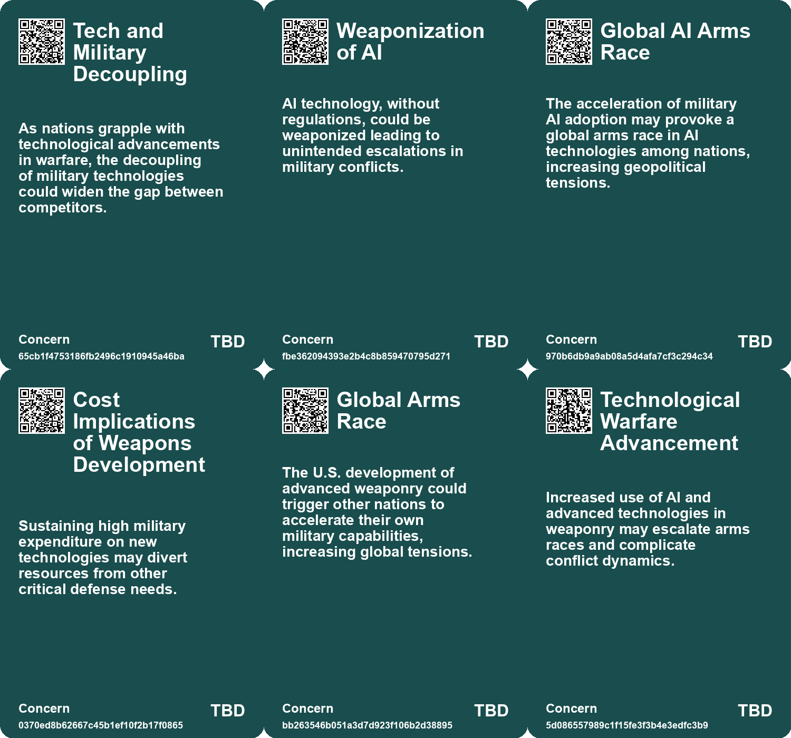
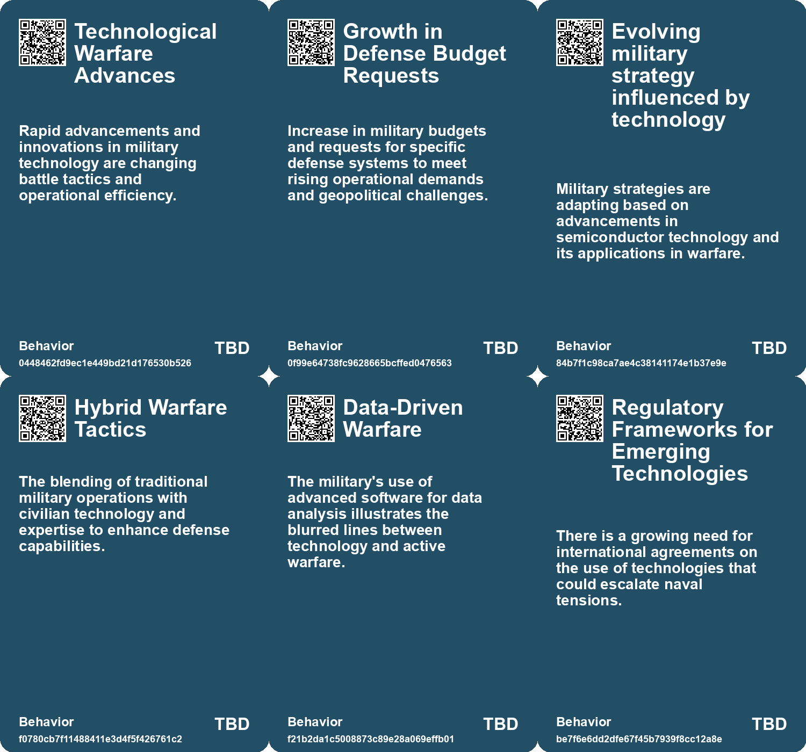
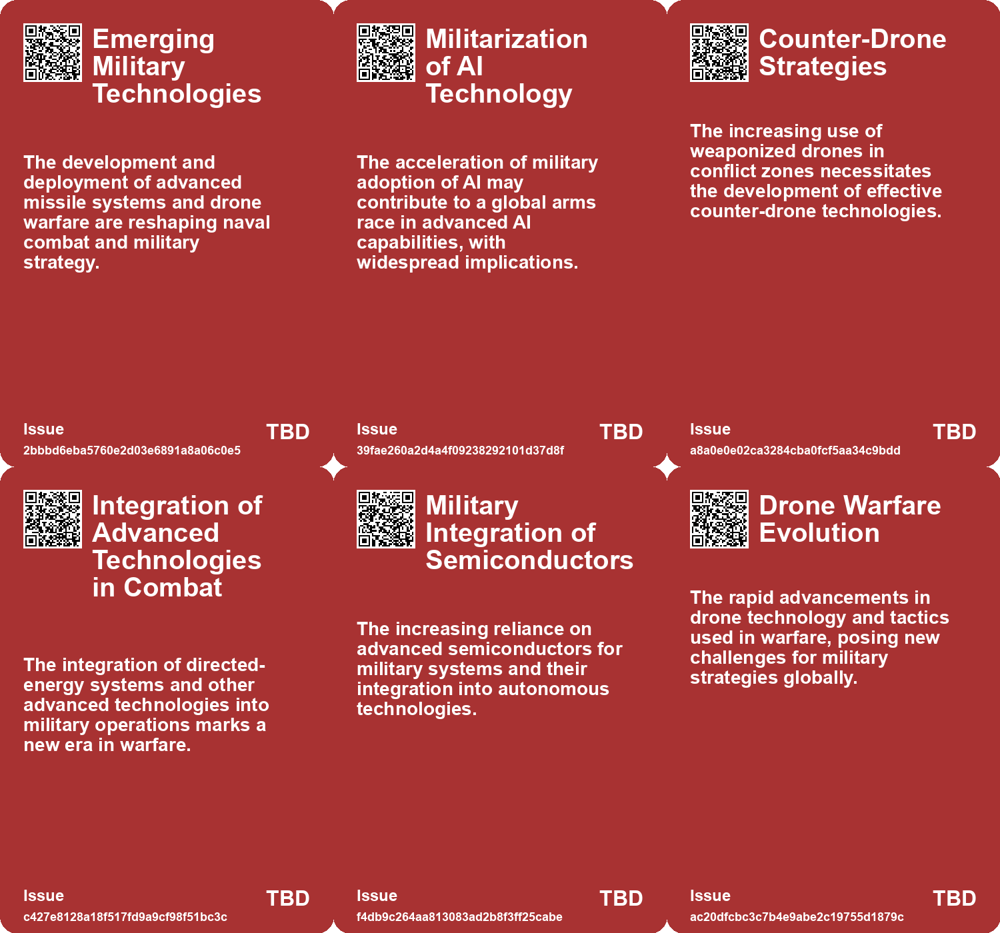
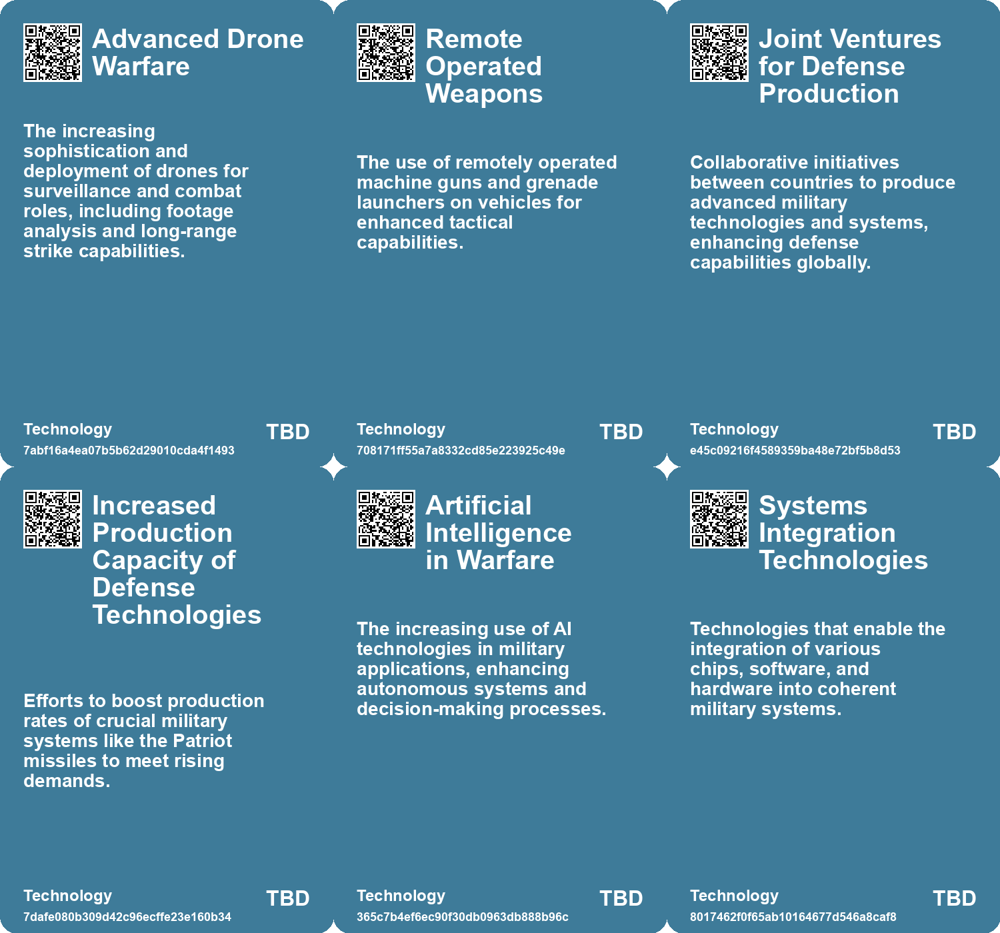

# *Topic*: Escalation of Military Technologies

# Summary

Military technology is rapidly evolving, with a significant focus on artificial intelligence (AI) and unmanned systems. Ukraine is investing in land robots for various military applications, including medical evacuation and logistics, while collaborating with U.S. companies to enhance its defense manufacturing capabilities. The integration of AI into warfare is becoming increasingly critical, as nations like the U.S. and China compete for dominance in this field. The U.S. is urged to confront the implications of AI on military command structures, especially as China makes substantial investments in AI for defense.

Directed-energy weapons are also gaining traction, with the U.S. Army deploying high-energy laser systems to counter drone threats. This marks a historic moment as it represents the first public use of laser weapons for air defense. The Army's focus on integrating advanced technologies aims to protect troops and enhance operational effectiveness.

Global military spending has reached unprecedented levels, driven by rising tensions and conflicts. The U.S. and China account for a significant portion of this expenditure, with both nations prioritizing technological advancements in their military strategies. The ongoing conflict in Ukraine has further intensified military outlays, as countries seek to bolster their defenses against perceived threats.

The landscape of warfare is shifting, with the emergence of lethal autonomous weapons (LAWs) raising ethical and regulatory concerns. The United Nations is addressing these issues, aiming to establish a ban on weapons that operate without human oversight. The discussions highlight the challenges of defining LAWs and enforcing regulations, as nations invest heavily in AI-equipped military technologies.

Cyber warfare is another critical aspect of modern conflict. Hacktivist groups involved in the Ukraine conflict have agreed to adhere to rules of engagement set by the International Committee of the Red Cross, marking a significant step towards reducing civilian-targeted cyber-attacks. This development reflects a growing recognition of the need for ethical considerations in cyber operations.

The geopolitical landscape is also shifting, with China emerging as a formidable global power. The dynamics of U.S.-China relations are evolving, as the U.S. grapples with the implications of China's military advancements. The potential for conflict is tempered by the understanding that economic integration does not guarantee peace, as historical precedents suggest.

In Europe, nations are responding to the Russian threat by enhancing their military capabilities. The EU is set to unveil a drone defense plan, while NATO is reinforcing its eastern defenses in response to recent incursions. The urgency for a coordinated defense strategy is evident, as European leaders seek to bolster their collective security against ongoing aggression.

Finally, the role of technology in surveillance and military operations is under scrutiny. The integration of AI and advanced surveillance systems raises questions about privacy and ethical implications. As nations navigate the complexities of modern warfare, the balance between technological advancement and ethical responsibility remains a critical concern.

# Seeds

|    | name                                        | description                                                                                 | change                                                                                               | 10-year                                                                                                             | driving-force                                                                                       |
|---:|:--------------------------------------------|:--------------------------------------------------------------------------------------------|:-----------------------------------------------------------------------------------------------------|:--------------------------------------------------------------------------------------------------------------------|:----------------------------------------------------------------------------------------------------|
|  0 | AI's Potential in Military Use              | Discussion of AI’s growing role in military strategies and conflict escalation.             | Movement towards strict regulations on military applications of AI to avoid escalation and misuse.   | In 10 years, militaries may adopt comprehensive regulations around AI, focusing on human oversight.                 | The drive to prevent disastrous outcomes from unregulated military use of AI technologies.          |
|  1 | Drone Warfare Evolution                     | The rise of drone technology as a central aspect of modern combat.                          | From traditional warfare to a focus on drones and electronic warfare.                                | Drone technology will likely dominate military strategies and operations.                                           | Advancements in technology and the low cost of FPV drones.                                          |
|  2 | Cambrian Explosion of Uncrewed Systems      | Rapid advancements in uncrewed systems are changing modern warfare dynamics.                | From traditional manned systems to a diverse array of uncrewed capabilities.                         | Uncrewed systems will dominate military operations, leading to new operational paradigms.                           | Technological advancements and the need for cost-effective military solutions.                      |
|  3 | Cultural Reform in Military Institutions    | Adaptation of military culture to incorporate unmanned technologies.                        | From traditional military structures to more adaptive and tech-savvy approaches.                     | Military culture will evolve to embrace technological integration and innovation.                                   | The necessity of effective use of new technologies in combat situations.                            |
|  4 | Military Adaptation to Technological Change | The need for militaries to quickly adapt to technological advancements.                     | From slow adaptation to a proactive stance on technological integration.                             | Militaries will continuously evolve their strategies based on emerging technologies.                                | The fast-paced nature of technological evolution in warfare.                                        |
|  5 | AI Disruption in Warfare                    | AI technologies are fundamentally transforming the nature of warfare and military strategy. | Transitioning from traditional warfare to AI-driven tactics and strategies.                          | In 10 years, AI will dominate military operations, with autonomous systems leading the battlefield.                 | The urgent need for military superiority and rapid technological advancements.                      |
|  6 | Autonomous Warfare Evolution                | The emergence of lethal autonomous weapons and AI-controlled military systems.              | Moving from human-operated military systems to AI-controlled ones.                                   | By 2032, AI-controlled autonomous weapons will be commonplace in military operations.                               | The need for increased efficiency and effectiveness in combat scenarios.                            |
|  7 | Militarization of Technology                | The increasing intertwining of civilian technology development with military applications.  | Shift from purely commercial tech development to a focus on military and surveillance applications.  | A tech industry heavily influenced by military contracts and surveillance needs, altering the nature of innovation. | Government contracts and funding directing technological innovation towards military applications.  |
|  8 | Shift in US Military Focus                  | The US is pivoting towards advanced weapon systems amidst changing warfare dynamics.        | A transition from counter-insurgency to preparing for conflicts with advanced military capabilities. | In ten years, military strategies may heavily incorporate technology and advanced weaponry.                         | The need to address threats from nations with advanced military capabilities like China and Russia. |
|  9 | Rapid Advancement in Military Technology    | US military has rapidly advanced laser technology in recent years.                          | From decades of research to practical applications in combat situations.                             | In ten years, laser technology may dominate military air defense systems globally.                                  | Urgent need to counter evolving aerial threats leading to accelerated R&D.                          |

# Concerns

|    | name                                                     | description                                                                                                                                                    |
|---:|:---------------------------------------------------------|:---------------------------------------------------------------------------------------------------------------------------------------------------------------|
|  0 | Tech and Military Decoupling                             | As nations grapple with technological advancements in warfare, the decoupling of military technologies could widen the gap between competitors.                |
|  1 | Weaponization of AI                                      | AI technology, without regulations, could be weaponized leading to unintended escalations in military conflicts.                                               |
|  2 | Global AI Arms Race                                      | The acceleration of military AI adoption may provoke a global arms race in AI technologies among nations, increasing geopolitical tensions.                    |
|  3 | Cost Implications of Weapons Development                 | Sustaining high military expenditure on new technologies may divert resources from other critical defense needs.                                               |
|  4 | Global Arms Race                                         | The U.S. development of advanced weaponry could trigger other nations to accelerate their own military capabilities, increasing global tensions.               |
|  5 | Technological Warfare Advancement                        | Increased use of AI and advanced technologies in weaponry may escalate arms races and complicate conflict dynamics.                                            |
|  6 | Escalation of Military Conflicts                         | Advanced warfare technologies like drone swarms could escalate conflicts, leading to larger and more devastating wars.                                         |
|  7 | Impact of Global Political Tensions on Military Strategy | Geopolitical tensions exacerbated by technological advances in warfare could lead to escalated conflicts and unintended global repercussions.                  |
|  8 | Technological Contributions to Warfare                   | The development of technologies that could be used for military purposes raises questions about the responsibility of institutions in contributing to warfare. |
|  9 | Focus on Advanced Weaponry                               | Shift in military focus towards high-tech warfare might lead to escalation of conflicts with advanced military capabilities.                                   |

# Cards

## Concerns

## Behaviors

## Issue

## Technology

# Links

* [The Urgent Need for AI Dominance in Warfare: A Call to Action for America](https://futures.kghosh.me/220b8fb679dd137a4d58458d0db85b46)
* [NATO's Rapid Response to Russian Drone Incursion: Insights from General David Petraeus](https://futures.kghosh.me/6b405be6129d8ac61889729438da48f9)
* [Putin's Military Recruitment Surge Signals Potential NATO Conflict Amid Tensions](https://futures.kghosh.me/295482a81133d3b07fbb57a9b31cd3c6)
* [Ukraine's Strategic Shift: Investing in Land Robots and Domestic Arms Production](https://futures.kghosh.me/6860a1a22c22dc8bdb8a95d66320925b)
* [Exploring the Importance of Semiconductors in Modern Warfare and U.S.-China Rivalry](https://futures.kghosh.me/328434477c31995b44102949d5341006)
* [U.S. Army's Deployment of Patriot Missiles Amid Heightening Global Tensions and Demand](https://futures.kghosh.me/e7d130a11e7f432efd9d3c5bcbcad482)
* [China's Rise and the Prevention of a 21st Century Thucydides Trap](https://futures.kghosh.me/e35fed87b0c84188965e5323af1a8e57)
* [The Rise of Lethal Autonomous Weapons: Ethical and Regulatory Challenges in Modern Warfare](https://futures.kghosh.me/7f25552b9124a4dc3833e782ef331275)
* [OpenAI's Shift in Policy: Collaborating with the Pentagon on AI Projects Amid Safety Concerns](https://futures.kghosh.me/e625a640f3cfddf1f648256a243cb214)
* [Serhii "Flash" Beskrestnov: Shaping Ukraine's Drone Defense Amidst War](https://futures.kghosh.me/c482a391981058e49ac4d639abc47040)
* [U.N. Security Council Addresses the Challenges and Opportunities of Artificial Intelligence](https://futures.kghosh.me/ca000dd628ace8fa385910be496aaf7e)
* [U.S. Army's Initiative to Use High-Altitude Balloons for Drone Swarms and ISR Operations](https://futures.kghosh.me/4d4f8bb17a5a7e5a852786591e70ffc8)
* [The Deployment of Laser Weapons: A New Era in Military Air Defense](https://futures.kghosh.me/6edce3de8121a1d42c8e7aac1cc18323)
* [Embracing Technology and Talent in the Age of AI: Key Insights from Rishad Tobaccowala](https://futures.kghosh.me/338c551fe29e9fb73aa8d412dc77788e)
* [EU and NATO Mobilize for Enhanced Drone Defense Amid Ongoing Russian Threats in Ukraine](https://futures.kghosh.me/3e4c925ac500834d9f4d986e418bcc26)
* [Hacktivist Groups in Ukraine Conflict Agree to New Cyber Warfare Rules to Protect Civilians](https://futures.kghosh.me/c039bde3f9a4fa2f206da538dde42fb5)
* [U.S. Army Deploys High-Energy Lasers for Counter-Drone Operations Overseas](https://futures.kghosh.me/9ede94d7b77e4a5a6316ba0271d5f561)
* [Pentagon Invests $800 Million in AI to Enhance Military Operations and National Security](https://futures.kghosh.me/b12eb549cb483b741b2eee80574d153c)
* [The Future of Submarine Stealth: AI and Detection Technologies at the Forefront](https://futures.kghosh.me/a2d71b9650498c986e12d44183e3fcfd)
* [U.S. Military Leaders Emphasize Need for Offensive Counterspace Weapons Amid Growing Threats](https://futures.kghosh.me/14449a59854fc9db2d294ba484581701)
* [Taiwan Prepares Citizens for Cyber Warfare Amid Chinese Threat](https://futures.kghosh.me/e99358609284de847f0d590948f5b265)
* [Exploring the Ordinary Origins of Surveillance: Insights from Hochman and González's New Books](https://futures.kghosh.me/ccdebc20efc0694474f1c64e2835e260)
* [Transforming Warfare: The Role of Uncrewed Systems in Modern Military Strategy](https://futures.kghosh.me/df83d0064f88153a92b016bc412f6b97)
* [European Leaders Address Drone Threats and Strengthen Defense Strategies Against Hybrid War](https://futures.kghosh.me/38f4bf649d0757debecb51a159c59887)
* [MIT's Controversial Ties to Israeli Military Funding and Student Protests](https://futures.kghosh.me/0d4171563ade773e41ab3c5949dccb52)
* [Record Global Military Spending Reaches $2440 Billion Amid Rising Geopolitical Tensions](https://futures.kghosh.me/a6e51bf195e812183ab4fdb51df506a1)