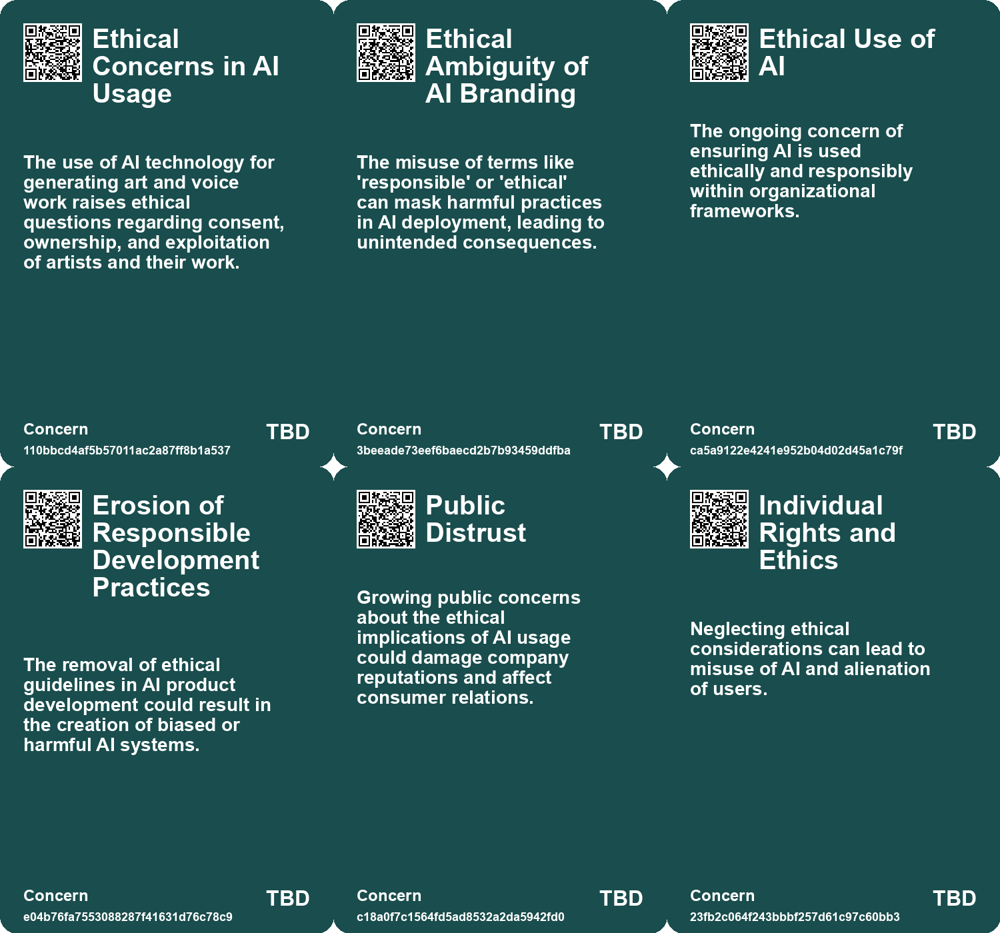
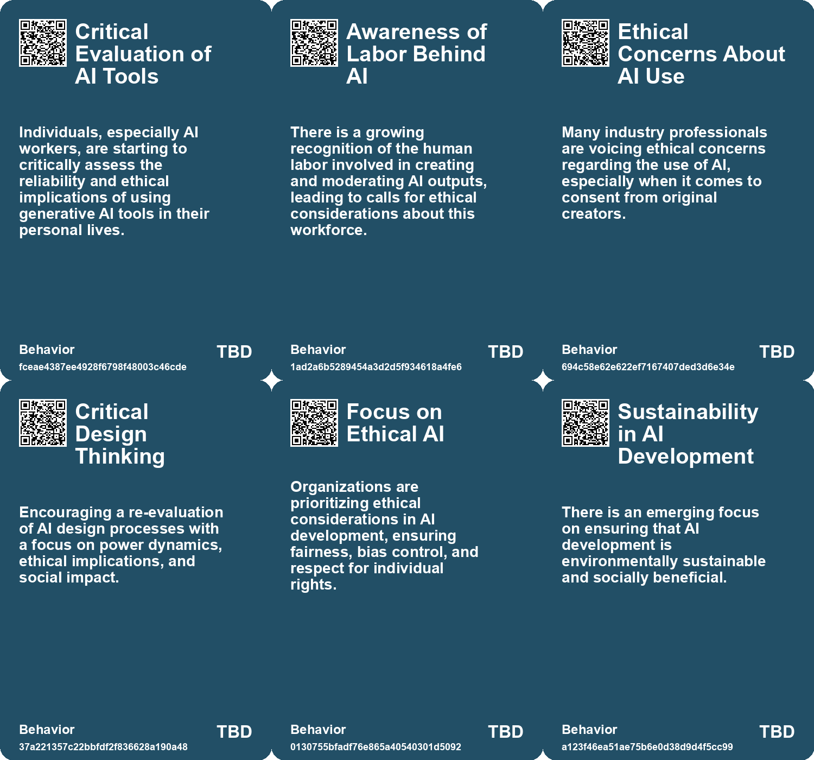
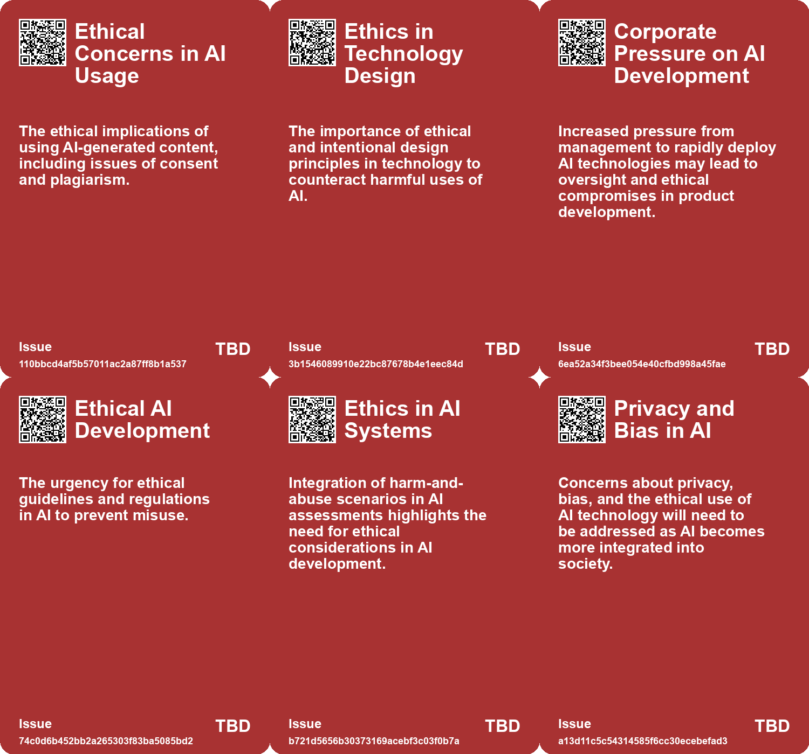
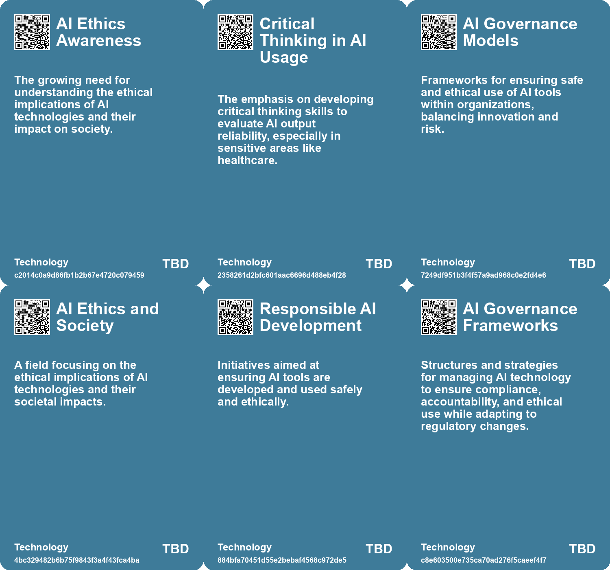

# *Topic*: Ethical Considerations in AI Dev

# Summary

The rapid advancement of artificial intelligence (AI), particularly generative AI, has raised significant concerns about trust, ethics, and governance. As organizations increasingly adopt AI technologies, the need for robust frameworks to ensure responsible use has become paramount. The Responsible AI Institute emphasizes the importance of AI governance, urging organizations to establish oversight mechanisms to address issues such as bias, data ownership, and privacy. This call for governance is echoed by various stakeholders, including regulators who are striving to create harmonized international regulations that balance innovation with safety.

Transparency remains a critical issue in the AI landscape. The lack of clarity surrounding AI systems can lead to biased outputs and privacy violations. Explainable AI (XAI) is highlighted as a necessary approach to enhance understanding and trust in AI technologies. Organizations are encouraged to integrate explainability into their AI development processes to mitigate operational risks and foster user confidence.

The ethical implications of AI are further underscored by the experiences of AI workers, who express concerns about the reliability of AI-generated content. Many workers advocate for caution, emphasizing the potential harms of AI in sensitive areas such as healthcare. This sentiment is mirrored in the broader discourse on AI's impact on society, where the creation of counterfeit digital entities poses risks to trust and human freedom. The call for accountability in the development and deployment of AI technologies is growing, with suggestions for strict liability laws to ensure ethical obligations are met.

The potential of AI to drive social good is also a prominent theme. AI applications are being explored in various sectors, including education, health, and environmental protection, with the aim of advancing the United Nations Sustainable Development Goals. However, challenges such as funding disparities and biases must be addressed to fully leverage AI's capabilities for positive change.

As organizations navigate the complexities of AI adoption, the balance between productivity gains and ethical considerations is crucial. Many companies are grappling with the implications of AI on job security and creative processes. The rise of "secret cyborgs," individuals using AI tools without disclosure, highlights the need for organizations to create a culture of openness and collaboration around AI technologies.

The conversation around AI is not limited to its technical aspects; it also encompasses broader societal implications. Discussions about the future of economic systems in light of AI advancements suggest a potential shift towards creativity and exploration, moving away from traditional capitalist structures. This vision emphasizes the importance of responsible leadership and ethical practices as society adapts to the evolving landscape shaped by AI.

In summary, the discourse surrounding AI is multifaceted, encompassing governance, transparency, ethical implications, social good, productivity, job security, and the future of economic systems. As AI continues to evolve, the collective responsibility of stakeholders to ensure its safe and equitable use becomes increasingly critical.

# Seeds

|    | name                                     | description                                                                            | change                                                                                           | 10-year                                                                                               | driving-force                                                                                                |
|---:|:-----------------------------------------|:---------------------------------------------------------------------------------------|:-------------------------------------------------------------------------------------------------|:------------------------------------------------------------------------------------------------------|:-------------------------------------------------------------------------------------------------------------|
|  0 | Calls for Transparency in AI Development | AI workers advocate for more transparency about AI data sources and ethical practices. | Transition from opaque development processes to demands for clear disclosure from AI companies.  | Increased demands for transparency may lead to more ethical AI practices across the industry.         | Public awareness and potential backlash from unethical AI practices drive calls for transparency.            |
|  1 | Growing Interest in AI Ethics Education  | There is a rising interest in educating others about AI ethics and practices.          | From lack of discourse on AI ethics to more vocal advocacy for education and awareness.          | In 10 years, AI ethics education may become integral in tech curricula and public discourse.          | Concerns over misinformation and ethical implications prompt educational initiatives in AI ethics.           |
|  2 | Scaled Decision Making Risks             | AI enables decisions at unprecedented speed and volume, raising ethical concerns.      | Move from individualized decision-making processes to automated, large-scale decision-making.    | Widespread acceptance of systems where AI-backed decisions impact large populations instantly.        | Economic advantages driving organizations to leverage AI for efficiency while ignoring ethical implications. |
|  3 | Economic Incentives for Ethical AI       | Recognizing the need to create systems that foster ethical AI use and accountability.  | Transition from unregulated AI usage to enshrined ethics and economic incentives for fairness.   | Infrastructures ensure that AI development aligns with ethical norms and human rights considerations. | Public awareness and demand for accountability in AI usage necessitating institutional reforms.              |
|  4 | Economic Impact of Regulation            | The potential economic benefits of responsible AI use and adoption.                    | From unregulated rapid AI adoption to a more cautious and compliant approach due to legal risks. | Companies will prioritize compliance and ethical AI use as a competitive advantage.                   | The financial consequences of regulatory non-compliance and reputational damage.                             |
|  5 | Growing Demand for Ethical AI Practices  | An increasing focus on ethical considerations in AI development and use.               | From a technology-first approach to prioritizing ethics and social implications.                 | Ethical AI will become a standard expectation, influencing AI development and deployment.             | The need to balance innovation with societal impacts and ethical responsibilities.                           |
|  6 | Demand for Ethical AI                    | There is an increasing public demand for ethical considerations in AI development.     | From unregulated AI development to a push for ethical standards and accountability.              | In a decade, companies may face strict regulations and public scrutiny regarding AI ethics.           | Public awareness and activism around the societal impacts of AI technologies.                                |
|  7 | Ethical AI Development                   | Ongoing discussions about the ethical implications of AI technologies.                 | From unregulated AI development to a more structured and ethical approach.                       | AI development will prioritize ethical considerations and societal impact in its applications.        | Growing public concern regarding privacy, bias, and the societal impact of AI.                               |
|  8 | Ethical AI Awareness                     | Increased focus on ethical considerations in AI deployment within organizations.       | Shifting from unregulated AI use to a framework emphasizing ethics and responsibility.           | Organizations may adopt robust ethical frameworks governing AI use and oversight.                     | The growing need for accountability and ethical standards in technology.                                     |
|  9 | Human-Centered AI Policies               | Organizations are developing specific guidelines for responsible AI use.               | Transitioning from vague policies to specific, actionable AI use guidelines.                     | AI usage will be governed by clear, comprehensive policies ensuring safety and creativity.            | The necessity for organizations to ensure responsible AI practices amidst advancements.                      |

# Concerns

|    | name                                         | description                                                                                                                                                   |
|---:|:---------------------------------------------|:--------------------------------------------------------------------------------------------------------------------------------------------------------------|
|  0 | Ethical Concerns in AI Usage                 | The use of AI technology for generating art and voice work raises ethical questions regarding consent, ownership, and exploitation of artists and their work. |
|  1 | Ethical Ambiguity of AI Branding             | The misuse of terms like 'responsible' or 'ethical' can mask harmful practices in AI deployment, leading to unintended consequences.                          |
|  2 | Ethical Use of AI                            | The ongoing concern of ensuring AI is used ethically and responsibly within organizational frameworks.                                                        |
|  3 | Erosion of Responsible Development Practices | The removal of ethical guidelines in AI product development could result in the creation of biased or harmful AI systems.                                     |
|  4 | Public Distrust                              | Growing public concerns about the ethical implications of AI usage could damage company reputations and affect consumer relations.                            |
|  5 | Individual Rights and Ethics                 | Neglecting ethical considerations can lead to misuse of AI and alienation of users.                                                                           |
|  6 | Human-AI Interaction Risks                   | Questions arise regarding AI autonomy, decision-making, and potential misuse in harmful ways by individuals.                                                  |
|  7 | Responsible AI Frameworks                    | Organizations need to establish guidelines that encourage responsible use of AI while fostering creativity.                                                   |
|  8 | Ethical Risks of AI                          | AI technologies carry ethical risks alongside traditional risks, affecting fairness and accountability.                                                       |
|  9 | Ethical Implications of Generative AI        | Generative AI raises ethical concerns about authorship and ownership of content, particularly in ensuring human contributions are recognized and valued.      |

# Cards

## Concerns

## Behaviors

## Issue

## Technology

# Links

* [Rethinking the Role of AI: From Political Tool to Ethical Design Options](https://futures.kghosh.me/c25cae2b8d72e7634d591247d9ac96d2)
* [AI's Disruptive Presence in the Video Game Industry: Personal Experiences and Concerns](https://futures.kghosh.me/07654b65aaa32bbf290cfde69ddf3253)
* [The Urgent Need to Outlaw AI-Generated Counterfeit People to Protect Society](https://futures.kghosh.me/df749b28f13a14f030501985011f6c5b)
* [Harnessing AI for Social Good: Opportunities and Challenges in Achieving the UN SDGs](https://futures.kghosh.me/0d88d49818819d335d12f792275fde97)
* [The Importance of Explainable AI: Building Trust in Artificial Intelligence for Organizations](https://futures.kghosh.me/afe2219279811b5905b43a7731e95da7)
* [Understanding the Three C’s of Data Participation: Context, Consent, and Control in AI](https://futures.kghosh.me/2251d443897c8e2b1369bb144d9252b5)
* [Exploring the Future of AI in Knowledge Ecosystems and Global Challenges](https://futures.kghosh.me/a9266018b458295480a07167310458a9)
* [AI's Potential to Enhance Human Evolution and Self-Actualization](https://futures.kghosh.me/8893f2e58b95e1993a5f8a1af090eedd)
* [Addressing the Risks of AI Companionship: Addiction, Regulation, and Human Dignity](https://futures.kghosh.me/4611565d14a05789e2efc6fafc563f58)
* [Balancing Creativity and Safety: Microsoft's Approach to Generative AI Governance](https://futures.kghosh.me/d4390e62256a0c3c19306c1ebc3ffb5b)
* [The Transformative Potential of AI: Revolutionizing Education, Healthcare, and Global Equity](https://futures.kghosh.me/2449c2fc4b8afc7e268db4987fa821e5)
* [The Urgent Need to Outlaw AI-Generated Counterfeit People to Protect Society](https://futures.kghosh.me/ee8ec5a4a60822d8e8a1774e02d3a7e5)
* [Establishing Responsible AI Governance: A Guide for Organizations in an Evolving Landscape](https://futures.kghosh.me/fab122d29aed97045e0cc1ea77bdef44)
* [AI Workers Share Ethical Concerns and Distrust Over Generative AI Reliability and Safety](https://futures.kghosh.me/440c60817054047ca4be7ef38b8c3074)
* [Navigating the Complex Regulatory Landscape of Generative AI: Risks and Strategies for Organizations](https://futures.kghosh.me/43eafc183f7cc060f7cb7fed455e20a7)
* [Understanding the Real Risks of AI Beyond Superintelligence and Scalability](https://futures.kghosh.me/ff7f7a51f925c273449a8648a18b7df8)
* [The Urgent Need for Ethical AI Regulations Amid Rapid Development and Deployment](https://futures.kghosh.me/382e9ebc1e518ee49e541da1e6b5f8af)
* [Navigating the Dilemma of AI Integration in Organizations: Embracing Secret Cyborgs for Innovation](https://futures.kghosh.me/c42a95f16678ed3834840d48f8e775a3)
* [Navigating the Future: The Impact of AI on Society and Economy](https://futures.kghosh.me/87709d0e31dee725ec1f54b7f4facbc4)
* [Shifting from Jobs to Tasks: Embracing Generative AI in the Workplace](https://futures.kghosh.me/7b32746090d30efbc45247539e3ec1da)
* [Microsoft Disbands AI Ethics and Society Division Amid Layoffs, Raising Concerns About Responsible AI Development](https://futures.kghosh.me/dc8173751ce4b0562a6a9cf47ee715ab)
* [Navigating the Risks of Generative AI: Data Privacy and Intellectual Property Challenges](https://futures.kghosh.me/3c44301c056cd97da8e2fee49627b03e)
* [NVIDIA's AI Red Team Philosophy: Ensuring Responsible Machine Learning Development and Security Risks Assessment](https://futures.kghosh.me/f87bcfb74a4a1db0ac38bd573144fd59)
* [A Timeline of Women's Contributions to AI Ethics and Advocacy from 2014 to 2023](https://futures.kghosh.me/2b3dffe867d32d85c04baf149e2444ea)