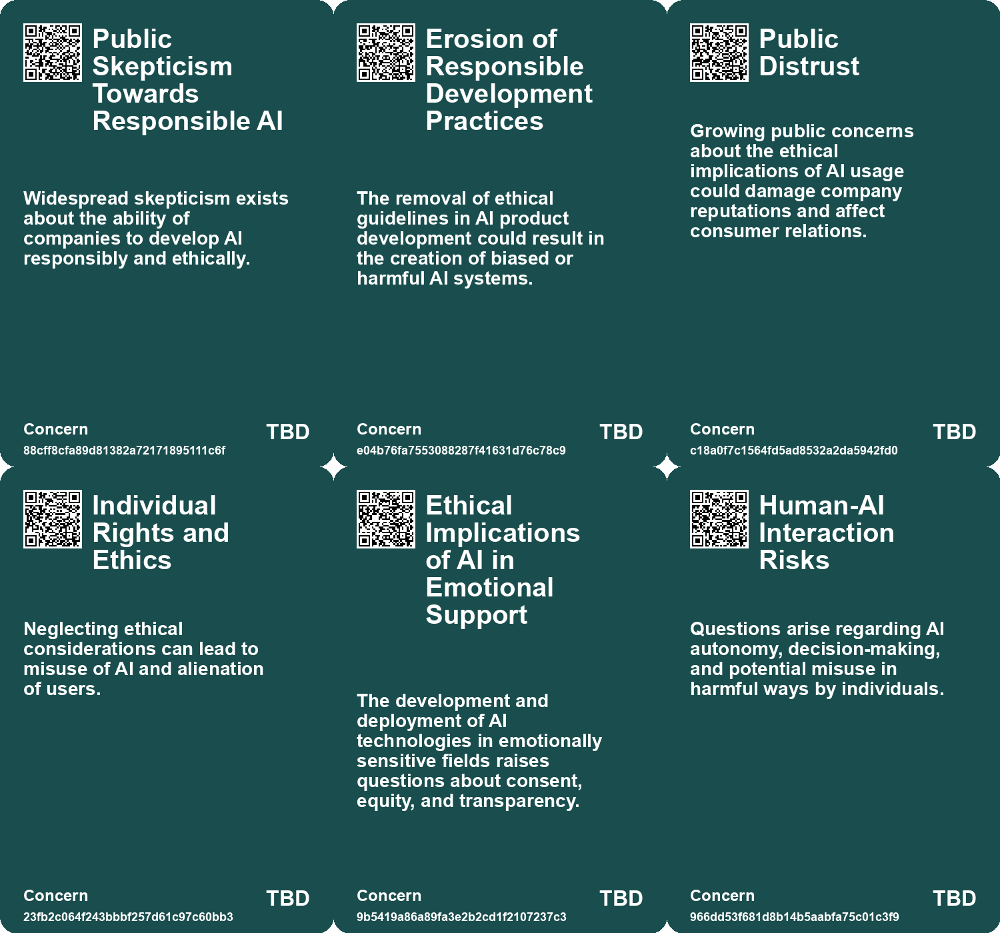
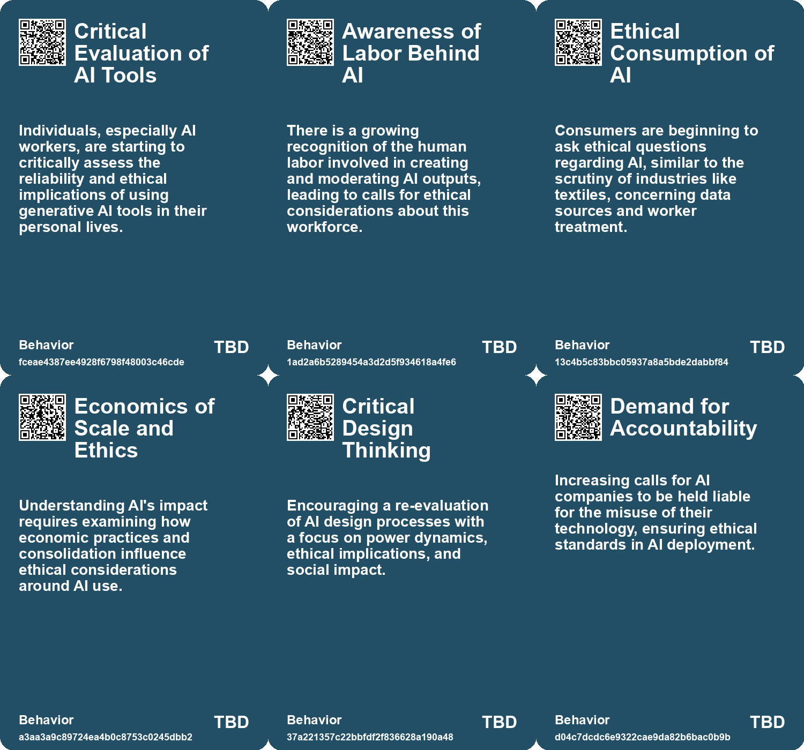
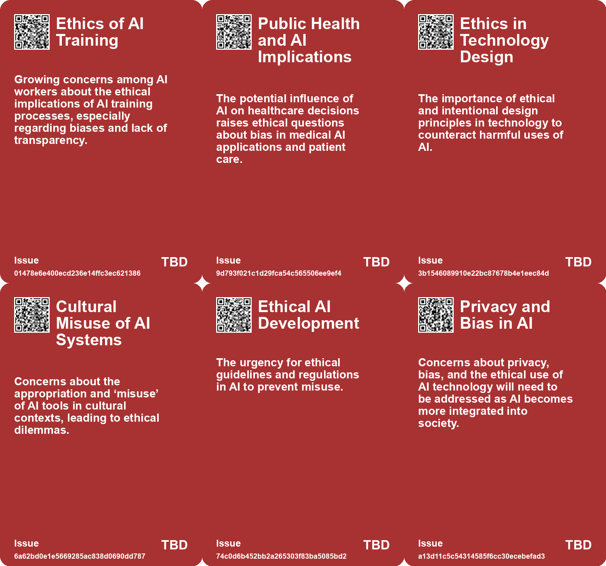
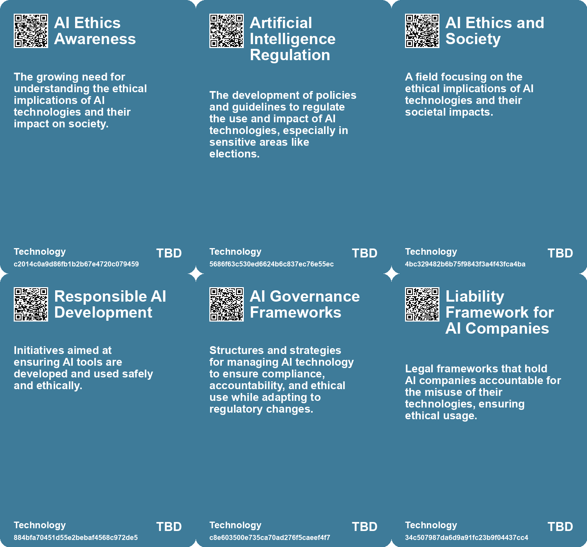

# *Topic*: Ethical Implications of AI

# Summary

The rapid advancement of artificial intelligence (AI) has sparked significant debate about its implications for society, ethics, and the economy. A central theme is the urgent need for regulation and governance. Experts and organizations emphasize the importance of establishing frameworks to address issues such as bias, privacy, and accountability. The Responsible AI Institute advocates for comprehensive AI governance to ensure ethical development and deployment, while the European Union's proposed Artificial Intelligence Act seeks to mitigate risks, though it falls short in addressing generative AI specifically.

Concerns about the ethical implications of AI are echoed by workers in the field. Many AI workers express distrust in the systems they interact with, citing rushed timelines and inadequate training. This skepticism is compounded by the potential for AI to generate misleading or harmful content, particularly in sensitive areas like healthcare. The call for transparency and ethical considerations is echoed by figures like Jaron Lanier, who suggests labeling machine-generated content to ensure accountability.

The impact of AI on the job market is another pressing issue. While AI presents opportunities for increased productivity and creativity, it also threatens traditional employment, particularly in sectors reliant on human interaction. The potential for job displacement raises questions about economic structures and the need for retraining programs. Some experts argue for a shift in focus from jobs to tasks, suggesting that companies should identify specific tasks that AI can perform, allowing employees to redefine their roles in collaboration with technology.

The emergence of AI companionship highlights the psychological dynamics of human interaction with technology. As individuals seek emotional support from AI, concerns arise about addiction and the depersonalization of relationships. This phenomenon underscores the need for innovative regulatory approaches that protect personal freedoms while addressing the risks associated with AI companionship.

Generative AI, in particular, poses unique challenges. The technology's ability to create counterfeit digital personas raises ethical concerns about trust and manipulation. Experts warn that the proliferation of counterfeit people could undermine societal trust and democracy. Calls for stringent regulations and accountability measures are growing, with suggestions for watermark systems to identify AI-generated content.

The potential of AI to contribute to social good is also a significant theme. Applications of AI are being explored in areas such as education, healthcare, and environmental protection, aligning with the United Nations Sustainable Development Goals. However, disparities in funding and the risks of bias and misinformation remain obstacles to achieving these goals. Collaboration among stakeholders is essential to harness AI's potential for positive change.

Finally, the divide between public perception and expert opinion on AI is notable. While experts often highlight the transformative potential of AI, the general public expresses concerns about job security and ethical implications. This divergence underscores the need for inclusive discussions about AI's future, ensuring that diverse perspectives are considered in shaping policies and practices.

As AI continues to evolve, the interplay of these themes will shape the discourse surrounding its integration into society, highlighting the importance of responsible development and ethical considerations.

# Seeds

|    | name                                     | description                                                                            | change                                                                                           | 10-year                                                                                                | driving-force                                                                                                |
|---:|:-----------------------------------------|:---------------------------------------------------------------------------------------|:-------------------------------------------------------------------------------------------------|:-------------------------------------------------------------------------------------------------------|:-------------------------------------------------------------------------------------------------------------|
|  0 | Calls for Transparency in AI Development | AI workers advocate for more transparency about AI data sources and ethical practices. | Transition from opaque development processes to demands for clear disclosure from AI companies.  | Increased demands for transparency may lead to more ethical AI practices across the industry.          | Public awareness and potential backlash from unethical AI practices drive calls for transparency.            |
|  1 | Growing Interest in AI Ethics Education  | There is a rising interest in educating others about AI ethics and practices.          | From lack of discourse on AI ethics to more vocal advocacy for education and awareness.          | In 10 years, AI ethics education may become integral in tech curricula and public discourse.           | Concerns over misinformation and ethical implications prompt educational initiatives in AI ethics.           |
|  2 | Scaled Decision Making Risks             | AI enables decisions at unprecedented speed and volume, raising ethical concerns.      | Move from individualized decision-making processes to automated, large-scale decision-making.    | Widespread acceptance of systems where AI-backed decisions impact large populations instantly.         | Economic advantages driving organizations to leverage AI for efficiency while ignoring ethical implications. |
|  3 | Economic Incentives for Ethical AI       | Recognizing the need to create systems that foster ethical AI use and accountability.  | Transition from unregulated AI usage to enshrined ethics and economic incentives for fairness.   | Infrastructures ensure that AI development aligns with ethical norms and human rights considerations.  | Public awareness and demand for accountability in AI usage necessitating institutional reforms.              |
|  4 | Economic Impact of Regulation            | The potential economic benefits of responsible AI use and adoption.                    | From unregulated rapid AI adoption to a more cautious and compliant approach due to legal risks. | Companies will prioritize compliance and ethical AI use as a competitive advantage.                    | The financial consequences of regulatory non-compliance and reputational damage.                             |
|  5 | Growing Demand for Ethical AI Practices  | An increasing focus on ethical considerations in AI development and use.               | From a technology-first approach to prioritizing ethics and social implications.                 | Ethical AI will become a standard expectation, influencing AI development and deployment.              | The need to balance innovation with societal impacts and ethical responsibilities.                           |
|  6 | Ethical Considerations in AI Development | Companies are beginning to address ethical concerns in the development of empathic AI. | Transition from unregulated AI development to a focus on ethical guidelines and practices.       | Ethical frameworks for AI will be more established, impacting how AI interacts with users emotionally. | Growing public awareness and concern regarding the implications of AI on human relationships.                |
|  7 | Ethical AI Development                   | Ongoing discussions about the ethical implications of AI technologies.                 | From unregulated AI development to a more structured and ethical approach.                       | AI development will prioritize ethical considerations and societal impact in its applications.         | Growing public concern regarding privacy, bias, and the societal impact of AI.                               |
|  8 | Risks of AI Misuse                       | Concerns about the amplification of greed and selfishness through AI.                  | From a cautious approach to AI to potential misuse and societal harm.                            | In 10 years, society may grapple with the consequences of AI-driven greed and conflict.                | The inherent risks of powerful technologies in the hands of the unwise.                                      |
|  9 | Ethical AI Awareness                     | Increased focus on ethical considerations in AI deployment within organizations.       | Shifting from unregulated AI use to a framework emphasizing ethics and responsibility.           | Organizations may adopt robust ethical frameworks governing AI use and oversight.                      | The growing need for accountability and ethical standards in technology.                                     |

# Concerns

|    | name                                            | description                                                                                                                                              |
|---:|:------------------------------------------------|:---------------------------------------------------------------------------------------------------------------------------------------------------------|
|  0 | Public Skepticism Towards Responsible AI        | Widespread skepticism exists about the ability of companies to develop AI responsibly and ethically.                                                     |
|  1 | Erosion of Responsible Development Practices    | The removal of ethical guidelines in AI product development could result in the creation of biased or harmful AI systems.                                |
|  2 | Public Distrust                                 | Growing public concerns about the ethical implications of AI usage could damage company reputations and affect consumer relations.                       |
|  3 | Individual Rights and Ethics                    | Neglecting ethical considerations can lead to misuse of AI and alienation of users.                                                                      |
|  4 | Ethical Implications of AI in Emotional Support | The development and deployment of AI technologies in emotionally sensitive fields raises questions about consent, equity, and transparency.              |
|  5 | Human-AI Interaction Risks                      | Questions arise regarding AI autonomy, decision-making, and potential misuse in harmful ways by individuals.                                             |
|  6 | Unregulated AI Development                      | Rapid AI advancement without regulation may lead to unforeseen negative consequences and ethical dilemmas.                                               |
|  7 | Ethical Implications of AI                      | The opacity of AI decision-making processes raises concerns about accountability and ethical behavior in organizations.                                  |
|  8 | Ethical Risks of AI                             | AI technologies carry ethical risks alongside traditional risks, affecting fairness and accountability.                                                  |
|  9 | Ethical Implications of Generative AI           | Generative AI raises ethical concerns about authorship and ownership of content, particularly in ensuring human contributions are recognized and valued. |

# Cards

## Concerns

## Behaviors

## Issue

## Technology

# Links

* [Rethinking the Role of AI: From Political Tool to Ethical Design Options](https://futures.kghosh.me/c25cae2b8d72e7634d591247d9ac96d2)
* [The Urgent Need to Outlaw AI-Generated Counterfeit People to Protect Society](https://futures.kghosh.me/df749b28f13a14f030501985011f6c5b)
* [The Role of Social-Emotional AI: Bridging or Widening the Gap in Human Connection?](https://futures.kghosh.me/8e191b6221caa8d9f27b19268ab8a048)
* [Harnessing AI for Social Good: Opportunities and Challenges in Achieving the UN SDGs](https://futures.kghosh.me/0d88d49818819d335d12f792275fde97)
* [The Importance of Explainable AI: Building Trust in Artificial Intelligence for Organizations](https://futures.kghosh.me/afe2219279811b5905b43a7731e95da7)
* [The Rise of Augmented Humans: Embracing AI in a Transformative Era](https://futures.kghosh.me/a8f2b9b3c07bd0f1d91784ff8b5ee5fc)
* [MIT Study Challenges AI Job Displacement Fears with Economic Viability Insights](https://futures.kghosh.me/89ee61cc0d9fa77ecb1eb4100622a53f)
* [Exploring the Future of AI in Knowledge Ecosystems and Global Challenges](https://futures.kghosh.me/a9266018b458295480a07167310458a9)
* [OpenAI CEO Highlights AI Risks to Election Integrity and Calls for Regulation](https://futures.kghosh.me/fd96f58595786b0820cca21394223a66)
* [AI's Potential to Enhance Human Evolution and Self-Actualization](https://futures.kghosh.me/8893f2e58b95e1993a5f8a1af090eedd)
* [Addressing the Risks of AI Companionship: Addiction, Regulation, and Human Dignity](https://futures.kghosh.me/4611565d14a05789e2efc6fafc563f58)
* [The Transformative Potential of AI: Revolutionizing Education, Healthcare, and Global Equity](https://futures.kghosh.me/2449c2fc4b8afc7e268db4987fa821e5)
* [The Urgent Need to Outlaw AI-Generated Counterfeit People to Protect Society](https://futures.kghosh.me/ee8ec5a4a60822d8e8a1774e02d3a7e5)
* [Establishing Responsible AI Governance: A Guide for Organizations in an Evolving Landscape](https://futures.kghosh.me/fab122d29aed97045e0cc1ea77bdef44)
* [AI Workers Share Ethical Concerns and Distrust Over Generative AI Reliability and Safety](https://futures.kghosh.me/440c60817054047ca4be7ef38b8c3074)
* [Navigating the Complex Regulatory Landscape of Generative AI: Risks and Strategies for Organizations](https://futures.kghosh.me/43eafc183f7cc060f7cb7fed455e20a7)
* [Contrasting Views on AI: Public Concerns vs. Expert Optimism and Advocacy for Regulation](https://futures.kghosh.me/e2ce30b29c24272c98349d7a121be360)
* [Understanding the Real Risks of AI Beyond Superintelligence and Scalability](https://futures.kghosh.me/ff7f7a51f925c273449a8648a18b7df8)
* [The Urgent Need for Ethical AI Regulations Amid Rapid Development and Deployment](https://futures.kghosh.me/382e9ebc1e518ee49e541da1e6b5f8af)
* [AI's Impact on Society: Job Displacement and the Need for Retraining](https://futures.kghosh.me/cf119665e47c7434e3e3c54dbbc585e3)
* [Navigating the Dilemma of AI Integration in Organizations: Embracing Secret Cyborgs for Innovation](https://futures.kghosh.me/c42a95f16678ed3834840d48f8e775a3)
* [Navigating the Future: The Impact of AI on Society and Economy](https://futures.kghosh.me/87709d0e31dee725ec1f54b7f4facbc4)
* [How AI Could Transform Work-Life Balance and Job Dynamics in Various Industries](https://futures.kghosh.me/bc5ff4c170f1f63b34eb7ca70775d8d7)
* [The Security Risks of Rapid AI Integration: A Call for Caution and Awareness](https://futures.kghosh.me/b30a4282af9e53ca673438a8223d9525)
* [Shifting from Jobs to Tasks: Embracing Generative AI in the Workplace](https://futures.kghosh.me/7b32746090d30efbc45247539e3ec1da)
* [Microsoft Disbands AI Ethics and Society Division Amid Layoffs, Raising Concerns About Responsible AI Development](https://futures.kghosh.me/dc8173751ce4b0562a6a9cf47ee715ab)
* [The Transformative Impact of AI on Jobs, Reality, and Economic Value Distribution](https://futures.kghosh.me/17cff4adea214f71c7a5eed15307b0e7)