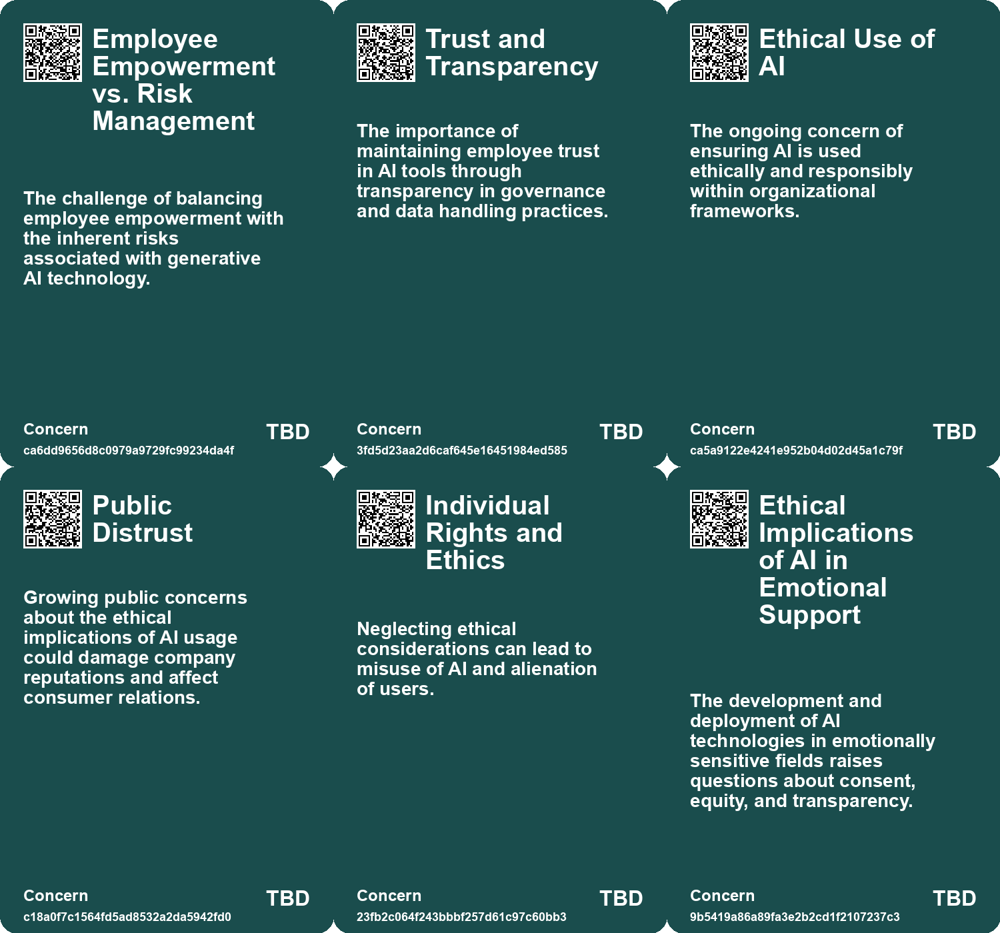
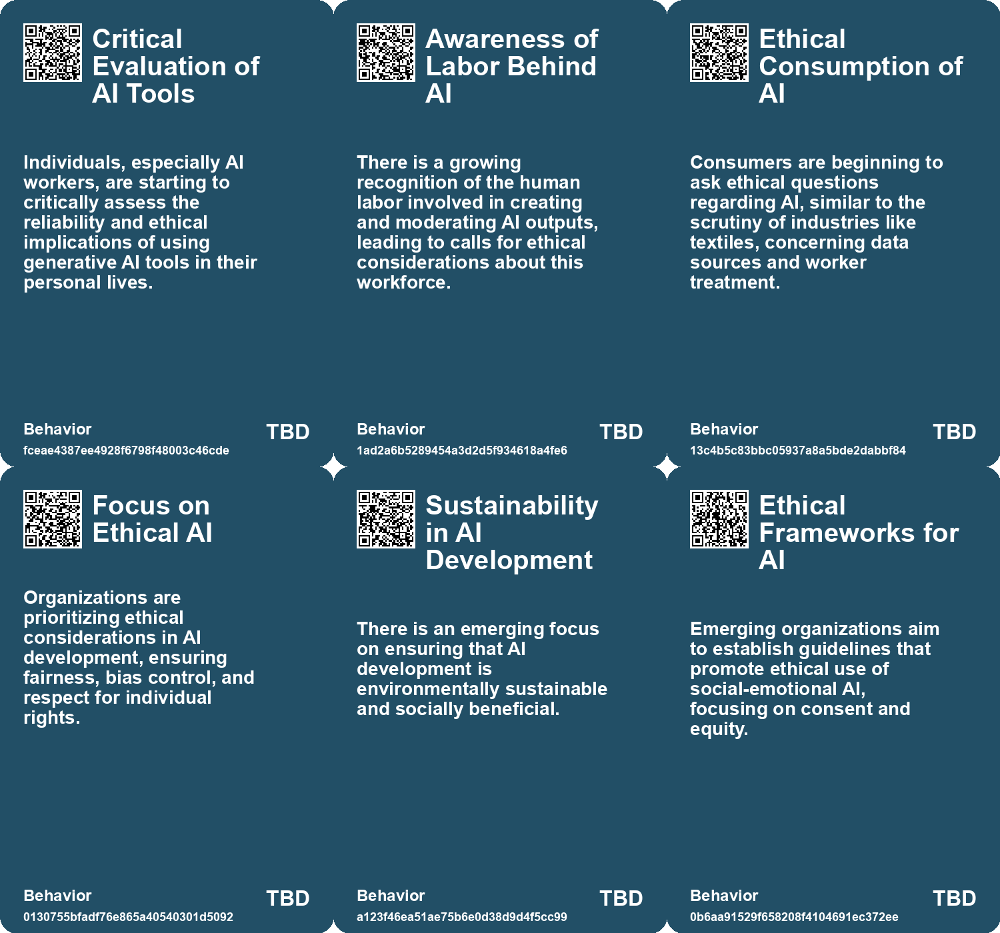
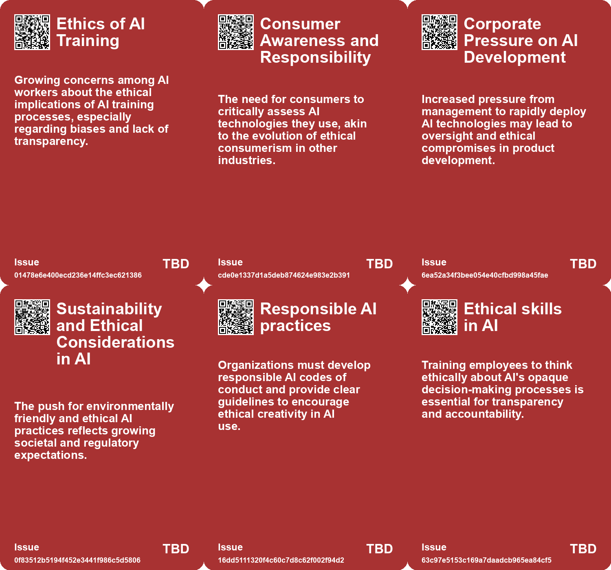
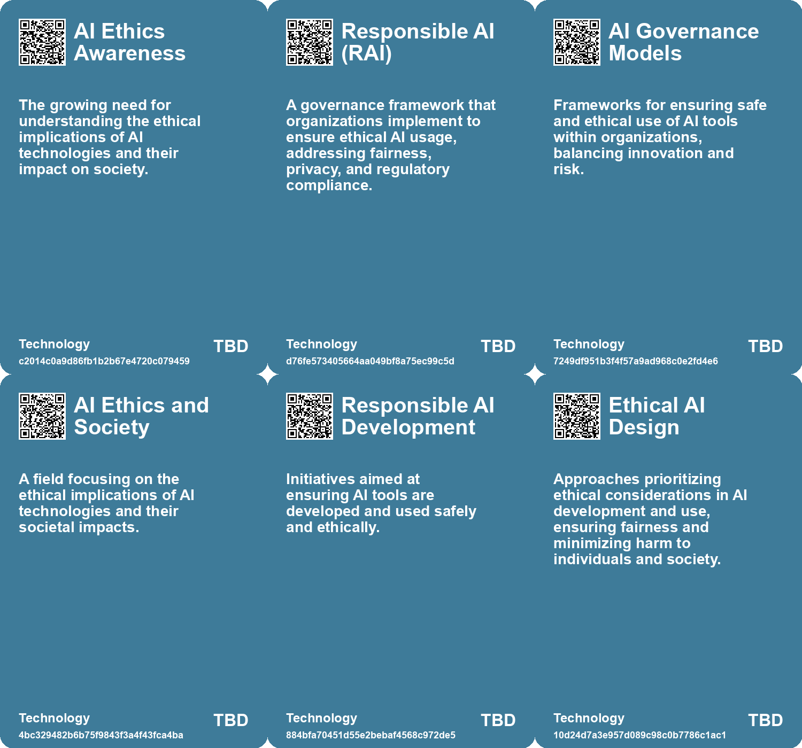

# *Topic*: Ethical Implications of AI Engagement

# Summary

The rapid advancement of artificial intelligence (AI) is reshaping various sectors, prompting discussions about governance, ethics, and societal impact. As organizations increasingly adopt AI technologies, the need for robust AI governance has become paramount. The Responsible AI Institute emphasizes the importance of oversight to address issues such as bias, data ownership, privacy, and cybersecurity. Organizations are encouraged to establish governance programs and comply with emerging regulations to ensure responsible AI deployment.

Generative AI, in particular, has garnered attention for its potential to enhance productivity and creativity. However, it also raises concerns about trust and preparedness within organizations. Many employees express apprehension about the accuracy and reliability of AI outputs, leading to calls for Explainable AI (XAI) to improve transparency and user confidence. The integration of AI into workplaces is seen as a double-edged sword, with freelancers often outperforming full-time workers, highlighting the need for a shift in talent management and work models.

The ethical implications of AI are further underscored by the emergence of AI companionship, which raises questions about addiction and the socio-economic factors driving its development. As AI becomes more integrated into daily life, the potential for misinformation and privacy violations looms large. The need for clear regulations and ethical guidelines is echoed by industry leaders, including OpenAI's CEO, who advocates for licensing and testing requirements to safeguard against societal harms.

Concerns about data privacy and intellectual property are also prevalent as organizations navigate the complexities of generative AI. Reports indicate that sensitive data is being leaked through both authorized and unauthorized AI applications, prompting Chief Information Security Officers to enforce stricter policies. The clash between current copyright laws and AI-generated content further complicates the landscape, necessitating clear guidelines for fair use and attribution.

Amid these challenges, the role of education in preparing future leaders for an AI-driven world is gaining traction. Business schools are integrating AI into their curriculums, emphasizing the importance of technology skills alongside a broader understanding of AI's impact on the future of work. This approach aims to equip graduates with the necessary tools to thrive in an evolving job market.

As organizations grapple with the implications of AI, the conversation around its potential to drive societal change continues. While AI holds promise for addressing global challenges, such as poverty and environmental sustainability, the risks associated with its deployment cannot be overlooked. The call for collaboration among stakeholders is crucial to harness AI's potential for social good while mitigating its inherent risks.

In the face of these developments, the landscape of AI governance remains fragmented and uncertain. Companies are urged to take proactive steps to establish responsible AI practices, ensuring that the benefits of AI are equitably distributed while addressing ethical concerns. The journey toward a future shaped by AI requires careful consideration, responsible leadership, and a commitment to fostering trust and transparency in its application.

# Seeds

|    | name                                     | description                                                                            | change                                                                                            | 10-year                                                                                                    | driving-force                                                                                      |
|---:|:-----------------------------------------|:---------------------------------------------------------------------------------------|:--------------------------------------------------------------------------------------------------|:-----------------------------------------------------------------------------------------------------------|:---------------------------------------------------------------------------------------------------|
|  0 | Calls for Transparency in AI Development | AI workers advocate for more transparency about AI data sources and ethical practices. | Transition from opaque development processes to demands for clear disclosure from AI companies.   | Increased demands for transparency may lead to more ethical AI practices across the industry.              | Public awareness and potential backlash from unethical AI practices drive calls for transparency.  |
|  1 | Growing Interest in AI Ethics Education  | There is a rising interest in educating others about AI ethics and practices.          | From lack of discourse on AI ethics to more vocal advocacy for education and awareness.           | In 10 years, AI ethics education may become integral in tech curricula and public discourse.               | Concerns over misinformation and ethical implications prompt educational initiatives in AI ethics. |
|  2 | Increased Regulatory Scrutiny on AI      | Emerging regulations are being implemented to govern AI usage and its implications.    | Transitioning from unregulated AI deployment to a landscape of stringent compliance requirements. | A complex regulatory environment may emerge, influencing how companies develop and deploy AI technologies. | Growing public concern over AI's societal impacts drives the push for tighter regulations.         |
|  3 | Economic Impact of Regulation            | The potential economic benefits of responsible AI use and adoption.                    | From unregulated rapid AI adoption to a more cautious and compliant approach due to legal risks.  | Companies will prioritize compliance and ethical AI use as a competitive advantage.                        | The financial consequences of regulatory non-compliance and reputational damage.                   |
|  4 | Increased Legal Risks for Organizations  | Organizations face heightened legal and financial risks related to AI missteps.        | From a reactive approach to proactive risk management and compliance strategies.                  | A culture of compliance and risk awareness will be integral to AI development in organizations.            | The potential for significant fines and loss of customer trust due to regulatory failures.         |
|  5 | Growing Demand for Ethical AI Practices  | An increasing focus on ethical considerations in AI development and use.               | From a technology-first approach to prioritizing ethics and social implications.                  | Ethical AI will become a standard expectation, influencing AI development and deployment.                  | The need to balance innovation with societal impacts and ethical responsibilities.                 |
|  6 | Ethical Considerations in AI Development | Companies are beginning to address ethical concerns in the development of empathic AI. | Transition from unregulated AI development to a focus on ethical guidelines and practices.        | Ethical frameworks for AI will be more established, impacting how AI interacts with users emotionally.     | Growing public awareness and concern regarding the implications of AI on human relationships.      |
|  7 | Risks of AI Misuse                       | Concerns about the amplification of greed and selfishness through AI.                  | From a cautious approach to AI to potential misuse and societal harm.                             | In 10 years, society may grapple with the consequences of AI-driven greed and conflict.                    | The inherent risks of powerful technologies in the hands of the unwise.                            |
|  8 | Ethical AI Awareness                     | Increased focus on ethical considerations in AI deployment within organizations.       | Shifting from unregulated AI use to a framework emphasizing ethics and responsibility.            | Organizations may adopt robust ethical frameworks governing AI use and oversight.                          | The growing need for accountability and ethical standards in technology.                           |
|  9 | Human-Centered AI Policies               | Organizations are developing specific guidelines for responsible AI use.               | Transitioning from vague policies to specific, actionable AI use guidelines.                      | AI usage will be governed by clear, comprehensive policies ensuring safety and creativity.                 | The necessity for organizations to ensure responsible AI practices amidst advancements.            |

# Concerns

|    | name                                            | description                                                                                                                                              |
|---:|:------------------------------------------------|:---------------------------------------------------------------------------------------------------------------------------------------------------------|
|  0 | Employee Empowerment vs. Risk Management        | The challenge of balancing employee empowerment with the inherent risks associated with generative AI technology.                                        |
|  1 | Trust and Transparency                          | The importance of maintaining employee trust in AI tools through transparency in governance and data handling practices.                                 |
|  2 | Ethical Use of AI                               | The ongoing concern of ensuring AI is used ethically and responsibly within organizational frameworks.                                                   |
|  3 | Public Distrust                                 | Growing public concerns about the ethical implications of AI usage could damage company reputations and affect consumer relations.                       |
|  4 | Individual Rights and Ethics                    | Neglecting ethical considerations can lead to misuse of AI and alienation of users.                                                                      |
|  5 | Ethical Implications of AI in Emotional Support | The development and deployment of AI technologies in emotionally sensitive fields raises questions about consent, equity, and transparency.              |
|  6 | Ethical Implications of AI                      | The opacity of AI decision-making processes raises concerns about accountability and ethical behavior in organizations.                                  |
|  7 | Learning and Development Gaps                   | Organizations may struggle to educate employees effectively on AI's potential uses and ethical considerations.                                           |
|  8 | Ethical Risks of AI                             | AI technologies carry ethical risks alongside traditional risks, affecting fairness and accountability.                                                  |
|  9 | Ethical Implications of Generative AI           | Generative AI raises ethical concerns about authorship and ownership of content, particularly in ensuring human contributions are recognized and valued. |

# Cards

## Concerns

## Behaviors

## Issue

## Technology

# Links

* [Enterprise Risks of Data Leaks Through Generative AI Applications: Insights and Recommendations](https://futures.kghosh.me/8db2a36589f876d68d47c64440d9b91c)
* [The Role of Social-Emotional AI: Bridging or Widening the Gap in Human Connection?](https://futures.kghosh.me/8e191b6221caa8d9f27b19268ab8a048)
* [Harnessing AI for Social Good: Opportunities and Challenges in Achieving the UN SDGs](https://futures.kghosh.me/0d88d49818819d335d12f792275fde97)
* [The Importance of Explainable AI: Building Trust in Artificial Intelligence for Organizations](https://futures.kghosh.me/afe2219279811b5905b43a7731e95da7)
* [The Rise of Augmented Humans: Embracing AI in a Transformative Era](https://futures.kghosh.me/a8f2b9b3c07bd0f1d91784ff8b5ee5fc)
* [The Impact of Generative AI and Autonomous Agents on Business Value Creation and Trust Issues](https://futures.kghosh.me/15d4ec180189ca1739398f516844cefb)
* [Exploring the Future of AI in Knowledge Ecosystems and Global Challenges](https://futures.kghosh.me/a9266018b458295480a07167310458a9)
* [OpenAI CEO Highlights AI Risks to Election Integrity and Calls for Regulation](https://futures.kghosh.me/fd96f58595786b0820cca21394223a66)
* [AI's Potential to Enhance Human Evolution and Self-Actualization](https://futures.kghosh.me/8893f2e58b95e1993a5f8a1af090eedd)
* [Addressing the Risks of AI Companionship: Addiction, Regulation, and Human Dignity](https://futures.kghosh.me/4611565d14a05789e2efc6fafc563f58)
* [Balancing Creativity and Safety: Microsoft's Approach to Generative AI Governance](https://futures.kghosh.me/d4390e62256a0c3c19306c1ebc3ffb5b)
* [The Impact of AI on Employee Workload and Burnout: A Global Study's Findings and Recommendations](https://futures.kghosh.me/24919a630ace2f95d7dc1ec6e455b419)
* [Establishing Responsible AI Governance: A Guide for Organizations in an Evolving Landscape](https://futures.kghosh.me/fab122d29aed97045e0cc1ea77bdef44)
* [AI Workers Share Ethical Concerns and Distrust Over Generative AI Reliability and Safety](https://futures.kghosh.me/440c60817054047ca4be7ef38b8c3074)
* [Navigating the Complex Regulatory Landscape of Generative AI: Risks and Strategies for Organizations](https://futures.kghosh.me/43eafc183f7cc060f7cb7fed455e20a7)
* [The Integration of AI in Business School Curriculums to Enhance Graduate Competitiveness](https://futures.kghosh.me/bc232b227c806ac26adf2b99fa4cff9d)
* [The Urgent Need for Ethical AI Regulations Amid Rapid Development and Deployment](https://futures.kghosh.me/382e9ebc1e518ee49e541da1e6b5f8af)
* [Navigating the Dilemma of AI Integration in Organizations: Embracing Secret Cyborgs for Innovation](https://futures.kghosh.me/c42a95f16678ed3834840d48f8e775a3)
* [Navigating the Future: The Impact of AI on Society and Economy](https://futures.kghosh.me/87709d0e31dee725ec1f54b7f4facbc4)
* [AI Risks Increasingly Acknowledged by S&P 500 Firms Amid Optimism on Business Opportunities](https://futures.kghosh.me/ffb77d0b4aee98b9deee7e41a3c1bbdf)
* [Shifting from Jobs to Tasks: Embracing Generative AI in the Workplace](https://futures.kghosh.me/7b32746090d30efbc45247539e3ec1da)
* [Effective Change Management Strategies for AI Integration in Organizations](https://futures.kghosh.me/7eff1fa6b2dda89fa9c1470272891080)
* [Microsoft Disbands AI Ethics and Society Division Amid Layoffs, Raising Concerns About Responsible AI Development](https://futures.kghosh.me/dc8173751ce4b0562a6a9cf47ee715ab)
* [Thriving in an AI Era: Embracing, Adapting, and Complementing Technology](https://futures.kghosh.me/23a3410059759ba4214235628d4ebd4b)
* [Navigating the Risks of Generative AI: Data Privacy and Intellectual Property Challenges](https://futures.kghosh.me/3c44301c056cd97da8e2fee49627b03e)
* [Navigating AI Governance: Building Trust and Compliance in a Complex Landscape](https://futures.kghosh.me/ae5781502d3793bed9753abfaaae817c)