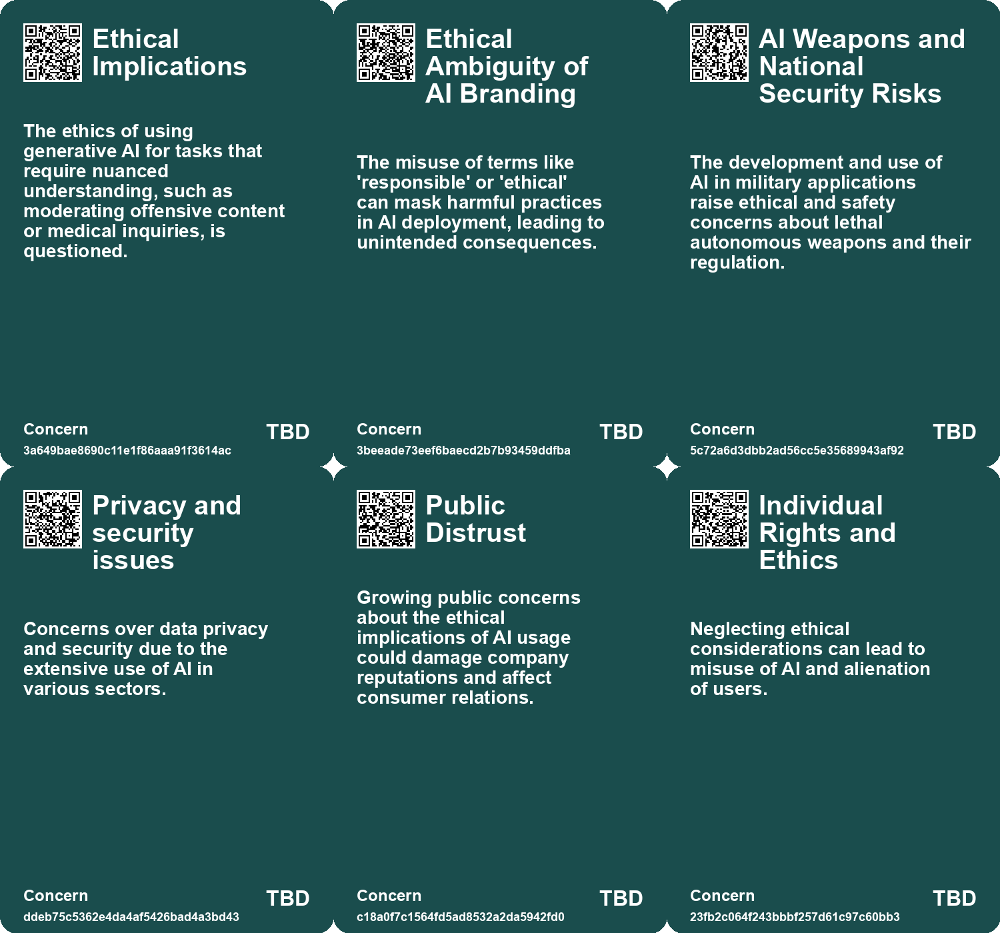
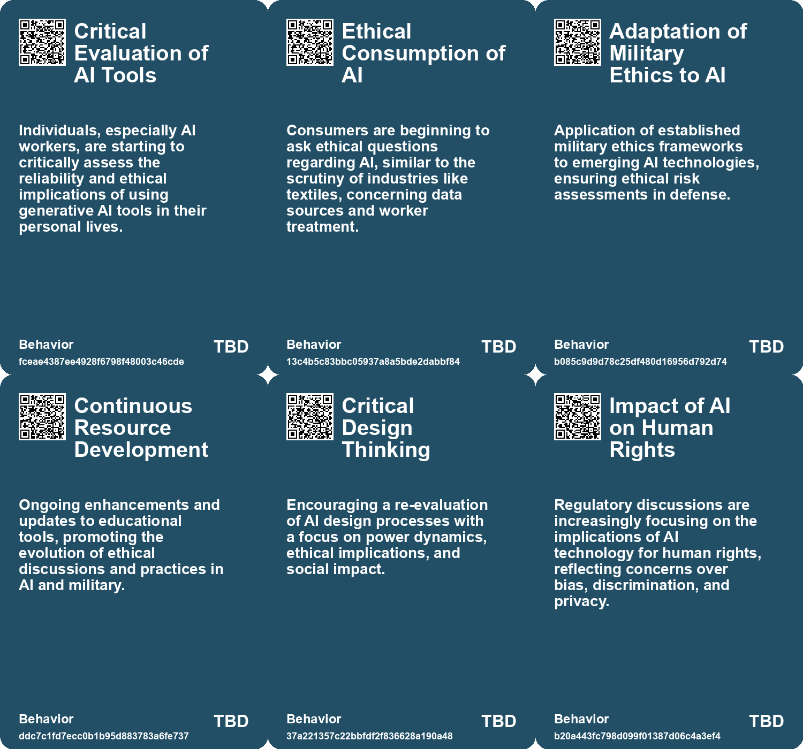
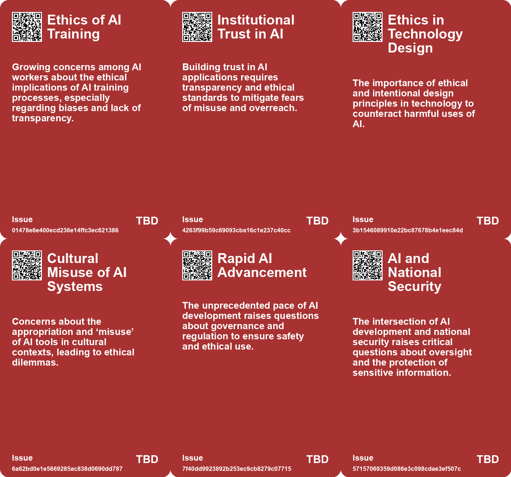
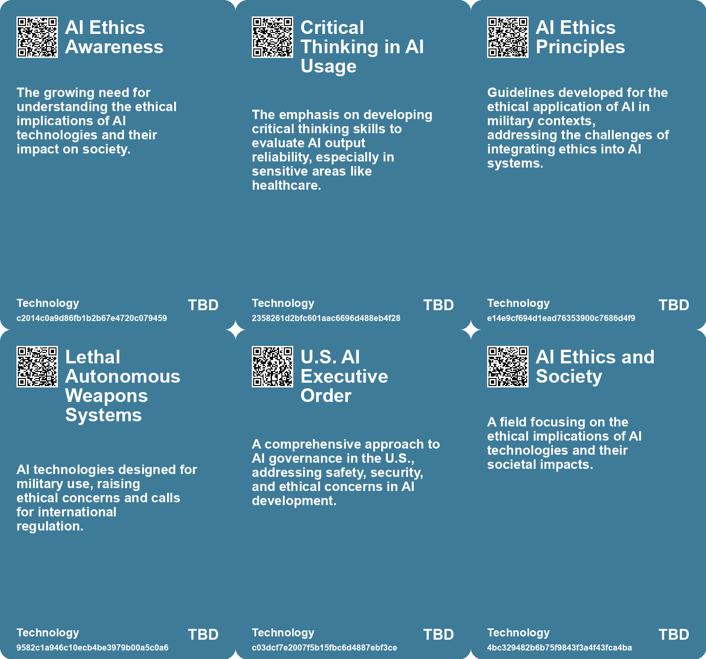

# *Topic*: Ethics of AI in Sensitive Domains

# Summary

The rapid advancement of artificial intelligence (AI) has raised significant concerns about its ethical implications and the need for regulation. OpenAI's introduction of ChatGPT has ignited discussions about the pace of AI development, with calls for a pause in research due to fears of unintended consequences. Experts emphasize the importance of transparency and ethical governance as AI becomes increasingly integrated into various sectors. The European Union's proposed Artificial Intelligence Act aims to address some of these risks, although it does not specifically target generative AI.

Data privacy and security are critical issues as organizations adopt generative AI tools. A report indicates that a notable percentage of employee interactions with AI include sensitive information, raising alarms for Chief Information Security Officers. The challenge is compounded by the use of unauthorized AI applications, which can lead to data leaks and flawed outputs. Experts advocate for comprehensive AI strategies to mitigate these vulnerabilities.

Trustworthy AI development is a priority for many countries, with Singapore taking proactive steps to ensure ethical practices through collaboration among various organizations. The Responsible AI Institute highlights the need for governance frameworks to address concerns such as bias, privacy, and cybersecurity. Organizations are encouraged to establish AI governance programs and comply with emerging regulations.

The ethical implications of AI are further underscored by the experiences of AI workers, who express distrust in the technology due to rushed timelines and inadequate training. Many advocate against the use of generative AI tools, particularly in sensitive areas like healthcare, emphasizing the potential harms of unreliable AI-generated content.

Regulatory efforts are gaining momentum globally, with the U.S. and EU taking different approaches. The EU's AI Act establishes strict rules for high-risk AI applications, while the U.S. focuses on guidelines for federal agencies. Both regions are working towards international cooperation to ensure safe AI development.

The contributions of women and marginalized communities in AI are increasingly recognized, challenging the narrative that only a few individuals drive advancements in the field. This acknowledgment is crucial for fostering diversity and addressing gender bias in AI algorithms.

Finally, the potential of AI to contribute to the United Nations Sustainable Development Goals is significant, with applications in areas such as health, education, and environmental protection. However, challenges remain, including funding disparities and the risks of bias and misinformation. Collaboration among stakeholders is essential to harness AI's capabilities for social good while addressing the ethical dilemmas it presents.

# Seeds

|    | name                                     | description                                                                                               | change                                                                                                      | 10-year                                                                                                               | driving-force                                                                                                      |
|---:|:-----------------------------------------|:----------------------------------------------------------------------------------------------------------|:------------------------------------------------------------------------------------------------------------|:----------------------------------------------------------------------------------------------------------------------|:-------------------------------------------------------------------------------------------------------------------|
|  0 | Calls for Transparency in AI Development | AI workers advocate for more transparency about AI data sources and ethical practices.                    | Transition from opaque development processes to demands for clear disclosure from AI companies.             | Increased demands for transparency may lead to more ethical AI practices across the industry.                         | Public awareness and potential backlash from unethical AI practices drive calls for transparency.                  |
|  1 | Growing Interest in AI Ethics Education  | There is a rising interest in educating others about AI ethics and practices.                             | From lack of discourse on AI ethics to more vocal advocacy for education and awareness.                     | In 10 years, AI ethics education may become integral in tech curricula and public discourse.                          | Concerns over misinformation and ethical implications prompt educational initiatives in AI ethics.                 |
|  2 | Scaled Decision Making Risks             | AI enables decisions at unprecedented speed and volume, raising ethical concerns.                         | Move from individualized decision-making processes to automated, large-scale decision-making.               | Widespread acceptance of systems where AI-backed decisions impact large populations instantly.                        | Economic advantages driving organizations to leverage AI for efficiency while ignoring ethical implications.       |
|  3 | Economic Incentives for Ethical AI       | Recognizing the need to create systems that foster ethical AI use and accountability.                     | Transition from unregulated AI usage to enshrined ethics and economic incentives for fairness.              | Infrastructures ensure that AI development aligns with ethical norms and human rights considerations.                 | Public awareness and demand for accountability in AI usage necessitating institutional reforms.                    |
|  4 | Ethics in Military AI Development        | A growing emphasis on ethical frameworks in the military AI sector due to lack of prior exposure.         | Shift from AI development focused solely on technical aspects to a comprehensive approach including ethics. | In ten years, military AI developers will have a robust understanding of ethics integrated into their work processes. | The necessity to align AI development with ethical principles to prevent misuse and ensure responsible deployment. |
|  5 | Growing Demand for Ethical AI Practices  | An increasing focus on ethical considerations in AI development and use.                                  | From a technology-first approach to prioritizing ethics and social implications.                            | Ethical AI will become a standard expectation, influencing AI development and deployment.                             | The need to balance innovation with societal impacts and ethical responsibilities.                                 |
|  6 | Ethical Considerations in AI Development | Companies are beginning to address ethical concerns in the development of empathic AI.                    | Transition from unregulated AI development to a focus on ethical guidelines and practices.                  | Ethical frameworks for AI will be more established, impacting how AI interacts with users emotionally.                | Growing public awareness and concern regarding the implications of AI on human relationships.                      |
|  7 | Demand for Ethical AI                    | There is an increasing public demand for ethical considerations in AI development.                        | From unregulated AI development to a push for ethical standards and accountability.                         | In a decade, companies may face strict regulations and public scrutiny regarding AI ethics.                           | Public awareness and activism around the societal impacts of AI technologies.                                      |
|  8 | Shift in AI Development Paradigms        | The regulation prompts a rethinking of AI development frameworks, emphasizing ethics and societal values. | From profit-driven AI development to a model that prioritizes ethical considerations and societal impact.   | In ten years, AI development may prioritize ethical standards and societal benefits over mere profitability.          | The need for a balanced approach that considers societal impact alongside technological advancement.               |
|  9 | Public Discourse on AI Ethics            | The AI Act may catalyze broader societal discussions on the ethics of AI technologies.                    | From limited public engagement on AI ethics to a more informed and active discourse on ethical AI use.      | In ten years, public discourse may shape AI technologies, leading to more ethical practices across the industry.      | An increasing awareness of the implications of AI on society and individual rights.                                |

# Concerns

|    | name                                            | description                                                                                                                                               |
|---:|:------------------------------------------------|:----------------------------------------------------------------------------------------------------------------------------------------------------------|
|  0 | Ethical Implications                            | The ethics of using generative AI for tasks that require nuanced understanding, such as moderating offensive content or medical inquiries, is questioned. |
|  1 | Ethical Ambiguity of AI Branding                | The misuse of terms like 'responsible' or 'ethical' can mask harmful practices in AI deployment, leading to unintended consequences.                      |
|  2 | AI Weapons and National Security Risks          | The development and use of AI in military applications raise ethical and safety concerns about lethal autonomous weapons and their regulation.            |
|  3 | Privacy and security issues                     | Concerns over data privacy and security due to the extensive use of AI in various sectors.                                                                |
|  4 | Public Distrust                                 | Growing public concerns about the ethical implications of AI usage could damage company reputations and affect consumer relations.                        |
|  5 | Individual Rights and Ethics                    | Neglecting ethical considerations can lead to misuse of AI and alienation of users.                                                                       |
|  6 | Ethical Implications of AI in Emotional Support | The development and deployment of AI technologies in emotionally sensitive fields raises questions about consent, equity, and transparency.               |
|  7 | Ethical Implications of AI Deployment           | The deployment of AI technologies in surveillance and profiling raises moral questions about human rights violations.                                     |
|  8 | Ethical Guidelines in AI Development            | There is a lack of consensus on how to apply ethical principles to AI design and employment, risking inadequate governance of the technology.             |
|  9 | Ethical Risks of AI                             | AI technologies carry ethical risks alongside traditional risks, affecting fairness and accountability.                                                   |

# Cards

## Concerns

## Behaviors

## Issue

## Technology

# Links

* [A Timeline of Women's Contributions to AI Ethics and Advocacy from 2014 to 2023](https://futures.kghosh.me/2b3dffe867d32d85c04baf149e2444ea)
* [The Urgent Need for Ethical AI Regulations Amid Rapid Development and Deployment](https://futures.kghosh.me/382e9ebc1e518ee49e541da1e6b5f8af)
* [Understanding the Real Risks of AI Beyond Superintelligence and Scalability](https://futures.kghosh.me/ff7f7a51f925c273449a8648a18b7df8)
* [Harnessing AI for Social Good: Opportunities and Challenges in Achieving the UN SDGs](https://futures.kghosh.me/0d88d49818819d335d12f792275fde97)
* [U.S. Department of Commerce Announces New AI Safety and Trustworthiness Initiatives](https://futures.kghosh.me/fa4fc4145d0de8fe7d6c3a734a47557f)
* [Enterprise Risks of Data Leaks Through Generative AI Applications: Insights and Recommendations](https://futures.kghosh.me/8db2a36589f876d68d47c64440d9b91c)
* [Rethinking the Role of AI: From Political Tool to Ethical Design Options](https://futures.kghosh.me/c25cae2b8d72e7634d591247d9ac96d2)
* [Navigating the Complex Regulatory Landscape of Generative AI: Risks and Strategies for Organizations](https://futures.kghosh.me/43eafc183f7cc060f7cb7fed455e20a7)
* [European Parliament Adopts Historic Artificial Intelligence Act for Safety and Innovation](https://futures.kghosh.me/620cdc3041430333c4c479a471f67fdb)
* [Establishing Responsible AI Governance: A Guide for Organizations in an Evolving Landscape](https://futures.kghosh.me/fab122d29aed97045e0cc1ea77bdef44)
* [European Parliament Endorses Landmark AI Legislation to Ensure Ethical Development and Citizen Rights](https://futures.kghosh.me/550199f663e5e26f2824e80f55126c56)
* [The Vatican's Handbook on AI Ethics: A Guide to Responsible Technology Development](https://futures.kghosh.me/994781edb78a36cd547b86f570716280)
* [AI Governance: Comparing EU and U.S. Approaches Amidst Rapid Advancements](https://futures.kghosh.me/92c576db749f12173f65323567670895)
* [Microsoft Disbands AI Ethics and Society Division Amid Layoffs, Raising Concerns About Responsible AI Development](https://futures.kghosh.me/dc8173751ce4b0562a6a9cf47ee715ab)
* [Understanding the Three C’s of Data Participation: Context, Consent, and Control in AI](https://futures.kghosh.me/2251d443897c8e2b1369bb144d9252b5)
* [OpenAI CEO Highlights AI Risks to Election Integrity and Calls for Regulation](https://futures.kghosh.me/fd96f58595786b0820cca21394223a66)
* [The Role of Social-Emotional AI: Bridging or Widening the Gap in Human Connection?](https://futures.kghosh.me/8e191b6221caa8d9f27b19268ab8a048)
* [EU's New Code of Practice Aims to Enhance Transparency and Compliance in AI Industry](https://futures.kghosh.me/b4018274e2792c9e4e374ad3ce424478)
* [AI Workers Share Ethical Concerns and Distrust Over Generative AI Reliability and Safety](https://futures.kghosh.me/440c60817054047ca4be7ef38b8c3074)
* [Best Practices for Transparency in AI Under the EU AI Act: Insights from a Prototyping Project](https://futures.kghosh.me/d88cbb54d9e2d462585c4d515dd32067)
* [The Global Landscape of AI Regulation: Differing Approaches and Challenges Ahead](https://futures.kghosh.me/c3301a7146d6814214205c4b43376f17)
* [Exploring the Future of AI in Knowledge Ecosystems and Global Challenges](https://futures.kghosh.me/a9266018b458295480a07167310458a9)
* [Recent Developments in AI Regulation and Technology: A Review of Key Initiatives and Critiques](https://futures.kghosh.me/a009ccdffaa59f53de56887aa19e6239)
* [The Knowledge Tree: A Flexible Learning Tool for AI Ethics in Military Contexts](https://futures.kghosh.me/7788db31bd344bae4cb0eb7c77e36b16)