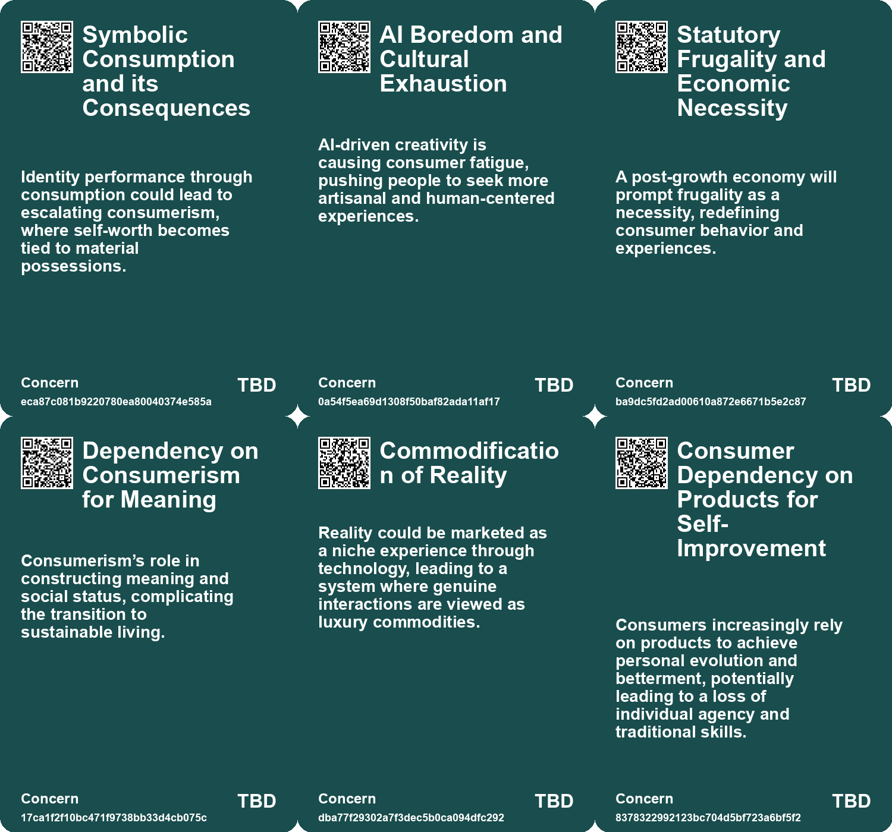
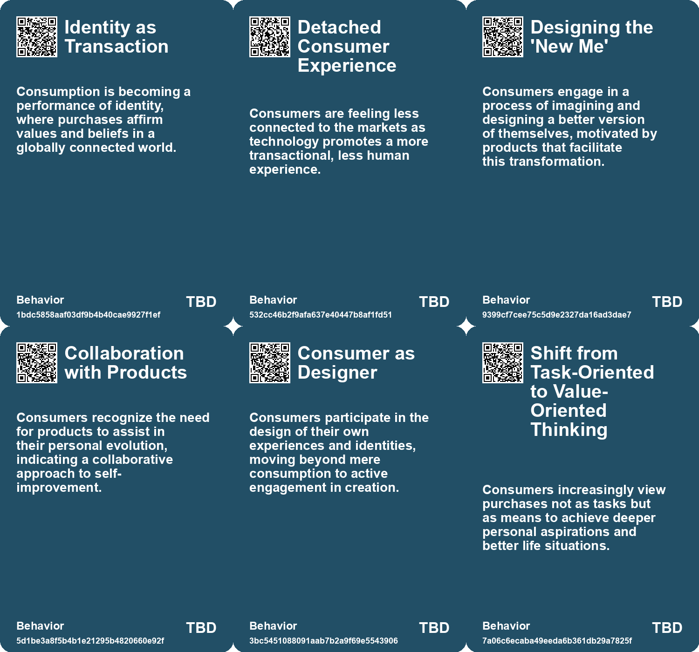
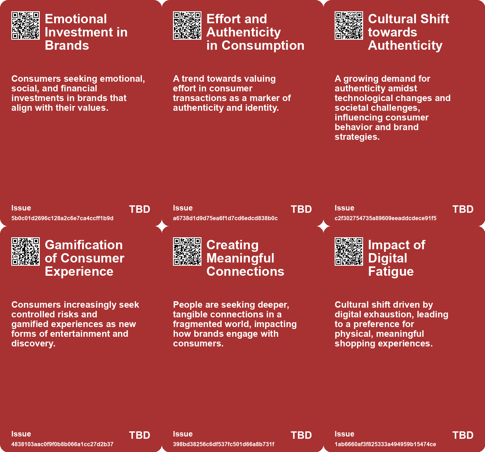
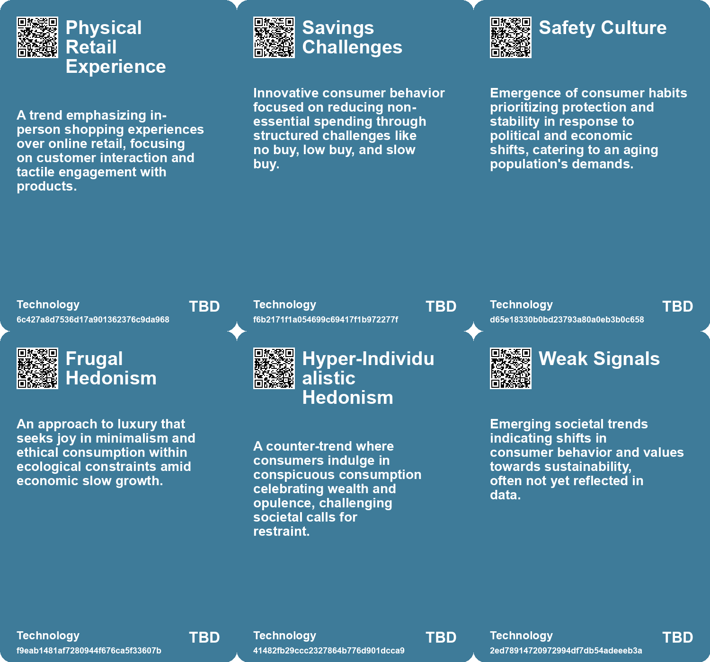

# *Topic*: Experience-Driven Consumerism

# Summary

The evolving landscape of consumer behavior reveals a growing desire for authenticity and deeper connections. As technology advances, particularly with AI, there is a notable tension between human-created and machine-generated content. This shift is prompting brands to adapt their strategies, focusing on community-centric experiences that resonate with consumers seeking genuine engagement. The rise of playful escapism and the blending of entertainment with brand experiences reflect a cultural shift towards valuing connection over mere consumption.

Amidst these changes, younger generations, particularly Gen Z, are redefining shopping habits and career aspirations. They prefer physical retail spaces as social hubs, seeking immersive experiences that allow them to disconnect from digital fatigue. This demographic is also approaching personal finance with caution, prioritizing mental well-being and fulfillment over traditional financial goals. Their unique challenges, including economic instability and climate concerns, are shaping a new narrative around work and financial security.

The concept of hyper-personalization is gaining traction, driven by technology that allows brands to tailor experiences to individual preferences. However, this trend raises questions about the implications of an increasingly individualistic culture, where identity performance is tied to consumption. The symbolic economy emphasizes narratives and brand engagement, as consumers seek products that reflect their values in a globally connected world.

In the realm of creativity, artists and creators face mounting pressure to build personal brands and engage in self-promotion. This shift is a response to the corporate consolidation in creative industries, where financial viability often overshadows artistic integrity. The rise of social media has transformed the landscape, compelling artists to navigate marketing strategies to gain visibility.

As economic conditions fluctuate, a 'casino economy' emerges, characterized by financialization and a widening wealth gap. The focus on short-term gains and efficiency often comes at the expense of traditional growth, leading to a K-shaped recovery where the affluent thrive while the lower class struggles. This economic reality intertwines with cultural shifts, as individuals turn to materialism and spirituality for security amidst uncertainty.

The discourse surrounding creativity has evolved significantly since the post-World War II era. Initially a neglected topic, creativity has become a cultural imperative, associated with personal fulfillment and professional success. However, the dualities of optimism versus pessimism and elitism versus egalitarianism continue to shape contemporary perceptions of creativity and the individuals labeled as 'creatives.'

Finally, the concept of "Everything as a Service" highlights a transactional mindset that permeates various aspects of life. This commodification of social issues raises concerns about the outsourcing of personal agency and the quest for meaning. The critique of consumer capitalism emphasizes the need for self-actualization and the pursuit of purpose beyond material possessions. As society grapples with these themes, the search for authenticity and fulfillment remains a central narrative in the evolving cultural landscape.

# Seeds

|    | name                                         | description                                                                                     | change                                                                                               | 10-year                                                                                                              | driving-force                                                                                                    |
|---:|:---------------------------------------------|:------------------------------------------------------------------------------------------------|:-----------------------------------------------------------------------------------------------------|:---------------------------------------------------------------------------------------------------------------------|:-----------------------------------------------------------------------------------------------------------------|
|  0 | Decline of Traditional Institutions          | Growing trust in brands over traditional moral authorities is reshaping consumer relationships. | From religious and civic guidance to brand influence in moral and ethical choices.                   | Brands will increasingly fulfill roles of community and guidance traditionally held by religious institutions.       | Societal disillusionment with traditional institutions and the rise of consumer activism.                        |
|  1 | Emotionally Investment in Brands             | Consumers are looking to invest emotionally and socially in brands they resonate with.          | Shift from transactional customer relationships to emotional stakeholding in brands.                 | Consumer-brand relationships will deepen, leading to personalized brand experiences and loyalty.                     | The human desire for identity affirmation drives emotional connections with brands.                              |
|  2 | Cultural Shift Towards Authenticity          | A growing preference for genuine experiences over digital interactions.                         | Shift from digital-based connections to a focus on authentic human experiences.                      | In 10 years, digital interactions might be minimized in favor of in-person engagements.                              | The need for deeper connections amidst technological overwhelm and societal anxiety.                             |
|  3 | Gamification of Risk                         | Consumers are embracing gamified risks as entertainment and discovery.                          | Transition from traditional entertainment to risk-based, gamified experiences.                       | In a decade, risk-based entertainment might be a mainstream way to engage audiences.                                 | A need for engagement and excitement in uncertain times drives this trend.                                       |
|  4 | Experience Over Product Focus                | Shoppers now prioritize the experience of shopping rather than just the products themselves.    | Shift from product-centric retail to experience-centric offerings.                                   | Shopping may encompass a broader lifestyle experience, integrating various aspects of life and culture.              | Increasing consumer awareness and interest in holistic shopping experiences.                                     |
|  5 | Shift to Customer-Driven Marketing           | Companies are moving towards strategies that prioritize customer preferences and behaviors.     | Transitioning from traditional marketing to a more personalized, customer-driven approach.           | In ten years, businesses could fully automate personalized marketing strategies using real-time customer data.       | The increasing demand for personalized experiences from consumers is driving this shift in marketing strategies. |
|  6 | Hyper-Personalization Trends                 | The push towards hyper-personalized marketing experiences based on individual customer data.    | Transitioning from generic marketing to highly personalized approaches tailored to individual needs. | In the future, customers may expect and receive completely tailored marketing strategies in real-time.               | Consumer expectations for personalized experiences are increasing, driving marketers to innovate.                |
|  7 | Shift towards alternative hedonism           | Emphasis on lifestyle changes that enhance happiness while reducing consumption.                | From a high-consumption lifestyle to one focused on well-being and reduced environmental impact.     | In ten years, society may prioritize leisure and community over material possessions, leading to a happier populace. | Growing awareness of climate change and mental health issues drives the search for sustainable happiness.        |
|  8 | Shift in Brand Authority                     | Gen Z views themselves as experts rather than passive consumers influenced by brands.           | From top-down brand messaging to collaborative partnerships with consumers.                          | Brands will adopt a more collaborative approach, prioritizing consumer input and co-creation.                        | A desire for authenticity and partnership in purchasing decisions.                                               |
|  9 | Cultural Shift towards 'Bespoke Consumption' | Consumer expectations are shifting towards customized and tailored products.                    | Transitioning from mass consumption to bespoke consumption paradigms.                                | In ten years, consumer products will likely be predominantly personalized, affecting production methods.             | Consumer desire for unique and personalized experiences in a saturated market.                                   |

# Concerns

|    | name                                                 | description                                                                                                                                                      |
|---:|:-----------------------------------------------------|:-----------------------------------------------------------------------------------------------------------------------------------------------------------------|
|  0 | Symbolic Consumption and its Consequences            | Identity performance through consumption could lead to escalating consumerism, where self-worth becomes tied to material possessions.                            |
|  1 | AI Boredom and Cultural Exhaustion                   | AI-driven creativity is causing consumer fatigue, pushing people to seek more artisanal and human-centered experiences.                                          |
|  2 | Statutory Frugality and Economic Necessity           | A post-growth economy will prompt frugality as a necessity, redefining consumer behavior and experiences.                                                        |
|  3 | Dependency on Consumerism for Meaning                | Consumerism’s role in constructing meaning and social status, complicating the transition to sustainable living.                                                 |
|  4 | Commodification of Reality                           | Reality could be marketed as a niche experience through technology, leading to a system where genuine interactions are viewed as luxury commodities.             |
|  5 | Consumer Dependency on Products for Self-Improvement | Consumers increasingly rely on products to achieve personal evolution and betterment, potentially leading to a loss of individual agency and traditional skills. |
|  6 | Micro-Influencing as a New Norm                      | Brands must adapt to the micro-influencing trend where consumers expect to engage as experts rather than passive recipients of marketing.                        |
|  7 | Experience over Transaction                          | There's a growing expectation for retailers to provide memorable experiences rather than just transactional interactions.                                        |
|  8 | Cultural Shifts in Consumer Behavior                 | As Gen Z seeks social experiences over traditional shopping, malls must continuously evolve to meet changing preferences.                                        |
|  9 | Consumerism and Identity Crisis                      | A culture centered on hyper-personalization may create issues of identity and self-worth tied to consumer choices.                                               |

# Cards

## Concerns

## Behaviors

## Issue

## Technology

# Links

* [The Shift from E-commerce to In-Person Retail Experiences in Fashion](https://futures.kghosh.me/2db44f1091d08697f6f525dbe8740189)
* [Brands Embrace Age Diversity: Engaging Consumers Across Generations](https://futures.kghosh.me/f7a0c499386ab051f0f92f3f4749c73d)
* [Future Trends Post-2024: Declining Democracies and Emerging Cultural Shifts](https://futures.kghosh.me/bd1b01636b1360716b5951e1cac42724)
* [Transforming Marketing with Customer Driven Strategies and Digital Twins](https://futures.kghosh.me/f5a86c6c3c113719814d2772bea54508)
* [Polaroid’s Shift: From Creativity to Authenticity in the Age of AI](https://futures.kghosh.me/ba6b48e83806da532c7578d24e914455)
* [Exploring the Modern Entertainment Landscape and Its Societal Implications](https://futures.kghosh.me/c5c2c794f1426e6e307a9df3f9ff61f6)
* [Exploring the Dangers of Outsourcing Happiness and Personal Fulfillment in Modern Society](https://futures.kghosh.me/a5c0ba498382a4edc0f2bf0d9653ad16)
* [Understanding the Casino Economy: How Financialization Shapes Our Lives and Beliefs](https://futures.kghosh.me/f4ca03eca53c5d3b3ccc3dd5b1a9aeb4)
* [Understanding Jobs to be Done (JTBD): A Theory of Consumer Motivation and Innovation](https://futures.kghosh.me/110ac9459692757f523d5d37b79eaf3d)
* [Gen Z's Evolving Financial Mindset: Prioritizing Wellness Over Wealth Amid Economic Uncertainty](https://futures.kghosh.me/1b41206075bb58ef4a1bcb8a6d82ffc0)
* [Concerns Over Inflation Drive Americans to Adopt Spending Reduction Habits](https://futures.kghosh.me/713b509d3ed652f3a8dbfe7c90bcd0b9)
* [Challenges and Optimism Among Gen Z and Millennials in Today's Workforce](https://futures.kghosh.me/6a3ae004f0a8a65faa7b7126cccc75f2)
* [The Burden of Self-Promotion: Navigating Art in the Age of Personal Branding](https://futures.kghosh.me/2306b74e2c380b5208c7752bd78c4e12)
* [The Rise of the Symbolic Economy: Identity Through Consumption in a Globalized World](https://futures.kghosh.me/f836699644240599a4284c78b9ade0e1)
* [Understanding Gen Z Shopping Preferences: The Shift Towards Community and Experience in Retail](https://futures.kghosh.me/adc1258885aa937c5350875662ee892f)
* [Exploring Kate Soper’s Vision for Sustainable Living in 'Post-Growth Living'](https://futures.kghosh.me/71cbf82b85b58a6675d05308f8e1759e)
* [The Rise of Creativity: Understanding Its Evolution and Cultural Impact Since WWII](https://futures.kghosh.me/4704e0c971a5aab83464d9025df5fe6d)
* [Exploring the Impact of Hyper-Personalization in the Age of AI and Individualism](https://futures.kghosh.me/9ef1218bf5010b0780647b93d724b93b)
* [The Revival of Malls: How Gen Z is Reshaping Shopping Destinations](https://futures.kghosh.me/3c27a71013ec18bf55a80ae739105bd7)
* [The Fourth Era of Brand Communities: Integrating Events with Marketing Strategies](https://futures.kghosh.me/c179345a7154fb8f3f2f4209ed487406)
* [Five Emerging Trends Transforming Business in the Coming Year](https://futures.kghosh.me/55bac03899915f25bf0b47fa4342472c)
* [Exploring the Cultural Trends Shaping Consumer Behavior in 2026](https://futures.kghosh.me/05be870bd93b19dc0390539dc923ae7b)
* [Exploring the Disconnection Between AI Promises and Reality at CES 2023](https://futures.kghosh.me/761a3d9b508c2a1db7a6c60d1be5ec98)
* [Understanding Consumer Behavior Through the Paradox of Choice in Marketing Strategies](https://futures.kghosh.me/2984dbbe72632bf58e801f864ee3a33f)
* [Navigating Jevons Paradox: Embracing Authenticity in a Productivity-Driven World](https://futures.kghosh.me/fc47a0f6771688b5d00260a9567c1fee)
* [Essential Career Lessons for Success Across Decades in Today’s Workforce](https://futures.kghosh.me/a06d27f1dd5a2328ba6aa8854abc5318)