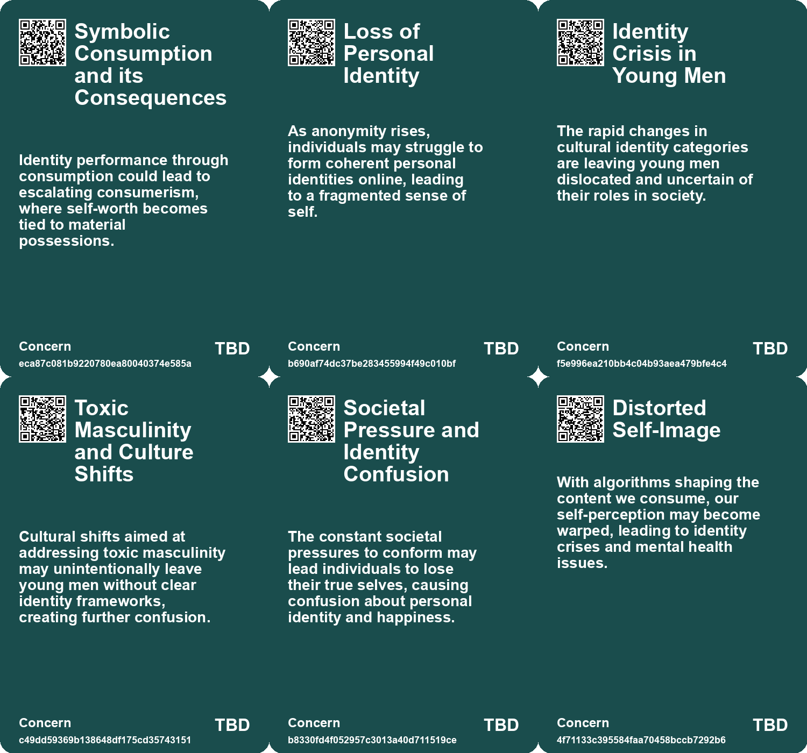
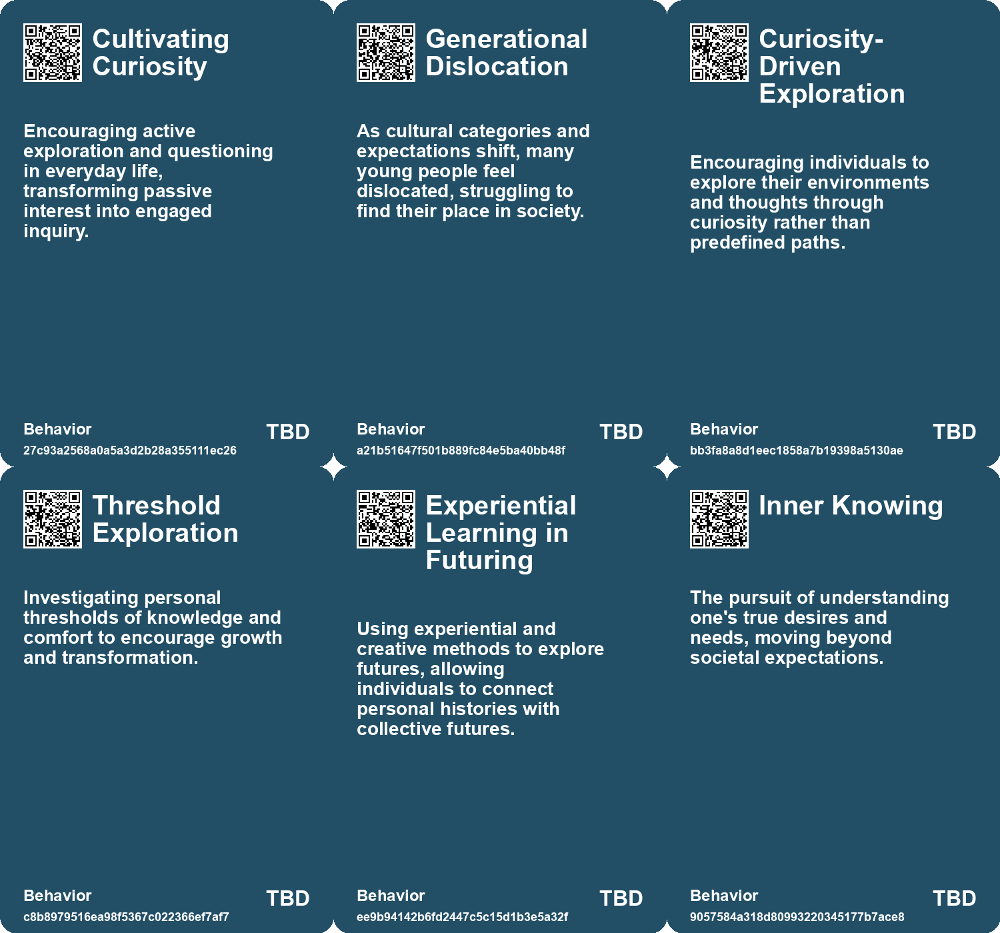
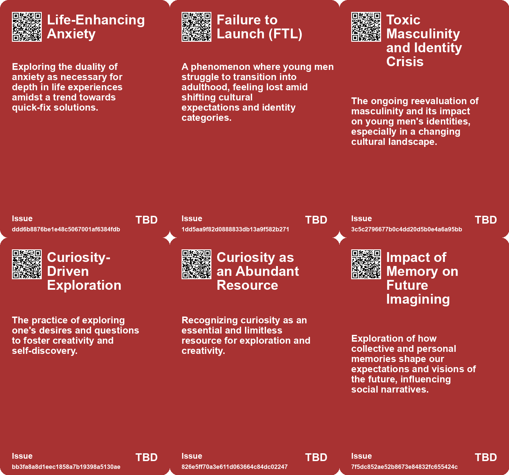
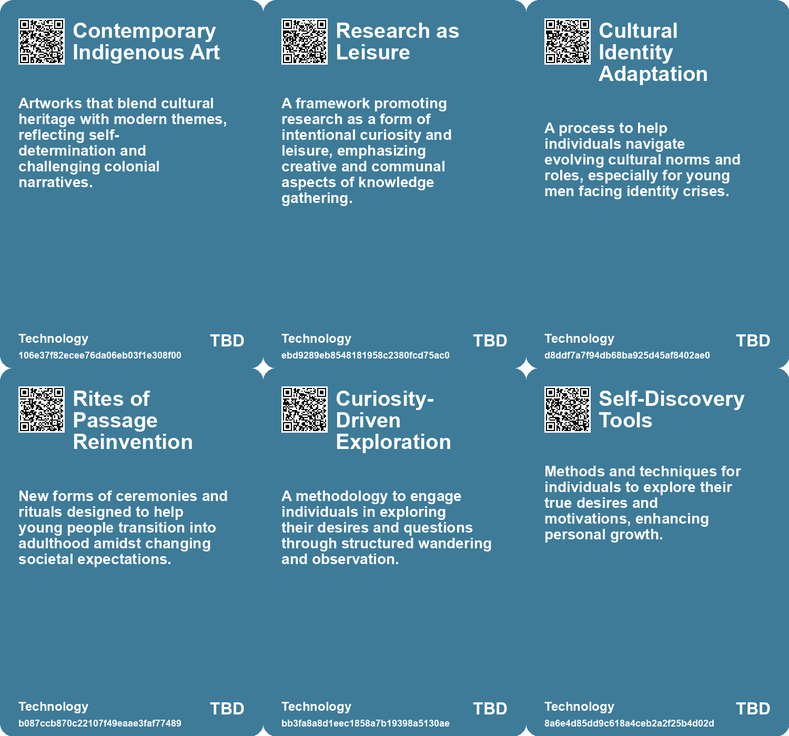

# *Topic*: Exploration of Identity

# Summary

The exploration of identity and personal fulfillment emerges as a central theme across various discussions. The concept of "Failure to Launch" highlights the struggles young men face in transitioning to adulthood, emphasizing the need for clear developmental pathways in a rapidly changing cultural landscape. Similarly, the importance of self-possession and understanding one's true desires is examined in Marion Milner's reflections on happiness, suggesting that genuine fulfillment comes from mindfulness and acceptance of life's offerings.

The impact of technology on personal experiences and societal dynamics is another significant theme. The rise of targeted advertising on platforms like Facebook illustrates how algorithmic profiling shapes our online interactions and perceptions, leading to a loss of privacy and authenticity. This concern extends to the broader implications of technology, where the commodification of experiences and the transactional nature of modern life create dissatisfaction and a sense of disconnection from genuine human relationships.

Art and creativity serve as powerful tools for exploring and expressing identity. The integration of Futurism in contemporary Indigenous art showcases how artists respond to colonial trauma while envisioning alternative futures. This dialogue between past and present highlights the resilience of cultural identities and the potential for art to foster community and healing. The transformative power of art is further emphasized in personal narratives that reflect on the beauty found in everyday moments, underscoring the importance of genuine connections and the awe of existence.

The evolving nature of work and its relationship to personal values is critically examined. The shift away from traditional career models towards meaningful work aligns with the "Great Resignation," where individuals seek fulfillment that resonates with their values. This reevaluation of priorities is echoed in the concept of "Everything as a Service," which critiques the outsourcing of personal agency and the search for meaning in a commodified world.

The theme of curiosity and exploration is also prevalent, with guides encouraging individuals to embrace their inquisitive nature. The idea of question-paths promotes self-discovery and the importance of movement and observation in enhancing self-awareness. This pursuit of knowledge and understanding is framed as a remedy for cultural fragmentation, advocating for a return to deep engagement with texts and ideas.

Finally, the discussions surrounding societal narratives and political dynamics reflect a broader cultural shift. The analysis of Trump's potential 2024 election victory highlights the interplay of economic factors, gender dynamics, and the evolving image of political parties. This examination reveals how emotions and symbols increasingly shape public perception, moving away from traditional information-driven narratives.

These interconnected themes illustrate the complexities of modern life, emphasizing the need for authenticity, meaningful connections, and a deeper understanding of oneself and society.

# Seeds

|    | name                               | description                                                                                      | change                                                                                          | 10-year                                                                                             | driving-force                                                                                             |
|---:|:-----------------------------------|:-------------------------------------------------------------------------------------------------|:------------------------------------------------------------------------------------------------|:----------------------------------------------------------------------------------------------------|:----------------------------------------------------------------------------------------------------------|
|  0 | Exploration of Vulnerability       | Recognition of vulnerability as a key element in authentic experiences of awe and life.          | Transition from avoidance of vulnerability to embracing it for deeper connections.              | Greater acceptance and understanding of vulnerability leading to stronger relationships.            | Increasing awareness of the need for depth in personal experiences and connections.                       |
|  1 | Failure to Launch (FTL) Phenomenon | Young men struggle to transition into adulthood, feeling lost and disconnected.                  | Shift from clear rites of passage to a vague transition into adulthood.                         | More personalized and supportive pathways for young men transitioning to adulthood are developed.   | Cultural shifts that challenge traditional male identity and the need for supportive structures.          |
|  2 | Crisis of Identity Categories      | Increasing ambiguity in identity categories leads to confusion among adolescents.                | Cultural identity categories are becoming less defined and more fluid.                          | Young adults may have a broader, more flexible understanding of identity.                           | The ongoing cultural re-evaluation of gender roles and identities.                                        |
|  3 | Generational Rescue Efforts        | There is a call to support young men in reclaiming their agency and identity.                    | From neglecting the struggles of young men to actively addressing their needs.                  | Support networks may be established to empower young men in their transitions.                      | The recognition of the impact of cultural shifts on vulnerable populations.                               |
|  4 | Question-Paths Exploration         | Emphasis on exploring conceptual routes to enhance curiosity and understanding.                  | Shift from linear thinking to a more exploratory, curiosity-driven approach.                    | In 10 years, individuals may prioritize curiosity-led exploration over rigid knowledge acquisition. | A growing desire for personal growth and deeper understanding of complex issues.                          |
|  5 | Emphasis on Relationality          | Exploring the connections between ideas and themes to foster deeper understanding.               | From isolated thinking to recognizing the interplay of concepts and ideas.                      | In 10 years, collaborative and relational thinking may be integral to problem-solving.              | The increasing complexity of global challenges requiring interdisciplinary collaboration.                 |
|  6 | Authenticity Movement              | A growing movement emphasizing the importance of authenticity in personal and professional life. | From conforming to societal expectations to embracing one's true self and values.               | A society that celebrates diverse expressions of identity and individual authenticity.              | The desire for genuine connections and fulfillment in a world of social media and superficial validation. |
|  7 | Crisis of Masculinity              | Men are struggling to find their identity and role in modern society.                            | From traditional roles to a nebulous understanding of masculinity.                              | Potential rise in mental health issues among men if support systems do not evolve.                  | Cultural shifts and changing gender dynamics that leave men feeling marginalized.                         |
|  8 | Fluidity of Identity               | Growing acceptance of diverse and contextual identities beyond generational labels.              | Shift from fixed generational labels to recognizing diverse, evolving identities.               | In ten years, identity will be seen as multifaceted and dynamic, shaping social interactions.       | Desire for individual authenticity and complexity in self-identification.                                 |
|  9 | Cultural Reflection on Masculinity | Cultural critiques of masculinity and the exploration of new, healthier identities.              | From rigid, toxic masculinity to a more fluid and compassionate understanding of male identity. | Masculinity might evolve to embrace a broader spectrum of emotional and social roles for men.       | Societal changes demanding more inclusive and diverse representations of masculinity.                     |

# Concerns

|    | name                                      | description                                                                                                                                              |
|---:|:------------------------------------------|:---------------------------------------------------------------------------------------------------------------------------------------------------------|
|  0 | Symbolic Consumption and its Consequences | Identity performance through consumption could lead to escalating consumerism, where self-worth becomes tied to material possessions.                    |
|  1 | Identity Crisis in Young Men              | The rapid changes in cultural identity categories are leaving young men dislocated and uncertain of their roles in society.                              |
|  2 | Toxic Masculinity and Culture Shifts      | Cultural shifts aimed at addressing toxic masculinity may unintentionally leave young men without clear identity frameworks, creating further confusion. |
|  3 | Societal Pressure and Identity Confusion  | The constant societal pressures to conform may lead individuals to lose their true selves, causing confusion about personal identity and happiness.      |
|  4 | Fear of Vulnerability                     | A lack of willingness to face insecurities and vulnerabilities may create barriers to authentic living and self-discovery.                               |
|  5 | Impediments to Self-Reflection            | Societal distractions and pressures may impede the essential self-reflective practices needed for personal discovery and clarity.                        |
|  6 | Distorted Self-Image                      | With algorithms shaping the content we consume, our self-perception may become warped, leading to identity crises and mental health issues.              |
|  7 | Mental Health Impacts of Redefining Work  | The search for meaningful work can lead to increased stress and anxiety as individuals grapple with their evolving identities and values.                |
|  8 | Multiplicity of Identity                  | The rejection of generational labels may create confusion in identity representation in media and marketing, complicating societal engagement.           |
|  9 | Resistance to Change and Growth           | The difficulty of moving from past identities to current realities, particularly during times of personal or relational change.                          |

# Cards

## Concerns

## Behaviors

## Issue

## Technology

# Links

* [Exploring RADAR's Resolutions: Ten Transformative Visions for 2023](https://futures.kghosh.me/0159774192872e1fdb6ebd7c80dbb9de)
* [Understanding 'Failure to Launch': The Cultural and Economic Struggles of Young American Men](https://futures.kghosh.me/c6a3cc9fe503779d0ad2ec2c66aa7fb8)
* [Marion Milner's Insights on Happiness and Self-Discovery in A Life of One’s Own](https://futures.kghosh.me/c6edc507c66b1ec2ce7ccd9e6361c112)
* [Exploring the Modern Entertainment Landscape and Its Societal Implications](https://futures.kghosh.me/c5c2c794f1426e6e307a9df3f9ff61f6)
* [Reflections on Unconventional Paths and Creative Fulfillment in Life](https://futures.kghosh.me/8a01dfcc1e72828381a84487c32bd572)
* [Exploring Goal Flexibility and AI's Impact on Creativity and Connection](https://futures.kghosh.me/94d31e760d2d34d7355ef3ee6bf47ffe)
* [Finding Connection and Beauty in Garry Winogrand's Photography: A Personal Reflection](https://futures.kghosh.me/ab6e3fcdacd5615fd45dda4664c395e5)
* [Maximizing Life Returns: The Pursuit Mapping Exercise for Fulfillment and Success](https://futures.kghosh.me/7632526d8354e59e27adb52bd988d1aa)
* [Exploring Six Narratives on Trump's 2024 Election Victory and Quincy Jones' Creative Philosophy](https://futures.kghosh.me/36a55767a1e538cce12f75e314c80bb8)
* [Exploring Future Concepts: Julio Cortázar's Influence and Alternative Models](https://futures.kghosh.me/b8b0a7af9c851d7f68d775d61199fa62)
* [Reviving Research as Leisure: Embracing Curiosity and Reading Culture for Civilization's Future](https://futures.kghosh.me/e3389ae6863265accc860c33c364c11f)
* [The Rise of the Symbolic Economy: Identity Through Consumption in a Globalized World](https://futures.kghosh.me/f836699644240599a4284c78b9ade0e1)
* [The Psychological Impact of Algorithmic Profiling and Surveillance on Self-Identity in the Digital Age](https://futures.kghosh.me/70ebc812b72117e2ce11248d77ec7d37)
* [Nostalgia for Simplicity: The Burden of Infinite Choice in Modern Life](https://futures.kghosh.me/7b316ebe449187b79e519a8c6d12a2cd)
* [Exploring Futurism in Indigenous Art: Future Imaginaries Exhibit](https://futures.kghosh.me/d688ddddbb61a934e594c21b14d2aaf6)
* [Navigating the AI Revolution: Displacement, Authenticity, and Trust in Digital Content](https://futures.kghosh.me/19b33a2f2bd407e37ddde7951fd18ee8)
* [Exploring Meaning and Fulfillment in a Transformative Work Landscape](https://futures.kghosh.me/561aac9a4c6d3a468f1b8c9a141a8b76)
* [Exploring Curiosity: A Guide to Falling Down Rabbit Holes of Inquiry](https://futures.kghosh.me/f2b683b13837d892795ddf32eebdccd8)
* [The Importance of Authentic Experiences and Awe in a Tech-Dominated World](https://futures.kghosh.me/ce43c884bb8eefce9268368190014a48)
* [Understanding Polarization: Healing Our Relationship with Technology and Embracing Diverse Perspectives](https://futures.kghosh.me/c1bb890337ef382bfaa5720c9fd05134)
* [Exploring Psychedelic Masculinity: Athletes, Emotional Growth, and Toxicity](https://futures.kghosh.me/96831e5a59b49b51b8a5a00eee72e863)
* [Exploring the Dangers of Outsourcing Happiness and Personal Fulfillment in Modern Society](https://futures.kghosh.me/a5c0ba498382a4edc0f2bf0d9653ad16)